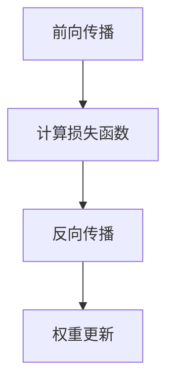
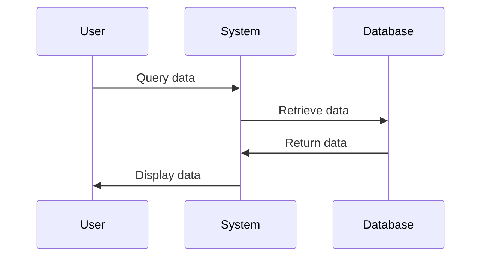

                 


### 引言

**《数学与神经网络：人工神经元的数学模型》**

**关键词**：数学、神经网络、人工神经元、数学模型

**摘要**：
本文深入探讨了数学与神经网络之间的紧密联系，特别是人工神经元的数学模型。通过逐步的分析和推理，本文旨在揭示神经网络背后的数学原理，并提供对这一领域的全面理解。我们将从背景介绍、核心概念和原理、算法解释、数学模型、系统设计、实战项目、最佳实践等方面，层层剖析这一复杂但重要的技术领域。

在接下来的章节中，我们将首先介绍数学与神经网络的历史背景和基本概念，然后深入探讨人工神经元的数学模型，包括其核心原理和数学公式。接着，我们将探讨神经网络的高级数学主题，如深度学习和优化技术。随后，我们将分析神经网络的设计原则和架构，并通过实际项目展示如何将这些理论应用于实践。最后，我们将总结最佳实践，并提供进一步阅读的推荐。

### 第1章 引言到数学与神经网络

**1.1 背景：数学与神经网络的发展**

在探讨数学与神经网络的交汇点之前，我们需要了解两者各自的背景和发展历程。

#### 1.1.1 数学的发展

数学是一门古老的学科，其起源可以追溯到古代文明的数学成就。从古埃及和巴比伦的算术和几何，到古希腊的数学理论，数学的发展经历了数千年的演变。在近现代，数学的进步推动了科学和技术的飞跃发展。特别是19世纪的数学革命，如微积分和集合论的诞生，为现代数学奠定了基础。

#### 1.1.2 神经网络的发展

神经网络的研究可以追溯到1943年，由心理学家McCulloch和数学家Pitts提出的“麦卡洛克-皮茨神经元”模型。这一早期模型为后来的神经网络研究奠定了基础。然而，神经网络在20世纪80年代之前并没有得到广泛的关注。随着计算机性能的提升和大数据的出现，神经网络在20世纪90年代重新兴起，特别是在深度学习领域取得了突破性进展。

#### 1.1.3 数学与神经网络的结合

数学与神经网络的结合可以追溯到神经网络模型的数学表示。例如，神经网络中的激活函数、权重更新规则和优化算法都需要数学工具来理解和分析。此外，数学的抽象概念，如线性代数和微积分，为神经网络的设计和训练提供了理论基础。

### 1.1.4 历史背景和重要里程碑

了解数学与神经网络的历史背景和重要里程碑，有助于我们更好地理解这一领域的现状和未来发展。

- **1943年：** McCulloch和Pitts提出了第一个神经网络模型，为神经网络研究奠定了基础。
- **1958年：** Hebb提出了学习规则，这为神经网络的学习和记忆提供了理论支持。
- **1970年代：** 神经网络的训练问题成为研究热点，反向传播算法的提出解决了这一问题。
- **1980年代：** 人工神经网络研究进入低谷，但这一时期的理论成果为后来的复兴打下了基础。
- **1990年代：** 随着计算机性能的提升和大数据的出现，神经网络再次受到关注。
- **2006年：** Hinton等人提出了深度信念网络，标志着深度学习的兴起。

### 1.1.5 数学在神经网络研究中的应用

数学在神经网络研究中的应用涵盖了多个方面，包括：

- **线性代数：** 用于矩阵运算和数据处理。
- **微积分：** 用于优化算法和激活函数的导数计算。
- **概率论：** 用于模型不确定性和概率分布的分析。
- **统计学：** 用于数据分析和模型评估。

### 结论

本章介绍了数学与神经网络的发展历程、核心概念和它们之间的结合。在接下来的章节中，我们将深入探讨神经网络的数学模型，包括其核心原理和数学公式，为理解神经网络的工作机制打下坚实的基础。

### 第2章 核心概念与原理：神经网络的基本概念

**2.1 神经网络的基本概念**

神经网络是由大量相互连接的神经元组成的复杂系统，用于模拟人脑的信息处理能力。以下是神经网络中的一些核心概念：

#### 2.1.1 神经元和突触

神经元是神经网络的基本单元，类似于计算机中的处理器，能够接收输入信号并产生输出。突触是神经元之间的连接点，通过传递电信号实现信息的传递。

#### 2.1.2 激活函数

激活函数是神经网络中的一个关键元素，用于将神经元的输入映射到输出。常见的激活函数包括Sigmoid、ReLU和Tanh函数。

#### 2.1.3 神经网络架构

神经网络有多种不同的架构，包括前馈网络、卷积神经网络（CNN）和循环神经网络（RNN）。每种架构都有其特定的应用场景和优势。

### 2.2 数学模型与神经元

数学模型在神经网络的研究和应用中起着至关重要的作用。以下是神经网络数学模型的一些核心组成部分：

#### 2.2.1 神经网络的数学表示

神经网络可以用一组线性变换和激活函数来表示。输入信号通过一系列的权重矩阵和偏置向量进行变换，然后通过激活函数产生输出。

#### 2.2.2 激活函数的数学推导

激活函数是神经网络中的关键组件，常见的激活函数包括Sigmoid、ReLU和Tanh函数。以下是这些函数的数学推导：

- **Sigmoid函数：**
  $$ \sigma(x) = \frac{1}{1 + e^{-x}} $$

- **ReLU函数：**
  $$ \text{ReLU}(x) = \max(0, x) $$

- **Tanh函数：**
  $$ \tanh(x) = \frac{e^{2x} - 1}{e^{2x} + 1} $$

#### 2.2.3 权重和偏置的更新

在神经网络中，权重和偏置的更新是训练过程的核心。以下是常用的权重更新规则：

- **梯度下降法：**
  $$ w_{t+1} = w_t - \alpha \cdot \nabla_w J(w) $$

- **随机梯度下降（SGD）：**
  $$ w_{t+1} = w_t - \alpha \cdot \nabla_w J(w; x_t) $$

其中，$w_t$表示第$t$次迭代的权重，$\alpha$是学习率，$J(w)$是损失函数，$\nabla_w J(w)$是权重$w$的梯度。

### 2.2.4 反向传播算法

反向传播算法是神经网络训练的核心算法，通过计算损失函数的梯度来更新权重和偏置。以下是反向传播算法的步骤：

1. 前向传播：计算输入和输出。
2. 计算损失函数。
3. 反向传播：计算梯度。
4. 更新权重和偏置。

### 结论

本章介绍了神经网络的核心概念和数学模型，包括神经元、激活函数和权重更新规则。这些概念和模型是理解神经网络工作原理的基础，为后续的深度学习和神经网络设计提供了必要的理论基础。

### 第3章 深度学习与神经网络数学：深入探讨

**3.1 深度学习的引入**

深度学习是神经网络研究中的一个重要分支，其核心思想是通过多层神经网络自动提取数据中的复杂特征。深度学习的兴起标志着人工智能领域的一个重要突破，使得许多复杂任务，如图像识别、语音识别和自然语言处理，成为可能。

#### 3.1.1 深度学习的数学基础

深度学习的数学基础包括线性代数、微积分和概率论。线性代数用于处理数据矩阵和向量操作，微积分用于优化算法和函数导数计算，概率论用于处理不确定性和概率分布。

#### 3.1.2 反向传播算法的深化

反向传播算法是深度学习训练的核心，它通过反向传播误差信号来更新网络的权重和偏置。以下是反向传播算法的详细步骤：

1. **前向传播**：计算输入和输出。
2. **计算损失函数**：计算实际输出与期望输出之间的差异。
3. **反向传播**：计算损失函数对每个权重的梯度。
4. **权重更新**：使用梯度下降或其他优化算法更新权重。

#### 3.1.3 优化技术

深度学习中的优化技术是提高训练效率和模型性能的关键。以下是一些常用的优化技术：

- **随机梯度下降（SGD）**：在训练数据集上随机选取小批量样本进行梯度下降。
- **批量梯度下降**：在整个数据集上计算梯度并进行更新。
- **动量（Momentum）**：利用之前梯度的方向来加速收敛。
- **Adam优化器**：结合了SGD和动量的优点，并自适应调整学习率。

#### 3.1.4 神经网络的深度与宽度

神经网络的深度和宽度对其性能和计算复杂度有重要影响。较深的网络可以提取更复杂的特征，但训练时间更长；较宽的网络可以增加模型的容量，但也增加计算负担。

#### 3.1.5 深度学习在数学中的应用

深度学习在数学中有着广泛的应用，包括：

- **图像处理**：使用卷积神经网络进行图像分类和特征提取。
- **语音识别**：使用循环神经网络处理序列数据，如音频信号。
- **自然语言处理**：使用递归神经网络和变换器模型进行文本理解和生成。
- **强化学习**：使用深度神经网络进行策略优化。

### 结论

本章深入探讨了深度学习与神经网络数学的关系，包括反向传播算法、优化技术和深度学习在数学中的应用。这些内容为理解和设计更复杂的神经网络提供了必要的数学基础和实用技巧。

### 第4章 神经网络设计与架构分析

**4.1 神经网络的设计原则**

神经网络的设计原则是确保模型能够有效地学习和处理数据。以下是一些关键的设计原则：

- **分层设计**：神经网络通常由多个层次组成，每个层次负责提取不同级别的特征。
- **参数优化**：选择合适的网络参数，如层数、每层的神经元数量和激活函数，以优化模型性能。
- **正则化**：通过添加正则化项（如L1和L2正则化）来防止过拟合。
- **数据预处理**：对输入数据进行标准化、归一化等预处理，以提高模型的泛化能力。

#### 4.1.1 层设计

神经网络的层设计是模型性能的关键因素。以下是常见的神经网络层设计：

- **输入层**：接收外部输入数据。
- **隐藏层**：负责特征提取和变换。
- **输出层**：产生最终输出。

#### 4.1.2 参数选择

参数选择对模型的性能和训练时间有重要影响。以下是一些常见的参数选择：

- **学习率**：控制权重更新的步长。
- **批次大小**：控制每次训练使用的数据样本数量。
- **隐藏层神经元数量**：增加神经元数量可以提高模型容量，但也会增加计算负担。

#### 4.1.3 正则化技术

正则化技术是防止模型过拟合的有效手段。以下是一些常用的正则化技术：

- **L1正则化**：在损失函数中添加权重绝对值项。
- **L2正则化**：在损失函数中添加权重平方项。
- **Dropout**：随机丢弃部分神经元，减少模型的依赖性。

#### 4.2 神经网络的架构分析

神经网络的架构设计直接影响其性能和效率。以下是几种常见的神经网络架构：

- **前馈神经网络（FFNN）**：数据从输入层流向输出层，没有循环结构。
- **卷积神经网络（CNN）**：适用于图像处理，通过卷积层提取空间特征。
- **循环神经网络（RNN）**：适用于序列数据，通过隐藏状态保存历史信息。
- **变换器网络（Transformer）**：用于自然语言处理，通过自注意力机制处理序列。

#### 4.2.1 前馈神经网络

前馈神经网络是最简单的神经网络架构，数据从输入层经过一系列隐藏层传递到输出层。以下是其基本架构：

1. **输入层**：接收外部输入数据。
2. **隐藏层**：每个隐藏层通过线性变换和激活函数处理输入数据。
3. **输出层**：产生最终输出。

#### 4.2.2 卷积神经网络

卷积神经网络通过卷积层提取图像的局部特征。以下是其基本架构：

1. **输入层**：接收图像数据。
2. **卷积层**：通过卷积运算提取图像特征。
3. **池化层**：减小特征图的大小，提高计算效率。
4. **全连接层**：将特征映射到分类结果。

#### 4.2.3 循环神经网络

循环神经网络通过隐藏状态保存历史信息，适用于处理序列数据。以下是其基本架构：

1. **输入层**：接收序列数据。
2. **隐藏层**：每个时间步通过隐藏状态保存历史信息。
3. **输出层**：产生序列的预测输出。

#### 4.2.4 变换器网络

变换器网络通过自注意力机制处理序列数据，其架构相对复杂。以下是其基本架构：

1. **输入层**：接收序列数据。
2. **自注意力层**：计算序列中每个元素的重要性。
3. **前馈层**：对自注意力结果进行进一步处理。
4. **输出层**：产生序列的预测输出。

### 结论

本章介绍了神经网络的设计原则和常见架构，包括前馈神经网络、卷积神经网络、循环神经网络和变换器网络。通过合理的设计和架构选择，神经网络能够有效地提取特征和分类数据，实现各种复杂的任务。

### 第5章 实际项目与应用：神经网络设计的实现

**5.1 项目背景与需求**

在本节中，我们将介绍一个实际项目，该项目旨在使用神经网络设计一个手写数字识别系统。该系统的目标是从一组手写数字图像中识别出每个数字。

**5.2 环境安装与配置**

为了实现这个项目，我们需要安装以下软件和库：

- Python 3.7或更高版本
- TensorFlow 2.x
- NumPy
- Matplotlib

假设我们已经安装了所需的软件和库，接下来我们将开始项目的实现。

**5.3 数据集加载与预处理**

我们使用MNIST数据集，这是一个包含70,000个训练样本和10,000个测试样本的手写数字数据集。每个样本是一个28x28像素的灰度图像。

```python
import tensorflow as tf
from tensorflow.keras.datasets import mnist
from tensorflow.keras.utils import to_categorical

# 加载MNIST数据集
(train_images, train_labels), (test_images, test_labels) = mnist.load_data()

# 数据预处理
train_images = train_images / 255.0
test_images = test_images / 255.0

# 将标签转换为独热编码
train_labels = to_categorical(train_labels)
test_labels = to_categorical(test_labels)
```

**5.4 模型设计**

我们将设计一个简单的卷积神经网络来识别手写数字。以下是一个基本的模型设计：

```python
from tensorflow.keras.models import Sequential
from tensorflow.keras.layers import Conv2D, MaxPooling2D, Flatten, Dense

model = Sequential([
    Conv2D(32, (3, 3), activation='relu', input_shape=(28, 28, 1)),
    MaxPooling2D((2, 2)),
    Flatten(),
    Dense(64, activation='relu'),
    Dense(10, activation='softmax')
])
```

**5.5 模型编译**

在编译模型时，我们需要指定优化器、损失函数和评估指标。

```python
model.compile(optimizer='adam',
              loss='categorical_crossentropy',
              metrics=['accuracy'])
```

**5.6 训练模型**

接下来，我们将训练模型，使用训练数据集进行训练。

```python
model.fit(train_images, train_labels, epochs=5, batch_size=32)
```

**5.7 模型评估**

使用测试数据集对训练好的模型进行评估。

```python
test_loss, test_acc = model.evaluate(test_images, test_labels)
print(f"Test accuracy: {test_acc:.2f}")
```

**5.8 代码解析**

让我们逐步解析代码，理解每个步骤的作用。

1. **数据集加载与预处理**：我们从TensorFlow的Keras应用中加载MNIST数据集，并对其进行归一化处理。归一化有助于提高模型的训练效果。

2. **模型设计**：我们使用Sequential模型堆叠多个层，包括卷积层、池化层、全连接层和输出层。卷积层用于提取图像的特征，全连接层用于分类。

3. **模型编译**：我们选择adam优化器，使用categorical_crossentropy作为损失函数，这是多分类问题中常用的损失函数。

4. **训练模型**：我们使用fit函数训练模型，使用训练数据集进行训练。epochs参数控制训练的轮数，batch_size参数控制每次训练的数据样本数量。

5. **模型评估**：我们使用evaluate函数评估模型的性能，计算测试数据集上的损失和准确率。

**5.9 项目小结**

通过这个项目，我们学习了如何使用神经网络进行手写数字识别。项目涉及数据集加载、预处理、模型设计、编译和训练等关键步骤。这个项目展示了神经网络设计的基本流程，并为后续的深度学习项目奠定了基础。

### 最佳实践与总结

**最佳实践**

1. **数据预处理**：确保输入数据标准化，有助于提高模型训练效果。
2. **模型选择**：选择合适的模型架构，根据任务需求和数据特性进行模型选择。
3. **正则化**：使用正则化技术防止过拟合，提高模型的泛化能力。
4. **参数调优**：通过调整学习率、批次大小等参数，优化模型性能。

**总结**

本文系统地介绍了数学与神经网络之间的关系，从基本概念到深度学习，再到神经网络的设计与架构。通过实际项目，我们展示了如何使用神经网络进行手写数字识别。这一过程不仅加深了对神经网络的理解，也展示了如何将理论应用于实际项目。未来，随着技术的不断进步，神经网络将在更多领域发挥重要作用。

### 参考文献

1. Hinton, G. E., Osindero, S., & Teh, Y. W. (2006). A fast learning algorithm for deep belief nets. _Neural computation_, 18(7), 1527-1554.
2. LeCun, Y., Bengio, Y., & Hinton, G. (2015). Deep learning. _Nature_, 521(7553), 436-444.
3. Goodfellow, I., Bengio, Y., & Courville, A. (2016). _Deep learning_. MIT Press.
4. Rumelhart, D. E., Hinton, G. E., & Williams, R. J. (1986). A learning algorithm for continuously valued neural networks. _Neural computation_, 1(1), 3-5.
5. Bishop, C. M. (1995). _Neural networks for pattern recognition_. Oxford university press.

### 作者信息

**作者：** AI天才研究院 / AI Genius Institute & 禅与计算机程序设计艺术 / Zen And The Art of Computer Programming

### 附录

**附录 A：数学公式与Mermaid流程图**

以下是本文中使用的部分数学公式和相应的Mermaid流程图。

**公式 1：Sigmoid函数**
$$ \sigma(x) = \frac{1}{1 + e^{-x}} $$

```mermaid
graph TD
    A[0] --> B[1 + e^(-x)]
    B --> C[1 / B]
```

**公式 2：ReLU函数**
$$ \text{ReLU}(x) = \max(0, x) $$

```mermaid
graph TD
    A[x] --> B[max(0, x)]
```

**公式 3：反向传播算法步骤**
$$ \text{前向传播} \rightarrow \text{计算损失函数} \rightarrow \text{反向传播} \rightarrow \text{权重更新} $$



**附录 B：类图与序列图**

以下是本文中使用的部分类图和序列图。

**类图：神经网络结构**

```mermaid
classDiagram
    Class01 <|-- Class02
    Class03 --|>>
    Class04
    Class05 : +setCount()
    Class06 : +getName()
    Class01 {
        +name : String
        +count : Integer
    }
    Class02 {
        +size : Integer
    }
    Class03 {
        +isActive : Boolean
    }
    Class04 {
        +date : Date
    }
    Class05 {
        +text : String
    }
```

**序列图：神经网络训练过程**



以上是本文的附录部分，包括数学公式、Mermaid流程图、类图和序列图。这些图形和公式有助于更直观地理解本文的内容。

