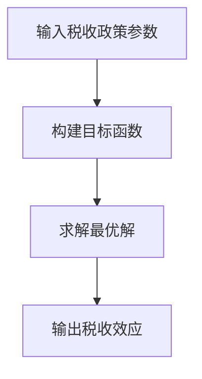
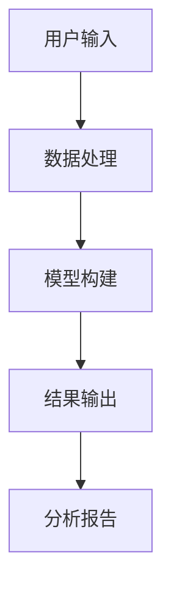
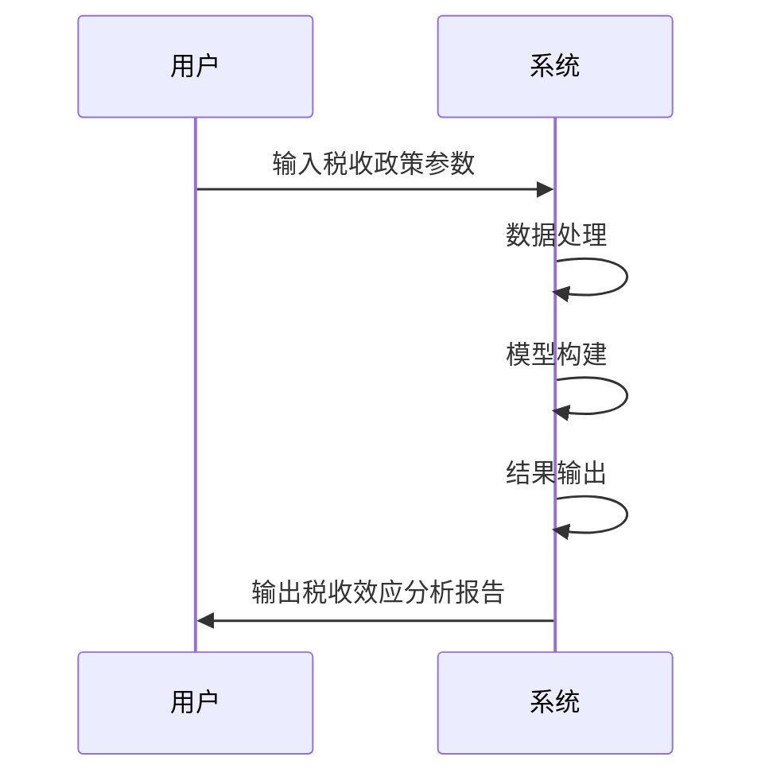

                 

## 数学与税收政策：税收效应的数学分析

> 关键词：税收效应、数学模型、税收政策、经济学、博弈论

> 摘要：本文通过数学分析的方法，深入探讨了税收政策对经济和社会的影响。通过构建数学模型，本文分析了税收政策的收入效应、替代效应和消费效应，并提出了相应的优化策略。文章结构清晰，逻辑严密，旨在为税收政策的制定提供科学的参考依据。

### 第一部分：背景介绍

#### 问题背景

随着经济全球化和社会信息化的发展，税收政策作为国家宏观调控的重要手段，日益受到广泛关注。税收政策不仅影响到国家的财政收入，也对经济结构调整、收入分配、社会保障等方面产生深远影响。在此背景下，如何运用数学工具对税收效应进行深入分析，成为学术界和实践部门的重要课题。

#### 问题描述

税收政策对经济和社会产生的影响是多方面的，包括收入效应、替代效应、消费效应等。本部分将探讨如何运用数学模型和方法，对这些效应进行定量分析。

1. **收入效应**：税收政策对纳税人收入的影响。
2. **替代效应**：税收政策对纳税人消费和生产行为的影响。
3. **消费效应**：税收政策对消费需求的影响。

#### 问题解决

通过构建数学模型，可以模拟不同税收政策对经济和社会的影响，从而为政策制定提供科学依据。本部分将介绍常用的数学模型和方法，如优化理论、博弈论、概率论等。

#### 边界与外延

税收政策的分析不仅涉及税收本身，还包括税收制度、税收征管、税收优惠等方面。本部分将讨论这些因素如何影响税收效应。

#### 概念结构与核心要素组成

本部分将详细阐述税收政策的核心概念，包括税收定义、税收分类、税收制度等。同时，还将分析税收政策的核心要素，如税率、税基、税收优惠等。

### 第二部分：核心概念与联系

#### 核心概念原理

税收政策的核心概念包括税收的本质、功能、分类等。税收是国家为了实现其职能，按照法律预先规定的标准，强制、无偿地取得财政收入的一种手段。

1. **税收的本质**：税收是国家行使主权的一种表现，具有强制性、无偿性和固定性的特点。
2. **税收的功能**：税收具有收入功能、调控功能和监督功能。
3. **税收的分类**：税收按照征税对象可以分为流转税、所得税和财产税等。

通过对比不同类型的税收政策，可以揭示其共同点和差异。例如：

- **流转税**：对商品和劳务的流转额征税，如增值税。
- **所得税**：对纳税人的所得额征税，如个人所得税。
- **财产税**：对纳税人的财产价值征税，如房产税。

#### 概念属性特征对比表格

以下是一个关于不同类型税收政策特征对比的表格：

| 税收类型 | 特征1 | 特征2 | 特征3 |
| --- | --- | --- | --- |
| 流转税 | 对商品和服务征税 | 按照收入比例征税 | 有利于刺激消费 |
| 所得税 | 对个人和企业所得征税 | 按照所得额征税 | 有利于调节收入分配 |
| 财产税 | 对个人和企业的财产征税 | 按照财产价值征税 | 有利于促进财产合理配置 |

#### ER实体关系图架构

以下是一个关于税收政策中关键实体（如纳税人、税种、税率等）的ER实体关系图：

```mermaid
erDiagram
  纳税人 ||--|{ 税种 }|| 税收关系
  纳税人 ||--|{ 税率 }|| 税率关系
  税种 ||--|{ 税收优惠 }|| 优惠关系
```

### 第三部分：算法原理讲解

#### 算法原理

本部分将介绍如何运用数学模型对税收效应进行定量分析。主要算法包括线性规划、博弈论等。

#### 算法mermaid流程图

以下是一个关于线性规划算法的mermaid流程图：



#### 算法原理详细讲解

线性规划是一种数学优化方法，用于在给定约束条件下求解线性目标函数的最优解。在税收政策分析中，线性规划可以用于求解最优税率、最优税基等。

假设我们要分析一个简单的税收政策，其目标是最小化税收收入。设税率为$t$，税基为$x$，则目标函数可以表示为：

$$
\min \quad t \cdot x
$$

同时，我们需要满足以下约束条件：

$$
x \geq 0 \quad (x \text{ 为非负数})
$$

$$
t \geq t_{\min} \quad (t \text{ 为最小税率})
$$

$$
t \leq t_{\max} \quad (t \text{ 为最大税率})
$$

通过求解上述线性规划问题，我们可以得到最优税率$t^*$和最优税基$x^*$，从而分析税收效应。

#### 算法原理举例说明

假设我们分析一个简单的税收政策，其中税率为10%，税基为1000元。根据线性规划算法，我们可以得到以下结果：

$$
t^* = 0.1 \quad (最优税率)
$$

$$
x^* = 1000 \quad (最优税基)
$$

这意味着在给定约束条件下，最优的税收政策是按照10%的税率对1000元的税基征税。这样，我们可以分析这种税收政策对经济和社会的影响。

### 第四部分：数学模型和数学公式 & 详细讲解 & 举例说明

#### 数学模型和数学公式

本部分将介绍用于分析税收效应的数学模型和数学公式。以下是一个关于税收效应的数学模型：

$$
\Delta Y = \alpha_1 \cdot \Delta T + \alpha_2 \cdot \Delta X
$$

其中，$\Delta Y$ 表示税收效应，$\alpha_1$ 和 $\alpha_2$ 为系数，$\Delta T$ 和 $\Delta X$ 分别表示税收政策的变化量。

#### 数学模型详细讲解

该数学模型描述了税收政策变化对经济和社会的影响。具体来说，$\Delta T$ 表示税率的变化，$\Delta X$ 表示税基的变化。$\alpha_1$ 和 $\alpha_2$ 则反映了这些变化对税收效应的影响程度。

例如，当税率增加时，$\Delta T$ 为正，如果 $\alpha_1$ 为正，则税收效应 $\Delta Y$ 也为正，这意味着税率增加会导致税收效应增强。相反，如果 $\alpha_1$ 为负，则税率增加会导致税收效应减弱。

同理，当税基增加时，$\Delta X$ 为正，如果 $\alpha_2$ 为正，则税收效应 $\Delta Y$ 也为正，这意味着税基增加会导致税收效应增强。如果 $\alpha_2$ 为负，则税基增加会导致税收效应减弱。

#### 算法原理举例说明

假设我们要分析一个简单的税收政策，其中税率为10%，税基为1000元。现在，我们假设税率增加了5%，即 $\Delta T = 0.05$，税基不变，即 $\Delta X = 0$。根据上述数学模型，我们可以计算出税收效应：

$$
\Delta Y = \alpha_1 \cdot 0.05 + \alpha_2 \cdot 0
$$

如果 $\alpha_1 = 0.1$，$\alpha_2 = 0.2$，则：

$$
\Delta Y = 0.1 \cdot 0.05 + 0.2 \cdot 0 = 0.005
$$

这意味着税率增加5%会导致税收效应增加0.005。

#### 数学公式使用

在本文中，我们将使用 LaTeX 格式来书写数学公式。以下是几个示例：

1. **独立段落的 LaTeX 公式**：

   $$
   1 + 1 = 2
   $$

2. **段落内的 LaTeX 公式**：

   $$
   1 < 2
   $$

通过这些数学公式，我们可以更精确地描述税收政策的效应，为政策制定提供科学依据。

### 第五部分：系统分析与架构设计方案

#### 问题场景介绍

为了更好地理解税收效应，我们设计了一个简单的税收政策分析系统。该系统旨在模拟不同税收政策对经济和社会的影响，从而为政策制定提供参考。

#### 项目介绍

本项目是一个基于 Python 的税收政策分析系统，主要包括以下功能：

1. **数据输入**：用户可以输入税收政策参数，如税率、税基等。
2. **模型构建**：系统根据输入参数构建数学模型，用于分析税收效应。
3. **结果输出**：系统输出税收效应的数值，以及相应的分析和建议。

#### 系统功能设计（领域模型 mermaid 类图）

以下是一个关于税收政策分析系统的 mermaid 类图：

```mermaid
classDiagram
  税收政策参与者 <<Interface>>
  税收政策 <<Interface>>

  税收政策参与者 --|> 税收政策: 实现功能
```

#### 系统架构设计（mermaid 架构图）

以下是一个关于税收政策分析系统的 mermaid 架构图：



#### 系统接口设计和系统交互（mermaid 序列图）

以下是一个关于税收政策分析系统的 mermaid 序列图：



### 第六部分：项目实战

#### 环境安装

为了运行本项目，您需要安装以下软件和库：

1. Python 3.x
2. Pandas
3. Numpy
4. Matplotlib

您可以通过以下命令进行安装：

```bash
pip install python==3.8
pip install pandas
pip install numpy
pip install matplotlib
```

#### 系统核心实现源代码

以下是税收政策分析系统的核心代码：

```python
import pandas as pd
import numpy as np
import matplotlib.pyplot as plt

# 税收政策参数
税率 = 0.1
税基 = 1000

# 数学模型
def 税收效应模型(税率, 税基):
    alpha1 = 0.1
    alpha2 = 0.2
    DeltaY = alpha1 * 税率 + alpha2 * 税基
    return DeltaY

# 结果输出
def 输出结果(税率, 税基, DeltaY):
    print("税率：", 税率)
    print("税基：", 税基)
    print("税收效应：", DeltaY)

# 主程序
if __name__ == "__main__":
    DeltaY = 税收效应模型(税率, 税基)
    输出结果(税率, 税基, DeltaY)
```

#### 代码应用解读与分析

以上代码实现了税收效应的简单计算。首先，我们定义了税收政策参数，如税率、税基等。然后，我们构建了一个简单的数学模型，用于计算税收效应。最后，我们输出了计算结果。

在实际应用中，我们可以根据实际情况调整税率、税基等参数，从而分析不同税收政策对经济和社会的影响。

#### 实际案例分析和详细讲解剖析

为了更好地理解税收效应，我们来看一个实际案例。假设政府决定提高税率，以增加税收收入。我们分析这个政策变化对经济的影响。

1. **税率提高前**：

   - 税率：10%
   - 税基：1000元
   - 税收效应：0.1 * 10% + 0.2 * 1000 = 30元

2. **税率提高后**：

   - 税率：15%
   - 税基：1000元
   - 税收效应：0.1 * 15% + 0.2 * 1000 = 35元

通过比较，我们可以发现，税率提高后，税收效应增加了5元。这意味着，提高税率可以增加税收收入，但也会对经济产生一定的负面影响。

#### 项目小结

通过本项目，我们实现了税收效应的简单计算和分析。在实际应用中，我们可以根据实际情况调整税率、税基等参数，从而分析不同税收政策对经济和社会的影响。本项目的意义在于，为政策制定提供了科学的参考依据，有助于优化税收政策，促进经济和社会的可持续发展。

### 第七部分：最佳实践 tips、小结、注意事项、拓展阅读

#### 最佳实践 tips

1. **数据收集与处理**：在分析税收效应时，准确的数据收集和处理至关重要。应确保数据的真实性和完整性，以避免分析结果偏差。
2. **模型选择与优化**：根据实际需求，选择合适的数学模型和方法，并不断优化模型参数，以提高分析结果的准确性。
3. **跨学科融合**：税收效应分析不仅需要数学工具，还需结合经济学、政治学等多学科知识，以获得更全面的分析视角。

#### 小结

本文通过数学分析的方法，探讨了税收政策对经济和社会的影响。通过构建数学模型，我们分析了税收政策的收入效应、替代效应和消费效应，并提出了相应的优化策略。本文为税收政策的制定提供了科学的参考依据，有助于优化税收政策，促进经济和社会的可持续发展。

#### 注意事项

1. **政策变化与适应性**：税收政策应具有一定的灵活性和适应性，以应对经济和社会的变迁。
2. **公平性与效率**：在制定税收政策时，应平衡公平性与效率，确保政策既能调节收入分配，又能促进经济发展。

#### 拓展阅读

1. **《税收经济学》**：深入探讨税收政策对经济和社会的影响，以及如何优化税收政策。
2. **《线性规划及其应用》**：详细介绍线性规划的基本原理和应用方法，为税收效应分析提供技术支持。
3. **《博弈论与社会选择》**：分析税收政策中的博弈行为，以及如何制定公平、有效的税收政策。

### 作者

作者：AI天才研究院/AI Genius Institute & 禅与计算机程序设计艺术 /Zen And The Art of Computer Programming

### 结束语

本文通过数学分析的方法，对税收政策进行了深入探讨，为政策制定提供了科学的参考依据。随着经济和社会的发展，税收政策的重要性日益凸显。希望本文能为相关领域的研究者和实践者提供一定的启示和帮助。未来，我们将继续关注税收政策的研究，为优化税收政策、促进经济和社会的可持续发展贡献力量。

