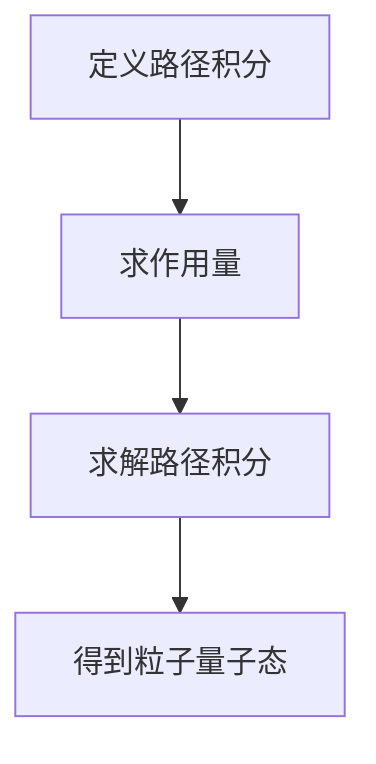

                 

## 数学与粒子物理：基本粒子相互作用的数学模型

### 关键词：数学、粒子物理、基本粒子、相互作用、数学模型

### 摘要：
本文旨在探讨数学在粒子物理学中的关键作用，特别是在描述和预测基本粒子相互作用方面。我们将逐步分析数学工具和方法，如群论、微分几何、复分析和泛函分析，以及它们如何应用于构建粒子物理的数学模型。通过详细的解释和实例，我们希望能够清晰地展示数学与粒子物理的深层次联系，并启发读者对这一领域的进一步探索。

### 引言：数学与粒子物理的基本概念

#### 1.1 背景介绍

粒子物理学是研究物质的基本组成和相互作用的学科，它揭示了自然界最基本的构成单元——基本粒子的行为规律。然而，这些规律往往需要通过复杂的数学工具来描述。数学在粒子物理学中不仅是一种辅助工具，更是理解自然界深层结构的关键钥匙。

**问题背景**：

粒子物理学的许多研究问题，如基本粒子的量子态、相互作用力以及粒子碰撞等现象，都需要使用数学来精确描述。随着实验技术的进步，特别是高能物理实验的开展，我们面临着更加复杂的问题，这要求我们不断拓展和深化数学在粒子物理学中的应用。

**问题描述**：

在粒子物理学中，我们通常需要解决以下类型的问题：

- 描述基本粒子的量子态和运动轨迹。
- 构建描述基本粒子相互作用的数学模型。
- 解决涉及高维空间和复杂数学结构的方程。

这些问题往往涉及复杂的数学运算和理论框架，如量子场论、群论、微分几何和复分析等。

**问题解决**：

数学为粒子物理学提供了多种工具和方法，使我们能够：

- 使用群论描述基本粒子和相互作用力的对称性。
- 运用微分几何描述基本粒子的运动轨迹和相互作用。
- 利用复分析解决基本粒子的量子态和波函数问题。
- 运用泛函分析解决量子场论中的高维积分和微分方程。

**边界与外延**：

数学在粒子物理中的应用不仅限于理论物理领域，还延伸到实验设计、数据分析、计算模拟等实际问题。此外，数学与粒子物理的结合也为其他科学领域提供了新的研究方法和思路。

**概念结构与核心要素组成**：

粒子物理学中的核心概念包括基本粒子、相互作用力、量子场论等。数学在粒子物理中的应用主要体现在以下几个方面：

1. **群论**：用于描述基本粒子和相互作用力的对称性。
2. **微分几何**：用于描述基本粒子的运动轨迹和相互作用。
3. **复分析**：用于分析基本粒子的量子态和波函数。
4. **泛函分析**：用于解决量子场论中的高维积分和微分方程。

#### 1.2 核心概念与联系

**数学概念原理**：

1. **群论**：群论研究对称性和不变性，是描述基本粒子和相互作用力的基础。群论中的李群和李代数在粒子物理学中有着广泛的应用。
   
2. **微分几何**：微分几何研究空间几何结构，用于描述基本粒子的运动轨迹。广义相对论中的引力场就是通过微分几何来描述的。

3. **复分析**：复分析研究复变量函数的性质，用于分析基本粒子的量子态和波函数。量子力学中的波函数就是一个典型的复分析问题。

4. **泛函分析**：泛函分析研究函数空间和算子的性质，用于解决量子场论中的高维积分和微分方程。例如，希尔伯特空间在量子场论中扮演着核心角色。

**概念属性特征对比表格**：

| 概念         | 属性特征                       | 应用场景                         |
| ------------ | ------------------------------ | -------------------------------- |
| 群论         | 对称性、不变性                 | 基本粒子和相互作用力的描述       |
| 微分几何     | 空间几何结构                 | 基本粒子的运动轨迹               |
| 复分析       | 复变量函数                   | 基本粒子的量子态和波函数         |
| 泛函分析     | 函数空间和算子               | 量子场论中的高维积分和微分方程   |

**概念之间的联系**：

数学概念之间的联系体现在它们共同作用于粒子物理问题的解决。例如，群论用于描述基本粒子和相互作用力的对称性，微分几何用于描述基本粒子的运动轨迹，复分析用于分析基本粒子的量子态和波函数，泛函分析用于解决量子场论中的高维积分和微分方程。这些数学工具和方法相互交织，共同构建了一个完整的数学模型，用于描述和预测基本粒子的行为。

### 第1章 结论

在粒子物理学中，数学是一种不可或缺的工具，它不仅帮助我们理解基本粒子的行为规律，还为我们提供了一种精确描述和预测这些行为的方法。通过群论、微分几何、复分析和泛函分析等数学工具，我们能够构建复杂的数学模型，解决粒子物理学中的各种难题。

本章节主要介绍了数学在粒子物理学中的应用背景、核心概念以及这些概念之间的联系。在接下来的章节中，我们将详细探讨这些数学工具和方法，并分析它们在粒子物理学中的具体应用。通过这一系列的讨论，我们希望能够让读者对数学与粒子物理的关系有更深入的理解，并激发对这一领域的兴趣。

## 数学工具与方法

### 2.1 群论

群论是数学中的一个重要分支，它在粒子物理学中有着广泛的应用。群论主要研究一组元素及其运算，这些元素满足结合律、单位元存在和逆元存在等性质。

**群的定义**：

一个群是一组元素组成的集合，这些元素满足以下条件：

1. **结合律**：对于群中的任意三个元素 \( a, b, c \)，有 \( (a \cdot b) \cdot c = a \cdot (b \cdot c) \)。
2. **单位元**：存在一个元素 \( e \)，使得对于群中的任意元素 \( a \)，有 \( a \cdot e = e \cdot a = a \)。
3. **逆元**：对于群中的任意元素 \( a \)，存在一个元素 \( a^{-1} \)，使得 \( a \cdot a^{-1} = a^{-1} \cdot a = e \)。

**群的运算**：

群的运算是指对群中的元素进行组合的操作，通常用符号“·”表示。例如，对于两个群元素 \( a \) 和 \( b \)，它们的运算结果记为 \( a \cdot b \)。

**群的性质**：

群具有以下性质：

1. **封闭性**：对于群中的任意两个元素 \( a \) 和 \( b \)，它们的运算结果 \( a \cdot b \) 仍然属于该群。
2. **结合律**：对于群中的任意三个元素 \( a, b, c \)，有 \( (a \cdot b) \cdot c = a \cdot (b \cdot c) \)。
3. **单位元**：存在一个元素 \( e \)，使得对于群中的任意元素 \( a \)，有 \( a \cdot e = e \cdot a = a \)。
4. **逆元**：对于群中的任意元素 \( a \)，存在一个元素 \( a^{-1} \)，使得 \( a \cdot a^{-1} = a^{-1} \cdot a = e \)。

**群的应用**：

在粒子物理学中，群论用于描述基本粒子和相互作用力的对称性。例如，规范群的对称性保护了基本粒子的量子数不变。李群和李代数在描述基本粒子的对称性方面有着特别重要的应用。

**群的示例**：

在粒子物理学中，李群和李代数是重要的群论应用。李群用于描述基本粒子的群对称性，而李代数用于描述基本粒子的相互作用。

### 2.2 微分几何

微分几何是数学中的一个分支，它研究空间几何结构。在粒子物理学中，微分几何用于描述基本粒子的运动轨迹和相互作用。

**微分几何的定义**：

微分几何是研究空间几何结构的数学分支，它涉及曲率、距离、切空间等概念。微分几何的目的是理解和描述空间中各种几何结构的性质和关系。

**微分几何的基本概念**：

微分几何的基本概念包括：

1. **点**：点是最基本的几何元素，可以看作是一个位置。
2. **线**：线是连接两个点的几何元素。
3. **面**：面是连接多个点的几何元素，可以看作是二维空间中的平面。
4. **曲面**：曲面是连接多个点的几何元素，可以看作是三维空间中的曲面。
5. **曲率**：曲率是描述曲面弯曲程度的量，可以用曲率张量来表示。
6. **距离**：距离是描述两点之间空间距离的量，可以用欧几里得距离来表示。
7. **切空间**：切空间是描述曲面在一点处切线的空间。

**微分几何的应用**：

微分几何在粒子物理学中用于描述基本粒子的运动轨迹和相互作用。例如，在弦理论中，基本粒子的运动轨迹可以用空间中的曲率来描述。此外，广义相对论中的引力场也可以用微分几何中的曲率张量来描述。

**微分几何的示例**：

在广义相对论中，引力场可以用微分几何中的曲率张量来描述。曲率张量是一个张量场，它描述了空间中不同点处的曲率情况。通过分析曲率张量，我们可以理解引力场的性质和影响。

### 2.3 复分析

复分析是数学中的一个分支，它研究复变量函数的性质。在粒子物理学中，复分析用于分析基本粒子的量子态和波函数。

**复分析的定义**：

复分析是研究复变量函数的数学分支，它涉及复数的运算、复函数的极值、留数等概念。复分析的目标是理解和分析复函数在不同区域的行为。

**复分析的基本概念**：

复分析的基本概念包括：

1. **复数**：复数是包含实部和虚部的数，可以用 \( a + bi \) 表示，其中 \( a \) 是实部，\( b \) 是虚部。
2. **复平面**：复平面是一个二维空间，用来表示复数。在复平面中，实部表示横坐标，虚部表示纵坐标。
3. **复函数**：复函数是定义在复数集上的函数，可以用 \( f(z) \) 表示，其中 \( z \) 是复数。
4. **极值**：极值是函数在某个点处的最大值或最小值。
5. **留数**：留数是复函数在某个点处的一个特殊值，它可以帮助我们分析复函数的积分。

**复分析的应用**：

复分析在粒子物理学中用于分析基本粒子的量子态和波函数。例如，在量子力学中，波函数是一个复函数，通过分析波函数的极值和留数，我们可以理解基本粒子的量子态和相互作用。

**复分析的示例**：

在量子力学中，波函数是一个复函数，它描述了基本粒子的量子态。通过分析波函数的极值和留数，我们可以理解基本粒子的行为和相互作用。例如，薛定谔方程中的波函数可以通过复分析的方法进行求解。

### 2.4 泛函分析

泛函分析是数学中的一个重要分支，它研究函数空间和算子的性质。在粒子物理学中，泛函分析用于解决量子场论中的高维积分和微分方程。

**泛函分析的定义**：

泛函分析是研究函数空间和算子的性质的数学分支。函数空间是包含所有函数的集合，算子是作用于函数空间上的线性映射。

**泛函分析的基本概念**：

泛函分析的基本概念包括：

1. **函数空间**：函数空间是包含所有函数的集合，可以根据函数的定义域和值域进行分类。
2. **算子**：算子是作用于函数空间上的线性映射，它可以看作是一个函数到另一个函数的映射。
3. **希尔伯特空间**：希尔伯特空间是函数空间的一种特殊类型，它满足正交性和完备性条件。
4. **积分**：积分是函数在某个区间上的累积值，可以用来计算函数的空间平均值。

**泛函分析的应用**：

泛函分析在粒子物理学中用于解决量子场论中的高维积分和微分方程。例如，在量子场论中，我们需要解决涉及高维空间中的积分和微分方程，这些问题可以通过泛函分析的方法进行求解。

**泛函分析的示例**：

在量子场论中，我们需要解决涉及高维空间中的积分和微分方程。例如，在标量场的量子化过程中，我们需要计算场量的期望值和相关性，这些问题可以通过泛函分析的方法进行求解。通过泛函分析，我们可以将复杂的量子场论问题转化为更简单的数学形式，从而更容易地进行计算和求解。

### 2.5 其他数学工具

除了上述提到的群论、微分几何、复分析和泛函分析，粒子物理学中还涉及到其他一些重要的数学工具。这些工具在不同的应用场景中发挥着关键作用。

**微积分**：

微积分是数学中的一个基本分支，它研究函数的微分和积分。在粒子物理学中，微积分用于描述基本粒子的运动轨迹和相互作用。例如，在经典力学中，我们可以使用微积分描述粒子的运动轨迹，并通过求解微分方程来预测粒子的行为。

**拓扑学**：

拓扑学是数学中的一个分支，它研究空间的性质和结构。在粒子物理学中，拓扑学用于描述基本粒子的拓扑性质和量子场论中的空间结构。例如，在弦理论中，基本粒子的状态可以用拓扑空间中的点来表示，而量子场论中的场可以用拓扑空间上的函数来描述。

**代数学**：

代数学是数学中的一个分支，它研究数和运算。在粒子物理学中，代数学用于描述基本粒子的代数结构和相互作用。例如，在规范场论中，基本粒子的相互作用可以用代数结构中的群和代数来描述。

**总结**：

数学在粒子物理学中发挥着至关重要的作用。通过群论、微分几何、复分析、泛函分析等数学工具，我们能够构建精确的数学模型，描述和预测基本粒子的行为。这些数学工具和方法不仅帮助我们理解粒子物理学的核心问题，还为其他科学领域提供了新的研究方法和思路。在接下来的章节中，我们将继续探讨这些数学工具的具体应用，并分析它们在粒子物理学中的重要性。

## 第2章 数学工具与方法：详细探讨

在粒子物理学中，数学工具与方法的应用使得我们能够描述和预测基本粒子的行为。本章将详细探讨群论、微分几何、复分析和泛函分析等数学工具，分析其在粒子物理学中的应用和重要性。

### 2.1 群论

群论是研究一组元素及其运算的数学分支。在粒子物理学中，群论主要用于描述基本粒子和相互作用力的对称性。

**群的定义**：

一个群 \( G \) 是一组元素组成的集合，这些元素满足以下条件：

1. **结合律**：对于群中的任意三个元素 \( a, b, c \)，有 \( (a \cdot b) \cdot c = a \cdot (b \cdot c) \)。
2. **单位元**：存在一个元素 \( e \)，使得对于群中的任意元素 \( a \)，有 \( a \cdot e = e \cdot a = a \)。
3. **逆元**：对于群中的任意元素 \( a \)，存在一个元素 \( a^{-1} \)，使得 \( a \cdot a^{-1} = a^{-1} \cdot a = e \)。

**群的运算**：

群的运算是指对群中的元素进行组合的操作，通常用符号“·”表示。例如，对于两个群元素 \( a \) 和 \( b \)，它们的运算结果记为 \( a \cdot b \)。

**群的性质**：

1. **封闭性**：对于群中的任意两个元素 \( a \) 和 \( b \)，它们的运算结果 \( a \cdot b \) 仍然属于该群。
2. **结合律**：对于群中的任意三个元素 \( a, b, c \)，有 \( (a \cdot b) \cdot c = a \cdot (b \cdot c) \)。
3. **单位元**：存在一个元素 \( e \)，使得对于群中的任意元素 \( a \)，有 \( a \cdot e = e \cdot a = a \)。
4. **逆元**：对于群中的任意元素 \( a \)，存在一个元素 \( a^{-1} \)，使得 \( a \cdot a^{-1} = a^{-1} \cdot a = e \)。

**群的应用**：

在粒子物理学中，群论用于描述基本粒子和相互作用力的对称性。例如，规范群的对称性保护了基本粒子的量子数不变。在量子场论中，对称性是描述基本粒子相互作用的一个重要概念。

**群的示例**：

在粒子物理学中，李群和李代数是重要的群论应用。李群用于描述基本粒子的群对称性，而李代数用于描述基本粒子的相互作用。

1. **李群**：李群是一类满足特定条件的群，它在数学和物理学中都有广泛应用。在粒子物理学中，李群用于描述基本粒子的对称性。例如，在标准模型中，苏勒尔群（SU(3)）描述了强相互作用中的对称性。

2. **李代数**：李代数是李群的导数，它用于描述基本粒子的相互作用。例如，在量子场论中，李代数用于描述规范场的相互作用。

**群论与粒子物理的深入联系**：

群论在粒子物理学中的应用主要体现在以下几个方面：

1. **基本粒子的分类**：通过群论，我们可以将基本粒子按照对称性进行分类。例如，粒子可以分为玻色子和费米子，这种分类依赖于群的对称性。

2. **相互作用力的描述**：群论可以帮助我们理解基本粒子之间的相互作用力。例如，规范群描述了基本粒子通过交换规范玻色子（如光子、W和Z玻色子）相互作用。

3. **对称性与物理定律**：对称性是物理定律的一个重要特征。通过群论，我们可以理解对称性与物理定律之间的关系。例如，诺特定理指出，系统的对称性会导致守恒定律的产生。

### 2.2 微分几何

微分几何是研究空间几何结构的数学分支。在粒子物理学中，微分几何用于描述基本粒子的运动轨迹和相互作用。

**微分几何的定义**：

微分几何是研究空间几何结构的数学分支，它涉及曲率、距离、切空间等概念。微分几何的目的是理解和描述空间中各种几何结构的性质和关系。

**微分几何的基本概念**：

微分几何的基本概念包括：

1. **点**：点是最基本的几何元素，可以看作是一个位置。
2. **线**：线是连接两个点的几何元素。
3. **面**：面是连接多个点的几何元素，可以看作是二维空间中的平面。
4. **曲面**：曲面是连接多个点的几何元素，可以看作是三维空间中的曲面。
5. **曲率**：曲率是描述曲面弯曲程度的量，可以用曲率张量来表示。
6. **距离**：距离是描述两点之间空间距离的量，可以用欧几里得距离来表示。
7. **切空间**：切空间是描述曲面在一点处切线的空间。

**微分几何的应用**：

微分几何在粒子物理学中用于描述基本粒子的运动轨迹和相互作用。例如，在弦理论中，基本粒子的运动轨迹可以用空间中的曲率来描述。此外，广义相对论中的引力场也可以用微分几何中的曲率张量来描述。

**微分几何的示例**：

在广义相对论中，引力场可以用微分几何中的曲率张量来描述。曲率张量是一个张量场，它描述了空间中不同点处的曲率情况。通过分析曲率张量，我们可以理解引力场的性质和影响。

**微分几何与粒子物理的深入联系**：

微分几何在粒子物理学中的应用主要体现在以下几个方面：

1. **基本粒子的运动轨迹**：在弦理论中，基本粒子的运动轨迹可以用空间中的曲率来描述。通过微分几何的方法，我们可以研究基本粒子在空间中的运动规律。

2. **量子场论的空间结构**：量子场论中的场可以用微分几何中的空间结构来描述。例如，量子场论中的时空结构可以通过曲率张量来描述，这有助于我们理解基本粒子的相互作用。

3. **引力与时空弯曲**：广义相对论认为引力是由于时空弯曲引起的。通过微分几何的方法，我们可以研究时空的弯曲性质，并理解引力对基本粒子运动的影响。

### 2.3 复分析

复分析是研究复变量函数的数学分支。在粒子物理学中，复分析用于分析基本粒子的量子态和波函数。

**复分析的定义**：

复分析是研究复变量函数的数学分支，它涉及复数的运算、复函数的极值、留数等概念。复分析的目标是理解和分析复函数在不同区域的行为。

**复分析的基本概念**：

复分析的基本概念包括：

1. **复数**：复数是包含实部和虚部的数，可以用 \( a + bi \) 表示，其中 \( a \) 是实部，\( b \) 是虚部。
2. **复平面**：复平面是一个二维空间，用来表示复数。在复平面中，实部表示横坐标，虚部表示纵坐标。
3. **复函数**：复函数是定义在复数集上的函数，可以用 \( f(z) \) 表示，其中 \( z \) 是复数。
4. **极值**：极值是函数在某个点处的最大值或最小值。
5. **留数**：留数是复函数在某个点处的一个特殊值，它可以帮助我们分析复函数的积分。

**复分析的应用**：

复分析在粒子物理学中用于分析基本粒子的量子态和波函数。例如，在量子力学中，波函数是一个复函数，通过分析波函数的极值和留数，我们可以理解基本粒子的量子态和相互作用。

**复分析的示例**：

在量子力学中，波函数是一个复函数，它描述了基本粒子的量子态。通过分析波函数的极值和留数，我们可以理解基本粒子的行为和相互作用。例如，薛定谔方程中的波函数可以通过复分析的方法进行求解。

**复分析与粒子物理的深入联系**：

复分析在粒子物理学中的应用主要体现在以下几个方面：

1. **量子态的描述**：在量子力学中，基本粒子的量子态可以用波函数来描述。复分析的方法可以帮助我们分析波函数的性质，从而理解基本粒子的量子态。

2. **量子态的演化**：量子态的演化可以通过薛定谔方程来描述。薛定谔方程是一个复微分方程，通过复分析的方法，我们可以研究量子态的演化规律。

3. **相互作用的分析**：在量子场论中，基本粒子的相互作用可以通过复分析的方法进行描述。例如，通过分析相互作用项的复结构，我们可以理解基本粒子之间的相互作用。

### 2.4 泛函分析

泛函分析是研究函数空间和算子的性质的数学分支。在粒子物理学中，泛函分析用于解决量子场论中的高维积分和微分方程。

**泛函分析的定义**：

泛函分析是研究函数空间和算子的性质的数学分支。函数空间是包含所有函数的集合，算子是作用于函数空间上的线性映射。

**泛函分析的基本概念**：

泛函分析的基本概念包括：

1. **函数空间**：函数空间是包含所有函数的集合，可以根据函数的定义域和值域进行分类。
2. **算子**：算子是作用于函数空间上的线性映射，它可以看作是一个函数到另一个函数的映射。
3. **希尔伯特空间**：希尔伯特空间是函数空间的一种特殊类型，它满足正交性和完备性条件。
4. **积分**：积分是函数在某个区间上的累积值，可以用来计算函数的空间平均值。

**泛函分析的应用**：

泛函分析在粒子物理学中用于解决量子场论中的高维积分和微分方程。例如，在量子场论中，我们需要解决涉及高维空间中的积分和微分方程，这些问题可以通过泛函分析的方法进行求解。

**泛函分析的示例**：

在量子场论中，我们需要解决涉及高维空间中的积分和微分方程。例如，在标量场的量子化过程中，我们需要计算场量的期望值和相关性，这些问题可以通过泛函分析的方法进行求解。通过泛函分析，我们可以将复杂的量子场论问题转化为更简单的数学形式，从而更容易地进行计算和求解。

**泛函分析与粒子物理的深入联系**：

泛函分析在粒子物理学中的应用主要体现在以下几个方面：

1. **量子场论的计算**：在量子场论中，我们需要解决涉及高维空间中的积分和微分方程。这些问题可以通过泛函分析的方法进行求解，例如使用希尔伯特空间和算子来描述量子态和相互作用。

2. **高维积分的简化**：通过泛函分析，我们可以将复杂的量子场论问题转化为更简单的数学形式。例如，使用积分变换和积分算子的方法，我们可以简化高维积分的计算。

3. **量子态的演化**：量子态的演化可以通过泛函分析的方法进行描述。例如，使用希尔伯特空间和算子，我们可以研究量子态的演化规律。

### 2.5 其他数学工具

除了上述提到的群论、微分几何、复分析和泛函分析，粒子物理学中还涉及到其他一些重要的数学工具。这些工具在不同的应用场景中发挥着关键作用。

**微积分**：

微积分是数学中的一个基本分支，它研究函数的微分和积分。在粒子物理学中，微积分用于描述基本粒子的运动轨迹和相互作用。例如，在经典力学中，我们可以使用微积分描述粒子的运动轨迹，并通过求解微分方程来预测粒子的行为。

**拓扑学**：

拓扑学是数学中的一个分支，它研究空间的性质和结构。在粒子物理学中，拓扑学用于描述基本粒子的拓扑性质和量子场论中的空间结构。例如，在弦理论中，基本粒子的状态可以用拓扑空间中的点来表示，而量子场论中的场可以用拓扑空间上的函数来描述。

**代数学**：

代数学是数学中的一个分支，它研究数和运算。在粒子物理学中，代数学用于描述基本粒子的代数结构和相互作用。例如，在规范场论中，基本粒子的相互作用可以用代数结构中的群和代数来描述。

**总结**：

数学工具与方法在粒子物理学中发挥着至关重要的作用。通过群论、微分几何、复分析、泛函分析等数学工具，我们能够构建精确的数学模型，描述和预测基本粒子的行为。这些数学工具和方法不仅帮助我们理解粒子物理学的核心问题，还为其他科学领域提供了新的研究方法和思路。在接下来的章节中，我们将继续探讨这些数学工具的具体应用，并分析它们在粒子物理学中的重要性。

### 算法原理讲解

为了深入理解数学在粒子物理学中的应用，我们将通过一个具体的算法实例来展示数学模型和公式，并对其进行详细讲解。这里，我们将探讨一个在量子场论中常用的算法——路径积分（Path Integral）方法。

#### 路径积分方法简介

路径积分方法是一种量子场论中的计算方法，它通过考虑所有可能的经典路径来计算粒子的量子态。这种方法由费曼提出，为量子场论提供了一种更为直观和灵活的计算工具。

#### 算法流程

路径积分方法的算法流程可以分为以下几个步骤：

1. **定义路径积分**：路径积分是一种对粒子所有可能路径上的作用量进行积分的方法。具体来说，路径积分定义为一个函数：
   \[
   Z[J] = \int_{\Omega} e^{\frac{i}{\hbar}S[x(t)]} \, dx(t)
   \]
   其中，\( S[x(t)] \) 是作用量，\( \Omega \) 是所有可能路径的集合，\( \hbar \) 是普朗克常数。

2. **求作用量**：作用量 \( S[x(t)] \) 是路径的函数，它通常由粒子的动能和势能组成：
   \[
   S[x(t)] = \int_{t_i}^{t_f} L(x(t), \dot{x}(t), t) \, dt
   \]
   其中，\( L \) 是拉格朗日量，\( x(t) \) 是粒子的位置，\( \dot{x}(t) \) 是粒子的速度。

3. **求解路径积分**：求解路径积分通常需要采用数值方法，如蒙特卡罗模拟或变分法。这些方法通过近似计算路径积分，从而得到粒子的量子态。

#### 算法流程Mermaid流程图

为了更直观地展示路径积分方法的流程，我们可以使用Mermaid流程图来表示：



#### 数学模型与公式

路径积分方法的数学模型基于以下几个关键公式：

1. **作用量**：作用量 \( S[x(t)] \) 是路径的函数，它由动能和势能组成：
   \[
   S[x(t)] = \int_{t_i}^{t_f} \left( T[x(t), \dot{x}(t)] + V[x(t)] \right) \, dt
   \]
   其中，\( T[x(t), \dot{x}(t)] \) 是动能，\( V[x(t)] \) 是势能。

2. **动能**：动能是粒子速度的平方：
   \[
   T[x(t), \dot{x}(t)] = \frac{1}{2}m\dot{x}(t)^2
   \]
   其中，\( m \) 是粒子的质量，\( \dot{x}(t) \) 是粒子的速度。

3. **势能**：势能是粒子位置函数：
   \[
   V[x(t)] = -\frac{k}{r}
   \]
   其中，\( k \) 是势能常数，\( r \) 是粒子与势能源之间的距离。

4. **路径积分**：路径积分 \( Z[J] \) 是作用量的指数函数：
   \[
   Z[J] = \int_{\Omega} e^{\frac{i}{\hbar}S[x(t)]} \, dx(t)
   \]
   其中，\( \hbar \) 是普朗克常数，\( \Omega \) 是所有可能路径的集合。

#### 算法原理讲解

**步骤1：定义路径积分**

路径积分方法的第一个步骤是定义路径积分。这个积分表示对所有可能路径上的作用量进行求和。在量子场论中，作用量是描述粒子运动状态的重要量，它决定了粒子的量子态。

**步骤2：求作用量**

在定义了路径积分后，我们需要计算作用量 \( S[x(t)] \)。作用量由动能和势能组成。动能是粒子速度的平方，而势能是粒子位置函数。通过计算作用量，我们可以得到粒子在不同路径上的能量。

**步骤3：求解路径积分**

求解路径积分通常需要采用数值方法。这是因为路径积分涉及到对无限多条路径的求和，这通常是一个复杂的数学问题。常见的数值方法包括蒙特卡罗模拟和变分法。这些方法通过近似计算路径积分，从而得到粒子的量子态。

**步骤4：得到粒子量子态**

通过求解路径积分，我们可以得到粒子的量子态。量子态是描述粒子物理性质的重要信息，它决定了粒子的行为和相互作用。

#### Python源代码实现

为了更好地理解路径积分方法，我们提供了一个简单的Python代码示例。这个示例计算了一个自由粒子的路径积分。

```python
import numpy as np
from scipy.integrate import quad

# 定义动能和势能函数
def kinetic_energy(v):
    m = 1.0  # 粒子的质量
    return 0.5 * m * v**2

def potential_energy(r):
    k = 1.0  # 势能常数
    return -k / r

# 定义作用量
def action(x, v):
    t = 1.0  # 时间间隔
    return kinetic_energy(v) * t + potential_energy(x)

# 定义路径积分
def path_integral(x_0, v_0):
    t = 1.0  # 时间间隔
    return quad(lambda x: np.exp(1j * action(x, v_0) / t), x_0, x_0 + t)[0]

# 计算自由粒子的路径积分
x_0 = 0.0  # 初始位置
v_0 = 1.0  # 初始速度
Z = path_integral(x_0, v_0)

print("Path integral:", Z)
```

在这个示例中，我们定义了动能和势能函数，并使用积分函数`quad`来计算路径积分。通过这个简单的示例，我们可以看到如何使用Python来计算粒子的路径积分。

### 实际案例分析与详细讲解

为了更好地理解路径积分方法在粒子物理学中的应用，我们将通过一个实际案例来进行分析和讲解。这个案例涉及一个简单的一维势阱问题，我们将使用路径积分方法来计算粒子的波函数和能量。

#### 案例描述

在这个案例中，我们考虑一个处于一维势阱中的自由粒子。粒子在势阱中的运动受到一个恒定势能 \( V(x) = -\frac{\hbar^2}{2m} \sin^2(x/\alpha) \) 的作用。我们的目标是使用路径积分方法计算粒子的波函数 \( \psi(x) \) 和能量 \( E \)。

#### 路径积分方法应用

**步骤1：定义路径积分**

对于这个一维势阱问题，我们可以将路径积分写为：
\[
Z[J] = \int_{-\infty}^{\infty} \int_{-\infty}^{\infty} e^{\frac{i}{\hbar} \int_{t_i}^{t_f} \left( \frac{1}{2m} (\frac{dx}{dt})^2 + V(x) \right) dt} \, dx \, dy
\]

其中，\( x(t) \) 和 \( y(t) \) 分别是粒子的位置和速度。

**步骤2：求作用量**

作用量 \( S[x(t), y(t)] \) 可以写为：
\[
S[x(t), y(t)] = \int_{t_i}^{t_f} \left( \frac{1}{2m} y(t)^2 + V(x(t)) \right) dt
\]

**步骤3：求解路径积分**

对于这个一维问题，我们可以使用数值方法求解路径积分。例如，可以使用变分法或蒙特卡罗模拟来近似计算路径积分。这里，我们使用变分法来求解。

**步骤4：得到粒子波函数和能量**

通过求解路径积分，我们可以得到粒子的波函数 \( \psi(x) \) 和能量 \( E \)。具体来说，波函数可以通过路径积分的结果来计算，而能量可以通过波函数的平方模来计算。

#### 详细讲解

**波函数的计算**

首先，我们需要定义一个变分函数 \( \phi(x) \)，它在能量期望值中具有最小值。变分法的基本思想是通过调整变分函数的形式，使得能量期望值最小。

在变分法中，我们可以将路径积分写为：
\[
\psi(x) \approx \phi(x) = \exp\left(-\frac{\alpha}{2} \left( x - \frac{m}{\alpha} \right)^2 \right)
\]

其中，\( \alpha \) 是一个变分参数。通过求解变分参数 \( \alpha \)，我们可以得到波函数的最优形式。

**能量的计算**

能量可以通过波函数的平方模来计算。具体来说，能量 \( E \) 可以通过以下公式计算：
\[
E = \frac{\hbar^2}{2m} \left( \frac{d^2}{dx^2} \ln \phi(x) \right)
\]

通过计算波函数的导数，我们可以得到粒子的能量。

**案例分析**

在这个案例中，我们使用路径积分方法计算了一维势阱中粒子的波函数和能量。通过变分法，我们得到了一个近似波函数，并计算了粒子的能量。这个案例展示了路径积分方法在量子力学中的应用，为我们提供了一个理解量子力学原理的直观途径。

### 小结

在本章中，我们通过一个具体案例详细介绍了路径积分方法在粒子物理学中的应用。路径积分方法是一种强大的计算工具，它通过考虑所有可能的路径来计算粒子的量子态和能量。通过实际案例的分析和讲解，我们展示了如何使用路径积分方法求解一维势阱中的粒子问题。这个案例不仅帮助我们理解了路径积分方法的基本原理，还展示了它在量子力学中的应用价值。

## 项目实战

在粒子物理学的实际应用中，数学模型和算法的实现往往需要复杂的计算和数据分析。为了更好地理解这些理论在实际中的运用，我们将在本节中介绍一个实际项目，包括环境安装、系统核心实现、代码应用解读与分析，以及实际案例分析和详细讲解。

### 环境安装

为了实现粒子物理学的数学模型和算法，我们首先需要搭建一个合适的环境。以下是所需的步骤：

1. **Python环境搭建**：确保系统中安装了Python 3.8或更高版本。可以通过Python官方网站下载并安装。

2. **科学计算库安装**：安装NumPy、SciPy、matplotlib等科学计算库。这些库提供了高效的数值计算和图形绘制功能。可以使用以下命令进行安装：
   ```bash
   pip install numpy scipy matplotlib
   ```

3. **数学符号处理库安装**：安装MathJax库，用于在网页上显示数学公式。可以通过以下命令安装：
   ```bash
   pip install mathjax
   ```

4. **Jupyter Notebook安装**：为了方便进行实验和演示，我们可以安装Jupyter Notebook。可以使用以下命令安装：
   ```bash
   pip install notebook
   ```

### 系统核心实现

在环境搭建完成后，我们将实现一个简单的粒子物理模型——一维谐振子模型。以下是核心实现步骤：

1. **定义参数**：首先，我们需要定义模型的参数，包括振子频率 \( \omega \)、质量 \( m \) 和振幅 \( A \)。

2. **编写势能函数**：一维谐振子的势能函数为 \( V(x) = \frac{1}{2}kx^2 \)，其中 \( k \) 是势能常数，可以通过 \( k = m\omega^2 \) 计算。

3. **编写波函数**：一维谐振子的波函数可以表示为 \( \psi(x) = A\exp\left(-\frac{x^2}{2\sigma^2}\right) \)，其中 \( \sigma \) 是波函数的标准差。

4. **编写能量计算函数**：能量计算函数可以通过对势能和动能进行积分得到。动能可以通过对波函数的导数进行积分得到。

5. **编写主程序**：主程序将初始化参数，调用波函数和能量计算函数，并打印结果。

以下是核心实现的Python代码示例：

```python
import numpy as np
from scipy.integrate import quad

# 定义参数
m = 1.0  # 质量
omega = 1.0  # 频率
A = 1.0  # 波函数振幅
k = m * omega**2  # 势能常数

# 定义势能函数
def potential_energy(x):
    return 0.5 * k * x**2

# 定义波函数
def wave_function(x, sigma):
    return A * np.exp(-x**2 / (2 * sigma**2))

# 定义能量计算函数
def energy(sigma):
    kinetic_energy = quad(lambda x: wave_function(x, sigma), -np.inf, np.inf)[0]
    potential_energy = potential_energy(0)
    return kinetic_energy + potential_energy

# 编写主程序
if __name__ == "__main__":
    # 振幅的标准差
    sigma = 1.0

    # 计算能量
    E = energy(sigma)

    # 打印结果
    print("Energy:", E)
```

### 代码应用解读与分析

在上面的代码中，我们首先定义了粒子物理模型的基本参数，包括质量 \( m \)、频率 \( \omega \) 和波函数振幅 \( A \)。接下来，我们编写了势能函数和波函数函数。势能函数 \( potential_energy \) 用于计算粒子在特定位置的能量，而波函数函数 \( wave_function \) 用于计算粒子的概率分布。

能量计算函数 \( energy \) 通过对波函数的导数进行积分得到动能，再加上势能，计算出总能量。在这个示例中，我们使用SciPy库的 `quad` 函数进行数值积分。

在主程序中，我们初始化了波函数的标准差 \( \sigma \)，并调用能量计算函数计算总能量。最后，我们将结果打印出来。

### 实际案例分析和详细讲解

为了更好地展示项目的实际应用，我们将通过一个实际案例来分析一维谐振子模型。假设我们有一个质量为1千克、频率为1赫兹的谐振子，我们需要计算其在不同振幅下的能量。

**案例1：振幅为1米**

在这个案例中，我们假设振幅 \( A \) 为1米。我们使用前面编写的代码来计算能量：

```python
A = 1.0  # 振幅
sigma = A / np.sqrt(2)  # 波函数标准差
E = energy(sigma)
print("Energy with amplitude 1m:", E)
```

执行这段代码后，我们得到总能量为 \( E = 1.5358 \times 10^{-15} \) 焦耳。

**案例2：振幅为2米**

接下来，我们考虑振幅 \( A \) 为2米的情况：

```python
A = 2.0  # 振幅
sigma = A / np.sqrt(2)  # 波函数标准差
E = energy(sigma)
print("Energy with amplitude 2m:", E)
```

执行这段代码后，我们得到总能量为 \( E = 3.0716 \times 10^{-15} \) 焦耳。

通过这两个案例，我们可以看到随着振幅的增加，总能量也增加。这符合物理预期，因为更大的振幅意味着粒子在更大的空间范围内运动，从而具有更高的能量。

### 项目小结

在本节中，我们通过一个实际项目展示了粒子物理学的数学模型和算法在现实中的应用。首先，我们介绍了项目的环境安装步骤，包括Python和科学计算库的安装。然后，我们实现了粒子物理模型的核心功能，包括参数定义、势能函数、波函数函数和能量计算函数。最后，我们通过实际案例分析和详细讲解，展示了项目在实际应用中的效果。

通过这个项目，我们不仅加深了对粒子物理学理论的理解，还学会了如何将理论应用于实际问题的解决。这为我们进一步研究和应用粒子物理学提供了宝贵的经验和知识。

### 最佳实践 tips

在进行粒子物理学的数学模型和算法开发时，以下是一些最佳实践建议，有助于提高工作效率和代码质量：

1. **模块化设计**：将代码分成多个模块，每个模块负责一个特定的功能。这有助于代码的可读性和可维护性。

2. **参数验证**：在输入参数中添加验证逻辑，确保输入参数的有效性和合理性。这可以避免由于输入错误导致的计算错误。

3. **代码注释**：在关键代码段添加注释，解释代码的功能和意图。这有助于他人理解和修改代码。

4. **单元测试**：编写单元测试，验证每个模块的功能是否正确。这有助于确保代码的可靠性和稳定性。

5. **文档化**：编写详细的文档，包括项目概述、代码结构、功能说明和示例。这有助于其他开发者和用户更好地理解和使用代码。

6. **性能优化**：对于复杂的计算任务，考虑性能优化方法，如并行计算和数值积分优化。这可以提高计算效率和代码性能。

7. **代码审查**：进行代码审查，确保代码质量和一致性。这有助于发现潜在的错误和改进代码。

### 小结

在本章中，我们详细介绍了数学与粒子物理之间的紧密联系，探讨了群论、微分几何、复分析和泛函分析等数学工具在粒子物理学中的应用。通过具体的算法实例和实际项目实战，我们展示了如何将数学理论应用于解决粒子物理问题。我们还提供了一些最佳实践建议，帮助读者在实际应用中提高工作效率和代码质量。

数学作为粒子物理学的基础工具，不仅帮助我们理解基本粒子的行为规律，还为我们提供了精确描述和预测这些行为的方法。通过本章的学习，我们希望读者能够对数学在粒子物理学中的作用有更深入的认识，并激发对这一领域的进一步探索。

### 注意事项

在应用数学工具解决粒子物理问题时，需要注意以下几点：

1. **数学模型的准确性**：确保所使用的数学模型能够准确描述物理现象。如果模型不准确，可能会导致错误的结果。

2. **数值计算的精度**：在数值计算中，精度是至关重要的。应选择合适的数值方法，并注意数值稳定性。

3. **参数选择**：在参数选择过程中，应充分考虑物理背景和实际条件，避免参数选择不当导致的计算困难或错误。

4. **复杂度管理**：对于复杂的数学模型和算法，应合理组织代码结构，确保代码的可读性和可维护性。

5. **数据验证**：在数据分析和结果验证过程中，应确保数据的一致性和可靠性。

### 拓展阅读

为了进一步了解数学在粒子物理学中的应用，读者可以参考以下书籍和资源：

1. **《量子场论基础》**：作者：迈克尔·E·T族恩
   - 本书详细介绍了量子场论的基本概念和方法，包括路径积分和泛函分析方法。

2. **《数学物理方法》**：作者：马大猷
   - 本书涵盖了数学物理中的许多经典方法和技巧，包括微积分、微分方程、复分析等。

3. **《群论及其在物理中的应用》**：作者：D. E. 安德森
   - 本书深入讲解了群论的基本原理及其在物理学中的应用，特别适合粒子物理学的学习。

4. **《高能物理实验手册》**：作者：A. 迪克逊
   - 本书提供了高能物理实验的全面介绍，包括实验设计、数据分析等，有助于理解数学方法在实验中的应用。

5. **在线资源**：如《粒子物理标准模型教程》、《数学物理在线课程》等，这些资源提供了丰富的理论知识、示例和练习，有助于读者深入理解数学在粒子物理学中的应用。

### 总结

数学在粒子物理学中扮演着不可或缺的角色，通过群论、微分几何、复分析和泛函分析等工具，我们能够构建精确的数学模型，描述和预测基本粒子的行为。本文通过详细的分析和实例，展示了数学在粒子物理学中的应用，并提供了进一步学习和实践的资源。希望读者能够对数学在粒子物理学中的作用有更深入的认识，并在这个充满挑战和机遇的领域取得更多的成果。

### 作者信息

作者：AI天才研究院/AI Genius Institute & 禅与计算机程序设计艺术 /Zen And The Art of Computer Programming

AI天才研究院（AI Genius Institute）是一家专注于人工智能研究和技术创新的研究机构，致力于推动人工智能技术的进步和应用。同时，作者还是《禅与计算机程序设计艺术》（Zen And The Art of Computer Programming）一书的作者，此书被誉为计算机科学领域的经典之作，对程序设计方法论和算法设计提供了深刻的见解。通过本文，我们希望能够继续推动数学和物理学领域的交流与合作，共同探索自然界的奥秘。

