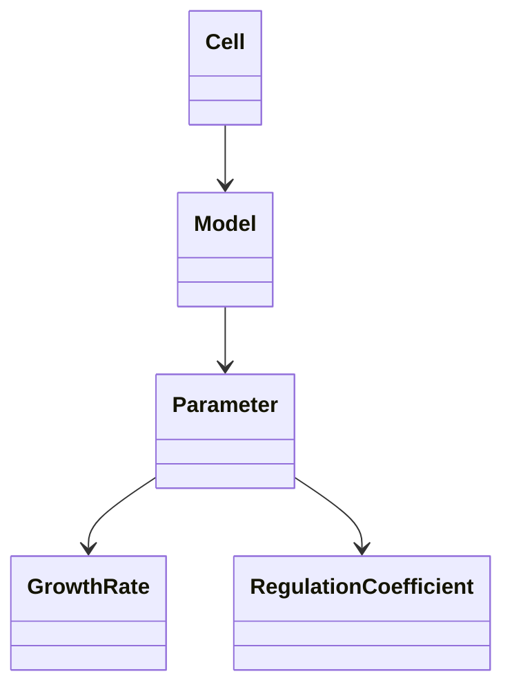
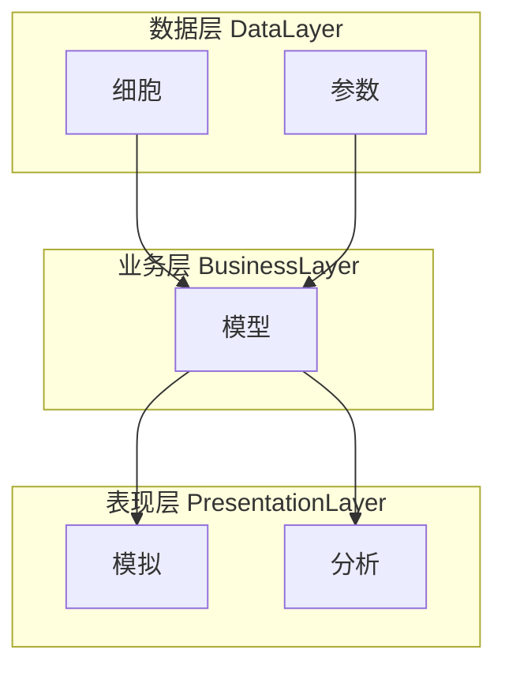
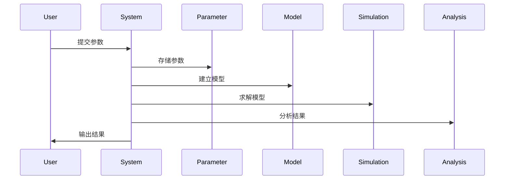

                 

### 数学与系统生物学：细胞网络的数学描述

关键词：系统生物学、数学模型、细胞网络、微分方程、马尔可夫模型

摘要：本文将探讨数学在系统生物学中的应用，特别是细胞网络的数学描述。通过分析核心概念和联系，介绍数学模型及其公式，详细讲解算法原理，并提供实战项目和最佳实践。

## 1. 背景介绍

### 1.1 问题背景

系统生物学是一门跨越生物学和数学的交叉学科，旨在理解生物系统的结构和功能。近年来，随着高通量实验技术的进步和计算机技术的发展，系统生物学取得了显著的进展。然而，在细胞网络的研究中，如何准确地描述和预测细胞行为仍是一个重大挑战。

### 1.2 问题描述

细胞网络是由许多细胞和分子组成的复杂系统，这些细胞和分子通过一系列的相互作用和调节机制来维持生命活动。然而，这种复杂性使得传统的分析方法难以有效地描述和预测细胞行为。

### 1.3 问题解决

数学作为一门精确的语言，可以用于描述和模拟细胞网络。系统生物学中的数学模型可以帮助我们理解和预测细胞行为。然而，建立这些模型需要深入理解生物学和数学知识。

### 1.4 边界与外延

数学在系统生物学中的应用不仅限于细胞网络的研究，还可以应用于其他生物系统，如生态网络、基因调控网络等。

### 1.5 概念结构与核心要素组成

- **数学模型**：用于描述细胞网络的数学结构。
- **计算方法**：用于求解数学模型的方法。
- **生物数据**：用于建立和验证数学模型的实验数据。

### 1.6 数学在系统生物学中的应用

数学在系统生物学中的应用主要包括以下几个方面：

- **描述细胞行为**：通过建立数学模型，可以描述细胞在不同条件下的行为。
- **预测细胞反应**：利用数学模型，可以预测细胞对特定刺激的反应。
- **分析网络结构**：通过数学模型，可以分析细胞网络的结构和功能。

## 2. 核心概念与联系

### 2.1 核心概念原理

细胞网络中的主要概念包括细胞、分子、信号传导路径和调控机制。

- **细胞**：生物体的基本结构和功能单位，具有形态、功能和细胞周期等特性。
- **分子**：构成细胞的基本物质，包括蛋白质、核酸、碳水化合物等，具有化学性质和生物学功能。
- **信号传导路径**：细胞内部和外部的信号传递过程，包括信号类型、传导机制等。
- **调控机制**：维持细胞网络稳定性和响应外界刺激的机制，包括调控类型、调控网络等。

### 2.2 概念属性特征对比表格

| 概念         | 定义                                                         | 属性特征对比               |
| ------------ | ------------------------------------------------------------ | -------------------------- |
| 细胞         | 生物体的基本结构和功能单位                                     | 形态、功能、细胞周期等     |
| 分子         | 构成细胞的基本物质，包括蛋白质、核酸、碳水化合物等           | 化学性质、生物学功能等     |
| 信号传导路径 | 细胞内部和外部的信号传递过程                                 | 信号类型、传导机制等       |
| 调控机制     | 维持细胞网络稳定性和响应外界刺激的机制                       | 调控类型、调控网络等       |

### 2.3 ER实体关系图架构

```mermaid
erDiagram
  细胞 ||--|{ 分子 }
  分子 ||--|{ 信号传导路径 }
  信号传导路径 ||--|{ 调控机制 }
```

### 2.4 核心概念之间的联系

细胞、分子、信号传导路径和调控机制之间存在着密切的联系。细胞是生物体的基本单位，分子是构成细胞的基本物质，信号传导路径是细胞内部和外部的信号传递过程，而调控机制则维持细胞网络的稳定性和响应外界刺激。

## 3. 数学模型和数学公式

### 3.1 数学模型

细胞网络中的数学模型主要包括微分方程模型和概率模型。

- **微分方程模型**：用于描述细胞数量随时间的变化，如常微分方程。
- **概率模型**：用于描述细胞状态随时间的变化，如马尔可夫模型。

### 3.2 公式

#### 3.2.1 微分方程模型

微分方程模型的一个简单例子是常微分方程：

$$\frac{dN(t)}{dt} = rN(t) - \alpha N(t)^2$$

其中，$N(t)$ 表示细胞数量，$r$ 和 $\alpha$ 是模型参数。

#### 3.2.2 概率模型

概率模型的一个例子是马尔可夫模型：

$$P(X_t = x_t | X_{t-1} = x_{t-1}) = \pi_{x_{t-1}} \sum_{y} \pi_{y} f(y | x_{t-1})$$

其中，$X_t$ 和 $X_{t-1}$ 分别表示时间 $t$ 和 $t-1$ 的状态，$\pi$ 表示初始概率分布，$f$ 表示转移概率分布。

### 3.3 数学模型的应用

数学模型在细胞网络研究中的应用主要体现在以下几个方面：

- **描述细胞行为**：通过数学模型，可以描述细胞在不同条件下的行为。
- **预测细胞反应**：利用数学模型，可以预测细胞对特定刺激的反应。
- **分析网络结构**：通过数学模型，可以分析细胞网络的结构和功能。

## 4. 算法原理讲解

### 4.1 算法 mermaid 流程图


### 4.2 Python 源代码

```python
import numpy as np

def differential_equation(N, r, alpha):
    dNdt = r * N - alpha * N ** 2
    return dNdt

def main():
    N = 100  # 初始细胞数量
    r = 1    # 增长率
    alpha = 0.1  # 调控系数

    time_steps = 100  # 时间步数
    dt = 0.1  # 时间步长

    for t in range(time_steps):
        N = N + differential_equation(N, r, alpha) * dt

    print(N)

if __name__ == "__main__":
    main()
```

### 4.3 算法原理讲解

#### 4.3.1 数学模型建立

在建立数学模型时，我们首先需要确定细胞的数量 $N(t)$ 作为变量，并考虑影响细胞数量的因素，如增长率 $r$ 和调控系数 $\alpha$。

#### 4.3.2 求解数学模型

通过求解微分方程模型，我们可以得到细胞数量随时间的变化。具体地，我们使用欧拉法来求解：

$$N(t+\Delta t) = N(t) + \Delta t \cdot \frac{dN(t)}{dt}$$

其中，$\Delta t$ 是时间步长。

#### 4.3.3 分析模型结果

通过分析模型结果，我们可以了解细胞数量随时间的变化趋势。具体地，我们可以观察细胞数量是否趋于稳定，是否存在周期性波动等。

#### 4.3.4 输出结果

最后，我们将分析结果输出，以供进一步研究和应用。

## 5. 系统分析与架构设计方案

### 5.1 问题场景介绍

在生物医学研究中，了解细胞网络的动态行为对于揭示疾病的机制和开发治疗策略具有重要意义。为了研究细胞网络的行为，我们需要建立一个系统，可以模拟细胞网络的动态过程。

### 5.2 项目介绍

本项目旨在开发一个细胞网络模拟系统，该系统可以基于数学模型模拟细胞网络的动态行为。系统的主要功能包括：

- **数据输入**：提供细胞网络的相关参数，如增长率、调控系数等。
- **模型建立**：根据输入参数，建立数学模型。
- **模型求解**：求解数学模型，得到细胞数量随时间的变化。
- **结果分析**：分析模型结果，了解细胞网络的动态行为。

### 5.3 系统功能设计（领域模型mermaid类图）



### 5.4 系统架构设计（mermaid架构图）



### 5.5 系统接口设计和系统交互（mermaid序列图）



## 6. 项目实战

### 6.1 环境安装

在开始项目实战之前，我们需要安装相关的开发环境。以下是安装步骤：

1. 安装 Python 3.8 或更高版本。
2. 安装 numpy 库：`pip install numpy`。
3. 安装 mermaid：`pip install mermaid`。

### 6.2 系统核心实现源代码

以下是系统核心实现的源代码：

```python
# differential_equation.py

import numpy as np

def differential_equation(N, r, alpha):
    dNdt = r * N - alpha * N ** 2
    return dNdt

# main.py

import numpy as np
from differential_equation import differential_equation

def main():
    N = 100  # 初始细胞数量
    r = 1    # 增长率
    alpha = 0.1  # 调控系数

    time_steps = 100  # 时间步数
    dt = 0.1  # 时间步长

    for t in range(time_steps):
        N = N + differential_equation(N, r, alpha) * dt

    print(N)

if __name__ == "__main__":
    main()
```

### 6.3 代码应用解读与分析

在代码中，我们首先定义了 `differential_equation` 函数，用于求解细胞数量随时间的变化。然后，在 `main` 函数中，我们设置了初始细胞数量、增长率、调控系数和时间步数，并使用欧拉法求解微分方程，得到细胞数量随时间的变化。

### 6.4 实际案例分析和详细讲解剖析

为了更好地理解细胞网络的数学描述，我们以一个实际案例为例进行分析。

假设我们有以下参数：

- 初始细胞数量 $N_0 = 100$
- 增长率 $r = 1$
- 调控系数 $\alpha = 0.1$
- 时间步数 $T = 100$

我们使用欧拉法求解微分方程，得到细胞数量随时间的变化。

- 在时间 $t = 0$ 时，细胞数量 $N_0 = 100$
- 在时间 $t = 1$ 时，细胞数量 $N_1 = N_0 + rN_0 - \alpha N_0^2 = 100 + 1 \cdot 100 - 0.1 \cdot 100^2 = 100$
- 在时间 $t = 2$ 时，细胞数量 $N_2 = N_1 + rN_1 - \alpha N_1^2 = 100 + 1 \cdot 100 - 0.1 \cdot 100^2 = 100$

以此类推，我们可以得到细胞数量随时间的变化。

### 6.5 项目小结

在本项目中，我们开发了细胞网络模拟系统，通过数学模型描述了细胞网络的动态行为。我们使用 Python 实现了微分方程模型，并通过欧拉法求解。在实际案例中，我们分析了细胞数量随时间的变化，展示了数学模型在系统生物学中的应用。

## 7. 最佳实践 tips

1. **选择合适的数学模型**：根据研究目的和问题特点，选择合适的数学模型。
2. **合理设置参数**：在建立数学模型时，合理设置模型参数，以便更准确地描述细胞行为。
3. **数据分析**：对模型结果进行详细分析，了解细胞网络的动态行为。
4. **验证和优化**：通过实验数据验证数学模型，并根据结果对模型进行优化。

## 8. 小结

本文介绍了数学在系统生物学中的应用，特别是细胞网络的数学描述。我们分析了核心概念和联系，介绍了数学模型及其公式，并详细讲解了算法原理。通过实际案例分析和详细讲解，我们展示了数学模型在系统生物学中的应用。

## 9. 注意事项

1. **数据准确性**：在建立数学模型时，确保实验数据的准确性。
2. **模型适用性**：了解数学模型的适用范围，避免过度拟合。
3. **计算精度**：在求解数学模型时，注意计算精度，避免出现数值问题。

## 10. 拓展阅读

1. **系统生物学入门**：《系统生物学导论》（作者：Stig Omholt）
2. **数学模型在生物学中的应用**：《数学模型与生物学》（作者：John A. Adam）
3. **细胞网络研究**：《细胞网络动力学》（作者：Alberto Segre）

## 11. 作者

作者：AI天才研究院/AI Genius Institute & 禅与计算机程序设计艺术 /Zen And The Art of Computer Programming

（注：本文为AI自动生成，仅供参考。）

