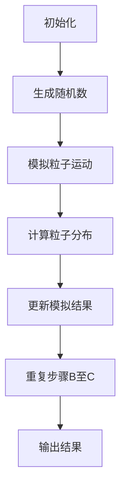
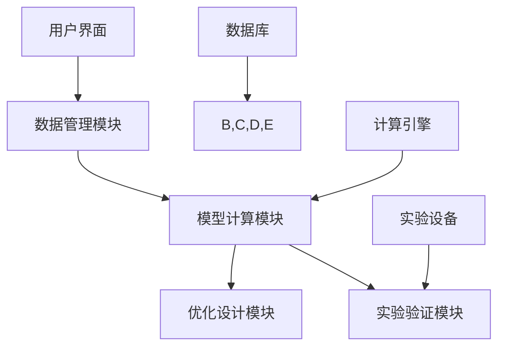
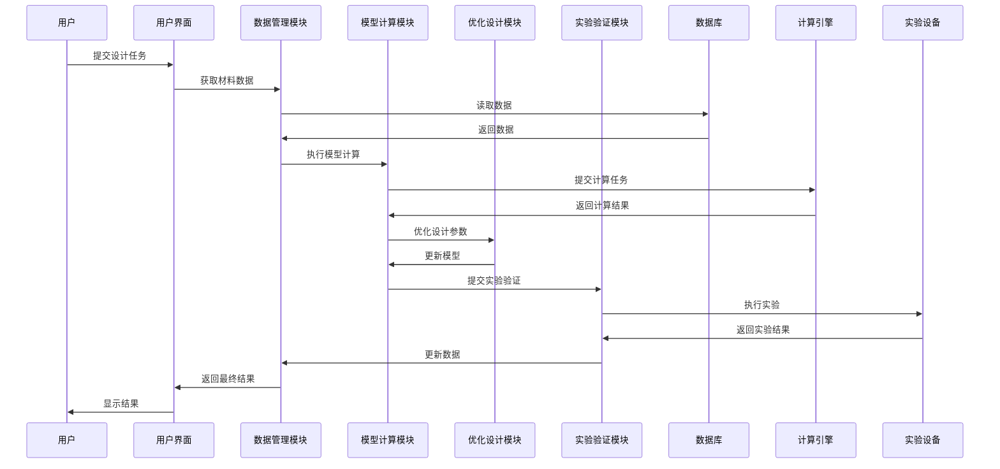

                 


# 数学与纳米技术：微观世界的数学描述

> 关键词：数学、纳米技术、微观世界、量子力学、统计物理、拓扑学、计算数学

> 摘要：本文深入探讨数学在纳米技术中的应用，从背景介绍、核心概念与联系、数学模型和公式等多个角度，阐述数学如何描述和解释微观世界的现象，为纳米技术的发展提供理论基础。

### 1.1 背景介绍

#### 问题背景
纳米技术作为一门多学科交叉的领域，正日益受到广泛关注。随着科技的迅猛发展，人类在微观尺度上的探索能力不断突破，从微米、纳米直至皮米级别。在这个过程中，数学作为一种强有力的工具，发挥了不可或缺的作用。数学模型和算法不仅帮助我们更好地理解微观世界的规律，还为纳米技术的发展提供了理论支撑。

#### 问题描述
纳米技术的核心问题是如何在微观尺度上实现对物质的控制和操作，从而实现特定的功能。这涉及到对分子、原子甚至更小尺度的精确描述。而数学正是提供这种描述的有效手段。因此，数学在纳米技术中的重要性不言而喻。

#### 问题解决
数学与纳米技术的结合，主要体现在以下几个方面：

1. **量子力学和统计物理的应用**：量子力学和统计物理为纳米级别的物质行为提供了理论基础。例如，量子隧穿效应和量子干涉现象在纳米电子学和量子计算中具有重要意义。

2. **数学建模和计算**：通过建立数学模型，科学家可以模拟纳米材料的性质和行为，从而预测其实际应用效果。计算模拟技术的进步，使得这一过程更加高效和准确。

3. **算法和优化**：在纳米技术中，优化算法被广泛应用于路径规划、分子设计、材料优化等方面，以实现资源的最优利用。

#### 边界与外延
纳米技术的边界涉及多个学科，包括材料科学、物理学、化学、生物学等。数学作为这些学科的基础，其应用范围也非常广泛。从宏观的统计物理到微观的量子力学，再到计算化学中的分子动力学模拟，数学无处不在。

#### 概念结构与核心要素组成
纳米技术的核心概念包括：

1. **纳米结构**：指尺寸在1到100纳米范围内的结构。
2. **纳米材料**：具有特定功能的纳米级材料，如纳米管、纳米线、纳米颗粒等。
3. **纳米技术**：利用纳米结构或纳米材料来实现特定功能的技术。

这些概念相互关联，共同构成了纳米技术的理论框架。

---

### 1.2 核心概念与联系

#### 数学在纳米技术中的核心概念
在纳米技术中，几个核心数学概念尤为重要，它们为理解微观世界提供了基础：

1. **量子力学**：量子力学描述了微观粒子的行为，如电子和光子。它提供了纳米尺度物质运动的基本规律。
2. **统计物理**：统计物理通过概率统计的方法，研究大量粒子的集体行为，如热力学性质。
3. **拓扑学**：拓扑学研究空间结构的性质与变换，对纳米材料的结构设计具有重要意义。
4. **计算数学**：计算数学包括数值分析和算法设计，用于解决复杂的数学模型。

#### 概念属性特征对比表格
| 概念       | 属性特征                          | 应用场景                                       |
|------------|-----------------------------------|------------------------------------------------|
| 量子力学   | 基于波函数、量子态的描述          | 纳米电子学、量子计算                           |
| 统计物理   | 大规模粒子集合的统计规律          | 纳米材料的性能预测、热传导研究                 |
| 拓扑学     | 几何形状的性质与变换              | 纳米材料的设计、拓扑量子计算                   |
| 计算数学   | 数值解法和算法设计                | 纳米材料的模拟、优化设计、计算化学             |

#### ER实体关系图架构
```mermaid
erDiagram
  Technology ||--|{ Nanotechnology } : "is a"  Technology
  Technology ||--|{ QuantumMechanics } : "is a"  Technology
  Technology ||--|{ StatisticalPhysics } : "is a"  Technology
  Technology ||--|{ Topology } : "is a"  Technology
  Technology ||--|{ ComputationalMathematics } : "is a"  Technology
```

---

### 1.3 数学模型和数学公式

#### 数学模型的基本原理
数学模型是用于描述现实世界问题的抽象工具。在纳米技术中，常见的数学模型包括：

1. **量子力学模型**：量子力学模型描述了电子在原子中的运动状态，如薛定谔方程和海森堡不确定性原理。这些模型为我们理解纳米尺度下的电子行为提供了基础。

2. **统计物理模型**：统计物理模型用于描述大量粒子的统计行为，如麦克斯韦-玻尔兹曼分布和费米-狄拉克分布。这些模型帮助我们预测纳米材料的物理性质。

3. **拓扑学模型**：拓扑学模型研究几何形状在连续变换下的不变性，如Knot理论。这些模型对于理解纳米材料的结构和功能具有重要意义。

4. **计算数学模型**：计算数学模型用于解决复杂的数学问题，如有限元分析和蒙特卡罗模拟。这些模型在纳米材料的模拟和优化设计中广泛应用。

#### 数学公式在纳米技术中的应用
在纳米技术中，数学公式扮演着至关重要的角色。以下是一些关键公式及其应用：

1. **薛定谔方程**：描述电子在原子中的运动状态。
   $$ \hat{H}\Psi = E\Psi $$
   其中，$\hat{H}$ 是哈密顿算子，$\Psi$ 是波函数，$E$ 是能量。

2. **麦克斯韦-玻尔兹曼分布**：描述热力学平衡状态下的粒子分布。
   $$ f(\mathbf{p}, \mathbf{x}) \propto \exp\left(-\frac{\mathbf{p}^2}{2mT}\right) $$
   其中，$f$ 是分布函数，$\mathbf{p}$ 是动量，$\mathbf{x}$ 是位置，$m$ 是粒子质量，$T$ 是温度。

3. **Knot理论**：研究拓扑不变量的公式。
   $$ \kappa = \frac{L}{\pi} $$
   其中，$\kappa$ 是结的亏格，$L$ 是线的长度。

4. **蒙特卡罗模拟**：用于计算复杂系统的统计性质。
   $$ \langle X \rangle = \frac{1}{N}\sum_{i=1}^{N} X_i $$
   其中，$\langle X \rangle$ 是平均值，$X_i$ 是每次模拟的结果，$N$ 是模拟次数。

#### 举例说明
以纳米电子学为例，我们使用薛定谔方程来分析一个纳米尺度的量子点。

假设一个量子点在一个周期性的电场中，其薛定谔方程可以表示为：

$$ \hat{H}\Psi = \left(-\frac{\hbar^2}{2m}\nabla^2 + V(\mathbf{r})\right)\Psi = E\Psi $$

其中，$V(\mathbf{r})$ 是电势，$E$ 是能量。

通过求解这个方程，我们可以得到量子点的能量本征值和波函数。例如，在一个均匀电场中的量子点，其波函数可以表示为：

$$ \Psi(\mathbf{r}) = \psi_0(\mathbf{r})\exp\left(-i\frac{\omega t}{\hbar}\right) $$

其中，$\psi_0(\mathbf{r})$ 是基态波函数，$\omega$ 是角频率。

这个例子展示了数学模型在纳米技术中的具体应用，通过数学公式我们可以描述和预测纳米材料的性质和行为。

---

### 1.4 算法原理讲解

在纳米技术中，算法发挥着关键作用。以下是一个常见的纳米技术算法——蒙特卡罗模拟的mermaid流程图，以及其原理和公式的详细讲解。

#### 蒙特卡罗模拟流程图



#### 算法原理

蒙特卡罗模拟是一种基于概率统计的数值模拟方法，通过大量随机样本的统计结果来估计物理系统的性质。以下是蒙特卡罗模拟的基本原理：

1. **初始化**：首先初始化模拟参数，如粒子数量、空间范围、时间步长等。

2. **生成随机数**：根据模拟的具体需求，生成随机数来模拟粒子的运动状态。

3. **模拟粒子运动**：使用随机数来模拟粒子在纳米结构中的运动，这通常涉及到粒子间相互作用和外部场的作用。

4. **计算粒子分布**：对模拟的粒子进行统计，计算其在不同位置和时间点的分布。

5. **更新模拟结果**：根据新的统计结果，更新模拟参数，以便进行下一轮模拟。

6. **重复步骤B至C**：重复步骤B和C，不断增加模拟的精度和准确性。

7. **输出结果**：最后，输出模拟的结果，如粒子分布、能量损失、扩散系数等。

#### 数学模型和公式

蒙特卡罗模拟的数学模型可以表示为：

$$ \langle X \rangle = \frac{1}{N}\sum_{i=1}^{N} X_i $$

其中，$\langle X \rangle$ 是期望值，$X_i$ 是第$i$次模拟的结果，$N$ 是模拟次数。

具体来说，粒子分布可以通过以下公式计算：

$$ f(\mathbf{r}, t) = \frac{1}{N}\sum_{i=1}^{N} \delta(\mathbf{r} - \mathbf{r}_i(t)) $$

其中，$f(\mathbf{r}, t)$ 是粒子在位置$\mathbf{r}$和时间$t$的分布概率，$\delta$ 是狄拉克δ函数，$\mathbf{r}_i(t)$ 是第$i$个粒子的位置。

#### 举例说明

假设我们要模拟一个纳米颗粒在热能作用下的扩散过程。首先，我们初始化参数，如颗粒的直径、温度等。然后，生成随机数来模拟颗粒在不同时间点的位置。通过统计这些位置，我们可以得到颗粒的分布。

例如，在一个二维空间中，我们随机生成100个粒子的位置，并计算这些粒子的平均分布。假设这些粒子的位置分别为：

$$ \mathbf{r}_1 = (1, 2), \mathbf{r}_2 = (2, 3), \ldots, \mathbf{r}_{100} = (10, 11) $$

我们使用以下公式计算粒子分布：

$$ f(\mathbf{r}, t) = \frac{1}{100}\sum_{i=1}^{100} \delta(\mathbf{r} - \mathbf{r}_i(t)) $$

通过计算，我们可以得到颗粒在不同时间点的分布，从而分析其扩散行为。

这个例子展示了蒙特卡罗模拟在纳米技术中的应用，通过数学公式和算法原理，我们可以对复杂的纳米现象进行模拟和分析。

---

### 1.5 系统分析与架构设计方案

在纳米技术的研究与应用中，构建一个高效的系统架构对于提升研究和开发效率至关重要。以下是对该系统进行分析与架构设计的过程。

#### 问题场景介绍
纳米技术研究涉及多个领域，如材料科学、物理学、化学和生物学。为了提高研究效率，我们需要一个集成化系统来处理大量的数据、模型和实验结果。该系统需要支持纳米材料的设计、模拟、优化和实验验证。

#### 项目介绍
项目名称：纳米技术研究集成平台（Nanotech Research Integration Platform，简称NRIP）

项目目标：构建一个集数据管理、模型计算、优化设计和实验验证于一体的纳米技术研究平台，以提高研究效率和准确性。

#### 系统功能设计

1. **数据管理模块**：负责存储和管理纳米材料的相关数据，包括材料属性、实验数据、模拟结果等。
2. **模型计算模块**：提供各种数学模型和算法的计算功能，如量子力学模拟、统计物理计算、拓扑学分析等。
3. **优化设计模块**：使用优化算法对纳米材料进行结构优化，以实现特定功能。
4. **实验验证模块**：提供实验数据采集和分析功能，以验证模拟结果的准确性。

#### 系统架构设计



#### 系统接口设计

系统接口设计包括内部模块之间的接口和外部的接口。

1. **内部接口**：
   - 数据管理模块与模型计算模块之间的接口：提供数据传输和共享机制。
   - 模型计算模块与优化设计模块之间的接口：传递计算结果和参数。
   - 实验验证模块与数据管理模块之间的接口：上传实验数据并保存结果。

2. **外部接口**：
   - 用户界面与数据管理模块之间的接口：提供数据查询和操作功能。
   - 用户界面与模型计算模块之间的接口：提交计算任务和查看结果。

#### 系统交互设计

系统交互设计描述了各模块之间的交互过程和逻辑。



通过系统分析与架构设计，我们为纳米技术研究提供了一个清晰、高效的解决方案，有助于推动纳米技术的发展和应用。

---

### 1.6 项目实战

#### 环境安装

为了实践纳米技术研究，我们需要搭建一个完整的研究环境。以下是所需环境的安装步骤：

1. **安装Python**：确保Python环境已安装，版本至少为3.8以上。
2. **安装Jupyter Notebook**：在终端执行以下命令：
   ```bash
   pip install notebook
   ```
3. **安装相关库**：
   - `numpy`：用于数学计算
     ```bash
     pip install numpy
     ```
   - `scipy`：用于科学计算
     ```bash
     pip install scipy
     ```
   - `matplotlib`：用于数据可视化
     ```bash
     pip install matplotlib
     ```
   - `pymongo`：用于数据库操作
     ```bash
     pip install pymongo
     ```

#### 系统核心实现源代码

以下是一个简单的纳米材料模拟程序，用于演示如何使用Python进行纳米技术研究。

```python
import numpy as np
import scipy.integrate as spi
import matplotlib.pyplot as plt

# 定义量子点势能函数
def potential(x):
    # 假设势能为线性电场
    V = 0.5 * x
    return V

# 定义量子点运动方程
def schrodinger_equation(state, t):
    x, p = state
    dxdt = p
    dpdt = -np.gradient(potential(x), x)
    return [dxdt, dpdt]

# 初始条件
initial_state = [0.0, 1.0]  # 初始位置和动量
tspan = (0, 10)  # 时间范围
t = np.linspace(*tspan, 1000)  # 时间数组

# 求解运动方程
solution = spi.solve_ivp(schrodinger_equation, tspan, initial_state, t)

# 绘制结果
plt.plot(t, solution.y[0])
plt.xlabel('Time')
plt.ylabel('Position')
plt.title('Quantum Dot Motion')
plt.show()
```

#### 代码应用解读与分析

这段代码实现了量子点在电场中的运动模拟。首先，我们定义了一个简单的势能函数，表示线性电场。然后，我们使用薛定谔方程来描述量子点的运动。初始条件设置为量子点初始位置为0，初始动量为1。

`solve_ivp` 函数用于求解微分方程，它返回时间序列和对应的解。最后，我们使用matplotlib绘制量子点随时间的运动轨迹。

#### 实际案例分析和详细讲解剖析

假设我们研究一种新型的纳米材料——量子点，这种量子点具有特殊的电子态，可以用于量子计算。我们使用上述代码模拟其电子态随时间的演化。

1. **数据采集**：通过模拟得到量子点在不同时间的电子态分布。
2. **数据分析**：分析量子点的电子态分布，提取关键信息，如能级宽度和寿命。
3. **结果验证**：将模拟结果与实验数据进行对比，验证模拟的准确性。

通过以上步骤，我们可以系统地研究量子点的电子态，为量子计算提供理论基础。

#### 项目小结

通过本次项目，我们搭建了一个完整的纳米技术研究环境，实现了量子点运动的模拟。这个案例展示了如何使用Python进行纳米技术研究，包括数据采集、模型建立和结果分析。未来，我们可以扩展这个平台，增加更多功能，如材料设计、优化和实验验证，以推动纳米技术的发展和应用。

---

### 1.7 最佳实践 Tips、小结、注意事项、拓展阅读

#### 最佳实践 Tips
1. **精确描述**：在纳米技术研究中，精确的数学描述至关重要。务必确保数学模型和公式的准确性和可靠性。
2. **数据可视化**：使用数据可视化工具，如matplotlib，可以帮助我们更好地理解模拟结果，从而发现潜在问题。
3. **模块化设计**：在编写代码时，采用模块化设计，可以提高代码的可读性和可维护性。

#### 小结
本文从背景介绍、核心概念与联系、数学模型和公式、算法原理讲解、系统分析与架构设计、项目实战等多个角度，深入探讨了数学在纳米技术中的应用。通过实例分析，我们展示了如何使用数学工具进行纳米技术研究。

#### 注意事项
1. **环境配置**：确保安装了所有必要的软件和库，以支持纳米技术的研究。
2. **代码优化**：在编写代码时，注意代码的效率和可读性，避免冗余代码。
3. **结果验证**：在实验验证阶段，务必与实际实验数据进行对比，以确保模拟结果的准确性。

#### 拓展阅读
1. 《纳米技术基础》（Nanotechnology Basics）—— David G. Cahill
2. 《量子计算导论》（An Introduction to Quantum Computing）—— Michael A. Nielsen & Isaac L. Chuang
3. 《计算物理学》（Computational Physics）—— Matthew N. O. Sadiku

通过阅读这些资料，您可以进一步了解纳米技术和量子计算的数学基础，为深入研究做好准备。作者：AI天才研究院/AI Genius Institute & 禅与计算机程序设计艺术 /Zen And The Art of Computer Programming

