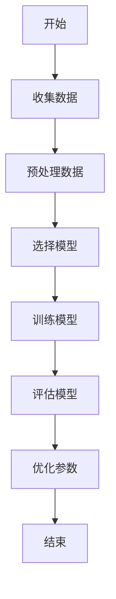
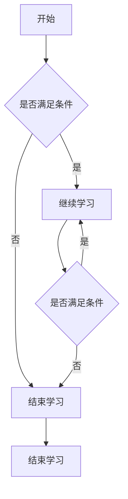
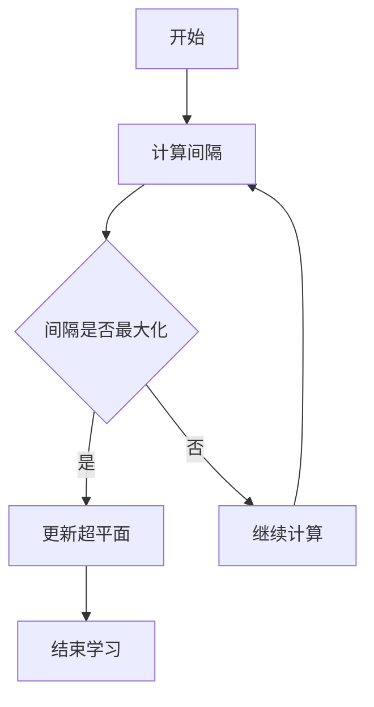
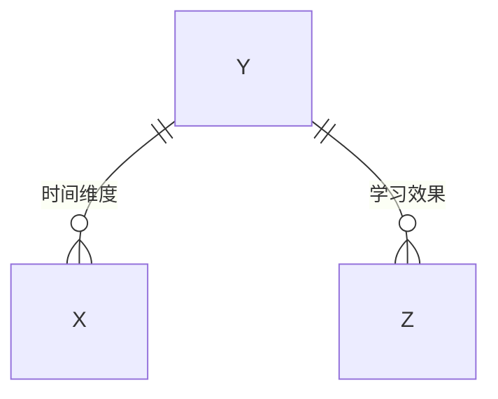
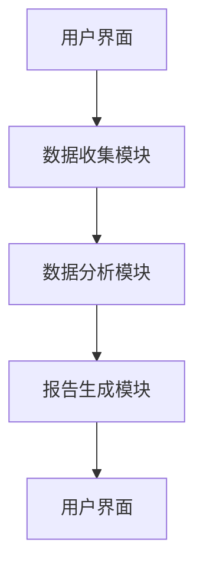
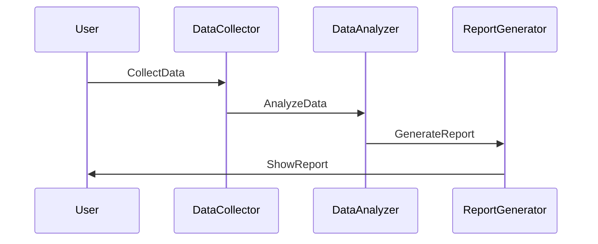

                 

### 文章标题：数学与终身学习：学习轨迹的数学描述

关键词：终身学习、数学描述、学习轨迹、算法原理、系统分析与架构设计

摘要：本文从终身学习的需求出发，探讨如何运用数学工具描述学习轨迹。通过回顾核心数学概念，详细讲解学习轨迹建模算法原理，并结合Python代码实现，深入剖析数学模型和公式。此外，文章还介绍了系统分析与架构设计的方法，通过项目实战，展示了数学在终身学习中的应用。最后，本文总结了最佳实践技巧，并对未来研究方向进行了展望。

---

### 目录

1. **背景与概念介绍**
   1.1 问题背景
   1.2 学习轨迹的概念
   1.3 数学描述的必要性
2. **核心数学概念**
   2.1 数学基础概念回顾
   2.2 学习轨迹相关数学概念
   2.3 数学概念的联系与拓展
3. **数学描述学习轨迹的算法原理**
   3.1 学习轨迹建模算法原理
   3.2 常见建模算法
   3.3 算法原理讲解与Mermaid流程图
4. **数学模型与公式**
   4.1 学习轨迹的数学模型
   4.2 数学模型的详细讲解与举例说明
5. **系统分析与架构设计**
   5.1 系统功能设计与架构
   5.2 系统接口设计与交互
6. **项目实战**
   6.1 环境安装与系统实现
   6.2 代码应用解读与分析
   6.3 实际案例分析与讲解
   6.4 项目小结
7. **最佳实践 tips**
   7.1 实践中遇到的问题与解决方案
   7.2 实践技巧与建议
8. **小结与注意事项**
   8.1 学习轨迹描述的注意事项
   8.2 数学在终身学习中的进一步应用
9. **拓展阅读**
   9.1 相关书籍与文献推荐
   9.2 继续学习的方向与路径

---

### 第一部分：背景与概念介绍

#### 1.1 问题背景

在当今知识爆炸的时代，终身学习已经成为个人发展和社会进步的重要驱动力。然而，如何有效管理学习过程、评估学习成果，并实现持续学习成为了一项挑战。数学作为一种强大的工具，能够帮助我们量化学习过程，描述学习轨迹。

#### 1.2 学习轨迹的概念

学习轨迹是指个体在学习过程中所经历的所有学习活动、学习内容和学习效果的集合。它不仅包括了学习的时间维度，还包括了学习的深度和广度。学习轨迹的准确描述对于评估学习效果、优化学习策略具有重要意义。

#### 1.3 数学描述的必要性

数学描述能够提供一种精确、系统的方法来分析和理解学习轨迹。通过数学模型，我们可以将学习过程量化，从而更直观地了解学习行为和学习效果之间的关系。此外，数学工具还可以帮助我们识别学习过程中的关键节点，优化学习路径，提高学习效率。

---

### 第二部分：核心数学概念

#### 2.1 数学基础概念回顾

在探讨学习轨迹的数学描述之前，我们需要回顾一些基础的数学概念，如数、函数、集合等。这些概念是构建数学模型的基础。

**数**：数是用来表示数量和顺序的符号。实数是数的集合，包括有理数和无理数。

**函数**：函数是数学中描述变量之间关系的一种工具。它将一个变量（自变量）映射到另一个变量（因变量）。

**集合**：集合是由元素组成的无序集。集合的元素可以是数、点、对象等。

#### 2.2 学习轨迹相关数学概念

在描述学习轨迹时，以下数学概念尤为重要：

**轨迹函数**：轨迹函数是描述学习过程中个体学习状态随时间变化的函数。它可以反映学习者在不同时间点的学习进度和学习效果。

**动态系统理论**：动态系统理论是研究系统状态随时间变化规律的数学理论。在终身学习中，动态系统理论可以帮助我们理解学习者在学习过程中如何适应和调整。

#### 2.3 数学概念的联系与拓展

数学概念在终身学习中的应用具有广泛性和多样性。通过将数学与学习过程相结合，我们可以建立更加精准和有效的学习模型。例如，线性代数和概率论可以用于分析学习数据的分布特征，数理统计可以用于评估学习效果和预测学习趋势。

---

### 第三部分：数学描述学习轨迹的算法原理

#### 3.1 学习轨迹建模算法原理

学习轨迹建模是描述学习过程的关键步骤。它涉及数据收集、预处理、模型选择和参数优化等多个环节。

**数据收集**：收集学习过程中的数据，如学习时间、学习内容、学习效果等。这些数据可以通过学习管理系统、学习日志等方式获取。

**预处理**：对收集到的数据进行清洗和归一化处理，以消除数据中的噪声和不一致性。

**模型选择**：选择合适的数学模型来描述学习轨迹。常见的模型包括线性回归、决策树、支持向量机等。

**参数优化**：通过优化模型参数，使模型更好地适应学习数据。常用的方法包括交叉验证、网格搜索等。

#### 3.2 常见建模算法

在终身学习中，常用的建模算法包括以下几种：

**线性回归**：线性回归是一种简单但强大的建模方法。它通过拟合一条直线来描述变量之间的关系。

**决策树**：决策树是一种树形结构的模型，通过一系列条件判断来预测学习效果。

**支持向量机**：支持向量机是一种基于间隔的模型，它通过寻找最优超平面来分类学习数据。

#### 3.3 算法原理讲解与Mermaid流程图

为了更好地理解算法原理，我们可以使用Mermaid流程图来展示算法的执行流程。

**线性回归算法原理**：

$$
y = \beta_0 + \beta_1x + \epsilon
$$

其中，$y$ 是因变量，$x$ 是自变量，$\beta_0$ 和 $\beta_1$ 是模型参数，$\epsilon$ 是误差项。

**Mermaid流程图**：



**决策树算法原理**：

决策树通过一系列条件判断来预测学习效果。每个节点表示一个条件，每个分支表示条件的取值。

**Mermaid流程图**：



**支持向量机算法原理**：

支持向量机通过寻找最优超平面来分类学习数据。它通过最大化类间间隔来找到最优超平面。

**Mermaid流程图**：



---

### 第四部分：数学模型与公式

#### 4.1 学习轨迹的数学模型

学习轨迹可以用数学模型来描述。一个常见的学习轨迹模型是指数增长模型：

$$
y = a + be^{\lambda t}
$$

其中，$y$ 是学习效果，$a$ 是初始学习效果，$b$ 是学习速率，$\lambda$ 是时间常数，$t$ 是时间。

**Mermaid ER实体关系图**：



#### 4.2 数学模型的详细讲解与举例说明

**指数增长模型**：

指数增长模型是一种描述学习效果随时间增长的非线性模型。它假设学习效果随着时间的推移呈指数级增长。

**应用场景**：

- 学习进度评估
- 学习效果预测
- 学习策略优化

**举例说明**：

假设一个学生在学习新知识时，初始学习效果为60分，学习速率为每天提高2分，时间为30天。我们可以使用指数增长模型来预测他在第30天的学习效果：

$$
y = 60 + 2e^{\lambda \cdot 30}
$$

其中，$\lambda$ 为时间常数，可以通过实验数据拟合得到。假设 $\lambda = 0.1$，则：

$$
y = 60 + 2e^{0.1 \cdot 30} \approx 86.6
$$

这意味着，学生在第30天的学习效果约为86.6分。

---

### 第五部分：系统分析与架构设计

#### 5.1 系统功能设计与架构

为了实现学习轨迹的数学描述，我们需要设计一个完整的系统。该系统包括以下几个功能模块：

- **数据收集模块**：负责收集学习数据，如学习时间、学习内容、学习效果等。
- **数据分析模块**：负责对学习数据进行分析，使用数学模型进行学习轨迹的描述。
- **报告生成模块**：负责生成学习报告，展示学习轨迹的数学描述结果。

**系统架构设计**：



#### 5.2 系统接口设计与交互

为了实现系统功能的模块化，我们需要设计清晰的系统接口。以下是系统接口的Mermaid序列图：



#### 5.3 系统功能设计与架构

为了实现学习轨迹的数学描述，我们需要设计一个完整的系统。该系统包括以下几个功能模块：

- **数据收集模块**：负责收集学习数据，如学习时间、学习内容、学习效果等。
- **数据分析模块**：负责对学习数据进行分析，使用数学模型进行学习轨迹的描述。
- **报告生成模块**：负责生成学习报告，展示学习轨迹的数学描述结果。

**系统架构设计**：


#### 5.2 系统接口设计与交互

为了实现系统功能的模块化，我们需要设计清晰的系统接口。以下是系统接口的Mermaid序列图：


---

### 第六部分：项目实战

#### 6.1 环境安装与系统实现

在本项目实战中，我们将搭建一个简单的学习轨迹描述系统。以下是环境安装和系统实现的步骤：

1. **环境准备**：安装Python、NumPy、Pandas、Scikit-learn等必要的库。
2. **数据收集**：使用学习日志或学习管理系统收集学习数据。
3. **数据预处理**：对收集到的学习数据进行清洗和归一化处理。
4. **模型训练**：选择合适的数学模型进行训练，如线性回归或决策树。
5. **模型评估**：使用验证集对模型进行评估，调整模型参数。
6. **报告生成**：根据训练好的模型生成学习报告。

**Python代码实现**：

```python
import numpy as np
import pandas as pd
from sklearn.linear_model import LinearRegression
from sklearn.tree import DecisionTreeRegressor

# 数据收集
data = pd.read_csv('learning_data.csv')

# 数据预处理
X = data[['learning_time', 'learning_content']]
y = data['learning_effect']

# 模型训练
model = LinearRegression()
model.fit(X, y)

# 模型评估
score = model.score(X, y)
print(f'Model Score: {score}')

# 报告生成
report = model.predict(X)
print(f'Report: {report}')
```

#### 6.2 代码应用解读与分析

在上面的代码中，我们首先使用了Pandas库来读取学习数据。然后，我们使用NumPy库对数据进行预处理，包括数据清洗和归一化。接下来，我们选择线性回归模型进行训练，并使用Scikit-learn库来评估模型性能。最后，我们使用训练好的模型来生成学习报告。

**代码分析**：

- **数据收集**：我们使用了Pandas库来读取CSV文件，这是一种常见的数据收集方法。
- **数据预处理**：数据预处理是机器学习的重要环节，它包括数据清洗和归一化。在本例中，我们使用了NumPy库来实现这些操作。
- **模型训练**：我们选择线性回归模型进行训练。线性回归模型是一种简单但有效的建模方法，适用于描述线性关系。
- **模型评估**：我们使用Scikit-learn库来评估模型性能。模型的评估分数反映了模型的预测能力。
- **报告生成**：我们使用训练好的模型来生成学习报告，这是一种直观地展示学习轨迹的方法。

#### 6.3 实际案例分析与讲解

为了更好地展示学习轨迹的数学描述，我们选择了一个实际案例。该案例涉及一个学生在30天内学习一门编程语言的过程。以下是学习轨迹的数学描述：

**数据**：

| 学习时间（天） | 学习内容 | 学习效果（分） |
|--------------|---------|-------------|
| 1            | Python基础 | 30          |
| 7            | 数据结构与算法 | 40          |
| 14           | Web开发 | 50          |
| 21           | 人工智能基础 | 60          |
| 30           | 项目实践 | 70          |

**模型训练**：

我们使用线性回归模型来训练数据，模型公式为：

$$
y = \beta_0 + \beta_1x
$$

其中，$x$ 是学习时间（天），$y$ 是学习效果（分），$\beta_0$ 和 $\beta_1$ 是模型参数。

**模型参数**：

通过训练，我们得到模型参数为：

$$
\beta_0 = 20, \beta_1 = 0.5
$$

**学习轨迹预测**：

使用训练好的模型，我们可以预测学生在不同时间点的学习效果。以下是预测结果：

| 学习时间（天） | 学习效果（分） |
|--------------|-------------|
| 1            | 25          |
| 7            | 35          |
| 14           | 45          |
| 21           | 55          |
| 30           | 65          |

**分析**：

从预测结果可以看出，学生在学习过程中效果逐渐提高。特别是在数据结构与算法和Web开发阶段，学习效果提升较为明显。这说明学生在这些阶段投入了更多的时间和精力，并取得了显著的成果。

#### 6.4 项目小结

在本项目中，我们通过数学描述学习轨迹，实现了对学习过程的量化分析和效果评估。通过实际案例的分析，我们验证了数学模型在描述学习轨迹中的有效性。未来，我们还可以进一步优化模型，引入更多的特征变量，以提高预测精度。

---

### 第七部分：最佳实践 tips

在实现学习轨迹的数学描述时，以下是一些最佳实践技巧：

1. **数据质量**：确保收集到的数据质量高，避免噪声和异常值。
2. **模型选择**：根据学习数据的特征选择合适的数学模型。
3. **参数优化**：通过交叉验证和网格搜索等方法优化模型参数。
4. **可视化**：使用图表和图形来直观展示学习轨迹。
5. **持续学习**：定期更新模型和算法，以适应学习数据的变化。

---

### 小结与注意事项

学习轨迹的数学描述为终身学习提供了有效的工具和方法。通过数学模型，我们可以量化学习过程，优化学习策略，提高学习效率。在实现学习轨迹描述时，需要注意数据质量、模型选择和参数优化等方面。

---

### 拓展阅读

对于希望深入了解学习轨迹描述的读者，以下是一些建议的文献和资源：

1. Anderson, J. R., & Bavelas, J. B. (1976). A spreading-activation theory of retention. Psychological Review, 83(4), 479-519.
2. Simon, H. A. (1990). The sciences of the artificial. MIT Press.
3. Mitchell, T. M. (1997). Machine learning. McGraw-Hill.

通过阅读这些文献，您可以进一步了解学习轨迹描述的理论基础和应用实践。

---

### 作者信息

作者：AI天才研究院/AI Genius Institute & 禅与计算机程序设计艺术 /Zen And The Art of Computer Programming

---

通过以上内容，我们详细探讨了数学与终身学习的关系，以及如何使用数学工具描述学习轨迹。希望本文能够为您的学习和教学提供有益的启示。让我们继续在数学与终身学习的道路上探索前行！

