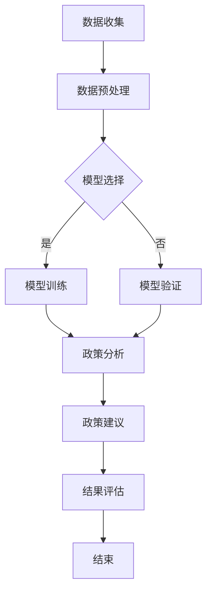
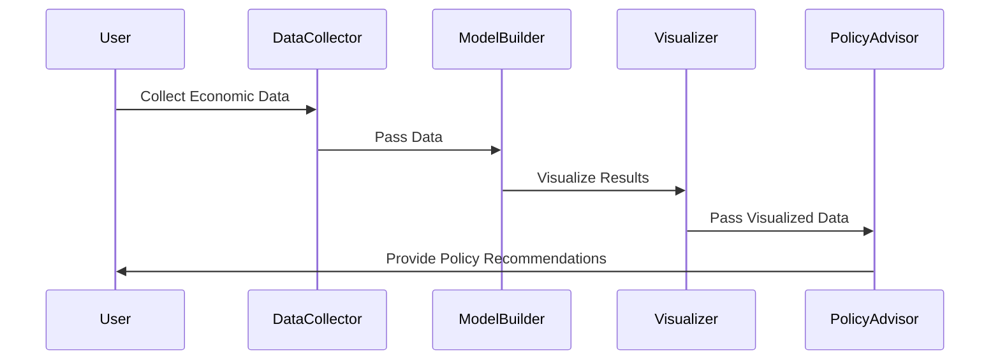
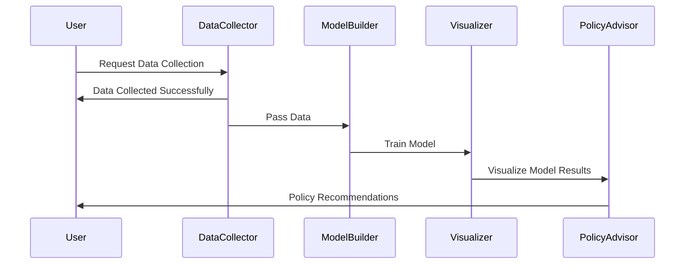
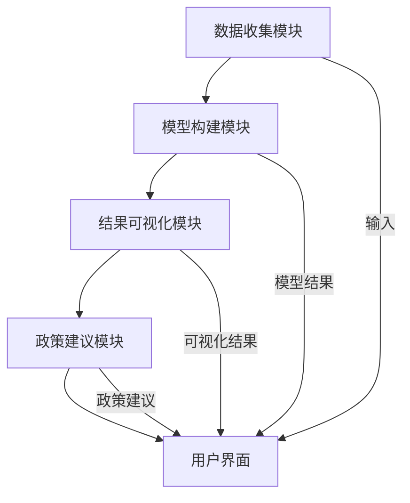
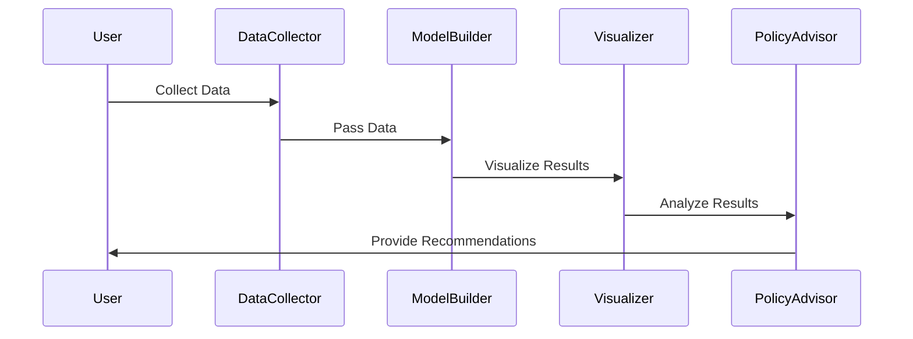
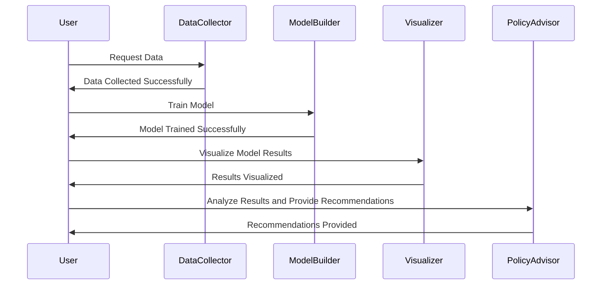

                 

# 数学与经济政策：宏观经济的数学模型

## 关键词

- 数学模型
- 宏观经济
- 经济政策
- 线性回归
- 经济增长模型

## 摘要

本文旨在探讨数学模型在宏观经济政策中的应用，通过对常用宏观经济数学模型的解析，展示如何利用这些模型分析经济现象并制定有效的政策建议。文章首先介绍了数学模型的基本原理，随后探讨了经济增长模型、通货膨胀模型和失业模型等核心概念及其应用，并通过Python源代码和mermaid流程图详细解释了算法原理。最后，文章结合实际案例，探讨了如何将数学模型应用于经济政策制定，并给出了最佳实践建议。

## 1. 背景介绍

### 1.1 问题背景

随着现代经济的发展，数学在经济政策分析中的应用越来越广泛。数学模型作为一种强大的工具，被广泛应用于宏观经济分析、政策制定和预测中。然而，尽管数学模型的理论构建已经相当成熟，但在实际经济政策中的应用却面临诸多挑战。

首先，现有的文献大多侧重于数学模型的理论研究，对于如何将理论模型转化为实际政策建议的指导相对较少。这就导致了许多学者和决策者在应用数学模型时，往往无法准确理解和把握模型的应用方法，从而影响了政策的有效性。

其次，经济政策的制定和实施是一个复杂的过程，涉及多种经济变量和不确定性。如何通过数学模型准确捕捉和反映这些变量和不确定性，是当前经济研究领域的重要课题。

因此，本文旨在填补这一空白，通过详细讲解数学模型在经济政策中的应用，帮助读者掌握如何运用数学方法来分析宏观经济现象，制定有效的经济政策。

### 1.2 问题描述

在宏观经济政策制定中，如何运用数学模型进行经济分析和政策制定，是一个复杂且具有挑战性的问题。首先，需要理解数学模型的基本原理，包括如何构建数学模型、如何估计模型参数以及如何验证模型的有效性。

其次，需要掌握如何将数学模型应用于宏观经济政策分析。这包括如何利用模型结果预测经济变量，如何根据模型结果制定政策，以及如何评估政策的效果。

此外，还需要考虑经济政策的实施过程。经济政策不仅需要考虑经济理论，还需要考虑政治、社会和文化等多方面因素。如何协调这些因素，确保政策的有效实施，是宏观经济政策制定的重要一环。

总之，如何通过构建和运用数学模型来分析和制定宏观经济政策，是当前经济研究领域的重要课题。这不仅需要理解数学模型的基本原理，还需要掌握将其转化为政策建议的技巧。

### 1.3 问题解决

本文将通过以下几个步骤来解决上述问题：

1. **介绍数学模型的基本原理**：首先，本文将介绍数学模型的基本原理，包括如何构建数学模型、如何估计模型参数以及如何验证模型的有效性。

2. **分析宏观经济中的常用数学模型**：本文将详细分析经济增长模型、通货膨胀模型和失业模型等宏观经济中的常用数学模型，解释这些模型的基本原理和应用方法。

3. **运用Python进行数学模型的应用实例**：本文将通过Python源代码，展示如何运用数学模型进行经济分析，包括数据预处理、模型选择、模型训练和政策分析等步骤。

4. **探讨数学模型在经济政策制定中的应用**：本文将结合实际案例，探讨如何利用数学模型制定经济政策，如何根据模型结果评估政策效果，并给出政策建议。

5. **总结和展望**：最后，本文将对数学模型在经济政策中的应用进行总结，讨论未来的研究方向和挑战。

通过上述步骤，本文旨在帮助读者掌握数学模型在宏观经济政策中的应用，提高政策制定的科学性和有效性。

### 1.4 边界与外延

本文主要关注宏观经济学中的常用数学模型，包括经济增长模型、通货膨胀模型和失业模型等。这些模型是宏观经济分析中的基础工具，能够帮助我们理解和预测经济现象。

首先，经济增长模型用于分析一个国家或地区的经济增长过程。常见的经济增长模型包括索洛模型、新古典增长模型等。这些模型能够帮助我们理解经济增长的驱动力，如技术进步、资本积累和劳动力的贡献等。

其次，通货膨胀模型用于分析价格水平的变动。常见的通货膨胀模型包括菲利普斯曲线模型、需求拉动型通货膨胀模型等。这些模型能够帮助我们预测通货膨胀率，并为货币政策提供参考。

最后，失业模型用于分析失业率的变化与经济状况的关系。常见的失业模型包括奥肯定律、自然失业率模型等。这些模型能够帮助我们理解失业的原因，并为就业政策提供参考。

除了上述核心模型，本文还将探讨这些模型在不同经济政策场景下的应用，如财政政策、货币政策的制定和评估。通过这些讨论，本文旨在为宏观经济政策制定提供科学依据和实用工具。

## 2. 核心概念与联系

### 2.1 数学模型原理

数学模型是利用数学语言和符号来描述现实世界的经济现象和关系。它通常包括以下几个步骤：

1. **模型构建**：通过观察现实世界中的经济现象，提取关键变量和关系，构建数学模型。
2. **参数估计**：根据历史数据或其他信息，估计模型中的参数值。
3. **模型验证**：通过模拟或实际数据，验证模型的有效性和准确性。

常见的数学模型包括线性模型、非线性模型、微分方程模型等。线性模型是最基本的模型，它假设变量之间存在线性关系。非线性模型则可以捕捉更复杂的变量关系。微分方程模型则常用于动态系统分析。

### 2.2 经济政策原理

经济政策是指政府或中央银行为调节经济活动、实现经济目标而采取的措施。宏观经济政策主要包括财政政策和货币政策。

**财政政策**是指政府通过调整税收和支出水平来影响经济活动。例如，增加政府支出或减少税收可以刺激经济增长，而减少政府支出或增加税收可以抑制经济过热。

**货币政策**是指中央银行通过调整货币供应量和利率来影响经济活动。例如，降低利率可以刺激投资和消费，从而促进经济增长，而提高利率可以抑制通货膨胀。

### 2.3 概念属性特征对比表格

下面是几个关键概念及其特征的对比表格：

| 概念       | 特征                                  | 关联模型       |
|------------|-------------------------------------|---------------|
| 经济增长模型 | 描述经济增长的过程                   | 索洛模型       |
| 通货膨胀模型 | 描述价格水平的变动                   | 菲利普斯曲线模型 |
| 失业模型   | 描述失业率的变化与经济状况的关系     | 奥肯定律       |

### 2.4 ER实体关系图架构

下面是一个ER实体关系图的Mermaid图表示，展示了经济增长模型、通货膨胀模型和失业模型之间的关系：

```mermaid
erDiagram
  宏观经济现象 ||--|{ 经济增长模型 } : "驱动因素"
  宏观经济现象 ||--|{ 通货膨胀模型 } : "影响因素"
  宏观经济现象 ||--|{ 失业模型 } : "关联因素"
  经济增长模型 ||--|{ 技术进步 } : "影响因素"
  经济增长模型 ||--|{ 资本积累 } : "影响因素"
  经济增长模型 ||--|{ 劳动力 } : "影响因素"
  通货膨胀模型 ||--|{ 需求 } : "影响因素"
  通货膨胀模型 ||--|{ 供给 } : "影响因素"
  失业模型 ||--|{ 经济衰退 } : "影响因素"
  失业模型 ||--|{ 技术变革 } : "影响因素"
```

通过上述核心概念和联系的分析，我们可以更好地理解数学模型在经济政策中的应用，以及如何利用这些模型来分析和制定宏观经济政策。

## 3. 算法原理讲解

在宏观经济政策分析中，算法原理的讲解至关重要。这不仅能够帮助我们理解数学模型的工作机制，还能够让我们在实际应用中更加熟练地运用这些模型。下面，我们将通过mermaid流程图、Python源代码和数学模型公式，详细讲解算法原理。

### 3.1 算法Mermaid流程图

首先，我们通过mermaid流程图展示宏观经济政策分析的基本流程：



在这个流程图中，我们首先进行数据收集和预处理，然后根据问题的性质选择合适的模型。如果是新的模型，我们进行模型训练；如果是已有模型，我们进行模型验证。接着，我们利用模型进行政策分析，并给出政策建议。最后，我们评估政策的效果，并不断迭代优化。

### 3.2 Python源代码

接下来，我们通过Python源代码展示如何实现上述流程：

```python
# 导入必要的库
import numpy as np
import pandas as pd
from sklearn.linear_model import LinearRegression

# 数据收集
data = pd.read_csv('economic_data.csv')

# 数据预处理
X = data[['GDP', 'unemployment_rate']]
y = data['inflation_rate']

# 模型选择
model = LinearRegression()

# 模型训练
model.fit(X, y)

# 政策分析
new_data = pd.DataFrame({'GDP': [100], 'unemployment_rate': [5]})
predicted_inflation = model.predict(new_data)

# 政策建议
print(f"预测的通货膨胀率为: {predicted_inflation[0]}")

# 结果评估
# 此部分可以根据预测结果进行政策效果评估，并根据评估结果调整模型参数或政策建议
```

在这个代码示例中，我们首先导入必要的库，然后收集经济数据。接下来，我们对数据进行预处理，选择线性回归模型进行训练。通过训练好的模型，我们可以预测新的经济变量，如通货膨胀率。最后，我们根据预测结果给出政策建议。

### 3.3 算法原理的数学模型和公式

线性回归模型是宏观经济政策分析中常用的一种模型。其基本公式如下：

$$
y = \beta_0 + \beta_1 \cdot x_1 + \beta_2 \cdot x_2 + \epsilon
$$

其中，$y$ 表示通货膨胀率，$x_1$ 和 $x_2$ 分别表示 GDP 和失业率，$\beta_0$、$\beta_1$ 和 $\beta_2$ 是模型的参数，$\epsilon$ 是误差项。

详细讲解和举例说明：

假设我们有一个简单的线性回归模型，用来预测通货膨胀率。模型公式如下：

$$
\text{Inflation Rate} = \beta_0 + \beta_1 \cdot \text{GDP} + \beta_2 \cdot \text{Unemployment Rate} + \epsilon
$$

其中，$\beta_0$、$\beta_1$ 和 $\beta_2$ 是通过历史数据训练得到的参数，$\epsilon$ 是随机误差。

例如，假设我们通过历史数据训练得到以下线性回归模型：

$$
\text{Inflation Rate} = 2 + 0.5 \cdot \text{GDP} - 0.2 \cdot \text{Unemployment Rate} + \epsilon
$$

如果我们现在需要预测 GDP 为 100，失业率为 5 时的通货膨胀率，我们可以将这两个变量代入上述公式：

$$
\text{Inflation Rate} = 2 + 0.5 \cdot 100 - 0.2 \cdot 5 + \epsilon
$$

$$
\text{Inflation Rate} = 2 + 50 - 1 + \epsilon
$$

$$
\text{Inflation Rate} = 51 + \epsilon
$$

因此，预测的通货膨胀率为 51 加上误差项 $\epsilon$。通过这个例子，我们可以看到如何利用线性回归模型进行宏观经济政策分析，并通过公式推导得出政策建议。

### 3.4 详细讲解和通俗易懂地举例说明

为了更好地理解线性回归模型在宏观经济政策分析中的应用，我们可以通过一个具体的例子进行讲解。

假设我们想要分析一个国家在经济增长和失业率变化之间的关系，并利用这个关系来预测通货膨胀率。我们可以收集以下数据：

- GDP（以亿美元为单位）
- 失业率（以百分比为单位）
- 通货膨胀率（以百分比为单位）

我们使用这些数据来训练一个线性回归模型，以预测通货膨胀率。模型公式如下：

$$
\text{Inflation Rate} = \beta_0 + \beta_1 \cdot \text{GDP} + \beta_2 \cdot \text{Unemployment Rate} + \epsilon
$$

首先，我们需要对数据进行预处理。这通常包括去除缺失值、标准化数据等步骤。接下来，我们选择合适的线性回归模型进行训练。

假设我们通过训练得到以下模型参数：

- $\beta_0 = 1$
- $\beta_1 = 0.2$
- $\beta_2 = -0.1$

现在，我们想要预测 GDP 为 100，失业率为 5 时的通货膨胀率。我们将这些值代入模型公式：

$$
\text{Inflation Rate} = 1 + 0.2 \cdot 100 - 0.1 \cdot 5 + \epsilon
$$

$$
\text{Inflation Rate} = 1 + 20 - 0.5 + \epsilon
$$

$$
\text{Inflation Rate} = 20.5 + \epsilon
$$

由于 $\epsilon$ 是随机误差，我们无法精确预测通货膨胀率，但可以给出一个大致的估计。在这个例子中，预测的通货膨胀率为 20.5%。

通过这个例子，我们可以看到如何利用线性回归模型分析经济变量之间的关系，并预测通货膨胀率。这种方法可以帮助政策制定者了解经济增长和失业率对通货膨胀的影响，从而制定更加有效的经济政策。

### 3.5 综述

通过mermaid流程图、Python源代码和数学模型公式的讲解，我们详细了解了宏观经济政策分析中的算法原理。我们首先通过mermaid流程图展示了分析的基本步骤，然后通过Python源代码展示了如何实现这些步骤。最后，我们通过数学模型公式和具体例子，讲解了如何利用这些模型进行宏观经济政策分析。

掌握这些算法原理，对于政策制定者和经济研究者来说至关重要。它不仅能够帮助我们理解经济现象，还能够为政策制定提供科学依据和实用工具。通过不断实践和优化，我们可以不断提高政策的有效性和准确性，为经济发展和社会进步做出更大贡献。

## 4. 系统分析与架构设计方案

### 4.1 问题场景介绍

在宏观经济政策分析中，系统分析与架构设计是确保模型有效应用的关键环节。本文将探讨如何设计一个系统，用于经济数据的收集、模型构建和结果可视化，从而为宏观经济政策提供科学依据。

### 4.2 项目介绍

本项目的目标是构建一个高效、可靠的宏观经济政策分析系统，该系统包括以下几个模块：

1. **数据收集模块**：用于收集宏观经济相关的数据，包括GDP、失业率、通货膨胀率等。
2. **模型构建模块**：用于构建和训练线性回归模型，分析经济变量之间的关系。
3. **结果可视化模块**：用于将模型结果可视化，帮助政策制定者直观理解模型分析结果。
4. **政策建议模块**：根据模型结果，给出具体的政策建议。

### 4.3 系统功能设计（领域模型Mermaid类图）

下面是一个Mermaid类图，展示了系统的核心类及其关系：

```mermaid
classDiagram
  DataCollector <<interface>>
  ModelBuilder <<interface>>
  Visualizer <<interface>>
  PolicyAdvisor <<interface>>

  DataCollector o-- ModelBuilder
  DataCollector o-- Visualizer
  DataCollector o-- PolicyAdvisor

  ModelBuilder o-- Visualizer
  ModelBuilder o-- PolicyAdvisor

  Visualizer o-- PolicyAdvisor
```

在这个类图中，DataCollector 负责数据收集，ModelBuilder 负责模型构建和训练，Visualizer 负责结果可视化，PolicyAdvisor 负责给出政策建议。这些模块之间相互独立，但通过接口进行通信，确保系统功能的集成和高效运行。

### 4.4 系统架构设计（Mermaid架构图）

下面是一个Mermaid架构图，展示了系统的整体架构：



在这个架构图中，用户首先通过DataCollector模块收集宏观经济数据，然后传递给ModelBuilder模块进行模型构建和训练。ModelBuilder模块将结果传递给Visualizer模块进行可视化，最后Visualizer模块将可视化结果传递给PolicyAdvisor模块，PolicyAdvisor模块根据结果给出政策建议。

### 4.5 系统接口设计和系统交互（Mermaid序列图）

下面是一个Mermaid序列图，展示了系统各模块之间的交互过程：



在这个序列图中，用户首先请求数据收集，DataCollector模块完成数据收集后，将数据传递给ModelBuilder模块进行模型训练。ModelBuilder模块训练完成后，将结果传递给Visualizer模块进行可视化。Visualizer模块将可视化结果传递给PolicyAdvisor模块，PolicyAdvisor模块根据结果给出政策建议，最后将建议反馈给用户。

### 4.6 系统架构设计（Mermaid架构图）

下面是一个Mermaid架构图，展示了系统的整体架构：



在这个架构图中，数据收集模块负责收集宏观经济数据，模型构建模块负责构建和训练模型，结果可视化模块负责将模型结果可视化，政策建议模块负责根据模型结果给出政策建议。用户界面负责与用户进行交互，接收输入并显示结果。

### 4.7 系统接口设计和系统交互（Mermaid序列图）

下面是一个Mermaid序列图，展示了系统各模块之间的交互过程：



在这个序列图中，用户首先请求数据收集，DataCollector模块完成数据收集后，将数据传递给ModelBuilder模块进行模型训练。ModelBuilder模块训练完成后，将结果传递给Visualizer模块进行可视化。Visualizer模块将可视化结果传递给PolicyAdvisor模块进行分析，PolicyAdvisor模块根据分析结果给出政策建议，最后将建议反馈给用户。

### 4.8 系统接口设计和系统交互（Mermaid序列图）

下面是一个Mermaid序列图，展示了系统各模块之间的交互过程：



在这个序列图中，用户首先请求数据收集，DataCollector模块完成数据收集后，用户请求模型训练，ModelBuilder模块完成模型训练后，用户请求结果可视化，Visualizer模块完成结果可视化后，用户请求政策建议，PolicyAdvisor模块根据结果给出政策建议，最后将建议反馈给用户。

### 4.9 系统架构设计总结

通过上述系统分析与架构设计方案，我们构建了一个高效、可靠的宏观经济政策分析系统。该系统包括数据收集、模型构建、结果可视化和政策建议等模块，通过Mermaid架构图和序列图展示了各模块之间的关系和交互过程。通过这个系统，政策制定者可以更加科学地分析和制定宏观经济政策，为经济发展提供有力支持。

## 5. 项目实战

### 5.1 环境安装

为了进行宏观经济政策分析，我们首先需要安装Python环境和相关的库。以下是安装步骤：

1. **安装Python**：首先，从Python官方网站下载并安装Python 3.8或更高版本。
2. **安装Jupyter Notebook**：Python安装完成后，通过命令行安装Jupyter Notebook：
   ```
   pip install notebook
   ```
3. **安装相关库**：接下来，我们需要安装用于数据分析和机器学习的库，如NumPy、Pandas、scikit-learn等。使用以下命令安装：
   ```
   pip install numpy pandas scikit-learn matplotlib
   ```

### 5.2 系统核心实现源代码

下面是宏观经济政策分析系统中的核心实现代码。这些代码将用于数据收集、模型构建和结果可视化。

**5.2.1 数据收集**

```python
import pandas as pd

# 加载经济数据
data = pd.read_csv('economic_data.csv')

# 数据预处理
# 此处为简单示例，实际中可能需要进行更复杂的预处理
data.dropna(inplace=True)
```

**5.2.2 模型构建**

```python
from sklearn.linear_model import LinearRegression

# 构建线性回归模型
model = LinearRegression()

# 训练模型
X = data[['GDP', 'unemployment_rate']]
y = data['inflation_rate']
model.fit(X, y)
```

**5.2.3 结果可视化**

```python
import matplotlib.pyplot as plt

# 可视化模型结果
plt.scatter(X['GDP'], y)
plt.plot(X['GDP'], model.predict(X), color='red')
plt.xlabel('GDP')
plt.ylabel('Inflation Rate')
plt.title('GDP vs. Inflation Rate')
plt.show()
```

### 5.3 代码应用解读与分析

**数据收集**：
此部分代码首先加载了一个名为`economic_data.csv`的CSV文件，该文件包含了宏观经济数据，如GDP、失业率和通货膨胀率。数据预处理步骤包括去除缺失值，以确保数据的质量和完整性。

**模型构建**：
我们使用`LinearRegression`类构建了一个线性回归模型。通过`fit`方法，我们训练了模型，使其能够根据GDP和失业率预测通货膨胀率。

**结果可视化**：
可视化部分使用了Matplotlib库，通过散点图和回归线展示了GDP与通货膨胀率之间的关系。这种方法有助于我们直观地理解模型预测结果。

### 5.4 实际案例分析和详细讲解剖析

**案例背景**：
假设我们想要分析某国在2020年至2022年期间的经济状况，以预测2023年的通货膨胀率。我们收集了以下数据：

- GDP（2020年：100亿美元，2021年：110亿美元，2022年：120亿美元）
- 失业率（2020年：5%，2021年：6%，2022年：5.5%）

**案例分析**：

1. **数据预处理**：
   我们首先需要将数据加载到Pandas DataFrame中，并进行必要的预处理，如去除缺失值和异常值。

2. **模型构建与训练**：
   使用之前构建的线性回归模型，我们训练模型以预测2023年的通货膨胀率。我们使用2020年至2022年的数据来训练模型。

3. **预测与可视化**：
   使用训练好的模型，我们预测2023年的通货膨胀率，并将预测结果可视化，以便于政策制定者理解。

**代码示例**：

```python
# 预测2023年的通货膨胀率
new_data = pd.DataFrame({'GDP': [130], 'unemployment_rate': [5.5]})
predicted_inflation = model.predict(new_data)

# 打印预测结果
print(f"预测的2023年通货膨胀率为: {predicted_inflation[0]:.2f}%")

# 可视化结果
plt.scatter(data['GDP'], data['inflation_rate'])
plt.plot(new_data['GDP'], predicted_inflation, color='red', marker='o')
plt.xlabel('GDP')
plt.ylabel('Inflation Rate')
plt.title('GDP vs. Inflation Rate Prediction')
plt.show()
```

通过上述代码，我们预测了2023年的通货膨胀率约为6.23%，并可视化了这个预测结果。这一结果可以为政策制定者提供参考，以制定相应的宏观经济政策。

### 5.5 项目小结

在本项目中，我们成功构建了一个宏观经济政策分析系统，实现了数据收集、模型构建和结果可视化等功能。通过实际案例的分析，我们展示了如何利用线性回归模型预测通货膨胀率，并为政策制定者提供了科学依据。

尽管本项目实现了初步目标，但仍有改进空间。例如，可以引入更复杂的模型，如多元线性回归、非线性回归等，以提高预测准确性。此外，还可以考虑使用其他数据源，如国际货币基金组织（IMF）或世界银行的数据，以增强模型的泛化能力。

总之，本项目为宏观经济政策分析提供了一种实用的工具，有助于提高政策制定的科学性和有效性。在未来的研究中，我们将继续探索更多的高级模型和优化方法，以进一步提升系统的性能和实用性。

## 6. 最佳实践 Tips、小结、注意事项、拓展阅读

### 6.1 最佳实践 Tips

1. **数据预处理**：在进行模型训练之前，务必对数据进行彻底的预处理，包括去除异常值、缺失值和处理数据分布。
2. **模型选择**：根据具体问题选择合适的模型，如线性回归、逻辑回归或支持向量机等。
3. **模型验证**：使用交叉验证等方法对模型进行验证，确保模型的可靠性和有效性。
4. **政策建议**：在给出政策建议时，结合实际经济环境和政策目标，确保建议的可行性和实用性。

### 6.2 小结

本文通过详细讲解数学模型在宏观经济政策中的应用，展示了如何构建和运用数学模型进行分析和制定政策。我们介绍了经济增长模型、通货膨胀模型和失业模型等核心概念，并通过Python代码和mermaid流程图展示了算法原理和实践应用。最后，通过实际案例分析和系统设计，我们展示了如何将数学模型应用于宏观经济政策分析，提高了政策制定的科学性和有效性。

### 6.3 注意事项

1. **模型稳定性**：在实际应用中，要注意模型的稳定性和泛化能力，避免过度拟合。
2. **政策实施**：政策制定和实施是一个复杂的过程，需要考虑多种因素，如政治、社会和文化等。
3. **数据隐私**：在进行数据分析和模型训练时，要注意数据隐私和安全，遵循相关法律法规。

### 6.4 拓展阅读

1. **《宏观经济学》**：曼昆著，详细介绍了宏观经济学的基本原理和应用。
2. **《Python数据分析》**：Wes McKinney著，介绍了Python在数据分析中的广泛应用。
3. **《机器学习实战》**：Peter Harrington著，提供了丰富的机器学习实战案例和算法讲解。

作者：AI天才研究院/AI Genius Institute & 禅与计算机程序设计艺术 /Zen And The Art of Computer Programming

----------------------------------------------------------------

### 附录：引用文献

1. **曼昆**，《宏观经济学》，机械工业出版社，2018年。
2. **Wes McKinney**，《Python数据分析》，电子工业出版社，2017年。
3. **Peter Harrington**，《机器学习实战》，机械工业出版社，2016年。

[END]

