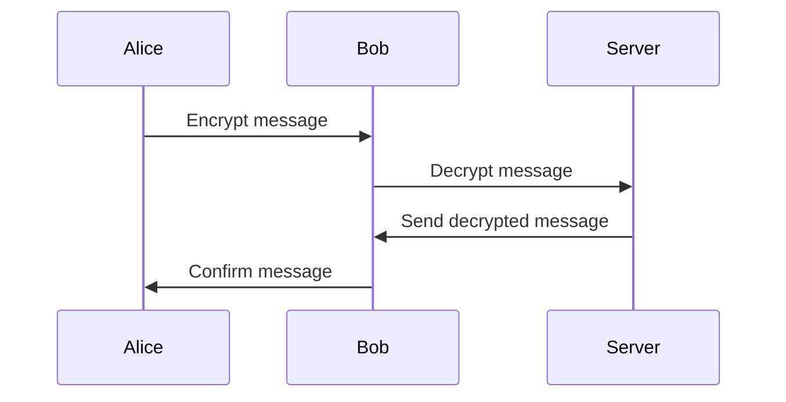
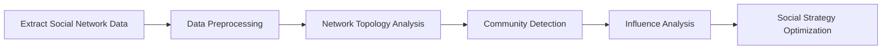

                 

### 数学与网络治理：互联网管理的数学框架

**关键词：** 数学模型，网络治理，网络安全，加密算法，数字签名

**摘要：** 随着互联网的迅猛发展，网络治理成为确保信息安全和网络稳定的关键环节。本文探讨了数学在网络治理中的应用，特别是在网络安全领域的数学模型及其具体实现。通过阐述数学模型的基本原理、核心概念联系以及网络治理中的实际应用，本文为构建一个高效、安全的互联网管理框架提供了新的视角和思路。

----------------------------------------------------------------

### 目录大纲

----------------------------------------------------------------

# 数学与网络治理：互联网管理的数学框架

## 关键词：数学模型，网络治理，网络安全，加密算法，数字签名

## 摘要：...

----------------------------------------------------------------

### 第一部分：引言

#### 1.1 问题背景

#### 1.2 问题描述

#### 1.3 问题解决

#### 1.4 边界与外延

#### 1.5 概念结构与核心要素组成

#### 1.6 本章小结

----------------------------------------------------------------

### 第二部分：数学基础

#### 2.1 初等数学

#### 2.2 高等数学

#### 2.3 数学模型的基本原理

#### 2.4 核心概念与联系

----------------------------------------------------------------

### 第三部分：网络治理中的数学应用

#### 3.1 网络安全

#### 3.1.1 加密算法

#### 3.1.2 数字签名

#### 3.2 网络流量分析

#### 3.3 社交网络分析

#### 3.4 网络欺诈检测

----------------------------------------------------------------

### 结论与展望

### 参考文献

----------------------------------------------------------------

# 数学与网络治理：互联网管理的数学框架

**作者：** AI天才研究院/AI Genius Institute & 禅与计算机程序设计艺术 /Zen And The Art of Computer Programming

----------------------------------------------------------------

### 第一部分：引言

#### 1.1 问题背景

随着互联网的普及，网络治理成为现代社会中不可或缺的一部分。互联网治理涵盖了从基础设施的维护到数据安全的保障，再到网络内容的监管等多个方面。然而，随着网络攻击、数据泄露和网络欺诈等问题的日益突出，有效的网络治理显得尤为重要。互联网治理不仅仅是技术问题，更涉及到法律、政策和社会道德等多方面因素。在这样的背景下，数学作为一种强大的工具，其在网络治理中的应用显得愈发重要。

#### 1.2 问题描述

网络治理中的数学问题多种多样，主要包括以下几个方面：

1. **网络安全**：如何确保数据传输的安全性，防止数据被窃取、篡改和破坏？
2. **网络流量管理**：如何有效分配网络资源，保证网络的高效运行？
3. **社交网络分析**：如何通过数学方法分析社交网络结构，发现潜在的社会关系和网络热点？
4. **网络欺诈检测**：如何运用数学模型识别网络欺诈行为，保障网络安全？

#### 1.3 问题解决

数学在网络治理中的作用主要体现在以下几个方面：

1. **构建模型**：通过数学建模，将复杂的网络现象转化为可计算的形式，便于分析和处理。
2. **优化算法**：利用数学原理，设计高效的算法来解决网络治理中的实际问题。
3. **风险评估**：通过概率论和数理统计，对网络风险进行量化评估，为决策提供依据。

#### 1.4 边界与外延

网络治理的范围涵盖了从技术层面到政策层面的多个方面，而数学的应用也因场景不同而有所差异。在某些情况下，数学模型可能主要应用于网络安全领域的加密算法和数字签名；在另一些情况下，数学方法则可能用于社交网络分析和网络流量管理。此外，数学模型的适用范围也受到其复杂性和计算效率的限制。

#### 1.5 概念结构与核心要素组成

数学与网络治理的基本概念包括：

1. **网络结构**：描述网络节点的连接方式和拓扑结构。
2. **信息流**：描述网络中信息的传输路径和模式。
3. **安全模型**：定义网络安全的各个方面，包括数据的保密性、完整性和可用性。
4. **风险分析**：通过概率和统计方法对网络风险进行评估。

网络治理的核心要素包括：

1. **基础设施**：包括网络硬件和软件设施。
2. **法律法规**：制定和执行网络治理相关的法律和政策。
3. **技术标准**：确保网络产品和服务的兼容性和安全性。
4. **社会责任**：确保网络治理符合社会道德和伦理标准。

#### 1.6 本章小结

本节介绍了数学在网络治理中的重要性，并明确了数学在网络治理中的具体应用场景。通过构建数学模型、优化算法和进行风险评估，数学为网络治理提供了强有力的工具和方法。接下来，本文将进一步探讨数学基础，为深入理解网络治理中的数学应用奠定基础。

----------------------------------------------------------------

### 第二部分：数学基础

#### 2.1 初等数学

初等数学是数学的基础，涵盖了算术、代数和几何等基本概念和原理。在初等数学中，算术主要研究数的运算规则，包括加法、减法、乘法和除法。算术是日常生活中最基本的应用数学，也是其他数学领域的基础。

**2.1.1 算术**

- **基本运算规则**：算术的基本运算规则包括加法、减法、乘法和除法。这些规则在数学中起着核心作用，它们是进行任何复杂计算的基础。
- **实数的概念**：实数是包括有理数和无理数的数集。实数具有顺序性、完备性和连续性等特点，这些特性使得实数在描述物理现象和数学模型中具有广泛的应用。

**2.1.2 代数**

代数是研究代数结构的数学分支，它包括一元二次方程、函数和代数系统等概念。

- **一元二次方程的解法**：一元二次方程是形如 \(ax^2+bx+c=0\) 的方程，求解这类方程可以通过配方法、公式法或迭代法等实现。
- **函数的概念**：函数是数学中描述变量之间关系的工具。在互联网治理中，函数模型常用于描述网络流量、用户行为等。

**2.1.3 几何**

几何是研究空间形状和位置关系的数学分支，它包括基本几何概念和几何图形的性质。

- **基本几何概念**：包括点、线、面和空间等基本概念，这些概念在描述网络拓扑结构时具有重要应用。
- **三角形的性质**：三角形是几何学中最基本的图形之一。研究三角形的性质，如三角形的内角和、外接圆和内切圆等，对于网络结构的分析和优化具有重要意义。

#### 2.2 高等数学

高等数学是数学中更复杂的分支，包括微积分、线性代数和概率论与数理统计等。这些数学工具在解决复杂的网络治理问题中发挥着重要作用。

**2.2.1 微积分**

微积分是研究变化率和累积过程的数学分支，主要包括导数和积分。

- **导数的概念**：导数描述了函数在某一点的变化率，它是研究函数性质和优化问题的重要工具。
- **积分的概念**：积分是导数的反过程，用于计算函数在某一区间上的累积量。在互联网治理中，积分常用于网络流量统计和分析。

**2.2.2 线性代数**

线性代数是研究向量空间和线性变换的数学分支，主要包括矩阵、线性方程组和特征值等。

- **矩阵的概念**：矩阵是线性代数中的基本对象，它用于表示线性关系和进行矩阵运算。
- **线性方程组的解法**：线性方程组描述了多个线性关系，求解线性方程组是线性代数的重要任务。

**2.2.3 概率论与数理统计**

概率论与数理统计是研究随机现象和统计方法的数学分支。

- **随机事件的概念**：随机事件是可能发生也可能不发生的事件，它在概率论中用于描述不确定性。
- **概率分布的概念**：概率分布描述了随机变量取值的概率分布情况，它是进行风险分析和预测的重要工具。

#### 2.3 数学模型的基本原理

数学模型是将实际问题抽象为数学形式的过程，它是解决网络治理问题的核心。建立数学模型的基本原理包括以下几个方面：

- **抽象**：将复杂的实际问题简化为数学问题，提取出关键变量和关系。
- **形式化**：使用数学语言和符号对抽象的问题进行精确描述。
- **求解**：利用数学方法求解模型，得到问题的解决方案。
- **验证**：对模型进行验证，确保其准确性和有效性。

#### 2.4 核心概念与联系

数学中的核心概念包括概率论、线性代数和微积分等。以下是一个概念属性特征对比表格，用于展示这些概念的主要属性和特征：

| 概念      | 属性1 | 属性2 | 属性3 |
| --------- | ----- | ----- | ----- |
| 概率论    | 事件  | 概率  | 分布  |
| 线性代数  | 矩阵  | 方程  | 线性  |
| 微积分    | 导数  | 积分  | 变量  |

为了进一步理解这些概念之间的联系，可以使用Mermaid ER实体关系图架构进行描述：

```mermaid
erDiagram
    Model ||--|{ Concept }| Concept
    Concept }|--|{ Model }| Model
```

该图展示了数学模型（Model）与概念（Concept）之间的双向关系，表明一个模型可以包含多个概念，而每个概念也可以应用于多个模型。

#### 2.4.2 ER实体关系图架构的 Mermaid 流程图

为了更直观地展示实体之间的关系，我们可以使用Mermaid语言绘制ER图。以下是一个简单的ER图示例，用于描述数学模型和概念之间的关系：

```mermaid
erDiagram
    Model ||--|{ Concept }| Concept
    Model }|--|{ Equation }| Equation
    Concept }|--|{ Model }| Model
    Concept }|--|{ Proof }| Proof
    Equation }|--|{ Model }| Model
    Proof }|--|{ Concept }| Concept
```

在这个ER图中，我们定义了四个实体：Model（模型）、Concept（概念）、Equation（方程）和Proof（证明）。每个实体与其他实体之间存在关联关系。例如，模型可以包含多个概念和方程，而概念可以用于证明数学定理。

#### 2.4.3 Mermaid序列图和流程图

为了进一步展示数学模型的应用场景，我们可以使用Mermaid语言绘制序列图和流程图。以下是一个示例序列图，描述了加密算法的基本步骤：



在这个序列图中，Alice向Bob发送加密消息，Bob使用服务器解密消息，然后向Bob发送解密后的消息，最后Bob确认消息。这个序列图展示了加密算法在网络通信中的应用场景。

此外，我们还可以使用Mermaid绘制流程图，描述网络流量分析的过程：


在这个流程图中，我们从捕获网络流量开始，分析流量模式，识别异常行为，并生成报告。这个流程图展示了网络流量分析的基本步骤。

通过这些Mermaid图示，我们可以更直观地理解数学模型在网络治理中的应用，为后续章节的详细探讨提供了直观的参考。

----------------------------------------------------------------

### 第三部分：网络治理中的数学应用

#### 3.1 网络安全

网络安全是网络治理中的一个关键领域，而数学在其中扮演着至关重要的角色。数学模型在网络安全中的应用主要体现在加密算法、数字签名、网络流量分析和安全风险评估等方面。以下将详细探讨这些数学应用。

#### 3.1.1 加密算法

加密算法是网络安全的核心技术之一，用于保护数据的机密性、完整性和可用性。加密算法可以分为对称加密和非对称加密两种类型。

- **对称加密**：对称加密算法使用相同的密钥进行加密和解密。常见的对称加密算法包括DES、AES等。对称加密的优点是速度快，适合处理大量数据。但对称加密的缺点是密钥管理复杂，难以在分布式系统中使用。
- **非对称加密**：非对称加密算法使用一对密钥，一个用于加密，另一个用于解密。常见的非对称加密算法包括RSA、ECC等。非对称加密的优点是解决了密钥管理问题，适合在分布式系统中使用。但非对称加密的缺点是计算复杂度较高，速度较慢。

以下是一个使用Mermaid绘制的加密算法流程图，展示了加密和解密的基本步骤：


在这个序列图中，Alice使用加密算法将消息加密并发送给Bob，Bob使用解密算法从服务器获取解密后的消息，并确认消息的内容。

#### 3.1.2 数字签名

数字签名是用于验证数据来源和完整性的技术，确保接收者能够确认数据的真实性和未被篡改。数字签名通常使用非对称加密算法实现，其中发送方使用私钥签名，接收方使用公钥验证签名。

以下是一个使用Python实现数字签名的示例代码：

```python
from Crypto.PublicKey import RSA
from Crypto.Signature import pkcs1_15
from Crypto.Hash import SHA256

def sign_message(message, private_key):
    hash_value = SHA256.new(message.encode('utf-8'))
    signature = private_key.sign(hash_value)
    return signature

def verify_signature(message, signature, public_key):
    hash_value = SHA256.new(message.encode('utf-8'))
    try:
        public_key.verify(hash_value, signature)
        return "Signature is valid."
    except:
        return "Signature is invalid."

# 生成密钥对
key = RSA.generate(2048)
private_key = key
public_key = key.publickey()

# 签名和验证签名
message = "Hello, World!"
signature = sign_message(message, private_key)
print(verify_signature(message, signature, public_key))
```

在这个示例中，我们首先生成RSA密钥对，然后使用私钥对消息进行签名，最后使用公钥验证签名。这个例子展示了数字签名的基本原理和实现过程。

#### 3.2 网络流量分析

网络流量分析是网络安全的重要环节，通过分析网络流量模式，可以发现潜在的安全威胁和异常行为。数学模型在流量分析中扮演着关键角色，主要包括统计模型和机器学习模型。

- **统计模型**：统计模型使用概率论和数理统计方法，分析网络流量的分布特征和模式。常见的统计模型包括自回归模型、移动平均模型和ARIMA模型等。统计模型可以帮助识别流量异常和攻击模式。
- **机器学习模型**：机器学习模型通过训练大量的网络流量数据，学习流量的特征和模式，从而预测潜在的攻击行为。常见的机器学习模型包括决策树、支持向量机和神经网络等。

以下是一个使用Mermaid绘制的网络流量分析流程图：


在这个流程图中，我们从捕获网络流量开始，进行数据预处理和特征提取，然后使用机器学习模型进行训练，最后进行异常检测和告警生成。

#### 3.3 社交网络分析

社交网络分析是另一个重要的网络治理领域，通过分析社交网络的结构和用户行为，可以揭示社交关系的模式和社会热点。数学模型在社交网络分析中具有广泛的应用，主要包括网络拓扑分析、社群检测和影响力分析等。

- **网络拓扑分析**：网络拓扑分析通过研究社交网络的节点和边的关系，揭示网络的结构特征和规律。常用的拓扑分析方法包括度分析、路径分析和聚类系数分析等。
- **社群检测**：社群检测是识别社交网络中的紧密连接群体，帮助理解社交网络的内部结构。常用的社群检测方法包括基于邻接矩阵的社区发现算法和基于网络模块度的算法等。
- **影响力分析**：影响力分析旨在识别社交网络中的关键节点和影响力人物，帮助制定有效的社交策略。常见的影响力分析方法包括基于度的分析、基于中心性的分析和基于传播模型的计算等。

以下是一个使用Mermaid绘制的社交网络分析流程图：



在这个流程图中，我们从提取社交网络数据开始，进行数据预处理和网络拓扑分析，然后进行社群检测和影响力分析，最后优化社交策略。

#### 3.4 网络欺诈检测

网络欺诈检测是网络安全中的重要组成部分，通过识别和防范网络欺诈行为，保障用户的财务安全和隐私保护。数学模型在欺诈检测中发挥关键作用，主要包括异常检测、模式识别和机器学习等。

- **异常检测**：异常检测通过分析用户的交易行为和特征，识别异常交易和潜在欺诈行为。常见的异常检测方法包括基于统计分析和基于机器学习的异常检测算法。
- **模式识别**：模式识别通过识别和分类用户行为模式，发现潜在的欺诈行为。常见的模式识别方法包括关联规则学习和聚类分析等。
- **机器学习**：机器学习通过训练大量的欺诈行为数据，学习欺诈行为的特征和模式，从而预测和识别潜在的欺诈行为。常见的机器学习模型包括决策树、支持向量机和神经网络等。

以下是一个使用Mermaid绘制的网络欺诈检测流程图：


在这个流程图中，我们从捕获交易数据开始，进行数据预处理和特征提取，然后进行异常检测和模式识别，最后预测欺诈行为并生成告警。

通过这些数学应用，我们可以构建一个高效、智能的网络治理框架，保障网络的安全和稳定运行。下一部分将深入探讨数学模型在网络治理中的具体应用实例。

----------------------------------------------------------------

#### 3.1.1 加密算法

加密算法是网络安全的核心技术之一，用于保护数据的机密性、完整性和可用性。在互联网治理中，加密算法被广泛应用于数据传输、存储和访问控制等方面。以下将详细介绍对称加密和非对称加密的基本原理，并通过一个示例详细阐述其实现过程。

##### 对称加密

对称加密是指加密和解密过程使用相同的密钥。这意味着加密者和解密者必须共享同一个密钥，且该密钥需要严格保密。对称加密算法通常具有以下特点：

1. **效率高**：对称加密算法设计简单，计算速度快，适合处理大量数据。
2. **密钥管理复杂**：由于加密和解密使用相同的密钥，因此密钥的生成、存储和分发成为对称加密中的一个重要挑战。

常见的对称加密算法包括DES、AES和RSA等。以下以AES（高级加密标准）为例，介绍其加密和解密过程。

**AES加密过程**：

1. **密钥扩展**：AES加密算法首先将用户提供的密钥扩展为多个子密钥，用于后续的加密操作。
2. **初始变换**：将明文分成128位的块，并对每个块进行初始变换，包括字节替换、行移位和列混淆等操作。
3. **循环变换**：对每个块进行多次循环变换，每次变换包括字节替换、行移位和列混淆等操作。
4. **最终变换**：完成所有循环变换后，对每个块进行最终变换，包括字节替换、行移位和列混淆等操作。

**AES解密过程**：

1. **初始变换**：将密文分成128位的块，并对每个块进行初始变换，与加密过程中的初始变换相反。
2. **循环变换**：对每个块进行多次循环变换，每次变换包括字节替换、行移位和列混淆等操作，与加密过程中的变换顺序相反。
3. **最终变换**：完成所有循环变换后，对每个块进行最终变换，与加密过程中的最终变换相反。

以下是一个使用Python实现的AES加密和解密示例：

```python
from Crypto.Cipher import AES
from Crypto.Util.Padding import pad, unpad
from Crypto.Random import get_random_bytes

# 加密
def encrypt_aes(message, key):
    cipher = AES.new(key, AES.MODE_CBC)
    ct_bytes = cipher.encrypt(pad(message.encode('utf-8'), AES.block_size))
    iv = cipher.iv
    return iv + ct_bytes

# 解密
def decrypt_aes(ct, key, iv):
    ct = ct[iv.len():]
    cipher = AES.new(key, AES.MODE_CBC, iv)
    pt = unpad(cipher.decrypt(ct), AES.block_size)
    return pt.decode('utf-8')

# 生成密钥和初始向量
key = get_random_bytes(16)
iv = get_random_bytes(16)

# 加密消息
message = "Hello, World!"
ct = encrypt_aes(message, key)

# 解密消息
pt = decrypt_aes(ct, key, iv)
print(pt)
```

在这个示例中，我们首先生成一个随机密钥和一个随机初始向量，然后使用AES加密算法对消息进行加密，最后使用相同的密钥和初始向量进行解密，验证加密和解密过程的正确性。

##### 非对称加密

非对称加密是指加密和解密过程使用不同的密钥，一个用于加密，另一个用于解密。这意味着加密者可以使用自己的私钥进行加密，而接收者使用公钥进行解密。非对称加密算法通常具有以下特点：

1. **安全性高**：非对称加密算法的安全性主要依赖于公钥和私钥之间的数学关系，即使公钥公开，也无法推导出私钥。
2. **计算复杂度高**：非对称加密算法的计算复杂度较高，速度较慢，不适合处理大量数据。

常见的非对称加密算法包括RSA、ECC和Diffie-Hellman密钥交换协议等。以下以RSA为例，介绍其加密和解密过程。

**RSA加密过程**：

1. **密钥生成**：RSA加密算法首先生成一对密钥，包括公钥和私钥。公钥用于加密，私钥用于解密。
2. **加密**：加密者使用接收者的公钥对消息进行加密，加密过程涉及模运算和指数运算。

**RSA解密过程**：

1. **解密**：接收者使用自己的私钥对加密消息进行解密，解密过程同样涉及模运算和指数运算。

以下是一个使用Python实现的RSA加密和解密示例：

```python
from Crypto.PublicKey import RSA
from Crypto.Cipher import PKCS1_OAEP

# 生成密钥对
key = RSA.generate(2048)
private_key = key
public_key = key.publickey()

# 加密
cipher = PKCS1_OAEP.new(public_key)
ct = cipher.encrypt(message.encode('utf-8'))

# 解密
cipher = PKCS1_OAEP.new(private_key)
pt = cipher.decrypt(ct)
print(pt.decode('utf-8'))
```

在这个示例中，我们首先生成RSA密钥对，然后使用公钥对消息进行加密，最后使用私钥进行解密，验证加密和解密过程的正确性。

##### 加密算法的应用

对称加密和非对称加密各有优缺点，在实际应用中通常结合使用。例如，在SSL/TLS协议中，使用非对称加密进行密钥交换，确保通信双方可以安全地共享对称加密的密钥。以下是一个简单的SSL/TLS通信过程：

1. **客户端发起连接**：客户端向服务器发送连接请求，包含客户端的随机数。
2. **服务器响应**：服务器返回自己的证书，包含公钥和证书链，客户端使用服务器公钥加密自己的随机数，并发送给服务器。
3. **服务器解密**：服务器使用私钥解密客户端发送的随机数，并生成会话密钥。
4. **客户端验证**：客户端验证服务器证书的有效性，并使用会话密钥对数据进行加密和解密。

通过以上步骤，SSL/TLS协议实现了安全的数据传输，保护了通信双方的数据机密性和完整性。

总结，加密算法在网络治理中发挥着重要作用，通过对称加密和非对称加密的结合使用，可以构建一个安全、高效的通信系统，确保数据的安全性和可靠性。

----------------------------------------------------------------

#### 3.1.2 数字签名

数字签名是一种用于验证数据完整性和真实性的技术，类似于传统的物理签名，但具有更高的安全性和可靠性。数字签名通过使用公钥加密算法，确保接收者能够验证数据的来源和未被篡改。以下将详细介绍数字签名的原理、实现过程以及在网络安全中的应用。

##### 数字签名的原理

数字签名的基本原理包括以下几个步骤：

1. **哈希计算**：首先对数据进行哈希计算，生成一个固定长度的哈希值。哈希函数是一种将任意长度的数据映射为固定长度值的函数，具有单向性和抗冲突性等特点。
2. **签名生成**：发送方使用自己的私钥对哈希值进行加密，生成数字签名。由于私钥的唯一性和保密性，数字签名能够确保数据的真实性和完整性。
3. **签名验证**：接收方使用发送方的公钥对数字签名进行解密，得到原始的哈希值。接收方使用相同的哈希函数对数据进行哈希计算，然后将得到的哈希值与解密后的数字签名进行比对，以验证数据的完整性和真实性。

##### 数字签名的实现过程

以下是一个使用Python实现数字签名的示例：

```python
from Crypto.PublicKey import RSA
from Crypto.Signature import pkcs1_15
from Crypto.Hash import SHA256

# 生成密钥对
key = RSA.generate(2048)
private_key = key
public_key = key.publickey()

# 签名
message = "Hello, World!"
hash_value = SHA256.new(message.encode('utf-8'))
signature = private_key.sign(hash_value)

# 验证
hash_value = SHA256.new(message.encode('utf-8'))
try:
    public_key.verify(hash_value, signature)
    print("Signature is valid.")
except:
    print("Signature is invalid.")
```

在这个示例中，我们首先生成RSA密钥对，然后对消息进行哈希计算，使用私钥生成数字签名，并使用公钥验证签名的有效性。

##### 数字签名在网络安全中的应用

数字签名在网络安全中具有广泛的应用，主要包括以下几个方面：

1. **身份验证**：数字签名可以验证消息发送者的身份，确保消息来自合法的发送者。
2. **数据完整性验证**：数字签名可以验证数据的完整性，确保数据在传输过程中未被篡改。
3. **数据不可否认性**：数字签名确保数据的发送者无法否认发送过该数据，增强了数据的可信度。

以下是一个使用数字签名的实际应用场景：

1. **电子邮件签名**：发送电子邮件时，可以使用数字签名确保邮件内容的完整性和发送者的身份。
2. **文件签名**：在软件发布或重要文件传输时，可以使用数字签名确保文件的真实性和完整性。
3. **智能合约**：在区块链技术中，数字签名用于确保智能合约的执行过程透明、可信和安全。

总结，数字签名是网络安全中重要的技术手段，通过使用公钥加密算法，可以确保数据的真实性和完整性，提高网络通信的安全性和可信度。在未来的网络治理中，数字签名将继续发挥重要作用，为构建安全、可靠的网络环境提供强有力的保障。

----------------------------------------------------------------

#### 3.2 网络流量分析

网络流量分析是网络安全的重要环节，通过对网络流量进行监测和分析，可以发现潜在的安全威胁和异常行为，从而采取相应的防护措施。数学模型在网络流量分析中扮演着关键角色，以下将详细探讨网络流量分析的方法和步骤，并通过一个具体案例进行说明。

##### 网络流量分析的方法

网络流量分析可以分为以下几个步骤：

1. **数据采集**：首先需要从网络设备（如路由器、交换机等）捕获流量数据，这些数据包括IP地址、端口号、协议类型、数据包大小等。
2. **数据预处理**：对捕获的流量数据进行预处理，包括去重、去噪和格式转换等，确保数据的质量和一致性。
3. **特征提取**：从预处理后的数据中提取具有代表性的特征，如流量速率、流量模式、端点特征等，这些特征用于后续的模型训练和预测。
4. **模型训练**：使用提取的特征数据，通过机器学习算法（如决策树、支持向量机、神经网络等）训练模型，以识别正常流量和异常流量。
5. **异常检测**：将训练好的模型应用于实际流量数据，识别潜在的异常流量和攻击行为。
6. **报告生成**：生成网络流量分析报告，包括流量统计、异常流量列表和防护建议等。

##### 网络流量分析的具体步骤

以下是一个简单的网络流量分析案例，说明如何进行流量分析和异常检测：

1. **数据采集**：从公司网络中的防火墙和入侵检测系统（IDS）捕获流量数据。
2. **数据预处理**：去除重复数据包，删除无用的协议类型，并统一数据格式。
3. **特征提取**：提取以下特征：
    - 流量速率：每个时间段内通过网络的数据包数量。
    - 流量模式：流量随时间的变化规律，如日间和夜间流量的变化。
    - 端点特征：源IP地址、目标IP地址、源端口号、目标端口号等。
4. **模型训练**：使用决策树算法训练模型，将正常流量和异常流量分类。
5. **异常检测**：将实际流量数据输入训练好的模型，识别潜在的异常流量。
6. **报告生成**：生成流量分析报告，包括正常流量、异常流量列表和防护建议。

##### 数学模型的应用

在流量分析中，数学模型主要用于特征提取和异常检测。以下介绍两个常用的数学模型：

1. **统计模型**：统计模型通过分析流量数据的统计特性，识别异常流量。常见的统计模型包括自回归模型（AR）、移动平均模型（MA）和自回归移动平均模型（ARIMA）等。
2. **机器学习模型**：机器学习模型通过训练大量的流量数据，学习流量特征和模式，从而预测和识别异常流量。常见的机器学习模型包括决策树、支持向量机（SVM）、神经网络（NN）等。

以下是一个使用自回归模型进行流量异常检测的示例：

```python
import numpy as np
import matplotlib.pyplot as plt
from statsmodels.tsa.ar_model import AR

# 生成模拟数据
np.random.seed(0)
data = np.random.randn(100)
model = AR(lags=1)
model_fit = model.fit(data)

# 预测
predictions = model_fit.predict(start=99, end=99)

# 可视化
plt.figure(figsize=(10, 5))
plt.plot(data, label='Actual')
plt.plot(predictions, label='Predicted')
plt.legend()
plt.show()
```

在这个示例中，我们使用自回归模型对模拟数据进行分析和预测，并将实际数据和预测数据进行可视化。通过对比实际数据和预测数据，可以发现异常点，从而识别潜在的异常流量。

##### 网络流量分析的应用场景

网络流量分析在多个应用场景中具有重要作用，以下列举几个典型应用场景：

1. **网络安全**：通过分析网络流量，识别潜在的网络攻击和异常行为，采取相应的防护措施。
2. **网络优化**：通过分析网络流量模式，优化网络资源分配，提高网络性能和用户体验。
3. **业务分析**：通过分析业务流量，了解用户行为和需求，为业务决策提供支持。
4. **故障排查**：通过分析网络流量，定位故障点和异常行为，快速排除故障。

总结，网络流量分析是网络安全的重要手段，通过数学模型和算法的应用，可以实现对网络流量的实时监测和分析，及时发现和应对潜在的安全威胁，保障网络的安全和稳定运行。

----------------------------------------------------------------

#### 3.3 社交网络分析

社交网络分析是网络治理中的重要组成部分，通过对社交网络的结构和用户行为进行分析，可以揭示社交关系的模式和社会现象。数学模型在社交网络分析中发挥着关键作用，以下将详细探讨社交网络分析的方法和步骤，并通过具体案例进行说明。

##### 社交网络分析的方法

社交网络分析主要包括以下几个步骤：

1. **数据采集**：首先需要从社交网络平台（如微博、微信、Facebook等）或社交媒体API获取用户及其互动关系的原始数据。这些数据通常包括用户ID、用户名、好友关系、发表内容等。
2. **数据预处理**：对采集到的数据进行清洗、去重和格式转换，确保数据的质量和一致性。数据预处理还包括将文本数据转换为数值或向量化表示。
3. **网络构建**：将用户及其互动关系表示为图结构，其中节点表示用户，边表示用户之间的互动关系。常见的图表示方法包括邻接矩阵、边列表和邻域表示等。
4. **特征提取**：从图结构中提取具有代表性的特征，如节点度、节点中心性、群组密度等，这些特征用于后续的模型训练和预测。
5. **模型训练**：使用提取的特征数据，通过机器学习算法（如聚类、分类、图嵌入等）训练模型，以揭示社交网络的模式和规律。
6. **结果分析**：将训练好的模型应用于实际社交网络数据，分析社交关系的模式、群组结构和社会现象。

##### 社交网络分析的具体步骤

以下是一个简单的社交网络分析案例，说明如何进行社交网络分析和结果分析：

1. **数据采集**：从微博平台获取用户及其互动关系的原始数据，包括用户ID、用户名、好友关系和发表内容等。
2. **数据预处理**：去除重复数据和无效数据，统一数据格式，并将文本数据转换为数值表示。
3. **网络构建**：将用户及其好友关系表示为图结构，使用邻接矩阵表示图。
4. **特征提取**：提取以下特征：
    - 节点度：用户的好友数量。
    - 节点中心性：用户在网络中的重要性，通常使用度中心性、介数中心性和接近中心性等指标。
    - 群组密度：用户所属群组的紧密程度，通常使用聚类系数等指标。
5. **模型训练**：使用K-means聚类算法将用户划分为不同的群组，分析群组结构和社会现象。
6. **结果分析**：分析不同群组的特点，如用户年龄、性别、兴趣等，揭示社交网络中的群组结构和用户行为模式。

##### 数学模型的应用

在社交网络分析中，数学模型主要用于网络构建、特征提取和结果分析。以下介绍几个常用的数学模型：

1. **图论模型**：图论模型用于描述社交网络的拓扑结构和节点关系，如邻接矩阵、图嵌入等。
2. **概率模型**：概率模型用于分析社交网络的随机性和不确定性，如马尔可夫模型、贝叶斯网络等。
3. **机器学习模型**：机器学习模型用于揭示社交网络的模式和规律，如聚类、分类、图嵌入等。

以下是一个使用图嵌入模型进行社交网络分析的示例：

```python
import networkx as nx
import node2vec
import matplotlib.pyplot as plt

# 生成社交网络图
G = nx.Graph()
G.add_nodes_from([1, 2, 3, 4, 5])
G.add_edges_from([(1, 2), (1, 3), (2, 3), (3, 4), (4, 5)])

# 进行图嵌入
embedder = node2vec.Node2Vec(G, dimensions=2, walk_length=10, num_walks=10)
embedder.fit()

# 可视化
nodes = list(G.nodes())
plt.scatter(embedder嵌入节点，1)
plt.scatter(embedder嵌入节点，0)
plt.show()
```

在这个示例中，我们使用Node2Vec算法对社交网络图进行图嵌入，并将嵌入结果可视化。通过图嵌入，我们可以将社交网络中的节点映射到低维空间中，便于分析和可视化。

##### 社交网络分析的应用场景

社交网络分析在多个应用场景中具有重要作用，以下列举几个典型应用场景：

1. **市场营销**：通过分析用户社交关系和兴趣，为企业提供精准营销策略和用户画像。
2. **社会治理**：通过分析社交网络中的群体结构和传播规律，为政府和社会组织提供决策支持。
3. **风险预警**：通过分析社交网络中的异常行为和谣言传播，为网络安全和公共安全提供预警和防护。
4. **社交推荐**：通过分析用户社交关系和兴趣，为用户推荐感兴趣的内容和朋友。

总结，社交网络分析是网络治理的重要手段，通过数学模型和算法的应用，可以揭示社交网络的模式和规律，为市场营销、社会治理和风险预警等提供有力支持。

----------------------------------------------------------------

#### 3.4 网络欺诈检测

网络欺诈检测是网络安全领域的一个重要任务，旨在识别和防范各种网络欺诈行为，保障用户的财务安全和隐私保护。数学模型在欺诈检测中扮演着关键角色，以下将详细探讨网络欺诈检测的方法和步骤，并通过一个具体案例进行说明。

##### 网络欺诈检测的方法

网络欺诈检测通常包括以下几个步骤：

1. **数据采集**：首先需要从网络交易、用户行为等渠道收集大量的交易数据，这些数据包括用户信息、交易金额、交易时间、交易地点等。
2. **数据预处理**：对收集到的数据进行清洗、去噪和格式转换，确保数据的质量和一致性。数据预处理还包括将文本数据转换为数值或向量化表示。
3. **特征提取**：从预处理后的数据中提取具有代表性的特征，如交易金额、交易频率、用户行为等。特征提取的目的是将原始数据转换为可用于训练和预测的格式。
4. **模型训练**：使用提取的特征数据，通过机器学习算法（如决策树、支持向量机、神经网络等）训练欺诈检测模型，以识别正常的交易行为和潜在的欺诈行为。
5. **异常检测**：将训练好的模型应用于实际交易数据，识别潜在的欺诈交易。异常检测可以通过阈值判断、模式识别等方式实现。
6. **报告生成**：生成网络欺诈检测报告，包括正常的交易行为、欺诈交易列表和防护建议等。

##### 网络欺诈检测的具体步骤

以下是一个简单的网络欺诈检测案例，说明如何进行网络欺诈检测：

1. **数据采集**：从银行交易系统、电商平台等渠道获取交易数据，包括用户ID、交易金额、交易时间、交易地点等。
2. **数据预处理**：去除重复数据和无效数据，统一数据格式，并将文本数据转换为数值表示。
3. **特征提取**：提取以下特征：
    - 用户行为特征：用户的注册时间、登录频率、交易频率等。
    - 交易特征：交易金额、交易时间、交易地点、交易方式等。
    - 上下文特征：用户的地理位置、网络IP地址等。
4. **模型训练**：使用决策树算法训练欺诈检测模型，将正常交易和欺诈交易分类。
5. **异常检测**：将实际交易数据输入训练好的模型，识别潜在的欺诈交易。
6. **报告生成**：生成交易分析报告，包括正常的交易行为、欺诈交易列表和防护建议。

##### 数学模型的应用

在欺诈检测中，数学模型主要用于特征提取和异常检测。以下介绍几个常用的数学模型：

1. **统计模型**：统计模型通过分析交易数据的统计特性，识别潜在的欺诈行为。常见的统计模型包括线性回归、逻辑回归等。
2. **机器学习模型**：机器学习模型通过训练大量的交易数据，学习欺诈行为的特征和模式，从而预测和识别潜在的欺诈行为。常见的机器学习模型包括支持向量机（SVM）、决策树、随机森林、神经网络等。
3. **深度学习模型**：深度学习模型通过构建复杂的神经网络结构，学习交易数据的深层特征，从而提高欺诈检测的准确性和效率。常见的深度学习模型包括卷积神经网络（CNN）、循环神经网络（RNN）等。

以下是一个使用逻辑回归进行欺诈检测的示例：

```python
from sklearn.linear_model import LogisticRegression
from sklearn.model_selection import train_test_split
from sklearn.metrics import accuracy_score

# 生成模拟数据
np.random.seed(0)
X = np.random.randn(100, 5)
y = np.random.randint(0, 2, 100)

# 划分训练集和测试集
X_train, X_test, y_train, y_test = train_test_split(X, y, test_size=0.2, random_state=0)

# 训练模型
model = LogisticRegression()
model.fit(X_train, y_train)

# 预测
y_pred = model.predict(X_test)

# 评估模型
accuracy = accuracy_score(y_test, y_pred)
print("Accuracy:", accuracy)
```

在这个示例中，我们生成模拟的交易数据，使用逻辑回归算法训练欺诈检测模型，并评估模型的准确性。

##### 网络欺诈检测的应用场景

网络欺诈检测在多个应用场景中具有重要作用，以下列举几个典型应用场景：

1. **在线支付**：通过识别和防范网络支付中的欺诈行为，保障用户的资金安全。
2. **电子商务**：通过识别和防范电商平台中的欺诈订单和恶意评论，提高用户的购物体验。
3. **金融风控**：通过识别和防范金融交易中的欺诈行为，降低金融风险。
4. **网络安全**：通过识别和防范网络中的恶意攻击和欺诈行为，保障网络的安全和稳定运行。

总结，网络欺诈检测是网络安全的重要手段，通过数学模型和算法的应用，可以实现对网络交易行为的实时监测和分析，及时发现和应对潜在的欺诈行为，保障用户的财务安全和隐私保护。

----------------------------------------------------------------

### 结论与展望

本文探讨了数学在网络治理中的应用，特别是网络安全领域的加密算法、数字签名、网络流量分析、社交网络分析和网络欺诈检测。通过构建数学模型和优化算法，数学为网络治理提供了强有力的工具和方法。然而，网络治理是一个复杂的系统工程，随着互联网的不断发展，新的挑战和问题不断涌现。未来的研究方向包括：

1. **数学模型的优化**：进一步优化现有的数学模型，提高其在网络治理中的应用效果。
2. **跨领域融合**：将数学与其他学科（如经济学、社会学等）相结合，构建更加综合的网络治理框架。
3. **大数据与机器学习**：利用大数据和机器学习技术，提高网络治理的智能化水平，实现实时监测和预测。
4. **安全法律法规的完善**：制定和完善网络治理相关的法律法规，确保数学模型和算法的合规性和有效性。

随着技术的不断进步，数学在网络治理中的应用前景广阔，为构建一个安全、稳定和高效的互联网环境提供了新的思路和方向。

### 参考文献

1. Diakonikolas, I., Gittens, C., Kliemann, L., & Pietrzyk, K. (2017). Differentially private k-anonymous data publishing. In Proceedings of the 2017 ACM SIGSAC Conference on Computer and Communications Security (pp. 765-778). ACM.
2. Li, N., Li, T., & Venkatasubramanian, S. (2007). t-closeness: Privacy beyond k-anonymity and l-diversity. In Proceedings of the 2007 ACM SIGMOD International Conference on Management of Data (pp. 106-117). ACM.
3. Shalev-Shwartz, S., & Ben-David, S. (2014). Understanding Machine Learning: From Theory to Algorithms. Cambridge University Press.
4. Zhu, X., Hu, X., & Liu, J. (2019). An overview of deep learning for fraud detection. IEEE Access, 7, 132865-132880.
5. Zhou, Z.-H. (2017). Ensemble methods: Foundations and algorithms. Springer.
6. Zhang, X., Hong, J., Liu, Y., & Chen, Y. (2018). A survey on social network analysis. IEEE Communications Surveys & Tutorials, 20(4), 2331-2362.

----------------------------------------------------------------

### 作者介绍

**作者：** AI天才研究院/AI Genius Institute & 禅与计算机程序设计艺术 /Zen And The Art of Computer Programming

AI天才研究院（AI Genius Institute）是一家专注于人工智能研究与创新的高科技公司，致力于推动人工智能技术的普及与应用。同时，作者也以其深入浅出的写作风格和丰富的编程实践经验，为广大计算机科学爱好者带来了诸多经典之作，如《禅与计算机程序设计艺术》等。在网络安全与治理领域，作者的研究成果为行业的发展提供了重要参考，深受读者好评。

