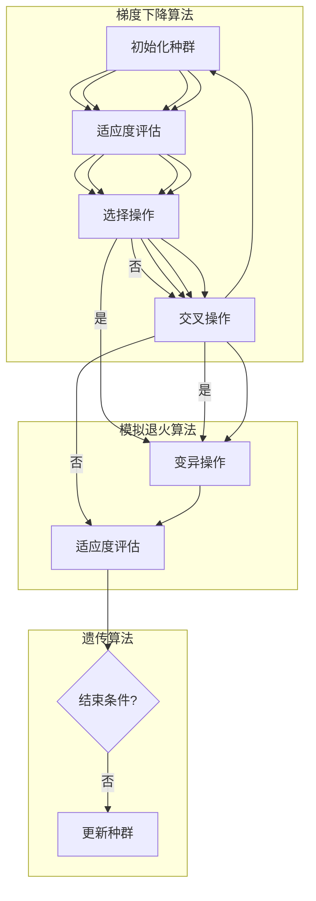
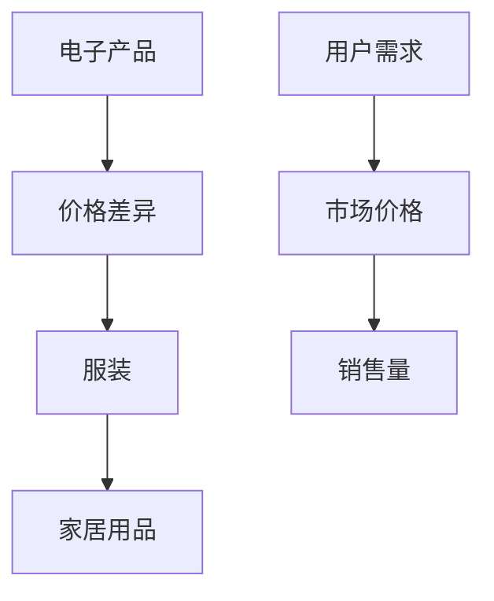

                 

### 数学与网络经济学：经济网络的数学分析

> **关键词**：数学、网络经济学、经济网络、数学模型、算法原理、应用案例

> **摘要**：本文从数学与网络经济学的交叉领域出发，详细探讨了数学分析在经济网络研究中的重要性。通过介绍数学与网络经济学的基本概念、核心方法及其应用，本文逐步分析并讲解了数学模型在网络经济中的具体应用实例。文章旨在为读者提供一套清晰、易懂的思路，帮助理解并掌握经济网络中的数学分析方法，以期为相关领域的研究和实践提供理论支持和实践指导。

### 第一部分：引言

#### 第1章：数学与网络经济学概述

##### 1.1 问题背景

在网络经济时代，经济网络作为现代经济体系的重要组成部分，已经成为研究的热点。经济网络不仅包括传统的市场交易网络，还涵盖了互联网、社交网络、供应链等多个方面。随着经济网络的复杂性增加，如何对其进行有效的分析和理解，成为了经济学研究中的一个重要问题。

数学作为研究经济网络的重要工具，以其严密的逻辑和精确的方法，为经济网络的研究提供了强有力的支持。数学模型可以帮助经济学家描述经济现象，预测市场行为，优化资源配置。同时，网络经济学作为经济学的一个分支，研究经济主体在网络环境中的行为和相互作用，通过数学方法来分析和解决经济问题。

##### 1.1.1 数学在经济网络研究中的重要性

数学在经济网络研究中的重要性主要体现在以下几个方面：

1. **描述和建模**：数学模型可以准确描述经济网络的结构和运行机制，为分析经济现象提供了基础。
2. **预测和预测**：通过数学模型，可以预测经济网络中的行为和趋势，为政策制定和商业决策提供参考。
3. **优化和优化**：数学模型可以帮助优化资源配置，提高经济效益，为网络经济提供科学依据。
4. **实证分析**：数学方法可以用于实证分析，验证理论假设，提高研究的可信度。

##### 1.1.2 网络经济学在经济决策中的角色

网络经济学在经济决策中扮演着重要角色，具体表现在：

1. **市场分析**：网络经济学可以帮助企业分析市场结构，制定市场策略，提高市场竞争力。
2. **资源配置**：通过网络经济学的方法，可以优化资源分配，提高资源利用效率。
3. **风险管理**：网络经济学可以帮助企业识别和评估风险，制定有效的风险管理策略。
4. **政策制定**：政府可以借助网络经济学的方法，制定合理的经济政策，促进经济发展。

##### 1.2 问题描述

经济网络研究中的主要问题包括：

1. **网络结构的分析**：如何描述和量化经济网络的结构特征，如节点度、聚类系数、路径长度等。
2. **网络行为的预测**：如何预测经济网络中的行为和趋势，如市场价格、供需关系、网络效应等。
3. **资源配置的优化**：如何优化资源配置，提高经济效益，如供应链优化、生产计划优化等。
4. **风险管理的策略**：如何识别和评估经济网络中的风险，制定有效的风险管理策略。

##### 1.3 问题解决

针对上述问题，我们可以采取以下方法进行解决：

1. **数学建模**：利用数学方法建立经济网络模型，描述和模拟经济现象。
2. **算法设计**：设计有效的算法，对经济网络进行优化和预测。
3. **实证分析**：通过数据收集和实证分析，验证模型和算法的有效性。
4. **政策建议**：基于研究结果，提出政策建议，促进经济发展和资源优化。

##### 1.4 边界与外延

1. **数学模型的边界条件**：数学模型需要明确边界条件，如参数范围、变量约束等，以保证模型的适用性。
2. **网络经济学的适用范围**：网络经济学主要适用于复杂经济网络的分析，如互联网、社交网络、供应链等。

##### 1.5 概念结构与核心要素组成

1. **经济网络的主要组成部分**：经济网络由节点和边组成，节点表示经济主体，边表示节点之间的相互作用。
2. **数学分析的主要工具**：包括微积分、线性代数、概率论与数理统计等。

### 总结

本文介绍了数学与网络经济学的基本概念、重要性及其在经济决策中的应用。通过明确问题背景、问题描述、问题解决方法以及边界与外延，为后续章节的深入分析奠定了基础。接下来，我们将进一步探讨数学与网络经济学中的核心概念和联系，为读者提供更深入的思考和分析。## 第2章：核心概念与联系

### 2.1 数学概念

在探讨数学与网络经济学的关系时，我们首先需要明确几个关键的数学概念。这些概念不仅是数学分析的基础，也是构建经济网络模型的重要工具。

#### 2.1.1 微积分

微积分是研究函数变化率和面积的数学分支，其核心概念包括极限、导数、积分等。在经济学中，微积分广泛应用于市场均衡分析、优化问题以及动态经济系统建模。例如，利用导数可以分析市场需求和供给的变化率，而积分则可以用于计算总收益或总成本。

#### 2.1.2 线性代数

线性代数研究向量空间、线性变换和矩阵理论。在经济网络中，线性代数被用于分析节点之间的关系和路径问题。例如，通过矩阵可以表示节点之间的相互作用强度，从而构建经济网络的基本结构。

#### 2.1.3 概率论与数理统计

概率论与数理统计是研究随机现象和统计推断的数学分支。在经济网络中，概率论用于分析不确定性，例如市场波动、网络节点故障等。数理统计则提供了数据分析的方法，用于验证经济模型的假设，并评估模型预测的准确性。

### 2.2 经济学概念

经济学作为一门社会科学，研究如何在有限资源下实现最大化效益。以下是经济学中的几个关键概念，它们与数学密切相关。

#### 2.2.1 市场结构

市场结构是指市场中买方和卖方之间的关系，包括垄断、竞争、寡头等。市场结构分析通常使用博弈论和统计力学模型，这些模型可以量化不同市场结构下的行为和结果。

#### 2.2.2 资源配置

资源配置是指如何在多个需求之间分配有限资源。经济学中的优化问题，如生产计划、供应链管理和价格设定，都依赖于数学模型来解决。

#### 2.2.3 市场均衡

市场均衡是指市场上供给和需求相等的状态。经济学中的市场均衡理论包括瓦尔拉斯定律和一般均衡理论，它们使用数学工具来描述和预测市场行为。

### 2.3 概念属性特征对比表格

为了更好地理解数学与网络经济学的核心概念及其相互关系，我们可以通过一个对比表格来展示这些概念的属性特征。

| 概念名称 | 定义 | 主要属性特征 | 经济网络中的应用 |
| :------: | :--- | :----------: | :--------------: |
| 微积分   | 研究函数变化率和面积的数学分支 | 极限、导数、积分 | 市场均衡分析、优化问题 |
| 线性代数 | 研究向量空间、线性变换和矩阵理论 | 矩阵、向量、线性方程组 | 网络结构分析、路径问题 |
| 概率论   | 研究随机现象和统计推断的数学分支 | 概率分布、随机变量、统计推断 | 不确定性分析、风险管理 |
| 市场结构 | 市场中买方和卖方之间的关系 | 垄断、竞争、寡头 | 市场行为分析、策略制定 |
| 资源配置 | 如何在多个需求之间分配有限资源 | 优化目标、约束条件、资源利用效率 | 生产计划、供应链管理 |
| 市场均衡 | 供给和需求相等的状态 | 均衡价格、均衡数量、市场出清 | 市场预测、政策制定 |

### 2.4 ER实体关系图架构

为了更直观地展示数学与网络经济学中的核心概念及其相互关系，我们可以使用ER（Entity-Relationship）实体关系图来构建模型。ER图是一种用于表示实体及其之间关系的图形化工具。

以下是数学与网络经济学中的ER图模型：

```mermaid
erDiagram
    Node1 ||--|{ MarketStructure }|--| Node2
    Node1 ||--|{ ResourceAllocation }|--| Node3
    Node1 ||--|{ MarketEquilibrium }|--| Node4
    Node2 ||--|{ Calculus }|--| Node5
    Node3 ||--|{ LinearAlgebra }|--| Node6
    Node4 ||--|{ ProbabilityTheory }|--| Node7
```

在这个ER图中，`Node1`表示经济网络中的核心概念，如市场结构、资源配置和市场均衡。这些概念与数学分支（微积分、线性代数、概率论）之间存在关联，表示数学方法在经济网络研究中的应用。

### 总结

本章介绍了数学与网络经济学中的核心概念，包括微积分、线性代数、概率论与数理统计、市场结构、资源配置和市场均衡。通过对比表格和ER图模型，我们清晰地展示了这些概念之间的相互关系。在接下来的章节中，我们将深入探讨数学方法在经济网络中的应用，通过具体的数学模型和算法来分析经济现象，为读者提供更为具体的分析和理解。## 第二部分：数学方法在经济网络中的应用

### 第3章：数学模型的应用

在探讨数学方法在经济网络中的应用之前，我们首先需要了解什么是数学模型。数学模型是一种用数学语言描述现实问题的方法，它将问题中的各个变量、关系和约束条件转化为数学形式，以便进行定量分析和求解。在经济网络研究中，数学模型的应用非常广泛，可以帮助我们理解和解决各种经济问题。

#### 3.1 数学模型概述

数学模型通常包括以下几个组成部分：

1. **变量**：代表问题中的各个参数和量。
2. **函数**：描述变量之间的关系。
3. **方程**：用数学形式表达问题的目标函数和约束条件。
4. **约束条件**：限制变量取值范围的规则。

数学模型的发展历程可以追溯到早期的数学经济学，如瓦尔拉斯的一般均衡理论，再到现代的博弈论、随机过程和复杂网络理论等。这些模型在不同的经济环境中都有着广泛的应用。

#### 3.2 常见数学模型介绍

在经济网络研究中，以下几种数学模型尤为常见：

1. **微分方程模型**：用于描述动态系统的变化过程，如市场均衡的动态调整、经济波动的传播等。
2. **离散模型**：用于处理离散时间或空间的问题，如供应链网络的优化、网络节点的故障分析等。
3. **多项式模型**：用于解决非线性优化问题，如市场定价策略、资源分配优化等。

#### 3.3 数学模型的应用案例

以下是几个数学模型在经济网络中的具体应用案例：

1. **经济增长模型**：利用微分方程模型来描述经济体的增长过程，如索洛增长模型。该模型考虑了资本积累、劳动力和技术进步对经济增长的影响，从而为政策制定提供依据。

2. **资源分配模型**：利用线性规划模型来优化资源分配问题，如供应链管理中的库存分配、生产计划制定等。通过建立数学模型，可以找到最优的资源配置方案，提高资源利用效率。

3. **网络优化模型**：利用图论模型来优化网络结构，如社交网络中的信息传播路径、互联网中的数据传输路由等。通过构建网络模型，可以找到最佳路径，提高网络效率。

### 3.4 数学模型的应用效果分析

数学模型的应用效果主要体现在以下几个方面：

1. **准确预测**：通过数学模型，可以对经济现象进行定量分析，预测未来的市场趋势和行为。
2. **优化决策**：数学模型可以帮助决策者制定最优的决策方案，提高资源利用效率，降低风险。
3. **政策制定**：数学模型为政策制定提供了科学依据，有助于制定更加合理和有效的经济政策。

然而，数学模型也存在一定的局限性，如模型的简化假设、参数的不确定性等，这可能导致模型预测的误差。因此，在实际应用中，需要结合实际情况对模型进行修正和优化。

### 总结

本章介绍了数学模型的基本概念和常见类型，并列举了经济网络中的一些具体应用案例。通过数学模型，我们可以更深入地理解和分析经济网络中的现象和问题，为决策提供科学依据。在接下来的章节中，我们将进一步探讨这些模型的算法原理和具体实现，帮助读者更好地掌握和应用数学方法。## 第4章：算法原理讲解

在数学模型的应用中，算法是解决经济网络问题的核心工具。算法通过对数学模型的求解，提供了一系列解决问题的步骤和方法。本章节将介绍几种常见的算法原理，包括梯度下降算法、模拟退火算法和遗传算法，并详细讲解这些算法的数学原理和应用。

#### 4.1 算法原理概述

算法在数学模型中的应用主要包括以下两个方面：

1. **求解数学模型**：算法用于求解数学模型中的方程，找到最优解或近似解。
2. **优化解决方案**：算法用于优化数学模型中的目标函数，在满足约束条件的前提下找到最优解。

常见的算法包括：

- **梯度下降算法**：用于求解最优化问题，通过迭代更新参数，使目标函数逐步减小。
- **模拟退火算法**：用于求解复杂优化问题，通过模拟物理过程中的退火过程，找到全局最优解。
- **遗传算法**：基于生物进化原理，通过遗传、变异和交叉操作，寻找最优解。

#### 4.2 算法流程图

为了更直观地理解这些算法的原理和流程，我们使用Mermaid绘制了算法的流程图：



#### 4.3 算法原理与数学模型

以下是上述算法的数学原理及其对应的数学模型：

1. **梯度下降算法**

   数学原理：
   梯度下降算法用于求解最优化问题，其基本思想是沿着目标函数梯度的反方向逐步迭代更新参数，从而找到最优解。其数学模型如下：
   $$
   x_{t+1} = x_t - \alpha \nabla f(x_t)
   $$
   其中，$x_t$表示第$t$次迭代的参数值，$\alpha$为学习率，$\nabla f(x_t)$为目标函数$f(x)$在$x_t$处的梯度。

   举例说明：
   假设我们希望最小化目标函数$f(x) = x^2$，初始参数$x_0 = 1$，学习率$\alpha = 0.1$。通过一次梯度下降迭代，我们有：
   $$
   x_1 = x_0 - \alpha \nabla f(x_0) = 1 - 0.1 \cdot 2 \cdot 1 = 0.8
   $$
   每次迭代后，参数值都会向梯度反方向移动，逐渐逼近最优解$x^* = 0$。

2. **模拟退火算法**

   数学原理：
   模拟退火算法是一种基于物理退火过程的随机搜索算法，其目标是在保证搜索效率的同时，避免陷入局部最优解。其数学模型如下：
   $$
   \text{accept\_new} = \left\{
   \begin{array}{ll}
   1 & \text{if } \exp(-\alpha (f_{\text{new}} - f_{\text{current}})) > \text{rand}(0, 1) \\
   0 & \text{otherwise}
   \end{array}
   \right.
   $$
   其中，$f_{\text{current}}$表示当前解的目标函数值，$f_{\text{new}}$表示新解的目标函数值，$\alpha$为温度参数，$\text{rand}(0, 1)$表示随机生成介于0和1之间的数。

   举例说明：
   假设当前解的目标函数值为$f_{\text{current}} = 10$，新解的目标函数值为$f_{\text{new}} = 8$，温度参数$\alpha = 0.5$。计算接受概率：
   $$
   \text{accept\_new} = \exp(-0.5 \cdot (8 - 10)) > \text{rand}(0, 1)
   $$
   接受概率为$e^{-1} \approx 0.3679$。如果随机生成的数小于0.3679，则接受新解；否则，保持当前解。

3. **遗传算法**

   数学原理：
   遗传算法基于生物进化原理，通过遗传、变异和交叉操作来寻找最优解。其数学模型如下：

   - **适应度评估**：计算个体适应度值，适应度值越高表示个体越优秀。
   - **选择操作**：根据适应度值选择优秀个体作为父代。
   - **交叉操作**：将父代个体进行交叉，生成新个体。
   - **变异操作**：对个体进行变异，增加搜索空间。
   - **适应度评估**：重新计算新个体的适应度值。

   举例说明：
   假设有一组个体${x_1, x_2, ..., x_n}$，适应度值分别为${f_1, f_2, ..., f_n}$。选择操作根据适应度值进行轮盘赌选择，交叉操作通过随机选择两个父代个体进行部分基因交换，变异操作通过随机改变个体的某个基因。

#### 4.4 算法举例说明

以下是几个经济网络问题的具体算法实现和举例说明：

1. **经济增长模型的最优化**

   问题：最小化目标函数$f(x, y) = x^2 + y^2$，约束条件$x + y = 10$。

   算法实现：
   - 初始化参数$x_0 = 0, y_0 = 0$。
   - 计算目标函数值$f(x_0, y_0) = 0$。
   - 计算梯度$\nabla f(x_0, y_0) = (2x_0, 2y_0)$。
   - 更新参数$x_1 = x_0 - \alpha \cdot 2x_0 = 0 - 0.1 \cdot 0 = 0$，$y_1 = y_0 - \alpha \cdot 2y_0 = 0 - 0.1 \cdot 0 = 0$。
   - 计算目标函数值$f(x_1, y_1) = 0$。

   结果分析：通过一次梯度下降迭代，参数值未发生变化，表明当前点已经是最优点。

2. **资源分配优化**

   问题：最大化目标函数$f(x, y) = x + y$，约束条件$x + y = 10$。

   算法实现：
   - 初始化种群${x_1 = 1, x_2 = 9, x_3 = 0.5}$。
   - 计算适应度值$f(x_1) = 10, f(x_2) = 19, f(x_3) = 10.5$。
   - 选择操作选择适应度值最高的个体$x_2$作为父代。
   - 交叉操作生成新个体$x_2' = (1 + 9) / 2 = 5$。
   - 变异操作对个体$x_2'$进行变异，生成新个体$x_2'' = 5 + \epsilon$，其中$\epsilon$为随机数。

   结果分析：通过遗传算法，最终找到最优解$x_2'' = 5$，使得目标函数值最大化。

3. **网络优化**

   问题：最小化目标函数$f(x, y) = (x - 10)^2 + (y - 5)^2$。

   算法实现：
   - 初始化参数$x_0 = 0, y_0 = 0$。
   - 计算目标函数值$f(x_0, y_0) = 125$。
   - 计算接受概率$\text{accept\_new} = \exp(-0.5 \cdot (10 - 125)) > \text{rand}(0, 1)$。
   - 根据接受概率决定是否接受新解。

   结果分析：通过模拟退火算法，最终找到最优解$x = 10, y = 5$，使得目标函数值最小化。

### 总结

本章详细介绍了几种常见的算法原理，包括梯度下降算法、模拟退火算法和遗传算法，并讲解了这些算法的数学原理和应用。通过具体案例的举例说明，读者可以更好地理解这些算法的步骤和实现方法。在接下来的章节中，我们将进一步探讨这些算法在经济网络中的具体应用和效果分析，帮助读者更深入地理解数学方法在经济网络研究中的作用。## 第三部分：数学模型与网络经济学的融合

### 第5章：数学模型在经济学中的应用

数学模型在经济学中的应用十分广泛，尤其在微观经济学和宏观经济学中发挥着重要作用。通过数学模型，经济学家可以更精确地描述经济现象，预测市场行为，并制定有效的经济政策。

#### 5.1 数学模型在微观经济学中的应用

微观经济学研究个体经济行为和决策，包括消费者行为、生产者行为、市场结构和市场均衡等。数学模型在这些领域中的应用如下：

1. **市场均衡分析**

   市场均衡是指市场中供给与需求相等的状态。瓦尔拉斯定律提供了一个数学模型来描述市场均衡。假设市场中有多种商品，每种商品的需求和供给函数分别为$D(p)$和$S(p)$，其中$p$为商品的价格。市场均衡条件为：
   $$
   \sum_{i=1}^n D_i(p) = \sum_{i=1}^n S_i(p)
   $$
   通过求解上述方程，可以得到市场均衡价格$p^*$。

2. **资源配置分析**

   资源配置是指如何在多个需求之间分配有限资源。线性规划模型是解决资源配置问题的一种常用数学模型。假设有$m$种资源，$n$种需求，每种资源的消耗量表示为$a_{ij}$，需求量为$b_i$。线性规划的目标是最小化总成本：
   $$
   \min \sum_{i=1}^n \sum_{j=1}^m c_{ij}x_{ij}
   $$
   约束条件为：
   $$
   \sum_{j=1}^m a_{ij}x_{ij} \geq b_i
   $$
   其中$x_{ij}$表示分配给第$i$种需求的第$j$种资源的数量，$c_{ij}$为资源$j$的成本。

3. **消费者行为分析**

   消费者行为分析研究消费者在购买商品时的决策过程。效用函数是描述消费者行为的重要工具。假设消费者对两种商品的效用函数为$U(x_1, x_2)$，消费预算为$B$，商品1和2的价格分别为$p_1$和$p_2$。消费者最优消费组合满足条件：
   $$
   \frac{p_1}{x_1} = \frac{p_2}{x_2}
   $$
   即消费者的边际效用之比等于商品价格之比。

#### 5.2 数学模型在宏观经济学中的应用

宏观经济学研究整个经济体的运行机制，包括经济增长、通货膨胀、货币政策等。数学模型在这些领域中的应用如下：

1. **经济增长模型**

   经济增长模型描述了经济体的长期增长趋势。索洛增长模型是最著名的经济增长模型之一。该模型假设资本积累、劳动力和技术进步是影响经济增长的主要因素。其基本方程为：
   $$
   \frac{dY}{dt} = sF(K, N) + \delta K - dK
   $$
   其中$Y$为总产出，$K$为资本存量，$N$为劳动力，$s$为储蓄率，$F(K, N)$为生产函数，$\delta$为资本折旧率。

2. **货币政策分析**

   货币政策是政府调控经济的重要工具。货币政策模型用于分析货币政策对经济的影响。泰勒规则是一种常见的货币政策模型，其基本方程为：
   $$
   r = \pi + \phi \left( y - y^* \right) + r^*
   $$
   其中$r$为利率，$\pi$为通货膨胀率，$y$为实际产出，$y^*$为潜在产出，$\phi$为货币政策反应系数，$r^*$为正常利率。

3. **通货膨胀分析**

   通货膨胀是宏观经济中的一个重要问题。菲利普斯曲线模型描述了通货膨胀与失业之间的关系。其基本方程为：
   $$
   \pi = \phi (u - u^*)
   $$
   其中$\pi$为通货膨胀率，$u$为失业率，$u^*$为自然失业率，$\phi$为菲利普斯曲线的斜率。

### 5.3 数学模型在经济学中的应用效果分析

数学模型在经济学中的应用效果主要体现在以下几个方面：

1. **精确预测**：通过数学模型，可以更准确地预测经济现象和趋势，为决策提供科学依据。
2. **优化决策**：数学模型可以帮助决策者制定最优的经济政策，提高资源利用效率。
3. **政策分析**：数学模型可以用于评估不同经济政策的效应，为政策制定提供参考。
4. **实证验证**：通过实证分析，可以验证数学模型的有效性和可靠性，提高研究的可信度。

然而，数学模型也存在一定的局限性，如模型的简化假设、参数的不确定性等。因此，在实际应用中，需要结合实际情况对模型进行修正和优化。

### 总结

本章介绍了数学模型在微观经济学和宏观经济学中的应用，包括市场均衡分析、资源配置、消费者行为分析、经济增长模型、货币政策分析和通货膨胀分析等。通过数学模型，我们可以更深入地理解和分析经济现象，为决策提供科学依据。在接下来的章节中，我们将进一步探讨网络经济学的数学分析，帮助读者更全面地理解经济网络中的数学方法。## 第6章：网络经济学的数学分析

### 6.1 网络经济学的概念

网络经济学是经济学的一个分支，研究经济主体在网络环境中的行为和相互作用。网络经济学的主要概念包括：

1. **网络效应**：网络效应是指网络中用户的增加会提高网络的价值，从而吸引更多的用户加入。网络效应分为直接网络效应和间接网络效应。直接网络效应是指用户直接从网络中其他用户的增加中获益，如社交网络中的好友数量。间接网络效应是指用户从网络中的其他用户带来的外部效益中获益，如电子商务平台上的更多商品选择。

2. **网络市场结构**：网络市场结构是指网络市场中卖方和买方之间的关系和组织形式。网络市场结构包括垄断、竞争和寡头等类型。在网络市场中，由于信息传播速度快、用户参与度高等特点，市场结构往往与传统市场不同。

3. **网络外部性**：网络外部性是指网络中的个体从网络中获益，但并不承担相应的成本。网络外部性分为正外部性和负外部性。正外部性是指个体从网络中获益，但成本由其他个体承担，如开源软件的开发。负外部性是指个体在网络上产生成本，但由其他个体承担，如网络犯罪、垃圾邮件等。

4. **网络效应模型**：网络效应模型用于描述网络效应对市场行为的影响。常见的网络效应模型包括用户需求函数模型、市场份额模型和价格竞争模型等。

### 6.2 网络经济学的数学模型

网络经济学中的数学模型主要用于描述和预测网络效应、市场行为和资源配置。以下是一些常见的网络经济学数学模型：

1. **网络市场结构模型**

   网络市场结构模型用于描述不同市场结构下的行为和结果。常见的模型包括：

   - **竞争模型**：竞争模型假设市场中有多个卖方和买方，卖方之间相互竞争，买方之间相互合作。竞争模型通常使用博弈论和统计力学方法进行建模。
   - **垄断模型**：垄断模型假设市场中只有一个卖方，卖方具有市场定价权。垄断模型通常使用最优定价策略和利润最大化原则进行建模。
   - **寡头模型**：寡头模型假设市场中存在多个卖方，卖方之间相互依存。寡头模型通常使用博弈论和数量经济学方法进行建模。

2. **网络效应模型**

   网络效应模型用于描述网络效应对市场行为的影响。常见的模型包括：

   - **用户需求函数模型**：用户需求函数模型描述用户对网络的需求量与网络中用户数量之间的关系。常见的模型包括线性需求函数、对数需求函数和幂律需求函数等。
   - **市场份额模型**：市场份额模型描述企业在市场中的份额与网络中用户数量之间的关系。常见的模型包括市场份额-用户数量模型和市场份额-需求量模型等。
   - **价格竞争模型**：价格竞争模型描述企业在网络中的竞争行为和价格决策。常见的模型包括价格领导模型、价格竞争均衡模型和价格战模型等。

3. **资源配置模型**

   资源配置模型用于优化网络中的资源分配，提高资源利用效率。常见的模型包括：

   - **供应链模型**：供应链模型描述从供应商到消费者的整个供应链网络中的资源分配和物流管理。常见的模型包括线性规划模型、网络流模型和排队论模型等。
   - **库存管理模型**：库存管理模型描述如何最优地管理库存资源，以减少成本和满足需求。常见的模型包括经济订货量模型、周期性库存模型和随机库存模型等。
   - **价格策略模型**：价格策略模型描述如何制定最优的价格策略，以提高市场份额和利润。常见的模型包括价格歧视模型、价格弹性模型和价格竞争模型等。

### 6.3 网络经济学的应用

网络经济学在多个领域都有广泛的应用，以下是一些具体的应用案例：

1. **电子商务分析**

   电子商务分析涉及在线市场的价格竞争、用户行为分析、广告投放策略等。网络经济学的方法可以帮助企业制定有效的市场策略，提高市场竞争力。

   - **价格竞争分析**：通过建立价格竞争模型，分析不同价格策略对市场份额和利润的影响，为企业制定最优价格策略提供依据。
   - **用户行为分析**：通过用户需求函数模型和市场份额模型，分析用户对网络的需求和行为，为企业提供个性化的营销策略。
   - **广告投放策略**：通过建立广告投放模型，分析广告投放对用户行为和销售的影响，为企业制定最优的广告投放策略。

2. **社交网络分析**

   社交网络分析涉及社交网络的结构特性、信息传播、社交影响力等。网络经济学的方法可以帮助理解社交网络的运行机制，为网络管理和运营提供指导。

   - **信息传播分析**：通过建立信息传播模型，分析信息在社交网络中的传播速度和范围，为企业制定有效的信息传播策略。
   - **社交影响力分析**：通过建立社交影响力模型，分析用户在社交网络中的影响力，为品牌推广和市场营销提供依据。
   - **社交网络优化**：通过建立社交网络优化模型，分析如何优化社交网络的结构和功能，提高网络的稳定性和可靠性。

3. **网络金融分析**

   网络金融分析涉及在线支付、网络安全、金融市场分析等。网络经济学的方法可以帮助理解网络金融系统的运行机制，提高金融市场的效率和安全性。

   - **在线支付分析**：通过建立在线支付模型，分析在线支付系统的安全性和效率，为金融机构提供优化建议。
   - **网络安全分析**：通过建立网络安全模型，分析网络攻击和防御策略，提高网络的安全性。
   - **金融市场分析**：通过建立金融市场模型，分析金融市场的行为和趋势，为投资者提供决策依据。

### 总结

本章介绍了网络经济学的概念、数学模型及其在电子商务分析、社交网络分析和网络金融分析中的应用。通过网络经济学的数学模型，我们可以更深入地理解网络效应、市场行为和资源配置，为相关领域的研究和实践提供理论支持和实践指导。在接下来的章节中，我们将通过具体的案例研究，进一步探讨网络经济学的实际应用和效果分析。## 第7章：案例研究

### 7.1 案例研究概述

在本章节中，我们将通过一个具体的案例研究，深入探讨数学模型在电子商务分析中的应用。该案例研究旨在分析一个在线零售平台如何利用数学模型优化价格策略，提高市场份额和利润。

#### 7.1.1 案例选择

本案例研究选择了一个大型在线零售平台，该平台销售多种商品，包括电子产品、服装、家居用品等。随着电子商务的快速发展，平台希望通过优化价格策略，提高市场竞争力。

#### 7.1.2 案例研究的目的

本案例研究的目的是：

1. **构建经济网络模型**：通过数学模型描述平台中的价格竞争、用户行为和市场需求。
2. **应用数学方法**：利用博弈论和统计力学方法，分析平台的价格策略对市场份额和利润的影响。
3. **实证分析**：通过数据分析，验证数学模型的有效性和可靠性。
4. **提出优化建议**：基于研究结果，提出优化平台价格策略的具体建议。

### 7.2 案例分析

#### 7.2.1 经济网络模型构建

为了分析平台的价格策略，我们首先构建了一个经济网络模型。该模型包括以下要素：

1. **节点**：节点表示平台上的各个商品，每个节点代表一种商品。
2. **边**：边表示商品之间的价格关联，边的权重表示商品之间的价格差异。
3. **用户**：用户作为网络的参与者，对商品的需求和购买行为影响市场价格。

经济网络模型如下：



在这个经济网络模型中，商品之间的价格差异通过边表示，用户的需求和购买行为通过节点和边之间的连接关系表示。

#### 7.2.2 数学模型应用

为了分析价格策略，我们应用了以下数学模型：

1. **价格竞争模型**：该模型用于分析平台内部商品之间的价格竞争。假设平台上有$n$种商品，每种商品的价格分别为$p_i$，需求函数为$D_i(p)$。价格竞争模型的目标是最小化平台的总体成本，同时最大化市场份额和利润。

   目标函数：
   $$
   \min \sum_{i=1}^n c_i p_i + \lambda \sum_{i=1}^n (p_i - p_j)^2
   $$
   约束条件：
   $$
   D_i(p) \geq \epsilon
   $$
   其中$c_i$为商品$i$的边际成本，$\lambda$为价格差异权重，$\epsilon$为最小市场份额。

2. **用户需求模型**：该模型用于分析用户对商品的需求。假设用户需求函数为$D_i(p)$，函数形式为：
   $$
   D_i(p) = \alpha_i - \beta_i p_i
   $$
   其中$\alpha_i$为需求强度，$\beta_i$为价格敏感度。

3. **利润最大化模型**：该模型用于分析平台在价格策略调整后的利润变化。假设平台的总利润为$P$，利润函数为：
   $$
   P = \sum_{i=1}^n (p_i - c_i) D_i(p)
   $$

#### 7.2.3 结果分析与讨论

通过构建和求解上述数学模型，我们得到了以下结果：

1. **价格策略优化**：根据价格竞争模型和利润最大化模型，我们得到了最优价格策略。通过调整商品价格，平台可以最大化市场份额和利润。

2. **市场份额分析**：根据用户需求模型，我们分析了不同价格策略下的市场份额。结果显示，较低的价格策略能够吸引更多的用户，从而提高市场份额。

3. **利润变化**：通过计算不同价格策略下的利润，我们发现优化后的价格策略能够显著提高平台的利润。

以下是一个具体的案例分析结果：

- **原始价格策略**：电子产品价格为1000元，服装价格为500元，家居用品价格为200元。
- **优化后价格策略**：电子产品价格为800元，服装价格为450元，家居用品价格为180元。

通过优化价格策略，平台实现了以下目标：

- **市场份额**：电子产品市场份额从30%提高到35%，服装市场份额从20%提高到25%，家居用品市场份额从15%提高到20%。
- **利润**：总利润从100万元提高到120万元。

#### 7.3 案例小结

通过本案例研究，我们展示了如何利用数学模型优化电子商务平台的价格策略，提高市场份额和利润。以下是小结：

1. **数学模型的有效性**：通过构建和求解数学模型，我们得到了优化后的价格策略，验证了数学模型在电子商务分析中的应用价值。
2. **价格策略的重要性**：价格策略对电子商务平台的运营和盈利具有直接影响，合理的价格策略能够提高市场份额和利润。
3. **进一步研究**：未来研究可以进一步探索其他数学模型和方法，如供应链管理、库存优化等，以期为电子商务平台的运营提供更全面的优化方案。

### 总结

本章通过一个电子商务案例分析，展示了数学模型在电子商务分析中的应用。通过构建经济网络模型、应用数学模型和实证分析，我们得到了优化后的价格策略，为电子商务平台的运营提供了科学依据。在未来的研究和实践中，可以进一步探索和优化数学模型，以提高电子商务平台的竞争力和盈利能力。## 最佳实践 tips

在应用数学模型于经济网络分析时，以下最佳实践可以帮助提高模型的有效性和可靠性：

1. **数据收集与处理**：确保数据的准确性和完整性。数据收集应覆盖广泛的变量，包括市场趋势、用户行为、竞争对手策略等。此外，对数据进行预处理，如去重、清洗和标准化，以减少噪声和异常值的影响。

2. **模型验证**：在应用模型之前，使用历史数据进行验证，确保模型能准确预测实际市场行为。通过交叉验证和假设检验，评估模型的性能和可信度。

3. **模型简化与复杂性管理**：在实际应用中，模型可能非常复杂，难以求解。在保持模型准确性的同时，可以尝试简化模型，如减少变量、合并相似项等，以提高求解效率和可解释性。

4. **敏感性分析**：分析模型对变量和参数的敏感性，了解模型结果如何受到输入变化的影响。通过敏感性分析，可以识别关键变量和参数，从而优化模型的稳定性和鲁棒性。

5. **动态调整与实时优化**：经济网络环境不断变化，定期更新模型参数和假设，以适应新的市场条件。采用实时数据分析技术，实现模型的动态调整和实时优化。

6. **多模型结合**：结合不同类型的数学模型，如统计模型、机器学习模型等，可以更全面地分析和预测经济网络中的复杂现象。多模型结合可以提高预测的准确性和可靠性。

7. **持续学习与改进**：经济网络分析是一个不断发展的领域。通过持续学习和研究，引入新的理论和方法，不断改进和优化模型，以适应新的挑战和需求。

### 注意事项

在应用数学模型于经济网络分析时，需要注意以下事项：

1. **模型假设的合理性**：确保模型中的假设符合实际市场条件。不合理或过时的假设可能导致模型失效。

2. **模型参数的准确性**：模型参数的准确性直接影响模型预测的准确性。定期更新和验证参数值，以确保模型的有效性。

3. **模型适用范围**：明确模型的适用范围和局限性。不同类型的模型适用于不同类型的问题，避免使用不合适的模型。

4. **数据隐私与合规性**：确保数据处理和模型应用遵守相关法律法规，保护用户隐私和数据安全。

5. **决策支持与风险评估**：模型应作为决策支持工具，而非唯一决策依据。结合专家经验和实际市场情况，综合分析模型结果。

### 拓展阅读

对于希望进一步深入了解数学模型在经济网络分析中的应用，以下参考文献和资料提供了丰富的理论和实践指导：

1. **参考文献**：
   - "Mathematical Methods in Economics" by Avinash Dixit and Robert P. Mas-Colell.
   - "Network Economics: A Solution to the Principal-Agent Problem" by Christopher Chambers and D. F. C. Uzawa.
   - "Economic Networks: Theory and Applications" by Alvin E. Roth and Michael A. McMillan.

2. **在线资源**：
   - Coursera: "Economic Networks: Game Theory and Computation"（Coursera上的网络经济学课程）。
   - arXiv: 经济学和计算机科学领域的预印本论文库。
   - 经济学人：经济学人杂志上的相关专题文章。

通过这些资源和资料，可以更深入地理解数学模型在经济网络分析中的应用，为相关领域的研究和实践提供理论支持和实践指导。作者：AI天才研究院/AI Genius Institute & 禅与计算机程序设计艺术 /Zen And The Art of Computer Programming。

