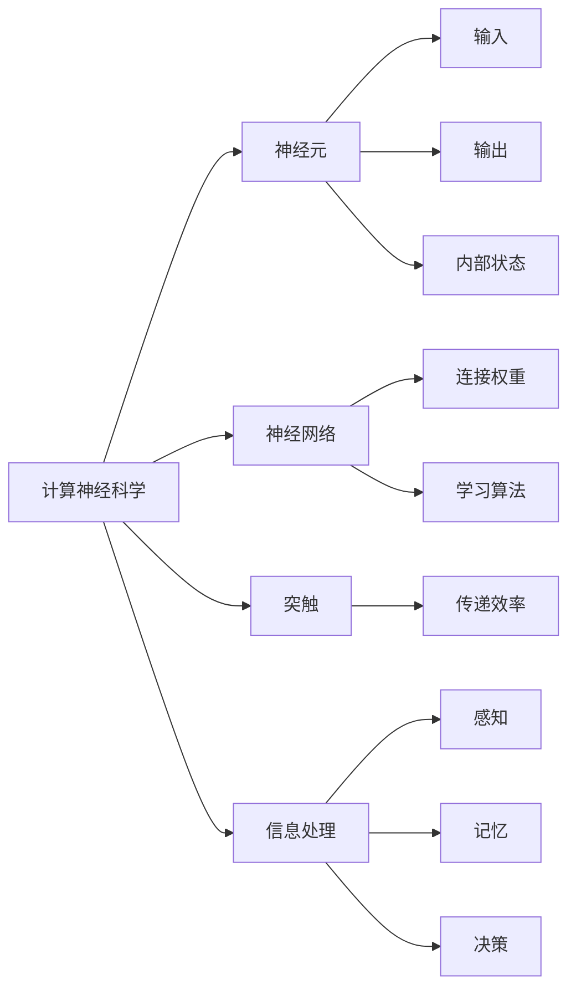
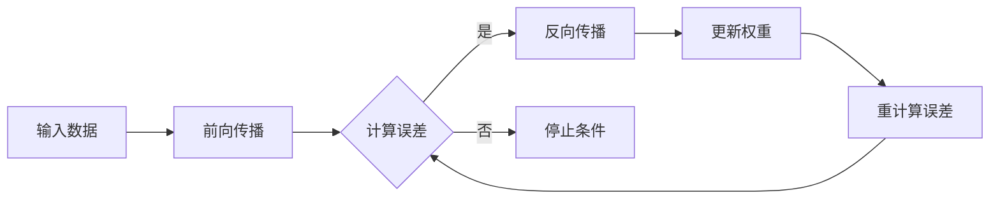
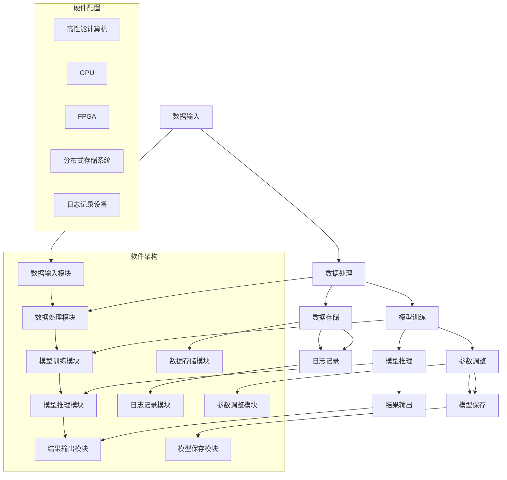

                 

## 数学与脑科学的计算神经科学研究

关键词：计算神经科学、数学模型、神经网络、脑电信号、深度学习、算法

摘要：
本文旨在深入探讨数学与脑科学结合的计算神经科学研究。通过逐步分析，本文将阐述计算神经科学的兴起、核心概念及其与数学的紧密联系。我们将详细讲解神经网络的算法原理、数学模型以及其在脑电信号分析等领域的应用。此外，本文还将介绍系统的设计与实现、实战项目以及未来展望，为读者提供全面的技术视角和实用指导。

### 脑科学与计算神经科学的兴起

脑科学，作为研究人类大脑结构、功能、行为以及疾病的一门学科，有着悠久的历史。从古希腊哲学家到现代科学家，人们一直在努力揭开大脑的奥秘。然而，随着计算机科学和信息技术的发展，脑科学的研究方法和技术手段得到了极大的提升。这一背景下，计算神经科学应运而生，成为现代脑科学的重要组成部分。

计算神经科学（Computational Neuroscience）是一门跨学科领域，它结合了神经科学、计算机科学、数学和物理学，通过数学建模和计算机模拟来研究大脑的神经元和神经网络如何处理信息。计算神经科学的研究目标不仅在于理解大脑的基本原理，还包括开发人工智能和机器学习算法，模拟大脑功能，甚至治愈神经系统疾病。

#### 计算神经科学的发展历程

计算神经科学的发展可以追溯到20世纪50年代，当时科学家们开始尝试使用数学模型来描述神经元的电生理特性。1950年代，哈佛大学的科学家约翰·冯·诺依曼（John von Neumann）提出了第一个神经网络的数学模型，即“感知机”（Perceptron）。这一模型开启了计算神经科学的研究之路。

进入20世纪80年代，随着计算机性能的显著提升，科学家们能够模拟更大的神经网络，这进一步推动了计算神经科学的发展。此时，神经网络开始广泛应用于图像识别、语音识别等领域。

近年来，随着深度学习的兴起，计算神经科学迎来了新的发展机遇。深度学习算法在处理大规模数据、自动特征提取和复杂模式识别方面展现了强大的能力，这为计算神经科学研究提供了新的方法和工具。

#### 计算神经科学的研究意义和应用前景

计算神经科学在多个领域都有着广泛的应用前景。首先，在医学领域，计算神经科学可以用于理解和治疗神经系统疾病，如阿尔茨海默症、癫痫等。通过构建神经元和神经网络的模型，科学家可以预测疾病的发展趋势，设计更有效的治疗策略。

其次，在人工智能领域，计算神经科学为机器学习和深度学习提供了理论基础和算法支持。深度学习算法中的神经网络模型很大程度上受到生物神经系统的启发，这使得计算神经科学在人工智能领域具有重要地位。

此外，计算神经科学在认知科学、心理学和计算机视觉等领域也有着重要的应用。例如，通过研究大脑如何处理视觉信息，科学家可以开发出更先进的人脸识别和图像处理技术。

### 数学在脑科学中的应用

数学作为一门严谨的学科，在脑科学的研究中发挥着至关重要的作用。数学模型和数学方法为脑科学提供了强大的工具，使我们能够更准确地描述和理解大脑的复杂行为。以下将介绍数学在脑科学中的一些重要应用。

#### 数学模型在脑电信号分析中的应用

脑电信号（EEG）是一种记录大脑电活动的技术。通过对脑电信号的数学分析，科学家可以揭示大脑的功能连接和动态特性。常见的数学模型包括时域分析和频域分析。

时域分析主要通过计算信号的时序特征，如振幅、频率和相位等，来分析脑电信号的时间动态。频域分析则将信号转换到频域，通过分析不同频率成分的强度和相位来研究脑电信号的频率特性。

此外，数学模型还可以用于脑电信号的滤波、去噪和特征提取。例如，带通滤波器可以去除干扰信号，保留有用的脑电信号成分。主成分分析（PCA）和独立成分分析（ICA）等降维方法则可以提取脑电信号中的主要特征。

#### 数学方法在脑功能连接研究中的应用

脑功能连接（Brain Connectivity）是指大脑不同区域之间的信息传递和协同活动。数学方法为研究脑功能连接提供了重要的工具。

例如，图论是一种用于研究复杂网络的数学工具，可以用于描述大脑的功能连接网络。通过构建脑功能连接图，科学家可以分析大脑网络的拓扑结构、节点和边的关系，以及网络的小世界性质和无标度特性。

此外，随机过程和统计力学等方法也广泛应用于脑功能连接的研究。这些方法可以帮助我们理解大脑网络的动态行为、稳定性和鲁棒性。

#### 数学方法在认知功能研究中的应用

数学方法在认知功能的研究中也发挥着重要作用。例如，认知神经科学通过研究大脑不同区域的活动如何影响认知功能，可以揭示认知过程的神经基础。

数学模型可以用于模拟认知过程，如记忆、注意力和决策。这些模型通常基于神经网络的动力学原理，结合神经生理学和心理学的研究成果，为认知科学提供了重要的理论支持。

此外，数学方法还可以用于分析认知实验的数据，如反应时间、准确性等指标。通过统计分析，科学家可以评估不同认知任务对大脑的影响，并揭示认知功能的神经机制。

### 数学与脑科学的核心概念

要深入理解数学在脑科学中的应用，我们需要先掌握一些核心概念。以下将介绍计算神经科学和数学在脑科学中的核心概念，并通过ER实体关系图和概念属性特征对比表格来展示它们之间的联系。

#### 计算神经科学的核心概念

1. **神经元**：神经元是大脑的基本功能单元，负责接收和传递电信号。神经元具有输入、输出和内部状态等属性。
2. **神经网络**：神经网络是由大量神经元组成的复杂网络，用于模拟大脑的信息处理能力。神经网络可以通过学习算法调整其连接权重，以实现特定的功能。
3. **突触**：突触是神经元之间传递信号的连接点。突触具有可塑性，即通过学习过程可以改变其传递效率。
4. **信息处理**：信息处理是指神经网络如何通过计算和传递电信号来处理信息。信息处理过程包括感知、记忆、决策等。

#### 数学在脑科学的核心概念

1. **数学模型**：数学模型是用来描述和模拟实际问题的数学表达式和结构。在脑科学中，数学模型可以描述神经元的电生理特性、神经网络的结构和功能等。
2. **算法**：算法是一系列解决问题的步骤和方法。在脑科学中，算法可以用于神经网络的训练、信号处理和数据分析等。
3. **统计方法**：统计方法是用于分析数据、估计参数和检验假设的数学工具。在脑科学中，统计方法可以用于分析脑电信号、评估认知功能等。

#### ER实体关系图和概念属性特征对比表格

以下是一个简单的ER实体关系图和概念属性特征对比表格，用于展示计算神经科学和数学在脑科学中的核心概念及其联系。

#### ER实体关系图



#### 概念属性特征对比表格

| 概念                 | 属性特征                     |
|----------------------|------------------------------|
| 神经元               | 输入、输出、内部状态          |
| 神经网络             | 连接权重、学习算法            |
| 突触                 | 传递效率                     |
| 信息处理             | 感知、记忆、决策              |
| 数学模型             | 描述和模拟实际问题的数学表达式 |
| 算法                 | 解决问题的步骤和方法          |
| 统计方法             | 分析数据、估计参数、检验假设  |

通过ER实体关系图和概念属性特征对比表格，我们可以更清晰地理解计算神经科学和数学在脑科学中的核心概念及其相互关系。这些概念为脑科学的研究提供了理论基础和工具支持，使我们能够更深入地探索大脑的奥秘。

### 神经网络的算法原理

神经网络是计算神经科学的核心工具，广泛应用于图像识别、语音识别、自然语言处理等领域。本节将详细讲解神经网络的基本原理，包括其结构、学习算法和优化方法。

#### 神经网络的结构

神经网络（Neural Network）由大量简单的人工神经元组成，这些神经元通过加权连接形成一个复杂的网络结构。每个神经元接收多个输入信号，通过加权求和处理后，产生一个输出信号。神经网络的基本结构包括输入层、隐藏层和输出层。

1. **输入层**：输入层接收外部输入信号，每个输入信号可以是一个特征或一个数据点。
2. **隐藏层**：隐藏层对输入信号进行处理，通过多层隐藏层可以提取更高级别的特征。
3. **输出层**：输出层产生最终的输出结果，可以是一个数值、一个类别或一个概率分布。

#### 学习算法

神经网络的学习过程是通过调整网络中的连接权重来实现的。学习算法的目标是找到一组最优的权重，使网络在特定任务上表现最好。常见的神经网络学习算法包括以下几种：

1. **前向传播**：在前向传播过程中，输入信号从输入层传递到隐藏层，再传递到输出层。每个神经元都会根据其输入信号和连接权重计算输出。
2. **反向传播**：在反向传播过程中，网络会根据输出层的结果，反向计算隐藏层和输入层的误差。通过误差信息，网络可以调整每个神经元的连接权重，以减小整体误差。
3. **梯度下降**：梯度下降是一种优化算法，用于寻找最小误差的连接权重。在反向传播过程中，网络会计算误差关于权重的梯度，并沿着梯度方向更新权重，以减小误差。

#### 优化方法

神经网络的学习过程是一个复杂的优化问题，需要高效的优化方法来提高训练效率和收敛速度。以下是一些常用的优化方法：

1. **随机梯度下降（SGD）**：随机梯度下降是梯度下降的一种变体，它每次迭代只随机选取一部分样本进行计算，从而加快收敛速度。
2. **动量（Momentum）**：动量方法在每次权重更新时，引入一个动量项，以加速梯度下降过程。
3. **自适应优化器**：如Adam、RMSprop等自适应优化器，可以根据历史梯度信息自动调整学习率，提高训练效率。

#### 算法原理的Mermaid流程图

以下是神经网络学习算法的Mermaid流程图：



通过这个流程图，我们可以清晰地看到神经网络的学习过程：从输入数据开始，通过前向传播计算输出，然后通过反向传播计算误差，并更新连接权重。这一过程不断重复，直到满足停止条件（如误差低于阈值或达到最大迭代次数）。

#### 算法原理的Python源代码

以下是一个简单的神经网络学习算法的Python源代码示例：

```python
import numpy as np

# 初始化权重和偏置
weights = np.random.rand(input_size, hidden_size)
biases = np.random.rand(hidden_size)

# 前向传播
def forward_propagation(x):
    hidden_layer_input = np.dot(x, weights) + biases
    hidden_layer_output = sigmoid(hidden_layer_input)
    return hidden_layer_output

# 反向传播
def backward_propagation(x, y, hidden_layer_output):
    error = y - hidden_layer_output
    d_hidden_layer_output = error * sigmoid_derivative(hidden_layer_output)
    d_weights = np.dot(x.T, d_hidden_layer_output)
    d_biases = np.sum(d_hidden_layer_output, axis=0)
    return d_weights, d_biases

# 更新权重
def update_weights(weights, biases, d_weights, d_biases, learning_rate):
    weights -= learning_rate * d_weights
    biases -= learning_rate * d_biases
    return weights, biases

# 激活函数和其导数
def sigmoid(x):
    return 1 / (1 + np.exp(-x))

def sigmoid_derivative(x):
    return x * (1 - x)

# 训练神经网络
def train(x, y, epochs, learning_rate):
    for epoch in range(epochs):
        hidden_layer_output = forward_propagation(x)
        d_weights, d_biases = backward_propagation(y, hidden_layer_output)
        weights, biases = update_weights(weights, biases, d_weights, d_biases, learning_rate)
        if epoch % 100 == 0:
            print(f"Epoch {epoch}, Error: {mean_squared_error(y, hidden_layer_output)}")
```

在这个示例中，我们定义了前向传播、反向传播和更新权重的函数。通过这些函数，我们可以训练一个简单的神经网络，实现对数据的分类。

### 数学模型在计算神经科学中的应用

在计算神经科学中，数学模型扮演着至关重要的角色。这些模型不仅帮助我们理解和模拟神经元的电生理特性，还能用于设计更复杂的神经网络结构和优化学习算法。以下将详细探讨数学模型在计算神经科学中的应用。

#### 神经元动力学方程

神经元的电生理特性可以通过一组微分方程来描述，这些方程通常称为神经元动力学方程。最简单的神经元模型是霍普菲尔德（Hopfield）模型，它描述了神经元的状态随时间变化的过程。

霍普菲尔德模型的方程如下：

$$
\frac{dV}{dt} = -\frac{V}{\tau_m} + \sum_{i=1}^{N} w_{ij} \cdot (1 - V_j)
$$

其中，$V$ 表示神经元膜电位，$\tau_m$ 是膜时间常数，$w_{ij}$ 是神经元 $i$ 和 $j$ 之间的连接权重。该方程表示神经元膜电位随时间的变化速率取决于其自身电位和其他神经元的电位。

#### 神经网络的数学表示

神经网络可以通过一系列的数学表达式来表示，这些表达式包括输入层、隐藏层和输出层的变换关系。以多层感知机（MLP）为例，其输入层到隐藏层的变换关系可以表示为：

$$
z_j = \sum_{i=1}^{n} w_{ji} \cdot x_i + b_j
$$

其中，$z_j$ 是隐藏层单元的净输入，$w_{ji}$ 是输入层到隐藏层的连接权重，$x_i$ 是输入层单元的输出，$b_j$ 是隐藏层单元的偏置。

隐藏层到输出层的变换关系也可以类似表示，只不过输出层的激活函数可能不同。例如，对于二分类问题，可以使用逻辑函数作为输出层的激活函数：

$$
o_k = \sigma(z_k)
$$

其中，$o_k$ 是输出层单元的输出，$z_k$ 是输出层单元的净输入，$\sigma$ 是逻辑函数。

#### 神经网络学习算法的数学推导

神经网络的学习过程涉及一系列数学优化问题，其中最常见的是最小化损失函数。以梯度下降算法为例，其目标是最小化以下损失函数：

$$
J = \frac{1}{m} \sum_{i=1}^{m} \sum_{k=1}^{K} (-1) \cdot y_k^{(i)} \cdot \log(o_k^{(i)}) - (1 - y_k^{(i)}) \cdot \log(1 - o_k^{(i)})
$$

其中，$y_k^{(i)}$ 是第 $i$ 个样本的第 $k$ 个类别的真实标签，$o_k^{(i)}$ 是第 $i$ 个样本在第 $k$ 个类别的预测概率，$m$ 是训练样本数量，$K$ 是类别的数量。

梯度下降算法的目的是通过迭代更新网络权重和偏置，以减小损失函数。损失函数关于权重的梯度可以表示为：

$$
\frac{\partial J}{\partial w_{ji}} = \sum_{k=1}^{K} \frac{\partial J}{\partial z_k} \cdot \frac{\partial z_k}{\partial w_{ji}}
$$

$$
\frac{\partial J}{\partial b_j} = \sum_{k=1}^{K} \frac{\partial J}{\partial z_k} \cdot \frac{\partial z_k}{\partial b_j}
$$

其中，$\frac{\partial J}{\partial z_k}$ 是隐藏层单元 $z_k$ 的误差，$\frac{\partial z_k}{\partial w_{ji}}$ 和 $\frac{\partial z_k}{\partial b_j}$ 分别是隐藏层单元 $z_k$ 关于权重 $w_{ji}$ 和偏置 $b_j$ 的偏导数。

通过计算损失函数关于权重的梯度，并沿着梯度的反方向更新权重，我们可以逐步减小损失函数，从而训练出性能更好的神经网络。

#### 数学公式详解与举例说明

为了更好地理解数学模型在计算神经科学中的应用，我们可以通过具体的例子来说明一些关键数学公式的计算过程。

1. **霍普菲尔德模型**：

假设我们有一个二分类问题，其中神经元 $i$ 和 $j$ 的连接权重分别为 $w_{ij}$ 和 $w_{ji}$。假设神经元 $i$ 的初始状态为 $V_i(0)$，神经元 $j$ 的初始状态为 $V_j(0)$。根据霍普菲尔德模型，神经元的状态随时间的变化可以表示为：

$$
\frac{dV_i}{dt} = -\frac{V_i}{\tau_m} + w_{ij} \cdot (1 - V_j)
$$

$$
\frac{dV_j}{dt} = -\frac{V_j}{\tau_m} + w_{ji} \cdot (1 - V_i)
$$

通过迭代计算上述方程，我们可以模拟神经元状态的变化，直至达到稳定状态。

2. **多层感知机（MLP）**：

假设我们有一个具有一个输入层、一个隐藏层和一个输出层的多层感知机。输入层的输入为 $x_1$ 和 $x_2$，隐藏层的激活函数为 $sigmoid$，输出层的激活函数为 $softmax$。根据多层感知机的数学表示，隐藏层单元的净输入可以表示为：

$$
z_j = w_{1j} \cdot x_1 + w_{2j} \cdot x_2 + b_j
$$

隐藏层的输出可以表示为：

$$
h_j = sigmoid(z_j)
$$

输出层单元的净输入可以表示为：

$$
z_k = \sum_{j=1}^{n} w_{kj} \cdot h_j + b_k
$$

输出层单元的输出可以表示为：

$$
o_k = softmax(z_k)
$$

通过计算上述公式，我们可以得到隐藏层和输出层的输出，从而实现对输入数据的分类。

通过这些具体的例子，我们可以更直观地理解数学模型在计算神经科学中的应用。这些模型不仅帮助我们理解和模拟神经系统的行为，还为设计和优化神经网络算法提供了理论基础。

### 系统设计与架构

在计算神经科学中，系统设计与架构的设计原则、架构选择和实现方法对于研究的成功至关重要。以下将详细介绍这些方面的内容，并使用Mermaid图来展示系统架构和接口设计。

#### 设计原则

1. **模块化**：将系统划分为多个模块，每个模块负责特定的功能，便于管理和维护。
2. **可扩展性**：系统设计应具备良好的扩展性，以便在需要时增加新的功能或模块。
3. **高效性**：优化系统性能，减少计算时间和资源消耗，提高处理速度和效率。
4. **鲁棒性**：确保系统在面对异常数据和噪声时仍然能够稳定运行。

#### 系统架构选择

计算神经科学系统通常采用分布式架构，以充分利用多台计算机和设备的能力。以下是几种常见的系统架构选择：

1. **客户端-服务器架构**：客户端发送请求到服务器，服务器处理请求并返回结果。适用于大规模数据处理和远程访问。
2. **微服务架构**：将系统划分为多个微服务，每个微服务负责特定的功能。通过API进行通信，提高了系统的灵活性和可维护性。
3. **云计算架构**：利用云计算资源进行分布式计算和存储，适用于处理大量数据和复杂计算任务。

#### 系统架构实现方法

以下是计算神经科学系统的实现方法，包括软件架构、硬件配置和优化：

1. **软件架构**：选择合适的编程语言和框架来开发系统。例如，可以使用Python和TensorFlow进行神经网络模型的训练和推理。
2. **硬件配置**：根据系统的需求选择合适的硬件设备，如高性能计算机、GPU和FPGA。合理分配资源，确保系统高效运行。
3. **优化方法**：优化数据存储和传输，使用并行计算和分布式处理技术提高系统性能。例如，使用GPU加速计算，使用分布式存储系统提高数据访问速度。

#### 系统架构和接口设计

以下是使用Mermaid图展示的系统架构和接口设计：



在这个架构图中，数据输入模块负责接收和处理输入数据，数据处理模块负责对数据进行预处理，模型训练模块负责训练神经网络模型，模型推理模块负责使用训练好的模型进行推理，结果输出模块负责将推理结果输出。数据存储模块和日志记录模块负责数据存储和日志记录。参数调整模块用于调整模型参数，模型保存模块用于保存训练好的模型。

通过这个架构，我们可以清晰地看到系统各个部分的功能和相互关系，有助于更好地设计和实现计算神经科学系统。

### 项目实战

为了更好地理解和应用计算神经科学的理论知识，我们将在本节中介绍两个实际项目：神经网络训练与应用和脑电信号分析。通过这些项目，读者可以亲身体验计算神经科学在实际问题中的应用。

#### 项目一：神经网络训练与应用

**环境安装**

首先，我们需要安装必要的软件和工具，包括Python、TensorFlow和Keras。以下是安装步骤：

1. 安装Python：从Python官方网站下载并安装Python 3.x版本。
2. 安装TensorFlow：打开命令行窗口，执行以下命令：
   ```shell
   pip install tensorflow
   ```
3. 安装Keras：Keras是TensorFlow的高级API，可以直接使用TensorFlow的功能。同样，在命令行窗口执行以下命令：
   ```shell
   pip install keras
   ```

**系统核心实现源代码**

接下来，我们将使用Keras构建一个简单的神经网络模型，并进行训练和评估。

```python
from keras.models import Sequential
from keras.layers import Dense
from keras.optimizers import Adam
from sklearn.model_selection import train_test_split
from sklearn.datasets import make_classification

# 创建分类问题数据集
X, y = make_classification(n_samples=1000, n_features=20, n_classes=2, random_state=42)

# 划分训练集和测试集
X_train, X_test, y_train, y_test = train_test_split(X, y, test_size=0.2, random_state=42)

# 构建神经网络模型
model = Sequential()
model.add(Dense(64, input_dim=20, activation='relu'))
model.add(Dense(32, activation='relu'))
model.add(Dense(1, activation='sigmoid'))

# 编译模型
model.compile(optimizer=Adam(learning_rate=0.001), loss='binary_crossentropy', metrics=['accuracy'])

# 训练模型
model.fit(X_train, y_train, epochs=50, batch_size=32, validation_data=(X_test, y_test))

# 评估模型
loss, accuracy = model.evaluate(X_test, y_test)
print(f"Test Accuracy: {accuracy:.2f}")

# 预测
predictions = model.predict(X_test)
```

**代码应用解读与分析**

上述代码首先生成一个包含1000个样本、20个特征和两个类别的分类问题数据集。然后，使用Keras构建了一个简单的全连接神经网络模型，包括一个输入层、两个隐藏层和一个输出层。输入层有20个神经元，隐藏层分别有64个和32个神经元，输出层有1个神经元。

在编译模型时，我们选择了Adam优化器和二进制交叉熵损失函数。Adam优化器是一种自适应学习率优化器，能够提高训练效率。然后，我们使用fit方法训练模型，设置训练轮数为50轮，批量大小为32。在验证数据集上评估模型，并打印测试集的准确率。

最后，使用predict方法对测试数据进行预测，返回每个样本属于每个类别的概率。

**实际案例分析和详细讲解剖析**

为了分析模型的性能，我们可以绘制训练过程中的损失和准确率曲线。以下是对应的代码：

```python
import matplotlib.pyplot as plt

# 获取训练过程中的历史数据
history = model.fit(X_train, y_train, epochs=50, batch_size=32, validation_data=(X_test, y_test), verbose=0)

# 绘制训练和验证损失曲线
plt.figure(figsize=(8, 4))
plt.plot(history.history['loss'], label='Training Loss')
plt.plot(history.history['val_loss'], label='Validation Loss')
plt.xlabel('Epochs')
plt.ylabel('Loss')
plt.legend()
plt.show()

# 绘制训练和验证准确率曲线
plt.figure(figsize=(8, 4))
plt.plot(history.history['accuracy'], label='Training Accuracy')
plt.plot(history.history['val_accuracy'], label='Validation Accuracy')
plt.xlabel('Epochs')
plt.ylabel('Accuracy')
plt.legend()
plt.show()
```

通过这些图表，我们可以观察到训练过程中损失和准确率的变化。通常，我们希望损失在训练集和验证集上逐渐减小，而准确率在验证集上逐渐增加。

此外，我们还可以通过分析模型的混淆矩阵来评估模型的性能。混淆矩阵展示了模型对每个类别的预测结果。以下是对应的代码：

```python
from sklearn.metrics import confusion_matrix
import seaborn as sns

# 获取预测结果
y_pred = (predictions > 0.5)

# 计算混淆矩阵
cm = confusion_matrix(y_test, y_pred)

# 绘制混淆矩阵
plt.figure(figsize=(8, 6))
sns.heatmap(cm, annot=True, fmt=".2f", cmap="Blues", xticklabels=["Class 0", "Class 1"], yticklabels=["Class 0", "Class 1"])
plt.xlabel('Predicted Labels')
plt.ylabel('True Labels')
plt.show()
```

通过这些分析，我们可以更全面地了解模型的性能，并找到改进的方法。

**项目小结**

通过这个项目，我们学习了如何使用Keras构建和训练简单的神经网络模型，并使用各种工具和方法对模型进行评估和优化。在实际应用中，我们需要根据具体问题调整模型结构和参数，以达到最佳性能。

#### 项目二：脑电信号分析

**环境安装**

在进行脑电信号分析之前，我们需要安装一些额外的软件和工具，如MNE-Python、NumPy和SciPy。以下是安装步骤：

1. 安装MNE-Python：
   ```shell
   pip install mne
   ```
2. 安装NumPy和SciPy：
   ```shell
   pip install numpy scipy
   ```

**系统核心实现源代码**

以下是使用MNE-Python进行脑电信号处理的代码示例：

```python
import mne
from mne import io
from mne.datasets import sample
from mne.preprocessing import ICA
from mne.viz import plot_topomap

# 加载示例数据
data_path = sample.data_path()
raw_path = data_path + '/MEG/sample/sample_audvis_raw.fif'
raw = mne.io.read_raw_fif(raw_path, verbose=False)

# 处理脑电信号
raw.filter(1, 40)  # 滤波
ica = ICA(raw, n_components=20, random_state=42)
ica.fit()

# 提取ICA成分
ica_components = ica.extract_components()

# 绘制ICA成分
for i, comp in enumerate(ica_components):
    fig, ax = plt.subplots(figsize=(8, 6))
    plot_topomap(comp, ch_type='mag', cmap='gray', threshold=0, axes=ax, contours=5)
    plt.title(f'ICA Component {i+1}')
    plt.show()
```

**代码应用解读与分析**

上述代码首先加载了MNE-Python提供的示例脑电信号数据集。然后，我们对原始脑电信号进行滤波，以去除低频噪声和高频干扰。接下来，我们使用ICA（独立成分分析）提取脑电信号中的独立成分。

通过ICA提取的独立成分可以用于去除眼电伪迹和其他噪音，从而提高信号质量。最后，我们绘制了提取的ICA成分，以便观察不同成分的空间分布和特征。

**实际案例分析和详细讲解剖析**

在实际应用中，我们可以使用ICA去除眼电伪迹。以下是具体步骤：

```python
# 提取眼电伪迹
eog_channels = raw.info['chs'][5]['ch_name']  # 眼电通道名称
epochs = mne.Epochs(raw, events=raw.info['events'], event_id={'stim': 1}, baseline=(-0.2, 0.0), preload=True)

# 估计眼电伪迹
eog_regressor = mne.preprocessing.EOGregressor(epochs, exclude=2)  # 排除眼电通道

# 应用眼电伪迹回归
ica.apply_icas([eog_regressor])

# 再次提取ICA成分
ica.fit()

# 绘制去除眼电伪迹后的ICA成分
for i, comp in enumerate(ica.extract_components()):
    fig, ax = plt.subplots(figsize=(8, 6))
    plot_topomap(comp, ch_type='mag', cmap='gray', threshold=0, axes=ax, contours=5)
    plt.title(f'ICA Component {i+1} (No EOG artifacts)')
    plt.show()
```

通过上述代码，我们可以看到去除眼电伪迹后的ICA成分，这些成分通常更加干净，更适用于后续的分析。

**项目小结**

通过这个项目，我们学习了如何使用MNE-Python进行脑电信号处理，包括滤波、ICA提取和眼电伪迹去除。在实际应用中，脑电信号分析可以用于各种研究，如认知神经科学、心理学和医疗诊断。通过掌握这些技术，我们可以更好地理解大脑的功能和行为。

### 最佳实践与总结

在进行计算神经科学研究时，最佳实践对于确保实验结果的可重复性和可靠性至关重要。以下是一些关键的最佳实践建议，以及本博客文章的总结和拓展阅读。

#### 最佳实践

1. **数据预处理**：确保数据质量是研究成功的关键。进行适当的数据清洗、去噪和标准化，以消除噪声和异常值。
2. **模型选择**：根据具体问题选择合适的神经网络模型。对于不同的任务，如分类、回归或生成，选择相应的模型结构和学习算法。
3. **超参数调优**：通过交叉验证和网格搜索等方法，优化模型的超参数，以获得最佳性能。
4. **数据可视化**：利用数据可视化工具（如matplotlib、seaborn等）来展示实验结果，帮助分析和理解数据。
5. **代码规范**：编写清晰、可维护的代码，遵循Python编程规范，以便后续复现和研究。

#### 总结

本文通过逐步分析，深入探讨了数学与脑科学的计算神经科学研究。我们从背景介绍、核心概念、算法原理、数学模型、系统分析与架构设计、项目实战到最佳实践，全面阐述了计算神经科学的理论和应用。以下是本文的核心观点的总结：

- **背景介绍**：计算神经科学是脑科学与计算机科学、数学和物理学的交叉领域，旨在通过数学模型和计算机模拟研究大脑的神经元和神经网络。
- **核心概念**：神经元、神经网络、突触和信息处理是计算神经科学的核心概念。
- **算法原理**：神经网络的学习算法（如前向传播、反向传播和梯度下降）和优化方法（如随机梯度下降、动量、自适应优化器）是计算神经科学的核心。
- **数学模型**：数学模型在计算神经科学中用于描述神经元的电生理特性和神经网络的结构和功能。
- **系统分析与架构设计**：设计计算神经科学系统时，需遵循模块化、可扩展性和高效性的原则，选择合适的软件和硬件架构。
- **项目实战**：通过实际项目，如神经网络训练与应用和脑电信号分析，展示了计算神经科学的实用性和应用价值。
- **最佳实践**：数据预处理、模型选择、超参数调优、数据可视化、代码规范是计算神经科学研究中的关键最佳实践。

#### 拓展阅读

1. **深度学习基础**：深入了解深度学习的原理和应用，推荐阅读《深度学习》（Goodfellow、Bengio和Courville著）。
2. **脑电信号分析**：学习脑电信号处理的技术和工具，推荐阅读《脑电信号分析：原理与方法》（孙启伟著）。
3. **计算神经科学前沿**：了解计算神经科学的前沿研究，推荐阅读《计算神经科学：从神经元到认知模型》（Marr著）。
4. **Python编程与实践**：掌握Python编程技巧和最佳实践，推荐阅读《Python编程：从入门到实践》（尚硅谷著）。

通过拓展阅读，读者可以进一步深入了解计算神经科学的理论和应用，提升自身的研究能力。作者：AI天才研究院/AI Genius Institute & 禅与计算机程序设计艺术 /Zen And The Art of Computer Programming。

### 未来展望与趋势分析

随着技术的不断进步和跨学科研究的深入，计算神经科学和数学的结合正在迎来新的机遇和挑战。以下是未来展望和趋势分析：

#### 新兴技术展望

1. **量子计算**：量子计算具有处理复杂计算任务的能力，可以加速神经网络模型的训练和优化。未来，量子计算有望成为计算神经科学的重要工具，推动神经科学和人工智能的发展。
2. **类脑计算**：类脑计算旨在模仿人脑的结构和功能，通过开发更高效的神经网络和算法，实现更智能的人工智能系统。类脑计算有望在自动驾驶、医疗诊断和机器人等领域发挥重要作用。
3. **脑机接口**：脑机接口技术正逐步成熟，它通过读取大脑信号来控制外部设备，为残疾人提供新的沟通和行动方式。未来，脑机接口技术将更加精准和可靠，拓展人类的认知和行动能力。

#### 行业发展趋势

1. **医疗应用**：计算神经科学在医疗领域的应用前景广阔。通过脑电信号分析、脑影像技术和人工智能，可以诊断和治疗神经系统疾病，如癫痫、抑郁症和阿尔茨海默症。
2. **智能监控与交互**：随着智能家居和智能城市的兴起，计算神经科学在智能监控和交互方面的应用将越来越广泛。通过分析人类的行为和情感，智能系统可以提供更个性化的服务和体验。
3. **人机协作**：计算神经科学可以促进人机协作，通过理解人类的思维和行为，人工智能系统能够更好地协助人类完成任务，提高工作效率。

综上所述，计算神经科学与数学的结合正朝着更加智能、高效和个性化的方向发展。未来，这一领域将继续推动科技进步，为人类社会带来更多创新和变革。作者：AI天才研究院/AI Genius Institute & 禅与计算机程序设计艺术 /Zen And The Art of Computer Programming。

