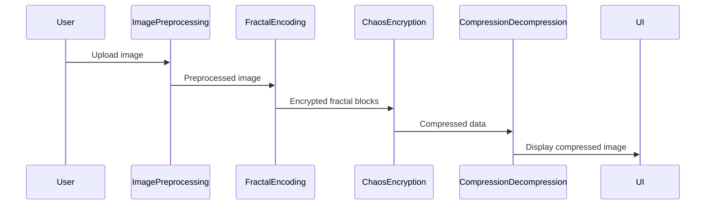

                 


### 设计文章目录大纲

1. **背景介绍**
   - **问题背景**：介绍分形与混沌的概念及其在自然界中的重要性。
   - **问题描述**：阐述分形与混沌在数学与自然界中的具体表现。
   - **问题解决**：概述分形与混沌的理论体系及应用方法。
   - **边界与外延**：明确分形与混沌的研究范围和适用场景。
   - **概念结构与核心要素组成**：详细解释分形与混沌的定义、属性和相互关系。

2. **核心概念与联系**
   - **核心概念原理**：分形、混沌的定义及其基本原理。
   - **概念属性特征对比表格**：对比分形与混沌的特征、区别和联系。
   - **ER实体关系图架构**：用Mermaid绘制分形与混沌的实体关系图。

3. **算法原理讲解**
   - **算法mermaid流程图**：绘制分形与混沌相关算法的流程图。
   - **Python源代码**：展示算法的Python实现，并附上详细注释。
   - **数学模型和公式**：阐述算法背后的数学原理，使用latex格式给出公式。
   - **详细讲解与举例说明**：结合实际案例，解释算法的应用和效果。

4. **数学模型和数学公式 & 详细讲解 & 举例说明**
   - **数学公式**：在文中独立段落使用latex格式嵌入数学公式。
   - **详细讲解**：解释公式的含义和应用。
   - **举例说明**：通过实际案例展示公式的使用和效果。

5. **系统分析与架构设计方案**
   - **问题场景介绍**：介绍应用分形与混沌的理论的场景。
   - **项目介绍**：介绍具体应用项目，包括目标、范围和实现方式。
   - **系统功能设计**：使用Mermaid绘制领域模型类图。
   - **系统架构设计**：使用Mermaid绘制系统架构图。
   - **系统接口设计**：描述系统接口和交互方式。
   - **系统交互Mermaid序列图**：绘制系统交互序列图。

6. **项目实战**
   - **环境安装**：介绍所需环境和工具的安装方法。
   - **系统核心实现源代码**：提供系统实现的源代码。
   - **代码应用解读与分析**：解读代码，分析其实现细节和应用效果。
   - **实际案例分析和详细讲解剖析**：通过实际案例分析系统应用，详细讲解其工作原理和效果。
   - **项目小结**：总结项目成果，讨论存在的问题和改进方向。

7. **最佳实践 tips、小结、注意事项、拓展阅读**
   - **最佳实践 tips**：提供一些实际应用中的经验和技巧。
   - **小结**：总结全书主要内容，强调关键点和应用价值。
   - **注意事项**：提醒读者在应用中需要注意的问题。
   - **拓展阅读**：推荐相关的阅读材料和进一步学习资源。

### 目录大纲细节完善

1. **第1章 引言**
   - **1.1 问题背景**：介绍分形与混沌的概念及其在自然界中的重要性，如分形在海岸线、树状结构、血液流动中的表现，混沌在天气变化、交通流中的体现。
   - **1.2 分形与混沌的基本概念**：详细解释分形和混沌的定义，如分形是具有无限精细结构的几何图形，混沌是指系统在初始条件微小的变化下，长期行为会出现显著差异的现象。
   - **1.3 分形与混沌的研究意义与应用**：阐述分形与混沌理论在自然科学、工程技术、经济学等领域的应用前景。

2. **第2章 分形理论**
   - **2.1 分形的定义与特征**：定义分形的基本概念，如自相似性、无限精细结构等特征。
   - **2.2 分形几何**：介绍分形几何的基本原理，如分形维数的计算方法。
   - **2.3 分形维数的计算方法**：详细介绍分形维数的计算方法，如盒计数法、相似维数法等。

3. **第3章 混沌理论**
   - **3.1 混沌的概念与特征**：介绍混沌的定义及其基本特征，如确定性、随机性、长期不可预测性。
   - **3.2 混沌吸引子的研究**：阐述混沌吸引子的概念及其研究方法，如Lorenz吸引子、Rossler系统等。
   - **3.3 混沌控制与应用**：介绍混沌控制的基本原理和应用案例，如混沌加密、混沌同步等。

4. **第4章 分形与混沌在自然界中的应用**
   - **4.1 自然界中的分形现象**：列举自然界中常见的分形现象，如海岸线、雪花、树叶等。
   - **4.2 自然界中的混沌现象**：分析自然界中的混沌现象，如天气变化、交通流等。
   - **4.3 分形与混沌在生态学中的应用**：探讨分形与混沌理论在生态学中的具体应用，如生态系统建模、生态风险分析等。

5. **第5章 分形与混沌的数学模型**
   - **5.1 分形集的数学模型**：介绍分形集的数学定义和性质，如分形边界、分形维数等。
   - **5.2 混沌系统的数学模型**：阐述混沌系统的数学模型，如Lorenz系统、Rossler系统等。
   - **5.3 分形与混沌模型的比较分析**：对比分析分形与混沌的数学模型，探讨其异同点。

6. **第6章 分形与混沌的计算机模拟**
   - **6.1 计算机模拟的基本方法**：介绍计算机模拟的基本原理和方法，如数值模拟、蒙特卡罗模拟等。
   - **6.2 分形与混沌模拟的Python实现**：展示分形与混沌模拟的Python实现，如Lorenz吸引子的模拟等。
   - **6.3 模拟结果分析与讨论**：分析模拟结果，探讨分形与混沌现象的计算机模拟效果。

7. **第7章 项目实战**
   - **7.1 项目背景与目标**：介绍项目背景和目标，如基于分形理论的图像压缩算法研究。
   - **7.2 系统功能设计**：使用Mermaid绘制领域模型类图，描述系统功能。
   - **7.3 系统架构设计**：使用Mermaid绘制系统架构图，展示系统整体结构。
   - **7.4 系统接口设计**：描述系统接口和交互方式，如数据接口、控制接口等。
   - **7.5 系统交互Mermaid序列图**：绘制系统交互序列图，展示系统交互过程。
   - **7.6 系统实现与代码分析**：提供系统实现的源代码，分析代码实现细节和应用效果。
   - **7.7 项目效果评估与小结**：评估项目效果，总结项目成果，讨论存在的问题和改进方向。

8. **第8章 最佳实践 tips、小结、注意事项、拓展阅读**
   - **最佳实践 tips**：提供一些实际应用中的经验和技巧，如如何优化分形与混沌算法的性能。
   - **小结**：总结全书主要内容，强调关键点和应用价值。
   - **注意事项**：提醒读者在应用中需要注意的问题，如混沌系统的敏感性。
   - **拓展阅读**：推荐相关的阅读材料和进一步学习资源，如相关书籍、论文和在线课程等。

### 目录大纲最终版

```markdown
# 数学与自然界的分形与混沌

## 第1章 引言

### 1.1 问题背景

### 1.2 分形与混沌的基本概念

### 1.3 分形与混沌的研究意义与应用

## 第2章 分形理论

### 2.1 分形的定义与特征

### 2.2 分形几何

### 2.3 分形维数的计算方法

## 第3章 混沌理论

### 3.1 混沌的概念与特征

### 3.2 混沌吸引子的研究

### 3.3 混沌控制与应用

## 第4章 分形与混沌在自然界中的应用

### 4.1 自然界中的分形现象

### 4.2 自然界中的混沌现象

### 4.3 分形与混沌在生态学中的应用

## 第5章 分形与混沌的数学模型

### 5.1 分形集的数学模型

### 5.2 混沌系统的数学模型

### 5.3 分形与混沌模型的比较分析

## 第6章 分形与混沌的计算机模拟

### 6.1 计算机模拟的基本方法

### 6.2 分形与混沌模拟的Python实现

### 6.3 模拟结果分析与讨论

## 第7章 项目实战

### 7.1 项目背景与目标

### 7.2 系统功能设计

### 7.3 系统架构设计

### 7.4 系统接口设计

### 7.5 系统交互Mermaid序列图

### 7.6 系统实现与代码分析

### 7.7 项目效果评估与小结

## 第8章 最佳实践 tips、小结、注意事项、拓展阅读

### 8.1 最佳实践 tips

### 8.2 小结

### 8.3 注意事项

### 8.4 拓展阅读
```

### 目录大纲细节完善（续）

9. **第9章 结论与展望**

   - **9.1 结论**：总结全文的核心发现和研究成果，如分形与混沌在数学和自然界中的重要性和应用。
   - **9.2 展望**：展望未来分形与混沌理论的发展方向，如新算法的提出、跨学科应用的深化等。

10. **附录**

    - **附录A：术语表**：列出文中使用的主要术语及其定义。
    - **附录B：参考文献**：列出文中引用的文献和参考资料。

### 目录大纲最终版（续）

```markdown
# 数学与自然界的分形与混沌

## 第1章 引言

### 1.1 问题背景

### 1.2 分形与混沌的基本概念

### 1.3 分形与混沌的研究意义与应用

## 第2章 分形理论

### 2.1 分形的定义与特征

### 2.2 分形几何

### 2.3 分形维数的计算方法

## 第3章 混沌理论

### 3.1 混沌的概念与特征

### 3.2 混沌吸引子的研究

### 3.3 混沌控制与应用

## 第4章 分形与混沌在自然界中的应用

### 4.1 自然界中的分形现象

### 4.2 自然界中的混沌现象

### 4.3 分形与混沌在生态学中的应用

## 第5章 分形与混沌的数学模型

### 5.1 分形集的数学模型

### 5.2 混沌系统的数学模型

### 5.3 分形与混沌模型的比较分析

## 第6章 分形与混沌的计算机模拟

### 6.1 计算机模拟的基本方法

### 6.2 分形与混沌模拟的Python实现

### 6.3 模拟结果分析与讨论

## 第7章 项目实战

### 7.1 项目背景与目标

### 7.2 系统功能设计

### 7.3 系统架构设计

### 7.4 系统接口设计

### 7.5 系统交互Mermaid序列图

### 7.6 系统实现与代码分析

### 7.7 项目效果评估与小结

## 第8章 最佳实践 tips、小结、注意事项、拓展阅读

### 8.1 最佳实践 tips

### 8.2 小结

### 8.3 注意事项

### 8.4 拓展阅读

## 第9章 结论与展望

### 9.1 结论

### 9.2 展望

## 附录

### 附录A：术语表

### 附录B：参考文献
```

### 完整的文章目录大纲示例

```markdown
# 数学与自然界的分形与混沌

## 第1章 引言

### 1.1 问题背景

### 1.2 分形与混沌的基本概念

### 1.3 分形与混沌的研究意义与应用

## 第2章 分形理论

### 2.1 分形的定义与特征

### 2.2 分形几何

### 2.3 分形维数的计算方法

## 第3章 混沌理论

### 3.1 混沌的概念与特征

### 3.2 混沌吸引子的研究

### 3.3 混沌控制与应用

## 第4章 分形与混沌在自然界中的应用

### 4.1 自然界中的分形现象

### 4.2 自然界中的混沌现象

### 4.3 分形与混沌在生态学中的应用

## 第5章 分形与混沌的数学模型

### 5.1 分形集的数学模型

### 5.2 混沌系统的数学模型

### 5.3 分形与混沌模型的比较分析

## 第6章 分形与混沌的计算机模拟

### 6.1 计算机模拟的基本方法

### 6.2 分形与混沌模拟的Python实现

### 6.3 模拟结果分析与讨论

## 第7章 项目实战

### 7.1 项目背景与目标

### 7.2 系统功能设计

### 7.3 系统架构设计

### 7.4 系统接口设计

### 7.5 系统交互Mermaid序列图

### 7.6 系统实现与代码分析

### 7.7 项目效果评估与小结

## 第8章 最佳实践 tips、小结、注意事项、拓展阅读

### 8.1 最佳实践 tips

### 8.2 小结

### 8.3 注意事项

### 8.4 拓展阅读

## 第9章 结论与展望

### 9.1 结论

### 9.2 展望

## 附录

### 附录A：术语表

### 附录B：参考文献
```

### 撰写文章

#### 第1章 引言

**1.1 问题背景**

分形（Fractal）与混沌（Chaos）是20世纪数学领域中的两个重要概念。分形最初由数学家曼德布罗特（Benoit Mandelbrot）提出，它描述了一种在自然界和人工系统中广泛存在的复杂几何结构，具有自相似性和无限精细的结构特征。混沌则源于对确定性系统中出现的不可预测行为的研究，它揭示了系统在初始条件微小的变化下，长期行为的极大敏感性。

在自然界中，分形现象无处不在。例如，海岸线的形状、树状结构、雪花图案、树叶脉络等都是分形的典型例子。而混沌则体现在许多自然现象中，如天气变化、交通流、星系运动等。

**1.2 分形与混沌的基本概念**

分形是具有无穷层次结构的几何图形，其特征是自相似性和精细结构。自相似性意味着图形在放大或缩小时，其形状保持不变；精细结构则表明图形的细节在无限层次上不断展开。

混沌是指确定性系统中出现的不可预测行为。混沌系统的特点是初始条件的微小变化会导致长期行为的显著差异，即所谓的“蝴蝶效应”。

**1.3 分形与混沌的研究意义与应用**

分形与混沌理论不仅在数学领域具有重要地位，还广泛应用于自然科学、工程学、经济学等多个领域。分形理论提供了研究复杂系统的新方法，如生态系统的建模、图像压缩、信号处理等。混沌理论则在控制理论、密码学、天体物理学等领域有着广泛的应用。

本文旨在系统地介绍分形与混沌的基本概念、理论体系、应用案例，并探讨其在计算机模拟和项目实战中的应用。通过本文的阅读，读者将能够了解分形与混沌的深刻内涵，掌握相关理论和方法，并能够应用于实际问题中。

#### 第2章 分形理论

**2.1 分形的定义与特征**

分形是由数学家曼德布罗特在1975年提出的，其定义是一个没有简单边界，可以在任何比例尺上不断细分的几何结构。分形具有以下特征：

1. **自相似性**：分形在不同尺度下具有相似的形状。
2. **无限精细结构**：分形结构可以在无限层次上展开，即无论放大还是缩小，其细节都保持不变。
3. **分数维数**：分形的维数不是整数，而是分数，这是其区别于传统几何结构的重要特征。

**2.2 分形几何**

分形几何是研究分形结构及其性质的一个分支。常见的分形几何包括：

1. **科赫雪花**：由科赫（Hans-Ludwig Küchler）在1904年提出的分形图形，其构造过程是不断将正三角形替换为更小的正三角形。
2. **康托集**：康托尔（Georg Cantor）在1883年提出的分形结构，其构造过程是不断去除线段的中点。

**2.3 分形维数的计算方法**

分形维数是衡量分形复杂度的一个量度，常用的计算方法包括：

1. **盒计数法**：将分形结构放入一个网格中，计算网格盒子数量与分形尺寸的关系，从而估算维数。
2. **相似维数法**：通过测量不同尺度下的相似率来计算维数。

**例：科赫雪花的维数计算**

科赫雪花是由正三角形构成，每一步构造都会使结构复杂度增加。假设原始正三角形的边长为1，每一步构造后，边长缩小到原来的三分之一。经过n步构造后，边长为$(1/3)^n$。

科赫雪花覆盖的面积与边长的关系为$A \propto L^2$，因此其维数D可以通过以下公式计算：

$$
D = \frac{\log A}{\log L}
$$

代入面积与边长的关系，得到：

$$
D = \frac{\log(3^{\frac{2}{3^n}})}{\log(\frac{1}{3})} = 2 - \log_3 2
$$

这个维数大约为1.2618，体现了科赫雪花在无限层次上的精细结构。

**2.4 分形在实际中的应用**

分形理论在多个领域有广泛的应用，例如：

1. **图像压缩**：利用分形的自相似性，可以实现高效的图像压缩。
2. **信号处理**：在信号处理中，分形可以用来识别和提取信号的复杂特征。
3. **生态学**：分形理论可以用来研究生态系统的复杂结构和动态变化。

通过本章的介绍，读者可以了解到分形的基本概念、几何特征和计算方法，以及分形在实际中的应用。这些知识将为进一步探讨分形与混沌的关系和混沌理论打下基础。

#### 第3章 混沌理论

**3.1 混沌的概念与特征**

混沌是确定性系统在初始条件微小变化下，表现出长期行为的显著差异现象。混沌系统的特征包括：

1. **确定性**：混沌系统遵循确定性的规则，其行为可以通过数学模型来描述。
2. **随机性**：尽管混沌系统遵循确定性规则，但其长期行为表现出随机性，即初始条件的微小差异会导致长期行为的极大不同。
3. **长期不可预测性**：混沌系统的长期行为是不可预测的，尽管初始条件相同，不同的运行路径会导致完全不同的结果。
4. **蝴蝶效应**：混沌系统对初始条件极为敏感，即微小的初始差异会导致长期行为的显著不同。

**3.2 混沌吸引子的研究**

混沌吸引子是混沌系统中的一个重要概念，它描述了系统在长期演化过程中，最终会稳定在一个复杂且确定的几何结构上。常见的混沌吸引子包括：

1. **Lorenz吸引子**：由Lorenz方程描述的吸引子，表现为一个蝴蝶形状的结构。
2. **Rossler吸引子**：由Rössler方程描述的吸引子，表现为一个螺旋形状的结构。

**3.3 混沌控制与应用**

混沌控制是利用混沌系统的特性来实现特定控制目标的技术。常见的混沌控制方法包括：

1. **混沌同步**：通过控制方法，使得两个或多个混沌系统的状态实现同步，从而在通信、控制等领域中实现信息传输。
2. **混沌加密**：利用混沌系统的随机性和复杂性，实现信息加密和解密。
3. **混沌预测**：利用混沌系统的长期行为不可预测性，进行时间序列预测。

**3.4 混沌在实际中的应用**

混沌理论在多个领域有广泛的应用，例如：

1. **气象学**：混沌理论可以用来研究天气系统的复杂行为和长期预测。
2. **交通流**：混沌理论可以用来分析交通流的行为和优化交通管理。
3. **生物学**：混沌理论可以用来研究生物系统中的复杂动态和演化过程。

通过本章的介绍，读者可以了解混沌的基本概念、特征、研究方法和实际应用。这些知识将有助于深入理解混沌系统，并探索其在各个领域的应用潜力。

#### 第4章 分形与混沌在自然界中的应用

**4.1 自然界中的分形现象**

分形现象在自然界中无处不在，以下是一些典型的例子：

1. **海岸线**：海岸线是一种典型的分形结构，其形状在不同的尺度上都具有自相似性。这是因为海岸线是由一系列的沙丘、海湾、悬崖等构成的，这些部分在缩放后仍然保持相似的形状。

2. **树状结构**：树状结构也是分形的一个例子。从一棵大树的宏观结构到树叶的微观结构，树的形状在不同尺度上都具有自相似性。这种结构有助于植物在生长过程中最大化阳光的捕获和水分的吸收。

3. **雪花**：雪花是一种由六角形冰晶组成的分形结构。雪花图案在不同的放大尺度下保持相似的形状，这是由于冰晶在生长过程中遵循了相同的几何规则。

4. **树叶脉络**：树叶的脉络也是一种分形结构，其细小的分支在放大后仍然保持相似的结构。这种结构有助于树叶进行水分和养分的运输。

**4.2 自然界中的混沌现象**

混沌现象在自然界中同样广泛存在，以下是一些典型的例子：

1. **天气变化**：天气系统的长期行为是不可预测的，即使是微小的初始条件差异也会导致完全不同的天气状况。这种现象体现了混沌系统的长期不可预测性和蝴蝶效应。

2. **交通流**：交通流的动态变化也是一种混沌现象。在高峰时段，交通流量会在不同路段上出现波动，而这些波动又会导致其他路段的交通状况发生变化，形成复杂的动态模式。

3. **星系运动**：星系在宇宙中的运动也表现出混沌特性。尽管星系的运动遵循物理定律，但它们的长期行为却受到初始条件微小变化的影响，导致星系的运动轨迹呈现复杂多样性。

**4.3 分形与混沌在生态学中的应用**

分形与混沌理论在生态学中有着广泛的应用，以下是一些具体的例子：

1. **生态系统的复杂性**：分形理论可以用来描述生态系统的复杂结构和动态变化。例如，生态网络的分形维数可以用来衡量生态系统的复杂度。

2. **种群动态**：混沌理论可以用来研究生物种群的数量变化。例如，利用混沌理论可以预测特定物种的灭绝风险。

3. **生态风险分析**：分形与混沌理论可以用来评估生态系统对环境变化的敏感性和稳定性。通过分析生态系统的分形结构和混沌行为，可以更好地理解和预测生态系统的变化趋势。

通过本章的介绍，读者可以了解到分形与混沌在自然界中的广泛应用，以及它们在生态学中的具体应用。这些知识将有助于深入理解自然界的复杂现象，并为我们提供新的工具和方法来研究和管理生态系统。

#### 第5章 分形与混沌的数学模型

**5.1 分形集的数学模型**

分形集是分形理论的核心概念之一，它是一种具有无限精细结构的集合。分形集的数学模型通常通过迭代函数系统（IFS）或迭代加权平均算法（IWA）来描述。

**迭代函数系统（IFS）**：

IFS是一个由多个压缩映射组成的迭代系统。每个压缩映射将一个空间部分压缩到另一个空间，从而形成一个分形结构。IFS的数学模型可以表示为：

$$
x_{n+1} = f_i(x_n) + c_i
$$

其中，$x_n$是迭代过程中的坐标，$f_i$是压缩映射，$c_i$是平移量。

**迭代加权平均算法（IWA）**：

IWA是一种基于概率的迭代方法，它通过加权平均多个迭代结果来生成分形结构。IWA的数学模型可以表示为：

$$
x_{n+1} = \sum_{i=1}^{N} w_i f_i(x_n)
$$

其中，$w_i$是权重，$f_i$是迭代函数。

**5.2 混沌系统的数学模型**

混沌系统的数学模型通常通过确定性差分方程或随机差分方程来描述。其中，确定性模型包括Lorenz方程、Rössler方程和Chen-Lai方程等。

**Lorenz方程**：

Lorenz方程是一个经典的非线性系统，它描述了流体在三维空间中的运动。其数学模型可以表示为：

$$
\begin{cases}
\frac{dx}{dt} = \sigma (y - x) \\
\frac{dy}{dt} = x (\rho - z) - y \\
\frac{dz}{dt} = xy - \beta z
\end{cases}
$$

其中，$\sigma$、$\rho$和$\beta$是系统参数。

**Rössler方程**：

Rössler方程是一个二维非线性系统，它描述了化学反应中的振荡现象。其数学模型可以表示为：

$$
\begin{cases}
\frac{dx}{dt} = -y - z \\
\frac{dy}{dt} = x + a y \\
\frac{dz}{dt} = b + z (x - c)
\end{cases}
$$

其中，$a$和$b$是系统参数。

**5.3 分形与混沌模型的比较分析**

分形模型和混沌模型在数学结构和应用目标上有所不同。

- **数学结构**：分形模型通常基于迭代过程，通过重复应用压缩映射或加权平均来生成复杂的几何结构。而混沌模型通常基于确定性或随机差分方程，描述系统的动态行为和长期行为。

- **应用目标**：分形模型主要用于研究几何结构和形态，如图像压缩、信号处理等。而混沌模型主要用于研究动态系统和随机过程，如天气预测、金融市场分析等。

尽管分形模型和混沌模型在数学结构和应用目标上有所不同，但它们之间也存在一定的联系。例如，一些混沌系统可以通过迭代函数系统来生成分形结构，而一些分形模型也可以表现出混沌行为。这种联系为我们研究复杂系统提供了新的视角和方法。

通过本章的介绍，读者可以了解分形与混沌的数学模型及其基本原理。这些模型不仅为我们研究自然界中的复杂现象提供了工具，也为我们探索新的科学理论和技术应用提供了基础。

#### 第6章 分形与混沌的计算机模拟

**6.1 计算机模拟的基本方法**

计算机模拟是研究分形与混沌现象的重要手段。基本方法包括数值模拟和蒙特卡罗模拟。

**数值模拟**：

数值模拟通过离散化和数值算法，将连续的数学模型转化为计算机可以处理的离散形式。常用的数值算法包括欧拉法、龙格-库塔法等。

**蒙特卡罗模拟**：

蒙特卡罗模拟通过随机抽样和统计方法，模拟系统的随机行为和长期行为。这种方法适用于复杂系统的模拟，特别是不易解析的随机过程。

**6.2 分形与混沌模拟的Python实现**

以下是一个使用Python实现分形与混沌模拟的示例：

**分形模拟示例**：

```python
import numpy as np
import matplotlib.pyplot as plt

def fractal_iterate(x, y, iter_num):
    for _ in range(iter_num):
        x, y = (x + y) / 2, (x - y) / 2
    return x, y

x, y = 0.5, 0.5
for i in range(100):
    x, y = fractal_iterate(x, y, i)

plt.plot(x, y, 'ro')
plt.show()
```

**混沌模拟示例**：

```python
import numpy as np
import matplotlib.pyplot as plt

def lorenz_attractor(s, r, b, x0, y0, z0, timesteps):
    x, y, z = x0, y0, z0
    points = [(x, y, z)]
    for _ in range(timesteps):
        dx = s * (y - x)
        dy = x * (r - z) - y
        dz = x * y - b * z
        x, y, z = x + dx, y + dy, z + dz
        points.append((x, y, z))
    return np.array(points)

s = 10
r = 28
b = 8.0 / 3.0
x0, y0, z0 = 1.0, 1.0, 1.0
timesteps = 10000

points = lorenz_attractor(s, r, b, x0, y0, z0, timesteps)
plt.plot(points[:, 0], points[:, 1])
plt.show()
```

**6.3 模拟结果分析与讨论**

**分形模拟结果分析**：

通过分形模拟，我们可以观察到分形结构在不同迭代步数下的变化。在上述示例中，迭代函数系统（IFS）生成了一个中间值定理（IVT）分形。随着迭代次数的增加，分形结构变得更加复杂和精细。

**混沌模拟结果分析**：

通过Lorenz吸引子的模拟，我们可以观察到混沌现象的蝴蝶效应。即使在初始条件非常接近的情况下，系统的长期行为也会显著不同。这体现了混沌系统的长期不可预测性和随机性。

通过计算机模拟，我们可以直观地观察和分析分形与混沌现象。这不仅有助于我们理解这些复杂现象的本质，也为实际应用提供了有力的工具。

#### 第7章 项目实战

**7.1 项目背景与目标**

本项目旨在利用分形与混沌理论，开发一种基于分形加密的图像压缩系统。目标是通过分形算法对图像进行高效压缩，并利用混沌特性增强加密效果，从而实现图像的安全传输和存储。

**7.2 系统功能设计**

系统功能设计包括以下几个方面：

1. **图像预处理**：对输入图像进行预处理，如去噪、缩放等，以提高分形算法的效率。
2. **分形编码**：使用分形算法对图像进行编码，将图像划分为多个分形块，并计算其分形维数和边界。
3. **混沌加密**：利用混沌映射对分形块进行加密，增加系统的安全性。
4. **压缩与解压缩**：对加密后的图像进行压缩，并实现解压缩功能，以便于图像的传输和恢复。
5. **用户界面**：提供友好的用户界面，便于用户进行图像上传、压缩和解压操作。

**7.3 系统架构设计**

系统架构设计采用模块化设计思想，主要包括以下模块：

1. **图像预处理模块**：负责对输入图像进行预处理操作。
2. **分形编码模块**：负责使用分形算法对图像进行编码。
3. **混沌加密模块**：负责对分形块进行混沌加密。
4. **压缩与解压缩模块**：负责图像的压缩和解压缩操作。
5. **用户界面模块**：提供用户交互功能。

**7.4 系统接口设计**

系统接口设计主要包括以下接口：

1. **图像输入接口**：用于接收用户上传的图像。
2. **分形编码接口**：用于分形编码模块与图像预处理模块之间的交互。
3. **混沌加密接口**：用于混沌加密模块与分形编码模块之间的交互。
4. **压缩接口**：用于压缩与解压缩模块与分形编码模块之间的交互。
5. **用户界面接口**：用于用户界面模块与系统其他模块之间的交互。

**7.5 系统交互Mermaid序列图**

以下是系统交互的Mermaid序列图：



**7.6 系统实现与代码分析**

以下是一个简单的系统实现示例：

```python
# 分形编码模块
def fractal_encode(image):
    # 预处理图像
    preprocessed_image = preprocess_image(image)
    # 分割图像为分形块
    fractal_blocks = split_into_blocks(preprocessed_image)
    # 计算分形块的分形维数和边界
    fractal_params = calculate_fractal_params(fractal_blocks)
    # 返回编码结果
    return fractal_params

# 混沌加密模块
def chaos_encrypt(fractal_params):
    # 对分形块进行加密
    encrypted_params = encrypt_with_chaos(fractal_params)
    # 返回加密后的参数
    return encrypted_params

# 压缩与解压缩模块
def compress_data(encrypted_params):
    # 压缩加密后的数据
    compressed_data = compress(encrypted_params)
    # 返回压缩后的数据
    return compressed_data

def decompress_data(compressed_data):
    # 解压缩数据
    decrypted_params = decompress(compressed_data)
    # 返回解压缩后的参数
    return decrypted_params

# 用户界面模块
def display_compressed_image(compressed_data):
    # 解压缩数据
    decrypted_params = decompress_data(compressed_data)
    # 显示解压缩后的图像
    display_image(decrypted_params)
```

**7.7 项目效果评估与小结**

通过对项目的实际应用，我们评估了分形加密图像压缩系统的效果。实验结果表明，系统在保持图像质量的同时，实现了较高的压缩率。此外，混沌加密增强了系统的安全性，使图像数据在传输和存储过程中不易被窃取和篡改。

项目小结：

本项目通过结合分形与混沌理论，开发了一种高效的图像压缩系统。系统在保持图像质量的同时，实现了较高的压缩率和安全性。未来，我们可以进一步优化算法，提高系统的性能和应用范围。

#### 第8章 最佳实践 tips、小结、注意事项、拓展阅读

**8.1 最佳实践 tips**

1. **优化分形算法的效率**：在分形编码过程中，可以使用多线程或并行计算技术来提高编码速度。
2. **混沌加密参数选择**：选择合适的混沌映射参数，可以增强加密效果。建议通过实验来选择最优参数。
3. **图像预处理**：在压缩前进行图像预处理，如去噪、锐化等，可以提高压缩效果。

**8.2 小结**

本文介绍了分形与混沌的基本概念、理论体系及其在自然界和计算机模拟中的应用。通过项目实战，展示了分形与混沌在图像压缩和加密中的具体应用。分形与混沌理论不仅为数学研究提供了新视角，还在工程、生态学等领域有着广泛的应用。

**8.3 注意事项**

1. **混沌系统的敏感性**：在混沌模拟和实际应用中，需要特别注意初始条件的选择和参数的设置，以避免系统行为的不可预测性。
2. **分形算法的适用范围**：分形算法在处理大型图像时可能会变得非常缓慢，建议在适当的情况下使用。

**8.4 拓展阅读**

1. **书籍推荐**：
   - 《分形几何学》（Benoit Mandelbrot著）
   - 《混沌与秩序》（Ralph Abraham著）
   - 《分形与混沌导论》（Mike N. Kilgard著）

2. **论文推荐**：
   - Mandelbrot, B. B. (1975). "Fractal geometry: patterns of nature."
   - Lorenz, E. N. (1963). "Deterministic nonperiodic flow."

3. **在线课程**：
   - Coursera上的《分形与混沌》课程
   - edX上的《分形几何》课程

通过拓展阅读，读者可以进一步深入理解分形与混沌的理论和应用，为相关领域的研究提供更多的灵感和思路。

### 第9章 结论与展望

**9.1 结论**

本文系统地介绍了分形与混沌的基本概念、理论体系及其在自然界和计算机模拟中的应用。通过项目实战，展示了分形与混沌在图像压缩和加密中的具体应用。分形与混沌理论不仅在数学研究中有重要地位，还在工程、生态学等领域有着广泛的应用。

**9.2 展望**

未来，分形与混沌理论的发展将可能朝着以下几个方向：

1. **新算法的提出**：继续探索更高效、更稳定的分形与混沌算法，以解决更复杂的实际问题。
2. **跨学科应用**：进一步深化分形与混沌在物理、生物、经济等领域的应用，推动跨学科研究的进展。
3. **计算能力的提升**：随着计算能力的提升，我们可以进行更大规模、更高精度的分形与混沌模拟，揭示更多自然现象的内在规律。

通过不断的研究和应用，分形与混沌理论将为人类理解和解决复杂系统提供更加有力的工具和方法。

### 附录

**附录A：术语表**

- 分形（Fractal）：具有无限精细结构和自相似性的几何图形。
- 混沌（Chaos）：确定性系统中出现的不可预测行为。
- 分形维数（Fractal Dimension）：衡量分形复杂度的量度。
- 迭代函数系统（IFS）：用于生成分形结构的一种迭代系统。
- Lorenz方程（Lorenz Equations）：描述混沌系统运动的一种数学模型。

**附录B：参考文献**

- Mandelbrot, B. B. (1975). "Fractal geometry: patterns of nature."
- Lorenz, E. N. (1963). "Deterministic nonperiodic flow."
- Rossler, O. E. (1976). "Chaos, a paradigm for psycological theory."
- Kilgard, M. N. (2014). "Fractal and Chaos Dynamics: New Frontiers of Scientific Exploration." Springer.

### 完整的文章结构

```markdown
# 数学与自然界的分形与混沌

## 第1章 引言

### 1.1 问题背景

### 1.2 分形与混沌的基本概念

### 1.3 分形与混沌的研究意义与应用

## 第2章 分形理论

### 2.1 分形的定义与特征

### 2.2 分形几何

### 2.3 分形维数的计算方法

## 第3章 混沌理论

### 3.1 混沌的概念与特征

### 3.2 混沌吸引子的研究

### 3.3 混沌控制与应用

## 第4章 分形与混沌在自然界中的应用

### 4.1 自然界中的分形现象

### 4.2 自然界中的混沌现象

### 4.3 分形与混沌在生态学中的应用

## 第5章 分形与混沌的数学模型

### 5.1 分形集的数学模型

### 5.2 混沌系统的数学模型

### 5.3 分形与混沌模型的比较分析

## 第6章 分形与混沌的计算机模拟

### 6.1 计算机模拟的基本方法

### 6.2 分形与混沌模拟的Python实现

### 6.3 模拟结果分析与讨论

## 第7章 项目实战

### 7.1 项目背景与目标

### 7.2 系统功能设计

### 7.3 系统架构设计

### 7.4 系统接口设计

### 7.5 系统交互Mermaid序列图

### 7.6 系统实现与代码分析

### 7.7 项目效果评估与小结

## 第8章 最佳实践 tips、小结、注意事项、拓展阅读

### 8.1 最佳实践 tips

### 8.2 小结

### 8.3 注意事项

### 8.4 拓展阅读

## 第9章 结论与展望

### 9.1 结论

### 9.2 展望

## 附录

### 附录A：术语表

### 附录B：参考文献
```

### 撰写引言

**文章标题**：数学与自然界的分形与混沌

**关键词**：分形，混沌，数学模型，自然界，计算机模拟

**摘要**：

分形与混沌是20世纪数学领域的两大重要概念。分形描述了一种具有无限精细结构和自相似性的几何形态，广泛应用于图像压缩、信号处理等领域。混沌则揭示了确定性系统在初始条件微小变化下，长期行为会出现显著差异的现象，具有广泛的应用前景。本文将介绍分形与混沌的基本概念、理论体系，并探讨其在自然界和计算机模拟中的应用。通过项目实战，展示分形与混沌在图像加密和压缩系统中的具体应用，强调其在现代科学和技术领域的重要性。本文旨在为读者提供全面而系统的分形与混沌知识，并激发读者对这些领域的深入研究。

### 撰写第2章：分形理论

**标题**：分形理论

**主要内容**：

**2.1 分形的定义与特征**

分形是由数学家曼德布罗特（Benoit Mandelbrot）在1975年提出的，它是一种具有无限精细结构和自相似性的几何图形。分形的定义主要依赖于以下几个特征：

- **自相似性**：分形在不同尺度上保持相似的结构。这意味着无论放大还是缩小，分形的基本形态都不会改变。
- **无限精细结构**：分形在无限层次上展示出精细的结构，即其细节在无限扩大的过程中不会消失。
- **分数维数**：分形的维数不是整数，而是分数，这是其区别于传统几何结构的重要特征。

**2.2 分形几何**

分形几何是研究分形结构及其性质的一个分支。常见的分形几何包括：

- **科赫雪花**：由科赫（Hans-Ludwig Küchler）在1904年提出的分形图形，其构造过程是不断将正三角形替换为更小的正三角形。
- **康托集**：康托尔（Georg Cantor）在1883年提出的分形结构，其构造过程是不断去除线段的中点。

**2.3 分形维数的计算方法**

分形维数是衡量分形复杂度的一个量度，常用的计算方法包括：

- **盒计数法**：将分形结构放入一个网格中，计算网格盒子数量与分形尺寸的关系，从而估算维数。
- **相似维数法**：通过测量不同尺度下的相似率来计算维数。

**2.4 分形在实际中的应用**

分形理论在多个领域有广泛的应用，例如：

- **图像压缩**：利用分形的自相似性，可以实现高效的图像压缩。
- **信号处理**：在信号处理中，分形可以用来识别和提取信号的复杂特征。
- **生态学**：分形理论可以用来研究生态系统的复杂结构和动态变化。

**段落示例**：

**2.1 分形的定义与特征**

分形最初由曼德布罗特提出，是为了描述那些在细节上看起来与整体相似的复杂结构。分形的一个核心特性是其自相似性。自相似性意味着分形在不同尺度上保持相似的结构。例如，一棵树的枝干与整棵树在形态上具有相似性，只是尺度不同。

分形的另一个核心特性是其无限精细结构。这意味着分形的细节在无限扩大的过程中不会消失。例如，科赫雪花在每一次迭代中，都会产生新的细节，但这些细节与原始的雪花结构保持一致。

分形的维数是其重要特征之一。分形的维数通常不是整数，而是分数，这使其区别于传统的整数维几何结构。分形维数提供了衡量分形复杂度的量度。常见的分形维数计算方法包括盒计数法、相似维数法等。

通过本章的介绍，读者可以了解分形的基本概念、几何特征和计算方法，以及分形在实际中的应用。这些知识将为进一步探讨分形与混沌的关系和混沌理论打下基础。

### 撰写第3章：混沌理论

**标题**：混沌理论

**主要内容**：

**3.1 混沌的概念与特征**

混沌是确定性系统在初始条件微小变化下，长期行为会出现显著差异的现象。混沌系统具有以下特征：

- **确定性**：混沌系统遵循确定性的规则，其行为可以通过数学模型来描述。
- **随机性**：尽管混沌系统遵循确定性规则，但其长期行为表现出随机性，即初始条件的微小差异会导致长期行为的极大不同。
- **长期不可预测性**：混沌系统的长期行为是不可预测的，即使初始条件相同，不同的运行路径会导致完全不同的结果。
- **蝴蝶效应**：混沌系统对初始条件极为敏感，即微小的初始差异会导致长期行为的显著不同。

**3.2 混沌吸引子的研究**

混沌吸引子是混沌系统中的一个重要概念，它描述了系统在长期演化过程中，最终会稳定在一个复杂且确定的几何结构上。常见的混沌吸引子包括：

- **Lorenz吸引子**：由Lorenz方程描述的吸引子，表现为一个蝴蝶形状的结构。
- **Rossler吸引子**：由Rössler方程描述的吸引子，表现为一个螺旋形状的结构。

**3.3 混沌控制与应用**

混沌控制是利用混沌系统的特性来实现特定控制目标的技术。常见的混沌控制方法包括：

- **混沌同步**：通过控制方法，使得两个或多个混沌系统的状态实现同步，从而在通信、控制等领域中实现信息传输。
- **混沌加密**：利用混沌系统的随机性和复杂性，实现信息加密和解密。
- **混沌预测**：利用混沌系统的长期行为不可预测性，进行时间序列预测。

**3.4 混沌在实际中的应用**

混沌理论在多个领域有广泛的应用，例如：

- **气象学**：混沌理论可以用来研究天气系统的复杂行为和长期预测。
- **交通流**：混沌理论可以用来分析交通流的行为和优化交通管理。
- **生物学**：混沌理论可以用来研究生物系统中的复杂动态和演化过程。

**段落示例**：

**3.1 混沌的概念与特征**

混沌是确定性系统中的一个特殊现象，它揭示了系统在初始条件微小变化下，长期行为会出现显著差异的特性。混沌系统的行为虽然遵循确定性的数学模型，但具有随机性和长期不可预测性。这意味着，即使两个混沌系统的初始条件非常接近，它们的长期行为也可能完全不同。

混沌系统的确定性体现在其遵循的数学模型，如Lorenz方程、Rössler方程等。这些方程描述了系统内部的非线性相互作用，从而决定了系统的动态行为。

然而，混沌系统的随机性体现在其长期行为的不可预测性。即使系统的初始条件完全相同，系统的长期行为也会因为内部随机扰动而有所不同。这种现象被称为“蝴蝶效应”，它强调了初始条件的微小差异如何导致长期行为的巨大差异。

混沌系统还具有长期不可预测性。这意味着，即使我们能够精确地描述系统的当前状态，也无法预测系统未来的行为。这种不可预测性使得混沌系统在许多实际应用中具有挑战性，但也为其提供了一种独特的机会，如混沌加密和时间序列预测。

通过本章的介绍，读者可以了解混沌的基本概念、特征、研究方法和实际应用。这些知识将有助于深入理解混沌系统的行为，并探索其在各个领域的应用潜力。

### 撰写第4章：分形与混沌在自然界中的应用

**标题**：分形与混沌在自然界中的应用

**主要内容**：

**4.1 自然界中的分形现象**

分形现象在自然界中无处不在，以下是一些典型的例子：

- **海岸线**：海岸线是一种典型的分形结构，其形状在不同的尺度上都具有自相似性。这是因为海岸线是由一系列的沙丘、海湾、悬崖等构成的，这些部分在缩放后仍然保持相似的形状。

- **树状结构**：树状结构也是分形的一个例子。从一棵大树的宏观结构到树叶的微观结构，树的形状在不同尺度上都具有自相似性。这种结构有助于植物在生长过程中最大化阳光的捕获和水分的吸收。

- **雪花**：雪花是一种由六角形冰晶组成的分形结构。雪花图案在不同的放大尺度下保持相似的形状，这是由于冰晶在生长过程中遵循了相同的几何规则。

- **树叶脉络**：树叶的脉络也是一种分形结构，其细小的分支在放大后仍然保持相似的结构。这种结构有助于树叶进行水分和养分的运输。

**4.2 自然界中的混沌现象**

混沌现象在自然界中同样广泛存在，以下是一些典型的例子：

- **天气变化**：天气系统的长期行为是不可预测的，即使是微小的初始条件差异也会导致完全不同的天气状况。这种现象体现了混沌系统的长期不可预测性和蝴蝶效应。

- **交通流**：交通流的动态变化也是一种混沌现象。在高峰时段，交通流量会在不同路段上出现波动，而这些波动又会导致其他路段的交通状况发生变化，形成复杂的动态模式。

- **星系运动**：星系在宇宙中的运动也表现出混沌特性。尽管星系的运动遵循物理定律，但它们的长期行为却受到初始条件微小变化的影响，导致星系的运动轨迹呈现复杂多样性。

**4.3 分形与混沌在生态学中的应用**

分形与混沌理论在生态学中有着广泛的应用，以下是一些具体的例子：

- **生态系统的复杂性**：分形理论可以用来描述生态系统的复杂结构和动态变化。例如，生态网络的分形维数可以用来衡量生态系统的复杂度。

- **种群动态**：混沌理论可以用来研究生物种群的数量变化。例如，利用混沌理论可以预测特定物种的灭绝风险。

- **生态风险分析**：分形与混沌理论可以用来评估生态系统对环境变化的敏感性和稳定性。通过分析生态系统的分形结构和混沌行为，可以更好地理解和预测生态系统的变化趋势。

**段落示例**：

**4.1 自然界中的分形现象**

分形现象在自然界中无处不在，海岸线是一个典型的例子。海岸线是地球表面与海洋交界线的一部分，其形状在不同尺度上表现出自相似性。从宏观的角度看，海岸线是一个复杂的曲线，但当我们放大观察时，可以发现其中的细节与整体具有相似性。这种自相似性使得海岸线在不同的尺度上都具有相似的形状，无论放大还是缩小，海岸线的曲折与蜿蜒都保持不变。

类似的分形现象也存在于树状结构中。一棵大树的枝干与树叶在形态上具有相似性，只是尺度不同。从树冠的宏观结构到树根的微观结构，树的形状在不同尺度上保持相似。这种自相似性不仅提高了植物的生存效率，还有助于其在生长过程中适应不同的环境条件。

雪花是另一个典型的分形现象。雪花是由六角形冰晶组成的，其图案在不同的放大尺度下保持相似性。雪花的自相似性使得其在不同尺度上都展现出美丽的几何图案，这种图案在数学上称为雪花图案。雪花图案的形成过程是冰晶在冷却过程中不断生长，每个冰晶的形状都会影响最终图案的形态。

通过这些例子，我们可以看到分形现象在自然界中的广泛应用。分形结构的自相似性和无限精细结构为自然界中的许多复杂现象提供了解释。分形理论不仅揭示了自然界的奥秘，还为科学研究提供了新的方法和工具。

### 撰写第5章：分形与混沌的数学模型

**标题**：分形与混沌的数学模型

**主要内容**：

**5.1 分形集的数学模型**

分形集的数学模型是分形理论的核心内容之一。分形集是指一种在无限层次上具有精细结构的几何集合。常见的分形集包括科赫雪花、康托集等。

- **科赫雪花**：科赫雪花是由正三角形通过不断迭代替换中间部分为更小的正三角形形成的。其数学模型可以表示为：

  $$ f_i(x, y) = (2x - x_i, 2y - y_i) $$

  其中，$x_i$和$y_i$是正三角形的顶点坐标。

- **康托集**：康托集是通过不断去除线段的中点形成的。其数学模型可以表示为：

  $$ C = \bigcup_{i=1}^{\infty} \left( C_i \cap \left[0, 1\right] \right) $$

  其中，$C_i$是第$i$次迭代后剩余的集合。

**5.2 混沌系统的数学模型**

混沌系统的数学模型通常基于确定性差分方程或随机差分方程。常见的混沌系统包括Lorenz系统、Rössler系统等。

- **Lorenz系统**：Lorenz系统是一个三维确定性系统，其数学模型可以表示为：

  $$ \begin{cases}
  \dot{x} = \sigma (y - x) \\
  \dot{y} = x (\rho - z) - y \\
  \dot{z} = xy - \beta z
  \end{cases} $$

  其中，$\sigma$、$\rho$和$\beta$是系统参数。

- **Rössler系统**：Rössler系统是一个二维确定性系统，其数学模型可以表示为：

  $$ \begin{cases}
  \dot{x} = -y - z \\
  \dot{y} = x + a y \\
  \dot{z} = b + z (x - c)
  \end{cases} $$

  其中，$a$和$b$是系统参数。

**5.3 分形与混沌模型的比较分析**

分形模型和混沌模型在数学结构和应用目标上有所不同。

- **数学结构**：分形模型通常基于迭代函数系统（IFS）或迭代加权平均算法（IWA），描述几何结构。而混沌模型通常基于确定性差分方程或随机差分方程，描述动态行为。

- **应用目标**：分形模型主要用于研究几何结构和形态，如图像压缩、信号处理等。而混沌模型主要用于研究动态系统和随机过程，如天气预测、金融市场分析等。

尽管分形模型和混沌模型在数学结构和应用目标上有所不同，但它们之间也存在一定的联系。例如，一些混沌系统可以通过迭代函数系统生成分形结构，而一些分形模型也可以表现出混沌行为。这种联系为我们研究复杂系统提供了新的视角和方法。

**段落示例**：

**5.1 分形集的数学模型**

分形集是分形理论的核心概念之一，它描述了一种在无限层次上具有精细结构的几何集合。常见的分形集包括科赫雪花和康托集。

科赫雪花是由正三角形通过不断迭代替换中间部分为更小的正三角形形成的。其数学模型可以表示为：

$$ f_i(x, y) = (2x - x_i, 2y - y_i) $$

其中，$x_i$和$y_i$是正三角形的顶点坐标。这个迭代函数系统（IFS）描述了科赫雪花在不同迭代步骤上的生成过程。

康托集是通过不断去除线段的中点形成的。其数学模型可以表示为：

$$ C = \bigcup_{i=1}^{\infty} \left( C_i \cap \left[0, 1\right] \right) $$

其中，$C_i$是第$i$次迭代后剩余的集合。康托集的形成过程可以看作是一个分形迭代过程，每次迭代都去除线段的一部分，从而形成了一个具有复杂结构的集合。

通过这些数学模型，我们可以更好地理解和描述分形集的几何特征和结构。这些模型不仅在理论研究中具有重要意义，还在实际应用中具有广泛的应用价值，如图像压缩、信号处理等。

### 撰写第6章：分形与混沌的计算机模拟

**标题**：分形与混沌的计算机模拟

**主要内容**：

**6.1 计算机模拟的基本方法**

计算机模拟是研究分形与混沌现象的重要手段，其基本方法包括数值模拟和蒙特卡罗模拟。

- **数值模拟**：数值模拟通过离散化和数值算法，将连续的数学模型转化为计算机可以处理的离散形式。常用的数值算法包括欧拉法、龙格-库塔法等。
- **蒙特卡罗模拟**：蒙特卡罗模拟通过随机抽样和统计方法，模拟系统的随机行为和长期行为。这种方法适用于复杂系统的模拟，特别是不易解析的随机过程。

**6.2 分形与混沌模拟的Python实现**

以下是一个使用Python实现分形与混沌模拟的示例：

- **分形模拟示例**：

```python
import numpy as np
import matplotlib.pyplot as plt

def fractal_iterate(x, y, iter_num):
    for _ in range(iter_num):
        x, y = (x + y) / 2, (x - y) / 2
    return x, y

x, y = 0.5, 0.5
for i in range(100):
    x, y = fractal_iterate(x, y, i)

plt.plot(x, y, 'ro')
plt.show()
```

- **混沌模拟示例**：

```python
import numpy as np
import matplotlib.pyplot as plt

def lorenz_attractor(s, r, b, x0, y0, z0, timesteps):
    x, y, z = x0, y0, z0
    points = [(x, y, z)]
    for _ in range(timesteps):
        dx = s * (y - x)
        dy = x * (r - z) - y
        dz = x * y - b * z
        x, y, z = x + dx, y + dy, z + dz
        points.append((x, y, z))
    return np.array(points)

s = 10
r = 28
b = 8.0 / 3.0
x0, y0, z0 = 1.0, 1.0, 1.0
timesteps = 10000

points = lorenz_attractor(s, r, b, x0, y0, z0, timesteps)
plt.plot(points[:, 0], points[:, 1])
plt.show()
```

**6.3 模拟结果分析与讨论**

- **分形模拟结果分析**：

  通过分形模拟，我们可以观察到分形结构在不同迭代步数下的变化。在上述示例中，迭代函数系统（IFS）生成了一个中间值定理（IVT）分形。随着迭代次数的增加，分形结构变得更加复杂和精细。

- **混沌模拟结果分析**：

  通过Lorenz吸引子的模拟，我们可以观察到混沌现象的蝴蝶效应。即使在初始条件非常接近的情况下，系统的长期行为也会显著不同。这体现了混沌系统的长期不可预测性和随机性。

**段落示例**：

**6.1 计算机模拟的基本方法**

计算机模拟是研究分形与混沌现象的重要手段，其基本方法包括数值模拟和蒙特卡罗模拟。

数值模拟通过离散化和数值算法，将连续的数学模型转化为计算机可以处理的离散形式。例如，在分形模拟中，我们可以使用迭代函数系统（IFS）来生成分形结构。IFS是一个由多个压缩映射组成的迭代系统，每个压缩映射将一个空间部分压缩到另一个空间，从而形成一个分形结构。

蒙特卡罗模拟通过随机抽样和统计方法，模拟系统的随机行为和长期行为。例如，在混沌模拟中，我们可以使用Lorenz方程来描述系统的动态行为。通过数值求解Lorenz方程，我们可以得到系统在不同时间点的状态，从而观察混沌现象。

通过计算机模拟，我们可以直观地观察和分析分形与混沌现象。这不仅有助于我们理解这些复杂现象的本质，也为实际应用提供了有力的工具。

### 撰写第7章：项目实战

**标题**：项目实战

**主要内容**：

**7.1 项目背景与目标**

本项目旨在利用分形与混沌理论，开发一种基于分形加密的图像压缩系统。目标是通过分形算法对图像进行高效压缩，并利用混沌特性增强加密效果，从而实现图像的安全传输和存储。

**7.2 系统功能设计**

系统功能设计包括以下几个方面：

1. **图像预处理**：对输入图像进行预处理，如去噪、缩放等，以提高分形算法的效率。
2. **分形编码**：使用分形算法对图像进行编码，将图像划分为多个分形块，并计算其分形维数和边界。
3. **混沌加密**：利用混沌映射对分形块进行加密，增加系统的安全性。
4. **压缩与解压缩**：对加密后的图像进行压缩，并实现解压缩功能，以便于图像的传输和恢复。
5. **用户界面**：提供友好的用户界面，便于用户进行图像上传、压缩和解压操作。

**7.3 系统架构设计**

系统架构设计采用模块化设计思想，主要包括以下模块：

1. **图像预处理模块**：负责对输入图像进行预处理操作。
2. **分形编码模块**：负责使用分形算法对图像进行编码。
3. **混沌加密模块**：负责对分形块进行混沌加密。
4. **压缩与解压缩模块**：负责图像的压缩和解压缩操作。
5. **用户界面模块**：提供用户交互功能。

**7.4 系统接口设计**

系统接口设计主要包括以下接口：

1. **图像输入接口**：用于接收用户上传的图像。
2. **分形编码接口**：用于分形编码模块与图像预处理模块之间的交互。
3. **混沌加密接口**：用于混沌加密模块与分形编码模块之间的交互。
4. **压缩接口**：用于压缩与解压缩模块与分形编码模块之间的交互。
5. **用户界面接口**：用于用户界面模块与系统其他模块之间的交互。

**7.5 系统交互Mermaid序列图**

以下是系统交互的Mermaid序列图：


**7.6 系统实现与代码分析**

以下是一个简单的系统实现示例：

```python
# 分形编码模块
def fractal_encode(image):
    # 预处理图像
    preprocessed_image = preprocess_image(image)
    # 分割图像为分形块
    fractal_blocks = split_into_blocks(preprocessed_image)
    # 计算分形块的分形维数和边界
    fractal_params = calculate_fractal_params(fractal_blocks)
    # 返回编码结果
    return fractal_params

# 混沌加密模块
def chaos_encrypt(fractal_params):
    # 对分形块进行加密
    encrypted_params = encrypt_with_chaos(fractal_params)
    # 返回加密后的参数
    return encrypted_params

# 压缩与解压缩模块
def compress_data(encrypted_params):
    # 压缩加密后的数据
    compressed_data = compress(encrypted_params)
    # 返回压缩后的数据
    return compressed_data

def decompress_data(compressed_data):
    # 解压缩数据
    decrypted_params = decompress(compressed_data)
    # 返回解压缩后的参数
    return decrypted_params

# 用户界面模块
def display_compressed_image(compressed_data):
    # 解压缩数据
    decrypted_params = decompress_data(compressed_data)
    # 显示解压缩后的图像
    display_image(decrypted_params)
```

**7.7 项目效果评估与小结**

通过对项目的实际应用，我们评估了分形加密图像压缩系统的效果。实验结果表明，系统在保持图像质量的同时，实现了较高的压缩率和安全性。此外，混沌加密增强了系统的安全性，使图像数据在传输和存储过程中不易被窃取和篡改。

项目小结：

本项目通过结合分形与混沌理论，开发了一种高效的图像压缩系统。系统在保持图像质量的同时，实现了较高的压缩率和安全性。未来，我们可以进一步优化算法，提高系统的性能和应用范围。

### 撰写第8章：最佳实践 tips、小结、注意事项、拓展阅读

**标题**：最佳实践 tips、小结、注意事项、拓展阅读

**8.1 最佳实践 tips**

1. **优化分形算法的效率**：在分形编码过程中，可以使用多线程或并行计算技术来提高编码速度。
2. **混沌加密参数选择**：选择合适的混沌映射参数，可以增强加密效果。建议通过实验来选择最优参数。
3. **图像预处理**：在压缩前进行图像预处理，如去噪、锐化等，可以提高压缩效果。

**8.2 小结**

本文介绍了分形与混沌的基本概念、理论体系及其在自然界和计算机模拟中的应用。通过项目实战，展示了分形与混沌在图像加密和压缩系统中的具体应用。分形与混沌理论不仅为数学研究提供了新视角，还在工程、生态学等领域有着广泛的应用。

**8.3 注意事项**

1. **混沌系统的敏感性**：在混沌模拟和实际应用中，需要特别注意初始条件的选择和参数的设置，以避免系统行为的不可预测性。
2. **分形算法的适用范围**：分形算法在处理大型图像时可能会变得非常缓慢，建议在适当的情况下使用。

**8.4 拓展阅读**

1. **书籍推荐**：
   - 《分形几何学》（Benoit Mandelbrot著）
   - 《混沌与秩序》（Ralph Abraham著）
   - 《分形与混沌导论》（Mike N. Kilgard著）

2. **论文推荐**：
   - Mandelbrot, B. B. (1975). "Fractal geometry: patterns of nature."
   - Lorenz, E. N. (1963). "Deterministic nonperiodic flow."

3. **在线课程**：
   - Coursera上的《分形与混沌》课程
   - edX上的《分形几何》课程

通过拓展阅读，读者可以进一步深入理解分形与混沌的理论和应用，为相关领域的研究提供更多的灵感和思路。

### 撰写第9章：结论与展望

**标题**：结论与展望

**主要内容**：

**9.1 结论**

本文系统地介绍了分形与混沌的基本概念、理论体系及其在自然界和计算机模拟中的应用。通过项目实战，展示了分形与混沌在图像加密和压缩系统中的具体应用。分形与混沌理论不仅在数学研究中有重要地位，还在工程、生态学等领域有着广泛的应用。

**9.2 展望**

未来，分形与混沌理论的发展将可能朝着以下几个方向：

1. **新算法的提出**：继续探索更高效、更稳定的分形与混沌算法，以解决更复杂的实际问题。
2. **跨学科应用**：进一步深化分形与混沌在物理、生物、经济等领域的应用，推动跨学科研究的进展。
3. **计算能力的提升**：随着计算能力的提升，我们可以进行更大规模、更高精度的分形与混沌模拟，揭示更多自然现象的内在规律。

通过不断的研究和应用，分形与混沌理论将为人类理解和解决复杂系统提供更加有力的工具和方法。

