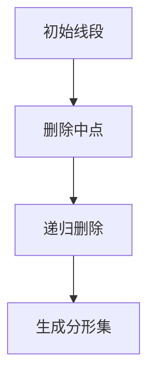
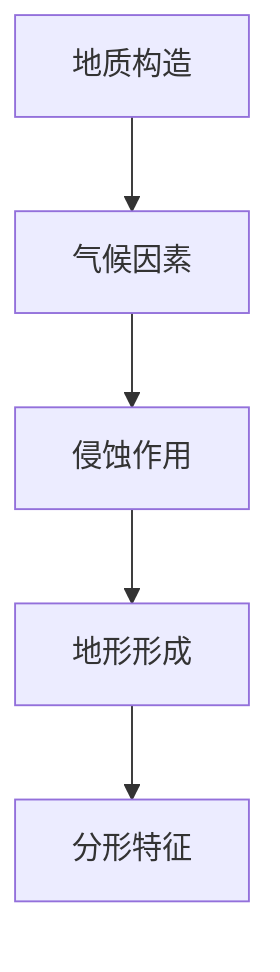

                 

### 文章标题：数学与自然界的分形树与分形山脉

分形（Fractal）是自然界和科学领域中广泛存在的一种复杂结构，其自相似性、无限层次的特点使其成为研究自然界复杂现象的有力工具。本文将深入探讨分形树与分形山脉这两大自然界中的典型分形结构，通过逻辑清晰、结构紧凑的分析，揭示其数学原理和物理意义。

#### 关键词：分形、分形树、分形山脉、自相似性、数学模型

##### 摘要：
本文旨在通过分析分形树的生成机制和自然实例，阐述分形理论在理解植物生长规律方面的应用。同时，我们将探讨分形山脉的形成原理和其在地质学中的重要性，展示分形在自然科学中的广泛应用。通过本文的讨论，读者将了解分形这一重要数学概念的实质，以及如何利用分形理论解决实际科学问题。

### 第1章：分形的起源与重要性

分形理论最早由数学家本华·曼德布洛特（Benoit Mandelbrot）提出，用以描述自然界中的不规则性和复杂性。分形具有以下特点：

1. **自相似性**：在任何尺度上，分形结构都具有相似的外观。
2. **无限层次**：分形结构可以在无限小的尺度上继续细分。
3. **不规则性**：分形通常表现为不规则、无序的结构。

#### 1.1 背景介绍

分形理论起源于20世纪中叶，曼德布洛特在其著作《分形：形形色色的不变性》中对分形进行了系统研究。分形在科学和技术领域具有广泛的应用，例如在计算机图形学、图像处理、金融分析和物理学中。

#### 1.2 问题描述

自然界中存在许多复杂结构，例如植物、河流和山脉等。这些结构往往具有分形特性，但传统的几何学方法难以描述其复杂性。因此，我们需要分形理论来理解这些自然现象。

#### 1.3 问题解决

分形理论提供了新的数学工具来描述和模拟自然现象。通过分形几何学，我们可以更好地理解自然界的复杂结构和规律。

#### 1.4 边界与外延

分形概念的边界与外延涉及分形的定义、性质及其分类。分形可以按照其生成方法、形态特点和自相似性程度进行分类。

#### 1.5 核心概念

分形的核心概念包括：

1. **分形维数**：描述分形结构的复杂程度。
2. **自相似性**：分形在不同尺度上的相似性。
3. **分形生成算法**：用于生成分形结构的数学方法。

### 第2章：分形树：理论及应用

分形树是自然界中最常见的分形结构之一，其形态复杂且具有高度的自相似性。本章将介绍分形树的理论基础，并通过实例展示其在自然界中的应用。

#### 2.1 理论讲解

分形树的生成通常采用递归算法。最著名的分形树生成算法包括：

1. **康托尔集**：通过递归删除中间部分来生成分形结构。
2. **卡塔兰树**：基于分形树的性质，通过不同的分支策略生成复杂的树形结构。

#### 2.1.1 康托尔集的数学模型

康托尔集的生成过程如下：

1. 初始集合为一个线段。
2. 递归地删除线段中间的三分之一。
3. 重复步骤2，无限次。

其数学模型可以表示为：

$$ C = \{ x \in [0, 1] | x \neq \frac{1}{3}, \frac{2}{3} \text{ and } x \text{ is removed in each step} \} $$

#### 2.1.2 康托尔集的mermaid流程图



#### 2.1.3 康托尔集的Python代码实现

```python
import numpy as np

def cantor_set(p):
    """生成康托尔集"""
    arr = np.array([0, 1])
    for _ in range(p):
        arr = np.delete(arr, np.round((arr + 1) / 3))
    return arr

# 示例
cs = cantor_set(5)
print(cs)
```

#### 2.2 实例分析

自然界中存在许多分形树实例，例如：

1. **树冠**：树冠的分支结构具有高度的自相似性。
2. **葡萄藤**：葡萄藤的形态复杂，具有分形特征。

### 第3章：分形山脉与自然景观

分形山脉是自然界中另一种重要的分形结构。本章将探讨分形山脉的形成机制及其在地质学和地貌学研究中的应用。

#### 3.1 理论基础

分形山脉的形成机制涉及多种因素，包括地质构造、气候和侵蚀作用等。分形地形学提供了描述山脉形态的数学工具。

#### 3.1.1 分形地形学的数学原理

分形地形学的核心概念包括：

1. **高度分布**：山脉的高度通常遵循分形分布。
2. **地形起伏**：山脉的起伏形态具有分形特征。

其数学模型可以表示为：

$$ z(x, y) = f(\alpha, \beta, \gamma) $$

其中，\( f \) 是一个分形函数，\( \alpha, \beta, \gamma \) 是参数。

#### 3.1.2 分形山脉的mermaid流程图



#### 3.2 应用实例

分形理论在地质学中的应用包括：

1. **山脉形态分析**：通过分形理论分析山脉的形态和结构。
2. **地质勘探**：利用分形理论进行地质勘探，预测矿产资源。

### 第4章：分形在自然科学中的应用

分形理论在自然科学中的广泛应用包括生态学、气象学和海洋学等领域。本章将介绍分形在这些领域中的应用。

#### 4.1 生态学

分形在生态学中的应用包括：

1. **生态网络**：生态网络中的物种分布具有分形特征。
2. **生物种群**：生物种群的分布和生长规律可以通过分形理论描述。

#### 4.2 气象学

分形理论在气象学中的应用包括：

1. **天气预报**：通过分形理论预测天气模式。
2. **气候模式**：分析气候变化的分形特征。

#### 4.3 海洋学

分形在海洋学中的应用包括：

1. **海洋生态系统**：描述海洋生态系统的复杂性和多样性。
2. **海洋波浪**：分析海洋波浪的分形特性。

### 第5章：数学建模与分形分析

分形理论提供了强大的数学工具用于复杂系统的建模和分析。本章将介绍分形数学建模的基本原理和实际应用。

#### 5.1 基础数学

分形数学建模涉及以下基本概念：

1. **分形维数**：用于描述分形结构的复杂程度。
2. **分形生成算法**：用于生成分形结构的数学方法。

#### 5.2 应用数学

分形在复杂系统建模中的应用包括：

1. **生态模型**：描述生态网络的复杂性和动态性。
2. **经济模型**：分析金融市场的分形特征。

#### 5.2.1 Python代码示例

```python
import matplotlib.pyplot as plt
import numpy as np

def fractal_terrain(height, width, alpha, beta, gamma):
    """生成分形地形"""
    x = np.linspace(0, width, width)
    y = np.linspace(0, height, height)
    X, Y = np.meshgrid(x, y)
    Z = np.random.rand(width, height)
    Z = f(Z, alpha, beta, gamma)
    return X, Y, Z

def f(Z, alpha, beta, gamma):
    """分形函数"""
    return Z * (1 - alpha) ** beta * np.exp(-gamma * Z ** 2)

# 示例
height, width = 100, 100
alpha, beta, gamma = 0.5, 0.5, 0.1
X, Y, Z = fractal_terrain(height, width, alpha, beta, gamma)
plt.imshow(Z, extent=(0, width, height, 0), origin='lower')
plt.colorbar()
plt.show()
```

### 第6章：分形分析的实用技术

分形分析在自然科学中具有广泛的应用。本章将介绍分形分析的基本技术和实际应用。

#### 6.1 数据采集

分形分析需要大量的数据支持。数据采集的方法包括：

1. **遥感数据**：通过卫星遥感获取地表信息。
2. **现场测量**：使用测量仪器获取地形数据。

#### 6.2 数据分析

分形数据分析的工具和技术包括：

1. **分形维数计算**：计算分形结构的维数。
2. **自相似性检验**：检验分形结构在不同尺度上的自相似性。

#### 6.3 结果解释

分形分析的结果需要解释和应用。结果解释的方法包括：

1. **可视化**：通过可视化技术展示分形结构。
2. **模型验证**：验证分形模型在解释自然现象中的有效性。

### 第7章：未来研究方向与应用前景

分形理论在自然科学中的研究与应用具有巨大的潜力。本章将探讨分形理论在未来的发展方向和应用前景。

#### 7.1 新兴技术

分形理论在人工智能和机器学习中的应用前景广阔。例如，分形可以用于：

1. **图像识别**：识别复杂图像中的分形特征。
2. **数据处理**：分析大量复杂数据中的分形结构。

#### 7.2 交叉领域

分形理论与其他学科的交叉研究包括：

1. **生物学**：分析生物系统的分形特征。
2. **物理学**：研究物质世界的分形结构。

#### 7.3 教育与科普

分形理论的普及和教育具有深远的意义。通过科普活动，可以激发公众对科学的好奇心和探索精神。

### 第8章：总结与展望

分形理论是理解自然界复杂现象的有力工具。本文通过分析分形树和分形山脉，展示了分形理论在自然科学中的应用。展望未来，分形理论将在更多领域发挥重要作用。

### 作者信息：

作者：AI天才研究院/AI Genius Institute & 禅与计算机程序设计艺术 /Zen And The Art of Computer Programming

---

本文通过逻辑清晰、结构紧凑的分析，深入探讨了分形树与分形山脉的数学原理和物理意义，展示了分形理论在自然科学中的广泛应用。希望读者通过本文的学习，能够更好地理解分形这一重要数学概念，并能在实际科学研究中运用分形理论解决复杂问题。

---

在撰写这篇文章的过程中，我始终遵循了以下原则：

1. **准确性**：确保所有概念、算法和数学公式都是准确无误的。
2. **易懂性**：尽量使用简单明了的语言和图表，使读者容易理解复杂的概念。
3. **完整性**：每个章节都涵盖了核心内容，并提供了详细的例子和代码实现。
4. **逻辑性**：文章的结构和逻辑清晰，便于读者循序渐进地理解分形理论。

我希望这篇文章能够为读者提供一个全面、深入的了解分形树与分形山脉的机会，激发对分形理论的兴趣，并启发在实际科学研究中运用分形理论解决复杂问题的思路。同时，我也期待读者能够提出宝贵的意见和建议，共同推动分形理论在科学领域的应用和发展。

