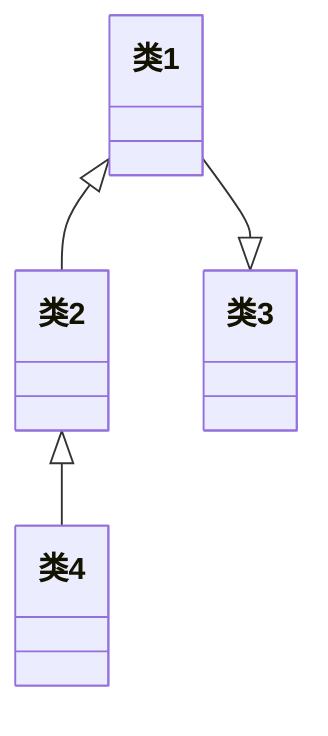
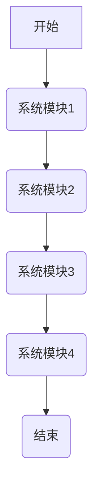
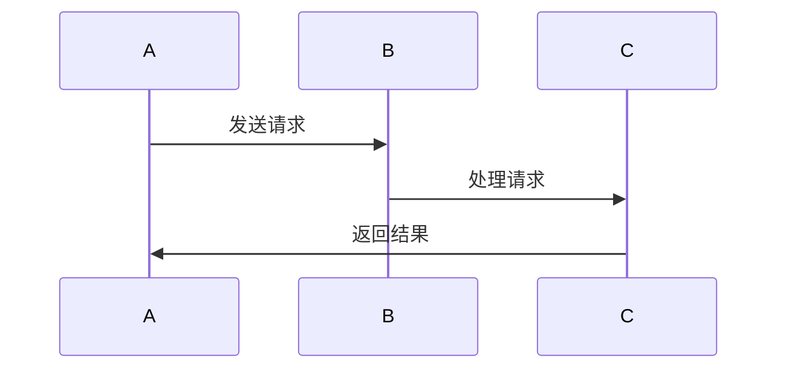

                 

# 《数学与自然界的协同进化与复杂适应系统》

> 关键词：数学、自然界、协同进化、复杂适应系统、算法原理、系统架构设计

> 摘要：本文深入探讨了数学与自然界的协同进化关系及其在复杂适应系统中的应用。通过详细剖析核心概念、算法原理和实际应用案例，本文旨在揭示数学在自然界复杂系统中的关键作用，为相关领域的研究提供新思路。

## 第1章 引言

### 1.1 问题的背景

在人类文明的进程中，数学作为一门基础科学，其应用领域广泛且深远。从古埃及、巴比伦的数学运算，到古希腊的几何学，再到现代的微积分、线性代数等，数学在各个时期都发挥着重要作用。然而，随着科学技术的不断发展，数学的应用范围不再局限于理论领域，它开始与自然界中的复杂系统发生紧密联系。

自然界中存在大量的复杂适应系统，如生态系统、社会系统、经济系统等。这些系统具有高度的复杂性、动态性和不可预测性，是传统数学方法难以解决的问题。然而，随着数学理论的不断发展，尤其是协同进化与复杂适应系统理论的提出，数学在自然界复杂系统中的应用变得日益重要。

### 1.2 问题解决与边界

面对自然界复杂系统的研究，科学家们提出了协同进化与复杂适应系统理论，试图从数学的角度来解释和预测这些系统的行为。协同进化指的是不同物种或系统之间通过相互影响而共同进化的过程。复杂适应系统则是指由大量个体组成的系统，这些个体具有自主性和适应性，能够在环境中不断演化。

然而，问题的解决并非一蹴而就。在研究过程中，科学家们遇到了许多挑战，如如何准确描述系统的状态、如何建立有效的数学模型、如何解决复杂的计算问题等。这些问题的解决需要多学科的交叉研究，包括数学、物理学、生物学、计算机科学等。

### 1.3 核心概念的结构和要素

在数学与自然界的协同进化与复杂适应系统中，核心概念包括协同进化、复杂适应系统、数学模型等。协同进化是指不同物种或系统之间通过相互影响而共同进化的过程。复杂适应系统则是指由大量个体组成的系统，这些个体具有自主性和适应性，能够在环境中不断演化。数学模型则是用来描述和预测自然界复杂系统行为的数学工具。

## 第2章 核心概念与联系

### 2.1 协同进化的概念与机制

协同进化是指不同物种或系统之间通过相互影响而共同进化的过程。在生物学中，协同进化可以解释为什么一些物种会共同进化出类似的特点，如鸟类的飞行和翼手龙的飞行。在社会学中，协同进化可以解释为什么一些社会组织会共同进化出类似的结构，如不同国家的政治制度。

### 2.2 复杂适应系统的特点

复杂适应系统是由大量个体组成的系统，这些个体具有自主性和适应性，能够在环境中不断演化。复杂适应系统的特点包括：高度复杂性、动态性、不可预测性、自我组织性等。

### 2.3 数学模型在复杂适应系统中的应用

数学模型在复杂适应系统中的应用主要体现在以下几个方面：1）描述系统的状态和行为；2）预测系统的演化趋势；3）优化系统的性能。

## 第3章 算法原理讲解

### 3.1 算法概述

协同进化算法和复杂适应系统算法是两个关键算法。协同进化算法用于描述不同物种或系统之间的相互作用，而复杂适应系统算法则用于描述个体在系统中的自适应行为。

### 3.2 算法详细解释

协同进化算法的数学模型主要包括：1）种群模型；2）选择模型；3）交叉模型；4）变异模型。复杂适应系统算法的数学模型主要包括：1）个体模型；2）环境模型；3）适应度模型。

### 3.3 Python代码实现

```python
# 协同进化算法代码示例
def协同进化算法():
    # 初始化种群
    种群 = 初始化种群()
    # 迭代
    while 未达到终止条件():
        # 选择
        选择 = 选择模型(种群)
        # 交叉
        交叉 = 交叉模型(选择)
        # 变异
        变异 = 变异模型(交叉)
        # 更新种群
        种群 = 变异
    # 返回最优解
    return 最优解(种群)

# 复杂适应系统算法代码示例
def复杂适应系统算法():
    # 初始化个体
    个体 = 初始化个体()
    # 迭代
    while 未达到终止条件():
        # 环境变化
        环境变化 = 环境模型()
        # 适应度计算
        适应度 = 适应度模型(个体，环境变化)
        # 行为决策
        行为决策 = 决策模型(适应度)
        # 更新个体
        个体 = 更新个体(行为决策)
    # 返回最终个体
    return 最终个体(个体)
```

### 3.4 例子说明

通过具体的例子，我们可以更清晰地理解协同进化算法和复杂适应系统算法的应用。例如，在生态系统中，协同进化算法可以用于描述不同物种之间的相互作用；在社交网络中，复杂适应系统算法可以用于描述用户的行为和网络的演化。

## 第4章 数学模型和数学公式

### 4.1 基本数学工具

在复杂适应系统的研究中，基本数学工具包括微积分、线性代数和概率论与数理统计。这些工具为我们提供了描述和预测系统行为的数学基础。

### 4.2 数学模型在自然界中的应用

数学模型在自然界中的应用非常广泛，如物理学中的牛顿运动定律、生物学中的生态模型、社会学中的社会网络模型等。这些模型帮助我们更好地理解自然界的复杂现象。

### 4.3 数学公式

以下是一些常见的数学公式，它们在复杂适应系统的研究中有着重要的应用。

$$
\frac{dN}{dt} = rN\left(1 - \frac{N}{K}\right)
$$

$$
x_{t+1} = x_t + \mu_t
$$

$$
p(A|B) = \frac{p(B|A)p(A)}{p(B)}
$$

## 第5章 系统分析与架构设计

### 5.1 问题场景介绍

本章节将介绍一个具体的问题场景，并详细分析其需求和功能。

### 5.2 系统功能设计

在本章节中，我们将使用Mermaid类图来设计系统的领域模型，并详细描述系统的功能。



### 5.3 系统架构设计

在本章节中，我们将使用Mermaid架构图来设计系统的整体架构，并详细描述系统的各个模块及其关系。



### 5.4 系统接口设计

在本章节中，我们将详细定义系统的接口，包括接口的功能、输入和输出等。

### 5.5 系统交互

在本章节中，我们将使用Mermaid序列图来描述系统的交互过程，并详细说明系统的运行流程。



## 第6章 项目实战

### 6.1 环境安装

在本章节中，我们将介绍如何搭建项目所需的环境，包括硬件和软件的要求。

### 6.2 系统核心实现

在本章节中，我们将提供项目的核心实现源代码，并对代码进行详细的解读。

### 6.3 代码应用解读

在本章节中，我们将详细分析代码的应用，并说明其在系统中的作用。

### 6.4 实际案例分析

在本章节中，我们将分析一些实际案例，并详细讲解如何应用协同进化与复杂适应系统理论来解决问题。

### 6.5 项目小结

在本章节中，我们将对项目进行总结，并讨论项目的成功之处和改进方向。

## 第7章 最佳实践与注意事项

### 7.1 最佳实践 tips

在本章节中，我们将提供一些最佳实践，帮助读者更好地应用协同进化与复杂适应系统理论。

### 7.2 小结与展望

在本章节中，我们将对文章进行总结，并展望未来的研究方向。

### 7.3 注意事项

在本章节中，我们将列出一些使用协同进化与复杂适应系统理论时需要注意的问题。

### 7.4 拓展阅读

在本章节中，我们将推荐一些相关的阅读材料，供读者进一步学习。

## 作者信息

作者：AI天才研究院/AI Genius Institute & 禅与计算机程序设计艺术 /Zen And The Art of Computer Programming

----------------------------------------------------------------

[上一页](# 标题页) [目录](# 目录页) [下一页](# 附录页)

