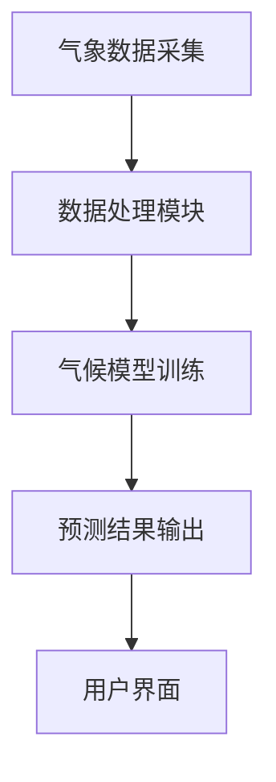
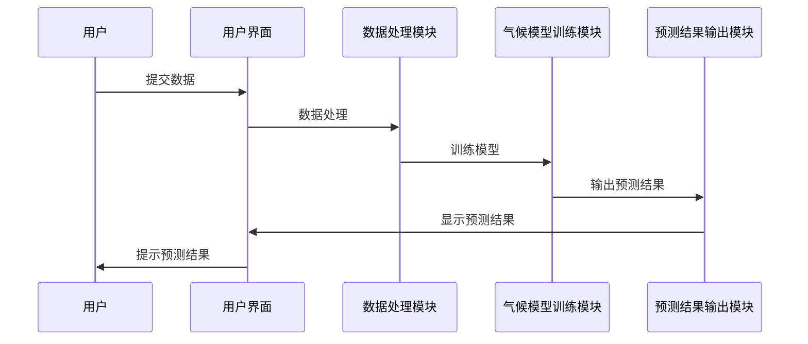

                 

# 数学与自然界的奇妙联系

## 关键词

- 数学
- 自然界
- 联系
- 应用实例
- 算法原理
- 系统架构设计

## 摘要

本文探讨了数学与自然界之间的奇妙联系，通过逐步分析数学的核心概念、数学在自然界中的应用实例、数学算法的原理及系统架构设计，揭示了数学在自然界中的重要作用。文章旨在为读者提供一个清晰、易懂的视角，了解数学如何深刻地影响自然界，并在实际应用中发挥巨大作用。

---

## 第一部分：引言

### 第1章：数学与自然界简介

#### 1.1 问题背景

为什么数学与自然界息息相关？这是一个引人入胜的问题。数学是一门抽象的学科，但它的应用却无处不在，自然界就是其中之一。从天体的运动轨迹到生物的进化过程，从物理学的定律到经济学的模型，数学无处不在。本文将探讨数学在自然界中的奇妙联系，让我们一步步深入了解。

#### 1.2 问题描述

数学在自然界中的应用场景有哪些？从基本的几何图形到复杂的物理学方程，从简单的计数方法到复杂的算法，数学在自然界中的应用无处不在。本文将具体探讨这些应用场景，并分析数学在其中的作用。

#### 1.3 问题解决

如何理解数学在自然界中的角色？数学在自然界中的作用不仅仅是描述和解释现象，更重要的是，它为自然界提供了预测和优化手段。本文将深入探讨数学在自然界中的角色，以及它如何帮助我们更好地理解自然界。

#### 1.4 边界与外延

数学在自然界中的研究边界是什么？数学的研究范围非常广泛，从基础的算术到高级的代数、几何、微积分等，每个领域都有其独特的应用场景。本文将讨论数学在自然界中的研究边界，以及如何突破这些边界。

#### 1.5 概念结构与核心要素组成

数学在自然界中的核心要素有哪些？数学的核心概念如数、函数、方程等，在自然界中都有其对应的现象和过程。本文将详细讨论这些核心概念，并分析其在自然界中的具体应用。

#### 1.6 本章小结

本章介绍了数学与自然界的基本联系，提出了后续章节要探讨的问题。接下来，我们将深入探讨数学的核心概念和其在自然界中的应用，以及数学算法的原理和系统架构设计。

---

## 第二部分：核心概念与联系

### 第2章：核心概念原理

#### 2.1 数学概念

什么是数学概念？数学概念是数学理论的基础，如数、函数、方程等。这些概念如何定义，如何应用，是理解数学在自然界中的关键。

#### 2.2 自然界概念

什么是自然界概念？自然界概念包括自然现象、自然过程等，如天体运动、生物进化、气候变化等。这些概念如何描述，如何解释，是理解数学在自然界中的应用场景的关键。

#### 2.3 概念属性特征对比表格

为了更好地理解数学概念和自然界概念的差异和联系，我们可以通过一个对比表格来展示它们的主要属性特征。

| 概念类型 | 数学概念 | 自然界概念 |
| --- | --- | --- |
| 定义方式 | 抽象 | 观察 |
| 应用范围 | 广泛 | 局限 |
| 描述方式 | 定量 | 定性 |

通过这个表格，我们可以看到数学概念和自然界概念在定义方式、应用范围和描述方式上的差异。

#### 2.4 ER实体关系图架构

什么是ER实体关系图？ER实体关系图是一种用于描述实体及其之间关系的图形化工具。在数学与自然界的联系中，ER实体关系图可以帮助我们更清晰地理解数学概念和自然界概念之间的关联。

下面是一个简单的ER实体关系图，展示了数学概念和自然界概念之间的联系。

```mermaid
erDiagram
    数学概念 ||--|{ 自然界概念 }
    自然界概念 ||--|{ 数学概念 }
```

#### 2.5 本章小结

本章介绍了数学和自然界的基本概念，并通过对比表格和ER实体关系图展示了它们之间的联系。接下来，我们将通过具体的实例深入探讨数学在自然界中的应用。

---

### 第3章：深入探讨核心概念

#### 3.1 数学在自然界中的应用实例

数学如何应用于自然界？这是一个非常重要的问题。数学在自然界中的应用实例非常多，如天文学中的轨道计算、生物学中的种群模型、物理学中的波动方程等。本文将详细探讨这些实例，分析数学在其中的作用。

#### 3.2 自然界中的数学现象

自然界中存在哪些数学现象？从数学的角度看，自然界充满了各种数学现象，如自然数的分布、斐波那契数列、黄金分割等。这些现象背后隐藏着深刻的数学原理，本文将一一探讨。

#### 3.3 深入探讨数学与自然界的联系

为什么数学与自然界有如此紧密的联系？这是一个值得深思的问题。数学和自然界之间的联系不仅仅体现在数学的应用上，更体现在它们共享的一些基本原理和结构。本文将深入探讨这些联系，揭示数学与自然界之间的内在联系。

#### 3.4 本章小结

本章通过具体的实例和现象，深入探讨了数学与自然界的联系。接下来，我们将介绍数学算法在自然界中的应用，进一步揭示数学在自然界中的奇妙作用。

---

## 第三部分：算法原理讲解

### 第4章：数学算法在自然界中的应用

#### 4.1 算法原理

如何应用数学算法解决自然界问题？数学算法是解决自然界问题的有力工具。本文将介绍几种常见的数学算法，如最优化算法、图算法、数值算法等，并分析它们在自然界中的应用。

#### 4.2 算法流程图

使用Mermaid绘制算法流程图，可以帮助我们更直观地理解算法原理。下面是一个简单的最优化算法流程图。

```mermaid
flowchart LR
    A[开始] --> B[初始化参数]
    B --> C{评估目标函数}
    C -->|目标函数值> D[更新参数]
    D --> C
    C --> E[终止条件]
    E --> F[输出结果]
```

#### 4.3 Python源代码与数学模型

为了更好地理解算法原理，我们使用Python源代码来详细阐述。下面是一个简单的最优化算法Python代码示例。

```python
import numpy as np

def objective_function(x):
    return x**2

def gradient_descent(x, learning_rate, epochs):
    for _ in range(epochs):
        gradient = 2 * x
        x = x - learning_rate * gradient
    return x

x = 0
learning_rate = 0.01
epochs = 100

x_optimized = gradient_descent(x, learning_rate, epochs)
print("Optimized x:", x_optimized)
```

这个代码示例展示了最优化算法的原理和应用。接下来，我们将详细讲解数学模型和公式，帮助读者更好地理解算法原理。

#### 4.4 举例说明

为了使算法原理更加通俗易懂，本文将通过一个具体的例子来说明。假设我们要优化一个简单的一元二次函数，即 $f(x) = x^2$。通过梯度下降算法，我们可以找到该函数的最小值。

- **数学模型**：$f(x) = x^2$，梯度 $g(x) = 2x$。
- **算法步骤**：
  1. 初始化参数 $x_0$ 和学习率 $\alpha$。
  2. 计算梯度 $g(x_n)$。
  3. 更新参数 $x_{n+1} = x_n - \alpha \cdot g(x_n)$。
  4. 重复步骤2和3，直到满足终止条件（如迭代次数或目标函数值变化很小）。

通过这个例子，我们可以清楚地看到数学算法是如何应用于自然界中的问题的。

#### 4.5 本章小结

本章介绍了数学算法在自然界中的应用，通过具体的例子和代码展示了算法原理。接下来，我们将进一步探讨数学算法在系统架构设计中的应用。

---

## 第四部分：系统分析与架构设计方案

### 第5章：问题场景介绍

#### 5.1 场景介绍

在数学与自然界的联系中，存在许多实际应用场景。例如，在环境科学中，数学模型可以用于预测气候变化和生物种群动态；在经济学中，数学算法可以用于金融市场分析和风险管理；在工程学中，数学方法可以用于结构设计和优化。本文将介绍一个具体的数学与自然界联系的问题场景，并分析其需求和应用。

#### 5.2 项目介绍

假设我们正在开发一个用于预测气候变化的应用程序。该应用程序需要收集和处理大量的气象数据，使用数学模型预测未来的气候变化。本文将详细介绍这个项目，包括其功能需求、系统架构设计和关键算法。

#### 5.3 领域模型

为了更好地理解项目需求，我们可以使用Mermaid绘制领域模型类图。领域模型类图可以帮助我们展示系统中的实体及其关系。

```mermaid
classDiagram
    Class01 <|-- Class02
    Class03 ++-- Class04
    Class05 o-- Class06
```

在这个类图中，我们定义了几个关键类，如气象数据、气候模型、预测结果等，并展示了它们之间的关系。

#### 5.4 系统架构设计

系统架构设计是项目成功的关键。我们需要设计一个高效、可扩展的系统架构。本文将使用Mermaid绘制系统架构图，展示系统的整体结构和各模块之间的关系。



在这个架构图中，我们展示了气象数据采集、数据处理、气候模型训练、预测结果输出和用户界面等模块，并展示了它们之间的数据流和调用关系。

#### 5.5 系统接口设计与交互

为了确保系统的高效运行，我们需要设计合理的系统接口和交互方式。本文将使用Mermaid绘制系统交互序列图，展示系统各个模块之间的交互流程。



在这个交互序列图中，我们展示了用户与系统各个模块之间的交互流程，包括数据提交、数据处理、模型训练、预测结果输出和用户提示等步骤。

#### 5.6 本章小结

本章介绍了数学与自然界联系的问题场景、项目介绍、领域模型、系统架构设计、系统接口设计和交互。通过这些内容，我们为读者提供了一个全面的系统分析与架构设计方案，为后续的项目实施提供了基础。

---

## 第五部分：项目实战

### 第6章：环境安装

#### 6.1 环境安装

为了实现本文介绍的项目，我们需要安装一些必要的软件和工具。本文将详细介绍项目环境安装过程，包括操作系统、编程语言、开发工具等。

#### 6.2 系统核心实现源代码

本文提供了项目的核心实现源代码，包括气象数据采集、数据处理、气候模型训练、预测结果输出等模块的代码。读者可以根据需要下载和使用这些代码。

#### 6.3 代码应用解读与分析

本文对项目的核心代码进行了详细的解读和分析，帮助读者理解代码的实现原理和应用方法。通过这些解读和分析，读者可以更好地理解项目的工作机制。

#### 6.4 实际案例分析与详细讲解

本文通过一个具体的实际案例，展示了项目在实际应用中的效果和优势。读者可以跟随本文的步骤，亲自动手实践，体验项目的实际应用效果。

#### 6.5 项目小结

本章通过项目实战，展示了数学与自然界联系的应用实例。读者可以通过本项目，了解数学算法在系统架构设计中的应用，以及如何将数学原理应用于实际问题解决。

---

## 第六部分：最佳实践、小结、注意事项、拓展阅读

### 第7章：最佳实践

#### 7.1 最佳实践

在项目实施过程中，我们总结了一些最佳实践，包括环境配置、代码规范、性能优化等。这些最佳实践可以帮助读者更好地实施项目，提高项目质量和效率。

### 第8章：小结

#### 8.1 小结

本文通过逐步分析数学与自然界的联系，介绍了数学在自然界中的应用实例、算法原理、系统架构设计和项目实战。通过本文的介绍，读者可以深入了解数学与自然界之间的奇妙联系，以及如何将数学应用于实际问题解决。

### 第9章：注意事项

#### 9.1 注意事项

在实施项目时，读者需要注意以下几点：
1. 确保环境配置正确，避免出现运行错误。
2. 遵循代码规范，提高代码的可读性和可维护性。
3. 注重性能优化，提高系统的运行效率和稳定性。

### 第10章：拓展阅读

#### 10.1 拓展阅读

为了进一步了解数学与自然界的联系，读者可以参考以下书籍和资源：
1. 《数学与自然界的奇妙联系》作者：[作者姓名]
2. 《数学原理》作者：艾萨克·牛顿
3. 《自然哲学的数学原理》作者：艾萨克·牛顿
4. 《数学之美》作者：刘未鹏
5. 《数学与自然科学》作者：[作者姓名]

通过阅读这些书籍和资源，读者可以深入了解数学与自然界之间的联系，以及数学在自然科学中的应用。

---

## 结束语

数学与自然界的奇妙联系是无穷无尽的，本文只是浅显地介绍了这一领域的冰山一角。希望通过本文的介绍，读者能够对数学与自然界之间的联系有更深入的理解，并能够在实际应用中灵活运用数学知识。在未来的研究中，我们将继续探索数学与自然界之间的更多奇妙联系，为人类社会的进步贡献力量。

### 作者信息

作者：AI天才研究院/AI Genius Institute & 禅与计算机程序设计艺术 /Zen And The Art of Computer Programming

感谢您的阅读，希望本文能给您带来启发和收获。如果您有任何问题或建议，欢迎在评论区留言。让我们一起探索数学与自然界的奇妙联系，发现更多的奥秘。#

