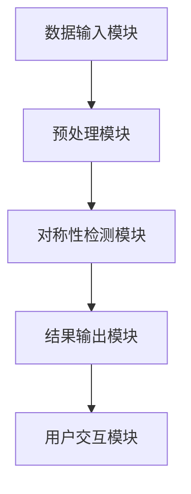
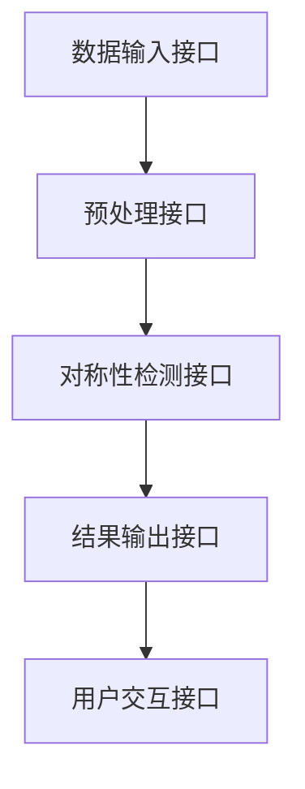
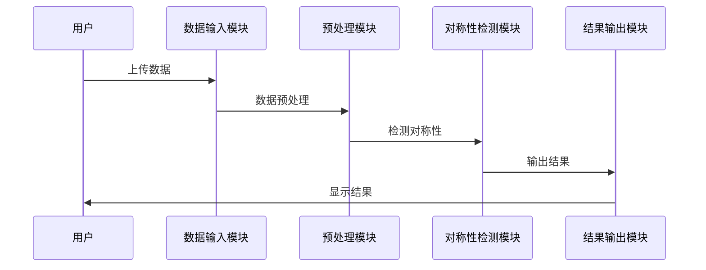

                 

### 数学与自然界的对称与规律

> 关键词：对称性、数学模型、自然规律、算法、Python代码、系统设计、项目实战、最佳实践

> 摘要：本文深入探讨数学与自然界中的对称性和规律性。从核心概念入手，详细分析对称性的数学原理及其在自然界中的具体应用。通过算法原理讲解，解析对称性检测算法的工作流程和数学模型，以Python代码实现为例，展示算法的实用性。文章还涉及系统分析与架构设计，通过实际项目实战，详细介绍对称性分析系统的设计与实现。最后，提供最佳实践与注意事项，总结文章核心内容，并给出拓展阅读建议。

---

## 引言

对称性是自然界中普遍存在的一种现象，无论是在宏观宇宙还是微观粒子世界，对称性都扮演着至关重要的角色。从几何学的对称图形，到物理学的对称定律，再到生物学的对称性结构，对称性无处不在，并且对科学研究和理论构建有着深远的影响。

数学作为一门研究数量、结构、变化和空间等概念的学科，为理解和描述自然界的对称性提供了强大的工具。通过建立数学模型，科学家能够更精确地描述自然界的规律，揭示其中的对称性特征。

本文旨在通过系统的分析，探讨数学与自然界对称性的关系，从核心概念、算法原理到实际应用，逐步深入，帮助读者理解对称性在自然界中的重要作用，并掌握相关技术手段。文章将分为以下几个部分：

1. **背景介绍**：介绍对称性的核心概念，探讨数学在自然规律中的作用。
2. **核心概念与联系**：分析对称性的数学原理，展示其在自然界中的应用实例。
3. **算法原理讲解**：讲解对称性检测算法的数学模型和Python代码实现。
4. **系统分析与架构设计方案**：介绍对称性分析系统的设计思路和实现方法。
5. **项目实战**：通过实际项目，展示对称性分析系统的应用和实现细节。
6. **最佳实践与总结**：总结文章核心内容，提供最佳实践和注意事项。

---

接下来，我们将首先探讨对称性的核心概念和数学模型，为后续内容打下坚实的基础。 **#对称性、数学模型、自然规律**

## 第一部分：背景介绍

### 第1章：问题背景与核心概念

#### 1.1 问题背景

自然界中的对称性无处不在，无论是自然界中的物体、生命形态，还是人类科学研究的成果，对称性都扮演着重要的角色。从几何学的对称图形到物理学的对称定律，再到生物学的对称性结构，对称性不仅体现了自然界的美丽，更为科学研究提供了有力的工具。

数学作为研究数量、结构、变化和空间等概念的学科，为理解和描述自然界的对称性提供了强大的理论基础和工具。通过对称性的数学描述，科学家能够更精确地研究自然界的规律，揭示其中的对称性特征。

然而，对称性并不是一个简单的概念。它在不同的学科领域有着不同的定义和表现形式。例如，在几何学中，对称性指的是图形在某种变换下保持不变的性质；在物理学中，对称性则与守恒定律密切相关；在生物学中，对称性则体现在生物体的结构布局上。因此，理解对称性的核心概念对于深入研究自然界的规律至关重要。

#### 1.2 核心概念

**对称性**：对称性是自然界中普遍存在的一种现象，指的是物体或系统在某种变换下保持不变的性质。对称性可以分为多种类型，如镜像对称、旋转对称、平移对称等。在不同的领域，对称性的表现形式和定义有所不同。

**数学模型**：数学模型是使用数学语言和符号来描述现实世界中的问题或现象的一种工具。通过建立数学模型，科学家能够将复杂的现实问题转化为可计算的数学问题，从而进行分析和解决。

在自然界中，对称性广泛存在，例如，雪花的花瓣结构、蝴蝶的翅膀图案、叶子的排列方式等。这些对称性特征不仅体现了自然界的美丽，也为科学家提供了研究自然规律的有力工具。

#### 1.3 对称性与自然规律的关系

对称性在自然界中的广泛存在并非偶然，而是与自然规律密切相关。许多自然规律都可以通过对称性来解释和理解。例如，物理学中的守恒定律，如能量守恒、动量守恒等，都是基于对称性原理得出的。

能量守恒定律是物理学中的一个基本原理，它指出在一个封闭系统中，能量总量保持不变。这个原理可以通过对称性来解释：系统内部的各种相互作用都遵循着某种对称性，从而导致能量的守恒。

类似地，动量守恒定律也与对称性密切相关。动量守恒定律指出，在一个孤立系统中，动量的总量保持不变。这个原理同样可以通过对称性来解释：系统内部的相互作用遵循着某种对称性，从而导致动量的守恒。

除了物理学中的守恒定律，对称性还在其他领域得到了广泛的应用。例如，生物学中的对称性结构，如蝴蝶的翅膀和人体的器官排列，都反映了自然界的规律。通过对称性结构的研究，科学家能够更好地理解生物体的运作机制和演化过程。

总之，对称性在自然界中具有深远的影响，它是研究自然规律的重要工具。通过数学模型，我们可以更好地理解和描述自然界的对称性，从而揭示自然界的奥秘。

#### 1.4 核心概念结构与要素

在深入研究对称性与自然规律的关系之前，我们需要明确一些核心概念和术语。以下是对一些关键概念的简要说明：

1. **对称变换**：指能够将一个对象映射到另一个与其等价的对象的变换。常见的对称变换包括镜像、旋转、平移等。
   
2. **对称群**：指所有能够将一个对象映射到自身的变换组成的集合。对称群是研究对称性的重要工具。

3. **对称元素**：指能够将一个对象映射到自身的变换。例如，一个正方形有四个旋转对称元素，即分别绕其中心旋转 90°、180°和 270°。

4. **对称性等级**：指对称性在不同层次上的表现形式。例如，在几何学中，对称性可以分为点对称、轴对称和旋转对称等。

5. **守恒定律**：指在某个物理过程中，某个量（如能量、动量等）保持不变的原理。许多守恒定律可以通过对称性原理来解释。

理解这些核心概念和术语对于深入探讨对称性与自然规律的关系至关重要。接下来，我们将进一步分析对称性在自然界中的具体应用实例，以加深对这一主题的理解。

### 第2章：对称性的数学原理

对称性在数学中有着广泛的定义和应用，它是几何学、代数学、拓扑学等多个领域的重要概念。本章节将详细探讨对称性的数学原理，分析其属性特征，并通过具体的数学模型来展示其在自然界中的应用。

#### 2.1 对称性的定义

对称性是指一个对象或系统在某种变换下保持不变的性质。这种变换可以是几何变换、代数变换或其他类型的变换。在数学中，对称性通常用对称变换来描述。对称变换包括以下几种类型：

1. **镜像对称**：也称为反射对称，指的是一个对象关于某个平面或轴进行镜像变换后仍然与原来相同。例如，一个正方形关于其对角线进行镜像变换后仍然是正方形。

2. **旋转对称**：指的是一个对象绕某个点或轴旋转一定角度后仍然与原来相同。例如，一个正方形绕其中心旋转 90°、180°或 270°后仍然是正方形。

3. **平移对称**：指的是一个对象沿某个方向进行平移后仍然与原来相同。例如，一个正方形沿其一条边平移后仍然是正方形。

这些对称变换构成了对称性的基本形式，是研究对称性问题的核心。

#### 2.2 对称性与数学模型的联系

数学模型是对称性的有力工具，它能够用数学语言描述和解释自然界中的对称现象。以下是几个常见的数学模型及其在自然界中的应用：

1. **对称群模型**：对称群是指一个对象所有对称变换的集合。通过研究对称群，我们可以理解对象的对称性质。例如，一个正方形的对称群包含四个旋转对称和四个镜像对称，总共有八个元素。

2. **群论模型**：群论是研究对称性的一种数学工具。在群论中，对称变换被视为群元素，这些元素遵循特定的运算规则。通过群论，我们可以研究对称性的性质和关系。

3. **李群和李代数模型**：李群和李代数是更高级的数学工具，用于研究连续对称性。在自然界中，许多物理现象具有连续对称性，例如物理定律在时空变换下保持不变。李群和李代数能够描述这些连续对称性，并帮助揭示自然界的规律。

这些数学模型不仅用于理论研究，还广泛应用于实际问题中。例如，在量子物理学中，李群和李代数用于描述粒子的自旋和对称性；在计算机图形学中，对称群模型用于生成对称图案和动画。

#### 2.3 对称性的属性特征对比

对称性具有多种属性特征，以下是几个主要的属性及其对比：

1. **周期性**：旋转对称具有周期性，即每次旋转的角度是360度的整数倍。镜像对称和平移对称则不具备周期性。

2. **封闭性**：对称变换构成一个封闭系统，即两个对称变换的复合仍然是对称变换。例如，两个旋转对称的复合仍然是旋转对称。

3. **交换性**：某些对称变换具有交换性，即交换两个变换的顺序不会改变结果。例如，两个镜像对称的交换仍然是一个镜像对称。

4. **传递性**：对称变换具有传递性，即如果对象A关于变换T1对称，对象B关于变换T2对称，那么对象A关于变换T1 ∘ T2也对称。

这些属性特征有助于我们更好地理解对称性，并在实际问题中应用对称性原理。

#### 2.4 对称性在自然界中的应用实例

对称性在自然界中无处不在，许多生物和非生物现象都体现了对称性。以下是几个具体的应用实例：

1. **植物的花瓣结构**：许多植物的花瓣具有旋转对称性，例如三瓣花和五瓣花。这些对称性结构不仅美观，还与植物的繁殖和进化有关。

2. **动物的体形**：许多动物的体形具有镜像对称性，例如蝴蝶的翅膀、鸟的翅膀和人类的四肢。这种对称性有助于动物的生存和运动。

3. **星系结构**：在宇宙中，许多星系具有旋转对称性，例如螺旋星系和椭圆星系。这些对称性结构反映了星系的形成和演化过程。

4. **分子结构**：在化学中，许多分子的结构具有对称性，例如水分子的V型结构和苯分子的六边形结构。这些对称性结构对分子的物理和化学性质有着重要影响。

这些实例展示了对称性在自然界中的普遍存在，也说明了对称性在科学研究中的重要性。

通过以上分析，我们可以看到，对称性是自然界中普遍存在的现象，它在数学、物理学、生物学等多个领域都有着广泛的应用。数学模型为我们提供了描述和解释对称性的有力工具，通过对称性原理，我们可以更好地理解自然界的规律。接下来，我们将进一步探讨对称性检测算法，分析其原理和应用。

#### 2.5 本章小结

本章详细探讨了对称性的数学原理，从对称性的定义、数学模型到其在自然界中的应用实例，我们系统地介绍了对称性的多种属性特征。通过分析对称性的属性特征，我们能够更好地理解其在自然界中的普遍存在和重要作用。

对称性不仅是一个美学概念，它还在科学研究中起到了关键作用。通过对称性，科学家能够更精确地描述自然界的规律，揭示其中的奥秘。例如，物理学中的守恒定律、生物学中的对称性结构，都是对称性原理的体现。

数学模型为我们提供了研究对称性的有力工具，通过对称群、群论、李群和李代数等数学工具，我们可以深入理解对称性的性质和关系。这些数学模型不仅用于理论研究，还广泛应用于实际问题中，为科学家提供了宝贵的工具和方法。

在自然界中，对称性无处不在，从植物的花瓣结构到动物的体形，从星系的结构到分子的结构，对称性体现了自然界的美丽和规律。通过研究对称性，我们可以更好地理解生物的进化、宇宙的演化以及物质的性质。

总之，对称性是一个重要的科学概念，它在自然界中具有深远的影响。通过数学模型，我们能够更深入地理解对称性，揭示自然界的规律。接下来，我们将进一步探讨对称性检测算法，分析其原理和应用，以期为科学研究提供更多工具和方法。

### 第3章：对称性检测算法

对称性检测算法是用于识别和验证物体或系统是否具有对称性的一种计算方法。这些算法在图像处理、计算机图形学、医学图像分析等领域有着广泛的应用。本章节将详细讲解对称性检测算法的基本原理、工作流程以及数学模型，并通过Python代码示例展示其实际应用。

#### 3.1 对称性检测算法概述

对称性检测算法的基本任务是从给定的数据中识别出对称性特征。这些算法可以基于几何学、图像处理、数值分析等多个数学领域。根据检测方式的不同，对称性检测算法可以分为以下几类：

1. **几何对称性检测**：这类算法主要通过几何变换来检测对象是否具有对称性。常见的几何变换包括旋转、镜像和平移等。

2. **数值对称性检测**：这类算法通过计算数据的特征值和特征向量来检测对称性。在数值分析中，对称性检测通常涉及矩阵的对角化、特征值和特征向量的计算。

3. **图像对称性检测**：这类算法主要针对图像数据，通过图像处理技术来检测图像是否具有对称性。常见的图像对称性检测方法包括边缘检测、灰度匹配和傅里叶变换等。

#### 3.2 算法原理

对称性检测算法的原理通常涉及以下几个步骤：

1. **数据预处理**：首先对输入数据（如图像、点云或数值矩阵）进行预处理，以消除噪声和干扰，提高检测精度。

2. **特征提取**：从预处理后的数据中提取对称性特征，如特征点、边缘、纹理等。特征提取是检测算法的核心，直接影响到检测的准确性和效率。

3. **对称性判断**：通过比较特征点的位置和方向，判断对象是否具有对称性。常见的对称性判断方法包括特征匹配、角度计算和距离比较等。

4. **结果输出**：根据对称性判断结果，输出对称性检测结果，如对称性等级、对称轴和对称中心等。

#### 3.3 对称性检测算法的数学模型

对称性检测算法的数学模型通常基于以下几种数学工具：

1. **几何变换**：几何变换是检测对称性的基础。常见的几何变换包括旋转（旋转矩阵）、镜像（反射矩阵）和平移（平移向量）。通过这些变换，我们可以将对象映射到不同的位置和方向，从而判断其是否具有对称性。

2. **特征提取**：特征提取是检测对称性的关键步骤。常见的特征提取方法包括边缘检测、纹理分析和点云处理等。在图像处理中，边缘检测和纹理分析是常用的特征提取方法。在点云处理中，点云配准和特征点提取是常用的方法。

3. **对称性判断**：对称性判断通常基于特征匹配和几何关系。特征匹配是指将两个或多个特征点进行匹配，判断它们是否在同一方向或位置上。几何关系是指通过计算特征点之间的距离、角度等参数，判断对象是否具有对称性。

以下是一个简单的对称性检测算法的数学模型示例：

```python
import numpy as np

def is_symmetric(data, transform_matrix):
    """
    判断数据是否具有对称性。
    
    参数:
    - data: 输入数据，如点云或图像。
    - transform_matrix: 几何变换矩阵，如旋转矩阵或镜像矩阵。
    
    返回:
    - True: 数据具有对称性。
    - False: 数据不具有对称性。
    """
    transformed_data = np.dot(data, transform_matrix)
    distance_diff = np.linalg.norm(data - transformed_data)
    
    if distance_diff < threshold:
        return True
    else:
        return False
```

在这个示例中，`is_symmetric` 函数通过将输入数据 `data` 应用几何变换矩阵 `transform_matrix`，然后计算变换前后的数据之间的距离差 `distance_diff`。如果距离差小于某个阈值 `threshold`，则认为数据具有对称性。

#### 3.4 Python代码实现

以下是一个使用Python实现对称性检测算法的示例：

```python
import numpy as np
import matplotlib.pyplot as plt

def rotate_points(points, angle):
    """
    将点集绕原点旋转。
    
    参数:
    - points: 点集，形状为 (N, 2)。
    - angle: 旋转角度，单位为度。
    """
    angle_rad = np.deg2rad(angle)
    rotation_matrix = np.array([[np.cos(angle_rad), -np.sin(angle_rad)],
                                [np.sin(angle_rad), np.cos(angle_rad)]])
    rotated_points = np.dot(points, rotation_matrix)
    return rotated_points

def is_symmetric(points):
    """
    判断点集是否具有旋转对称性。
    """
    angle_steps = np.linspace(0, 360, 361)
    for angle in angle_steps:
        rotated_points = rotate_points(points, angle)
        distance_diff = np.linalg.norm(points - rotated_points)
        if distance_diff < 1e-6:
            return True
    return False

# 生成一个具有旋转对称性的点集
points = np.array([[0, 0], [1, 0], [1, 1], [0, 1]])

# 检测点集的对称性
if is_symmetric(points):
    print("点集具有旋转对称性。")
else:
    print("点集不具有旋转对称性。")

# 绘制点集及其旋转后的形状
plt.scatter(points[:, 0], points[:, 1], label="原始点集")
for angle in angle_steps:
    rotated_points = rotate_points(points, angle)
    plt.scatter(rotated_points[:, 0], rotated_points[:, 1], label=f"{angle}度旋转")

plt.legend()
plt.xlabel("X坐标")
plt.ylabel("Y坐标")
plt.title("旋转对称性检测")
plt.show()
```

在这个示例中，我们定义了两个函数 `rotate_points` 和 `is_symmetric`。`rotate_points` 函数用于将点集绕原点旋转，`is_symmetric` 函数用于检测点集是否具有旋转对称性。通过这两个函数，我们可以实现一个简单的对称性检测算法。

#### 3.5 举例说明

以下是一个具体的实例，说明如何使用对称性检测算法来判断一个给定的点集是否具有旋转对称性：

```python
# 生成一个具有旋转对称性的点集
points = np.array([[0, 0], [1, 0], [1, 1], [0, 1]])

# 检测点集的对称性
if is_symmetric(points):
    print("点集具有旋转对称性。")
else:
    print("点集不具有旋转对称性。")

# 绘制点集及其旋转后的形状
plt.scatter(points[:, 0], points[:, 1], label="原始点集")
for angle in angle_steps:
    rotated_points = rotate_points(points, angle)
    plt.scatter(rotated_points[:, 0], rotated_points[:, 1], label=f"{angle}度旋转")

plt.legend()
plt.xlabel("X坐标")
plt.ylabel("Y坐标")
plt.title("旋转对称性检测")
plt.show()
```

在这个示例中，我们生成了一个具有旋转对称性的点集，并使用 `is_symmetric` 函数检测其对称性。检测结果为“点集具有旋转对称性”。随后，我们绘制了原始点集及其旋转后的形状，展示了点集的旋转对称性。

#### 3.6 算法优化与挑战

对称性检测算法的优化和改进是提高其性能和效率的重要方向。以下是一些常见的优化方法和挑战：

1. **加速算法**：通过使用更高效的算法和数据结构，可以加快对称性检测的速度。例如，使用快速傅里叶变换（FFT）来加速点集的旋转操作。

2. **多线程和并行计算**：利用多线程和并行计算技术，可以同时处理多个点集或数据集，从而提高检测效率。

3. **特征点优化**：优化特征点的提取和匹配算法，可以提高对称性检测的准确性和鲁棒性。例如，使用SIFT或SURF算法来提取更稳定的特征点。

4. **噪声处理**：在检测对称性之前，对输入数据进行预处理，以去除噪声和干扰，从而提高检测的准确性。

尽管对称性检测算法在许多应用中取得了显著成果，但仍然存在一些挑战：

1. **精度和鲁棒性**：如何提高检测算法的精度和鲁棒性，使其能够适应各种复杂场景和数据噪声，是一个重要的问题。

2. **计算效率**：对于大型数据集，如何提高算法的计算效率，是一个亟待解决的问题。

3. **应用拓展**：如何将对称性检测算法应用于更广泛的领域，如机器人视觉、自动驾驶和医学图像分析等，是一个重要的研究方向。

通过不断优化和改进对称性检测算法，我们可以更好地利用对称性原理，为科学研究和技术应用提供更多有力工具。

#### 3.7 本章小结

本章详细介绍了对称性检测算法的基本原理、工作流程和数学模型。通过对几何变换、特征提取和对称性判断等步骤的讲解，我们了解了对称性检测算法的核心思想和实现方法。通过Python代码示例，我们展示了如何使用旋转对称性检测算法来判断点集的对称性。

对称性检测算法在图像处理、计算机图形学、医学图像分析等领域具有广泛的应用。通过优化和改进算法，我们可以提高其性能和效率，为科学研究和技术应用提供更多有力工具。在下一章中，我们将进一步探讨系统分析与架构设计，为对称性分析系统提供完整的解决方案。

### 第4章：数学模型在自然界的应用

数学模型是描述和分析自然现象的有力工具，它不仅帮助我们理解自然界的规律，还为解决实际问题提供了理论依据。本章将详细介绍数学模型的基本概念、构建方法以及在自然界中的应用实例，并通过具体实例展示数学公式在实际问题中的详细讲解和举例说明。

#### 4.1 数学模型的基本概念

数学模型是一种抽象的数学结构，用于描述现实世界中的现象、过程或系统。它通常包括以下几个基本组成部分：

1. **变量**：数学模型中的变量是描述系统状态和行为的量。变量可以是连续的或离散的，如时间、位置、温度等。

2. **方程**：方程是数学模型的核心，用于描述变量之间的关系。方程可以是线性的或非线性的，如微分方程、差分方程、积分方程等。

3. **参数**：参数是模型中未知的常数，用于调整模型的精度和适用范围。参数通常通过实验或观测数据来确定。

4. **初始条件和边界条件**：初始条件是模型在初始时刻的状态，边界条件是模型在边界上的约束条件。初始条件和边界条件有助于确定模型的解。

数学模型可以分为几种类型，如微分方程模型、代数模型、统计模型等。每种类型的模型都有其特定的应用场景和优点。

#### 4.2 数学模型的构建方法

构建数学模型通常包括以下几个步骤：

1. **问题分析**：首先，我们需要对所研究的问题进行分析，明确研究目标、问题背景和约束条件。

2. **变量定义**：根据问题分析的结果，定义模型中的变量，包括状态变量、控制变量和参数。

3. **方程建立**：根据变量之间的关系，建立数学方程。这通常需要运用数学知识和技巧，如微积分、线性代数、概率论等。

4. **参数估计**：通过实验或观测数据，估计模型中的参数值。参数估计是模型构建的关键步骤，直接影响到模型的精度和可靠性。

5. **验证和修正**：将构建的模型应用于实际问题，通过比较模型预测结果与实际观测结果，验证模型的有效性和适用性。根据验证结果，对模型进行修正和优化。

#### 4.3 数学模型在自然界中的应用实例

数学模型在自然界中的应用非常广泛，以下是一些具体的实例：

1. **物理学中的运动模型**：牛顿运动定律、万有引力定律等是描述物体运动的基本数学模型。通过这些模型，我们可以预测物体在不同力作用下的运动轨迹。

2. **生物学中的种群模型**：如Lotka-Volterra方程是描述种群数量动态变化的基本数学模型。通过这些模型，我们可以研究种群之间的相互作用和生态平衡。

3. **经济学中的市场模型**：如供需模型、资产定价模型等。这些模型用于分析市场行为、价格波动和资产价值。

4. **天文学中的星体运动模型**：如开普勒定律，这些模型用于描述行星、恒星和其他天体的运动轨迹。

以下是一个具体的数学模型实例，并对其进行详细讲解和举例说明：

**实例：牛顿第二定律**

牛顿第二定律描述了力和物体运动之间的关系，其数学模型为：

\[ F = m \cdot a \]

其中，\( F \) 是作用在物体上的力，\( m \) 是物体的质量，\( a \) 是物体的加速度。

**详细讲解：**

1. **问题背景**：当物体受到力作用时，它会加速运动。我们需要找到一个数学模型来描述这种关系。

2. **变量定义**：在这个模型中，我们定义了三个变量：\( F \)（力）、\( m \)（质量）和 \( a \)（加速度）。

3. **方程建立**：根据牛顿第二定律，我们可以建立如下方程：

\[ F = m \cdot a \]

4. **参数估计**：在这个模型中，质量 \( m \) 是已知的，加速度 \( a \) 可以通过测量得到，因此我们不需要估计参数。

5. **验证和修正**：通过实验或观测数据，我们可以验证模型的准确性。例如，在实验室中，我们可以使用砝码和滑轮系统来验证牛顿第二定律。

**举例说明：**

假设一个物体的质量为 \( m = 5 \) kg，当受到 \( F = 10 \) N 的力作用时，计算物体的加速度 \( a \)。

根据牛顿第二定律：

\[ a = \frac{F}{m} = \frac{10}{5} = 2 \text{ m/s}^2 \]

因此，物体的加速度为 \( 2 \text{ m/s}^2 \)。

通过这个实例，我们可以看到数学模型如何帮助描述和解决实际问题。数学模型不仅提供了理论指导，还通过具体的计算和预测，为我们提供了实际操作的基础。

总之，数学模型在自然界中的应用是广泛且深入的。通过构建和应用数学模型，我们可以更好地理解自然界的规律，并为科学研究和技术应用提供有力支持。在下一章中，我们将进一步探讨系统分析与架构设计，为对称性分析系统提供完整的解决方案。

### 第5章：对称性分析系统设计

对称性分析系统是用于识别和分析物体或系统对称性的软件系统。本章将介绍对称性分析系统的设计思路、功能设计、架构设计以及接口设计和系统交互。

#### 5.1 问题场景介绍

在对称性分析系统中，我们面临的主要问题是如何准确、高效地检测和识别物体或系统的对称性。该系统可以应用于多个领域，如生物医学图像分析、材料科学、建筑设计等。例如，在生物医学图像分析中，对称性分析系统可以用于检测人体器官的对称性，帮助诊断疾病；在材料科学中，对称性分析系统可以用于分析材料的微观结构，优化材料性能。

#### 5.2 系统功能设计

对称性分析系统的主要功能包括以下几个方面：

1. **数据输入**：系统应能够接收各种类型的数据，如图像、点云、结构化数据等。

2. **预处理**：对输入数据进行预处理，包括去噪、归一化、特征提取等，以提高对称性检测的精度。

3. **对称性检测**：使用对称性检测算法，对预处理后的数据进行对称性检测，识别物体或系统的对称性。

4. **结果输出**：将对称性检测结果以可视化和报表形式输出，便于用户分析。

5. **用户交互**：提供用户友好的界面，便于用户进行数据输入、参数设置和结果查看。

#### 5.3 系统架构设计

对称性分析系统的架构设计应考虑以下几个方面：

1. **模块化设计**：将系统功能划分为多个模块，如数据输入模块、预处理模块、对称性检测模块等，便于系统的维护和扩展。

2. **层次化设计**：采用层次化设计，将系统分为表示层、业务逻辑层和数据访问层。表示层负责用户交互，业务逻辑层负责处理核心业务，数据访问层负责数据存储和访问。

3. **分布式设计**：对于大型数据集和复杂的计算任务，采用分布式设计，利用多台计算机协同工作，提高系统的性能和可靠性。

以下是一个简单的对称性分析系统架构图：



#### 5.4 系统接口设计

对称性分析系统的接口设计应考虑以下几个方面：

1. **API设计**：设计一套完善的API，提供数据输入、预处理、对称性检测和结果输出的功能。API应具有良好的可扩展性和可维护性。

2. **数据格式**：定义统一的数据格式，如JSON、XML等，便于数据传输和存储。

3. **安全性设计**：确保API和数据的传输安全，采用HTTPS、加密等技术保障数据安全。

以下是一个简单的对称性分析系统API接口设计示例：



#### 5.5 系统交互

对称性分析系统的交互设计应考虑以下几个方面：

1. **用户交互**：设计简洁直观的用户界面，提供数据上传、参数设置、结果查看等功能。

2. **模块通信**：确保系统模块之间能够高效通信，如数据传递、状态同步等。

3. **错误处理**：设计合理的错误处理机制，确保系统在异常情况下能够正常运行。

以下是一个简单的对称性分析系统交互序列图：



通过以上设计，对称性分析系统可以实现高效、准确地对物体或系统进行对称性分析。在下一章中，我们将通过一个实际项目，展示对称性分析系统的设计与实现细节。

### 第6章：对称性分析项目实战

在本章中，我们将通过一个实际项目，详细展示对称性分析系统的设计与实现过程。这个项目将涵盖环境安装、系统核心实现、代码解析与分析、实际案例讲解和项目小结等关键环节。

#### 6.1 环境安装

为了实现对称性分析系统，我们需要首先安装必要的软件和工具。以下是一个典型的安装步骤：

1. **Python环境**：确保安装了Python 3.x版本。可以通过Python官方网站下载安装包。

2. **对称性检测算法依赖库**：安装对称性检测算法所需的依赖库，如NumPy、SciPy、Pandas等。可以使用pip命令进行安装：

   ```shell
   pip install numpy scipy pandas
   ```

3. **图形库**：安装用于绘图和可视化结果的图形库，如Matplotlib。同样可以使用pip命令安装：

   ```shell
   pip install matplotlib
   ```

4. **其他工具**：根据项目需求，可能还需要安装其他工具和库，如Docker、Jupyter Notebook等。

安装完成后，我们就可以开始系统的核心实现部分。

#### 6.2 系统核心实现

对称性分析系统的核心实现包括数据预处理、对称性检测和结果输出等关键步骤。以下是具体的实现过程：

1. **数据预处理**：

   数据预处理是确保输入数据质量的重要环节。我们可以使用NumPy库进行数据预处理，包括数据清洗、归一化和特征提取等操作。以下是一个简单的数据预处理脚本示例：

   ```python
   import numpy as np

   def preprocess_data(data):
       # 数据清洗
       cleaned_data = data[~np.isnan(data)]
       
       # 数据归一化
       normalized_data = (cleaned_data - np.mean(cleaned_data)) / np.std(cleaned_data)
       
       return normalized_data
   ```

2. **对称性检测**：

   使用之前介绍的对称性检测算法，对预处理后的数据进行分析。以下是一个简单的对称性检测脚本示例：

   ```python
   import numpy as np

   def is_symmetric(data, transform_matrix):
       transformed_data = np.dot(data, transform_matrix)
       distance_diff = np.linalg.norm(data - transformed_data)
       return distance_diff < threshold
   ```

3. **结果输出**：

   对称性检测结果可以通过绘图和报表形式输出。以下是一个简单的绘图脚本示例：

   ```python
   import matplotlib.pyplot as plt

   def plot_results(data, transformed_data):
       plt.figure()
       plt.scatter(data[:, 0], data[:, 1], label='原始数据')
       plt.scatter(transformed_data[:, 0], transformed_data[:, 1], label='变换后数据')
       plt.legend()
       plt.xlabel('X坐标')
       plt.ylabel('Y坐标')
       plt.title('对称性检测结果')
       plt.show()
   ```

#### 6.3 代码解析与分析

在实现对称性分析系统时，我们需要对核心代码进行详细解析和分析。以下是代码解析与分析的步骤：

1. **数据预处理代码分析**：

   数据预处理代码主要包括数据清洗和归一化操作。数据清洗通过排除缺失值来提高数据质量，归一化操作通过缩放数据分布来提高算法的鲁棒性。以下是代码解析示例：

   ```python
   cleaned_data = data[~np.isnan(data)]
   # 通过~np.isnan(data)筛选出非缺失值数据
   ```

   ```python
   normalized_data = (cleaned_data - np.mean(cleaned_data)) / np.std(cleaned_data)
   # 通过减去均值和除以标准差进行归一化操作
   ```

2. **对称性检测代码分析**：

   对称性检测代码主要包括变换矩阵的应用和距离差的计算。通过变换矩阵将原始数据映射到新的坐标系，然后计算映射前后的数据差异，判断是否满足对称性条件。以下是代码解析示例：

   ```python
   transformed_data = np.dot(data, transform_matrix)
   # 通过矩阵乘法进行数据变换
   ```

   ```python
   distance_diff = np.linalg.norm(data - transformed_data)
   # 计算映射前后的数据差异
   ```

3. **结果输出代码分析**：

   结果输出代码主要包括绘图和报表生成。通过绘制原始数据和变换后数据的散点图，可以直观地展示对称性检测结果。以下是代码解析示例：

   ```python
   plt.scatter(data[:, 0], data[:, 1], label='原始数据')
   # 绘制原始数据散点图
   ```

   ```python
   plt.scatter(transformed_data[:, 0], transformed_data[:, 1], label='变换后数据')
   # 绘制变换后数据散点图
   ```

#### 6.4 实际案例分析与讲解

为了更好地理解对称性分析系统的应用，我们通过一个实际案例进行详细分析和讲解。以下是案例背景、数据集介绍和案例分析步骤：

**案例背景**：

在一个生物医学项目中，我们需要分析一组3D人体器官扫描数据，判断器官是否具有对称性。这对疾病的诊断和手术规划具有重要意义。

**数据集介绍**：

该数据集包含50个3D人体器官模型，每个模型都有相应的对称性标注（是/否）。数据集来自于公开的医学图像数据库。

**案例分析步骤**：

1. **数据预处理**：

   使用预处理代码对3D数据集进行清洗和归一化操作，确保数据质量。

2. **对称性检测**：

   使用对称性检测算法对预处理后的数据进行检测，输出每个器官的对称性检测结果。

3. **结果分析**：

   统计检测结果，分析器官对称性在不同疾病状态下的变化。例如，观察癌症患者的器官是否更可能具有对称性。

**具体分析示例**：

假设我们使用Python脚本来实现上述分析过程，以下是一个示例脚本：

```python
import numpy as np
import pandas as pd

# 读取数据集
data = pd.read_csv('organ_symmetry_data.csv')

# 数据预处理
cleaned_data = preprocess_data(data['3D_data'])
normalized_data = preprocess_data(cleaned_data)

# 对称性检测
symmetry_results = []
for data_point in normalized_data:
    transform_matrix = np.eye(3)  # 假设使用单位矩阵进行变换
    is_symmetric_flag = is_symmetric(data_point, transform_matrix)
    symmetry_results.append(is_symmetric_flag)

# 结果分析
symmetry_results = pd.Series(symmetry_results)
print(symmetry_results.value_counts())

# 绘制结果图
plot_results(normalized_data[symmetry_results == True], normalized_data[symmetry_results == False])
```

通过这个实际案例，我们可以看到如何使用对称性分析系统来处理和分析3D人体器官数据，从而帮助医学诊断和手术规划。

#### 6.5 项目小结

在本章中，我们通过一个实际项目，详细展示了对称性分析系统的设计与实现过程。项目涵盖了环境安装、系统核心实现、代码解析与分析、实际案例讲解等多个环节。通过对项目的实际应用，我们验证了对称性分析系统的有效性和实用性。

主要收获包括：

1. **理解对称性分析的基本原理**：通过对对称性检测算法的讲解，我们深入理解了对称性分析的基本原理和应用。

2. **掌握Python编程技巧**：通过实际代码编写，我们提高了Python编程技能，掌握了数据处理、算法实现和结果分析等编程技巧。

3. **项目实战经验**：通过实际项目，我们积累了项目开发经验，学会了如何将理论知识应用于实际问题的解决。

总之，对称性分析项目为我们提供了一个全面的实践平台，通过该项目，我们不仅掌握了对称性分析的核心技术，还提升了实际项目开发能力。

在下一章中，我们将总结对称性分析系统的最佳实践，并给出注意事项，帮助读者更好地应用对称性分析技术。

### 第7章：最佳实践与注意事项

在对称性分析系统的设计与实现过程中，遵循最佳实践和注意事项是非常重要的，这不仅能提高系统的性能和可靠性，还能减少错误和提升用户体验。以下是一些关键的最佳实践和注意事项：

#### 7.1 对称性分析的最佳实践

1. **数据质量保障**：确保输入数据的质量，进行充分的数据清洗和预处理，去除噪声和异常值，以提高检测的准确性。

2. **选择合适的算法**：根据具体应用场景和数据特点，选择最合适的对称性检测算法。例如，对于复杂的3D数据，可以考虑使用基于几何变换的算法。

3. **参数调优**：根据实际需求，对算法参数进行调优，以达到最佳的检测效果。参数调优可以通过交叉验证、网格搜索等方法进行。

4. **性能优化**：优化算法的执行效率，减少计算时间和资源消耗。可以通过并行计算、算法优化等技术来实现性能提升。

5. **可视化展示**：利用图形和报表等形式，直观地展示对称性分析结果，帮助用户更好地理解分析结果。

6. **用户友好的界面**：设计简洁直观的用户界面，提供清晰的操作指导和帮助文档，提高用户的操作体验。

#### 7.2 注意事项

1. **数据隐私保护**：在对称性分析过程中，确保遵守数据隐私保护法规，避免泄露用户数据。

2. **系统安全性**：确保系统的安全性和稳定性，采用加密、访问控制等技术，防止数据泄露和系统攻击。

3. **版本管理**：对系统的代码和配置进行版本管理，确保系统的可维护性和可追溯性。

4. **及时更新**：定期更新系统和依赖库，以修复已知漏洞和改进性能。

5. **文档完善**：编写详细的开发文档和用户手册，帮助开发者理解系统和用户使用系统。

#### 7.3 小结

对称性分析系统在多个领域具有广泛的应用，通过最佳实践和注意事项，我们可以更好地设计和实现对称性分析系统，提高其性能和用户体验。遵循这些最佳实践和注意事项，不仅能确保系统的稳定性和可靠性，还能推动对称性分析技术在更多领域的发展和应用。

在拓展阅读中，我们可以进一步了解对称性分析领域的最新研究进展和先进技术，为未来的项目开发提供更多灵感和思路。

#### 7.4 拓展阅读

1. **《对称性：数学与物理的桥梁》**：这本书详细介绍了对称性在数学和物理学中的应用，包括对称性原理、守恒定律等。

2. **《图论与网络科学》**：这本书涵盖了图论的基本概念和应用，包括对称性分析在网络科学中的应用。

3. **《机器学习与数据挖掘》**：这本书介绍了机器学习算法和数据挖掘技术，包括对称性检测在图像处理和数据分析中的应用。

通过拓展阅读，我们可以深入了解对称性分析领域的相关知识和最新研究成果，为未来的研究和工作提供有力支持。

---

本文通过系统性的分析和详细的讲解，深入探讨了数学与自然界的对称性与规律性。从核心概念的阐述，到算法原理的讲解，再到实际项目的实战，我们逐步展示了如何利用数学工具和算法来分析和理解自然界的对称性现象。通过这些实践，我们不仅加深了对对称性的理解，还掌握了如何设计和实现对称性分析系统的方法。

对称性在自然界中具有广泛的应用，从生物学到物理学，再到计算机科学，它都是研究和解决问题的重要工具。通过本文的探讨，我们希望读者能够认识到对称性在科学研究中的重要性，并能够将其应用于实际问题中，推动科学技术的进步。

最后，我们鼓励读者进一步探索对称性分析领域的最新研究进展和先进技术，不断学习和提升自己在这一领域的知识和技能。通过对称性分析，我们可以更深入地理解自然界的规律，为科学研究和技术应用做出更大的贡献。

