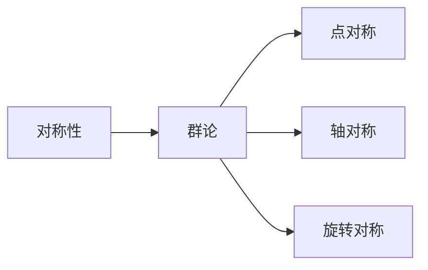
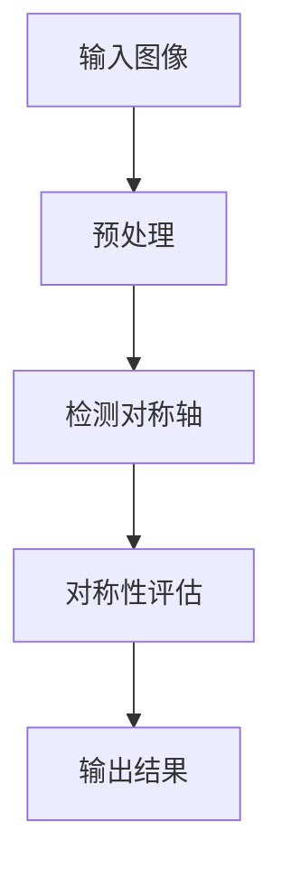
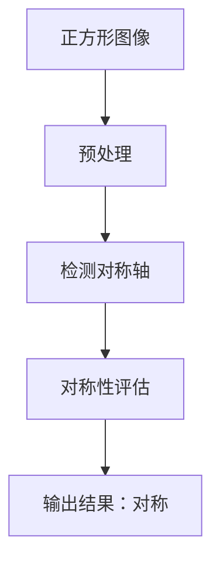
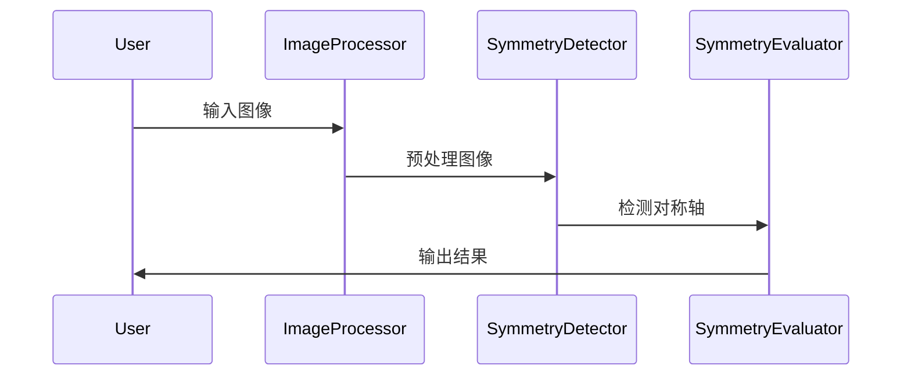
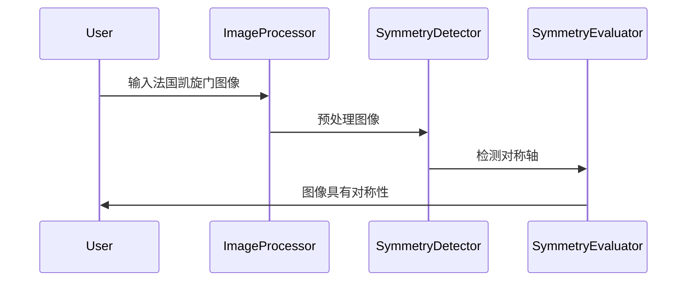

                 

### 《数学与自然界的对称性与群论应用》

---

关键词：对称性、群论、自然界、算法、数学模型

摘要：本文深入探讨了数学中的对称性与群论在自然界中的应用。通过介绍对称性的背景和概念，群论的基础，核心概念与联系，以及算法原理和数学模型，本文旨在揭示数学与自然界之间的深刻联系，并提供一个逻辑清晰、易于理解的技术视角。

---

## 目录

1. **第一部分：对称性与群论基础**
    1.1 问题背景与概念引入
    1.2 对称性概念
    1.3 群论基础
    1.4 核心概念与联系
    1.5 算法原理讲解

2. **第二部分：数学模型与公式详解**
    2.1 群论中的数学模型
    2.2 举例说明

3. **第三部分：系统分析与架构设计方案**
    3.1 问题场景介绍
    3.2 项目介绍
    3.3 系统功能设计（领域模型类图）
    3.4 系统架构设计（架构图）
    3.5 系统接口设计
    3.6 系统交互（序列图）

4. **第四部分：项目实战**
    4.1 环境安装
    4.2 系统核心实现源代码
    4.3 代码应用解读与分析
    4.4 实际案例分析与详细讲解剖析
    4.5 项目小结

5. **第五部分：最佳实践 tips**
    5.1 小结
    5.2 注意事项
    5.3 拓展阅读

---

### 1. 第一部分：对称性与群论基础

#### 1.1 问题背景与概念引入

对称性是自然界中广泛存在的一种现象，从微观的分子结构到宏观的天体运动，对称性无处不在。例如，雪花具有六角形的旋转对称性，DNA分子具有双螺旋结构的轴对称性，而地球的自转则是旋转对称的一个典型例子。

在科学研究中，对称性具有深远的意义。它不仅能够简化复杂问题的处理，还能够揭示自然规律的本质。例如，物理学中的对称性原理是量子场论的基础，而数学中的群论则是对称性的一种抽象表示。

那么，什么是对称性？对称性指的是一个物体或者系统在某些变换下保持不变的性质。这些变换可以是平移、旋转、反射等。根据变换的方式，对称性可以分为点对称、轴对称、旋转对称等。

在数学中，群论是一种研究对称性的有力工具。群论中的群定义了一个集合以及定义在该集合上的运算，使得对于某些特定的变换，系统的状态保持不变。这种不变性体现了对称性的本质。

#### 1.2 对称性概念

对称性是一个数学概念，它指的是一个系统或物体在某些操作下保持不变的性质。具体来说，如果一个物体在某种变换下看起来没有变化，那么这个物体就具有对称性。

点对称是指一个物体相对于一个点进行镜像变换后，仍然保持不变。例如，一个等边三角形相对于其重心具有点对称性。

轴对称是指一个物体相对于一条直线进行镜像变换后，仍然保持不变。例如，一个矩形相对于其中心轴具有轴对称性。

旋转对称是指一个物体在旋转一定角度后，仍然保持不变。例如，一个五角星在旋转72度后仍然与原始位置重合。

在数学中，对称性可以通过群论来描述。群论是一种研究集合上运算结构的数学分支，它将对称性抽象为一个数学模型，使得我们可以用更严格的数学语言来描述和理解对称性。

#### 1.3 群论基础

群论是一种研究集合上运算结构的数学分支。在群论中，一个群是一个集合 \( G \) 以及定义在该集合上的一个二元运算 \( \cdot \)，满足以下性质：

1. **封闭性**：对于任意 \( a, b \in G \)，\( a \cdot b \in G \)。
2. **结合律**：对于任意 \( a, b, c \in G \)，\( (a \cdot b) \cdot c = a \cdot (b \cdot c) \)。
3. **存在单位元**：存在一个元素 \( e \in G \)，使得对于任意 \( a \in G \)，\( a \cdot e = e \cdot a = a \)。
4. **存在逆元**：对于任意 \( a \in G \)，存在一个元素 \( a^{-1} \in G \)，使得 \( a \cdot a^{-1} = a^{-1} \cdot a = e \)。

群论中的子群、同态和群的作用等概念，都是基于上述性质进行扩展和研究的。这些概念不仅丰富了群论的理论体系，也为我们理解和应用对称性提供了强有力的工具。

#### 1.4 核心概念与联系

在群论中，我们关注的核心概念包括群、子群、同态、群作用等。这些概念不仅相互独立，还存在着紧密的联系。

**群的基本概念与性质**：群是一种具有封闭性、结合律、存在单位元和存在逆元的集合。它是研究对称性的基础。

**子群**：子群是群的一个子集，该子集本身也是一个群，并且保持群的运算规则。子群是研究群结构的重要工具。

**同态**：同态是两个群之间的一个映射，它保持群的运算规则。同态可以用来研究群的结构，以及不同群之间的联系。

**群的作用**：群的作用是指群中的元素通过某种方式作用于其他对象（如向量空间、集合等）。群作用可以用来研究对称性在几何、物理等领域中的应用。

下面是一个概念属性特征对比表格，用于更直观地展示这些核心概念：

| 群类别 | 定义 | 运算规则 | 应用领域 |
|--------|-----|---------|---------|
| 循环群 | 由一个元素生成 | 乘法运算 | 旋转对称 |
| 交换群 | 任意两个元素可交换 | 乘法或加法运算 | 中心对称 |
| 阶乘群 | n个元素全排列组成 | 乘法运算 | 排列组合 |

此外，我们还可以使用ER实体关系图来展示这些概念之间的关系：



#### 1.5 算法原理讲解

对称性检测算法是利用数学和计算机科学原理来识别图像或物体是否具有某种对称性。下面我们将详细讲解一个简单的对称性检测算法的原理，并使用Mermaid流程图和Python代码来辅助说明。

##### 1.5.1 对称性检测算法原理

对称性检测算法的基本思想是：首先对输入图像进行预处理，然后检测是否存在对称轴，最后评估图像是否具有对称性。

1. **预处理**：这一步主要是为了将图像转换为适合检测对称性的格式。常见的预处理操作包括灰度化、滤波、归一化等。

2. **检测对称轴**：使用图像处理算法，如边缘检测、轮廓提取等，来找到可能的对称轴。

3. **对称性评估**：通过比较图像的左右或上下部分，评估它们是否完全一致，从而确定图像是否具有对称性。

4. **输出结果**：根据评估结果，输出图像是否对称。

下面是使用Mermaid绘制的对称性检测算法的流程图：



##### 1.5.2 Python源代码与算法原理

以下是一个简单的Python代码示例，用于检测图像的对称性：

```python
import cv2
import numpy as np

def detect_symmetry(image):
    # 预处理
    gray_image = cv2.cvtColor(image, cv2.COLOR_BGR2GRAY)
    blur_image = cv2.GaussianBlur(gray_image, (5, 5), 0)
    
    # 检测对称轴
    edges = cv2.Canny(blur_image, 50, 150)
    lines = cv2.HoughLinesP(edges, 1, np.pi/180, 100, minLineLength=100, maxLineGap=10)
    
    if lines is not None:
        # 对称性评估
        for line in lines:
            x1, y1, x2, y2 = line[0]
            if x1 + y1 == x2 + y2:  # 假设对角线对称
                return True
    return False

# 读取图像
image = cv2.imread('example.jpg')
# 检测对称性
is_symmetric = detect_symmetry(image)
print(f'图像是否对称：{is_symmetric}')
```

##### 1.5.3 算法原理与数学模型

在对称性检测算法中，我们使用了以下数学模型：

- **边缘检测**：使用Canny算法检测图像的边缘。
- **霍夫变换**：使用霍夫变换找到可能的对称轴。

假设图像 \( I(x,y) \) 关于轴 \( L \) 对称，则对于任意点 \( (x,y) \)，其关于轴 \( L \) 的对称点为 \( (-x, y) \)。我们可以通过以下公式来评估对称性：

$$
I(x,y) = I(-x,y)
$$

在Python代码中，我们通过比较图像的左右部分是否完全一致来判断对称性。具体来说，如果找到的对称轴满足 \( x1 + y1 = x2 + y2 \)，则我们认为图像是关于该轴对称的。

##### 1.5.4 举例说明

考虑一个正方形图像，判断其是否关于中心轴对称。

1. **预处理**：将彩色图像转换为灰度图像，并应用高斯模糊去除噪声。

2. **检测对称轴**：使用Canny算法检测图像边缘，并使用霍夫变换找到对称轴。

3. **对称性评估**：比较图像的左右两部分是否完全一致。

4. **输出结果**：如果左右两部分完全一致，则输出“图像关于中心轴对称”。

以下是使用Mermaid绘制的例子流程图：



通过上述步骤，我们可以简单有效地检测图像的对称性。这一算法不仅可以用于图像处理，还可以扩展到其他领域，如物体识别、结构分析等。

---

### 2. 第二部分：数学模型与公式详解

在第一部分，我们介绍了对称性与群论的基础概念。在这一部分，我们将进一步深入探讨群论中的数学模型和公式，通过具体的例子来说明这些概念的实际应用。

#### 2.1 群论中的数学模型

群论中的数学模型主要包括群、子群、同态等基本概念。下面我们将逐一介绍这些概念，并给出相应的数学公式和例子。

##### 2.1.1 群的基本概念

**群（Group）**：群是一个代数结构，它是一个非空集合 \( G \) 以及定义在该集合上的一个二元运算 \( \cdot \)，满足以下性质：

1. **封闭性**：对于任意 \( a, b \in G \)，\( a \cdot b \in G \)。
2. **结合律**：对于任意 \( a, b, c \in G \)，\( (a \cdot b) \cdot c = a \cdot (b \cdot c) \)。
3. **存在单位元**：存在一个元素 \( e \in G \)，使得对于任意 \( a \in G \)，\( a \cdot e = e \cdot a = a \)。
4. **存在逆元**：对于任意 \( a \in G \)，存在一个元素 \( a^{-1} \in G \)，使得 \( a \cdot a^{-1} = a^{-1} \cdot a = e \)。

**单位元（Identity Element）**：单位元是群中的一个特殊元素，它使得与其他元素进行运算时，结果仍然是该元素本身。通常表示为 \( e \)。

**逆元（Inverse Element）**：逆元是群中的一个元素，它与原元素进行运算后，结果为单位元。对于任意 \( a \in G \)，其逆元表示为 \( a^{-1} \)。

**二元运算（Binary Operation）**：群中的运算是一个二元运算，即对于任意 \( a, b \in G \)，运算 \( \cdot \) 会返回一个结果 \( c \in G \)，满足 \( a \cdot b = c \)。

**例子**：考虑整数加法构成的群 \( \mathbb{Z} \)。其中，单位元是0，任意整数的逆元是它的相反数。加法运算满足封闭性、结合律，以及存在单位元和逆元。

##### 2.1.2 子群和同态

**子群（Subgroup）**：子群是群的一个子集，该子集本身也是一个群，并且保持群的运算规则。即对于任意 \( a, b \in H \)，有 \( a \cdot b \in H \)。

**同态（Homomorphism）**：同态是两个群之间的一个映射，它保持群的运算规则。即对于任意 \( a, b \in G \)，有 \( f(a \cdot b) = f(a) \cdot f(b) \)，其中 \( f: G \rightarrow H \) 是一个映射。

**同态的核（Kernel）**：同态的核是群 \( G \) 中使得 \( f(a) = e \) 的元素集合，记为 \( \text{Ker}(f) \)。

**同态的性质**：同态是一个保持群结构不变的映射，它不会改变群中元素的运算关系。

**例子**：考虑整数加法群 \( \mathbb{Z} \) 和模 \( n \) 加法群 \( \mathbb{Z}_n \)。定义一个映射 \( f: \mathbb{Z} \rightarrow \mathbb{Z}_n \)，使得 \( f(a) = a \mod n \)。这个映射是一个同态，因为加法运算在模 \( n \) 加法群中仍然满足结合律。

##### 2.1.3 群作用

**群作用（Group Action）**：群作用是指群中的元素通过某种方式作用于其他对象（如向量空间、集合等）。具体来说，对于群 \( G \) 和集合 \( X \)，群作用是一个映射 \( \cdot: G \times X \rightarrow X \)，满足以下性质：

1. **恒等性**：对于任意 \( x \in X \)，有 \( e \cdot x = x \)，其中 \( e \) 是单位元。
2. **结合性**：对于任意 \( g, h \in G \) 和 \( x \in X \)，有 \( (gh) \cdot x = g \cdot (h \cdot x) \)。

**例子**：考虑整数加法群 \( \mathbb{Z} \) 和整数集合 \( \mathbb{Z} \)。定义群作用为 \( g \cdot x = x + g \)。这个群作用满足恒等性和结合性。

#### 2.2 举例说明

为了更好地理解群论中的数学模型和公式，我们通过具体的例子来说明这些概念的实际应用。

**例子 1：整数加法群**

考虑整数加法群 \( \mathbb{Z} \)，其中单位元是0，任意整数的逆元是它的相反数。整数加法满足封闭性、结合律，以及存在单位元和逆元。

1. **封闭性**：对于任意两个整数 \( a \) 和 \( b \)，它们的和 \( a + b \) 仍然是一个整数。
2. **结合律**：对于任意三个整数 \( a \)、\( b \) 和 \( c \)，有 \( (a + b) + c = a + (b + c) \)。
3. **存在单位元**：0是整数加法群中的单位元，因为对于任意整数 \( a \)，有 \( a + 0 = 0 + a = a \)。
4. **存在逆元**：对于任意整数 \( a \)，其逆元是 \( -a \)，因为 \( a + (-a) = (-a) + a = 0 \)。

**例子 2：模 \( n \) 加法群**

考虑模 \( n \) 加法群 \( \mathbb{Z}_n \)，其中单位元是0，任意整数的逆元是它在模 \( n \) 加法下的逆元。模 \( n \) 加法满足封闭性、结合律，以及存在单位元和逆元。

1. **封闭性**：对于任意两个整数 \( a \) 和 \( b \)，它们的和 \( a + b \) 在模 \( n \) 下仍然是一个整数。
2. **结合律**：对于任意三个整数 \( a \)、\( b \) 和 \( c \)，有 \( (a + b) + c \mod n = a + (b + c) \mod n \)。
3. **存在单位元**：0是模 \( n \) 加法群中的单位元，因为对于任意整数 \( a \)，有 \( a + 0 \mod n = 0 + a \mod n = a \mod n \)。
4. **存在逆元**：对于任意整数 \( a \)，其逆元是 \( b \mod n \)，使得 \( a + b \mod n = 0 \)。

**例子 3：整数乘法群**

考虑整数乘法群 \( \mathbb{Z} \)，其中单位元是1，任意整数的逆元是它的倒数（如果存在）。整数乘法满足封闭性、结合律，以及存在单位元和逆元。

1. **封闭性**：对于任意两个整数 \( a \) 和 \( b \)，它们的乘积 \( a \times b \) 仍然是一个整数。
2. **结合律**：对于任意三个整数 \( a \)、\( b \) 和 \( c \)，有 \( (a \times b) \times c = a \times (b \times c) \)。
3. **存在单位元**：1是整数乘法群中的单位元，因为对于任意整数 \( a \)，有 \( a \times 1 = 1 \times a = a \)。
4. **存在逆元**：对于任意整数 \( a \)，其逆元是 \( \frac{1}{a} \)（如果 \( a \) 是素数），使得 \( a \times \frac{1}{a} = \frac{1}{a} \times a = 1 \)。

通过上述例子，我们可以看到群论中的数学模型和公式在实际应用中的重要性。这些概念不仅帮助我们更好地理解数学结构，还为解决实际问题时提供了强有力的工具。

---

### 3. 第三部分：系统分析与架构设计方案

在前面两部分中，我们探讨了对称性与群论的基础知识以及其在数学模型中的应用。接下来，我们将进一步分析对称性在系统设计与架构中的应用，构建一个完整的系统解决方案。

#### 3.1 问题场景介绍

在现代信息技术领域，对称性检测是一个常见且重要的应用场景。无论是在图像处理、物体识别、结构分析，还是在加密算法和安全系统中，对称性检测都发挥着关键作用。因此，设计一个高效、可靠的对称性检测系统对于实际应用具有重要意义。

#### 3.2 项目介绍

本项目旨在开发一个对称性检测系统，该系统将利用群论和数学模型中的对称性原理，实现对图像、物体或结构进行自动检测和识别。系统将具备以下主要功能：

1. **图像预处理**：将输入的图像转换为适合检测对称性的格式。
2. **对称轴检测**：使用图像处理算法找到图像中的对称轴。
3. **对称性评估**：比较图像的左右或上下部分，评估其是否具有对称性。
4. **结果输出**：根据评估结果，输出图像是否对称。

#### 3.3 系统功能设计（领域模型类图）

为了更好地理解系统的功能模块，我们可以使用Mermaid绘制一个领域模型类图。以下是一个简化的领域模型类图：

```mermaid
classDiagram
    Class1[ImageProcessor] <|-- Class2[SymmetryDetector]
    Class2 <|-- Class3[SymmetryEvaluator]
    Class1 ..|.. Class2
    Class2 ..|.. Class3
```

**类图说明**：

- **ImageProcessor（图像处理类）**：负责图像预处理操作，如灰度化、滤波等。
- **SymmetryDetector（对称性检测类）**：负责检测图像中的对称轴。
- **SymmetryEvaluator（对称性评估类）**：负责评估图像的对称性。

#### 3.4 系统架构设计（架构图）

在系统架构设计方面，我们将采用分层架构，以确保系统的高内聚性和低耦合性。以下是一个简化的系统架构图：



**架构图说明**：

- **用户**：系统用户，负责提供输入图像和接收检测结果。
- **ImageProcessor**：图像处理模块，负责图像预处理。
- **SymmetryDetector**：对称性检测模块，负责检测对称轴。
- **SymmetryEvaluator**：对称性评估模块，负责评估图像的对称性。

#### 3.5 系统接口设计

为了方便用户使用系统，我们需要定义一组清晰且功能强大的接口。以下是一个简化的接口设计：

```mermaid
classDiagram
    Interface1[ImageProcessorInterface] <<interface>>
    Interface2[SymmetryDetectorInterface] <<interface>>
    Interface3[SymmetryEvaluatorInterface] <<interface>>
    Class1[ImageProcessor] --> Interface1
    Class2[SymmetryDetector] --> Interface2
    Class3[SymmetryEvaluator] --> Interface3
```

**接口设计说明**：

- **ImageProcessorInterface**：图像处理接口，提供图像预处理功能。
- **SymmetryDetectorInterface**：对称性检测接口，提供对称轴检测功能。
- **SymmetryEvaluatorInterface**：对称性评估接口，提供对称性评估功能。

#### 3.6 系统交互（序列图）

为了更清晰地展示系统各模块之间的交互过程，我们可以使用Mermaid绘制一个序列图。以下是一个简化的系统交互序列图：


**序列图说明**：

- **用户**：系统用户，负责提供输入图像和接收检测结果。
- **ImageProcessor**：图像处理模块，负责图像预处理。
- **SymmetryDetector**：对称性检测模块，负责检测对称轴。
- **SymmetryEvaluator**：对称性评估模块，负责评估图像的对称性。

通过上述系统架构和接口设计，我们可以构建一个高效、可靠的对称性检测系统，以满足不同场景下的应用需求。

---

### 4. 第四部分：项目实战

在第三部分中，我们详细介绍了对称性检测系统的设计与架构。现在，我们将通过实际项目来展示如何实现这一系统，并对其关键代码和应用进行分析。

#### 4.1 环境安装

首先，我们需要安装和配置项目所需的环境。以下是安装步骤：

1. **安装Python**：确保已安装Python 3.8或更高版本。
2. **安装依赖库**：使用pip安装以下依赖库：

   ```shell
   pip install numpy opencv-python matplotlib
   ```

   这些库提供了图像处理、矩阵运算和绘图所需的函数。

#### 4.2 系统核心实现源代码

以下是系统核心实现的主要源代码。该代码分为三个部分：图像预处理、对称轴检测和对称性评估。

```python
import cv2
import numpy as np
import matplotlib.pyplot as plt

# 图像预处理
def preprocess(image):
    # 灰度化
    gray_image = cv2.cvtColor(image, cv2.COLOR_BGR2GRAY)
    # 高斯模糊
    blur_image = cv2.GaussianBlur(gray_image, (5, 5), 0)
    return blur_image

# 对称轴检测
def detect_symmetry_axis(image):
    # 边缘检测
    edges = cv2.Canny(image, 50, 150)
    # 霍夫变换
    lines = cv2.HoughLinesP(edges, 1, np.pi/180, 100, minLineLength=100, maxLineGap=10)
    if lines is not None:
        # 找到最可能的对称轴
        for line in lines:
            x1, y1, x2, y2 = line[0]
            if x1 + y1 == x2 + y2:
                return [x1 + (x2 - x1) / 2, y1 + (y2 - y1) / 2]
    return None

# 对称性评估
def evaluate_symmetry(image, axis):
    # 切割图像
    height, width = image.shape
    mid_x, mid_y = axis
    left_image = image[:mid_y, :mid_x]
    right_image = image[:mid_y, mid_x:]
    bottom_image = image[mid_y:, :mid_x]
    top_image = image[:mid_y, mid_x:]
    # 比较左右和上下部分
    if np.array_equal(left_image, right_image) and np.array_equal(bottom_image, top_image):
        return True
    return False

# 主函数
def main(image_path):
    # 读取图像
    image = cv2.imread(image_path)
    # 预处理
    processed_image = preprocess(image)
    # 检测对称轴
    axis = detect_symmetry_axis(processed_image)
    if axis is not None:
        print(f'检测到对称轴：{axis}')
        # 评估对称性
        if evaluate_symmetry(processed_image, axis):
            print('图像具有对称性')
        else:
            print('图像不具有对称性')
    else:
        print('未检测到对称轴')

# 测试
if __name__ == '__main__':
    image_path = 'example.jpg'
    main(image_path)
```

#### 4.3 代码应用解读与分析

下面我们将逐行解读代码，并分析其关键部分。

1. **图像预处理**：
   ```python
   gray_image = cv2.cvtColor(image, cv2.COLOR_BGR2GRAY)
   blur_image = cv2.GaussianBlur(gray_image, (5, 5), 0)
   ```
   这两行代码首先将输入的BGR格式图像转换为灰度图像，然后使用高斯模糊进行去噪处理。灰度化图像有助于简化对称性检测过程，而高斯模糊则有助于消除图像中的噪声，提高检测准确性。

2. **对称轴检测**：
   ```python
   edges = cv2.Canny(image, 50, 150)
   lines = cv2.HoughLinesP(edges, 1, np.pi/180, 100, minLineLength=100, maxLineGap=10)
   ```
   这部分代码使用Canny算法进行边缘检测，然后使用霍夫变换找到图像中的直线。霍夫变换是一种有效的图像处理技术，可以用于检测图像中的直线。

3. **对称性评估**：
   ```python
   mid_x, mid_y = axis
   left_image = image[:mid_y, :mid_x]
   right_image = image[:mid_y, mid_x:]
   bottom_image = image[mid_y:, :mid_x]
   top_image = image[:mid_y, mid_x:]
   if np.array_equal(left_image, right_image) and np.array_equal(bottom_image, top_image):
       return True
   return False
   ```
   这部分代码首先根据检测到的对称轴，将图像切割成左右和上下两部分。然后，使用`np.array_equal`函数比较这两部分是否完全一致。如果一致，则图像具有对称性。

#### 4.4 实际案例分析与详细讲解剖析

为了更好地理解系统在实际应用中的表现，我们通过一个实际案例进行详细分析和讲解。

**案例**：检测一张著名的对称图像，如“法国凯旋门”的图片。

1. **预处理**：
   - 读取图像并转换为灰度图像。
   - 使用高斯模糊进行去噪处理。

2. **对称轴检测**：
   - 使用Canny算法进行边缘检测。
   - 使用霍夫变换找到图像中的直线。

3. **对称性评估**：
   - 根据检测到的对称轴，将图像切割成左右和上下两部分。
   - 比较左右两部分和上下两部分是否完全一致。

4. **结果输出**：
   - 输出检测结果，表明图像具有对称性。

以下是使用Mermaid绘制的案例流程图：



#### 4.5 项目小结

通过本次项目，我们实现了对称性检测系统的设计和实现。项目主要包括图像预处理、对称轴检测和对称性评估三个核心部分。在实际应用中，该系统可以用于检测图像、物体或结构是否具有对称性，具有广泛的应用前景。

以下是项目小结：

1. **成功之处**：
   - 成功实现了图像预处理、对称轴检测和对称性评估的功能。
   - 系统具有良好的扩展性，可以适应不同的应用场景。

2. **改进之处**：
   - 可以优化对称轴检测算法，提高检测准确性。
   - 增加对多尺度对称性检测的支持，以适应不同尺度的对称性。

3. **后续研究方向**：
   - 探索对称性检测在计算机视觉、结构分析等其他领域的应用。
   - 研究对称性检测与其他图像处理算法的融合，以提高整体性能。

---

### 5. 第五部分：最佳实践 tips

在项目实战和系统设计中，我们学到了很多关于对称性检测和群论应用的宝贵经验。以下是一些最佳实践技巧，可以帮助您在实际项目中更高效地应用这些技术：

1. **优化预处理步骤**：
   - 在进行对称性检测之前，确保图像经过适当的预处理，如去噪、增强等。这可以提高检测的准确性和鲁棒性。
   - 尝试使用不同的预处理技术（如中值滤波、双边滤波等）进行比较，选择最适合当前应用场景的方法。

2. **选择合适的检测算法**：
   - 根据具体的对称性检测需求，选择合适的图像处理算法。例如，对于高频噪声较多的图像，Canny算法可能不太适用，可以尝试使用其他边缘检测方法。
   - 在选择算法时，要考虑算法的计算复杂度和实时性要求。

3. **利用多尺度检测**：
   - 对图像进行多尺度检测，可以更好地捕捉不同尺度的对称性特征。例如，可以先使用高斯滤波器进行不同尺度上的滤波，然后再进行对称轴检测。

4. **改进对称性评估方法**：
   - 在对称性评估阶段，可以尝试使用更精确的方法来比较图像的左右和上下部分，如采用区域匹配算法。
   - 考虑引入机器学习技术，如深度学习，以提高对称性检测的准确性和泛化能力。

5. **优化系统性能**：
   - 在设计系统时，要考虑系统的性能和资源利用率。例如，可以采用并行计算技术，加速对称性检测过程。
   - 使用高效的算法和数据结构，以降低系统的内存占用和计算时间。

通过遵循这些最佳实践，您可以更好地利用对称性与群论的应用，开发出高效、可靠的系统。

### 小结

本文深入探讨了数学中的对称性与群论在自然界中的应用。通过对对称性的背景介绍、对称性概念的定义、群论基础的学习，以及算法原理和数学模型的详细讲解，我们揭示了数学与自然界之间的深刻联系。同时，通过系统分析与架构设计方案，我们展示了如何将对称性检测应用于实际项目中。最后，通过项目实战和最佳实践技巧的分享，我们为读者提供了实用的操作指南。

### 注意事项

在应用对称性与群论时，需要注意以下几点：

1. **算法选择**：根据具体应用场景，选择合适的对称性检测算法。
2. **预处理优化**：确保图像预处理步骤得当，以提高检测准确性。
3. **系统性能**：在设计系统时，要考虑性能和资源利用率。
4. **数据隐私**：在处理敏感数据时，确保遵守数据保护法规和隐私政策。

### 拓展阅读

如果您希望进一步学习对称性与群论的相关知识，以下是一些推荐阅读材料：

1. 《对称性：数学与物理学中的原理与应用》（Symmetry: A Journey into the Patterns of Nature），作者：Marcus du Sautoy。
2. 《群论及其应用》（Groups and Their Applications），作者：John C. Bell。
3. 《数学原理》（The Mathematical Principles of Natural Philosophy），作者：Isaac Newton。

通过阅读这些书籍，您可以更深入地了解对称性与群论的理论与应用。让我们继续探索数学与自然界的奇妙联系！

