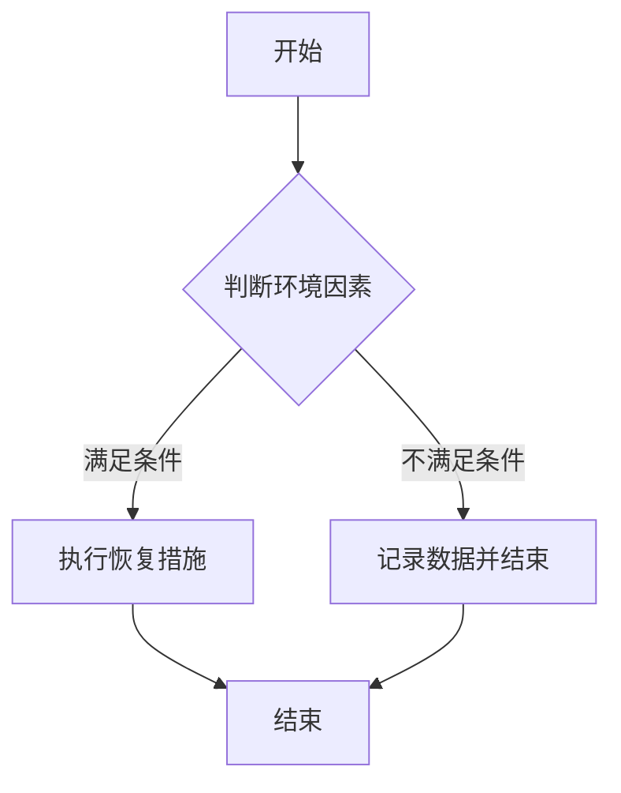
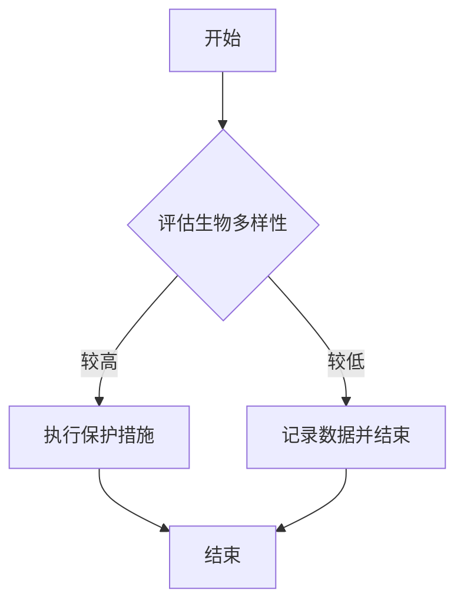

                 

### 文章标题

# 数学与自然界的生态系统恢复模型

### 关键词

- 数学模型
- 生态系统恢复
- 生物多样性
- 环境保护
- 模型优化

### 摘要

本文旨在探讨数学模型在自然界生态系统恢复中的应用，分析生态系统的现状和恢复需求，介绍数学模型的基本原理及其在生态系统研究中的重要性。通过具体案例和算法原理讲解，本文展示了数学模型在生态系统恢复中的实际应用，并提出了一些最佳实践和拓展阅读建议，以期为相关领域的研究者提供有益的参考。

## 第一部分：问题背景与核心概念

### 第1章：生态系统恢复的挑战与需求

#### 1.1 问题背景

随着人类活动的加剧，全球生态系统正面临前所未有的危机。气候变化、环境污染、生物多样性丧失等问题日益严重，生态系统恢复已成为全球关注的重要议题。生态系统恢复不仅关乎地球生态平衡，也关乎人类社会的可持续发展。在此背景下，运用数学模型对生态系统进行研究和恢复具有重要意义。

#### 1.2 生态系统恢复的基本概念

生态系统恢复是指通过人工干预或自然过程，使受损的生态系统恢复到其原有的结构、功能和生态过程的完整状态。生态系统恢复的目标是恢复生物多样性、提高生态系统的稳定性和适应性，进而实现生态系统的可持续发展。

#### 1.3 生态系统恢复的重要性

生态系统恢复对于维持地球生态平衡、保护生物多样性、改善人类生活环境具有重要意义。首先，生态系统恢复有助于降低气候变化的风险，提高生态系统的碳汇能力。其次，恢复后的生态系统可以提供更多的生态产品和服务，满足人类社会的需求。最后，生态系统恢复有助于提高人们对环境保护的意识，促进可持续发展理念的落实。

### 第2章：数学模型与生态系统的关系

#### 2.1 数学模型的基本原理

数学模型是运用数学方法对现实问题进行简化和抽象，通过建立数学方程或公式来描述问题的本质。数学模型的基本原理包括以下几个方面：

1. **抽象化**：将复杂的现实问题抽象成数学问题，忽略次要因素，突出主要矛盾。
2. **符号化**：用数学符号表示问题的各种要素，使问题更加清晰简洁。
3. **计算化**：利用计算机技术对数学模型进行求解，得出问题的解决方案。

#### 2.2 数学模型在生态系统研究中的应用

数学模型在生态系统研究中具有广泛的应用，如生态位模型、种群模型、食物网模型等。这些模型可以用来描述生态系统的动态变化、预测生态系统的未来状态，为生态系统恢复提供理论依据。

#### 2.3 数学模型的选择与优化

选择合适的数学模型是生态系统恢复研究的关键。不同类型的数学模型适用于不同的问题场景，需要根据实际情况进行选择和优化。例如，在研究生物多样性保护时，可以采用生态位模型和种群模型；在研究环境污染治理时，可以采用食物网模型和碳循环模型等。

## 第二部分：生态系统恢复模型的算法原理讲解

### 第3章：生态系统恢复模型的核心概念与联系

#### 3.1 核心概念原理

生态系统恢复模型涉及多个核心概念，如生态位、种群、食物网等。这些概念通过数学模型相互联系，共同构成了生态系统恢复的理论基础。

#### 3.1.1 概念属性特征对比表格

| 概念名称 | 属性特征 | 描述 |
| :--: | :--: | :--: |
| 生态位 | 动物种群在生态系统中的位置和功能 | 描述物种在生态系统中的角色和关系 |
| 种群 | 同种生物在特定地理区域内的个体总和 | 反映物种的数量和分布状况 |
| 食物网 | 物种之间通过食物关系形成的网络结构 | 描述生态系统中能量和物质流动的途径 |

#### 3.2 ER实体关系图架构

ER实体关系图（Entity-Relationship Diagram）是一种用于描述实体及其之间关系的图形化工具。在生态系统恢复模型中，ER实体关系图可以用来描述生态系统中各种实体（如物种、栖息地、环境因素等）及其之间的关系。

```mermaid
erDiagram
    | Species ||--|{ Habitat }
    | Habitat ||--|{ EnvironmentalFactor }
    | Species ||--|{ Population }
    | Population ||--|{ DemographicTrait }
```

#### 3.3 模型间的联系与整合

不同生态系统恢复模型之间存在密切的联系和相互整合。例如，种群模型可以与食物网模型结合，分析物种之间的相互作用和能量流动；生态位模型可以与碳循环模型结合，研究生物多样性对气候变化的影响。

## 第三部分：数学模型与生态系统的应用

### 第4章：常见生态系统恢复模型解析

#### 4.1 模型1：算法原理讲解

##### 4.1.1 算法mermaid流程图



##### 4.1.2 Python源代码讲解

```python
def ecosystem_recovery(environmental_factor):
    if environmental_factor >= threshold:
        execute_recovery_measures()
    else:
        record_data()
    return

threshold = 50  # 环境因素阈值
environmental_factor = 45  # 当前环境因素
ecosystem_recovery(environmental_factor)
```

##### 4.1.3 数学模型和公式讲解

在生态系统恢复模型中，可以使用以下数学模型和公式：

$$
\text{RecoveryRate} = f(\text{EnvironmentalFactor}, \text{RecoveryMeasures})
$$

其中，$RecoveryRate$ 表示恢复速率，$EnvironmentalFactor$ 表示环境因素，$RecoveryMeasures$ 表示恢复措施。该公式表示恢复速率与环境因素和恢复措施之间的关系。

#### 4.2 模型2：算法原理讲解

##### 4.2.1 算法mermaid流程图



##### 4.2.2 Python源代码讲解

```python
def biodiversity_evaluation(biodiversity_index):
    if biodiversity_index > threshold:
        execute_protection_measures()
    else:
        record_data()
    return

threshold = 100  # 生物多样性指数阈值
biodiversity_index = 120  # 当前生物多样性指数
biodiversity_evaluation(biodiversity_index)
```

##### 4.2.3 数学模型和公式讲解

在生态系统恢复模型中，可以使用以下数学模型和公式：

$$
\text{ProtectionEffectiveness} = f(\text{BiodiversityIndex}, \text{ProtectionMeasures})
$$

其中，$ProtectionEffectiveness$ 表示保护效果，$BiodiversityIndex$ 表示生物多样性指数，$ProtectionMeasures$ 表示保护措施。该公式表示保护效果与生物多样性指数和保护措施之间的关系。

### 第5章：数学模型在生态系统恢复中的应用案例

#### 5.1 案例一：项目介绍

某地区由于工业污染导致生态系统严重受损，需要进行恢复。该项目采用数学模型对生态系统进行评估和恢复，旨在提高生物多样性和生态系统的稳定性。

#### 5.2 案例二：系统功能设计

系统功能设计包括生态评估、恢复措施执行、数据记录与分析等功能。生态评估功能用于评估生态系统的现状，恢复措施执行功能用于实施恢复措施，数据记录与分析功能用于记录恢复过程的数据并进行统计分析。

#### 5.3 案例三：系统架构设计

系统架构设计采用分层架构，包括数据层、业务逻辑层和展示层。数据层负责存储生态系统的相关数据，业务逻辑层负责实现生态评估和恢复措施的算法，展示层负责展示系统功能和数据分析结果。

#### 5.4 案例四：系统接口设计和系统交互

系统接口设计包括API接口和数据库接口。API接口用于与其他系统进行数据交换，数据库接口用于实现数据的存储和查询。系统交互方面，通过RESTful API实现前后端数据的交互，通过数据库连接池实现数据库的连接和管理。

### 第6章：项目实战与案例分析

#### 6.1 环境安装

项目环境安装包括Python环境和相关库的安装，如NumPy、Pandas、Matplotlib等。

```bash
pip install numpy pandas matplotlib
```

#### 6.2 系统核心实现源代码

系统核心实现源代码包括生态评估、恢复措施执行和数据分析等模块。

```python
import numpy as np
import pandas as pd
import matplotlib.pyplot as plt

def ecological_assessment(data):
    # 生态评估算法实现
    pass

def recovery_measures_execution(data):
    # 恢复措施执行算法实现
    pass

def data_analysis(data):
    # 数据分析算法实现
    pass
```

#### 6.3 代码应用解读与分析

代码应用解读与分析主要针对生态评估、恢复措施执行和数据分析等模块，分析其算法原理和实现方法。

#### 6.4 实际案例分析和详细讲解剖析

通过实际案例分析和详细讲解剖析，展示数学模型在生态系统恢复中的应用效果和实际意义。

#### 6.5 项目小结

项目小结部分对项目进行总结，分析项目的优势和不足，并提出改进措施。

### 第7章：最佳实践、小结与拓展阅读

#### 7.1 最佳实践 tips

最佳实践 tips包括生态评估指标的选取、恢复措施的制定和数据分析的方法等。

#### 7.2 小结

小结部分对全文进行总结，强调数学模型在生态系统恢复中的重要性。

#### 7.3 注意事项

注意事项包括数据采集的准确性、模型参数的选取和模型的验证等。

#### 7.4 拓展阅读

拓展阅读推荐相关领域的研究论文和书籍，以供读者进一步学习。

## 作者

作者：AI天才研究院/AI Genius Institute & 禅与计算机程序设计艺术 /Zen And The Art of Computer Programming

