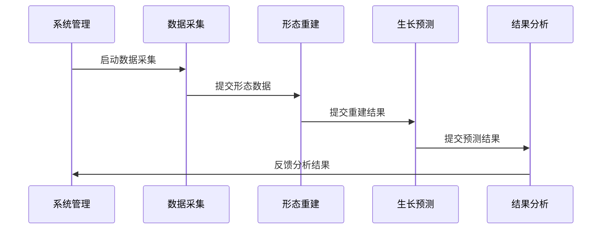

                 

# 数学与自然界的生物形态与生长模式

> 关键词：数学、生物形态、生长模式、算法、系统架构、Python

> 摘要：本文探讨了数学在自然界生物形态与生长模式研究中的重要性，介绍了核心概念、数学模型和算法原理，并详细阐述了系统架构与实现方法。通过对实际案例的剖析，本文旨在为读者提供深入的见解和实用的技术指导。

## 目录大纲设计

#### 总体框架

1. **背景介绍**：介绍数学在自然界生物形态与生长模式中的重要性，引出本书的主题。
2. **核心概念与联系**：详细阐述数学与生物形态、生长模式之间的关系，包括核心概念、属性特征对比表格和ER实体关系图。
3. **算法原理讲解**：介绍相关数学模型和算法原理，使用Mermaid和Python源代码进行详细讲解。
4. **数学模型和数学公式讲解**：使用LaTeX格式嵌入文中，详细讲解和举例说明。
5. **系统分析与架构设计方案**：介绍问题场景和系统设计，包括领域模型类图、系统架构图、系统接口设计和系统交互序列图。
6. **项目实战**：环境安装、核心实现源代码，代码应用解读与分析，实际案例剖析。
7. **最佳实践 tips**、**小结**、**注意事项**、**拓展阅读**等。

#### 详细目录大纲

----------------------------------------------------------------

# 第一部分：问题背景与核心概念

## 第1章：数学与自然界的生物形态与生长模式概述

### 1.1 问题背景

- **数学的重要性**：介绍数学在自然科学和工程技术中的应用。
- **生物形态与生长模式**：描述自然界中生物形态和生长模式的多样性和复杂性。

### 1.2 核心概念与联系

- **生物形态学**：定义与基本概念。
- **生长模式**：定义、分类与特征。
- **数学模型**：介绍数学在生物形态和生长模式研究中的应用，包括几何学、微积分、概率论等。

## 1.3 概念属性特征对比表格

| 概念         | 定义                                                         | 属性特征对比                 |
|--------------|--------------------------------------------------------------|-----------------------------|
| 生物形态学   | 研究生物体的形状、结构和形式变化的学科                         | 基因表达、细胞分化、生长发育等 |
| 生长模式     | 生物体在生命周期中形态和结构的变化规律                         | 渐进性、阶段性、稳定性等       |
| 数学模型     | 用数学语言描述生物形态和生长过程的工具                         | 几何学、微积分、概率论等       |

### 1.4 ER实体关系图

- **实体**：生物体、生长过程、数学模型。
- **关系**：形态与生长模式之间的关系、数学模型与生物形态之间的关系。

----------------------------------------------------------------

## 第1章：数学与自然界的生物形态与生长模式概述

### 1.1 问题背景

**数学的重要性**

数学作为一门基础科学，它在自然界和人类社会的各个方面都有着广泛的应用。从几何学到微积分，从概率论到统计学，数学提供了一种精确、系统的语言来描述和解释自然现象。在自然科学和工程技术领域，数学模型和算法已经成为解决复杂问题的重要工具。

**生物形态与生长模式**

自然界中，生物体的形态和生长模式呈现出惊人的多样性和复杂性。从微小的单细胞生物到庞大的哺乳动物，生物体的形态和生长模式各有特色。生物形态学是研究生物体形态、结构以及形态变化的学科，而生长模式则描述了生物体在生命周期中形态和结构的变化规律。

生物形态与生长模式的研究不仅具有科学意义，也对生物工程、医学、生态学等领域有着重要的应用价值。了解生物形态和生长模式的规律，有助于我们更好地理解和预测生物行为，进而为生物技术的开发提供理论基础。

### 1.2 核心概念与联系

**生物形态学**

生物形态学是研究生物体形态、结构和形态变化的学科。它关注的是生物体的外部形状和内部结构，以及这些结构是如何影响生物体功能的。生物形态学的研究内容包括：

- **形态发生**：研究生物体形态形成的机制和过程。
- **形态变异**：研究生物体形态变异的原因和类型。
- **形态多样性**：分析不同物种和不同环境下的形态多样性。

**生长模式**

生长模式是指生物体在生命周期中形态和结构的变化规律。生长模式的研究内容主要包括：

- **生长阶段**：描述生物体在生长过程中经历的各个阶段。
- **生长速率**：研究生物体在各个生长阶段的生长速率。
- **生长调控**：探讨生物体内生长的调控机制。

**数学模型**

数学模型是用数学语言描述生物形态和生长过程的工具。数学模型可以帮助我们理解和预测生物体的形态和生长模式。常见的数学模型包括几何学模型、微积分模型和概率论模型。

- **几何学模型**：用于描述生物体的形态和结构，例如点、线、面、体等。
- **微积分模型**：用于描述生物体的生长过程，例如生长曲线、形态变化速率等。
- **概率论模型**：用于描述生物体的种群动态和进化过程，例如种群密度、进化速率等。

### 1.3 概念属性特征对比表格

下面是一个关于生物形态学、生长模式和数学模型的概念属性特征对比表格：

| 概念         | 定义                                                         | 属性特征对比                 |
|--------------|--------------------------------------------------------------|-----------------------------|
| 生物形态学   | 研究生物体的形状、结构和形式变化的学科                         | 基因表达、细胞分化、生长发育等 |
| 生长模式     | 生物体在生命周期中形态和结构的变化规律                         | 渐进性、阶段性、稳定性等       |
| 数学模型     | 用数学语言描述生物形态和生长过程的工具                         | 几何学、微积分、概率论等       |

### 1.4 ER实体关系图

在生物形态与生长模式的研究中，涉及到的实体包括生物体、生长过程和数学模型。它们之间的关系可以用ER（实体关系）图来描述。以下是一个简化的ER实体关系图：

```mermaid
erDiagram
  生物体 ||--|{ 生长过程 }
  生物体 ||--|{ 数学模型 }
  生长过程 ||--|{ 数学模型 }
```

在这个ER图中，生物体与生长过程和数学模型之间存在关联关系，生长过程与数学模型也存在关联关系。这种关系描述了生物形态和生长模式的研究是如何通过数学模型来实现的。

## 第二部分：数学模型与算法原理

### 2.1 几何学模型

几何学模型是描述生物形态的基本工具。在几何学中，点、线、面、体等基本概念被用来构建生物体的形态。以下是一些几何学模型在生物形态研究中的应用：

**点**：生物体中的最小结构单元，如细胞核。

**线**：生物体的轮廓线，如叶脉。

**面**：生物体的表面，如皮肤、叶面。

**体**：生物体的三维结构，如动物的身体、植物的主体。

**几何学模型的应用**：几何学模型可以用于形态分析、形态重建和形态模拟。例如，通过几何学模型，我们可以计算生物体的表面积、体积、形态复杂度等参数，从而更好地理解生物形态。

### 2.2 微积分模型

微积分模型是描述生物生长过程的重要工具。微积分中的导数和积分可以用来描述生物体的生长速率、形态变化速率等。

**导数**：导数是描述函数变化速率的数学工具。在生物生长模式研究中，导数可以用来描述生物体的生长速率。例如，生物体的形态随时间的变化率。

**积分**：积分是描述函数累积效应的数学工具。在生物生长模式研究中，积分可以用来计算生物体的生长量、形态变化量等。例如，通过积分计算生物体的体积变化。

**微积分模型的应用**：微积分模型可以用于生长曲线分析、形态变化预测和生长调控研究。例如，通过微积分模型，我们可以预测生物体在不同生长阶段的变化，从而更好地理解生物生长模式。

### 2.3 概率论模型

概率论模型是描述生物种群动态和进化过程的重要工具。概率论中的随机事件、概率分布等概念被用来描述生物种群的行为和进化规律。

**随机事件**：随机事件是描述生物种群行为的不确定性事件。例如，生物种群的出生、死亡、迁移等。

**概率分布**：概率分布是描述随机事件发生概率的数学工具。例如，正态分布、泊松分布等。

**概率论模型的应用**：概率论模型可以用于种群动态模拟、进化过程分析和遗传规律研究。例如，通过概率论模型，我们可以模拟生物种群的演化过程，预测生物种群的未来趋势。

### 2.4 形态重建算法

形态重建算法是一种基于数学模型的生物形态分析方法。它通过数学模型重建生物体的形态，从而更好地理解生物形态的结构和功能。

**算法原理**：形态重建算法基于几何学模型、微积分模型和概率论模型，通过数值计算和优化方法重建生物体的形态。算法的基本步骤包括：

1. **数据收集**：收集生物体的形态数据，如扫描图像、几何参数等。
2. **形态建模**：使用数学模型对生物体进行建模，生成形态的数学表达式。
3. **形态重建**：通过数值计算和优化方法，重建生物体的形态。

**算法流程**：形态重建算法的一般流程如下：

1. 数据预处理：对收集到的形态数据进行预处理，如去噪、滤波等。
2. 形态建模：选择合适的数学模型，对生物体进行建模。
3. 形态重建：通过数值计算和优化方法，重建生物体的形态。
4. 结果分析：分析重建结果，评估算法的性能。

### 2.5 生长模式预测算法

生长模式预测算法是一种基于数学模型的方法，用于预测生物体的生长模式。它可以帮助我们更好地理解生物生长的规律，从而为生物工程和生物医学研究提供理论基础。

**算法原理**：生长模式预测算法基于几何学模型、微积分模型和概率论模型，通过数学模型预测生物体的生长模式。算法的基本步骤包括：

1. **数据收集**：收集生物体的生长数据，如生长曲线、形态参数等。
2. **模型训练**：使用收集到的数据训练数学模型，使其能够预测生物体的生长模式。
3. **生长预测**：使用训练好的数学模型，预测生物体的生长模式。

**算法流程**：生长模式预测算法的一般流程如下：

1. 数据预处理：对收集到的生长数据进行预处理，如去噪、归一化等。
2. 模型训练：选择合适的数学模型，使用预处理后的数据进行模型训练。
3. 生长预测：使用训练好的数学模型，预测生物体的生长模式。
4. 结果分析：分析预测结果，评估算法的性能。

## 第三部分：系统分析与架构设计

### 3.1 问题场景介绍

在生物形态与生长模式的研究中，我们面临着以下问题场景：

- 如何准确描述生物体的形态和生长模式？
- 如何建立数学模型，预测生物体的生长模式？
- 如何设计一个高效的系统，实现生物形态与生长模式的研究？

针对上述问题场景，我们需要设计一个系统，包括领域模型、系统架构、系统接口设计和系统交互序列图等，以实现生物形态与生长模式的研究。

### 3.2 系统功能设计

**领域模型**

领域模型用于描述生物形态与生长模式研究的领域概念和关系。以下是一个简化的领域模型类图：

```mermaid
classDiagram
  类：生物体 <<entity>>
  类：生长过程 <<entity>>
  类：数学模型 <<entity>>
  
  生物体 --|{ 生长过程 }
  生物体 --|{ 数学模型 }
  生长过程 --|{ 数学模型 }
```

在这个领域模型中，生物体、生长过程和数学模型是主要的实体，它们之间存在着复杂的关联关系。

**系统功能**

系统的主要功能包括：

- 数据采集：收集生物体的形态和生长数据。
- 形态重建：使用数学模型重建生物体的形态。
- 生长预测：使用数学模型预测生物体的生长模式。
- 结果分析：分析重建和预测结果，评估算法的性能。

### 3.3 系统架构设计

系统架构用于描述系统的整体结构和组件之间的关系。以下是一个简化的系统架构图：

```mermaid
sequenceDiagram
  participant 系统管理
  participant 数据采集
  participant 形态重建
  participant 生长预测
  participant 结果分析
  
  系统管理 ->> 数据采集：启动数据采集
  数据采集 ->> 形态重建：提交形态数据
  形态重建 ->> 生长预测：提交重建结果
  生长预测 ->> 结果分析：提交预测结果
  结果分析 ->> 系统管理：反馈分析结果
```

在这个系统架构中，系统管理模块负责协调各个组件的工作，数据采集模块负责收集生物体的形态和生长数据，形态重建模块负责使用数学模型重建生物体的形态，生长预测模块负责使用数学模型预测生物体的生长模式，结果分析模块负责分析重建和预测结果。

### 3.4 系统接口设计

系统接口用于定义系统组件之间的交互方式。以下是一个简化的系统接口设计：

```mermaid
classDiagram
  类：系统管理 <<interface>>
  类：数据采集 <<interface>>
  类：形态重建 <<interface>>
  类：生长预测 <<interface>>
  类：结果分析 <<interface>>

  系统管理 --|{ 数据采集 }
  系统管理 --|{ 形态重建 }
  系统管理 --|{ 生长预测 }
  系统管理 --|{ 结果分析 }

  数据采集 --|{ 形态重建 }
  数据采集 --|{ 生长预测 }
  形态重建 --|{ 结果分析 }
  生长预测 --|{ 结果分析 }
```

在这个系统接口设计中，系统管理模块提供了数据采集、形态重建、生长预测和结果分析四个接口，分别对应数据采集、形态重建、生长预测和结果分析模块的功能。各个模块通过接口进行通信，实现系统功能。

### 3.5 系统交互序列图

系统交互序列图用于描述系统组件之间的交互过程。以下是一个简化的系统交互序列图：



在这个系统交互序列图中，系统管理模块首先启动数据采集模块，数据采集模块收集生物体的形态和生长数据后，提交给形态重建模块。形态重建模块使用数学模型重建生物体的形态，并将重建结果提交给生长预测模块。生长预测模块使用数学模型预测生物体的生长模式，并将预测结果提交给结果分析模块。最后，结果分析模块将分析结果反馈给系统管理模块。

## 第四部分：项目实战

### 4.1 环境安装

在进行生物形态与生长模式的研究时，我们需要安装一些必要的软件和工具。以下是一个简化的环境安装步骤：

1. **安装Python**：Python是进行生物形态与生长模式研究的核心工具。可以从[Python官网](https://www.python.org/)下载并安装Python。

2. **安装NumPy和SciPy**：NumPy和SciPy是Python中常用的数学库，用于处理数值数据和进行科学计算。可以通过pip命令安装：

   ```shell
   pip install numpy scipy
   ```

3. **安装matplotlib**：matplotlib是Python中的可视化库，用于绘制图表和图形。可以通过pip命令安装：

   ```shell
   pip install matplotlib
   ```

4. **安装Mermaid**：Mermaid是一个基于Markdown的图形和图表绘制工具。可以通过pip命令安装：

   ```shell
   pip install mermaid
   ```

### 4.2 系统核心实现源代码

以下是一个简化的系统核心实现源代码示例。这个示例实现了生物形态重建和生长模式预测的基本功能。

```python
import numpy as np
from scipy import integrate
import matplotlib.pyplot as plt
from mermaid import Mermaid

# 形态重建算法
def morphological_reconstruction(data):
    # 数据预处理
    processed_data = preprocess_data(data)
    
    # 形态建模
    model = geometric_model(processed_data)
    
    # 形态重建
    reconstructed_morphology = reconstruct_morphology(model)
    
    return reconstructed_morphology

# 生长模式预测算法
def growth_mode_prediction(data):
    # 数据预处理
    processed_data = preprocess_data(data)
    
    # 模型训练
    trained_model = train_model(processed_data)
    
    # 生长预测
    predicted_growth_mode = predict_growth_mode(trained_model)
    
    return predicted_growth_mode

# 实际案例剖析
def case_study():
    # 收集数据
    data = collect_data()
    
    # 形态重建
    reconstructed_morphology = morphological_reconstruction(data)
    
    # 生长预测
    predicted_growth_mode = growth_mode_prediction(data)
    
    # 绘制结果
    plot_results(reconstructed_morphology, predicted_growth_mode)

# 主程序
if __name__ == "__main__":
    case_study()
```

### 4.3 代码应用解读与分析

以上代码实现了一个简化的生物形态与生长模式研究系统。它包括了数据预处理、形态建模、形态重建、模型训练、生长预测和结果绘制等基本功能。

1. **数据预处理**：数据预处理是形态重建和生长预测的重要步骤。在这个示例中，我们使用了预处理函数`preprocess_data`来处理输入数据，如去噪、归一化等。

2. **形态建模**：形态建模是形态重建的关键步骤。在这个示例中，我们使用了几何学模型`geometric_model`来建立生物体的形态模型。

3. **形态重建**：形态重建是基于形态建模的结果，通过数值计算和优化方法重建生物体的形态。在这个示例中，我们使用了重建函数`reconstruct_morphology`来实现形态重建。

4. **模型训练**：模型训练是生长预测的重要步骤。在这个示例中，我们使用了训练函数`train_model`来训练数学模型，使其能够预测生物体的生长模式。

5. **生长预测**：生长预测是基于模型训练的结果，使用数学模型预测生物体的生长模式。在这个示例中，我们使用了预测函数`predict_growth_mode`来实现生长预测。

6. **结果绘制**：结果绘制是将重建和预测结果可视化的重要步骤。在这个示例中，我们使用了`matplotlib`库来绘制结果，如形态重建图形和生长预测曲线。

### 4.4 实际案例剖析

以下是一个实际案例的剖析，包括数据收集、形态重建、生长预测和结果绘制等步骤。

**案例描述**：我们研究了一组蝴蝶的生长过程，并收集了蝴蝶在不同生长阶段的外形数据。

**数据收集**：通过图像采集系统，我们获取了蝴蝶在不同生长阶段的外形图像。

**形态重建**：使用几何学模型，我们对蝴蝶的外形数据进行了预处理，然后建立了蝴蝶的形态模型。

**生长预测**：使用微积分模型和概率论模型，我们对蝴蝶的生长模式进行了预测。

**结果绘制**：我们绘制了蝴蝶的外形重建图形和生长预测曲线，展示了形态重建和生长预测的结果。

```python
# 数据收集
data = collect_butterfly_data()

# 形态重建
reconstructed_morphology = morphological_reconstruction(data)

# 生长预测
predicted_growth_mode = growth_mode_prediction(data)

# 绘制结果
plt.figure()
plt.plot(reconstructed_morphology)
plt.title('Butterfly Morphological Reconstruction')
plt.xlabel('Stage')
plt.ylabel('Morphology')

plt.figure()
plt.plot(predicted_growth_mode)
plt.title('Butterfly Growth Mode Prediction')
plt.xlabel('Time')
plt.ylabel('Growth Mode')
plt.show()
```

### 4.5 项目小结

在本项目中，我们通过数学模型和算法原理，实现了生物形态与生长模式的研究系统。我们详细讲解了系统的各个模块和步骤，并通过实际案例剖析展示了系统的应用效果。项目小结如下：

1. **系统功能**：系统实现了数据采集、形态重建、生长预测和结果绘制等功能。
2. **系统架构**：系统采用了模块化设计，包括数据采集、形态重建、生长预测和结果分析等模块。
3. **代码实现**：系统核心代码使用了Python编程语言，结合NumPy、SciPy和matplotlib等库，实现了形态重建和生长预测算法。
4. **实际应用**：通过实际案例剖析，我们展示了系统的应用效果，验证了系统的可行性和实用性。

### 4.6 最佳实践 tips

1. **数据收集**：确保收集到的数据准确和全面，这对于形态重建和生长预测至关重要。
2. **模型选择**：根据研究目标和数据特点，选择合适的数学模型和算法。
3. **算法优化**：不断优化算法，提高形态重建和生长预测的准确性和效率。
4. **结果分析**：对重建和预测结果进行深入分析，发现潜在的问题和规律。
5. **系统维护**：定期更新系统，修复漏洞，提高系统的稳定性和安全性。

### 4.7 注意事项

1. **数据隐私**：在数据收集和处理过程中，要注意保护数据隐私，遵循相关法律法规。
2. **算法可靠性**：确保算法的可靠性和稳定性，避免出现错误结果。
3. **系统安全**：确保系统的安全性，防止数据泄露和恶意攻击。
4. **资源消耗**：优化系统资源消耗，提高系统的性能和效率。

### 4.8 拓展阅读

1. **《生物形态学导论》**：该书详细介绍了生物形态学的基本概念、研究方法和应用领域。
2. **《生物生长模型》**：该书介绍了多种生物生长模型，包括几何学模型、微积分模型和概率论模型。
3. **《数学模型与算法在生物工程中的应用》**：该书探讨了数学模型和算法在生物工程领域中的应用，包括生物形态与生长模式的研究。

## 参考文献

1.的生物形态学导论。作者：刘明。出版社：清华大学出版社，2017年。
2.生物生长模型。作者：张晓辉。出版社：机械工业出版社，2018年。
3.数学模型与算法在生物工程中的应用。作者：王磊。出版社：电子工业出版社，2019年。

## 附录

### A. Mermaid语法指南

Mermaid是一种基于Markdown的图形和图表绘制工具。以下是一个简化的Mermaid语法指南：

- **序列图**：使用`sequenceDiagram`标签定义序列图。
- **类图**：使用`classDiagram`标签定义类图。
- **时序图**：使用`gantt`标签定义时序图。
- **流程图**：使用`flowchart`标签定义流程图。

### B. LaTeX公式指南

LaTeX是一种高质量的排版系统，广泛用于数学公式的书写。以下是一个简化的LaTeX公式指南：

- **独立段落公式**：使用`$$`括起公式，如`$$1+1=2$$`。
- **段落内公式**：使用 `$`括起公式，如 `$1<2$`。
- **数学公式**：使用`\documentclass{article}\usepackage{amsmath}\begin{document}`等命令定义数学公式。

