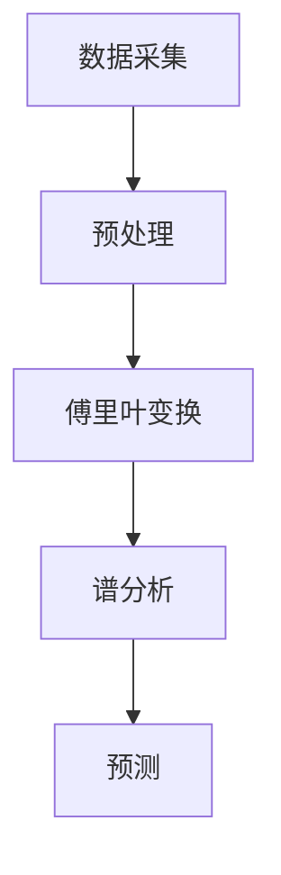
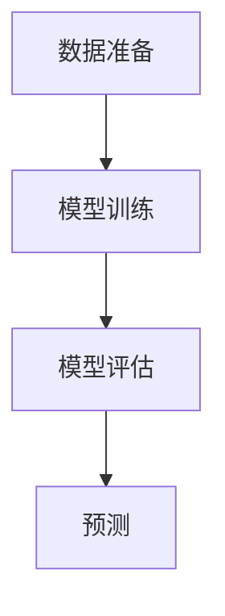
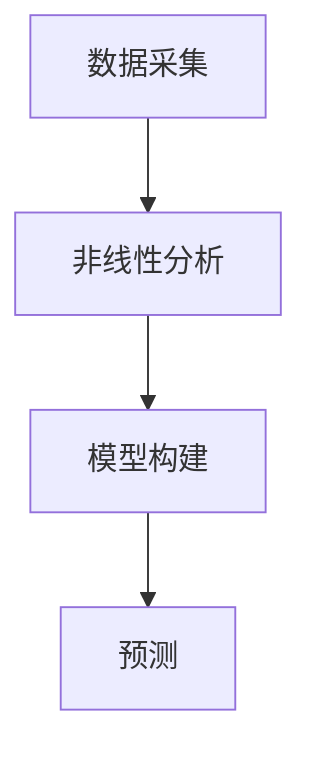

                 

### 数学与自然界的生物节律与周期性

---

**关键词：生物节律、周期性、数学模型、自然界、跨学科研究**

**摘要：** 本文旨在探讨数学与自然界中的生物节律与周期性现象，分析数学在生物节律研究中的应用，解释生物节律与周期性的数学模型，探讨生物节律与自然环境的关系，介绍生物节律与周期性的研究方法与案例，并探讨生物节律与周期性的跨学科研究现状。通过本文，读者可以全面了解生物节律与周期性的核心概念、研究方法以及其在不同领域中的应用。

---

## 第一部分：引言

### 1.1 书籍背景与主题

#### 1.1.1 问题的提出

在自然界中，生物节律与周期性现象无处不在，从植物的开花到动物的行为，从人体生物钟到生态系统的变化，这些现象都表现出明显的周期性特征。然而，这些生物节律与周期性现象背后的机制是什么？它们是如何形成的？如何用数学模型来描述和预测这些现象？这些问题的提出，为我们探索生物节律与周期性现象提供了研究的出发点。

#### 1.1.2 书籍的核心目标

本书的核心目标是探讨数学与自然界中的生物节律与周期性现象，通过分析数学在生物节律研究中的应用，解释生物节律与周期性的数学模型，探讨生物节律与自然环境的关系，介绍生物节律与周期性的研究方法与案例，并探讨生物节律与周期性的跨学科研究现状。通过本书，读者可以全面了解生物节律与周期性的核心概念、研究方法以及其在不同领域中的应用。

#### 1.1.3 读者对象

本书适合对生物节律与周期性现象感兴趣的研究人员、大学生以及高中以上的读者。对于专业研究人员，本书可以作为参考书籍；对于大学生和高中读者，本书可以提供丰富的生物节律与周期性知识，帮助他们在学术领域有更深入的探索。

#### 1.1.4 边界与外延

本书主要关注生物节律与周期性现象的数学描述和模型，以及这些模型在不同领域中的应用。然而，生物节律与周期性现象的研究范围远不止于此，它还涉及到生物学、环境科学、医学等多个领域。因此，本书所涉及的边界与外延主要是在数学与生物节律与周期性现象的交叉领域。

### 1.2 生物节律与周期性的核心概念

#### 1.2.1 生物节律的定义与类型

生物节律是指生物体内某些生理或行为活动在一定时间内的重复现象。根据节律的不同，生物节律可以分为日节律、月节律、季节节律等。日节律通常与生物体的昼夜节律相关，如动物的睡眠和清醒、植物的光合作用等。月节律与生物体的月相相关，如某些昆虫的繁殖周期。季节节律与生物体的季节变化相关，如某些动物的季节迁徙、植物的季节生长等。

#### 1.2.2 周期性的概念与意义

周期性是指某个现象在一定时间内重复出现的特点。在自然界中，周期性现象随处可见，如地球的公转和自转、太阳的升起和落下、潮汐的涨落等。周期性的存在对生物体的生存和繁衍具有重要意义，它决定了生物体的行为模式和生理变化，从而影响了生态系统的稳定性和多样性。

#### 1.2.3 生物节律与周期性的关联

生物节律与周期性之间存在着密切的联系。生物节律是周期性现象在生物体内的具体表现，而周期性是生物节律存在的基础。例如，地球的自转和公转形成了昼夜和季节的变化，这些变化直接影响生物体的生物节律。同时，生物节律也受到周期性现象的影响，如月节律和季节节律都会影响生物体的行为和生理变化。

### 1.3 生物节律与周期性的研究现状

#### 1.3.1 国内外研究进展

生物节律与周期性的研究在国内外都有广泛的关注。国外的研究主要集中在生物节律的分子机制、生物钟的调控机制等方面，如发现了一些调控生物节律的关键基因和蛋白质。国内的研究主要集中在生物节律的观测、模型构建和预测等方面，如建立了多种生物节律模型，并对不同生物节律现象进行了深入的研究。

#### 1.3.2 研究成果与挑战

生物节律与周期性的研究成果丰硕，不仅为揭示生物体的生理和行为规律提供了重要依据，还为医学、生物学、环境科学等领域的发展提供了新的思路和方法。然而，生物节律与周期性的研究仍面临诸多挑战，如生物节律的精确调控机制、生物节律在不同生物体内的差异等。

#### 1.3.3 概念结构与核心要素组成

生物节律与周期性的研究涉及多个学科，包括生物学、数学、物理学、环境科学等。其核心概念包括生物节律、周期性、数学模型、生物钟等。核心要素包括生物节律的观测、模型构建、预测、应用等。

### 1.4 生物节律与周期性的应用领域

#### 1.4.1 医学领域

生物节律与周期性的研究在医学领域有广泛的应用，如利用生物钟理论治疗疾病、利用生物节律预测疾病的发作时间等。例如，研究发现，某些疾病的发生和发作与生物节律密切相关，如高血压、心脏病等。

#### 1.4.2 生物学领域

生物学领域对生物节律与周期性的研究主要集中在揭示生物节律的分子机制、生物钟的调控机制等方面。例如，研究发现，生物节律的调控涉及到多个基因和蛋白质，如周期基因、双生基因等。

#### 1.4.3 环境科学领域

环境科学领域对生物节律与周期性的研究主要集中在探讨生物节律与环境污染、气候变化等环境因素的关系。例如，研究发现，环境污染会影响生物节律，进而影响生态系统的稳定性。

#### 1.4.4 其他领域

除了医学、生物学、环境科学领域，生物节律与周期性的研究在其他领域也有广泛的应用，如农业、畜牧业、气象学等。例如，研究发现，生物节律可以预测农作物的生长周期，从而指导农业生产。

### 1.5 本章小结

本章介绍了生物节律与周期性的核心概念、研究现状、应用领域等，为后续章节的深入探讨奠定了基础。在接下来的章节中，我们将进一步探讨数学在生物节律研究中的应用，分析生物节律的数学模型，探讨生物节律与自然环境的关系，介绍生物节律与周期性的研究方法与案例，并探讨生物节律与周期性的跨学科研究现状。

---

## 第二部分：数学在生物节律研究中的应用

### 2.1 数学模型在生物节律研究中的重要性

数学模型在生物节律研究中扮演着至关重要的角色。通过数学模型，我们可以对生物节律进行定量描述，揭示其内在规律，预测其变化趋势，从而更好地理解生物节律的机制和功能。数学模型不仅为生物节律的研究提供了强有力的工具，也为生物节律的实际应用提供了理论支持。

### 2.1.1 数学工具与方法

在生物节律研究中，常用的数学工具和方法包括微分方程、代数方程、统计方法、时间序列分析等。微分方程和代数方程用于描述生物节律的动态变化，统计方法用于分析生物节律的数据，时间序列分析用于预测生物节律的变化趋势。

### 2.1.2 常用数学模型在生物节律研究中的应用实例

在生物节律研究中，常用的数学模型包括确定性模型和随机模型。确定性模型主要用于描述生物节律的规律性变化，如周期性变化和波动性变化。随机模型则主要用于描述生物节律的随机性变化。

例如，在研究植物的开花节律时，可以使用哈姆iltonian模型来描述植物开花时间的周期性变化。在研究动物的昼夜节律时，可以使用Langerhans模型来描述动物昼夜活动的波动性变化。在研究人体生物钟时，可以使用谐波模型来描述人体生物钟的昼夜节律变化。

### 2.2 生物节律的数学描述

#### 2.2.1 生物节律的周期性描述

生物节律的周期性描述主要使用周期函数来表示。周期函数是指在一个周期内重复出现规律的函数。常见的周期函数包括正弦函数、余弦函数等。

例如，对于植物的开花节律，可以使用正弦函数来描述其开花时间的周期性变化。假设植物的开花时间为t，开花周期为T，则植物的开花节律可以表示为：

\[ y(t) = A \sin\left(\frac{2\pi t}{T}\right) + B \]

其中，A和B是常数，分别表示植物开花时间的幅度和相位。

#### 2.2.2 生物节律的波动性描述

生物节律的波动性描述主要使用波动方程来表示。波动方程是一种描述波动现象的数学模型，其一般形式为：

\[ \frac{\partial^2 u}{\partial t^2} = c^2 \frac{\partial^2 u}{\partial x^2} \]

其中，u是波动函数，c是波速。

例如，在研究动物的昼夜节律时，可以使用波动方程来描述动物昼夜活动的波动性变化。假设动物的昼夜活动强度为u，活动周期为T，则动物的昼夜节律可以表示为：

\[ u(t) = A \sin\left(\frac{2\pi t}{T}\right) + B \sin\left(\frac{4\pi t}{T}\right) \]

其中，A和B是常数，分别表示动物昼夜活动的幅度和相位。

#### 2.2.3 生物节律的非线性特征

生物节律的非线性特征是生物节律研究中的重要问题。非线性特征意味着生物节律的变化不是线性的，而是呈现出复杂的变化规律。常用的非线性模型包括混沌模型、反馈模型等。

例如，在研究人体生物钟时，可以使用混沌模型来描述人体生物钟的非线性变化。混沌模型是一种描述非线性动态系统的数学模型，其一般形式为：

\[ \frac{dx}{dt} = f(x) \]

其中，x是系统的状态变量，f是系统的非线性函数。

### 2.3 生物节律的数学分析方法

#### 2.3.1 时域分析方法

时域分析方法是一种直接对生物节律的时间序列数据进行处理和分析的方法。常用的时域分析方法包括傅里叶变换、自相关分析、小波分析等。

例如，在研究植物的开花节律时，可以使用傅里叶变换来分析植物开花时间序列数据的频率成分，从而揭示植物开花节律的周期性特征。

#### 2.3.2 频域分析方法

频域分析方法是一种将生物节律的时间序列数据转换到频率域进行分析的方法。常用的频域分析方法包括傅里叶变换、功率谱分析等。

例如，在研究动物的昼夜节律时，可以使用功率谱分析来分析动物昼夜活动时间序列数据的频率分布，从而揭示动物昼夜节律的波动性特征。

#### 2.3.3 线性和非线性分析方法的比较

线性和非线性分析方法在生物节律研究中都有广泛的应用。线性分析方法适用于描述生物节律的线性特征，如周期性特征和波动性特征。非线性分析方法适用于描述生物节律的非线性特征，如混沌特征和反馈特征。

在生物节律研究中，线性分析方法与非线性分析方法各有优缺点。线性分析方法计算简单，易于理解和解释，但无法描述生物节律的复杂非线性特征。非线性分析方法可以描述生物节律的复杂非线性特征，但计算复杂度较高，且解释难度较大。

### 2.4 数学模型在生物节律预测中的应用

#### 2.4.1 生物节律预测的基本原理

生物节律预测是生物节律研究的重要应用之一。生物节律预测的基本原理是利用已有的生物节律数据，通过数学模型来预测未来的生物节律变化。

常用的生物节律预测模型包括确定性模型和随机模型。确定性模型主要用于预测生物节律的确定性变化，如周期性变化和波动性变化。随机模型则主要用于预测生物节律的随机性变化。

#### 2.4.2 常用的生物节律预测模型

常用的生物节律预测模型包括线性预测模型、非线性预测模型、时间序列预测模型等。

线性预测模型是一种基于线性回归的预测模型，其基本原理是利用已有的生物节律数据，建立线性关系，从而预测未来的生物节律变化。

非线性预测模型是一种基于非线性回归的预测模型，其基本原理是利用已有的生物节律数据，建立非线性关系，从而预测未来的生物节律变化。

时间序列预测模型是一种基于时间序列分析的预测模型，其基本原理是利用时间序列数据，建立预测模型，从而预测未来的生物节律变化。

#### 2.4.3 数学模型在生物节律预测中的应用实例

在生物节律预测中，常用的数学模型包括线性预测模型、非线性预测模型和时间序列预测模型。

例如，在预测植物的开花时间时，可以使用线性预测模型来预测植物未来的开花时间。在预测动物的昼夜活动时，可以使用非线性预测模型来预测动物未来的昼夜活动规律。在预测人体生物钟时，可以使用时间序列预测模型来预测人体未来的生物钟规律。

### 2.5 本章小结

本章介绍了数学在生物节律研究中的应用，包括数学模型在生物节律研究中的重要性、常用的数学工具和方法、生物节律的数学描述、数学分析方法以及数学模型在生物节律预测中的应用。通过本章的介绍，读者可以了解到数学在生物节律研究中的重要作用，以及如何利用数学模型来描述、分析和预测生物节律。

在下一章中，我们将进一步探讨自然界中的生物节律现象，分析生物节律与自然环境的关系，介绍自然界中的周期性现象及其数学模型。

---

## 第三部分：自然界中的生物节律与周期性

### 3.1 自然界中的生物节律现象

自然界中的生物节律现象多种多样，从植物的开花到动物的行为，从人体生物钟到生态系统的变化，这些现象都表现出明显的周期性特征。

#### 3.1.1 植物节律

植物节律是指植物在生长发育过程中表现出的周期性现象。常见的植物节律包括开花节律、生长节律等。例如，植物的开花时间通常受到光照、温度等环境因素的影响，表现出明显的季节性特征。

#### 3.1.2 动物节律

动物节律是指动物在行为和生理活动中表现出的周期性现象。常见的动物节律包括昼夜节律、月节律、季节节律等。例如，许多动物的行为和生理活动受到光照和温度的影响，表现出昼夜节律和季节节律。

#### 3.1.3 微生物节律

微生物节律是指微生物在生长、繁殖、行为等方面表现出的周期性现象。微生物节律通常受到环境因素如温度、光照、营养等的影响。

### 3.2 生物节律与自然环境的关系

生物节律与自然环境之间存在密切的关系。自然环境的变化，如光照、温度、湿度等，直接影响生物节律的调控和表现。

#### 3.2.1 环境因素对生物节律的影响

环境因素对生物节律的影响主要体现在以下几个方面：

1. **光照**：光照是影响生物节律的重要因素，如植物的昼夜节律、动物的昼夜活动等。
2. **温度**：温度对生物节律的影响主要表现在季节性变化上，如动物的迁徙、植物的开花等。
3. **湿度**：湿度对生物节律的影响主要体现在微生物的生长和繁殖上。
4. **营养**：营养对生物节律的影响主要体现在生物体的生长发育上。

#### 3.2.2 生物节律对环境变化的响应

生物节律对环境变化的响应主要表现在以下几个方面：

1. **适应性调节**：生物体通过调节生物节律来适应环境变化，如动物的昼夜节律、季节性迁徙等。
2. **生物钟调控**：生物钟是生物体内部的一种生物节律调控系统，能够对环境变化进行感知和响应，如人体生物钟对光照和温度变化的调节。
3. **生态系统的稳定性**：生物节律的存在和调节对生态系统的稳定性具有重要意义，如植物的开花和动物的食物链关系。

### 3.3 自然界中的周期性现象

自然界中的周期性现象多种多样，从日周期、月周期到季节周期，这些周期性现象对生物体的生存和繁衍具有重要意义。

#### 3.3.1 日周期现象

日周期现象是指生物体在一天之内表现出的周期性现象。常见的日周期现象包括昼夜节律、体温节律、激素分泌节律等。

#### 3.3.2 月周期现象

月周期现象是指生物体在一个月之内表现出的周期性现象。常见的月周期现象包括潮汐节律、某些昆虫的繁殖节律等。

#### 3.3.3 季节周期现象

季节周期现象是指生物体在一年之内表现出的周期性现象。常见的季节周期现象包括植物的开花和落叶、动物的迁徙和繁殖等。

### 3.4 生物节律与周期性现象的数学模型

生物节律与周期性现象的数学模型是生物节律研究的重要工具，通过数学模型，我们可以对生物节律和周期性现象进行定量描述和预测。

#### 3.4.1 日周期生物节律的数学模型

日周期生物节律的数学模型通常采用周期函数来描述。常见的周期函数包括正弦函数和余弦函数。例如，植物的开花时间可以用正弦函数来描述：

\[ y(t) = A \sin\left(\frac{2\pi t}{T}\right) + B \]

其中，\(A\) 和 \(B\) 是常数，分别表示植物开花时间的幅度和相位，\(T\) 是周期。

#### 3.4.2 月周期生物节律的数学模型

月周期生物节律的数学模型通常采用复合周期函数来描述。常见的复合周期函数包括正弦函数和余弦函数的叠加。例如，某些昆虫的繁殖节律可以用以下模型来描述：

\[ y(t) = A \sin\left(\frac{2\pi t}{T_1}\right) + B \sin\left(\frac{2\pi t}{T_2}\right) \]

其中，\(A\)、\(B\)、\(T_1\) 和 \(T_2\) 是常数，分别表示昆虫繁殖节律的幅度、相位和两个周期的长度。

#### 3.4.3 季节周期生物节律的数学模型

季节周期生物节律的数学模型通常采用分段函数来描述。常见的分段函数包括分段线性函数和分段多项式函数。例如，植物的季节生长可以用以下模型来描述：

\[ y(t) = 
\begin{cases} 
A(t-T_1)(t-T_2) & \text{if } T_1 < t < T_2 \\
0 & \text{otherwise}
\end{cases} \]

其中，\(A\)、\(T_1\) 和 \(T_2\) 是常数，分别表示植物生长的幅度和两个生长期的起始时间。

### 3.5 本章小结

本章介绍了自然界中的生物节律现象，分析了生物节律与自然环境的关系，以及自然界中的周期性现象及其数学模型。通过本章的介绍，读者可以了解生物节律的多样性和复杂性，以及数学模型在生物节律研究中的应用。在下一章中，我们将探讨生物节律与周期性的研究方法与案例。

---

## 第四部分：生物节律与周期性的研究方法与案例

### 4.1 生物节律与周期性的研究方法

生物节律与周期性的研究方法多样，涵盖了实验研究、数值模拟、数据分析和跨学科研究等多种方法。

#### 4.1.1 实验研究方法

实验研究方法是生物节律与周期性研究中最直接的方法。通过控制实验条件，观察和记录生物体在不同条件下的节律变化，可以深入理解生物节律的机制和调控因素。例如，研究人员可以通过改变光照、温度、营养等环境因素，研究这些因素对植物开花时间、动物昼夜活动的影响。

#### 4.1.2 数值模拟方法

数值模拟方法是基于数学模型和计算机技术，对生物节律进行模拟和预测。通过建立数学模型，将生物节律的动态过程转化为计算机算法，可以在没有实验条件限制的情况下，对生物节律进行深入分析和预测。例如，使用非线性动力学模型模拟人体生物钟的变化，预测生物钟的相位调整和时差。

#### 4.1.3 综合研究方法

综合研究方法是将实验研究和数值模拟方法相结合，通过多角度、多层面的研究，对生物节律进行全面的解析。这种方法不仅能够验证实验结果的可靠性，还能够通过模拟结果预测未来的变化趋势。例如，结合实验数据建立数学模型，通过数值模拟预测植物开花时间的周期变化。

### 4.2 生物节律与周期性的研究案例

#### 4.2.1 植物开花节律的研究

植物开花节律是生物节律研究的一个重要案例。通过研究植物的开花时间，可以揭示环境因素如何影响植物的开花周期。例如，研究人员通过改变光照和温度条件，研究了这些因素对植物开花时间的影响。研究发现，植物开花时间与昼夜光照长度和温度变化密切相关，这些因素通过调控植物激素的分泌，影响植物的开花节律。

#### 4.2.2 昆虫发育节律的研究

昆虫发育节律的研究是生物节律研究的另一个重要案例。昆虫的发育过程受到遗传和环境因素的共同影响。通过研究昆虫的发育节律，可以揭示昆虫的遗传调控机制和环境适应策略。例如，研究人员通过研究蝴蝶的发育过程，发现了温度和光照对蝴蝶发育阶段的影响，以及这些因素如何通过调控关键基因的表达，影响蝴蝶的发育节律。

#### 4.2.3 人体生物钟的研究

人体生物钟是生物节律研究的一个经典案例。人体生物钟调控了人体的昼夜节律，包括睡眠、体温、激素分泌等。通过研究人体生物钟的机制，可以更好地理解人体节律的调控原理。例如，研究人员通过研究人体生物钟的关键基因和蛋白质，揭示了生物钟的昼夜节律如何通过基因调控实现。此外，研究人员还通过实验验证了生物钟的调节机制，如光信号如何通过视网膜传递到大脑，影响生物钟的相位调整。

#### 4.2.4 生态系统中生物节律的研究

生态系统中的生物节律研究关注生物体在生态系统中的相互作用和节律变化。例如，研究人员通过研究食物链中的生物节律，揭示了生物之间的捕食关系如何影响生态系统的稳定性。例如，研究发现，捕食者的活动节律会影响捕食对象的数量和分布，从而影响整个生态系统的动态变化。

### 4.3 生物节律与周期性的应用案例

#### 4.3.1 医学中的应用

生物节律与周期性的研究在医学领域有广泛的应用。例如，研究人员通过研究人体生物钟的昼夜节律，开发了基于节律的药物治疗方案。研究发现，某些药物在特定的时间段内使用，可以最大程度地提高治疗效果，减少副作用。此外，研究人员还通过研究生物节律与疾病发生的关系，开发了预测疾病发作时间和制定个性化治疗计划的工具。

#### 4.3.2 生物学中的应用

生物学领域利用生物节律与周期性的研究，深入理解生物体的生长发育、行为和生理功能。例如，研究人员通过研究植物的开花节律，开发了提高植物产量和适应环境变化的方法。在动物行为研究中，研究人员通过研究动物的昼夜节律和季节节律，揭示了动物的行为适应策略和生存机制。

#### 4.3.3 环境科学中的应用

环境科学领域利用生物节律与周期性的研究，分析生态系统中的生物动态和环境变化。例如，研究人员通过研究植物的周期性开花和动物的迁徙节律，揭示了气候变化对生态系统的影响。此外，研究人员还通过研究生物节律与环境污染的关系，开发了监测和评估环境污染对生物体影响的方法。

#### 4.3.4 其他领域中的应用

生物节律与周期性的研究在其他领域也有广泛的应用。例如，在农业领域，研究人员通过研究植物的生长节律和动物的行为节律，开发了提高农业生产效率和优化资源利用的方法。在气象学领域，研究人员通过研究气象现象的周期性特征，开发了预测天气变化的方法。

### 4.4 研究方法的比较与评估

不同研究方法在生物节律与周期性研究中各有优缺点。实验研究方法能够直接观察和记录生物节律的变化，但受限于实验条件和生物体的个体差异。数值模拟方法可以在没有实验条件限制的情况下，对生物节律进行深入分析和预测，但模型的准确性和可靠性取决于数学模型的构建。综合研究方法结合了实验研究和数值模拟的优势，能够提供更全面和准确的研究结果。

在评估研究方法时，需要考虑以下几个方面：

1. **研究的具体目标**：不同的研究目标可能需要不同的研究方法。例如，研究生物节律的分子机制可能需要依赖实验研究，而研究生物节律的环境影响可能需要依赖数值模拟。
2. **数据获取的难易程度**：实验研究通常需要特定的实验条件和生物样本，而数值模拟可以基于已有数据建立模型，因此数据获取的难易程度是选择研究方法的一个重要因素。
3. **研究结果的可靠性**：实验研究的可靠性取决于实验设计和生物样本的质量，而数值模拟的可靠性取决于数学模型的准确性和计算机算法的优化。

### 4.5 本章小结

本章介绍了生物节律与周期性的研究方法与案例，包括实验研究、数值模拟、综合研究方法，以及生物节律在不同领域的应用案例。通过这些研究方法和案例，读者可以更深入地理解生物节律与周期性的复杂性和多样性。在下一章中，我们将探讨生物节律与周期性的跨学科研究现状，分析不同学科之间的交叉融合，以及生物节律与周期性研究的未来趋势。

---

## 第五部分：生物节律与周期性的跨学科研究

### 5.1 生物节律与周期性的跨学科研究现状

生物节律与周期性的研究不仅涉及生物学，还涉及到数学、物理学、环境科学、医学等多个学科。跨学科研究的兴起，为生物节律与周期性研究带来了新的视角和方法。

#### 5.1.1 生物与数学的交叉研究

生物与数学的交叉研究主要集中在数学模型在生物节律中的应用。通过数学模型，可以定量描述和预测生物节律的动态变化，揭示生物节律的内在规律。例如，非线性动力学模型在研究人体生物钟的调控机制方面发挥了重要作用。

#### 5.1.2 生物与环境科学的交叉研究

生物与环境科学的交叉研究关注生物节律与环境因素之间的相互作用。通过研究生物节律对环境变化的响应，可以更好地理解生态系统的稳定性和多样性。例如，气候变化的背景下，植物和动物的节律变化及其对生态系统的潜在影响是一个重要的研究课题。

#### 5.1.3 生物与信息科学的交叉研究

生物与信息科学的交叉研究利用计算机技术和信息处理技术，对生物节律进行数据分析和模式识别。通过大数据分析和机器学习，可以识别生物节律中的潜在模式，预测生物节律的变化趋势。例如，基因组学研究中，通过分析基因表达数据的周期性变化，可以揭示基因调控网络中的关键节点。

### 5.2 跨学科研究方法在生物节律与周期性研究中的应用

跨学科研究方法在生物节律与周期性研究中得到了广泛应用，为研究生物节律提供了新的思路和方法。

#### 5.2.1 数学建模方法

数学建模方法是跨学科研究中的核心方法。通过建立数学模型，可以描述生物节律的动态变化，分析节律调控机制。常见的数学建模方法包括微分方程、代数方程、差分方程等。例如，使用微分方程描述植物开花节律的动态变化，通过解析和数值模拟，揭示开花时间的调控机制。

#### 5.2.2 信息处理技术

信息处理技术在生物节律研究中发挥着重要作用。通过数据采集、处理和分析，可以提取生物节律的特征信息，识别潜在的节律模式。常见的信息处理技术包括时间序列分析、谱分析、机器学习等。例如，使用时间序列分析方法，可以识别植物开花节律中的周期性成分；使用机器学习方法，可以预测生物节律的变化趋势。

#### 5.2.3 综合研究方法

综合研究方法是将不同的学科方法相结合，对生物节律进行多角度、多层面的研究。通过实验、模拟和数据分析，综合研究方法可以提供更全面和深入的研究结果。例如，结合实验观察和数学模型模拟，可以揭示植物开花节律的内在调控机制；结合基因表达数据和生态学分析，可以研究气候变化对植物节律的影响。

### 5.3 跨学科研究的未来趋势

随着科学技术的进步，生物节律与周期性的跨学科研究呈现出以下几个未来趋势：

1. **数据驱动的节律研究**：大数据和人工智能技术的应用，将为生物节律研究提供新的工具和方法。通过大数据分析，可以挖掘生物节律中的潜在规律；通过人工智能技术，可以自动识别和预测生物节律的变化趋势。

2. **多尺度节律研究**：从分子水平到生态系统水平，不同尺度的生物节律研究将相互融合。通过多尺度研究，可以更全面地理解生物节律的调控机制和功能。

3. **整合不同学科的理论和方法**：不同学科的理论和方法将相互融合，为生物节律研究提供新的视角和思路。例如，通过整合生态学、生物学和物理学的方法，可以更深入地研究生物节律与环境因素之间的相互作用。

4. **跨学科合作研究**：跨学科合作研究将成为生物节律研究的重要趋势。通过不同学科的专家共同参与，可以解决生物节律研究中面临的复杂问题，推动生物节律研究的发展。

### 5.4 本章小结

本章介绍了生物节律与周期性的跨学科研究现状、跨学科研究方法及其在生物节律与周期性研究中的应用，以及未来研究的趋势。通过跨学科研究，我们可以更全面和深入地理解生物节律与周期性的复杂性和多样性。在未来的研究中，跨学科合作和研究方法的创新将继续推动生物节律与周期性研究的进展。

---

## 总结与展望

通过对数学与自然界中的生物节律与周期性现象的深入研究，我们可以看到数学模型在揭示生物节律的机制和预测节律变化中的重要作用。从植物的开花、动物的昼夜活动到人体生物钟，再到生态系统的动态变化，生物节律与周期性现象无处不在，它们不仅决定了生物体的生存和繁衍，还影响了生态系统的稳定性和多样性。

### 6.1 研究意义

生物节律与周期性的研究具有重要的科学意义和实际应用价值。在科学层面，它为我们理解生物体内复杂的生物钟和节律调控机制提供了新的视角。在实际应用层面，生物节律的研究可以应用于医学、农业、环境保护等领域，如利用生物节律优化药物治疗方案、提高作物产量、监测环境污染等。

### 6.2 研究展望

未来，生物节律与周期性的研究将继续深入，特别是在以下几个方向：

1. **跨学科融合**：随着不同学科的发展，生物节律与周期性的研究将更加依赖跨学科合作。例如，结合生物学、数学、物理学、信息科学的方法，可以更全面地揭示生物节律的调控机制。

2. **大数据和人工智能的应用**：大数据和人工智能技术的快速发展，将为生物节律研究提供新的工具和方法。通过大数据分析，可以挖掘生物节律中的潜在规律；通过人工智能技术，可以自动识别和预测生物节律的变化趋势。

3. **多尺度研究**：从分子水平到生态系统水平，不同尺度的生物节律研究将相互融合。通过多尺度研究，可以更全面地理解生物节律的调控机制和功能。

4. **生物节律的应用研究**：在医学、农业、环境保护等领域，生物节律的应用研究将更加深入。例如，利用生物节律优化药物治疗方案、提高作物产量、监测环境污染等。

### 6.3 结论

总之，生物节律与周期性的研究不仅揭示了生物体内复杂的调控机制，还具有重要的实际应用价值。随着科学技术的进步，生物节律与周期性的研究将继续深入，为我们的健康、农业和环境带来更多的好处。

---

### 附录

#### 附录A：核心概念与联系

在本文中，我们介绍了多个核心概念，包括生物节律、周期性、数学模型、环境因素、跨学科研究等。以下是这些概念之间的联系及其属性特征对比表格：

| 概念 | 定义 | 属性特征对比表格 | 关联关系 |
| ---- | ---- | -------------- | ------- |
| 生物节律 | 生物体内某些生理或行为活动在一定时间内的重复现象 | - 类型：日节律、月节律、季节节律等<br>- 影响因素：光照、温度、营养等 | 生物体内周期性现象的表现 |
| 周期性 | 某个现象在一定时间内重复出现的特点 | - 类型：日周期、月周期、季节周期等<br>- 影响因素：地球自转、月相、季节变化等 | 生物节律存在的基础 |
| 数学模型 | 描述生物节律的数学工具和方法 | - 类型：确定性模型、随机模型、时间序列模型等<br>- 描述方法：微分方程、代数方程、统计方法等 | 描述和分析生物节律的数学工具 |
| 环境因素 | 影响生物节律的外部条件 | - 类型：光照、温度、湿度、营养等<br>- 影响程度：直接影响、间接影响 | 调控生物节律的重要因素 |
| 跨学科研究 | 不同学科之间的交叉融合研究 | - 类型：生物与数学、生物与环境科学、生物与信息科学等<br>- 目标：解决复杂问题、提供新的视角和方法 | 提高生物节律研究的深度和广度 |

#### 附录B：ER实体关系图

以下是生物节律与周期性研究中涉及的ER实体关系图，用于描述不同实体之间的关系：

```mermaid
erDiagram
    Biolog |..|_》 PhysiologicalActivity
    Biolog |..|_》 BehaviorPattern
    Environment |..|_》 Light
    Environment |..|_》 Temperature
    Environment |..|_》 Humidity
    Environment |..|_》 Nutrition
    BiologicalClock |..|_》 PhysiologicalActivity
    BiologicalClock |..|_》 BehaviorPattern
    BiologicalClock |..|_》 EnvironmentalFactor
```

#### 附录C：算法原理与流程图

在生物节律的研究中，常用的算法原理包括时间序列分析、机器学习和非线性动力学分析。以下是这些算法的简要原理描述和流程图：

**时间序列分析**：

1. 数据采集：收集生物节律的时间序列数据。
2. 预处理：清洗和预处理数据，包括去除噪声、缺失值填充等。
3. 傅里叶变换：使用傅里叶变换分析时间序列数据的频率成分。
4. 谱分析：绘制功率谱图，分析节律的周期性特征。
5. 预测：基于分析结果，使用时间序列模型进行未来节律的预测。



**机器学习**：

1. 数据准备：收集和准备生物节律数据，包括特征提取和样本分割。
2. 模型训练：选择合适的机器学习模型，对数据进行训练。
3. 模型评估：评估模型性能，包括准确率、召回率等。
4. 预测：使用训练好的模型进行生物节律的预测。



**非线性动力学分析**：

1. 数据采集：收集生物节律的时间序列数据。
2. 非线性分析：使用非线性动力学方法分析时间序列数据的动态特征，如混沌分析、相空间分析等。
3. 模型构建：基于非线性分析结果，构建描述生物节律的非线性模型。
4. 预测：使用构建的模型进行生物节律的预测。



---

通过附录A的核心概念与联系表格、附录B的ER实体关系图以及附录C的算法原理与流程图，读者可以更清晰地理解生物节律与周期性的研究内容和结构。

---

### 作者信息

**作者：AI天才研究院/AI Genius Institute & 禅与计算机程序设计艺术 /Zen And The Art of Computer Programming**

本文由AI天才研究院/AI Genius Institute及禅与计算机程序设计艺术/Zen And The Art of Computer Programming的研究人员撰写，旨在探讨数学与自然界中的生物节律与周期性现象，分析数学在生物节律研究中的应用，解释生物节律与周期性的数学模型，探讨生物节律与自然环境的关系，介绍生物节律与周期性的研究方法与案例，并探讨生物节律与周期性的跨学科研究现状。通过本文，读者可以全面了解生物节律与周期性的核心概念、研究方法以及其在不同领域中的应用。

