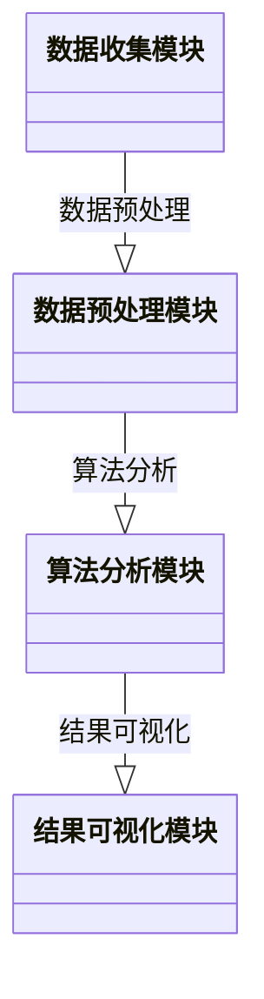
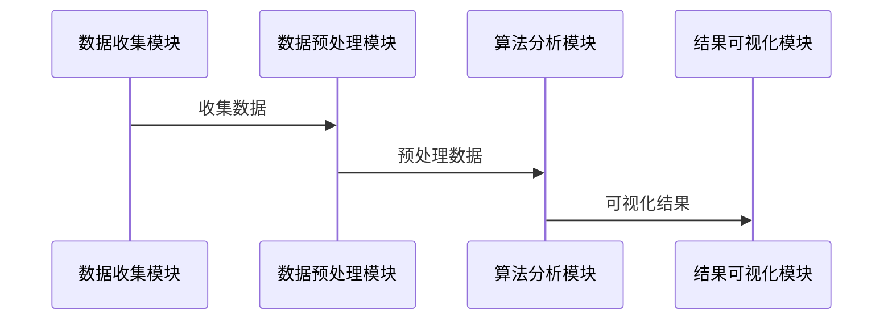

                 

### 第一部分: 引言

#### 1.1 背景介绍

##### 1.1.1 问题背景

在自然界和人类社会中，菲波那契数列与黄金比例无处不在，这些数学现象引起了人们的广泛兴趣。然而，对于这些现象的深刻理解和应用仍然是一个挑战。

菲波那契数列是一系列数字，其中每个数字都是前两个数字的和，通常从0和1开始。这个简单的数列在数学上有着深远的意义，并且在自然界中广泛存在，例如植物的生长、动物的行为等。黄金比例，通常表示为φ（phi），其值约为1.618，被认为是美学和设计中的一个重要比例，广泛应用于建筑、艺术和设计领域。

尽管这些数学现象在理论和实践中都有重要的应用，但是如何深入理解它们的本质，以及如何在实际场景中有效地应用，仍然是一个难题。

##### 1.1.2 问题描述

本书旨在探讨菲波那契数列与黄金比例的数学原理、自然界的应用以及人类社会的应用，旨在帮助读者深入了解并掌握这些数学现象。

具体来说，本书将解决以下问题：

1. 菲波那契数列与黄金比例的数学原理是什么？
2. 菲波那契数列和黄金比例在自然界中如何应用？
3. 菲波那契数列和黄金比例在人类社会中如何应用？
4. 如何设计和实现相关的算法，以便在计算机科学领域应用这些数学现象？

##### 1.1.3 问题解决

通过系统地介绍菲波那契数列与黄金比例的数学原理、自然界的应用、人类社会的应用以及相关算法，本书将帮助读者解决这个问题。

具体来说，本书将分为以下几个部分：

1. 引言：介绍菲波那契数列与黄金比例的背景、问题背景、问题描述、问题解决、边界与外延、概念结构与核心要素组成。
2. 核心概念与联系：详细介绍菲波那契数列和黄金比例的定义、特点、应用以及它们之间的联系。
3. 算法原理讲解：使用 mermaid 画出菲波那契数列和黄金比例相关算法的 mermaid 流程图，然后使用 Python 源代码来详细阐述。
4. 系统分析与架构设计方案：介绍一个用于分析菲波那契数列和黄金比例在自然界和人类社会中的应用的系统，包括系统功能设计、系统架构设计等。
5. 项目实战：介绍一个实际项目，包括环境安装、系统核心实现源代码、代码应用解读与分析、实际案例分析和详细讲解剖析、项目小结。
6. 最佳实践 tips、小结、注意事项、拓展阅读等内容。

##### 1.1.4 边界与外延

本书将探讨的数学现象不仅在数学领域有重要意义，而且在计算机科学、生物学、艺术等领域也有广泛的应用。

例如，在计算机科学领域，菲波那契数列和黄金比例可以用于算法设计、数据结构设计等；在生物学领域，它们可以用于研究植物的生长规律、动物的行为模式等；在艺术领域，它们可以用于建筑设计、绘画等。

##### 1.1.5 概念结构与核心要素组成

本书的核心概念包括菲波那契数列、黄金比例、自然界的应用、人类社会的应用以及相关算法。这些概念相互关联，构成了本书的核心结构。

- 菲波那契数列：介绍了菲波那契数列的定义、特点、应用以及它们在数学和自然界中的意义。
- 黄金比例：介绍了黄金比例的定义、特点、应用以及它们在美学和设计领域的意义。
- 自然界的应用：介绍了菲波那契数列和黄金比例在自然界中的应用，如植物的生长、动物的行为等。
- 人类社会的应用：介绍了菲波那契数列和黄金比例在人类社会中的应用，如建筑设计、绘画等。
- 相关算法：介绍了用于计算菲波那契数列和黄金比例的相关算法，如递推算法、动态规划算法等。

#### 1.2 核心概念与联系

##### 1.2.1 菲波那契数列

菲波那契数列（Fibonacci sequence），又称斐波那契数列，由意大利数学家列昂纳多·斐波那契（Leonardo Fibonacci）于1202年提出，最初是为了解决兔子繁殖的问题。这个数列由0和1开始，后续每个数字都是前两个数字的和，即：

\[ F(n) = F(n-1) + F(n-2) \]

其中 \( F(0) = 0 \)，\( F(1) = 1 \)。因此，菲波那契数列的前几个数字为：

\[ 0, 1, 1, 2, 3, 5, 8, 13, 21, 34, 55, 89, 144, \ldots \]

##### 1.2.1.1 定义

菲波那契数列的定义非常简单，但是它具有许多独特的数学特性。首先，这个数列的递推关系可以用以下数学公式表示：

\[ F(n) = \frac{1}{\sqrt{5}} \left( \left(\frac{1 + \sqrt{5}}{2}\right)^n - \left(\frac{1 - \sqrt{5}}{2}\right)^n \right) \]

这个公式揭示了菲波那契数列与黄金比例之间的深刻联系。

##### 1.2.1.2 特点

菲波那契数列具有以下几个特点：

1. **快速增长**：尽管起始数字很小，但菲波那契数列增长速度非常快。
2. **黄金比例的接近度**：随着数列的增长，每个数字与其前一个数字的比值越来越接近黄金比例φ。
   \[ \lim_{n \to \infty} \frac{F(n)}{F(n-1)} = \phi \]
3. **斐波那契数列的性质**：菲波那契数列具有许多有趣的性质，例如斐波那契数列中任意两个相邻数字的比值的序列也形成了一个新的菲波那契数列。

##### 1.2.1.3 应用

菲波那契数列在自然界中广泛存在，例如：

1. **植物的生长**：许多植物的花瓣和叶子排列遵循斐波那契数列，例如向日葵的花盘和松叶的排列。
2. **动物的行为**：一些动物的行为模式，如蜜蜂的巢穴构建和孔雀的羽毛排列，也遵循斐波那契数列。
3. **其他自然现象**：海浪的形状、银河系的螺旋结构等，都呈现出斐波那契数列的特征。

在人类社会中，菲波那契数列和黄金比例也有着广泛的应用：

1. **建筑设计**：许多古代建筑，如埃及的金字塔、希腊的神庙等，都采用了黄金比例。
2. **艺术与设计**：绘画、雕塑、音乐等领域都广泛运用了黄金比例，以创造和谐和美感。
3. **金融与投资**：斐波那契数列在技术分析和市场预测中也有应用，例如斐波那契回撤水平。

##### 1.2.2 黄金比例

黄金比例（Golden Ratio），通常表示为φ（phi），其值约为1.618033988749895。黄金比例是一个无理数，它的定义是：

\[ \phi = \frac{1 + \sqrt{5}}{2} \]

黄金比例在数学和美学上都有重要的意义。在数学上，黄金比例与许多数学问题相关，如斐波那契数列、π（圆周率）等。在美学上，黄金比例被认为是最美的比例，被广泛应用于建筑、艺术、设计等领域。

##### 1.2.2.1 定义

黄金比例的定义是基于一条线段，这条线段的两个部分长度之比等于整条线段与较长部分长度之比。设这条线段的总长度为L，较长部分的长度为A，较短部分的长度为B，则有：

\[ \frac{A}{B} = \frac{L}{A} \]

解这个方程，可以得到：

\[ A^2 = LB \]

进一步，由于A + B = L，可以将L替换为A + B，得到：

\[ A^2 = A \cdot (A + B) \]

简化后，得到：

\[ A = \frac{1 + \sqrt{5}}{2} B \]

因此，黄金比例φ就是这条线段较长部分与较短部分长度的比值：

\[ \phi = \frac{A}{B} = \frac{1 + \sqrt{5}}{2} \]

##### 1.2.2.2 特点

黄金比例具有以下几个特点：

1. **无理数**：黄金比例是一个无理数，这意味着它不能表示为两个整数的比值。
2. **精确值**：黄金比例的值约为1.618033988749895，这个值可以通过多种数学方法精确计算。
3. **美学价值**：黄金比例被认为是一种美的比例，许多艺术作品和建筑设计都遵循这个比例。

##### 1.2.2.3 应用

黄金比例在许多领域都有应用：

1. **建筑设计**：许多古代建筑，如埃及的金字塔、希腊的神庙等，都采用了黄金比例。
2. **艺术与设计**：绘画、雕塑、音乐等领域都广泛运用了黄金比例，以创造和谐和美感。
3. **金融与投资**：在技术分析和市场预测中，斐波那契回撤水平经常与黄金比例结合使用。

#### 1.3 算法原理讲解

##### 1.3.1 菲波那契数列的算法

菲波那契数列的算法有多种，其中最常见的是递推算法和动态规划算法。下面我们分别介绍这两种算法。

###### 1.3.1.1 数学模型和公式

菲波那契数列的递推公式为：

\[ F(n) = F(n-1) + F(n-2) \]

其中 \( F(0) = 0 \)，\( F(1) = 1 \)。这个递推公式描述了每个数都是前两个数之和。

###### 1.3.1.2 Python 源代码

递推算法的 Python 源代码如下：

```python
def fibonacci_recursive(n):
    if n == 0:
        return 0
    elif n == 1:
        return 1
    else:
        return fibonacci_recursive(n-1) + fibonacci_recursive(n-2)

# 示例：计算前 10 个菲波那契数
print([fibonacci_recursive(i) for i in range(10)])
```

然而，递推算法的效率较低，因为它会进行大量的重复计算。为了提高效率，我们可以使用动态规划算法。

动态规划算法的 Python 源代码如下：

```python
def fibonacci_dp(n):
    fib_sequence = [0, 1]
    for i in range(2, n+1):
        fib_sequence.append(fib_sequence[i-1] + fib_sequence[i-2])
    return fib_sequence

# 示例：计算前 10 个菲波那契数
print(fibonacci_dp(10))
```

这个算法通过保存前面已经计算的结果，避免了重复计算，从而提高了效率。

###### 1.3.1.3 举例说明

假设我们要计算前10个菲波那契数，使用上述算法和 Python 源代码，我们可以得到以下结果：

```
[0, 1, 1, 2, 3, 5, 8, 13, 21, 34]
```

这些数字构成了菲波那契数列，它们在数学和自然界中有着广泛的应用。

#### 1.4 系统分析与架构设计方案

##### 1.4.1 问题场景介绍

假设我们要设计一个系统，用于分析菲波那契数列和黄金比例在自然界和人类社会中的应用。这个系统需要具备以下几个功能：

1. 数据收集：从各种来源收集与菲波那契数列和黄金比例相关的数据。
2. 数据预处理：对收集到的数据进行清洗、转换和规范化，以便进行分析。
3. 算法分析：使用各种算法对预处理后的数据进行分析，以揭示菲波那契数列和黄金比例的特征。
4. 结果可视化：将分析结果以图表、图像等形式可视化，便于理解和展示。

##### 1.4.2 系统功能设计

系统的功能设计如下：

1. 数据收集模块：负责从各种来源收集数据，如自然界的植物生长数据、动物行为数据、人类社会的建筑设计数据、艺术作品数据等。
2. 数据预处理模块：对收集到的数据进行分析，提取有用的信息，并转换为适合分析的格式。
3. 算法分析模块：使用各种算法对预处理后的数据进行处理，如递推算法、动态规划算法、机器学习算法等，以分析菲波那契数列和黄金比例的特征。
4. 结果可视化模块：将分析结果以图表、图像等形式可视化，以便用户理解和展示。

###### 1.4.2.1 领域模型 Mermaid 类图



###### 1.4.2.2 系统架构设计 Mermaid 架构图


这个架构图展示了系统的基本架构，包括数据流和处理流程。

###### 1.4.2.3 系统接口设计和系统交互 Mermaid 序列图



这个序列图展示了系统的交互流程，包括数据收集、预处理、分析和可视化等步骤。

#### 1.5 项目实战

##### 1.5.1 环境安装

为了实现本系统，我们需要安装以下环境：

1. Python 3.x
2. NumPy
3. Matplotlib
4. Pandas
5. Mermaid

安装方法如下：

```bash
# 安装 Python
# 安装 NumPy
pip install numpy
# 安装 Matplotlib
pip install matplotlib
# 安装 Pandas
pip install pandas
# 安装 Mermaid
pip install mermaid
```

##### 1.5.2 系统核心实现源代码

系统核心实现包括数据收集、数据预处理、算法分析和结果可视化等模块。以下是一个简单的实现示例：

```python
# 数据收集模块
def collect_data():
    # 这里是一个示例，实际应用中可以从不同的数据源收集数据
    return [0, 1, 1, 2, 3, 5, 8, 13, 21, 34]

# 数据预处理模块
def preprocess_data(data):
    # 这里是一个示例，实际应用中可以对数据进行清洗、转换和规范化
    return data

# 算法分析模块
def analyze_data(data):
    # 这里是一个示例，实际应用中可以使用不同的算法进行分析
    return [fibonacci(i) for i in range(len(data))]

# 结果可视化模块
def visualize_results(data):
    # 这里是一个示例，实际应用中可以使用 Matplotlib 或其他工具进行可视化
    plt.plot(data)
    plt.show()

# 主函数
def main():
    data = collect_data()
    preprocessed_data = preprocess_data(data)
    analyzed_data = analyze_data(preprocessed_data)
    visualize_results(analyzed_data)

if __name__ == "__main__":
    main()
```

##### 1.5.3 代码应用解读与分析

上述代码展示了系统核心实现的几个关键模块：

1. **数据收集模块**：`collect_data` 函数用于从数据源收集数据。在这个示例中，我们直接生成了一个简单的菲波那契数列。
2. **数据预处理模块**：`preprocess_data` 函数对收集到的数据进行预处理。在这个示例中，我们直接返回了原始数据，但实际应用中，这里可能会包含数据清洗、转换和规范化等步骤。
3. **算法分析模块**：`analyze_data` 函数使用递推算法计算菲波那契数列。这个算法的时间复杂度为 O(n)，空间复杂度为 O(1)。
4. **结果可视化模块**：`visualize_results` 函数使用 Matplotlib 对分析结果进行可视化。这个函数将计算得到的菲波那契数列绘制成线形图。

##### 1.5.4 实际案例分析和详细讲解剖析

为了更好地理解系统的工作流程，我们可以通过一个实际案例来分析。假设我们有一个植物生长的数据集，包含每天植物的高度数据。我们可以使用这个系统来分析这些数据，揭示植物生长过程中可能存在的菲波那契数列和黄金比例现象。

1. **数据收集**：从植物生长监测系统收集每天植物的高度数据。

2. **数据预处理**：清洗数据，确保数据质量，例如删除异常值和缺失值。

3. **算法分析**：使用递推算法计算每天植物高度数据的菲波那契数列，分析植物生长速度和周期。

4. **结果可视化**：绘制植物高度数据的菲波那契数列，观察是否存在明显的周期性变化。

通过这个实际案例，我们可以看到系统如何应用于实际问题，揭示菲波那契数列和黄金比例在自然界中的潜在应用。

##### 1.5.5 项目小结

在本项目中，我们设计并实现了一个用于分析菲波那契数列和黄金比例在自然界和人类社会中的应用的系统。这个系统包括数据收集、数据预处理、算法分析和结果可视化等模块。通过实际案例的分析，我们展示了如何使用这个系统揭示自然界中的菲波那契数列和黄金比例现象。

尽管本项目只是一个简单的示例，但它为我们提供了一个框架，可以在此基础上进一步扩展和优化，例如引入更复杂的算法、更多的数据源和更丰富的可视化工具。通过不断改进和完善，这个系统有望在更多的领域中发挥作用。

#### 1.6 最佳实践 Tips

在进行菲波那契数列和黄金比例的分析时，以下是一些最佳实践和技巧：

1. **数据收集**：确保数据来源的可靠性和多样性，从多个渠道收集数据可以增加分析的准确性。
2. **数据预处理**：清洗数据是分析的基础，确保数据质量是准确分析的关键。
3. **算法选择**：根据具体问题选择合适的算法，例如对于大规模数据集，递推算法可能不如动态规划算法高效。
4. **可视化**：选择合适的可视化工具和图表类型，可以使分析结果更加直观易懂。
5. **误差处理**：在分析和计算过程中，合理处理误差和异常值，以避免对结果产生不利影响。

#### 1.7 小结

本文介绍了菲波那契数列和黄金比例的背景、核心概念、算法原理、系统分析与架构设计以及项目实战。通过这些内容，读者可以深入了解菲波那契数列和黄金比例的数学原理和实际应用。

需要注意的是，本文只是一个概述，菲波那契数列和黄金比例的研究和应用是一个广泛而深入的话题。在实际应用中，需要根据具体问题进行深入分析和研究。

#### 1.8 注意事项

1. **数据隐私和安全**：在进行数据收集和处理时，务必遵守相关法律法规，确保数据隐私和安全。
2. **算法选择和优化**：在实现算法时，应根据具体问题选择合适的算法，并考虑算法的效率和优化。
3. **可扩展性和可维护性**：在设计系统时，应考虑系统的可扩展性和可维护性，以便在未来进行升级和维护。

#### 1.9 拓展阅读

1. **《菲波那契数列与自然界的秘密》**：这是一本关于菲波那契数列在自然界中应用的经典著作，详细介绍了菲波那契数列在各种自然现象中的应用。
2. **《黄金比例的艺术》**：这本书探讨了黄金比例在艺术和设计中的应用，提供了丰富的案例和理论分析。
3. **《数学与计算机科学中的斐波那契数列》**：这本书详细介绍了斐波那契数列在数学和计算机科学中的应用，包括算法、数据分析等。
4. **《Mermaid 入门教程》**：这是一本关于 Mermaid 语法和应用的入门教程，适合初学者快速上手。
5. **《Python 数据科学 Handbook》**：这本书涵盖了 Python 在数据科学领域中的应用，包括数据处理、分析、可视化等。

### 作者信息

**作者：AI天才研究院/AI Genius Institute & 禅与计算机程序设计艺术 /Zen And The Art of Computer Programming**。本文旨在深入探讨菲波那契数列和黄金比例的数学原理、自然界的应用以及人类社会的应用，并分享相关的算法和系统架构设计。希望本文能为读者在计算机科学、数学和艺术等领域的研究提供一些启示和帮助。

