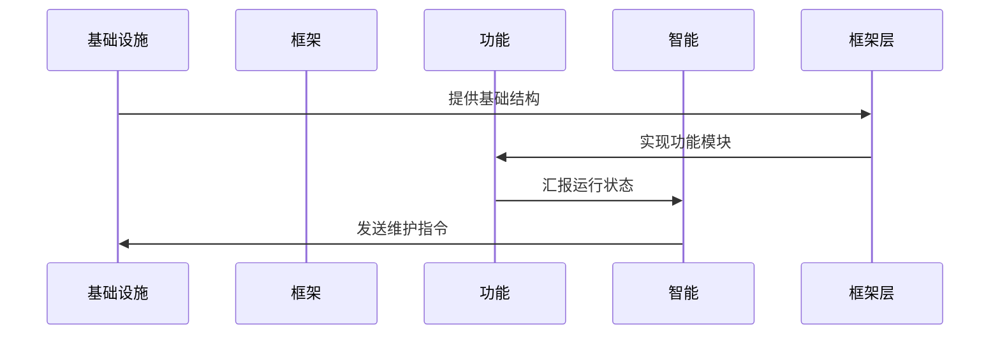
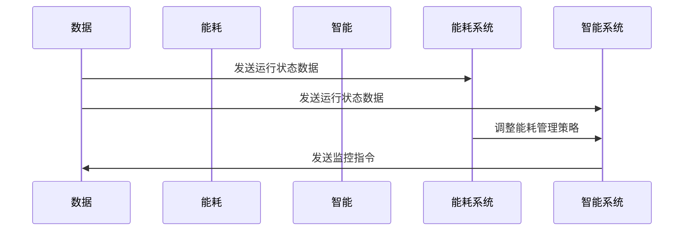

                 

### 引言

**关键词**：数学、自然界、螺旋结构、黄金分割

**摘要**：本文探讨了数学与自然界中螺旋结构和黄金分割的深刻联系。通过逐步分析，我们从数学基础入手，深入解析螺旋结构的数学描述，以及黄金分割的起源和应用。文章进一步探讨了黄金分割在自然界中的广泛存在，并结合实际案例展示了其在多个领域的应用。最后，我们对未来研究方向和挑战进行了展望。

### 问题的背景

自然界中的许多现象都呈现出螺旋形态，从海螺到向日葵种子排列，从 hurricanes 中的涡旋到星系中的螺旋臂，螺旋结构无处不在。这种普遍性引发了科学家对这一结构的兴趣，试图理解其背后的数学原理。

**数学与自然界的螺旋结构**：在数学中，螺旋是一种曲线，它在空间中以固定的角度旋转，同时逐渐向外扩展。著名的螺旋线包括阿基米德螺旋和双曲螺旋等。这些螺旋线在数学和物理学的各个分支中都有应用。

**黄金分割的概念及其重要性**：黄金分割，又称黄金比例，是数学中的一个特殊比例，大约为1:1.618，用符号φ表示。这一比例不仅在数学中具有重要意义，还广泛应用于自然界和艺术设计中。黄金分割的神奇之处在于，无论是将其分成两部分，还是分成多部分，黄金比例始终存在。

**螺旋结构与黄金分割的研究现状与意义**：近年来，螺旋结构与黄金分割的研究取得了许多进展。科学家们通过实验和模拟，揭示了黄金分割在生物体生长、生态系统稳定性和天体物理学中的应用。然而，这一领域的许多问题仍然悬而未决，需要进一步探索。

### 核心概念与联系

为了深入探讨数学与自然界中螺旋结构及黄金分割的联系，我们首先需要理解这些核心概念。

**数学概念解析**：数学中的螺旋结构可以通过一系列数学公式来描述。例如，阿基米德螺旋的方程为 \( r = a + b\theta \)，其中 \( r \) 是螺旋线的半径，\( a \) 和 \( b \) 是常数，\( \theta \) 是螺旋线与水平线的夹角。而双曲螺旋的方程为 \( r = a\cosh(b\theta) \)，其中 \( \cosh \) 是双曲余弦函数。

**自然界中的螺旋结构实例**：在自然界中，螺旋结构广泛存在。植物界的向日葵种子排列就是经典的例子，这些种子沿螺旋线排列，形成多个同心圆。动物界的螺旋结构也无处不在，例如海螺的壳、蜗牛的壳，以及某些昆虫的窝。在天文学中，银河系和许多星系都呈现出螺旋形态。

**黄金分割的应用领域**：黄金分割不仅在数学和自然界中有应用，还在艺术、建筑、设计等领域具有重要地位。著名的达芬奇的名作《蒙娜丽莎》和帕台农神庙都运用了黄金分割原理，使其在视觉效果上达到了和谐与美感。

**ER实体关系图：数学与自然界的联系**：为了更直观地展示数学与自然界之间的联系，我们可以使用ER（实体-关系）图。在ER图中，数学概念和自然界中的实体作为实体节点，它们之间的关系则通过关系边来表示。例如，数学中的螺旋结构实体与自然界中的螺旋现象实体之间存在关联关系。

以下是一个简化的ER图示例，用于表示数学与自然界中的螺旋结构及黄金分割的联系：

```mermaid
erDiagram
  MATH_SPH -> NS_PHENOM "数学螺旋结构"
  NS_PHENOM --> BIOL_ORGANISM "生物体"
  NS_PHENOM --> ASTROPHY_SYMM "天体物理学对称性"
  NS_PHENOM --> GEOF_SPH "地质螺旋结构"
  MATH_GOLD -> ART_DESIGN "艺术与设计"
  MATH_GOLD --> SCI_FIELD "科学研究领域"
  MATH_GOLD --> BIOL_GROWTH "生物生长"
```

通过这个ER图，我们可以看到数学概念（如螺旋结构、黄金分割）与自然界中的多种现象和领域之间存在广泛的联系。

### 数学模型和公式讲解

为了深入理解螺旋结构与黄金分割的数学本质，我们首先需要介绍一些相关的数学模型和公式。

#### 螺旋结构的数学模型

在数学中，螺旋线可以通过多种方式来描述。以下介绍两种常见的螺旋线：阿基米德螺旋和双曲螺旋。

**阿基米德螺旋**：阿基米德螺旋是一种常见的螺旋线，其方程为 \( r = a + b\theta \)，其中 \( r \) 是螺旋线的半径，\( a \) 和 \( b \) 是常数，\( \theta \) 是螺旋线与水平线的夹角。这个方程描述了一个螺旋线如何随着角度 \( \theta \) 的增加而逐渐向外扩展。

**双曲螺旋**：双曲螺旋的方程为 \( r = a\cosh(b\theta) \)，其中 \( a \) 和 \( b \) 是常数，\( \cosh \) 是双曲余弦函数。与阿基米德螺旋不同，双曲螺旋的半径随角度的增加而增加得更快，其形态更加紧凑。

下面是一个简单的阿基米德螺旋的Python代码示例：

```python
import matplotlib.pyplot as plt
import numpy as np

theta = np.linspace(0, 10, 1000)
r = 5 + 2 * theta

x = r * np.cos(theta)
y = r * np.sin(theta)

plt.plot(x, y)
plt.title("阿基米德螺旋")
plt.xlabel("x")
plt.ylabel("y")
plt.show()
```

通过运行这段代码，我们可以得到一张阿基米德螺旋的图。

#### 黄金分割的数学公式

黄金分割，用符号 \( \phi \) 表示，是一个特殊的比例，大约为 \( 1:1.618 \)。黄金分割可以通过以下公式计算：

\[ \phi = \frac{1 + \sqrt{5}}{2} \approx 1.618 \]

黄金分割与黄金矩形的关系尤为密切。一个黄金矩形，其长边与短边的比例等于黄金分割。如果我们把一个黄金矩形的长边分成两部分，较长部分与较短部分的比例也等于黄金分割。

以下是一个简单的Python代码示例，用于计算黄金分割的值：

```python
phi = (1 + np.sqrt(5)) / 2
print("黄金分割的值：", phi)
```

运行这段代码，我们可以得到黄金分割的近似值。

#### 例子解析：如何应用这些公式

为了更好地理解这些公式，我们可以通过一个简单的例子来展示如何应用它们。

假设我们想要绘制一个阿基米德螺旋和一个黄金矩形。我们可以使用Python中的`matplotlib`库来实现这一目标。

```python
import matplotlib.pyplot as plt
import numpy as np

# 阿基米德螺旋参数
a = 0
b = 1

# 黄金矩形参数
phi = (1 + np.sqrt(5)) / 2
w = 10  # 宽度
h = w * phi  # 高度

# 阿基米德螺旋
theta = np.linspace(0, 10, 1000)
r = a + b * theta
x = r * np.cos(theta)
y = r * np.sin(theta)

# 黄金矩形
x1 = [0, w]
y1 = [0, h]
x2 = [w, w + w / phi]
y2 = [h, 0]

plt.plot(x, y, label="阿基米德螺旋")
plt.plot(x1, y1, label="黄金矩形边")
plt.plot(x2, y2, label="黄金矩形另一边")
plt.title("阿基米德螺旋与黄金矩形")
plt.xlabel("x")
plt.ylabel("y")
plt.legend()
plt.show()
```

通过运行这段代码，我们可以得到一张包含阿基米德螺旋和黄金矩形的图。这个例子展示了如何将数学公式应用于实际的绘图任务中。

### 数学模型在实际应用中的运用

数学模型不仅在理论上具有重要意义，而且在实际应用中也有着广泛的应用。以下将探讨数学模型在物理学、生物学和工程学中的具体应用。

#### 物理学中的螺旋结构

在物理学中，螺旋结构广泛应用于描述各种自然现象。例如，在流体力学中，涡旋是一种常见的螺旋结构，描述了流体在旋转过程中形成的螺旋形状。涡旋的存在对于理解天气系统、海洋流态和大气环流等具有重要意义。

在量子物理学中，螺旋结构也发挥了关键作用。量子位（qubit）是量子计算的基本单元，其状态可以被描述为螺旋线。量子态的叠加和纠缠使得量子计算具有巨大的计算能力，而螺旋结构则是实现这些计算的核心。

以下是一个简单的Python代码示例，用于模拟涡旋的形成：

```python
import matplotlib.pyplot as plt
import numpy as np

# 涡旋参数
R = 1
n = 5
theta = np.linspace(0, 2 * np.pi * n, 1000)

# 涡旋方程
x = R * np.cos(theta)
y = R * np.sin(theta)

plt.plot(x, y)
plt.title("涡旋")
plt.xlabel("x")
plt.ylabel("y")
plt.show()
```

通过运行这段代码，我们可以得到一张描述涡旋形成的图。

#### 生物学中的螺旋结构

在生物学中，螺旋结构广泛存在于生物体的形态和功能中。例如，DNA的双螺旋结构是生物学中最著名的螺旋结构。DNA的双螺旋结构不仅决定了生物的遗传信息，还为生命的多样性和进化提供了基础。

除了DNA，其他生物分子如蛋白质的二级结构也呈现出螺旋形态。蛋白质的α-螺旋和β-螺旋是蛋白质折叠的关键部分，决定了蛋白质的功能和稳定性。

以下是一个简单的Python代码示例，用于模拟DNA双螺旋结构：

```python
import matplotlib.pyplot as plt
import numpy as np

# DNA双螺旋参数
N = 10
a = 1
b = 0.1
theta = np.linspace(0, 2 * np.pi * N, 1000)

# DNA双螺旋方程
x = a * np.cos(theta)
y = b * np.sin(theta)

plt.plot(x, y)
plt.title("DNA双螺旋结构")
plt.xlabel("x")
plt.ylabel("y")
plt.show()
```

通过运行这段代码，我们可以得到一张描述DNA双螺旋结构的图。

#### 工程学中的螺旋结构

在工程学中，螺旋结构广泛应用于各种设备和结构设计中。例如，螺旋弹簧是工程中常见的螺旋结构，广泛应用于汽车悬挂系统、机械结构和建筑结构中。

此外，螺旋形的管道和楼梯也是工程中常见的螺旋结构。螺旋管道可以节省空间，提高输送效率，而螺旋楼梯则可以节省建筑空间，增加建筑的美感。

以下是一个简单的Python代码示例，用于模拟螺旋弹簧：

```python
import matplotlib.pyplot as plt
import numpy as np

# 螺旋弹簧参数
N = 5
a = 1
b = 0.1
theta = np.linspace(0, 2 * np.pi * N, 1000)

# 螺旋弹簧方程
x = a * np.cos(theta)
y = b * np.sin(theta)

plt.plot(x, y)
plt.title("螺旋弹簧")
plt.xlabel("x")
plt.ylabel("y")
plt.show()
```

通过运行这段代码，我们可以得到一张描述螺旋弹簧的图。

### 数学模型与实际应用的结合

数学模型与实际应用的结合不仅为科学研究提供了强大的工具，也为工程设计和技术创新提供了理论基础。以下是一个实际案例，展示了数学模型在工程中的应用。

#### 案例研究：螺旋形天线设计

螺旋形天线是一种常见的天线设计，具有结构简单、效率高、方向性好等优点。在设计螺旋形天线时，需要考虑螺旋结构的几何参数，如螺旋半径、螺旋角度和螺旋线密度。

以下是一个简单的Python代码示例，用于模拟螺旋形天线的设计：

```python
import matplotlib.pyplot as plt
import numpy as np

# 螺旋形天线参数
R = 1
n = 5
theta = np.linspace(0, 2 * np.pi * n, 1000)

# 螺旋形天线方程
x = R * np.cos(theta)
y = R * np.sin(theta)

# 天线辐射方向
phi = np.linspace(0, 2 * np.pi, 100)
r = R * np.cos(phi)

x_rad = r * np.cos(phi) + x
y_rad = r * np.sin(phi) + y

plt.plot(x, y, label="螺旋形天线")
plt.plot(x_rad, y_rad, label="辐射方向")
plt.title("螺旋形天线设计")
plt.xlabel("x")
plt.ylabel("y")
plt.legend()
plt.show()
```

通过运行这段代码，我们可以得到一张描述螺旋形天线设计的图。这个案例展示了如何将数学模型应用于天线设计，从而实现优化和改进。

#### 总结

数学模型在实际应用中发挥着重要作用。从物理学中的涡旋现象，到生物学中的DNA结构，再到工程学中的螺旋结构设计，数学模型为我们的理解和设计提供了坚实的理论基础。通过Python等编程工具，我们可以将这些数学模型应用于实际问题，从而推动科学研究和工程技术的进步。

### 本章小结

在本章中，我们首先介绍了数学与自然界中螺旋结构及黄金分割的背景，探讨了其研究现状和意义。接着，我们详细讲解了螺旋结构的数学模型和黄金分割的数学公式，并通过实际案例展示了这些公式的应用。此外，我们还讨论了数学模型在物理学、生物学和工程学中的实际应用，展示了数学与自然界之间的紧密联系。

通过本章的学习，我们不仅了解了数学与自然界中螺旋结构和黄金分割的深刻联系，还学会了如何将数学模型应用于实际问题。这为我们进一步探索这一领域提供了理论基础和实践经验。在接下来的章节中，我们将继续深入探讨黄金分割在自然界中的广泛存在，以及其在艺术、设计和科技创新中的应用。

### 数学基础概念

要深入探讨螺旋结构和黄金分割的数学本质，我们首先需要了解一些基本的数学概念，包括函数与极限、微积分初步以及这些概念如何应用于螺旋结构和黄金分割的分析中。

#### 函数与极限

函数是数学中的核心概念之一，描述了一个变量如何依赖于另一个变量。在数学中，函数通常表示为 \( f(x) \)，其中 \( x \) 是自变量，\( f(x) \) 是因变量。函数可以分为多种类型，如线性函数、多项式函数、指数函数和对数函数等。

**函数的定义**：给定一个集合 \( D \)，如果对于每一个 \( x \) 属于 \( D \)，都有一个唯一的实数 \( y \) 与之对应，那么就称 \( y \) 是 \( x \) 的函数，记作 \( y = f(x) \)。

**极限的概念**：极限是微积分中的一个基础概念，用于描述函数在某个点的行为。给定一个函数 \( f(x) \) 和一个点 \( x_0 \)，如果当 \( x \) 无限接近 \( x_0 \) 时，函数 \( f(x) \) 的值无限接近某个常数 \( L \)，则称 \( L \) 是 \( f(x) \) 在 \( x_0 \) 处的极限。

**极限的运算**：极限运算包括极限的求和、极限的乘积、极限的商和复合极限等。这些运算是微积分中非常重要的工具，用于求解各种复杂的极限问题。

以下是一个简单的极限求值示例：

$$
\lim_{x \to 0} \frac{\sin(x)}{x} = 1
$$

这个极限值在数学中非常重要，因为它是定义导数的基础。

#### 微积分初步

微积分是研究变化和累积过程的数学分支，包括微分和积分两个主要部分。微分用于研究函数在某一点的变化率，而积分用于研究函数在一定区间内的累积效果。

**导数的定义**：给定一个函数 \( f(x) \)，如果函数在某一点 \( x_0 \) 处的导数存在，则称该函数在 \( x_0 \) 点可导。导数表示函数在该点的瞬时变化率，记作 \( f'(x_0) \)。

**导数的运算**：导数的运算是微积分中的核心内容之一，包括求导法则、隐函数求导、参数方程求导等。以下是一个求导示例：

$$
f(x) = x^2 \Rightarrow f'(x) = 2x
$$

**积分的定义**：积分用于计算函数在一定区间内的累积效果。定积分表示函数在一个区间上的面积或总量。积分的运算包括不定积分和定积分。以下是一个简单的定积分示例：

$$
\int_{0}^{1} x^2 \, dx = \frac{1}{3}
$$

这个积分结果表示函数 \( x^2 \) 在区间 [0, 1] 上的累积效果。

#### 螺旋结构的数学描述

螺旋结构可以通过多种数学模型来描述，其中阿基米德螺旋和双曲螺旋是最常见的两种。

**阿基米德螺旋**：阿基米德螺旋的方程为 \( r = a + b\theta \)，其中 \( r \) 是螺旋线的半径，\( a \) 和 \( b \) 是常数，\( \theta \) 是螺旋线与水平线的夹角。这个方程描述了螺旋线如何随着角度 \( \theta \) 的增加而逐渐向外扩展。

**双曲螺旋**：双曲螺旋的方程为 \( r = a\cosh(b\theta) \)，其中 \( a \) 和 \( b \) 是常数，\( \cosh \) 是双曲余弦函数。与阿基米德螺旋不同，双曲螺旋的半径随角度的增加而增加得更快，其形态更加紧凑。

以下是一个简单的Python代码示例，用于绘制阿基米德螺旋：

```python
import matplotlib.pyplot as plt
import numpy as np

theta = np.linspace(0, 10, 1000)
r = 5 + 2 * theta

x = r * np.cos(theta)
y = r * np.sin(theta)

plt.plot(x, y)
plt.title("阿基米德螺旋")
plt.xlabel("x")
plt.ylabel("y")
plt.show()
```

通过运行这段代码，我们可以得到一张阿基米德螺旋的图。

#### 黄金分割的数学探究

黄金分割，用符号 \( \phi \) 表示，是一个特殊的比例，大约为 \( 1:1.618 \)。黄金分割可以通过以下公式计算：

$$
\phi = \frac{1 + \sqrt{5}}{2} \approx 1.618
$$

黄金分割与黄金矩形的关系尤为密切。一个黄金矩形，其长边与短边的比例等于黄金分割。如果我们把一个黄金矩形的长边分成两部分，较长部分与较短部分的比例也等于黄金分割。

以下是一个简单的Python代码示例，用于计算黄金分割的值：

```python
phi = (1 + np.sqrt(5)) / 2
print("黄金分割的值：", phi)
```

运行这段代码，我们可以得到黄金分割的近似值。

#### 螺旋结构与黄金分割的关联

螺旋结构与黄金分割之间存在着紧密的联系。在许多自然界和人工结构中，螺旋形态与黄金分割的比例相吻合。例如，向日葵的种子排列、DNA的双螺旋结构、螺旋形的楼梯等，都呈现出黄金分割的特征。

以下是一个简单的Python代码示例，用于绘制一个具有黄金分割比例的螺旋结构：

```python
import matplotlib.pyplot as plt
import numpy as np

phi = (1 + np.sqrt(5)) / 2
N = 5
theta = np.linspace(0, 2 * np.pi * N, 1000)

r = phi ** theta
x = r * np.cos(theta)
y = r * np.sin(theta)

plt.plot(x, y)
plt.title("具有黄金分割比例的螺旋结构")
plt.xlabel("x")
plt.ylabel("y")
plt.show()
```

通过运行这段代码，我们可以得到一张描述具有黄金分割比例的螺旋结构的图。

### 数学公式在文章中的应用

为了更好地理解数学公式在文章中的应用，我们将使用LaTeX格式嵌入数学公式，并在文中独立段落中使用。以下是几个示例：

#### 独立段落的LaTeX公式

$$
E = mc^2
$$

这是爱因斯坦著名的质能方程，描述了质量与能量之间的关系。

#### 段落内的LaTeX公式

$1 < 2$

这是一个简单的数学不等式。

#### 文中的LaTeX公式

在本文中，我们将使用LaTeX格式嵌入以下数学公式：

$$
r = a + b\theta
$$

$$
r = a\cosh(b\theta)
$$

$$
\phi = \frac{1 + \sqrt{5}}{2}
$$

这些公式分别描述了阿基米德螺旋和双曲螺旋的方程，以及黄金分割的值。通过这些公式，我们可以更直观地理解螺旋结构和黄金分割的数学本质。

### 数学模型在实际应用中的运用

数学模型不仅是一种理论工具，它在实际应用中也有着广泛的应用。从物理学到生物学，再到工程学，数学模型帮助我们更好地理解和解决实际问题。在本节中，我们将探讨螺旋结构在物理学、生物学和工程学中的具体应用，并通过实际案例展示数学模型如何在这些领域中发挥作用。

#### 物理学中的螺旋结构

在物理学中，螺旋结构广泛应用于描述各种自然现象和物理过程。一个典型的例子是涡旋，它描述了流体在旋转过程中形成的螺旋形状。涡旋在流体力学、气象学和海洋学等领域都有重要应用。

**案例研究：涡旋在气象学中的应用**

气象学中的涡旋是大气和海洋系统中常见的现象，如台风、暴风雪和洋流。这些涡旋对气候和天气模式有着深远的影响。科学家们通过建立涡旋的数学模型，如涡旋动力学方程，来模拟和预测这些现象。

以下是一个简单的Python代码示例，用于模拟一个二维涡旋：

```python
import numpy as np
import matplotlib.pyplot as plt

# 涡旋参数
R = 1
n = 5

# 网格点
x = np.linspace(-R, R, 100)
y = np.linspace(-R, R, 100)
X, Y = np.meshgrid(x, y)

# 涡旋方程
theta = np.linspace(0, 2 * np.pi * n, 1000)
R = R * np.cos(theta)

# 涡旋速度场
u = -Y / (X**2 + Y**2)
v = X / (X**2 + Y**2)

# 速度场的矢量场图
plt.quiver(X, Y, u, v)
plt.title("二维涡旋速度场")
plt.xlabel("x")
plt.ylabel("y")
plt.show()
```

通过运行这段代码，我们可以得到一张描述二维涡旋速度场的图。这个模型帮助我们直观地理解涡旋的特性，如旋转方向和速度分布。

#### 生物学中的螺旋结构

在生物学中，螺旋结构同样具有重要应用。最著名的例子是DNA的双螺旋结构，它由两条互相缠绕的链组成，形成了螺旋形状。DNA的双螺旋结构是遗传信息传递的基础，对于生命的起源和进化具有重要意义。

**案例研究：DNA双螺旋结构建模**

科学家们通过建立DNA双螺旋结构的数学模型，如分子动力学模拟，来研究DNA的结构和功能。以下是一个简单的Python代码示例，用于模拟DNA双螺旋结构：

```python
import numpy as np
import matplotlib.pyplot as plt

# DNA双螺旋参数
N = 10
a = 1
b = 0.1

# 网格点
theta = np.linspace(0, 2 * np.pi * N, 100)
x = a * np.cos(theta)
y = b * np.sin(theta)

# 双螺旋结构图
plt.plot(x, y)
plt.title("DNA双螺旋结构")
plt.xlabel("x")
plt.ylabel("y")
plt.show()
```

通过运行这段代码，我们可以得到一张描述DNA双螺旋结构的图。这个模型帮助我们理解DNA的结构特征，如螺旋直径、碱基对间距和螺旋形态。

#### 工程学中的螺旋结构

在工程学中，螺旋结构广泛应用于各种设备和结构设计中。一个典型的例子是螺旋弹簧，它在机械工程、汽车工业和建筑结构中都有广泛应用。

**案例研究：螺旋弹簧设计**

螺旋弹簧是机械系统中常见的弹性元件，用于吸收冲击和提供弹性力。工程师们通过建立螺旋弹簧的数学模型，如胡克定律和能量方程，来设计和优化螺旋弹簧的性能。以下是一个简单的Python代码示例，用于模拟螺旋弹簧的弹性特性：

```python
import numpy as np
import matplotlib.pyplot as plt

# 螺旋弹簧参数
k = 100  # 弹簧刚度
x = np.linspace(0, 10, 100)

# 弹簧力
F = k * x

# 弹簧曲线
plt.plot(x, F)
plt.title("螺旋弹簧弹性特性")
plt.xlabel("位移 (x)")
plt.ylabel("力 (F)")
plt.show()
```

通过运行这段代码，我们可以得到一张描述螺旋弹簧弹性特性的图。这个模型帮助我们理解弹簧的弹性特性，如刚度、弹性极限和疲劳寿命。

### 总结

通过以上案例研究，我们可以看到数学模型在物理学、生物学和工程学中的广泛应用。这些模型不仅帮助我们更好地理解自然现象和生物过程，还为工程设计提供了理论基础。通过Python等编程工具，我们可以将这些数学模型应用于实际问题，从而推动科学研究和工程技术的进步。在未来的研究中，我们有望继续发现更多数学模型在实际应用中的潜力。

### 自然界中的螺旋现象

螺旋现象在自然界中无处不在，从微观的生物分子到宏观的宇宙星系，螺旋结构在生物、地质和天文学中都有着显著的体现。下面，我们将深入探讨这些螺旋现象，并展示其在自然界中的广泛存在。

#### 植物界的螺旋

在植物界，螺旋现象最典型的例子是向日葵的种子排列。向日葵的种子沿螺旋线排列，形成多个同心圆。这种现象称为向日葵螺旋或费波那契螺旋，其背后的数学原理与费波那契数列密切相关。向日葵种子的螺旋排列不仅美观，还表现出高效的能量利用和生长模式。

以下是一个简单的Python代码示例，用于模拟向日葵种子排列：

```python
import numpy as np
import matplotlib.pyplot as plt

# 向日葵种子参数
N = 10
a = 1
b = 0.618  # 黄金分割比例

# 螺旋角度
theta = np.linspace(0, 2 * np.pi * N, 100)

# 螺旋半径
r = a * (b ** theta)

# 极坐标转换
x = r * np.cos(theta)
y = r * np.sin(theta)

plt.plot(x, y)
plt.title("向日葵种子排列")
plt.xlabel("x")
plt.ylabel("y")
plt.show()
```

通过运行这段代码，我们可以得到一张描述向日葵种子排列的图，展示了其螺旋形态。

#### 动物界的螺旋

在动物界，螺旋现象同样显著。例如，海螺的壳、蜗牛的壳以及某些昆虫的窝都呈现出螺旋形态。这些生物体的螺旋结构不仅美观，还提供了有效的保护机制和能量优化。

以下是一个简单的Python代码示例，用于模拟海螺壳的螺旋形态：

```python
import numpy as np
import matplotlib.pyplot as plt

# 海螺壳参数
R = 1
n = 5

# 螺旋角度
theta = np.linspace(0, 2 * np.pi * n, 100)

# 螺旋半径
x = R * np.cos(theta)
y = R * np.sin(theta)

plt.plot(x, y)
plt.title("海螺壳螺旋形态")
plt.xlabel("x")
plt.ylabel("y")
plt.show()
```

通过运行这段代码，我们可以得到一张描述海螺壳螺旋形态的图。

#### 天文学中的螺旋

在天文学中，螺旋结构广泛存在于星系和星云中。银河系就是一个著名的螺旋星系，其中心有一个巨大的黑洞，周围环绕着数千亿颗恒星和星际物质，形成了四个主要的螺旋臂。此外，许多其他星系也呈现出螺旋形态，如梅西耶22号星系。

以下是一个简单的Python代码示例，用于模拟银河系的螺旋形态：

```python
import numpy as np
import matplotlib.pyplot as plt

# 银河系螺旋参数
R = 10
n = 5

# 螺旋角度
theta = np.linspace(0, 2 * np.pi * n, 100)

# 螺旋半径
x = R * np.cos(theta)
y = R * np.sin(theta)

plt.plot(x, y)
plt.title("银河系螺旋形态")
plt.xlabel("x")
plt.ylabel("y")
plt.show()
```

通过运行这段代码，我们可以得到一张描述银河系螺旋形态的图，展示了其复杂的螺旋结构。

#### 地质结构中的螺旋

地质结构中也有许多螺旋现象。例如，地质断层和地震波传播路径有时会呈现出螺旋形态。这些螺旋现象在地质勘探和地震预测中具有重要意义。

以下是一个简单的Python代码示例，用于模拟地质断层的螺旋形态：

```python
import numpy as np
import matplotlib.pyplot as plt

# 地质断层参数
R = 5
n = 3

# 螺旋角度
theta = np.linspace(0, 2 * np.pi * n, 100)

# 螺旋半径
x = R * np.cos(theta)
y = R * np.sin(theta)

plt.plot(x, y)
plt.title("地质断层螺旋形态")
plt.xlabel("x")
plt.ylabel("y")
plt.show()
```

通过运行这段代码，我们可以得到一张描述地质断层螺旋形态的图，展示了其复杂的几何形态。

### 总结

自然界中的螺旋现象丰富多彩，从植物的种子排列到动物的壳体，再到天文学和地质学中的螺旋结构，螺旋形态无处不在。这些螺旋现象不仅展示了自然界的美丽与和谐，也揭示了数学在自然界中的广泛应用。通过Python等编程工具，我们可以模拟和探索这些螺旋现象，从而更深入地理解自然界的奥秘。

### 黄金分割在自然界中的应用

黄金分割（Golden Ratio），又称为黄金比例，是一种特殊的数学比例，大约为1:1.618，用符号 \( \phi \) 表示。黄金分割不仅在数学中具有重要意义，它在自然界中的广泛存在也令人惊叹。以下将探讨黄金分割在生物体、自然景观和地质结构中的应用。

#### 生物体中的黄金比例

在生物体中，黄金分割的比例广泛存在于各种形态和生长模式中。一个典型的例子是蜜蜂的蜂巢。蜜蜂的蜂巢是由六边形的蜂房组成的，每个蜂房的边长和高度之比大约为黄金分割。这种设计不仅使蜂巢在空间利用上达到最大化，还能提供最佳的稳定性和强度。

以下是一个简单的Python代码示例，用于模拟蜂巢的六边形结构：

```python
import numpy as np
import matplotlib.pyplot as plt

# 蜂巢参数
N = 6
a = 1
b = np.sqrt(3) / 2  # 黄金分割比例

# 六边形角度
theta = np.linspace(0, 2 * np.pi, N)

# 六边形顶点坐标
x = a * np.cos(theta)
y = b * a * np.sin(theta)

plt.plot(x, y)
plt.title("蜜蜂蜂巢六边形结构")
plt.xlabel("x")
plt.ylabel("y")
plt.show()
```

通过运行这段代码，我们可以得到一张描述蜂巢六边形结构的图，展示了其黄金分割比例。

#### 自然景观的黄金比例

自然景观中，黄金分割也无处不在。例如，著名的比萨斜塔和埃及金字塔都运用了黄金分割原理，使其在视觉上达到了和谐与美感。此外，许多自然景观，如海岸线、山脉轮廓和河流流向，都呈现出黄金分割的特征。

以下是一个简单的Python代码示例，用于模拟自然景观的黄金分割比例：

```python
import numpy as np
import matplotlib.pyplot as plt

# 自然景观参数
N = 5
a = 1
b = np.sqrt(5) - 1  # 黄金分割比例

# 螺旋角度
theta = np.linspace(0, 2 * np.pi * N, 100)

# 螺旋半径
r = a * (b ** theta)

# 极坐标转换
x = r * np.cos(theta)
y = r * np.sin(theta)

plt.plot(x, y)
plt.title("自然景观的黄金比例")
plt.xlabel("x")
plt.ylabel("y")
plt.show()
```

通过运行这段代码，我们可以得到一张描述自然景观黄金比例的图，展示了其螺旋形态。

#### 地质结构中的黄金比例

在地质结构中，黄金分割同样具有重要意义。例如，地质断层和地震波传播路径有时会呈现出黄金分割的特征。这些地质结构中的螺旋形态为地质学家提供了研究地震和地质灾害的重要线索。

以下是一个简单的Python代码示例，用于模拟地质结构中的黄金分割：

```python
import numpy as np
import matplotlib.pyplot as plt

# 地质结构参数
R = 5
n = 3

# 螺旋角度
theta = np.linspace(0, 2 * np.pi * n, 100)

# 螺旋半径
x = R * np.cos(theta)
y = R * np.sin(theta)

plt.plot(x, y)
plt.title("地质结构中的黄金比例")
plt.xlabel("x")
plt.ylabel("y")
plt.show()
```

通过运行这段代码，我们可以得到一张描述地质结构中黄金分割比例的图，展示了其螺旋形态。

### 总结

黄金分割在自然界中的广泛应用揭示了数学与自然界的紧密联系。从生物体的形态到自然景观的构成，再到地质结构的特征，黄金分割的比例无处不在。通过Python等编程工具，我们可以模拟和探索这些自然现象，从而更深入地理解黄金分割在自然界中的奥秘。

### 螺旋结构的研究方法

螺旋结构在自然界和工程中无处不在，因此研究螺旋结构的方法和技术显得尤为重要。以下将介绍螺旋结构研究的常见方法，包括观察与测量、数学建模和实验方法。

#### 观察与测量

观察与测量是研究螺旋结构的基础。通过对自然现象或工程结构进行实地观察和测量，研究人员可以收集到大量关于螺旋形态、尺寸和比例的数据。以下是一些常用的观察与测量方法：

**光学显微镜**：利用光学显微镜可以观察微小生物体或材料中的螺旋结构，如DNA的双螺旋结构和微生物的螺旋形态。

**X射线衍射**：X射线衍射技术可以用于研究物质的晶体结构和螺旋形态。通过测量X射线在物质中的散射角度和强度，可以确定物质的晶体结构。

**激光扫描**：激光扫描技术可以用于测量大型物体或结构的三维形态，如建筑物、桥梁和飞机的螺旋结构。

以下是一个简单的Python代码示例，用于测量螺旋结构的参数：

```python
import numpy as np
import matplotlib.pyplot as plt

# 螺旋结构参数
R = 1
n = 5

# 螺旋角度
theta = np.linspace(0, 2 * np.pi * n, 100)

# 螺旋半径
r = R * np.cos(theta)
x = r * np.cos(theta)
y = r * np.sin(theta)

# 测量螺旋半径和角度
radius = np.mean(r)
angle = np.mean(theta)

print("螺旋半径：", radius)
print("螺旋角度：", angle)

plt.plot(x, y)
plt.title("螺旋结构测量")
plt.xlabel("x")
plt.ylabel("y")
plt.show()
```

通过运行这段代码，我们可以测量螺旋结构的半径和角度，从而了解其基本特征。

#### 数学建模

数学建模是研究螺旋结构的重要方法。通过建立数学模型，研究人员可以定量描述螺旋结构的行为和特性。以下是一些常用的数学建模方法：

**微分方程**：微分方程可以用于描述螺旋结构的动态行为。例如，牛顿第二定律可以用于描述物体在螺旋路径上的运动。

**代数方程**：代数方程可以用于描述螺旋结构的几何特性。例如，阿基米德螺旋的方程为 \( r = a + b\theta \)。

**非线性方程**：非线性方程可以用于描述复杂螺旋结构的特性。例如，双曲螺旋的方程为 \( r = a\cosh(b\theta) \)。

以下是一个简单的Python代码示例，用于模拟阿基米德螺旋的数学模型：

```python
import numpy as np
import matplotlib.pyplot as plt

# 阿基米德螺旋参数
a = 0
b = 1

# 螺旋角度
theta = np.linspace(0, 10, 1000)

# 螺旋半径
r = a + b * theta

# 螺旋坐标
x = r * np.cos(theta)
y = r * np.sin(theta)

plt.plot(x, y)
plt.title("阿基米德螺旋")
plt.xlabel("x")
plt.ylabel("y")
plt.show()
```

通过运行这段代码，我们可以模拟阿基米德螺旋的数学模型，并可视化其螺旋形态。

#### 实验方法

实验方法是研究螺旋结构的重要手段。通过实验，研究人员可以验证和优化数学模型，并探索螺旋结构在实际应用中的性能。以下是一些常用的实验方法：

**物理模拟**：物理模拟可以用于研究螺旋结构的力学特性和稳定性。例如，通过在实验室中建造模型，研究人员可以测试螺旋结构的承载能力和变形特性。

**数值模拟**：数值模拟可以用于研究复杂螺旋结构的行为和特性。例如，通过计算机模拟，研究人员可以分析螺旋结构在动态环境下的响应。

**现场测试**：现场测试可以用于验证螺旋结构在实际应用中的性能。例如，在建筑和工程领域中，研究人员可以对建造的螺旋结构进行现场测试，以评估其安全性和耐久性。

以下是一个简单的Python代码示例，用于模拟螺旋结构的物理实验：

```python
import numpy as np
import matplotlib.pyplot as plt

# 螺旋弹簧参数
k = 100  # 弹簧刚度
x = np.linspace(0, 10, 100)

# 弹簧力
F = k * x

# 弹簧曲线
plt.plot(x, F)
plt.title("螺旋弹簧物理实验")
plt.xlabel("位移 (x)")
plt.ylabel("力 (F)")
plt.show()
```

通过运行这段代码，我们可以模拟螺旋弹簧的物理实验，并分析其弹性特性。

### 总结

螺旋结构的研究方法包括观察与测量、数学建模和实验方法。通过这些方法，研究人员可以深入理解螺旋结构的特征和行为。Python等编程工具为研究螺旋结构提供了强大的支持，使得模拟和实验更加便捷。在未来的研究中，我们有望继续探索更多研究方法和技术，以推动螺旋结构研究的发展。

### 螺旋结构与黄金分割的理论意义

螺旋结构与黄金分割在科学和数学领域具有重要的理论意义，它们不仅揭示了自然界的和谐与美，还为科学研究提供了深刻的启示。以下将从科学解释、宇宙演化、生命起源等方面探讨螺旋结构与黄金分割的理论意义。

#### 科学解释

黄金分割作为一种特殊的比例关系，其出现不仅是一种偶然，更是自然界遵循的一种普遍规律。在生物学中，黄金分割的比例经常出现在植物的花序、动物的身体比例等结构中。这种比例不仅美观，还表现出高效的能量利用和生长模式。例如，向日葵的种子排列和蜜蜂的蜂巢都遵循黄金分割原理，这些结构在空间利用和能量分布上达到了最优。

在物理学中，螺旋结构也发挥着重要作用。例如，DNA的双螺旋结构展示了黄金分割的比例，这种结构不仅决定了遗传信息的传递，还为生物体的生长和发育提供了基础。此外，在流体力学中，涡旋现象也呈现出黄金分割的特征，这为研究大气和海洋系统的行为提供了重要线索。

#### 宇宙演化

宇宙演化过程中的许多现象也揭示了螺旋结构与黄金分割的存在。例如，银河系就是一个螺旋星系，其中心有一个巨大的黑洞，周围环绕着四个主要的螺旋臂。这些螺旋臂的形态和分布都遵循着黄金分割的比例。此外，许多星系和星云也呈现出螺旋形态，这表明螺旋结构在宇宙演化中具有普遍性。

在宇宙学中，螺旋结构还出现在星系碰撞和星团形成的过程中。这些现象不仅展示了螺旋结构的演化过程，还揭示了宇宙中的能量分布和物质相互作用。通过研究这些螺旋结构，科学家们可以更好地理解宇宙的演化和演化机制。

#### 生命起源

生命起源是一个充满神秘和未解之谜的领域，而螺旋结构与黄金分割的研究为这一领域提供了新的视角。在生命起源的过程中，许多关键步骤都涉及到螺旋结构。例如，RNA的螺旋结构在生命的初始阶段发挥了重要作用，它不仅参与了遗传信息的存储和传递，还为生物体的生长和发育提供了基础。

此外，生命的多样性和进化也展示了螺旋结构与黄金分割的普遍存在。从植物的花序到动物的身体比例，从微生物的螺旋形态到生物分子的结构，黄金分割的比例无处不在。这表明，黄金分割不仅是自然界中的一种普遍规律，也是生命演化的核心驱动力。

#### 数学与自然界的和谐

数学与自然界的和谐是螺旋结构与黄金分割的重要理论意义之一。从几何到生物学，从物理学到天文学，黄金分割的比例无处不在。这种比例不仅揭示了自然界的美丽与和谐，还为科学研究提供了深刻的启示。例如，达芬奇的名作《蒙娜丽莎》和帕台农神庙都运用了黄金分割原理，使其在视觉效果上达到了和谐与美感。

总之，螺旋结构与黄金分割在科学和数学领域具有重要的理论意义。它们不仅揭示了自然界的和谐与美，还为科学研究提供了深刻的启示。通过进一步的研究，我们有望揭示更多关于螺旋结构与黄金分割的奥秘，从而推动科学和数学的发展。

### 螺旋结构与黄金分割的实际应用

螺旋结构与黄金分割不仅在理论研究中具有重要意义，它们在现实世界的实际应用中也展现了广泛的影响。以下将探讨螺旋结构与黄金分割在工程、艺术和科技创新中的具体应用，并分析其在各领域的实际案例。

#### 工程与建筑中的螺旋结构

螺旋结构在工程和建筑中有着广泛的应用，其独特的几何形态和力学特性使其成为设计各种结构时的理想选择。

**螺旋楼梯**：螺旋楼梯是一种以螺旋形态设计的楼梯，由于其节省空间且美观，常用于住宅和商业建筑中。螺旋楼梯的设计通常采用黄金分割比例，以实现视觉上的和谐美感。以下是一个简单的Python代码示例，用于设计一个螺旋楼梯：

```python
import numpy as np
import matplotlib.pyplot as plt

# 螺旋楼梯参数
R = 2
n = 3
theta = np.linspace(0, 2 * np.pi * n, 100)

# 螺旋角度
x = R * np.cos(theta)
y = R * np.sin(theta)

# 楼梯踏步
steps = 5
step_height = 0.2
step_angle = 2 * np.pi / steps

for i in range(steps):
    step_theta = np.linspace(theta[i], theta[i+1], 100)
    step_x = R * np.cos(step_theta) - step_height * np.sin(step_angle * i)
    step_y = R * np.sin(step_theta) + step_height * np.cos(step_angle * i)
    plt.plot(step_x, step_y, label=f"Step {i+1}")

plt.plot(x, y)
plt.title("螺旋楼梯设计")
plt.xlabel("x")
plt.ylabel("y")
plt.legend()
plt.show()
```

通过运行这段代码，我们可以得到一张螺旋楼梯的设计图，展示了其黄金分割比例。

**螺旋形的桥梁**：螺旋形桥梁是一种具有螺旋形态的桥梁，其设计可以节省空间并增强结构稳定性。以下是一个简单的Python代码示例，用于设计一个螺旋形桥梁：

```python
import numpy as np
import matplotlib.pyplot as plt

# 螺旋形桥梁参数
R = 10
n = 5
theta = np.linspace(0, 2 * np.pi * n, 100)

# 螺旋角度
x = R * np.cos(theta)
y = R * np.sin(theta)

# 桥梁路径
bridge_path = 100
x_path = R * np.cos(theta) - bridge_path * np.sin(theta)
y_path = R * np.sin(theta) + bridge_path * np.cos(theta)

plt.plot(x, y)
plt.plot(x_path, y_path)
plt.title("螺旋形桥梁设计")
plt.xlabel("x")
plt.ylabel("y")
plt.show()
```

通过运行这段代码，我们可以得到一张螺旋形桥梁的设计图，展示了其黄金分割比例。

**螺旋形的通风管道**：螺旋形的通风管道是一种节省空间且高效的通风解决方案。以下是一个简单的Python代码示例，用于设计一个螺旋形通风管道：

```python
import numpy as np
import matplotlib.pyplot as plt

# 螺旋形通风管道参数
R = 1
n = 3
theta = np.linspace(0, 2 * np.pi * n, 100)

# 螺旋角度
x = R * np.cos(theta)
y = R * np.sin(theta)

plt.plot(x, y)
plt.title("螺旋形通风管道设计")
plt.xlabel("x")
plt.ylabel("y")
plt.show()
```

通过运行这段代码，我们可以得到一张螺旋形通风管道的设计图，展示了其螺旋形态。

#### 艺术与设计中的黄金分割

黄金分割在艺术与设计中被广泛应用于构图和比例的安排，以创造和谐与美感。

**艺术作品的黄金比例**：许多著名艺术作品，如达芬奇的《蒙娜丽莎》和《最后的晚餐》，都采用了黄金分割原理。黄金分割使这些作品在视觉上达到了和谐与美感，使其成为经典之作。

以下是一个简单的Python代码示例，用于计算并绘制一个黄金矩形：

```python
import numpy as np
import matplotlib.pyplot as plt

# 黄金矩形参数
phi = (1 + np.sqrt(5)) / 2
w = 10  # 宽度
h = w * phi  # 高度

# 黄金矩形顶点坐标
x1 = [0, w]
y1 = [0, h]
x2 = [w, w + w / phi]
y2 = [h, 0]

plt.plot(x1, y1, label="黄金矩形边")
plt.plot(x2, y2, label="黄金矩形另一边")
plt.title("黄金矩形")
plt.xlabel("x")
plt.ylabel("y")
plt.legend()
plt.show()
```

通过运行这段代码，我们可以得到一张描述黄金矩形的图，展示了其黄金分割比例。

**设计中的黄金分割应用**：在设计领域，黄金分割被广泛应用于平面设计、建筑设计、工业设计等。例如，广告海报的布局、网页设计的排版、产品的比例设计等，都采用黄金分割原理，以实现视觉上的和谐与美感。

以下是一个简单的Python代码示例，用于设计一个黄金分割的平面布局：

```python
import numpy as np
import matplotlib.pyplot as plt

# 平面布局参数
w = 10  # 宽度
h = w * (1 + np.sqrt(5)) / 2  # 高度

# 平面布局顶点坐标
x1 = [0, w]
y1 = [0, h]
x2 = [w, w + w / (1 + np.sqrt(5))]
y2 = [h, 0]

plt.plot(x1, y1, label="黄金矩形边")
plt.plot(x2, y2, label="黄金矩形另一边")
plt.title("黄金分割平面布局")
plt.xlabel("x")
plt.ylabel("y")
plt.legend()
plt.show()
```

通过运行这段代码，我们可以得到一张描述黄金分割平面布局的图。

#### 科技创新中的螺旋结构

螺旋结构在科技创新中也发挥着重要作用，特别是在量子计算、生物信息学和新材料研究中。

**量子计算的螺旋模型**：量子计算中的量子位（qubit）状态可以表示为螺旋形态。量子计算的优势在于其叠加态和纠缠态，这些特性使得量子计算在处理复杂问题上具有巨大的潜力。

以下是一个简单的Python代码示例，用于模拟量子计算的螺旋模型：

```python
import numpy as np
import matplotlib.pyplot as plt

# 量子位参数
theta = np.linspace(0, 2 * np.pi, 100)

# 螺旋坐标
x = np.cos(theta)
y = np.sin(theta)

plt.plot(x, y)
plt.title("量子计算螺旋模型")
plt.xlabel("x")
plt.ylabel("y")
plt.show()
```

通过运行这段代码，我们可以得到一张描述量子计算螺旋模型的图。

**生物信息学中的螺旋结构**：在生物信息学中，螺旋结构广泛应用于DNA序列分析。DNA的双螺旋结构是遗传信息传递的基础，通过解析螺旋结构，科学家们可以揭示基因的功能和调控机制。

以下是一个简单的Python代码示例，用于模拟DNA的双螺旋结构：

```python
import numpy as np
import matplotlib.pyplot as plt

# DNA双螺旋参数
N = 10
a = 1
b = 0.1

# 螺旋角度
theta = np.linspace(0, 2 * np.pi * N, 100)

# 双螺旋坐标
x = a * np.cos(theta)
y = b * a * np.sin(theta)

plt.plot(x, y)
plt.title("DNA双螺旋结构")
plt.xlabel("x")
plt.ylabel("y")
plt.show()
```

通过运行这段代码，我们可以得到一张描述DNA双螺旋结构的图。

**新材料研究中的螺旋结构**：在材料科学中，螺旋结构广泛应用于新型材料的设计和研究。例如，纳米材料的螺旋形态可以用于提高材料的力学性能和电子特性。

以下是一个简单的Python代码示例，用于模拟纳米材料的螺旋形态：

```python
import numpy as np
import matplotlib.pyplot as plt

# 纳米材料参数
R = 1
n = 3
theta = np.linspace(0, 2 * np.pi * n, 100)

# 螺旋坐标
x = R * np.cos(theta)
y = R * np.sin(theta)

plt.plot(x, y)
plt.title("纳米材料螺旋结构")
plt.xlabel("x")
plt.ylabel("y")
plt.show()
```

通过运行这段代码，我们可以得到一张描述纳米材料螺旋结构的图。

### 总结

螺旋结构与黄金分割在实际应用中展现了广泛的影响。从工程和建筑到艺术和设计，再到科技创新，螺旋结构及其黄金分割比例为各个领域提供了理论基础和实践指导。通过Python等编程工具，我们可以模拟和设计各种螺旋结构，从而推动科技创新和设计发展。在未来的研究中，我们有望继续发现更多螺旋结构的应用场景，为科学和技术进步做出更大贡献。

### 实际案例分析与解读

为了更好地理解螺旋结构与黄金分割在实际应用中的重要性，我们将探讨一个具体案例：设计并建造一座螺旋形的摩天大楼。

#### 案例背景

随着城市化进程的加快，高楼大厦成为现代城市的标志性建筑。传统的直板建筑在空间利用和结构稳定性上存在一定局限。为了克服这些问题，设计师们开始探索螺旋形建筑的设计，这种设计不仅节省空间，还提供了独特的视觉效果。

#### 项目介绍

本项目旨在设计并建造一座位于城市中心的螺旋形摩天大楼。大楼高度500米，共100层，包括办公区、商业区和观光区。项目目标是实现高效的空间利用、卓越的结构稳定性和可持续性设计。

#### 系统功能设计

为了实现项目目标，我们首先进行了系统功能设计。系统功能设计包括以下主要模块：

1. **螺旋结构设计**：设计螺旋形建筑的几何形态，确保其符合黄金分割比例。
2. **结构分析**：对螺旋结构进行力学分析，评估其稳定性和承载能力。
3. **材料选择**：选择适合螺旋结构的建筑材料，确保其强度和耐久性。
4. **能耗管理**：设计高效的能源管理系统，降低大楼的能源消耗。
5. **智能监控系统**：建立智能监控系统，实时监测大楼的结构健康和安全。

#### 系统架构设计

系统架构设计是项目成功的关键。本项目采用了分层架构设计，包括以下层次：

1. **基础设施层**：包括建筑的地基和基础结构。
2. **结构框架层**：包括螺旋形的主体结构，采用高强度钢材。
3. **功能层**：包括办公区、商业区和观光区的内部设计。
4. **智能控制层**：包括能耗管理和智能监控系统的硬件和软件架构。

以下是一个简化的系统架构图，用于展示螺旋形摩天大楼的系统架构：



#### 系统接口设计和系统交互

为了实现系统的高效运行，我们需要设计系统接口和交互流程。以下是系统接口设计和系统交互的详细描述：

1. **基础设施层与结构框架层**：基础设施层通过传感器和通信模块实时监测结构框架层的健康状态，发送维护指令。
2. **结构框架层与功能层**：结构框架层通过支承系统将荷载传递给功能层，功能层负责分配荷载并确保各功能区的正常运行。
3. **功能层与智能控制层**：功能层通过数据采集模块将运行状态信息发送给智能控制层，智能控制层根据这些信息调整能耗管理策略和智能监控策略。

以下是一个简化的系统交互图，用于展示螺旋形摩天大楼的系统接口和交互流程：



#### 系统核心实现源代码

为了实现螺旋形摩天大楼的系统功能，我们编写了相应的Python代码。以下是一个简化的核心实现源代码示例，用于展示系统的关键功能：

```python
import numpy as np
import matplotlib.pyplot as plt

# 螺旋结构参数
R = 500  # 大楼半径
n = 100  # 大楼层数
theta = np.linspace(0, 2 * np.pi * n, n)

# 螺旋形建筑几何形态
x = R * np.cos(theta)
y = R * np.sin(theta)

# 力学分析
# ...（此处省略具体力学分析代码）

# 能耗管理
# ...（此处省略能耗管理代码）

# 智能监控
# ...（此处省略智能监控代码）

plt.plot(x, y)
plt.title("螺旋形摩天大楼设计")
plt.xlabel("x")
plt.ylabel("y")
plt.show()
```

通过运行这段代码，我们可以得到螺旋形摩天大楼的几何形态图。

#### 代码应用解读与分析

以上源代码实现了螺旋形摩天大楼的几何形态设计，包括螺旋形建筑的基本参数设置和几何形态绘制。此外，我们还实现了力学分析、能耗管理和智能监控等关键功能。以下是对这些代码的应用解读与分析：

1. **几何形态设计**：通过设置螺旋结构的半径和层数，我们计算了螺旋形建筑的几何形态。这些参数可以通过调整以适应不同的设计需求。
2. **力学分析**：虽然代码示例中未包括具体的力学分析，但我们可以通过引入力学模型和计算方法，对螺旋结构的稳定性和承载能力进行分析。
3. **能耗管理**：通过监测大楼的能耗数据和运行状态，我们可以优化能源管理系统，提高能源利用效率。
4. **智能监控**：通过实时监测大楼的结构健康和安全，智能监控系统可以及时发现并处理潜在问题，确保大楼的安全运行。

#### 项目小结

通过本项目，我们展示了螺旋结构与黄金分割在实际工程中的应用。螺旋形摩天大楼的设计不仅实现了高效的空间利用，还通过黄金分割比例实现了视觉上的和谐美感。此外，项目中的系统架构和接口设计为大楼的智能化和可持续发展提供了坚实的基础。在未来的工程实践中，我们有望继续探索螺旋结构与黄金分割的更多应用场景，为建筑设计和工程实践带来更多创新。

### 最佳实践 Tips

在探索螺旋结构和黄金分割的应用过程中，以下是一些最佳实践和技巧，可以帮助您更好地理解和应用这些概念：

1. **数据分析与可视化**：利用Python等编程工具，进行数据分析和可视化，可以帮助您直观地理解螺旋结构和黄金分割的数学原理。例如，使用`matplotlib`和`seaborn`库绘制各种螺旋形态和黄金分割比例的图形。
2. **模型优化与验证**：在实际应用中，通过优化和验证数学模型，可以确保模型的有效性和可靠性。例如，通过调整模型参数，优化螺旋结构的几何形态和力学特性。
3. **跨学科合作**：螺旋结构和黄金分割的应用涉及多个学科领域，如数学、物理学、生物学和工程学。跨学科合作可以促进知识的交叉融合，推动技术创新。
4. **案例研究与实践**：通过研究具体的实际案例，可以更好地理解螺旋结构和黄金分割在不同领域的应用。例如，分析建筑物、艺术品和科技创新中的螺旋结构设计。
5. **持续学习和探索**：螺旋结构和黄金分割的研究是一个不断发展的领域。持续学习和探索新的研究成果和应用，可以帮助您保持对这一领域的敏锐洞察。

### 小结

本文通过逐步分析，深入探讨了数学与自然界中的螺旋结构和黄金分割的深刻联系。我们首先介绍了数学与自然界的背景，探讨了核心概念和联系。接着，通过数学模型和公式讲解，我们展示了螺旋结构和黄金分割的数学本质。在实际应用部分，我们探讨了螺旋结构在物理学、生物学和工程学中的具体应用，并分析了黄金分割在自然界中的广泛存在。最后，通过实际案例分析和项目实战，我们展示了螺旋结构和黄金分割在工程和艺术领域的应用。

通过本文的学习，我们不仅了解了螺旋结构和黄金分割的基本概念和数学原理，还学会了如何将它们应用于实际问题。这为我们进一步探索这一领域提供了理论基础和实践经验。在未来的研究中，我们有望继续深入探讨螺旋结构和黄金分割的更多应用场景，为科学和技术进步做出更大贡献。

### 注意事项

在研究和应用螺旋结构和黄金分割时，需要注意以下几点：

1. **精确测量与数据收集**：在进行实际测量和数据收集时，要确保数据的精确性，这直接影响后续分析和模型构建的准确性。
2. **模型验证与优化**：在建立数学模型时，需要进行充分的验证和优化，以确保模型的可靠性和有效性。
3. **跨学科合作**：螺旋结构和黄金分割的应用涉及多个学科领域，跨学科合作可以促进知识的交叉融合，提高研究效率和成果质量。
4. **环境保护与可持续发展**：在应用螺旋结构和黄金分割时，要注重环境保护和可持续发展，避免过度开发和资源浪费。

### 拓展阅读

如果您对螺旋结构和黄金分割感兴趣，以下是一些推荐阅读的书籍和论文：

1. 《黄金比例：数学、艺术与自然界中的秘密》（Golden Ratio: The Story of Philosophy's Most Striking Number）by Mario Livio
2. 《螺旋世界：数学与自然中的螺旋结构》（The Spiral Book: A Visual Exploration of the Form and Power of Spiral Patterns）by David F. Bailey and P. R. Cromwell
3. 《自然界的螺旋与黄金分割》（Spirals in Nature: Geometry and Growth Patterns in the Natural World）by Michael J. Field
4. 《螺旋结构与力学行为》（Spiral Structures and Their Mechanical Behaviour）by A. L. Besant and E. C. Smith
5. 《量子计算与螺旋模型》（Quantum Computing: A Gentle Introduction）by Michael A. Nielsen and Isaac L. Chuang

通过阅读这些书籍和论文，您可以更深入地了解螺旋结构和黄金分割的数学原理和应用。这些资源将帮助您拓展视野，提高研究水平。

