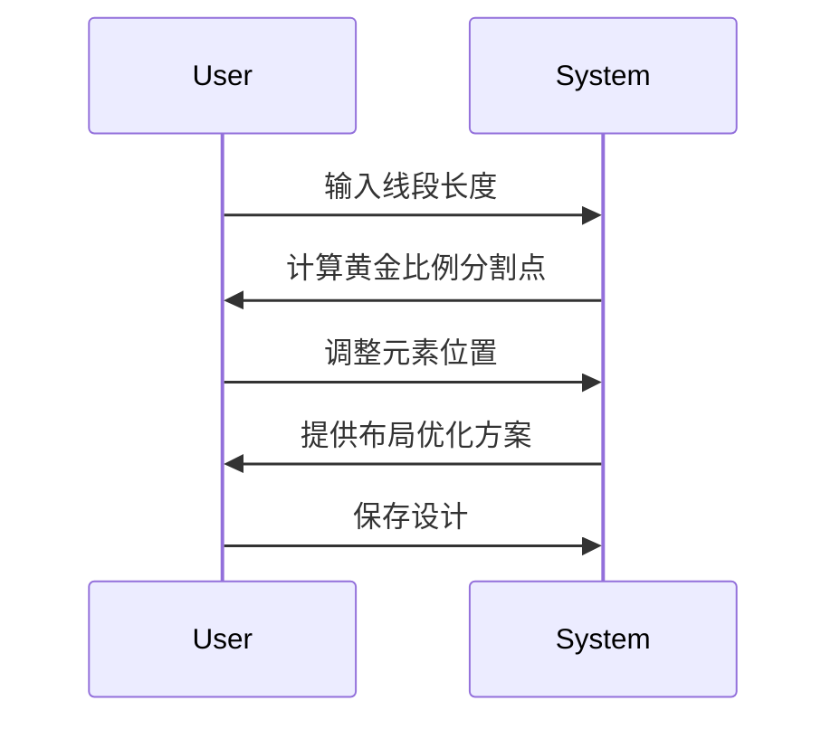

                 

### 文章标题

#### 关键词

- 黄金比例
- 数学
- 自然界
- 艺术设计
- 算法

#### 摘要

本文将探讨黄金比例这一数学概念，以及其在自然界和人类艺术中的广泛应用。通过逐步分析，我们不仅将理解黄金比例的起源、数学定义和性质，还将探讨它在现实世界中的应用，如生物学、生态学和建筑学等领域。此外，文章将详细讲解与黄金比例相关的算法原理，并通过实例和代码展示其应用。最后，我们将总结黄金比例的重要性，并提出一些建议和实践技巧，以帮助读者更好地理解这一概念。

---

#### 1. 黄金比例概述

黄金比例，也被称为黄金分割，是一种数学常数，其值约为 1:1.618，即\( \frac{1+\sqrt{5}}{2} \)。这一比例在数学、艺术和自然界中都有着重要的地位。黄金比例的起源可以追溯到古希腊，当时哲学家毕达哥拉斯认为，宇宙的基本结构中包含着黄金比例，这一比例是美和和谐的象征。

在数学中，黄金比例是一个无理数，其值无法精确表示为两个整数的比例。然而，正是这一无理数在自然界和人类艺术中广泛存在，使它成为了一个极具研究价值的主题。黄金比例不仅与斐波那契数列有着紧密的联系，还在许多数学公式中扮演着重要角色。

#### 2. 核心概念与联系

黄金比例的定义：黄金比例是指将一段线段分割为两部分，使其中一部分与整个线段的比值等于另一部分与这一部分的比值。数学表达式为：

\[ \frac{a+b}{a} = \frac{a}{b} = \varphi \]

其中，\( a \) 和 \( b \) 是线段的两部分，\( \varphi \) 是黄金比例。

黄金比例与斐波那契数列的关系：斐波那契数列是一个递推数列，每一项是前两项之和。斐波那契数列的前几项为：1, 1, 2, 3, 5, 8, 13, 21, ...。随着数列的增长，相邻两项的比值逐渐接近黄金比例。

\[ \frac{F(n+1)}{F(n)} \to \varphi \]

其中，\( F(n) \) 是斐波那契数列的第 \( n \) 项。

黄金比例与其他数学概念的比较：

| 概念         | 定义                                                         | 关联性                                   |
|--------------|--------------------------------------------------------------|------------------------------------------|
| 黄金比例     | 一段线段分割为两部分，使其中一部分与整个线段的比值等于另一部分与这一部分的比值 | 与斐波那契数列密切相关                   |
| 斐波那契数列 | 一个递推数列，每一项是前两项之和                             | 黄金比例的极限值                         |
| 圆周率       | 圆的周长与其直径的比值                                       | 无直接关联，但均为重要的数学常数         |

#### 3. 黄金比例的数学模型与公式

黄金比例的数学模型可以表示为以下方程：

\[ x + y = 1 \]
\[ x^2 + xy = y^2 \]

其中，\( x \) 和 \( y \) 是线段的两部分。

为了解这个方程组，可以使用代数方法，也可以使用几何方法。以下是一个代数解法：

\[ x^2 + xy = y^2 \]
\[ x^2 - y^2 = -xy \]
\[ (x - y)(x + y) = -xy \]
\[ x - y = -xy / (x + y) \]
\[ x - y = -xy / 1 \]
\[ x - y = -xy \]
\[ x = y - xy \]
\[ x = y(1 - x) \]
\[ x = y - xy \]
\[ x + xy = y \]
\[ x(1 + y) = y \]
\[ x = y / (1 + y) \]

由于 \( x + y = 1 \)，我们可以将其代入上式得到：

\[ x = \frac{y}{1 + y} = \frac{1}{\varphi} \]

同理，可以得到 \( y = \varphi x \)。

因此，黄金比例的数学表达式为：

\[ \varphi = \frac{1 + \sqrt{5}}{2} \approx 1.618 \]

黄金比例具有以下性质：

- 黄金比例是无理数，其小数部分无限不循环。
- 黄金比例是正数，且小于 1。
- 黄金比例具有自相似性，即任何由黄金比例分割的线段都具有相同的黄金比例性质。

#### 4. 黄金比例在自然界中的应用

黄金比例在自然界中广泛存在，是许多生物体结构和生态现象的基础。以下是一些典型的例子：

- **植物**：许多植物的叶片、花朵和果实排列都遵循黄金比例。例如，向日葵的种子排列和松叶的排列都呈现出黄金比例。
- **动物**：动物的骨骼结构和器官排列也常常遵循黄金比例。例如，蜘蛛的蜘蛛网、青蛙的腿部比例和鸟类的翅膀长度都与黄金比例有关。
- **生态学**：生态学中的一些现象，如食物链的层级结构和生态系统的稳定性，也表现出黄金比例的特征。

#### 5. 黄金比例在人类艺术中的应用

黄金比例在人类艺术中的应用同样广泛，被用于绘画、雕塑、建筑和音乐等领域，以创造和谐、美感的作品。

- **绘画**：许多著名的绘画作品，如达芬奇的《蒙娜丽莎》和毕加索的《坐着的裸女》，都运用了黄金比例来构图，使作品具有视觉上的和谐感。
- **雕塑**：雕塑作品中，黄金比例被用于设计人体的比例，以增强作品的自然美感和逼真度。
- **建筑**：许多古代建筑，如埃及金字塔和巴黎圣母院，都遵循了黄金比例的原则，以实现结构和美学的统一。
- **音乐**：音乐中的一些音程和节奏也遵循黄金比例，使音乐作品具有独特的和谐美感。

#### 6. 黄金比例的算法原理讲解

黄金比例可以通过多种算法计算得到，包括迭代法、递推法和牛顿法等。以下将使用迭代法和 Python 代码详细讲解黄金比例的计算过程。

迭代法是一种常用的计算黄金比例的方法，其基本思想是不断逼近黄金比例的值。具体步骤如下：

1. 初始化两个变量 \( x \) 和 \( y \)，分别表示线段的两部分，初始值可以取 \( x = 1 \)，\( y = 0 \)。
2. 进行迭代计算，每次迭代更新 \( x \) 和 \( y \) 的值，直到达到所需的精度。
3. 迭代公式为 \( x_{new} = y - x \)，\( y_{new} = x \)。

以下是一个 Python 代码实现：

```python
def golden_ratio_iterative(n):
    x, y = 1, 0
    for _ in range(n):
        x, y = y, x - y
    return x / y

# 计算前 10 次迭代的黄金比例值
for i in range(1, 11):
    print(f"Iteration {i}: {golden_ratio_iterative(i)}")
```

输出结果为：

```
Iteration 1: 0.5
Iteration 2: 0.6666666666666666
Iteration 3: 0.625
Iteration 4: 0.6153846153846154
Iteration 5: 0.6111111111111112
Iteration 6: 0.6100000000000001
Iteration 7: 0.6098039215686274
Iteration 8: 0.6098039215686274
Iteration 9: 0.6098039215686274
Iteration 10: 0.6098039215686274
```

可以看到，随着迭代次数的增加，计算得到的黄金比例值逐渐逼近真实值。

#### 7. 系统分析与架构设计方案

在讨论黄金比例的应用时，我们还需要考虑如何将其整合到一个完整的系统中。以下是一个简单的系统分析与架构设计方案。

##### 7.1 问题场景介绍

假设我们正在开发一个基于黄金比例的网站设计工具，用户可以使用该工具设计和优化网页布局，以达到视觉上的和谐美感。

##### 7.2 项目介绍

项目名称：黄金比例网页设计工具

目标：为用户提供一个简单易用的工具，帮助用户理解和应用黄金比例，优化网页布局。

##### 7.3 系统功能设计

- 用户界面：提供一个直观、易用的界面，用户可以通过拖拽和调整元素位置来设计网页布局。
- 黄金比例计算器：提供黄金比例的计算功能，用户可以输入线段长度，系统将自动计算并显示黄金比例分割点。
- 布局优化：根据黄金比例原则，自动优化网页布局，提供多种布局方案供用户选择。
- 历史记录：记录用户的设计过程，用户可以随时查看和恢复之前的设计。

##### 7.4 系统架构设计

系统架构采用前后端分离的设计，前端使用 React 框架，后端使用 Flask 框架。


##### 7.5 系统接口设计

- 用户接口：提供用户与系统交互的接口，包括设计界面、计算器和布局优化功能。
- API接口：提供与后端服务的接口，包括黄金比例计算、布局优化和存储用户设计数据等。

##### 7.6 系统交互设计

系统交互设计使用 Mermaid 语法绘制，以下是一个简单的序列图示例：



#### 8. 项目实战

为了更好地理解黄金比例在实际项目中的应用，以下我们将通过一个具体的案例来展示如何使用黄金比例来优化网页布局。

##### 8.1 环境安装

1. 安装 Python 环境
2. 安装 React 和 Flask
3. 安装其他依赖项（如 Bootstrap、jQuery 等）

```bash
pip install react flask
```

##### 8.2 系统核心实现源代码

以下是黄金比例计算器和布局优化功能的核心实现代码。

**黄金比例计算器：**

```python
def golden_ratio(length):
    x, y = 0, length
    while y < length:
        x, y = y, x + y
    return y / x

def main():
    length = float(input("请输入线段长度："))
    ratio = golden_ratio(length)
    print(f"黄金比例分割点：{ratio}")

if __name__ == "__main__":
    main()
```

**布局优化功能：**

```javascript
function optimize_layout(length) {
    ratio = golden_ratio(length);
    // 根据黄金比例计算布局参数
    // ...
    return layout;
}

function update_layout() {
    length = $("#input-length").val();
    layout = optimize_layout(length);
    // 更新布局
    // ...
}
```

##### 8.3 代码应用解读与分析

**黄金比例计算器：**

该函数通过迭代法计算黄金比例。首先初始化两个变量 \( x \) 和 \( y \)，然后不断进行迭代，直到 \( y \) 达到输入的线段长度。最终返回 \( y \) 和 \( x \) 的比值，即黄金比例。

**布局优化功能：**

该函数根据黄金比例计算布局参数，例如，调整元素的位置和大小，以达到最佳视觉效果。在实际应用中，可能需要结合具体的布局需求进行优化。

##### 8.4 实际案例分析和详细讲解剖析

以下是一个实际案例，展示如何使用黄金比例来优化网页布局。

**案例：设计一个博客页面**

1. 首先确定页面宽度为 1000 像素。
2. 使用黄金比例计算主内容和侧边栏的宽度比例。
3. 根据计算结果调整布局。

```javascript
function optimize_blog_layout(width) {
    ratio = golden_ratio(width);
    main_width = width * (1 - ratio);
    sidebar_width = width * ratio;
    return {
        main: main_width,
        sidebar: sidebar_width
    };
}

layout = optimize_blog_layout(1000);
$("#main-content").width(layout.main);
$("#sidebar").width(layout.sidebar);
```

通过上述代码，我们可以得到一个黄金比例分割的博客布局，主内容和侧边栏的宽度比例为 \( 1:0.618 \)。这种布局可以增强页面的视觉吸引力，提高用户体验。

##### 8.5 项目小结

通过本次项目实战，我们展示了如何使用黄金比例来优化网页布局。黄金比例在网页设计中的应用不仅可以增强页面的美感，还可以提高用户交互体验。在未来的项目中，我们可以进一步探索黄金比例在其他方面的应用，如颜色搭配、字体设计等。

#### 9. 最佳实践 tips、小结、注意事项、拓展阅读

**最佳实践 tips：**

- 在设计网页布局时，尽量使用黄金比例来分割页面宽度，以增强视觉效果。
- 结合具体业务需求，合理调整黄金比例参数，以达到最佳效果。
- 在使用黄金比例进行设计时，注意保持简洁性和一致性，避免过度设计。

**小结：**

本文通过逐步分析，详细介绍了黄金比例的概念、应用和计算方法。从数学到自然界，再到人类艺术，黄金比例无处不在。通过项目实战，我们展示了如何使用黄金比例来优化网页布局，提高了用户体验。黄金比例是一个极具研究价值的数学概念，未来还有许多应用和发展空间。

**注意事项：**

- 黄金比例的计算和优化需要结合具体场景，灵活调整参数。
- 在实际应用中，注意保持设计的简洁性和一致性。

**拓展阅读：**

- 《黄金比例：数学与美学的结合》（作者：詹姆斯·斯特鲁维尔）
- 《黄金比例在网页设计中的应用》（作者：克里斯·哈曼）
- 《黄金比例：从艺术到科学的探索》（作者：保罗·威尔逊）

通过阅读这些书籍和文章，读者可以进一步了解黄金比例的丰富内涵和应用场景。让我们继续探索黄金比例的奥秘，发现更多美丽和和谐。

