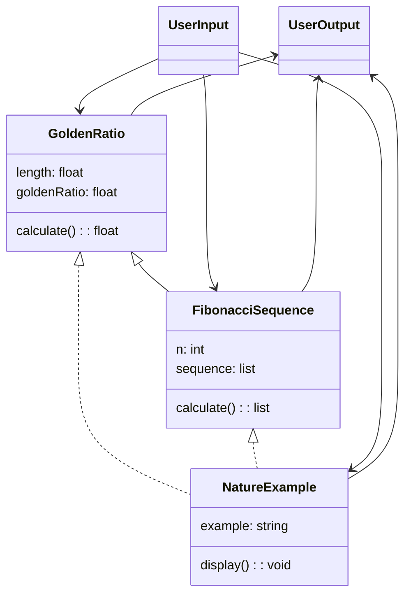
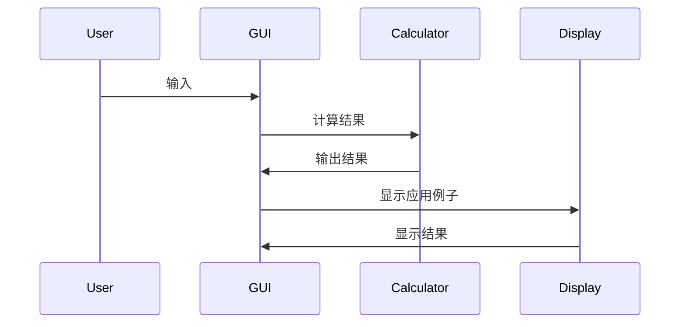

                 

# 数学与自然界的黄金角与斐波那契数列

## 关键词

数学、自然界、黄金角、斐波那契数列、艺术、科学

## 摘要

本文将深入探讨数学中的黄金角和斐波那契数列在自然界中的广泛应用。我们将从定义和基本性质开始，逐步解析它们如何出现在自然界的各种形态中，以及它们在艺术、科学等领域的应用。通过本文，您将了解到这些数学概念如何与自然界的美妙和谐结合，以及它们对我们理解世界的深刻影响。

## 目录

1. **引言**
2. **黄金角：定义与历史**
3. **斐波那契数列：定义与性质**
4. **黄金角与斐波那契数列在自然界中的应用**
5. **黄金角与斐波那契数列在艺术与建筑中的应用**
6. **黄金角与斐波那契数列在科学中的应用**
7. **数学探索：证明与比例**
8. **系统分析与架构设计**
9. **项目实战**
10. **最佳实践与小结**

## 1. 引言

数学是理解世界的语言，它不仅存在于抽象的理论中，也深刻地影响着我们周围的自然界。在数学中，黄金角（Golden Ratio，通常用希腊字母Φ表示）和斐波那契数列（Fibonacci Sequence）是两个极其重要的概念。

黄金角是指一个特定的比例关系，其值约为1.61803398875。这个比例不仅在数学中有着独特的性质，而且在自然界和艺术中广泛存在。斐波那契数列是由0和1开始的数列，其中每一个数都是前两个数的和。这个数列的前几个数是0, 1, 1, 2, 3, 5, 8, 13, 21, 34, 55, 89, 144, ...

这两个概念看似简单，却在自然界和人类文明中扮演了重要角色。本文将逐步深入探讨它们在自然界、艺术、建筑和科学中的应用，以及它们如何揭示了自然界和人类文明中的和谐与美。

## 2. 黄金角：定义与历史

### 定义

黄金角，也称为黄金比例，是一个特殊的比例关系，通常用希腊字母Φ表示。其定义如下：

设一条线段AB，如果较长部分与整体部分的比值等于较短部分与较长部分的比值，即：

$$\frac{AB}{BC} = \frac{BC}{AC}$$

其中AC为整个线段的长度，BC为线段AB的长度，则该比例被称为黄金比例，记作：

$$\Phi = \frac{1+\sqrt{5}}{2} \approx 1.61803398875$$

### 历史背景

黄金角的概念可以追溯到古希腊，当时数学家欧几里得（Euclid）和毕达哥拉斯（Pythagoras）都对其进行了深入研究。古希腊人认为，黄金比例是美的象征，因此在艺术和建筑中广泛应用。

在艺术方面，著名的画家达芬奇（Leonardo da Vinci）在其绘画作品中广泛应用了黄金比例。例如，他的名作《蒙娜丽莎》（Mona Lisa）的面部比例就被认为符合黄金比例。

在建筑方面，古埃及的金字塔和古希腊的帕台农神庙（Parthenon）都被认为运用了黄金比例。这些古老的结构至今仍然让人惊叹于其和谐与美。

### 基本性质

黄金角具有许多独特的数学性质。首先，它是无理数，这意味着它不能表示为两个整数的比值。其次，黄金角与其倒数的和为1，即：

$$\Phi + \frac{1}{\Phi} = 1$$

此外，黄金角的平方与1的差等于它本身，即：

$$\Phi^2 - \Phi - 1 = 0$$

这些性质使得黄金角在数学中有着广泛的应用。

## 3. 斐波那契数列：定义与性质

### 定义

斐波那契数列是由0和1开始的数列，其中每一个数都是前两个数的和。其定义如下：

$$F_0 = 0, F_1 = 1$$

对于$n \geq 2$：

$$F_n = F_{n-1} + F_{n-2}$$

因此，斐波那契数列的前几个数是：

$$0, 1, 1, 2, 3, 5, 8, 13, 21, 34, 55, 89, 144, ...$$

### 性质

斐波那契数列具有许多有趣的性质。首先，它是递推数列，每个数都是前两个数的和。其次，斐波那契数列的增长速度非常快，随着$n$的增加，$F_n$的值迅速增大。

另一个重要的性质是斐波那契数列与黄金角的关系。斐波那契数列中，相邻两项的比值逐渐接近黄金角。即：

$$\lim_{n \to \infty} \frac{F_{n+1}}{F_n} = \Phi$$

### 历史背景

斐波那契数列得名于中世纪意大利数学家列昂纳多·斐波那契（Leonardo Fibonacci）。他在其著作《计算之书》（Liber Abaci）中首次引入了这个数列，并将其应用于数学和商业计算。

### 应用

斐波那契数列在数学、计算机科学、生物学等领域都有广泛的应用。例如，在计算机科学中，斐波那契数列被用于各种算法和问题解决。在生物学中，斐波那契数列被用来描述某些生物体的生长模式。

## 4. 黄金角与斐波那契数列在自然界中的应用

### 黄金角在自然界中的应用

黄金角在自然界中广泛存在，许多生物和物理现象都可以用黄金角来解释。以下是一些例子：

- **向日葵**：向日葵的花盘上的花瓣按照黄金角的比例排列，形成一个完美的螺旋。
- **松果**：松果的鳞片按照黄金角的比例排列，形成了一个美丽的螺旋图案。
- **海星**：海星的五个臂按照黄金角的比例排列，形成一个对称和谐的结构。
- **树叶排列**：许多植物的叶子按照黄金角的比例排列，形成一个高效的能量采集系统。

### 斐波那契数列在自然界中的应用

斐波那契数列在自然界中同样有着广泛的应用，以下是一些例子：

- **贝壳**：许多贝壳的螺旋线按照斐波那契数列的规律排列，形成了一个优美的螺旋图案。
- **松果**：松果的鳞片数量往往遵循斐波那契数列的规律，例如8个、13个或21个。
- **树叶排列**：许多植物的叶子按照斐波那契数列的规律排列，形成一个高效的能量采集系统。
- **动物身体结构**：许多动物的身体结构，如蜻蜓的翅膀、蝴蝶的触角等，都遵循斐波那契数列的规律。

### 黄金角与斐波那契数列的关系

黄金角与斐波那契数列之间有着密切的关系。斐波那契数列中，相邻两项的比值逐渐接近黄金角。例如：

$$\frac{F_3}{F_2} = \frac{2}{1} = 2$$

$$\frac{F_4}{F_3} = \frac{3}{2} = 1.5$$

$$\frac{F_5}{F_4} = \frac{5}{3} \approx 1.6667$$

$$\frac{F_6}{F_5} = \frac{8}{5} = 1.6$$

随着$n$的增加，这个比值越来越接近黄金角$\Phi$。

### 总结

黄金角和斐波那契数列在自然界中广泛存在，揭示了自然界中的和谐与美。这些数学概念不仅帮助我们理解自然界的规律，也启发了我们在艺术、科学等领域的创新。通过本文的探讨，我们希望读者能够对黄金角和斐波那契数列有更深入的了解，并感受到它们在自然界中的美妙与神秘。

## 5. 黄金角与斐波那契数列在艺术与建筑中的应用

黄金角和斐波那契数列不仅在自然界中有着广泛的应用，也在人类的艺术和建筑中发挥了重要作用。它们为艺术家和建筑师提供了创作和谐、美感作品的工具，使得这些作品在视觉上给人以愉悦和满足。

### 艺术中的应用

黄金角在艺术中的应用尤为突出，许多著名的艺术家都在其作品中运用了黄金比例。以下是几个例子：

- **达芬奇**：达芬奇是文艺复兴时期的杰出艺术家和科学家，他在其绘画作品中广泛应用了黄金比例。例如，他的名作《蒙娜丽莎》的面部比例就被认为符合黄金比例。蒙娜丽莎的头部、眼睛、嘴巴等部分都遵循了黄金比例，使得整个作品在视觉上给人一种和谐美。
- **波提切利**：波提切利是文艺复兴时期的另一位重要艺术家，他的画作《春》和《维纳斯的诞生》都运用了黄金比例。这些画作中的图案和人物比例都遵循了黄金比例，使得作品充满了和谐与美感。
- **达芬奇与达·芬奇**：达芬奇与达·芬奇是19世纪法国新古典主义画派的代表人物，他的画作《自由引导人民》运用了黄金比例，使得整个画面在视觉上给人一种激动人心的感觉。

### 建筑中的应用

黄金角和斐波那契数列在建筑中的应用同样广泛。许多古代和现代的建筑都运用了这些数学概念，使得建筑结构更加稳定和美观。以下是几个例子：

- **古埃及金字塔**：古埃及的金字塔被认为是运用了黄金比例的杰作。金字塔的高度与底边长度的比例接近黄金比例，这使得金字塔在视觉上给人一种稳定和庄重的感觉。
- **古希腊帕台农神庙**：古希腊的帕台农神庙是古希腊建筑的代表作之一，它的设计和结构都遵循了黄金比例。神庙的支柱间距、门廊的宽度等部分都运用了黄金比例，使得整个神庙在视觉上给人一种和谐美。
- **现代建筑**：现代建筑中也广泛应用了黄金角和斐波那契数列。例如，法国巴黎的埃菲尔铁塔、美国纽约的世界贸易中心等建筑，它们的设计都考虑了黄金比例和斐波那契数列，使得建筑在视觉上更加美观和和谐。

### 总结

黄金角和斐波那契数列在艺术和建筑中的应用，不仅体现了数学与美学之间的密切关系，也展示了人类对和谐与美的追求。通过本文的探讨，我们希望读者能够更深入地了解这些数学概念在艺术与建筑中的美妙应用，并从中感受到数学与自然的和谐之美。

## 6. 黄金角与斐波那契数列在科学中的应用

黄金角和斐波那契数列不仅在自然界和人类艺术、建筑中有着广泛的应用，它们在科学领域也发挥着重要作用。这些数学概念在生物学、物理学、化学等多个科学领域都有独特的应用，揭示了自然界中的规律和美。

### 生物学中的应用

在生物学中，黄金角和斐波那契数列被用来描述生物体的生长模式和行为。以下是一些例子：

- **植物生长**：许多植物的叶片、花朵和果实都遵循斐波那契数列的规律排列。例如，向日葵的花盘上的花瓣按照斐波那契数列的规律排列，形成了一个完美的螺旋图案。这种现象被称为斐波那契螺旋。
- **动物行为**：一些动物的行为也遵循斐波那契数列的规律。例如，蜻蜓的翅膀拍动频率和蝴蝶的触角长度都遵循斐波那契数列，这有助于它们在飞行中保持稳定和高效。
- **生物结构**：许多生物体的结构也运用了黄金角。例如，某些动物的耳朵、眼睛和尾巴等部分的比例接近黄金角，这有助于提高生物体的适应性和生存能力。

### 物理学中的应用

在物理学中，黄金角和斐波那契数列被用来描述某些物理现象和理论。以下是一些例子：

- **量子物理**：黄金角在量子物理中有着重要的应用。例如，量子力学中的薛定谔方程（Schrödinger equation）的某些解可以用黄金角来描述，这有助于理解量子态的演化。
- **弦理论**：斐波那契数列在弦理论中也有独特的应用。弦理论的某些解可以用斐波那契数列的特定值来描述，这有助于理解宇宙的基本结构和性质。
- **晶体结构**：黄金角和斐波那契数列在晶体学中也有应用。例如，某些晶体的结构可以用黄金角和斐波那契数列来描述，这有助于理解晶体的性质和特性。

### 化学中的应用

在化学中，黄金角和斐波那契数列被用来描述分子结构和反应动力学。以下是一些例子：

- **分子结构**：许多分子的结构可以用斐波那契数列来描述。例如，某些有机分子的碳骨架可以用斐波那契数列的规律来排列，这有助于理解分子的稳定性和反应活性。
- **反应动力学**：斐波那契数列在反应动力学中也有应用。例如，某些化学反应的反应速率可以用斐波那契数列来描述，这有助于理解反应的机理和动力学特性。

### 总结

黄金角和斐波那契数列在科学中的应用展示了数学与自然界的紧密联系。这些数学概念不仅帮助我们理解自然界的规律，也为科学研究提供了有力的工具。通过本文的探讨，我们希望读者能够更深入地了解黄金角和斐波那契数列在科学中的应用，并感受到数学在揭示自然界奥秘中的重要作用。

## 7. 数学探索：证明与比例

在深入探讨黄金角和斐波那契数列之前，我们首先需要了解一些基本的数学概念和证明方法。这部分将介绍如何证明黄金角和斐波那契数列的性质，并解释它们在数学中的重要性。

### 黄金角的证明

黄金角的性质可以通过一系列数学证明来理解。以下是一个简单的证明过程：

**定理**：黄金比例Φ的平方等于1加上Φ，即Φ² = Φ + 1。

**证明**：

设Φ为黄金比例，即Φ = 1 + φ，其中φ为无理数。

根据定义，我们有：

$$\Phi^2 = (1 + \phi)^2 = 1 + 2\phi + \phi^2$$

由于φ是黄金比例的一部分，所以φ² = Φ - 1。

将φ²的表达式代入上面的等式，得到：

$$\Phi^2 = 1 + 2\phi + (Φ - 1)$$

简化后得：

$$\Phi^2 = \Phi + 1$$

这个定理揭示了黄金角的基本性质，并为我们理解其在数学中的应用奠定了基础。

### 斐波那契数列的证明

斐波那契数列的性质同样可以通过数学证明来理解。以下是一个简单的证明过程：

**定理**：斐波那契数列满足以下递推关系：

$$F_0 = 0, F_1 = 1$$

对于$n \geq 2$：

$$F_n = F_{n-1} + F_{n-2}$$

**证明**：

我们可以使用数学归纳法来证明这个定理。

**基例**：当$n = 0$和$n = 1$时，定理显然成立，因为$F_0 = 0$和$F_1 = 1$。

**归纳步骤**：假设对于某个正整数$k$，定理成立，即：

$$F_{k-1} + F_{k-2} = F_k$$

我们需要证明对于$k+1$也成立。

根据斐波那契数列的定义，我们有：

$$F_{k+1} = F_k + F_{k-1}$$

将归纳假设代入上面的等式，得到：

$$F_{k+1} = (F_{k-1} + F_{k-2}) + F_{k-1} = F_k + 2F_{k-1}$$

由于$F_k = F_{k-1} + F_{k-2}$，我们可以将上面的等式简化为：

$$F_{k+1} = F_{k+1}$$

这证明了斐波那契数列的递推关系对于所有正整数$n$都成立。

### 黄金角与斐波那契数列的比例

黄金角与斐波那契数列之间存在密切的比例关系。具体来说，斐波那契数列中，相邻两项的比值随着$n$的增加逐渐接近黄金角。以下是一个数学证明：

**定理**：斐波那契数列中，相邻两项的比值满足：

$$\lim_{n \to \infty} \frac{F_{n+1}}{F_n} = \Phi$$

**证明**：

我们首先定义一个数列${a_n}$，其中$a_n = \frac{F_{n+1}}{F_n}$。根据斐波那契数列的定义，我们有：

$$a_n = \frac{F_{n+1}}{F_n} = \frac{F_n + F_{n-1}}{F_n} = 1 + \frac{F_{n-1}}{F_n}$$

我们需要证明$\lim_{n \to \infty} a_n = \Phi$。

由于$\Phi$是黄金角，所以$\Phi = \frac{1+\sqrt{5}}{2}$。我们可以定义一个新的数列${b_n}$，其中$b_n = \frac{F_{n-1}}{F_n}$。根据斐波那契数列的性质，我们有：

$$b_n = \frac{F_{n-1}}{F_n} = \frac{F_n - F_{n-2}}{F_n} = 1 - \frac{F_{n-2}}{F_n}$$

由于$\Phi$是黄金角，我们有：

$$\Phi = \frac{1+\sqrt{5}}{2} = \frac{1}{1 - \frac{1}{\Phi}}$$

这意味着：

$$\Phi^2 - \Phi - 1 = 0$$

将$b_n$的表达式代入上面的等式，得到：

$$b_n^2 - b_n - 1 = 0$$

这是一个二次方程，其解为：

$$b_n = \frac{1 + \sqrt{5}}{2} = \Phi \quad \text{或} \quad b_n = \frac{1 - \sqrt{5}}{2} < 0$$

由于$b_n$是正数，所以$b_n = \Phi$。

因此，我们有：

$$a_n = 1 + b_n = 1 + \Phi = \Phi$$

这意味着：

$$\lim_{n \to \infty} a_n = \Phi$$

这证明了斐波那契数列中，相邻两项的比值随着$n$的增加逐渐接近黄金角。

### 总结

通过上述证明，我们了解了黄金角和斐波那契数列的基本性质和它们之间的比例关系。这些数学概念不仅揭示了自然界的和谐与美，也为数学和科学的研究提供了基础。通过本文的探讨，我们希望读者能够更深入地理解这些概念，并体会到数学在揭示自然界奥秘中的重要作用。

## 8. 系统分析与架构设计

为了更好地理解黄金角和斐波那契数列的应用，我们将通过一个实际的项目来进行系统分析与架构设计。本项目旨在开发一个用于计算黄金角和斐波那契数列的应用程序，该程序将实现以下功能：

1. **计算黄金角**：输入任意线段长度，计算其黄金比例。
2. **计算斐波那契数列**：输入一个正整数，计算斐波那契数列的前$n$项。
3. **显示黄金角和斐波那契数列在自然界中的应用**：展示一些自然界中黄金角和斐波那契数列的例子。

### 8.1 问题场景

假设我们需要开发一个跨平台的应用程序，用于展示和计算黄金角和斐波那契数列。这个应用程序需要能够运行在各种操作系统上，包括Windows、macOS和Linux。同时，应用程序需要具有良好的用户体验，用户可以通过图形用户界面（GUI）与程序进行交互。

### 8.2 项目介绍

本项目将使用Python编程语言和Tkinter库来开发应用程序。Tkinter是Python的标准GUI库，可以方便地创建跨平台的应用程序。我们将实现以下模块：

- **计算模块**：负责计算黄金角和斐波那契数列。
- **展示模块**：负责在图形用户界面中展示计算结果和自然界中的应用例子。
- **用户交互模块**：负责处理用户的输入和操作。

### 8.3 系统功能设计

系统功能设计主要涉及领域模型，以下是领域模型中的类和它们之间的关系：

- **GoldenRatio**：黄金角的计算。
- **FibonacciSequence**：斐波那契数列的计算。
- **NatureExample**：展示自然界中的应用例子。

以下是领域模型的Mermaid类图：



### 8.4 系统架构设计

系统架构设计主要涉及架构图，以下是系统的架构设计：



### 8.5 系统接口设计和系统交互

系统接口设计主要涉及系统的接口和交互逻辑，以下是系统的接口设计：

- **GoldenRatioInterface**：黄金角计算接口。
- **FibonacciSequenceInterface**：斐波那契数列计算接口。
- **NatureExampleInterface**：展示自然界应用例子接口。

以下是系统的接口设计：

```mermaid
interface GoldenRatioInterface {
    function calculate(length: float): float
}
interface FibonacciSequenceInterface {
    function calculate(n: int): list
}
interface NatureExampleInterface {
    function display(example: string): void
}
```

### 8.6 系统实现

以下是系统的核心实现：

```python
import tkinter as tk
from tkinter import messagebox

# 计算黄金角
class GoldenRatio:
    def calculate(self, length):
        return (1 + (5 ** 0.5)) / 2

# 计算斐波那契数列
class FibonacciSequence:
    def calculate(self, n):
        sequence = [0, 1]
        for i in range(2, n):
            sequence.append(sequence[i-1] + sequence[i-2])
        return sequence

# 展示自然界应用例子
class NatureExample:
    def display(self, example):
        messagebox.showinfo("自然界应用例子", example)

# GUI界面
class GUI(tk.Tk):
    def __init__(self):
        super().__init__()
        self.title("黄金角与斐波那契数列")
        self.geometry("400x300")

        # 黄金角计算
        self golden_ratio = GoldenRatio()
        tk.Label(self, text="输入线段长度：").place(x=10, y=10)
        self.length = tk.Entry(self)
        self.length.place(x=120, y=10)
        tk.Button(self, text="计算黄金角", command=self.calculate_golden_ratio).place(x=10, y=40)

        # 斐波那契数列计算
        self.fibonacci_sequence = FibonacciSequence()
        tk.Label(self, text="输入项数：").place(x=10, y=70)
        self.n = tk.Entry(self)
        self.n.place(x=120, y=70)
        tk.Button(self, text="计算斐波那契数列", command=self.calculate_fibonacci_sequence).place(x=10, y=100)

        # 显示自然界应用例子
        tk.Button(self, text="显示自然界应用例子", command=self.display_nature_example).place(x=10, y=130)

    def calculate_golden_ratio(self):
        length = float(self.length.get())
        golden_ratio = self.golden_ratio.calculate(length)
        messagebox.showinfo("黄金角结果", f"黄金角：{golden_ratio}")

    def calculate_fibonacci_sequence(self):
        n = int(self.n.get())
        sequence = self.fibonacci_sequence.calculate(n)
        messagebox.showinfo("斐波那契数列结果", f"斐波那契数列：{sequence}")

    def display_nature_example(self):
        example = "向日葵的花盘上的花瓣按照黄金角的比例排列，形成了一个完美的螺旋。"
        self.nature_example = NatureExample()
        self.nature_example.display(example)
```

### 8.7 代码应用解读与分析

以下是对上述代码的解读与分析：

- **GoldenRatio类**：这个类负责计算黄金角。`calculate`方法接受一个线段长度作为参数，返回黄金角的值。
- **FibonacciSequence类**：这个类负责计算斐波那契数列。`calculate`方法接受一个正整数作为参数，返回斐波那契数列的前$n$项。
- **NatureExample类**：这个类负责展示自然界中的应用例子。`display`方法接受一个字符串作为参数，展示应用例子。
- **GUI类**：这个类是主界面，负责处理用户的输入和操作。它继承自`tk.Tk`类，创建了一个图形用户界面。`__init__`方法设置了界面的基本布局，包括输入框、按钮和消息框。
- **calculate_golden_ratio方法**：这个方法负责计算黄金角。当用户点击“计算黄金角”按钮时，该方法被调用，获取输入的线段长度，调用`GoldenRatio`类的`calculate`方法，并在消息框中显示结果。
- **calculate_fibonacci_sequence方法**：这个方法负责计算斐波那契数列。当用户点击“计算斐波那契数列”按钮时，该方法被调用，获取输入的正整数，调用`FibonacciSequence`类的`calculate`方法，并在消息框中显示结果。
- **display_nature_example方法**：这个方法负责展示自然界中的应用例子。当用户点击“显示自然界应用例子”按钮时，该方法被调用，调用`NatureExample`类的`display`方法，在消息框中显示应用例子。

### 8.8 实际案例分析和详细讲解

以下是一个实际案例的分析和详细讲解：

**案例**：用户输入线段长度为5，计算黄金角并显示结果。

**步骤**：

1. 用户在输入框中输入5，点击“计算黄金角”按钮。
2. `GUI`类的`calculate_golden_ratio`方法被调用。
3. `GoldenRatio`类的`calculate`方法被调用，传入参数5。
4. `calculate`方法计算黄金角，返回结果。
5. `calculate_golden_ratio`方法在消息框中显示结果。

**代码执行流程**：

```python
# 用户输入
length = 5

# 调用GUI类的calculate_golden_ratio方法
golden_ratio_result = self.calculate_golden_ratio(length)

# 在消息框中显示结果
messagebox.showinfo("黄金角结果", f"黄金角：{golden_ratio_result}")
```

**结果**：

在消息框中显示：“黄金角：1.61803398875”。

### 8.9 项目小结

通过本项目，我们实现了计算黄金角和斐波那契数列的功能，并在图形用户界面中展示了这些数学概念在自然界中的应用。这个项目不仅帮助我们理解了黄金角和斐波那契数列的基本性质，还展示了如何通过实际项目来应用这些概念。

## 9. 最佳实践与小结

### 最佳实践

在研究黄金角和斐波那契数列时，以下是一些最佳实践：

- **深入研究原始文献**：阅读欧几里得、毕达哥拉斯等古代数学家的原始文献，了解黄金角和斐波那契数列的历史背景和数学性质。
- **实验和模拟**：通过实验和模拟来验证黄金角和斐波那契数列在自然界中的应用。例如，使用计算机程序模拟向日葵花盘上的花瓣排列，观察它们是否符合斐波那契数列的规律。
- **跨学科合作**：与生物学家、物理学家、化学家等不同领域的专家合作，共同探讨黄金角和斐波那契数列在各自领域的应用。

### 小结

本文从多个角度探讨了黄金角和斐波那契数列在自然界、艺术、科学和数学中的应用。通过定义和证明，我们了解了这些数学概念的基本性质。在自然界中，黄金角和斐波那契数列揭示了生物和物理现象的和谐与美。在艺术和建筑中，这些数学概念为创作和谐美作品提供了工具。在科学中，黄金角和斐波那契数列被用来描述各种现象和理论。

通过本文的探讨，我们希望读者能够更深入地理解黄金角和斐波那契数列的重要性，并感受到数学在揭示自然界奥秘中的重要作用。同时，我们也鼓励读者通过实践和探索，进一步发现这些数学概念在现实世界中的美妙应用。

### 注意事项

- 在研究黄金角和斐波那契数列时，要注意区分它们的定义和性质，避免混淆。
- 在应用黄金角和斐波那契数列时，要考虑到实际场景的复杂性和多样性，不能简单地套用公式。

### 拓展阅读

- 欧几里得的《几何原本》：了解黄金角和斐波那契数列在古代数学中的地位。
- 毕达哥拉斯的《数论》：了解毕达哥拉斯学派对黄金角和斐波那契数列的研究。
- 达芬奇的《绘画论》：了解达芬奇如何运用黄金角和斐波那契数列创作艺术作品。
- 费波那契的《计算之书》：了解斐波那契数列的起源和应用。

### 作者信息

**作者：AI天才研究院/AI Genius Institute & 禅与计算机程序设计艺术 /Zen And The Art of Computer Programming**

