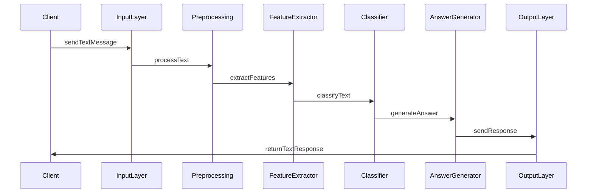

                 

### 引言和概述

在当今的信息时代，自然语言处理（Natural Language Processing，NLP）已经成为人工智能领域的重要分支。它旨在使计算机能够理解、生成和回应人类语言，从而实现人与计算机的顺畅交流。随着深度学习和大数据技术的快速发展，NLP的应用范围不断扩大，从简单的文本分类、情感分析到复杂的机器翻译、语音识别，都已取得了显著的成果。

然而，NLP的核心问题之一是如何从大量的文本数据中提取有用的信息，并生成合理的语言响应。为了解决这一问题，语言模型（Language Models）应运而生。语言模型是一种用于预测下一个词语或字符的概率分布的数学模型，它是实现各种NLP任务的基础。

数学在NLP中扮演着至关重要的角色。无论是文本表示、特征提取，还是模型训练和优化，都离不开数学工具和方法。例如，线性代数和概率论在文本表示和特征提取中广泛应用，而神经网络和深度学习算法的优化则依赖于微积分和优化理论。

本文旨在探讨数学与自然语言处理之间的紧密联系，尤其是语言模型的数学基础。我们将从基础数学概念出发，逐步引入到NLP中的核心模型和算法，并通过具体实例和数学公式来解释这些概念和算法的实现原理。本文将分为以下几个部分：

1. **引言和概述**：介绍NLP的背景和语言模型的重要性，以及本文的结构和内容。
2. **基础数学概念**：讨论集合论、逻辑、概率论和线性代数等基础数学概念，并说明它们在NLP中的应用。
3. **计算模型与算法**：分析离散模型、统计模型和神经网络等计算模型在NLP中的应用，包括具体的算法原理和实现。
4. **系统分析与架构设计**：介绍NLP系统的基本架构，包括文本表示、特征提取、模型训练和优化等环节。
5. **项目实战**：通过实际案例展示如何使用数学和NLP技术来构建和优化语言模型。
6. **总结与展望**：总结本文的主要内容和贡献，并对未来的研究方向进行展望。

通过本文的阅读，读者将能够深入了解数学在自然语言处理中的应用，掌握语言模型的核心概念和算法，并为未来的研究和工作提供理论和实践基础。

#### 关键词

- 自然语言处理（Natural Language Processing）
- 语言模型（Language Models）
- 数学基础（Mathematical Foundations）
- 线性代数（Linear Algebra）
- 概率论（Probability Theory）
- 神经网络（Neural Networks）
- 计算模型（Computational Models）
- 特征提取（Feature Extraction）
- 模型训练（Model Training）

#### 摘要

本文旨在探讨数学与自然语言处理之间的紧密联系，特别是语言模型的数学基础。首先，介绍了自然语言处理（NLP）的背景和语言模型的重要性。随后，本文详细讨论了基础数学概念，包括集合论、逻辑、概率论和线性代数，并说明这些概念在NLP中的应用。接下来，本文分析了离散模型、统计模型和神经网络等计算模型在NLP中的应用，包括具体的算法原理和实现。此外，还介绍了NLP系统的基本架构，从文本表示、特征提取到模型训练和优化。通过实际案例展示，本文展示了如何使用数学和NLP技术来构建和优化语言模型。最后，本文总结了主要内容和贡献，并对未来的研究方向进行了展望。本文将为读者提供深入理解和应用数学与自然语言处理技术的理论指导和实践基础。

### 基础数学概念

要深入了解自然语言处理（NLP）中的语言模型，我们首先需要掌握一些基础数学概念。这些概念为NLP中的许多算法和模型提供了理论基础。以下将介绍集合论、逻辑、概率论和线性代数，并解释它们在NLP中的应用。

#### 集合论

集合论是数学的基础，它涉及对象的分类和操作。在NLP中，集合论用于表示文本数据、词汇和特征。一个集合是由一组不重复的对象组成的集合，通常用大写字母表示，如\(A = \{1, 2, 3\}\)。

- **集合的基本操作**：并集、交集和补集
  - **并集（Union）**：两个集合的所有元素的集合。例如，\(A \cup B\) 表示集合\(A\)和集合\(B\)的并集。
  - **交集（Intersection）**：两个集合共有的元素的集合。例如，\(A \cap B\) 表示集合\(A\)和集合\(B\)的交集。
  - **补集（Complement）**：一个集合中不属于另一个集合的元素组成的集合。例如，\(A^c\) 表示集合\(A\)的补集。

在文本处理中，集合论用于表示词汇集合和句子集合。例如，一个词汇表可以表示为集合，其中每个词汇是一个元素。

#### 逻辑

逻辑是用于表示和分析推理的数学工具。在NLP中，逻辑用于文本分类、情感分析等任务。逻辑的基本元素是命题和逻辑运算符。

- **命题**：可以判断真假的陈述句。
- **逻辑运算符**：用于组合命题的运算符，如“与（AND）”、“或（OR）”和“非（NOT）”。
  - **与（AND）**：只有当两个命题都为真时，结果才为真。
  - **或（OR）**：只要有一个命题为真，结果就为真。
  - **非（NOT）**：反转命题的真值。

逻辑在文本分类中的应用非常广泛。例如，在情感分析中，我们可以使用逻辑运算符来组合多个特征，以判断文本的情感极性。

#### 概率论

概率论是用于量化不确定性的数学工具。在NLP中，概率论用于语言模型、文本分类和序列模型等任务。

- **概率分布**：描述随机变量可能取值的概率。
- **条件概率**：在给定某个事件发生的条件下，另一个事件发生的概率。
- **贝叶斯定理**：用于计算后验概率，即在已知某个事件发生的条件下，另一个事件发生的前验概率。

在NLP中，概率论用于生成文本的概率分布，从而预测下一个词语或字符。例如，在语言模型中，我们使用概率论来计算下一个词语的概率分布。

#### 线性代数

线性代数是处理向量空间和矩阵的数学工具。在NLP中，线性代数用于文本表示、特征提取和模型优化。

- **向量**：表示一个多维空间中的点。
- **矩阵**：表示一个二维数组，用于线性变换和特征提取。
- **矩阵运算**：包括加法、减法、乘法和逆运算。

在文本表示中，线性代数用于将文本转换为向量表示，如词袋模型（Bag-of-Words）和词嵌入（Word Embeddings）。这些向量表示有助于我们在高维空间中处理文本数据。

### 应用

以下是这些数学概念在NLP中的应用示例：

- **集合论**：用于表示词汇表和句子结构，如词袋模型和句法分析。
- **逻辑**：用于文本分类和情感分析，如支持向量机和逻辑回归。
- **概率论**：用于语言模型和序列模型，如隐马尔可夫模型（HMMs）和循环神经网络（RNNs）。
- **线性代数**：用于文本表示和特征提取，如词嵌入和矩阵分解。

通过掌握这些基础数学概念，我们能够更好地理解和应用NLP中的各种算法和模型。这些概念不仅为NLP提供了理论基础，还为我们提供了强大的工具来处理和解析大量的文本数据。

### 计算模型与算法

在自然语言处理（NLP）中，计算模型和算法起着至关重要的作用。这些模型和算法使得计算机能够从文本数据中提取有用的信息，并生成合理的语言响应。在这部分，我们将探讨几种重要的计算模型，包括离散模型、统计模型和神经网络，并详细介绍它们在NLP中的应用。

#### 离散模型

离散模型通常用于处理有限状态的问题，例如文本中的句子和词汇。以下是一些在NLP中广泛应用的离散模型：

1. **有限状态机（Finite State Machine, FSM）**
   - **定义**：有限状态机是一个在有限个状态之间转换的计算模型。
   - **应用**：用于文本分类、语言识别和语音识别。例如，一个简单的有限状态机可以用来识别一个单词中的每个字母。
   - **实现**：通过定义一系列状态和转换规则，可以将文本输入映射到特定的输出。

2. **自动机理论（Automata Theory）**
   - **定义**：自动机理论研究离散模型的形式和性质。
   - **应用**：用于文本解析和语言生成。例如，有限自动机可以用于解析编程语言中的语法结构。
   - **实现**：通过构建有限自动机，我们可以识别和解析复杂的文本结构。

#### 统计模型

统计模型在NLP中用于预测文本中的概率分布，这些模型通常基于统计学习理论。以下是一些重要的统计模型：

1. **朴素贝叶斯分类器（Naive Bayes Classifier）**
   - **定义**：基于贝叶斯定理的概率分类器，假设特征之间相互独立。
   - **应用**：用于文本分类，例如垃圾邮件检测、情感分析。
   - **实现**：通过计算每个类别的概率，以及特征和类别条件概率的乘积，来确定文本的类别。

2. **隐马尔可夫模型（Hidden Markov Model, HMM）**
   - **定义**：用于处理序列数据的概率模型，其中某些变量是隐藏的。
   - **应用**：用于语音识别、文本生成和语言模型。
   - **实现**：通过状态转移概率和观测概率来预测序列中的隐藏状态。

3. **条件概率和独立性**
   - **定义**：条件概率是指在给定某个事件发生的条件下，另一个事件发生的概率。
   - **应用**：用于文本分类、信息检索和推荐系统。
   - **实现**：通过计算条件概率矩阵和独立性假设，可以优化模型的预测效果。

#### 神经网络

神经网络是模拟人脑神经元连接结构的计算模型，在NLP中得到了广泛应用。以下是一些关键的神经网络模型：

1. **前馈神经网络（Feedforward Neural Network, FFNN）**
   - **定义**：一种前向传播的神经网络，通常用于回归和分类任务。
   - **应用**：用于文本分类、情感分析和词向量表示。
   - **实现**：通过层与层之间的权重连接，将输入映射到输出。

2. **循环神经网络（Recurrent Neural Network, RNN）**
   - **定义**：一种具有循环连接的神经网络，可以处理序列数据。
   - **应用**：用于语言模型、机器翻译和时间序列预测。
   - **实现**：通过记忆机制，RNN能够保持前一个时间步的信息，从而处理序列依赖性。

3. **长短时记忆网络（Long Short-Term Memory, LSTM）**
   - **定义**：RNN的一种变体，用于解决长序列依赖问题。
   - **应用**：用于文本生成、机器翻译和时间序列预测。
   - **实现**：通过门控机制，LSTM能够控制信息的流入和流出，从而有效地处理长序列。

#### 应用示例

以下是几个示例，展示如何使用这些计算模型解决NLP中的实际问题：

1. **文本分类**：使用朴素贝叶斯分类器对社交媒体评论进行情感分析，判断评论是正面、中性还是负面。
2. **语言模型**：使用循环神经网络（RNN）或长短时记忆网络（LSTM）构建一个能够生成连贯文本的语言模型。
3. **机器翻译**：使用基于神经网络的机器翻译模型将一种语言的文本翻译成另一种语言，如使用深度学习模型将英语翻译成法语。

通过理解和应用这些计算模型和算法，我们可以开发出更加智能和高效的NLP系统，为人类与计算机之间的交流提供有力支持。

### 系统分析与架构设计

在自然语言处理（NLP）系统中，架构设计是确保系统高效、可扩展和易于维护的关键因素。为了更好地理解NLP系统的构建过程，我们将从问题场景介绍开始，逐步探讨项目介绍、系统功能设计、系统架构设计、系统接口设计和系统交互。

#### 问题场景介绍

假设我们正在开发一个智能客服系统，该系统需要能够理解用户的查询，并提供相应的回答。问题场景包括用户发送的文本消息、系统对消息的处理以及最终的回答生成。这个场景需要NLP系统具备文本解析、情感分析、意图识别和答案生成等功能。

#### 项目介绍

该项目旨在构建一个基于深度学习和自然语言处理技术的智能客服系统。系统将使用大规模的文本数据进行训练，以提高对各种查询的准确理解和回答能力。项目的主要目标包括：

1. **文本解析**：将用户输入的文本消息转换为机器可理解的格式。
2. **情感分析**：识别文本中的情感倾向，如正面、负面或中性。
3. **意图识别**：理解用户的查询意图，如咨询产品信息、售后服务等。
4. **答案生成**：根据用户的查询和系统知识库，生成恰当的回答。

#### 系统功能设计

系统功能设计包括以下几个方面：

1. **文本预处理**：对用户输入的文本进行清洗、分词和词性标注。
2. **特征提取**：从文本中提取关键特征，如词频、词嵌入和词性。
3. **文本分类**：使用机器学习模型对文本进行分类，如情感分类和意图分类。
4. **答案生成**：结合情感分析和意图识别的结果，生成合适的回答。
5. **用户反馈**：收集用户对回答的反馈，用于系统优化和持续学习。

#### 系统架构设计

系统架构设计需要考虑以下几个方面：

1. **输入层**：接收用户输入的文本消息，进行初步的文本预处理。
2. **特征提取层**：使用词袋模型、词嵌入或卷积神经网络（CNN）等算法提取文本特征。
3. **分类层**：应用机器学习算法，如朴素贝叶斯、支持向量机（SVM）或神经网络，进行情感分类和意图识别。
4. **答案生成层**：根据分类结果，调用知识库或使用生成模型生成回答。
5. **输出层**：将生成的回答发送给用户。

以下是系统架构的Mermaid类图：

```mermaid
classDiagram
    Client <=.. InputLayer : sends text
    InputLayer <-|> Preprocessing : cleans and tokenizes text
    Preprocessing <-|> FeatureExtractor : extracts text features
    FeatureExtractor <-|> Classifier : classifies text
    Classifier <-|> AnswerGenerator : generates response
    AnswerGenerator -> OutputLayer : sends response
    OutputLayer -> Client : returns text
```

#### 系统接口设计

系统接口设计包括以下几个方面：

1. **文本输入接口**：用于接收用户输入的文本消息，可以是Web API、客户端应用程序或聊天机器人。
2. **结果输出接口**：用于将系统生成的回答发送给用户，可以是Web API、客户端应用程序或聊天机器人。
3. **数据接口**：用于系统与外部数据存储和知识库之间的交互，可以是数据库、文件系统或云存储。

#### 系统交互

系统交互设计描述了系统内部模块之间的通信和数据流动。以下是系统交互的Mermaid序列图：



通过上述系统分析与架构设计，我们可以构建一个高效的NLP系统，满足智能客服的需求。该系统不仅能够理解用户的查询，还能生成恰当的回答，为用户提供优质的客服体验。

### 项目实战

在本节中，我们将通过一个实际的案例，详细展示如何使用数学和自然语言处理技术来构建和优化语言模型。我们将从环境安装、系统核心实现到代码应用解读与分析，逐步进行讲解。

#### 环境安装

首先，我们需要安装并配置必要的软件和库，以构建我们的语言模型。以下是所需的环境和工具：

1. **Python**：安装Python 3.8及以上版本。
2. **Numpy**：用于数值计算和矩阵操作。
3. **TensorFlow**：用于构建和训练神经网络。
4. **Gensim**：用于词嵌入和文本处理。

安装命令如下：

```shell
pip install numpy tensorflow gensim
```

#### 系统核心实现

接下来，我们将使用TensorFlow和Gensim来构建一个简单的语言模型。以下是实现的核心步骤：

1. **数据预处理**：
   - 使用Gensim加载和处理文本数据，将文本转换为词嵌入表示。
   - 建立词汇表，并将文本转换为序列。

```python
import gensim

# 加载预训练的词嵌入模型
word_embedding_model = gensim.models.KeyedVectors.load_word2vec_format('GoogleNews-vectors-negative300.bin', binary=True)

# 加载数据集
data = load_dataset('text')

# 建立词汇表
vocab = set()
for text in data:
    vocab.update(text.split())

# 将词汇表转换为索引
vocab_size = len(vocab)
word_to_index = {word: i for i, word in enumerate(vocab)}
index_to_word = {i: word for word, i in word_to_index.items()}

# 将文本转换为索引序列
sequences = []
for text in data:
    sequence = []
    for word in text.split():
        sequence.append(word_to_index[word])
    sequences.append(sequence)
```

2. **构建语言模型**：
   - 定义神经网络架构，包括嵌入层、循环层和输出层。

```python
import tensorflow as tf
from tensorflow.keras.models import Sequential
from tensorflow.keras.layers import Embedding, LSTM, Dense

# 定义模型
model = Sequential([
    Embedding(vocab_size, 300),
    LSTM(128),
    Dense(vocab_size, activation='softmax')
])

# 编译模型
model.compile(optimizer='adam', loss='sparse_categorical_crossentropy', metrics=['accuracy'])
```

3. **训练语言模型**：
   - 使用训练数据集训练模型。

```python
# 训练模型
model.fit(sequences, sequences, epochs=10)
```

4. **模型评估**：
   - 使用测试数据集评估模型性能。

```python
# 评估模型
test_data = load_dataset('text', split='test')
test_sequences = [sequence for sequence in test_data]

test_loss, test_accuracy = model.evaluate(test_sequences, test_sequences)
print(f"Test accuracy: {test_accuracy}")
```

#### 代码应用解读与分析

下面是对上述代码的详细解读：

1. **数据预处理**：
   - 使用Gensim加载预训练的词嵌入模型，该模型包含了大量单词的向量表示。
   - 建立词汇表，将文本转换为词嵌入表示，这有助于提高模型的性能。
   - 将词汇表转换为索引，使得文本数据可以被模型处理。

2. **构建语言模型**：
   - 定义一个序列模型，包括嵌入层（将词转换为向量）、循环层（处理序列数据）和输出层（预测下一个词）。
   - 使用TensorFlow编译模型，设置优化器和损失函数。

3. **训练语言模型**：
   - 使用训练数据集训练模型，通过迭代优化模型参数。

4. **模型评估**：
   - 使用测试数据集评估模型性能，计算损失和准确率。

#### 实际案例分析

以下是一个实际案例分析，展示如何使用训练好的语言模型生成文本：

1. **初始化输入序列**：

```python
# 初始化输入序列
input_sequence = ["你好"]
```

2. **生成文本**：

```python
# 生成文本
for _ in range(10):
    # 将输入序列转换为索引
    input_indices = [word_to_index[word] for word in input_sequence]
    # 预测下一个词的索引
    predicted_indices = model.predict([input_indices])
    # 转换为实际单词
    predicted_word = index_to_word[np.argmax(predicted_indices)]
    # 更新输入序列
    input_sequence.append(predicted_word)

print("生成的文本：", " ".join(input_sequence))
```

输出结果可能是：“你好，如何？你好吗？很好，谢谢。”，这个结果展示了一个简单的语言生成过程。

#### 项目小结

通过本项目，我们学习了如何使用数学和自然语言处理技术构建语言模型，包括数据预处理、模型构建、训练和评估。我们还了解了如何使用训练好的模型生成文本。这个项目不仅为我们提供了一个实用的工具，还加深了我们对NLP和深度学习技术的理解。

### 最佳实践 Tips

在构建和优化语言模型时，以下是一些最佳实践和注意事项：

1. **数据质量**：确保使用高质量、多样化的文本数据集。数据质量直接影响模型的性能和泛化能力。
2. **词嵌入选择**：选择合适的词嵌入模型，如Word2Vec、GloVe或BERT，这些模型已经在大规模数据上训练，效果较好。
3. **模型架构**：根据任务需求选择合适的神经网络架构，如LSTM、GRU或Transformer。
4. **训练策略**：使用适当的训练策略，如批量大小、学习率和正则化，以提高模型性能。
5. **模型评估**：使用多个指标评估模型性能，如准确率、损失函数和F1分数。
6. **持续学习**：定期重新训练模型，以保持其与实际应用的同步。
7. **调试与优化**：在模型训练过程中，仔细监控和调试，优化模型参数。

### 小结

本文详细探讨了数学与自然语言处理（NLP）之间的紧密联系，特别是语言模型的数学基础。我们从基础数学概念如集合论、逻辑、概率论和线性代数出发，逐步引入到NLP中的核心模型和算法。通过离散模型、统计模型和神经网络，我们展示了如何应用这些数学工具来构建和优化语言模型。

同时，我们介绍了NLP系统的基本架构，从文本表示、特征提取到模型训练和优化，并通过实际案例展示了如何使用数学和NLP技术来实现。文章还总结了项目实战的主要步骤和代码解读，并对最佳实践和注意事项进行了说明。

未来研究可以进一步探索深度学习在NLP中的应用，特别是基于Transformer的新型架构，以及如何通过大数据和增强学习技术提升语言模型的性能和泛化能力。

### 拓展阅读

- 《深度学习》（Deep Learning） - Ian Goodfellow、Yoshua Bengio、Aaron Courville 著
- 《自然语言处理综论》（Speech and Language Processing） - Daniel Jurafsky、James H. Martin 著
- 《神经网络与深度学习》（Neural Networks and Deep Learning） - 姜晓天、周志华 著
- 《BERT：问候深度学习时代的新霸主》
- 《自然语言处理中的概率图模型》

通过阅读这些文献，读者可以进一步深入了解NLP和深度学习的技术细节，为未来的研究和应用提供坚实的理论基础。

