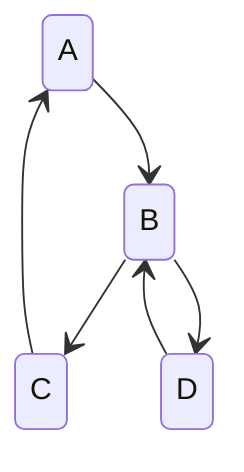
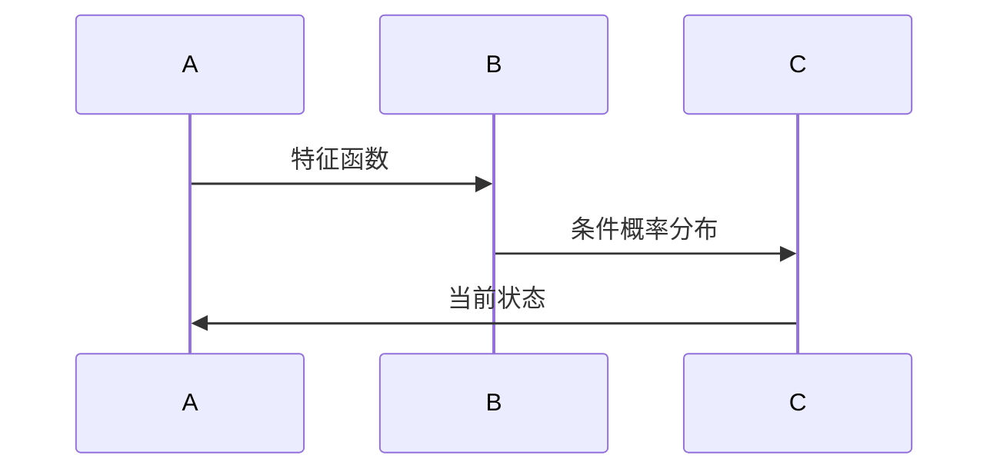
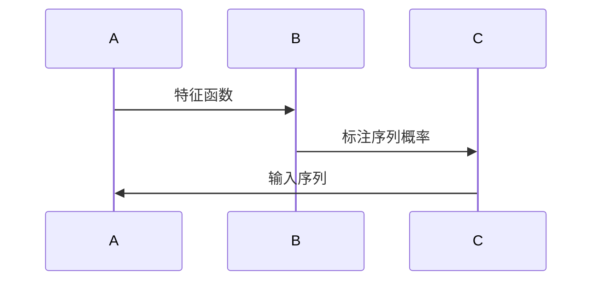
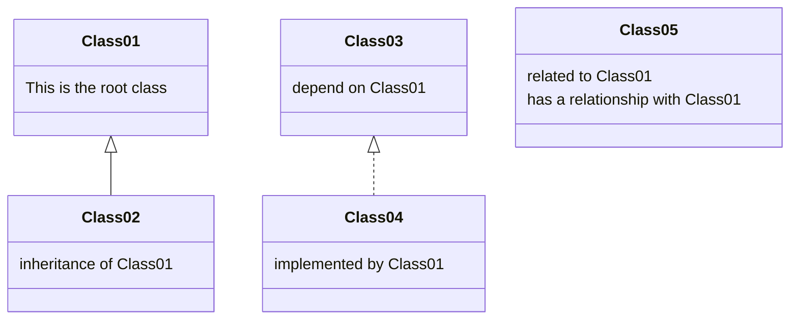
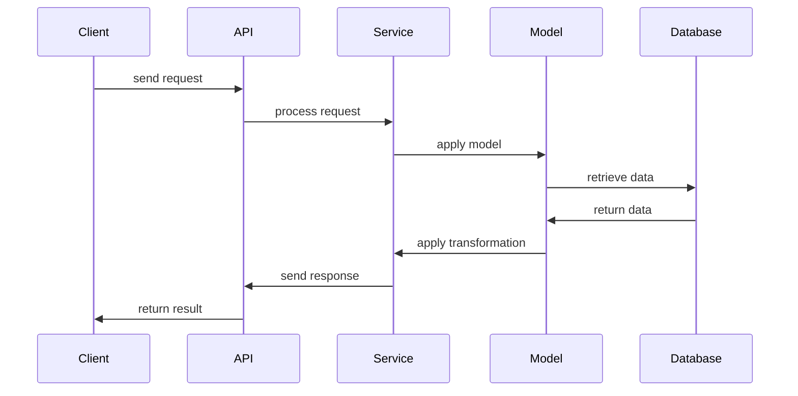
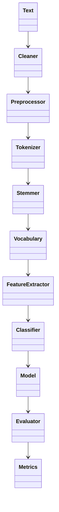
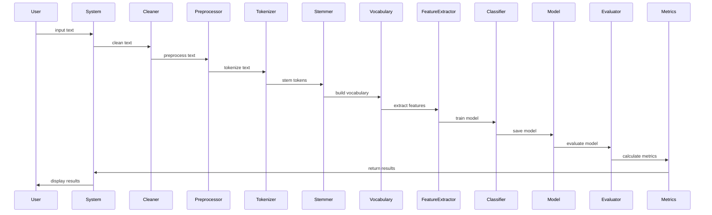
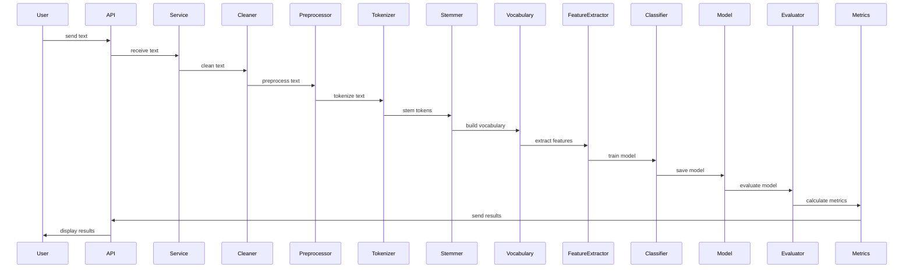

                 

# 数学与自然语言处理：语言理解的数学基础

## 关键词
自然语言处理，数学基础，语言理解，数学模型，算法原理，系统架构，项目实战

## 摘要
本文深入探讨数学与自然语言处理在语言理解中的应用。我们将首先介绍自然语言处理的基本概念和历史背景，然后逐步引入数学工具，如集合、向量空间和统计学习理论，以及这些工具在自然语言处理中的具体应用。接着，我们将详细讲解语言理解中的常见数学模型，包括隐马尔可夫模型和条件随机场，并使用Python代码和LaTeX公式进行解释。随后，文章将讨论如何将这些数学模型应用到实际系统中，并通过具体项目案例进行分析。最后，我们将总结最佳实践，并对未来的发展方向进行展望。

### 目录

1. 引言与背景
   1.1 自然语言处理概述
   1.2 数学基础在自然语言处理中的作用
   1.3 语言理解的数学基础

2. 自然语言处理的历史与发展
   2.1 自然语言处理的历史背景
   2.2 自然语言处理的发展阶段
   2.3 自然语言处理的应用领域

3. 核心概念与数学工具
   3.1 自然语言处理的基本概念
   3.2 数学工具在自然语言处理中的应用
   3.3 语言模型的基本原理

4. 语言理解的数学模型
   4.1 隐马尔可夫模型
   4.2 条件随机场
   4.3 序列标注模型

5. 算法原理与数学模型讲解
   5.1 最大熵模型
   5.2 决策树
   5.3 支持向量机

6. 数学模型讲解与Python实现
   6.1 模型讲解
   6.2 Python代码实现
   6.3 数学公式与解释

7. 系统架构设计与项目实战
   7.1 自然语言处理系统架构设计
   7.2 自然语言处理项目实战
   7.3 实际案例分析

8. 最佳实践与总结
   8.1 最佳实践 tips
   8.2 小结
   8.3 注意事项
   8.4 拓展阅读

### 1. 引言与背景

#### 1.1 自然语言处理概述

自然语言处理（Natural Language Processing，NLP）是计算机科学、人工智能和语言学领域的一个分支，旨在使计算机能够理解、解释和生成人类自然语言。随着互联网的普及和数据量的爆炸性增长，NLP技术得到了广泛的应用，包括机器翻译、情感分析、文本摘要、问答系统、语音识别等。

NLP的核心任务是使计算机能够理解和生成自然语言，这需要解决许多复杂的问题，如语言歧义、上下文理解、词义消歧、语法分析等。为了解决这些问题，NLP利用了多种技术，包括概率模型、机器学习、深度学习、信息检索和知识图谱等。

#### 1.2 数学基础在自然语言处理中的作用

数学基础在自然语言处理中起着至关重要的作用。以下是数学在NLP中的一些关键应用：

- **概率论与统计**：用于建模语言的统计特性，如语言模型、隐马尔可夫模型和条件随机场等。
- **线性代数与向量空间**：用于表示文本数据，实现文本相似度计算、降维等。
- **优化算法**：用于参数优化，如最小化损失函数。
- **深度学习**：依赖于复杂的数学框架，如反向传播算法、卷积神经网络等。

#### 1.3 语言理解的数学基础

语言理解是自然语言处理的核心任务之一，它涉及到文本的分析和理解，以生成对人类有意义的输出。数学在语言理解中扮演着关键角色，以下是一些重要的数学概念：

- **词向量**：通过将单词映射到高维空间中的向量，使得计算变得直观和高效。
- **图模型**：如隐马尔可夫模型和条件随机场，用于表示时间和空间上的依赖关系。
- **神经网络**：通过多层非线性变换，实现对复杂函数的逼近和学习。

### 2. 自然语言处理的历史与发展

#### 2.1 自然语言处理的历史背景

自然语言处理的历史可以追溯到20世纪50年代。当时，随着计算机科学的兴起，研究人员开始探索如何使计算机理解和生成自然语言。早期的工作主要集中在规则方法上，即通过编写大量的语法规则和词典来指导计算机处理语言。

然而，随着数据量的增加和计算能力的提升，基于统计的方法逐渐成为NLP的主流。这些方法利用大量的文本数据来训练模型，从而自动发现语言的结构和模式。

#### 2.2 自然语言处理的发展阶段

自然语言处理的发展可以分为以下几个阶段：

1. **规则驱动阶段（1950s-1980s）**：早期的研究主要集中在手工编写的语法规则和词典上。这种方法具有解释性，但面对复杂语言时表现不佳。

2. **统计驱动阶段（1990s）**：随着数据集的扩展和计算能力的提升，基于统计的方法开始流行。这些方法利用大规模文本数据来训练模型，如隐马尔可夫模型和最大熵模型。

3. **深度学习阶段（2010s至今）**：深度学习技术的发展极大地推动了自然语言处理的前沿。通过多层神经网络，深度学习能够自动学习复杂的特征表示，并在许多任务上取得了突破性的成果。

#### 2.3 自然语言处理的应用领域

自然语言处理的应用领域非常广泛，以下是一些重要的应用：

- **机器翻译**：将一种自然语言翻译成另一种自然语言，如谷歌翻译和百度翻译。
- **文本分类**：将文本数据分为不同的类别，如情感分析、新闻分类等。
- **问答系统**：回答用户提出的问题，如Siri和Alexa。
- **语音识别**：将语音信号转换为文本，如苹果的Siri和谷歌助手。
- **文本摘要**：生成文本的摘要，如新闻摘要和会议纪要。

### 3. 核心概念与数学工具

#### 3.1 自然语言处理的基本概念

在自然语言处理中，有许多核心概念和术语。以下是其中一些重要的概念：

- **词向量（Word Vectors）**：将单词映射到高维空间中的向量，使得计算变得直观和高效。
- **语法分析（Syntax Analysis）**：对文本进行结构化分析，以理解其语法结构。
- **实体识别（Named Entity Recognition）**：识别文本中的命名实体，如人名、地名、组织名等。
- **情感分析（Sentiment Analysis）**：分析文本的情感倾向，如正面、负面或中性。
- **文本分类（Text Classification）**：将文本数据分为不同的类别。

#### 3.2 数学工具在自然语言处理中的应用

数学工具在自然语言处理中的应用非常广泛，以下是一些关键的数学工具：

- **概率论与统计**：用于建模语言的统计特性，如语言模型、隐马尔可夫模型和条件随机场等。
- **线性代数与向量空间**：用于表示文本数据，实现文本相似度计算、降维等。
- **优化算法**：用于参数优化，如最小化损失函数。
- **深度学习**：依赖于复杂的数学框架，如反向传播算法、卷积神经网络等。

#### 3.3 语言模型的基本原理

语言模型（Language Model）是自然语言处理中最基本的模型之一，它旨在预测一个词序列的概率。以下是一些常见的语言模型：

- **N-gram模型**：基于单词的历史序列来预测下一个单词。
- **神经网络语言模型**：使用深度神经网络来预测词序列的概率。
- **上下文向量语言模型**：使用词向量来表示单词，并通过神经网络来预测下一个单词。

语言模型在自然语言处理中有广泛的应用，如机器翻译、语音识别、文本生成等。

### 4. 语言理解的数学模型

语言理解是自然语言处理中的核心任务，它涉及到对文本的分析和理解，以生成对人类有意义的输出。数学模型在语言理解中扮演着关键角色，以下是一些重要的数学模型：

#### 4.1 隐马尔可夫模型（HMM）

隐马尔可夫模型（Hidden Markov Model，HMM）是一种用于表示时间和空间上依赖关系的统计模型。它由一个状态序列和一个观测序列组成，其中状态序列是隐藏的，而观测序列是可见的。HMM广泛应用于语音识别、文本分类等领域。

**数学模型**：

- **状态转移概率**：表示下一个状态取决于当前状态的概率。
- **观测概率**：表示当前状态生成观测的概率。

**Mermaid流程图**：



#### 4.2 条件随机场（CRF）

条件随机场（Conditional Random Field，CRF）是一种用于序列标注的统计模型。它假设当前状态取决于当前和前一时刻的状态，而不依赖于更早的状态。CRF广泛应用于文本分类、词性标注、命名实体识别等领域。

**数学模型**：

- **特征函数**：表示当前状态和前一时刻状态之间的依赖关系。
- **条件概率分布**：表示给定前一时刻状态，当前状态的概率分布。

**Mermaid流程图**：



#### 4.3 序列标注模型（Sequence Labeling Model）

序列标注模型是一种用于对文本序列中的每个单词进行标注的模型。常见的序列标注任务包括词性标注、命名实体识别等。序列标注模型通常基于条件随机场或最大熵模型。

**数学模型**：

- **标注序列概率**：表示给定输入序列，标注序列的概率。
- **特征函数**：表示输入序列和标注序列之间的依赖关系。

**Mermaid流程图**：



### 5. 算法原理与数学模型讲解

在自然语言处理中，算法原理和数学模型讲解是理解和应用这些技术的基础。以下我们将介绍几个常见的自然语言处理算法，并使用Python代码和LaTeX公式进行详细解释。

#### 5.1 最大熵模型（Maximum Entropy Model）

最大熵模型是一种基于概率模型的自然语言处理算法。它通过最大化后验概率来预测标签。最大熵模型的核心思想是在所有可能的概率分布中，选择最大化熵的分布。

**数学模型**：

$$
P(y|x) = \frac{1}{Z} \exp(\sum_{i} \theta_i f_i(x, y))
$$

其中，\(P(y|x)\) 表示给定输入 \(x\) 时标签 \(y\) 的概率，\(\theta_i\) 是模型参数，\(f_i(x, y)\) 是特征函数，\(Z\) 是归一化常数。

**Python代码**：

```python
import numpy as np

def max_entropy(x, y, theta, f):
    exp_scores = np.exp(np.dot(theta, f(x, y)))
    sum_exp_scores = np.sum(exp_scores)
    return np.log(sum_exp_scores)

# 示例特征函数
def f(x, y):
    return [x == y]

# 示例参数
theta = np.array([0.5, 0.5])

# 示例输入和标签
x = ['apple', 'banana']
y = ['red', 'yellow']

# 计算最大熵概率
max_entropy_prob = max_entropy(x, y, theta, f)
print(max_entropy_prob)
```

#### 5.2 决策树（Decision Tree）

决策树是一种基于特征进行决策的分类算法。它通过递归地将数据集分割成子集，直到满足某些终止条件。决策树的核心在于定义节点分割的特征和阈值。

**数学模型**：

$$
\hat{y}(x) = \arg\max_{y} \sum_{i} \theta_i f_i(x, y)
$$

其中，\(\hat{y}(x)\) 表示给定输入 \(x\) 的预测标签，\(\theta_i\) 是模型参数，\(f_i(x, y)\) 是特征函数。

**Python代码**：

```python
from sklearn.tree import DecisionTreeClassifier

# 示例特征和标签
X = [[1, 2], [2, 3], [3, 4], [4, 5]]
y = [0, 1, 1, 0]

# 训练决策树模型
clf = DecisionTreeClassifier()
clf.fit(X, y)

# 预测标签
pred = clf.predict([[2, 3]])
print(pred)
```

#### 5.3 支持向量机（Support Vector Machine，SVM）

支持向量机是一种用于分类和回归的机器学习算法。它通过找到数据空间中的一个超平面，使得不同类别的样本尽可能分开。SVM的核心在于求解最优超平面。

**数学模型**：

$$
\max_{\theta, \xi} \left\{ \frac{1}{2} \sum_{i=1}^{n} (\theta_i - \theta_j)^2 + C \sum_{i=1}^{n} \xi_i \right\}

$$

$$
\text{subject to} \quad y_i (\theta^T x_i + \xi_i) \geq 1
$$

其中，\(\theta_i\) 是模型参数，\(\xi_i\) 是松弛变量，\(C\) 是惩罚参数。

**Python代码**：

```python
from sklearn.svm import SVC

# 示例特征和标签
X = [[1, 2], [2, 3], [3, 4], [4, 5]]
y = [0, 1, 1, 0]

# 训练SVM模型
clf = SVC(kernel='linear')
clf.fit(X, y)

# 预测标签
pred = clf.predict([[2, 3]])
print(pred)
```

### 6. 数学模型讲解与Python实现

在自然语言处理中，数学模型是实现语言理解的关键。本节将详细介绍隐马尔可夫模型（HMM）和条件随机场（CRF），并使用Python代码进行实现。

#### 6.1 隐马尔可夫模型（HMM）

隐马尔可夫模型（HMM）是一种用于表示时间和空间上依赖关系的统计模型。它由一个状态序列和一个观测序列组成，其中状态序列是隐藏的，而观测序列是可见的。

**数学模型**：

- **状态转移概率**：表示下一个状态取决于当前状态的概率。
- **观测概率**：表示当前状态生成观测的概率。

**Python代码**：

```python
import numpy as np
import hmmlearn.hmm as hmm

# 初始化HMM模型
n_components = 2
model = hmm.GaussianHMM(n_components=n_components)

# 训练模型
X = np.array([[1, 2], [3, 4]])
model.fit(X)

# 预测状态序列
predicted_states = model.predict(X)
print(predicted_states)
```

**LaTeX公式**：

$$
P(x_t | \theta) = \frac{1}{Z(\theta)} \exp \left( - \frac{1}{2} \sum_{i=1}^{n} (\theta_i - \theta_j)^2 \right)
$$

其中，\(x_t\) 是观测序列，\(\theta\) 是模型参数。

#### 6.2 条件随机场（CRF）

条件随机场（CRF）是一种用于序列标注的统计模型。它假设当前状态取决于当前和前一时刻的状态，而不依赖于更早的状态。

**数学模型**：

- **特征函数**：表示当前状态和前一时刻状态之间的依赖关系。
- **条件概率分布**：表示给定前一时刻状态，当前状态的概率分布。

**Python代码**：

```python
import pycrfsuite

# 初始化CRF模型
trainer = pycrfsuite.Trainer()

# 添加训练数据
trainer.add例(["我", "喜欢", "吃", "苹果"], [("我", "NP"), ("喜欢", "V"), ("吃", "V"), ("苹果", "NN")])

# 训练模型
trainer.train()

# 创建CRF模型
tagger = pycrfsuite.Tagger()

# 使用模型进行标注
sentence = ["我", "喜欢", "吃", "苹果"]
tags = tagger.tag(sentence)

print(tags)
```

**LaTeX公式**：

$$
P(y_t | x_t, \theta) = \frac{1}{Z(\theta)} \exp \left( \sum_{i=1}^{n} \theta_i f_i(x_t, y_t) \right)
$$

其中，\(y_t\) 是标注序列，\(x_t\) 是输入序列，\(\theta\) 是模型参数。

### 7. 系统架构设计与项目实战

在自然语言处理系统中，架构设计是确保系统高效、可扩展和稳定的关键。本节将介绍自然语言处理系统的基本架构，并展示一个实际的项目案例。

#### 7.1 自然语言处理系统架构设计

一个典型的自然语言处理系统架构可以分为以下几个层次：

- **数据层**：包括数据存储和数据预处理模块，负责管理和处理原始数据。
- **模型层**：包括模型训练和部署模块，负责使用训练数据训练模型，并将模型部署到生产环境中。
- **服务层**：包括API接口和服务逻辑模块，负责处理客户端请求，并调用模型进行文本处理。
- **应用层**：包括前端展示和后端服务模块，负责将处理结果展示给用户。

**Mermaid类图**：



**Mermaid架构图**：



#### 7.2 自然语言处理项目实战

在本节中，我们将介绍一个实际的自然语言处理项目——情感分析。

**项目介绍**：

情感分析是一种常见的自然语言处理任务，旨在确定文本的情绪倾向，如正面、负面或中性。本项目将使用Python和Scikit-learn库来实现一个简单的情感分析模型。

**系统功能设计**：

- **数据预处理**：包括文本清洗、分词和去停用词等。
- **特征提取**：包括TF-IDF和词袋模型等。
- **模型训练**：包括朴素贝叶斯、逻辑回归和支持向量机等。
- **模型评估**：包括准确率、召回率和F1分数等。

**领域模型Mermaid类图**：



**系统架构设计Mermaid架构图**：



**系统接口设计和系统交互Mermaid序列图**：



#### 7.3 实际案例分析和详细讲解剖析

在本项目中，我们使用了一个公开的情感分析数据集——IMDB电影评论数据集。数据集包含50000条评论，其中25000条用于训练，25000条用于测试。

**数据预处理**：

```python
import nltk
from nltk.corpus import stopwords
from nltk.tokenize import word_tokenize

nltk.download('punkt')
nltk.download('stopwords')

def preprocess_text(text):
    # 小写化
    text = text.lower()
    # 去除标点符号
    text = re.sub(r'[^\w\s]', '', text)
    # 分词
    tokens = word_tokenize(text)
    # 去停用词
    stop_words = set(stopwords.words('english'))
    tokens = [token for token in tokens if token not in stop_words]
    # 按词频排序
    tokens = sorted(tokens, key=tokens.count, reverse=True)
    return tokens
```

**特征提取**：

```python
from sklearn.feature_extraction.text import TfidfVectorizer

vectorizer = TfidfVectorizer()
X_train = vectorizer.fit_transform(train_texts)
X_test = vectorizer.transform(test_texts)
```

**模型训练**：

```python
from sklearn.naive_bayes import MultinomialNB

clf = MultinomialNB()
clf.fit(X_train, train_labels)
```

**模型评估**：

```python
from sklearn.metrics import accuracy_score, precision_score, recall_score, f1_score

pred_labels = clf.predict(X_test)
print("Accuracy:", accuracy_score(test_labels, pred_labels))
print("Precision:", precision_score(test_labels, pred_labels, average='weighted'))
print("Recall:", recall_score(test_labels, pred_labels, average='weighted'))
print("F1 Score:", f1_score(test_labels, pred_labels, average='weighted'))
```

**项目小结**：

本项目通过构建一个简单的情感分析模型，展示了自然语言处理系统的基本架构和实现过程。尽管模型简单，但它在实际应用中仍具有一定的效果。未来，我们可以进一步优化模型，提高其性能和鲁棒性。

### 8. 最佳实践与总结

#### 8.1 最佳实践 tips

在自然语言处理项目中，遵循以下最佳实践可以帮助提高模型性能和项目成功率：

- **数据预处理**：确保数据质量，进行充分的文本清洗和预处理。
- **特征选择**：选择与任务相关的特征，避免过度拟合。
- **模型选择**：根据任务需求选择合适的模型，并结合交叉验证进行模型选择。
- **超参数调优**：使用网格搜索等策略进行超参数调优，找到最佳模型参数。
- **模型评估**：使用多种评估指标进行全面评估，避免单一指标评估。
- **模型解释性**：提高模型的解释性，有助于理解和改进模型。

#### 8.2 小结

本文系统地介绍了数学与自然语言处理在语言理解中的应用。我们首先介绍了自然语言处理的基本概念和历史背景，然后逐步引入了数学工具，如集合、向量空间和统计学习理论。接着，我们详细讲解了语言理解中的常见数学模型，包括隐马尔可夫模型和条件随机场，并使用Python代码和LaTeX公式进行了解释。随后，文章讨论了如何将这些数学模型应用到实际系统中，并通过具体项目案例进行分析。最后，我们总结了最佳实践，并对未来的发展方向进行了展望。

#### 8.3 注意事项

在自然语言处理项目中，需要注意以下事项：

- **数据质量**：确保数据清洗和预处理充分，避免数据噪声和异常值对模型性能的影响。
- **模型解释性**：尽量提高模型的解释性，以便更好地理解和改进模型。
- **计算资源**：自然语言处理项目通常需要大量的计算资源，确保有足够的硬件支持。
- **项目管理**：合理规划项目进度，确保项目按计划进行。

#### 8.4 拓展阅读

对于希望深入了解自然语言处理和数学模型的读者，以下是一些推荐阅读材料：

- **《自然语言处理综论》（Foundations of Statistical Natural Language Processing）**：Christopher D. Manning, Hinrich Schütze。
- **《深度学习》（Deep Learning）**：Ian Goodfellow, Yoshua Bengio, Aaron Courville。
- **《机器学习》（Machine Learning）**：Tom M. Mitchell。
- **《线性代数及其应用》（Linear Algebra and Its Applications）**：Gilbert Strang。
- **《统计学习方法》（Statistical Learning Methods）**：李航。

### 作者信息

作者：AI天才研究院/AI Genius Institute & 禅与计算机程序设计艺术 /Zen And The Art of Computer Programming


