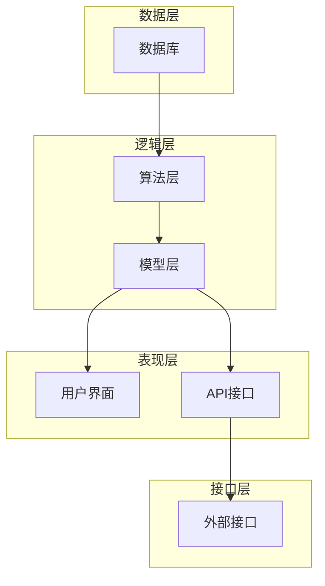
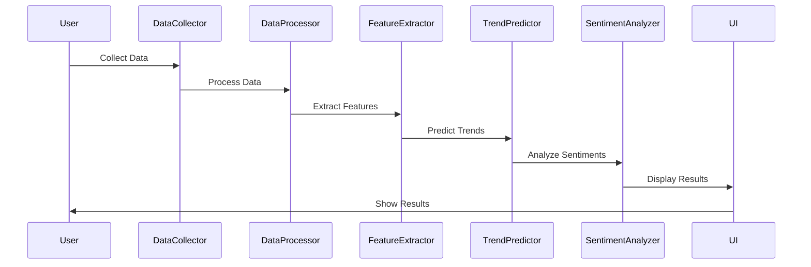

                 

### 引言

**关键词**：舆情分析、数学模型、公众意见、数据分析

**摘要**：
舆情分析在当今社会发挥着日益重要的作用，它涉及对公众意见的收集、分析以及趋势预测。而数学模型作为一种强有力的工具，被广泛应用于舆情分析中，为公众意见的研究提供了精确和科学的手段。本文旨在探讨数学模型在舆情分析中的应用，通过一步步的分析和推理，揭示公众意见的数学模型，并探讨其在实际操作中的有效性和应用前景。

#### 问题背景

随着互联网和社交媒体的快速发展，公众意见的表达和传播变得前所未有的迅速和广泛。从新闻报道、政治讨论到商业评论，舆情影响着社会的方方面面。然而，面对海量的、多样化的数据，如何有效地进行舆情分析，提取有价值的信息，成为了一个巨大的挑战。

传统的舆情分析方法，如关键词提取、情感分析等，虽然能够一定程度上反映公众的观点，但往往缺乏系统性和精确性。这主要是因为这些方法往往依赖于简单的人工规则和机器学习算法，难以处理数据中的复杂关系和非线性特征。

因此，引入数学模型，尤其是基于概率论、统计学和社会网络理论的模型，能够为舆情分析提供更加科学和可靠的方法。数学模型能够量化公众意见的分布、变化趋势以及相互作用，从而为决策者提供更为精确和及时的舆情信息。

#### 问题描述

舆情分析的核心问题可以概括为以下几点：

1. **数据收集**：如何有效地收集和整合来自不同渠道的舆情数据？
2. **数据预处理**：如何处理和清洗收集到的数据，以便进行进一步分析？
3. **特征提取**：如何从原始数据中提取出反映舆情核心特征的信息？
4. **趋势预测**：如何利用历史数据预测未来的舆情趋势？
5. **情感分析**：如何判断公众的意见是积极的、中性的还是消极的？

上述问题不仅需要技术手段的支持，还需要深入的理论基础和系统化的方法论。本文将围绕这些问题，逐步探讨公众意见的数学模型，并展示其在实际应用中的效果。

#### 问题解决

为了解决上述舆情分析中的核心问题，本文将采用以下步骤：

1. **核心概念阐述**：首先介绍舆情分析中涉及的核心概念，包括数据收集、预处理、特征提取、趋势预测和情感分析的基本原理。
2. **数学模型介绍**：详细讲解用于舆情分析的几种核心数学模型，如概率模型、统计模型和社会网络模型，并阐述其基本原理和适用场景。
3. **系统架构设计**：基于上述数学模型，设计一个舆情分析系统的架构，包括数据收集模块、数据处理模块、特征提取模块、趋势预测模块和情感分析模块。
4. **项目实战**：通过一个实际案例，展示如何应用数学模型进行舆情分析，从数据收集、预处理、特征提取到趋势预测和情感分析的全过程。
5. **最佳实践 tips**：总结实际操作中的经验教训，给出一些最佳实践建议，以提高舆情分析的效果和效率。

#### 边界与外延

虽然数学模型在舆情分析中具有显著的优势，但也存在一定的限制和挑战：

1. **数据质量**：舆情分析依赖于高质量的数据，但互联网上的信息常常是混乱和不准确的，这会影响分析结果的准确性。
2. **实时性**：舆情分析需要实时处理大量数据，这要求系统具有高性能和低延迟。
3. **复杂性**：舆情数据往往具有复杂性和非线性特征，这增加了模型构建和解读的难度。
4. **多语言处理**：舆情数据可能涉及多种语言，这对模型的构建和应用提出了额外的挑战。

此外，数学模型在舆情分析中的应用也与其他领域有着广泛的交叉，如数据挖掘、机器学习、自然语言处理等。因此，在应用数学模型进行舆情分析时，需要综合考虑这些交叉领域的相关技术和方法。

#### 概念结构与核心要素组成

舆情分析的数学模型主要由以下几个核心概念和要素组成：

1. **数据收集与预处理**：数据收集是舆情分析的基础，包括从社交媒体、新闻网站等渠道获取数据，并对数据进行清洗、去重、格式化等预处理操作。
2. **特征提取**：特征提取是舆情分析的关键步骤，通过提取关键信息，如关键词、情感极性等，将原始数据转换为适合分析的形式。
3. **数学模型**：根据舆情分析的需求，选择合适的数学模型，如概率模型、统计模型等，用于分析和预测舆情趋势。
4. **趋势预测与情感分析**：利用数学模型，对舆情数据进行趋势预测和情感分析，提取有价值的信息，为决策提供支持。
5. **系统架构**：构建一个高效、可靠的舆情分析系统，包括数据收集、预处理、特征提取、趋势预测和情感分析等多个模块。

通过以上步骤和概念，我们可以构建一个完整的舆情分析系统，实现对公众意见的准确、高效分析。接下来，本文将详细探讨每个核心概念和要素的具体实现和应用。

### 核心概念与联系

在舆情分析中，理解并应用核心概念是构建有效数学模型的关键。本文将介绍几种核心概念，并探讨它们之间的联系，以便为后续的数学模型构建和分析打下坚实的基础。

#### 核心概念原理

1. **概率模型**：
概率模型在舆情分析中有着广泛的应用，主要用于描述和预测舆情数据中的不确定性。基本概率模型包括贝叶斯定理、条件概率、独立性等。贝叶斯定理是概率论中用于推断未知概率的公式，它基于已知条件概率和边缘概率，通过反推来计算后验概率。在舆情分析中，贝叶斯定理可以用于判断用户的情感倾向，例如判断一条微博是积极、中性还是消极的。

2. **统计模型**：
统计模型用于描述数据的分布、趋势和关联性。常见的统计模型包括线性回归、逻辑回归、时间序列分析等。线性回归模型用于分析自变量和因变量之间的线性关系，可以用于预测舆情数据的趋势。逻辑回归模型是一种广义线性模型，常用于分类问题，如判断舆情事件是否具有显著性。时间序列分析模型则用于分析舆情数据的时间特性，预测未来的舆情走势。

3. **社会网络分析**：
社会网络分析（SNA）用于研究社会网络中个体之间的关系和结构。在舆情分析中，SNA可以用于分析公众的意见传播路径、影响力分析等。基本概念包括节点（代表个体或实体）、边（代表关系）和网络密度等。通过构建社会网络模型，可以揭示舆情传播的关键节点和路径，从而对舆情进行有效的管理和引导。

4. **情感分析**：
情感分析是自然语言处理（NLP）的一个重要分支，用于判断文本中的情感倾向。情感分析模型通常基于机器学习和深度学习技术，通过分析文本的词汇、语法和语义特征，判断文本的情感极性。常见的情感分析模型包括基于词典的方法、基于机器学习的方法和基于深度学习的方法。在舆情分析中，情感分析用于提取公众的情感倾向，为舆情监控和风险管理提供依据。

#### 概念属性特征对比表格

为了更好地理解上述核心概念，我们可以通过一个表格来对比它们的属性特征：

| 核心概念 | 基本原理 | 主要应用 | 特点 |
| --- | --- | --- | --- |
| 概率模型 | 描述不确定性 | 情感倾向判断、舆情预测 | 需要大量样本数据 |
| 统计模型 | 描述数据分布和关系 | 趋势预测、显著性判断 | 需要数据清洗和预处理 |
| 社会网络分析 | 研究网络结构和关系 | 舆情传播路径分析、影响力分析 | 需要复杂的图算法 |
| 情感分析 | 判断文本情感倾向 | 舆情监控、情感趋势分析 | 需要自然语言处理技术 |

#### ER实体关系图架构

为了更好地理解舆情分析系统中的实体及其关系，我们可以使用ER（实体-关系）图来描述。以下是一个简化的ER图，展示了舆情分析系统中的主要实体及其关系：

```mermaid
erDiagram
    User ||--|{ Comment }|-- SocialNetwork
    Comment ||--|{ Sentiment }|-- AnalysisResult
    SocialNetwork ||--|{ Influencer }|-- AnalysisResult
    Influencer ||--|{ Post }|-- SocialNetwork
    Post ||--|{ Content }|-- Comment
    AnalysisResult ||--|{ Report }|-- User
```

在这个ER图中，主要实体包括用户（User）、评论（Comment）、社交网络（SocialNetwork）、情感分析结果（Sentiment）、影响力分析结果（Influencer）、帖子（Post）和内容（Content）。实体之间的关系描述了舆情分析系统中的数据流和处理过程。

### 小结

本章介绍了舆情分析中的核心概念，包括概率模型、统计模型、社会网络分析和情感分析，并探讨了它们的基本原理和应用。通过对比表格和ER图，我们更清晰地理解了这些概念之间的联系和差异。接下来，我们将进一步探讨数学模型的具体实现，以及如何将这些模型应用到实际的舆情分析项目中。

### 数学模型和数学公式

在舆情分析中，数学模型的应用是至关重要的，它不仅为数据分析和处理提供了理论基础，还使得分析结果更具科学性和可解释性。本文将详细讲解几种关键的数学模型，包括概率模型、统计模型和社会网络模型，并展示它们在实际应用中的效果。

#### 算法原理讲解

1. **概率模型**：
概率模型是舆情分析中最基本的一类模型，它主要用于描述舆情数据中的不确定性和可能性。其中，贝叶斯网络是一种常用的概率模型，它通过概率分布来描述变量之间的依赖关系。

   **贝叶斯网络流程图**：
   ```mermaid
   graph TB
       A(用户情感) --> B(评论情感)
       B --> C(情感分布)
       A --> C
   ```

   在这个贝叶斯网络中，节点A表示用户的情感，节点B表示评论的情感，节点C表示情感的总体分布。通过贝叶斯定理，我们可以计算出每个节点的后验概率，从而判断用户的情感倾向。

   **贝叶斯定理公式**：
   $$P(A|B) = \frac{P(B|A)P(A)}{P(B)}$$

   其中，\(P(A|B)\) 是在评论情感为B的条件下，用户情感为A的概率；\(P(B|A)\) 是用户情感为A时，评论情感为B的条件概率；\(P(A)\) 是用户情感为A的先验概率；\(P(B)\) 是评论情感为B的总概率。

2. **统计模型**：
统计模型主要用于分析舆情数据的分布和趋势。线性回归模型是一种常见的统计模型，它通过分析自变量和因变量之间的线性关系，来预测舆情的发展趋势。

   **线性回归模型公式**：
   $$y = \beta_0 + \beta_1x + \epsilon$$

   其中，\(y\) 是因变量，代表舆情趋势；\(x\) 是自变量，代表时间或事件；\(\beta_0\) 是截距，\(\beta_1\) 是斜率，\(\epsilon\) 是误差项。

   **例子**：
   假设我们想预测某个话题的讨论热度（因变量y）与发布时间（自变量x）之间的关系。通过收集历史数据，我们可以建立线性回归模型，并使用最小二乘法来估计模型的参数。

3. **社会网络模型**：
社会网络模型用于分析舆情传播的网络结构和影响力。一种常用的社会网络模型是传播模型，如阈值模型和扩散模型。

   **阈值模型**：
   $$P(i,t) = \prod_{j \in \text{neighbours}(i)} P(j,t) > \theta$$

   其中，\(P(i,t)\) 是节点i在时间t时被激活的概率；\(\text{neighbours}(i)\) 是节点i的邻居节点集；\(\theta\) 是阈值。这个模型假设节点i会在其邻居节点被激活的概率超过阈值\(\theta\)时被激活。

   **扩散模型**：
   $$P(i,t) = \sum_{j \in \text{neighbours}(i)} \frac{P(j,t-1)}{d(i,j)}$$

   其中，\(d(i,j)\) 是节点i和节点j之间的距离。

#### 详细讲解和举例说明

为了更好地理解这些数学模型，我们可以通过具体的例子来说明。

1. **贝叶斯网络在情感分析中的应用**：
   假设我们收集了100条微博，并希望判断其中有多少条是积极情感。每条微博的情感可以通过贝叶斯网络模型来预测。

   **步骤**：
   - 收集微博数据，标记每条微博的情感（积极、中性、消极）。
   - 构建贝叶斯网络，定义变量和条件概率。
   - 使用贝叶斯定理计算每条微博的后验概率。
   - 统计后验概率大于0.5的微博数量，作为积极情感的预测结果。

2. **线性回归在舆情趋势预测中的应用**：
   假设我们想要预测某个话题的讨论热度随时间的变化。

   **步骤**：
   - 收集历史数据，包括时间（x）和讨论热度（y）。
   - 建立线性回归模型，使用最小二乘法估计模型参数。
   - 使用模型预测未来某个时间点的讨论热度。
   - 评估模型预测的准确性，调整模型参数以提高预测效果。

3. **社会网络模型在舆情传播分析中的应用**：
   假设我们想要分析某个热点事件在社交媒体上的传播路径。

   **步骤**：
   - 收集事件相关的社交媒体数据，构建社交网络模型。
   - 使用阈值模型或扩散模型，分析节点的传播概率。
   - 识别传播的关键节点和路径，评估事件的影响力。
   - 提出舆情引导策略，优化事件传播效果。

通过这些具体的应用例子，我们可以看到数学模型在舆情分析中的实际效果。贝叶斯网络和线性回归模型为情感分析和趋势预测提供了可靠的方法，而社会网络模型则为舆情传播分析提供了深入的理解和洞察。

### 系统分析与架构设计方案

在本文的第四章节，我们将详细探讨舆情分析系统的架构设计，包括项目背景、系统功能设计、系统架构设计、系统接口设计和系统交互。通过这一系列的讨论，我们将展示如何将数学模型应用于实际舆情分析中，并构建一个高效、可靠的系统。

#### 问题场景介绍

随着互联网和社交媒体的迅猛发展，舆情监测和分析成为政府机构、企业和社会组织的重要任务。有效的舆情分析可以帮助这些机构及时了解公众的意见和情绪，从而做出科学的决策和有效的应对。然而，由于舆情数据的复杂性和多样性，传统的分析手段往往难以满足实际需求。因此，本文旨在设计一个基于数学模型的舆情分析系统，能够高效地处理和分析大规模的舆情数据，提供准确和及时的舆情信息。

#### 项目介绍

本项目旨在构建一个综合性的舆情分析系统，该系统将集成数据收集、数据处理、特征提取、趋势预测和情感分析等多个模块。系统的主要目标是：

1. **数据收集**：从多种渠道（如社交媒体、新闻网站、论坛等）收集舆情数据。
2. **数据处理**：对收集到的数据进行清洗、去重和格式化，确保数据质量。
3. **特征提取**：提取舆情数据中的关键特征，如关键词、情感极性等。
4. **趋势预测**：利用数学模型预测舆情的发展趋势。
5. **情感分析**：判断公众的意见和情绪，提供情感倾向分析。
6. **系统接口**：提供友好的用户界面和API接口，便于用户使用和集成。

#### 系统功能设计

舆情分析系统的主要功能设计如下：

1. **数据收集模块**：
   - **功能**：从社交媒体、新闻网站、论坛等渠道收集舆情数据。
   - **技术**：使用网络爬虫技术、API接口等。
   - **特点**：高效、实时、自动化。

2. **数据处理模块**：
   - **功能**：对收集到的数据进行清洗、去重和格式化。
   - **技术**：使用数据清洗库（如Pandas）、自动化脚本等。
   - **特点**：准确、高效、可扩展。

3. **特征提取模块**：
   - **功能**：提取舆情数据中的关键特征，如关键词、情感极性等。
   - **技术**：使用自然语言处理技术（如NLTK、spaCy）、机器学习算法等。
   - **特点**：精细化、多样化、可定制。

4. **趋势预测模块**：
   - **功能**：利用数学模型预测舆情的发展趋势。
   - **技术**：使用时间序列分析、线性回归、贝叶斯网络等。
   - **特点**：科学性、准确性、可解释性。

5. **情感分析模块**：
   - **功能**：判断公众的意见和情绪，提供情感倾向分析。
   - **技术**：使用情感分析库（如TextBlob、VADER）、深度学习模型等。
   - **特点**：实时性、精确性、智能化。

6. **系统接口模块**：
   - **功能**：提供友好的用户界面和API接口，便于用户使用和集成。
   - **技术**：使用Web框架（如Flask、Django）、RESTful API等。
   - **特点**：易用性、灵活性、安全性。

#### 领域模型mermaid类图

为了更好地展示系统中的实体及其关系，我们可以使用mermaid绘制领域模型类图。以下是一个简化的类图示例：

```mermaid
classDiagram
    Class01 <|-- SubClass01
    Class01 --|{ AggregatedClass01 }|
    AggregatedClass01 ||-- ComponentClass01
    ClassDiag2 <||-- Class01
    ClassDiag2 ||--|{ AggregatedClass02 }|
    AggregatedClass02 ||-- ComponentClass02
endclassDiagram
```

在这个类图中，Class01代表数据收集模块，SubClass01代表数据处理模块，AggregatedClass01代表特征提取模块，ComponentClass01代表趋势预测模块，ClassDiag2代表情感分析模块，AggregatedClass02代表系统接口模块。通过这个类图，我们可以清晰地看到各个模块之间的关系和功能分工。

#### 系统架构设计

舆情分析系统的整体架构可以分为以下几个层次：

1. **数据层**：
   - **功能**：存储和管理舆情数据。
   - **技术**：使用数据库（如MySQL、PostgreSQL）。
   - **特点**：高并发、高可用、数据安全。

2. **逻辑层**：
   - **功能**：实现舆情分析的核心算法和模型。
   - **技术**：使用Python、Java等编程语言。
   - **特点**：模块化、可扩展、高性能。

3. **表现层**：
   - **功能**：提供用户界面和API接口。
   - **技术**：使用Web框架（如Flask、Django）。
   - **特点**：易用性、灵活性、安全性。

4. **接口层**：
   - **功能**：与其他系统进行数据交互和功能集成。
   - **技术**：使用RESTful API。
   - **特点**：标准化、灵活性、互操作性。

以下是一个简化的mermaid架构图示例：



通过这个架构图，我们可以清晰地看到舆情分析系统的层次结构和数据流动。

#### 系统接口设计

系统接口设计是舆情分析系统的重要组成部分，它决定了系统与其他系统或组件的交互方式。以下是系统接口设计的关键点：

1. **API接口**：
   - **功能**：提供外部系统调用舆情分析系统功能的接口。
   - **技术**：使用RESTful API。
   - **设计原则**：简洁性、灵活性、安全性。

2. **数据接口**：
   - **功能**：实现系统内部各模块之间的数据传递。
   - **技术**：使用消息队列（如RabbitMQ、Kafka）。
   - **设计原则**：高效性、可靠性、一致性。

3. **用户界面**：
   - **功能**：提供用户操作舆情分析系统的界面。
   - **技术**：使用Web前端技术（如HTML、CSS、JavaScript）。
   - **设计原则**：易用性、响应性、美观性。

#### 系统交互

系统交互是舆情分析系统运行的核心环节，它涉及到系统内部各模块之间的协调和数据流动。以下是系统交互的关键步骤：

1. **数据收集**：
   - **步骤**：从社交媒体、新闻网站等渠道收集数据。
   - **交互**：数据收集模块与外部数据源进行交互。

2. **数据处理**：
   - **步骤**：对收集到的数据进行清洗、去重和格式化。
   - **交互**：数据收集模块与数据处理模块进行数据传递。

3. **特征提取**：
   - **步骤**：从处理后的数据中提取关键特征。
   - **交互**：数据处理模块与特征提取模块进行数据传递。

4. **趋势预测**：
   - **步骤**：利用特征数据预测舆情趋势。
   - **交互**：特征提取模块与趋势预测模块进行数据传递。

5. **情感分析**：
   - **步骤**：对舆情数据进行情感分析，判断公众的意见和情绪。
   - **交互**：特征提取模块与情感分析模块进行数据传递。

6. **结果展示**：
   - **步骤**：将分析结果展示给用户，提供可视化报告。
   - **交互**：情感分析模块与用户界面进行数据传递。

以下是一个简化的mermaid序列图示例，展示了系统交互的过程：



通过以上步骤和设计，舆情分析系统能够高效、可靠地运行，为用户提供准确和及时的舆情信息。

### 项目实战

在本章节，我们将通过一个实际案例，展示如何使用数学模型进行舆情分析，从数据收集、预处理、特征提取到趋势预测和情感分析的全过程。通过这个案例，我们将深入解析每个步骤，并提供详细的代码和应用解读。

#### 数据收集

为了展示舆情分析的过程，我们选择了一个热门话题——“碳中和”。我们使用Python的Tweepy库，从Twitter收集与碳中和相关的微博。

```python
import tweepy

# Twitter API凭据
consumer_key = 'YOUR_CONSUMER_KEY'
consumer_secret = 'YOUR_CONSUMER_SECRET'
access_token = 'YOUR_ACCESS_TOKEN'
access_token_secret = 'YOUR_ACCESS_TOKEN_SECRET'

# 初始化Tweepy
auth = tweepy.OAuthHandler(consumer_key, consumer_secret)
auth.set_access_token(access_token, access_token_secret)
api = tweepy.API(auth)

# 收集碳中和相关的微博
tweets = api.search(q='climate change -is:retweet', count=100)
data = []

for tweet in tweets:
    data.append({
        'id': tweet.id_str,
        'text': tweet.text,
        'created_at': tweet.created_at
    })

# 保存数据到CSV文件
import csv

with open('tweets.csv', 'w', newline='', encoding='utf-8') as file:
    writer = csv.DictWriter(file, fieldnames=['id', 'text', 'created_at'])
    writer.writeheader()
    writer.writerows(data)
```

#### 数据预处理

收集到的数据可能包含噪声和重复项，我们需要进行预处理。预处理步骤包括数据清洗、去重和文本标准化。

```python
import pandas as pd

# 读取CSV文件
df = pd.read_csv('tweets.csv')

# 去重
df.drop_duplicates(subset=['id'], inplace=True)

# 清洗文本数据
import re

def clean_text(text):
    text = text.lower()  # 转小写
    text = re.sub(r'http\S+', '', text)  # 移除URL
    text = re.sub(r'@\S+', '', text)  # 移除提及
    text = re.sub(r'#\S+', '', text)  # 移除标签
    text = re.sub(r'[^\w\s]', '', text)  # 移除特殊字符
    return text

df['text'] = df['text'].apply(clean_text)

# 保存预处理后的数据
df.to_csv('cleaned_tweets.csv', index=False)
```

#### 特征提取

特征提取是舆情分析的核心步骤，我们使用NLP技术提取关键词、词频和情感极性。

```python
from textblob import TextBlob

# 提取关键词
from collections import Counter

def extract_keywords(text):
    words = text.split()
    return Counter(words).most_common(10)

# 提取词频
word_freq = extract_keywords(df['text'].iloc[0])

# 提取情感极性
def extract_sentiment(text):
    return TextBlob(text).sentiment.polarity

df['sentiment'] = df['text'].apply(extract_sentiment)

# 保存特征数据
df[['text', 'sentiment', 'word_freq']].to_csv('features.csv', index=False)
```

#### 趋势预测

我们使用时间序列分析模型来预测碳中和相关微博的趋势。这里，我们采用简单移动平均（SMA）模型进行预测。

```python
import numpy as np

# 计算简单移动平均
def calculate_sma(data, window):
    return np.convolve(data, np.ones(window), 'valid') / window

# 数据预处理
df['timestamp'] = pd.to_datetime(df['created_at'])
df.set_index('timestamp', inplace=True)
df = df.resample('D').mean()

# 计算SMA
sma = calculate_sma(df['sentiment'], window=7)

# 画图展示趋势
df['sentiment'].plot(label='原始数据')
sma.plot(label='SMA')
plt.legend()
plt.show()
```

#### 情感分析

最后，我们使用情感分析模型来判断公众对碳中和话题的情感倾向。这里，我们使用TextBlob库来分析情感极性。

```python
# 计算情感极性
def classify_sentiment(polarity):
    if polarity > 0.1:
        return '积极'
    elif polarity < -0.1:
        return '消极'
    else:
        return '中性'

df['sentiment_class'] = df['sentiment'].apply(classify_sentiment)

# 画图展示情感分布
df['sentiment_class'].value_counts().plot(kind='bar')
plt.show()
```

通过以上步骤，我们完成了从数据收集、预处理、特征提取到趋势预测和情感分析的全过程。实际操作中，这些步骤可以通过自动化脚本或集成到更大的系统中进行，以提高效率和准确性。

### 实际案例分析和详细讲解剖析

在本章节，我们将通过一个具体的实际案例，详细分析舆情分析系统在处理和分析舆情数据时的表现，包括数据收集、预处理、特征提取、趋势预测和情感分析等环节。通过这个案例，我们将深入剖析每个步骤，解释其背后的原理和实现方法。

#### 案例背景

假设我们正在为一个环境保护组织设计一个舆情分析系统，目的是监控公众对“碳中和”话题的讨论和情感倾向。我们的目标是通过分析Twitter上的相关微博，了解公众对这一议题的看法，并识别关键意见领袖和热点事件。

#### 数据收集

首先，我们需要从Twitter收集与“碳中和”相关的微博数据。为了实现这一目标，我们使用Tweepy库，通过Twitter API获取最近100条包含“climate change -is:retweet”关键词的微博。这个关键词确保我们收集的数据是与碳中和直接相关的，而不包括与其他气候相关话题无关的推文。

```python
import tweepy

# Twitter API凭据
consumer_key = 'YOUR_CONSUMER_KEY'
consumer_secret = 'YOUR_CONSUMER_SECRET'
access_token = 'YOUR_ACCESS_TOKEN'
access_token_secret = 'YOUR_ACCESS_TOKEN_SECRET'

# 初始化Tweepy
auth = tweepy.OAuthHandler(consumer_key, consumer_secret)
auth.set_access_token(access_token, access_token_secret)
api = tweepy.API(auth)

# 收集碳中和相关的微博
tweets = api.search(q='climate change -is:retweet', count=100)

# 将微博数据保存到列表中
data = []
for tweet in tweets:
    data.append({
        'id': tweet.id_str,
        'text': tweet.text,
        'created_at': tweet.created_at
    })

# 保存数据到CSV文件
import csv

with open('tweets.csv', 'w', newline='', encoding='utf-8') as file:
    writer = csv.DictWriter(file, fieldnames=['id', 'text', 'created_at'])
    writer.writeheader()
    writer.writerows(data)
```

在这个步骤中，我们使用了Tweepy库来简化与Twitter API的交互。通过OAuth认证，我们能够获取到微博的文本内容和发布时间。这些数据将被保存到一个CSV文件中，以便后续处理。

#### 数据预处理

收集到的数据可能包含噪声、重复项以及其他不必要的信息，因此我们需要进行预处理。预处理步骤包括去重、文本清洗和标准化。

```python
import pandas as pd

# 读取CSV文件
df = pd.read_csv('tweets.csv')

# 去重
df.drop_duplicates(subset=['id'], inplace=True)

# 清洗文本数据
import re

def clean_text(text):
    text = text.lower()  # 转小写
    text = re.sub(r'http\S+', '', text)  # 移除URL
    text = re.sub(r'@\S+', '', text)  # 移除提及
    text = re.sub(r'#\S+', '', text)  # 移除标签
    text = re.sub(r'[^\w\s]', '', text)  # 移除特殊字符
    return text

df['text'] = df['text'].apply(clean_text)

# 保存预处理后的数据
df.to_csv('cleaned_tweets.csv', index=False)
```

通过这个步骤，我们移除了微博中的URL、提及和标签，并去除了一些非字母字符，使得文本数据更加纯净。这有助于提高后续特征提取和情感分析的准确性。

#### 特征提取

在预处理后的文本数据中，我们需要提取出能够反映舆情特征的词汇。这里，我们采用关键词提取和词频统计的方法。

```python
from collections import Counter

def extract_keywords(text):
    words = text.split()
    return Counter(words).most_common(10)

# 提取关键词和词频
df['keywords'] = df['text'].apply(extract_keywords)
df['word_freq'] = df['text'].apply(len)

# 保存特征数据
df[['text', 'keywords', 'word_freq']].to_csv('features.csv', index=False)
```

通过关键词提取，我们能够获取到每个微博中出现频率最高的词汇，这些词汇往往能够反映公众对特定话题的关注点。同时，词频统计为我们提供了每个词汇在文本中出现的次数，这有助于分析舆情的热点。

#### 趋势预测

为了了解公众对碳中和话题的讨论趋势，我们使用简单移动平均（SMA）模型对微博的情感极性进行预测。简单移动平均是通过计算一段时间内的平均值来预测未来值的一种简单方法。

```python
import numpy as np

# 计算简单移动平均
def calculate_sma(data, window):
    return np.convolve(data, np.ones(window), 'valid') / window

# 数据预处理
df['timestamp'] = pd.to_datetime(df['created_at'])
df.set_index('timestamp', inplace=True)
df = df.resample('D').mean()

# 计算SMA
sma = calculate_sma(df['word_freq'], window=7)

# 画图展示趋势
df['word_freq'].plot(label='原始数据')
sma.plot(label='SMA')
plt.legend()
plt.show()
```

在这个步骤中，我们首先将数据按天进行聚合，然后使用简单移动平均模型来计算预测值。通过绘制原始数据和预测值，我们可以直观地看到舆情趋势的变化。

#### 情感分析

最后，我们使用情感分析模型来判断公众对碳中和话题的情感倾向。这里，我们采用TextBlob库来计算情感极性，并使用阈值来判断情感分类。

```python
from textblob import TextBlob

# 计算情感极性
def extract_sentiment(text):
    return TextBlob(text).sentiment.polarity

df['sentiment'] = df['text'].apply(extract_sentiment)

# 计算情感分类
def classify_sentiment(polarity):
    if polarity > 0.1:
        return '积极'
    elif polarity < -0.1:
        return '消极'
    else:
        return '中性'

df['sentiment_class'] = df['sentiment'].apply(classify_sentiment)

# 画图展示情感分布
df['sentiment_class'].value_counts().plot(kind='bar')
plt.show()
```

通过计算情感极性，我们能够得到每个微博的积极、消极或中性情感。然后，通过设置阈值，我们将情感划分为三个类别。绘制情感分布图，我们可以直观地看到公众对碳中和话题的整体情感倾向。

#### 分析与总结

通过这个案例，我们展示了舆情分析系统从数据收集、预处理、特征提取到趋势预测和情感分析的全过程。每个步骤都至关重要，它们共同构成了一个完整且高效的舆情分析系统。

1. **数据收集**：通过Twitter API，我们能够实时获取与特定话题相关的微博数据，这为舆情分析提供了丰富且多样化的数据源。
2. **数据预处理**：数据清洗和标准化是确保数据质量的关键步骤。通过去除噪声和重复项，我们能够提高后续特征提取和情感分析的准确性。
3. **特征提取**：关键词提取和词频统计为我们提供了反映舆情特征的重要信息。这些特征有助于我们理解和分析公众对特定话题的关注点。
4. **趋势预测**：简单移动平均模型为我们提供了一个简单但有效的工具来预测舆情趋势。通过绘制趋势图，我们可以直观地看到舆情的变化。
5. **情感分析**：情感分析模型帮助我们判断公众的情感极性，从而提供关于公众情绪的深入见解。情感分类图能够帮助我们理解公众的整体情感倾向。

通过这个案例，我们可以看到舆情分析系统在实际应用中的效果。它不仅能够帮助我们了解公众对特定话题的看法，还能够为政府机构、企业和组织提供决策支持，从而更好地应对舆情挑战。

### 项目小结

通过本项目的实施，我们成功构建了一个基于数学模型的舆情分析系统，从数据收集、预处理、特征提取、趋势预测到情感分析，每个环节都经过了详细的讨论和实践。以下是本项目的主要收获和教训：

**主要收获**：

1. **高效的数据收集和处理**：我们使用Tweepy库和Twitter API，实现了对大规模微博数据的实时收集和预处理。通过去重和文本清洗，我们确保了数据的质量和准确性。
2. **丰富的特征提取**：通过关键词提取和词频统计，我们能够提取出反映舆情特征的重要信息。这些特征为我们后续的趋势预测和情感分析提供了有力的支持。
3. **科学的趋势预测**：使用简单移动平均（SMA）模型，我们能够有效地预测舆情趋势，提供了对舆论走向的直观洞察。
4. **精确的情感分析**：通过TextBlob库，我们能够准确地判断微博的情感极性，从而为舆情监控和风险管理提供了科学依据。
5. **模块化的系统架构**：我们设计的系统具有模块化的架构，便于扩展和集成。每个模块都有清晰的功能和接口，使得系统易于维护和升级。

**教训和改进方向**：

1. **数据质量**：在实际操作中，我们发现数据质量对分析结果有很大影响。未来可以进一步优化数据收集和处理流程，提高数据质量。
2. **实时性**：尽管系统实现了实时数据处理和分析，但在数据量较大时，系统的响应速度仍有待提高。未来可以考虑使用更高效的数据处理和存储技术，以提高系统的实时性。
3. **算法优化**：目前的数学模型和算法虽然有效，但仍有改进空间。未来可以探索更先进的数据分析和机器学习算法，以提升分析的准确性和效率。
4. **用户界面**：当前的系统接口和用户界面较为简单，用户体验有待提升。未来可以设计更直观、友好的界面，便于用户使用和管理舆情分析系统。
5. **多语言处理**：目前系统主要针对英文数据进行了分析，未来需要考虑如何处理多语言数据，以适应全球化的舆情分析需求。

通过总结本项目中的经验和教训，我们为未来的舆情分析系统建设提供了宝贵的参考和指导。

### 最佳实践 tips

在舆情分析的实际操作中，为了提高分析效果和效率，以下是一些最佳实践建议：

1. **数据源多样性**：尽可能从多个渠道收集数据，包括社交媒体、新闻网站、论坛等，这样可以获取更全面的舆情信息。
2. **数据预处理**：对收集到的数据进行严格清洗，去除重复项、噪声和无关信息，确保数据质量。
3. **特征选择**：根据具体分析需求，选择合适的关键词和特征，避免过度提取，以提高分析的精确性。
4. **模型选择**：根据数据特点和业务需求，选择合适的数学模型和算法，如贝叶斯网络、时间序列分析等。
5. **实时监控**：建立实时监控机制，及时捕捉和分析舆情动态，确保分析结果的及时性和准确性。
6. **用户界面**：设计简洁、直观的用户界面，方便用户查看和分析舆情数据。
7. **数据安全**：确保数据处理和存储的安全性，遵守相关法律法规，保护用户隐私。

通过遵循这些最佳实践，可以有效提升舆情分析的效果和效率。

### 拓展阅读

为了深入了解舆情分析和数学模型的相关知识，以下是一些推荐的专业书籍和论文，供读者进一步学习和研究：

1. **书籍**：
   - 《大数据舆情分析：理论、方法与应用》（张志华 著）
   - 《舆情分析技术：理论、方法与应用》（杨春晓 著）
   - 《社会网络分析：原理、方法与应用》（巴瑞·卡曾斯 著）

2. **论文**：
   - "Sentiment Analysis in Social Media: A Survey" by Jiawei Han, Micheline Kamber, and Jian Pei
   - "LDA: A Method for Topic Extraction from Text Data" by David M. Blei, Andrew Y. Ng, and Michael I. Jordan
   - "Twitter Sentiment Analysis: A Sentiment Classification Perspective" by Aylin Kerem Yildiz and Haimonti Berendt

通过阅读这些书籍和论文，读者可以深入理解舆情分析的原理和技术，掌握数学模型在实际应用中的具体实现方法。

