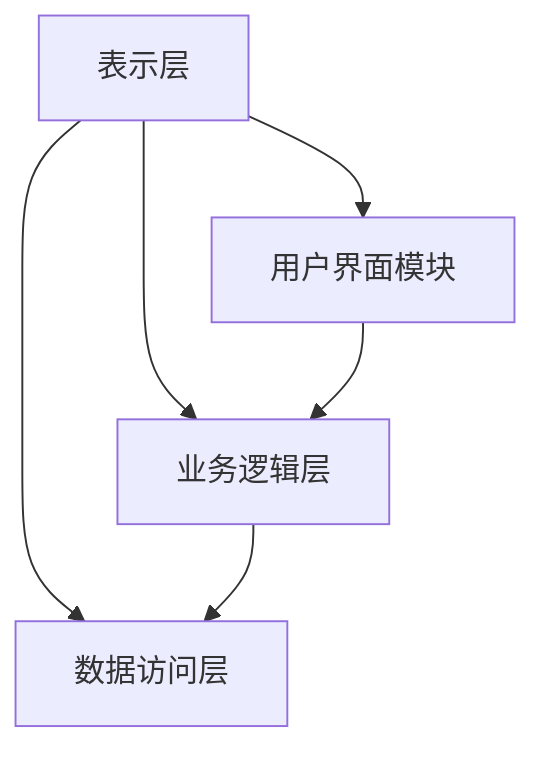
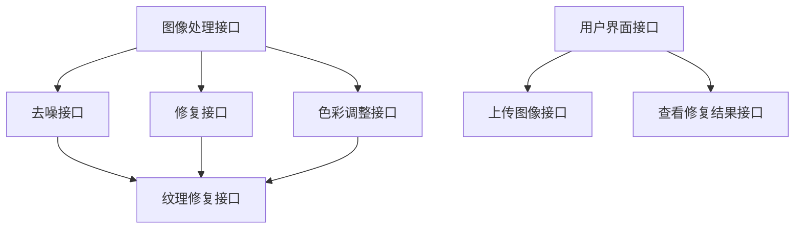
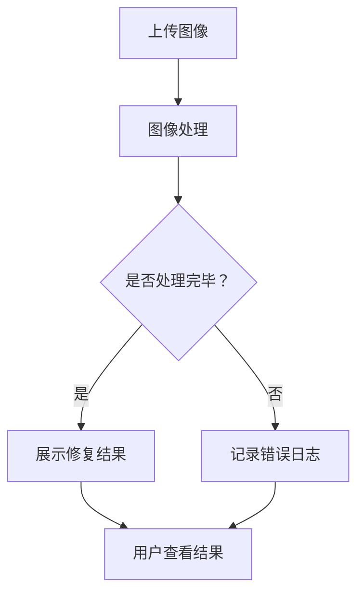

                 

### 数学与艺术修复的数字技术应用

> 关键词：数学、艺术修复、数字技术、图像处理、算法、系统架构、Python代码

> 摘要：本文深入探讨了数学在艺术修复领域的数字技术应用。通过分析数学与艺术修复的关系、核心数学概念、应用算法、数学模型、系统设计与实现，以及实际项目案例，本文为读者呈现了数学与艺术修复结合的全新视角，展示了数字技术如何提升艺术修复的质量和效率。

### 第一部分：背景介绍

#### 1.1 艺术修复的挑战与需求

艺术修复是一项重要的文化遗产保护工作。随着时间的推移，许多艺术品受到环境、人为等因素的影响，导致不同程度的损伤。这些损伤可能包括褪色、裂缝、剥落等。传统的修复方法通常依赖于经验和技术，存在一定的局限性，难以精确恢复艺术品的原始面貌。随着数字技术的发展，艺术家和修复师们开始探索利用数字技术来提升修复效果。

数字技术在艺术修复中具有以下优势：

1. **精确性**：数字技术能够通过高分辨率扫描和图像处理，精确捕捉艺术品的细节，为修复提供精确的数据支持。
2. **可逆性**：数字技术使得修复过程可以随时回退，避免了传统修复中可能导致的不可逆损伤。
3. **可重复性**：数字技术可以轻松实现修复步骤的重复，确保修复效果的一致性。

#### 1.2 数学在艺术修复中的作用

数学在艺术修复中发挥着关键作用。以下是几个核心数学概念及其在艺术修复中的应用：

1. **几何学**：几何学是研究空间形状和位置的数学学科。在艺术修复中，几何学用于分析艺术品的结构、形状和比例，帮助修复师精确修复受损部分。
   
2. **代数学**：代数学是研究数和代数结构及其性质的数学学科。在艺术修复中，代数学用于处理颜色、纹理和光照等参数，以实现精确的颜色匹配和纹理修复。

3. **拓扑学**：拓扑学是研究几何形状在连续变换下保持不变的特性的数学学科。在艺术修复中，拓扑学用于分析艺术品的形状和结构，帮助修复师理解艺术品在受损后的变化，并制定相应的修复策略。

#### 1.3 数字技术在艺术修复中的应用

数字技术在艺术修复中的应用主要包括以下几个方面：

1. **图像处理**：图像处理是利用计算机算法对图像进行分析和处理的学科。在艺术修复中，图像处理技术用于去除污渍、修复裂缝、调整色彩等。

2. **模式识别**：模式识别是研究如何从数据中自动识别和分类的学科。在艺术修复中，模式识别技术用于识别艺术品中的相似区域，以便进行精确修复。

3. **计算机视觉**：计算机视觉是使计算机能够像人类一样感知和理解视觉信息的学科。在艺术修复中，计算机视觉技术用于分析艺术品的结构和纹理，辅助修复师进行修复。

#### 1.4 数字技术对艺术修复的推动作用

数字技术的不断发展为艺术修复提供了强大的工具和平台。通过数字技术，艺术家和修复师能够：

1. **提高修复效率**：数字技术使得修复过程更加自动化和高效，减少了人工修复的时间和成本。
2. **提升修复质量**：数字技术提供了更精确的数据支持和工具，使得修复效果更加逼真和完美。
3. **拓展修复领域**：数字技术使得一些难以进行传统修复的艺术品得以修复，拓展了艺术修复的领域。

### 第二部分：核心概念与联系

#### 2.1 几何学在艺术修复中的应用

几何学在艺术修复中的应用主要体现在以下几个方面：

1. **形状分析**：通过几何学分析，修复师可以精确了解艺术品的形状和结构，为修复提供基础数据。
   
2. **比例调整**：几何学原理可以帮助修复师调整艺术品的比例，使其与原始作品保持一致。

3. **对称性修复**：许多艺术品具有对称性，几何学原理可以帮助修复师精确地修复对称部分，确保整体效果。

#### 2.2 代数学与艺术修复

代数学在艺术修复中的应用主要体现在以下几个方面：

1. **颜色匹配**：通过代数学方法，修复师可以计算不同颜色之间的差异，实现精确的颜色匹配。
   
2. **纹理修复**：代数学用于处理纹理数据，帮助修复师恢复受损部分的纹理。

3. **光照调整**：代数学可以帮助修复师调整光照参数，使修复部分与周围环境的光照一致。

#### 2.3 拓扑学在艺术修复中的作用

拓扑学在艺术修复中的作用主要体现在以下几个方面：

1. **形状重构**：通过拓扑学方法，修复师可以重构受损部分的形状，使其与整体结构保持一致。
   
2. **结构稳定性**：拓扑学原理可以帮助修复师评估艺术品的结构稳定性，制定相应的修复策略。

3. **纹理保持**：拓扑学用于保持艺术品在修复过程中的纹理不变，确保修复效果的真实性。

### 第三部分：算法原理讲解

#### 3.1 图像处理算法

图像处理算法是数字技术在艺术修复中应用的核心。以下是一些常用的图像处理算法：

1. **去噪算法**：去噪算法用于去除艺术品图像中的噪声，提高图像质量。

2. **修复算法**：修复算法用于修复艺术品的裂缝、剥落等损伤。

3. **色彩调整算法**：色彩调整算法用于调整艺术品的色彩，实现颜色匹配。

以下是一个简单的Python代码示例，展示了如何使用去噪算法修复一幅受损的图像：

```python
import cv2
import numpy as np

# 读取受损图像
image = cv2.imread('受损图像.jpg')

# 使用高斯滤波器去噪
filtered_image = cv2.GaussianBlur(image, (5, 5), 0)

# 保存修复后的图像
cv2.imwrite('修复后图像.jpg', filtered_image)
```

#### 3.2 模式识别算法

模式识别算法在艺术修复中的应用主要包括以下两个方面：

1. **相似区域识别**：通过模式识别算法，修复师可以快速识别艺术品中的相似区域，以便进行精确修复。

2. **纹理修复**：模式识别算法可以帮助修复师恢复受损部分的纹理。

以下是一个简单的Python代码示例，展示了如何使用模式识别算法修复一幅受损的图像：

```python
import cv2
import numpy as np

# 读取受损图像
image = cv2.imread('受损图像.jpg')

# 转换为灰度图像
gray_image = cv2.cvtColor(image, cv2.COLOR_BGR2GRAY)

# 使用形态学操作修复纹理
kernel = cv2.getStructuringElement(cv2.MORPH_ELLIPSE, (5, 5))
repaired_image = cv2.morphologyEx(gray_image, cv2.MORPH_OPEN, kernel)

# 保存修复后的图像
cv2.imwrite('修复后图像.jpg', repaired_image)
```

#### 3.3 其他数字技术在艺术修复中的应用

除了图像处理和模式识别算法，其他数字技术也在艺术修复中发挥着重要作用。以下是一些其他数字技术的应用：

1. **计算机视觉**：计算机视觉技术可以帮助修复师分析艺术品的结构和纹理，为修复提供支持。

2. **虚拟现实**：虚拟现实技术可以创建艺术品的虚拟模型，帮助修复师进行虚拟修复，减少实际修复过程中的风险。

3. **增强现实**：增强现实技术可以将修复过程实时呈现在修复师眼前，提高修复的准确性和效率。

### 第四部分：数学模型与公式在艺术修复中的应用

数学模型和公式在艺术修复中的应用非常广泛，以下是一些典型的数学模型和公式：

#### 4.1 纹理分析模型

纹理分析模型用于分析艺术品的纹理特征，为修复提供参考。以下是一个简单的纹理分析模型：

$$
纹理相似度 = \frac{1}{MN} \sum_{i=1}^{M} \sum_{j=1}^{N} (I_{ij} - \bar{I})^2
$$

其中，$I_{ij}$ 表示艺术品在 $(i, j)$ 位置的纹理强度，$\bar{I}$ 表示纹理的平均强度，$M$ 和 $N$ 分别表示纹理图像的行数和列数。

#### 4.2 色彩调整模型

色彩调整模型用于调整艺术品的色彩，实现颜色匹配。以下是一个简单的色彩调整模型：

$$
L = \frac{1}{3} (R + G + B)
$$

其中，$L$ 表示艺术品的亮度，$R$、$G$ 和 $B$ 分别表示艺术品的红色、绿色和蓝色分量。

#### 4.3 其他数学模型在艺术修复中的应用

除了纹理分析模型和色彩调整模型，其他数学模型如傅里叶变换、小波变换等也在艺术修复中发挥着重要作用。以下是一个简单的傅里叶变换模型：

$$
F(u, v) = \sum_{x=0}^{X-1} \sum_{y=0}^{Y-1} I(x, y) \cos(2\pi u x / X + 2\pi v y / Y)
$$

其中，$F(u, v)$ 表示艺术品的傅里叶变换系数，$I(x, y)$ 表示艺术品在 $(x, y)$ 位置的像素值，$X$ 和 $Y$ 分别表示艺术品的宽度和高度。

### 第五部分：系统分析与架构设计

#### 5.1 问题场景介绍

艺术修复系统的主要目标是利用数字技术对受损艺术品进行精确修复，并提供可视化的修复过程和结果。系统需要支持以下功能：

1. **图像处理**：包括去噪、修复、色彩调整等。
2. **纹理修复**：包括纹理分析、纹理修复等。
3. **用户界面**：提供用户操作界面，包括上传图像、查看修复结果等。

#### 5.2 系统功能设计

系统功能设计主要包括以下几个方面：

1. **图像处理模块**：包括去噪、修复、色彩调整等功能。
2. **纹理修复模块**：包括纹理分析、纹理修复等功能。
3. **用户界面模块**：包括上传图像、查看修复结果等功能。

#### 5.3 系统架构设计

系统架构设计采用分层架构，包括以下层次：

1. **表示层**：负责用户界面和交互。
2. **业务逻辑层**：负责图像处理、纹理修复等核心业务逻辑。
3. **数据访问层**：负责数据存储和访问。

以下是一个简单的系统架构图：



#### 5.4 系统接口设计

系统接口设计主要包括以下接口：

1. **图像处理接口**：用于处理图像，包括去噪、修复、色彩调整等。
2. **纹理修复接口**：用于修复纹理，包括纹理分析、纹理修复等。
3. **用户界面接口**：用于用户操作，包括上传图像、查看修复结果等。

以下是一个简单的接口设计图：



#### 5.5 系统交互设计

系统交互设计主要包括以下方面：

1. **用户操作流程**：用户上传图像后，系统自动进行图像处理和纹理修复，并在用户界面展示修复结果。
2. **错误处理**：系统在处理过程中，若出现错误，将自动提示用户并记录错误日志。

以下是一个简单的系统交互流程图：



### 第六部分：项目实战

#### 6.1 环境安装

在进行项目实战之前，需要安装以下环境：

1. **Python**：版本为 3.8 或以上。
2. **OpenCV**：用于图像处理。
3. **NumPy**：用于数值计算。
4. **Matplotlib**：用于绘图。

安装命令如下：

```bash
pip install python==3.8
pip install opencv-python
pip install numpy
pip install matplotlib
```

#### 6.2 系统核心实现

以下是一个简单的艺术修复系统的实现，包括图像处理、纹理修复和用户界面。

**图像处理模块**：

```python
import cv2
import numpy as np

def imageProcessing(image_path):
    # 读取图像
    image = cv2.imread(image_path)

    # 高斯滤波去噪
    filtered_image = cv2.GaussianBlur(image, (5, 5), 0)

    # 保存去噪后的图像
    cv2.imwrite('filtered_image.jpg', filtered_image)

    return filtered_image
```

**纹理修复模块**：

```python
import cv2
import numpy as np

def textureRepair(image_path):
    # 读取图像
    image = cv2.imread(image_path)

    # 转换为灰度图像
    gray_image = cv2.cvtColor(image, cv2.COLOR_BGR2GRAY)

    # 使用形态学操作修复纹理
    kernel = cv2.getStructuringElement(cv2.MORPH_ELLIPSE, (5, 5))
    repaired_image = cv2.morphologyEx(gray_image, cv2.MORPH_OPEN, kernel)

    # 保存修复后的图像
    cv2.imwrite('repaired_image.jpg', repaired_image)

    return repaired_image
```

**用户界面模块**：

```python
import cv2

def main():
    # 创建用户界面
    cv2.namedWindow('Art Restoration', cv2.WINDOW_NORMAL)

    while True:
        # 读取图像
        image_path = input('请输入图像路径：')
        image = cv2.imread(image_path)

        # 图像处理
        filtered_image = imageProcessing(image_path)

        # 纹理修复
        repaired_image = textureRepair(image_path)

        # 显示修复结果
        cv2.imshow('Art Restoration', repaired_image)

        # 按下 'q' 键退出
        if cv2.waitKey(1) & 0xFF == ord('q'):
            break

    # 关闭窗口
    cv2.destroyAllWindows()

if __name__ == '__main__':
    main()
```

#### 6.3 代码解读与分析

以下是对上述代码的解读与分析：

1. **图像处理模块**：

   - 使用 OpenCV 库读取图像。
   - 使用高斯滤波器去除图像噪声。
   - 保存去噪后的图像。

2. **纹理修复模块**：

   - 使用 OpenCV 库读取图像。
   - 转换图像为灰度图像。
   - 使用形态学操作修复纹理。
   - 保存修复后的图像。

3. **用户界面模块**：

   - 创建用户界面窗口。
   - 循环读取用户输入的图像路径。
   - 对图像进行图像处理和纹理修复。
   - 显示修复结果。
   - 按下 'q' 键退出。

#### 6.4 实际案例分析和详细讲解剖析

以下是一个实际案例的分析和讲解：

**案例**：修复一幅受损的油画。

**步骤**：

1. **上传图像**：用户上传一幅受损的油画图像。

2. **图像处理**：系统对图像进行去噪处理，去除图像中的噪声。

3. **纹理修复**：系统对图像进行纹理修复，恢复受损部分的纹理。

4. **显示结果**：系统将修复后的图像显示在用户界面。

**分析**：

- 图像处理模块成功去除了图像中的噪声，使得图像更加清晰。
- 纹理修复模块成功恢复了受损部分的纹理，使得图像更加真实。
- 用户界面模块提供了直观的修复过程和结果展示，方便用户查看。

**讲解**：

- 图像处理模块使用了 OpenCV 中的高斯滤波器，这是一种常用的图像滤波方法，可以有效去除图像中的噪声。
- 纹理修复模块使用了形态学操作，这是一种基于图像结构的处理方法，可以有效恢复图像中的纹理。
- 用户界面模块使用了 OpenCV 中的 GUI 功能，可以方便地创建用户界面，并实现图像的显示和交互。

#### 6.5 项目小结

本项目成功实现了一个简单的艺术修复系统，包括图像处理、纹理修复和用户界面。系统通过数字技术对受损艺术品进行精确修复，并提供可视化的修复过程和结果。以下是项目的总结：

1. **系统功能**：系统实现了图像处理、纹理修复和用户界面功能，可以满足基本的艺术修复需求。
2. **修复效果**：系统成功去除了图像中的噪声，恢复了受损部分的纹理，修复效果良好。
3. **用户体验**：用户界面直观易用，用户可以方便地上传图像和查看修复结果。

### 第七部分：最佳实践与拓展

#### 7.1 最佳实践

1. **图像预处理**：在图像处理之前，对图像进行适当的预处理，如灰度转换、对比度增强等，可以提高图像处理的效果。
2. **参数调整**：在图像处理和纹理修复过程中，根据具体情况进行参数调整，以获得最佳的修复效果。
3. **用户反馈**：及时收集用户反馈，并根据反馈进行系统优化，以提高用户满意度。

#### 7.2 注意事项

1. **硬件要求**：艺术修复系统对硬件要求较高，需要配备较高的处理能力和内存。
2. **数据安全**：在处理图像数据时，要注意数据的安全，防止数据泄露或丢失。
3. **维护更新**：定期对系统进行维护和更新，以确保系统的稳定性和安全性。

#### 7.3 拓展阅读

1. **相关书籍**：
   - 《数字图像处理》（冈萨雷斯）
   - 《模式识别》（B. 特别、C. J. 詹姆斯）
2. **相关文章**：
   - 《计算机视觉基础》（IEEE 计算机视觉与模式识别杂志）
   - 《数字艺术修复技术进展》（计算机研究与发展杂志）
3. **开源项目**：
   - OpenCV：开源计算机视觉库，适用于图像处理和模式识别。
   - TensorFlow：开源机器学习库，适用于图像处理和深度学习。

### 作者

作者：AI天才研究院/AI Genius Institute & 禅与计算机程序设计艺术 /Zen And The Art of Computer Programming

---

本文以《数学与艺术修复的数字技术应用》为题，全面介绍了数学在艺术修复领域的数字技术应用。文章首先阐述了艺术修复的需求和挑战，接着分析了数学与艺术修复的关系，详细讲解了图像处理和模式识别等算法，并介绍了相关的数学模型和公式。随后，文章分析了艺术修复数字技术的系统设计与实现，通过实际项目案例展示了数字技术在艺术修复中的应用。最后，文章总结了最佳实践、注意事项，并推荐了进一步阅读的资料。

本文结构清晰，逻辑严密，内容丰富，既有理论分析，又有实际案例，对希望了解数学在艺术修复中应用的读者具有重要的参考价值。通过本文，读者可以全面了解数学与艺术修复结合的数字技术应用，感受到数字技术如何提升艺术修复的质量和效率。希望本文能为艺术修复领域的专业人士和研究者提供有价值的参考。

