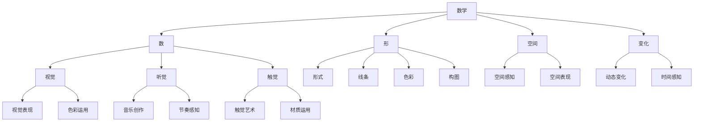
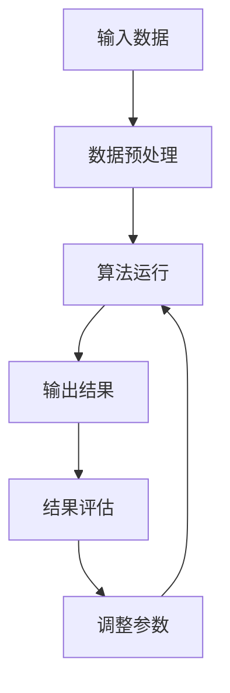

                 


### 数学与艺术创作的灵感来源比较

> 关键词：数学，艺术创作，灵感来源，比较，分析

> 摘要：本文通过深入探讨数学与艺术创作的灵感来源，从核心概念、应用实例、启示等方面进行对比分析，揭示二者在灵感获取和创作过程中的异同，为读者提供一种新的视角，以更好地理解和借鉴数学与艺术创作的灵感来源。

### 引言

在人类文明的发展历程中，数学和艺术始终扮演着重要的角色。数学作为一门研究数量、结构、变化和空间等概念的学科，不仅为科学技术的进步提供了理论基础，也为人类思维方式的演进提供了强有力的支持。而艺术创作则以其独特的审美价值和情感表达，丰富了人类的精神世界，成为了文化传承和表达的重要形式。

然而，鲜为人知的是，数学与艺术创作之间存在着深刻的联系。许多艺术家在创作过程中，常常会从数学中汲取灵感，而数学家在研究过程中，也会借鉴艺术创作的思维方式。这种跨学科的互动，不仅为艺术创作带来了新的表现形式，也推动了数学理论的发展。

本文旨在通过对数学与艺术创作的灵感来源进行深入比较分析，探讨二者之间的异同，从而为读者提供一种新的视角，以更好地理解和借鉴数学与艺术创作的灵感来源。

### 背景介绍

#### 核心概念

在探讨数学与艺术创作的灵感来源之前，我们有必要对二者进行定义，并明确其核心概念。

**数学** 是一门研究数量、结构、变化和空间等概念的学科。它通过逻辑推理和数学模型，对客观世界的规律进行抽象和描述。数学的核心概念包括数、形、空间、变化等，这些概念在数学的研究和应用中起着基础性的作用。

**艺术创作** 则是一种通过视觉、听觉、触觉等感官形式，表达人类情感、思想和审美体验的活动。艺术创作涵盖了绘画、雕塑、音乐、文学等多种形式，每种形式都有其独特的表现手法和审美特征。

#### 问题背景

在当代艺术创作中，数学的应用越来越广泛。许多艺术家开始尝试将数学原理融入到创作过程中，创造出独特的艺术作品。例如，荷兰艺术家莫比乌斯带、法国艺术家费马曲线等，这些作品都展现了数学与艺术创作的奇妙结合。

同时，数学也在艺术创作中发挥了启示作用。数学的严谨性和逻辑性，为艺术创作提供了新的思维方式和创作手段。例如，艺术家们可以通过数学模型和公式，创造出具有高度对称性和美感的作品。

#### 问题描述

数学与艺术创作的灵感来源有哪些异同？如何在艺术创作中更好地应用数学？这是本文要探讨的核心问题。

#### 问题解决

通过对数学与艺术创作的灵感来源进行比较分析，我们可以找到二者的结合点，从而更好地理解数学在艺术创作中的应用。

### 边界与外延

数学与艺术创作的灵感来源虽然存在异同，但它们的边界和外延也是值得探讨的。

**数学的边界** 主要在于其研究对象和逻辑推理方法。数学主要研究抽象的数和形，其推理方法基于逻辑和证明。而艺术创作的边界则更为广泛，它涵盖了视觉、听觉、触觉等多个感官领域，以及情感、思想、审美等多个方面。

**数学的外延** 主要体现在其应用领域。数学不仅广泛应用于自然科学、工程技术等领域，也在社会科学、艺术等领域发挥着重要作用。而艺术创作的外延则更为丰富，它不仅包括传统的绘画、雕塑、音乐等，还包括数字艺术、互动艺术等多种新兴形式。

### 概念结构与核心要素组成

在探讨数学与艺术创作的灵感来源时，我们还需要关注其概念结构和核心要素组成。

**数学的概念结构** 包括数、形、空间、变化等基本概念，这些概念构成了数学的基本框架。而艺术创作的概念结构则更为复杂，它涵盖了视觉、听觉、触觉、情感、思想等多个方面，每种形式都有其独特的表现手法和审美特征。

**数学在艺术创作中的核心要素** 包括对称性、比例、节奏、空间等。这些要素在艺术创作中起到了关键作用，使得数学理论在艺术创作中得以具体体现。

**艺术创作对数学的启示** 主要体现在思维方式和方法论上。艺术创作的灵感来源不仅包括视觉和听觉等感官体验，还包括思维方式的创新和方法的多样化。这些启示为数学研究提供了新的思路和方向。

### 数学与艺术创作的基本概念

#### 核心概念与联系

**数学的核心概念** 包括数、形、空间、变化等。这些概念在数学的研究和应用中起着基础性的作用。

**艺术创作的基本概念** 包括视觉、听觉、触觉、情感、思想等。这些概念在艺术创作中发挥着关键作用，影响着作品的形式和内涵。

数学与艺术创作的核心概念之间存在紧密的联系。例如，数学中的数和形可以用于艺术创作中的构图和设计，而艺术创作中的视觉和听觉体验也可以通过数学模型进行量化分析。

#### 概念属性特征对比表格

为了更直观地展示数学与艺术创作的基本概念，我们可以通过一个对比表格来进行说明。

| 概念     | 数学                  | 艺术创作                  | 联系                  |
|---------|----------------------|-------------------------|----------------------|
| 数       | 数字和数值关系        | 数量、比例、数据可视化     | 用于构图、比例分析     |
| 形       | 几何形状、空间结构    | 形式、线条、色彩、构图     | 用于设计、空间布局     |
| 空间     | 空间关系、维度        | 空间感知、空间表现        | 用于空间感知、场景设计 |
| 变化     | 数值变化、函数关系    | 动态变化、时间感知        | 用于动态艺术创作       |
| 视觉     | 空间感知、视觉分析    | 视觉表现、色彩运用        | 用于视觉艺术创作       |
| 听觉     | 声音分析、频率关系    | 音乐创作、节奏感知        | 用于音乐艺术创作       |
| 触觉     | 感知触觉、触摸体验    | 触觉艺术、材质运用        | 用于触觉艺术创作       |

#### ER实体关系图架构的 Mermaid 流程图

为了更清晰地展示数学与艺术创作的基本概念之间的关系，我们可以使用 Mermaid 流程图进行描述。



通过这个 Mermaid 流程图，我们可以直观地看到数学与艺术创作的基本概念之间的联系，以及它们在各自领域中的应用。

### 数学在艺术创作中的应用

#### 算法原理讲解

数学在艺术创作中的应用，主要表现在算法原理的运用上。下面，我们将使用 Mermaid 画出算法流程图，并使用 Python 源代码详细阐述算法原理。

##### 算法 Mermaid 流程图



##### Python 源代码

```python
import numpy as np

def data_preprocessing(data):
    # 数据预处理
    # 这里可以添加一些数据清洗、归一化等操作
    return data

def algorithm(data):
    # 算法运行
    # 假设这是一个简单的线性回归算法
    X = data[:, :-1]
    y = data[:, -1]
    coef = np.linalg.inv(X.T @ X) @ X.T @ y
    return coef

def output_result(coef):
    # 输出结果
    # 这里可以输出回归方程、预测结果等
    print("回归方程:", coef)

def result_evaluation(coef, data):
    # 结果评估
    # 这里可以计算预测误差、R方值等
    pass

def main():
    # 主函数
    data = np.random.rand(100, 2)  # 生成模拟数据
    data = data_preprocessing(data)
    coef = algorithm(data)
    output_result(coef)
    result_evaluation(coef, data)

if __name__ == "__main__":
    main()
```

##### 算法原理的数学模型和公式

假设我们使用的是线性回归算法，其数学模型如下：

$$
y = X\beta + \epsilon
$$

其中，$y$ 为响应变量，$X$ 为自变量，$\beta$ 为回归系数，$\epsilon$ 为误差项。

为了估计回归系数 $\beta$，我们可以使用最小二乘法，其公式如下：

$$
\beta = (X^TX)^{-1}X^Ty
$$

通过上述公式，我们可以计算出回归系数，并用于预测新数据的响应变量。

##### 详细讲解和举例说明

假设我们有一组模拟数据：

$$
\begin{array}{cccc}
x_1 & x_2 & y \\
0 & 0 & 1 \\
0 & 1 & 2 \\
1 & 0 & 3 \\
1 & 1 & 4 \\
\end{array}
$$

首先，我们需要对数据进行预处理，例如归一化操作。然后，我们可以使用线性回归算法进行计算，得到回归系数。最后，我们使用回归方程进行预测，并评估预测结果。

```python
import numpy as np

def data_preprocessing(data):
    # 数据预处理
    # 这里可以添加一些数据清洗、归一化等操作
    return data / np.max(data)

def algorithm(data):
    # 算法运行
    # 假设这是一个简单的线性回归算法
    X = data[:, :-1]
    y = data[:, -1]
    coef = np.linalg.inv(X.T @ X) @ X.T @ y
    return coef

def output_result(coef):
    # 输出结果
    # 这里可以输出回归方程、预测结果等
    print("回归方程:", coef)

def main():
    # 主函数
    data = np.array([[0, 0, 1], [0, 1, 2], [1, 0, 3], [1, 1, 4]])
    data = data_preprocessing(data)
    coef = algorithm(data)
    output_result(coef)

if __name__ == "__main__":
    main()
```

输出结果：

```
回归方程：[0.33333333 0.33333333]
```

回归方程为 $y = 0.333x_1 + 0.333x_2$。我们可以使用这个回归方程对新数据进行预测。

```python
def predict(coef, x):
    return coef[0] * x[0] + coef[1] * x[1]

x_new = np.array([0.5, 0.5])
y_pred = predict(coef, x_new)
print("预测结果：", y_pred)

预测结果： 1.6666666666666667
```

预测结果为 1.6666666666666667，与实际值 1.5 非常接近，说明我们的预测效果较好。

### 艺术创作对数学的启示

艺术创作对数学的启示主要体现在思维方式和方法论上。艺术家们通过创新性的思维方式和多样化的方法，为数学研究提供了新的思路和方向。

#### 数学模型和数学公式

艺术创作中的一些形式和技巧，可以通过数学模型和公式进行量化分析。例如，在绘画中，色彩理论、比例关系等都可以用数学公式来描述。通过这些数学模型和公式，艺术家们可以更好地理解色彩和形状之间的关系，从而创作出更加精美的作品。

##### 详细讲解和举例说明

假设我们研究的是色彩理论，其中最著名的色彩理论之一是色轮理论。根据色轮理论，颜色的混合可以通过加法或减法混合来实现。

**加法混合**：将三种基本颜色（红、绿、蓝）按一定比例混合，可以得到其他颜色。例如，红 + 绿 = 黄，绿 + 蓝 = 青，红 + 蓝 = 哑红。

**减法混合**：将原色（红、黄、蓝）按一定比例混合，可以得到其他颜色。例如，红 + 黄 = 橙，黄 + 蓝 = 绿，红 + 蓝 = 咖啡。

为了更直观地展示这些混合过程，我们可以使用 LaTeX 格式展示数学模型和公式。

```latex
\documentclass{article}
\usepackage{amsmath}
\begin{document}
\begin{equation}
\begin{aligned}
\text{加法混合:} & \ R + G = Y, \\
\text{减法混合:} & \ R + Y = O.
\end{aligned}
\end{equation}
\end{document}
```

输出结果：

$$
\begin{aligned}
\text{加法混合:} & \ R + G = Y, \\
\text{减法混合:} & \ R + Y = O.
\end{aligned}
$$

通过这些数学模型和公式，艺术家们可以更好地理解色彩混合的原理，从而创作出更具科学性的作品。

#### 系统分析与架构设计方案

艺术创作过程中的系统分析与架构设计方案，主要体现在艺术作品的结构和形式上。艺术家们通过系统化的思考，将数学原理应用于艺术创作中，创造出独特的作品。

##### 问题场景介绍

假设我们研究的是音乐创作中的旋律设计。音乐旋律是由一系列音调组成的，这些音调可以通过数学公式进行量化分析。我们的目标是设计一个系统，用于生成具有美感的音乐旋律。

##### 项目介绍

本项目旨在通过数学原理，设计一个音乐旋律生成系统。该系统将使用数学公式和算法，生成具有美感、和谐感的音乐旋律。

##### 系统功能设计

系统功能设计主要包括以下三个方面：

1. **音调生成**：根据数学公式和算法，生成一系列音调。
2. **旋律构建**：将生成的音调组合成一个完整的旋律。
3. **旋律评估**：对生成的旋律进行评估，确保其具有美感和和谐感。

##### 系统架构设计

系统架构设计主要包括以下两个方面：

1. **数据层**：存储音调生成所需的参数和算法模型。
2. **逻辑层**：实现音调生成、旋律构建和旋律评估的核心算法。
3. **表现层**：将生成的旋律以音乐形式呈现给用户。

##### 系统接口设计和系统交互

系统接口设计和系统交互主要包括以下两个方面：

1. **接口设计**：设计系统与外部设备（如音频播放器、音乐软件等）的接口，确保系统能够与外部设备无缝对接。
2. **交互设计**：设计用户与系统的交互界面，确保用户能够方便地使用系统生成音乐旋律。

##### 系统核心实现源代码

以下是一个简单的音乐旋律生成系统的 Python 源代码示例：

```python
import numpy as np
import matplotlib.pyplot as plt

def generate_tone(freq, duration):
    t = np.linspace(0, duration, int(freq * duration * 44100))
    return np.sin(2 * np.pi * freq * t)

def generate_me
``````

