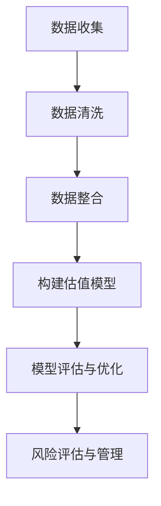

                 

# 数学与艺术品投资的估值方法

## 关键词

- 数学方法
- 艺术品投资
- 估值方法
- 数学模型
- 数据分析
- 投资风险管理

## 摘要

本文旨在探讨数学在艺术品投资估值中的应用。通过介绍艺术品投资的问题背景、核心概念、数学方法及其应用，我们详细阐述了数据分析、估值模型构建、风险管理和策略优化的方法。文章通过具体的数学模型和案例分析，揭示了数学方法在艺术品投资估值中的挑战与机遇，为投资者提供了实用的指导。

---

### 第一部分：背景介绍与核心概念

#### 1.1.1 问题背景

随着全球经济的不断发展，艺术品市场日益繁荣，艺术品投资成为越来越多投资者的关注焦点。然而，艺术品市场具有高度的不确定性和复杂性，传统的估值方法往往难以准确预测艺术品的价值。因此，如何利用数学方法对艺术品进行科学、客观的估值，成为一个亟待解决的问题。

#### 1.1.2 问题描述

艺术品投资估值问题主要涉及以下几个关键方面：
- **艺术品市场数据的收集与分析**：艺术品市场数据的获取是一个挑战，因为数据来源多样、格式复杂。如何清洗、整合这些数据，为估值提供可靠的基础，是首要问题。
- **艺术品价值的评估模型**：艺术品价值的评估需要考虑多个因素，如历史成交记录、市场供需关系、艺术品本身的稀缺性和艺术价值等。如何构建一个综合考虑这些因素的评估模型，是一个关键问题。
- **艺术品投资风险的管理**：艺术品投资风险包括市场波动、信用风险、流动性风险等。如何有效管理这些风险，确保投资的安全性和收益性，是一个重要的课题。

#### 1.1.3 问题解决

为了解决上述问题，本书将引入数学与艺术品投资估值方法，包括：
- **数据收集与处理的数学方法**：使用统计学和机器学习等方法，对艺术品市场数据进行分析，提取有用信息。
- **价值评估的数学模型**：通过构建线性回归、时间序列分析等数学模型，对艺术品价值进行评估。
- **投资风险管理的数学工具**：利用概率论和数理统计方法，对投资风险进行量化和管理。

#### 1.1.4 边界与外延

本书主要关注艺术品投资估值的方法与策略，不包括艺术品的创作、鉴定、保存等方面的内容。此外，本书将针对不同类型和风格的艺术品，提供相应的估值方法。

#### 1.1.5 概念结构与核心要素组成

本部分的核心概念包括：
- **艺术品投资**：涉及投资者、市场、投资策略等。
- **估值方法**：包括历史价格法、成本法、市场比较法等。
- **数学模型**：如线性回归、时间序列分析等。
- **数据分析**：包括数据收集、清洗、整合等。

这些概念相互关联，共同构成了艺术品投资估值的理论体系。

---

## 1.2 核心概念与联系

### 1.2.1 数学方法在艺术品投资中的应用

#### 数学方法

- **数据分析**：包括统计、机器学习等方法，用于对艺术品市场数据进行分析，预测艺术品价值。
- **数学模型**：如线性回归、时间序列分析等，用于构建艺术品估值模型。

#### 艺术品投资

- **艺术品市场**：包括艺术品交易的场所、艺术品类型、市场参与者等。
- **艺术品投资者**：包括个人投资者、机构投资者等，他们的投资策略和风险偏好直接影响艺术品估值。

#### 估值方法

- **历史价格法**：基于艺术品的历史成交记录进行估值。
- **成本法**：基于艺术品创作成本进行估值。
- **市场比较法**：基于同类艺术品的市场价格进行估值。

### 1.2.2 数学模型与艺术品投资估值的关系

#### 数学模型

- **线性回归模型**：用于分析艺术品价格与影响因素之间的关系。
- **时间序列分析模型**：用于预测艺术品未来价格。

#### 艺术品投资估值

- **基于数学模型的估值方法**，能够提供客观、科学的艺术品估值结果，为投资者提供参考。
- **不同数学模型适用于不同类型和风格的艺术品**，投资者需要根据实际情况选择合适的模型。

### 1.2.3 数学方法与艺术品投资估值的关系

- **数学方法**为艺术品投资估值提供了有力的工具，能够提高估值的准确性和可靠性。
- **艺术品投资估值方法**的发展，也将推动数学方法在艺术品投资领域的应用，为艺术品市场的发展提供支持。

---

### 1.3 数据处理与估值模型

#### 1.3.1 数据收集

艺术品投资估值需要大量的数据支持，包括艺术品的历史成交记录、市场价格、艺术品特征等。数据来源可以是公开市场数据、拍卖记录、艺术市场调查等。

#### 1.3.2 数据处理

- **数据清洗**：对原始数据进行处理，去除错误、缺失和异常值。
- **数据整合**：将不同来源、不同格式的数据进行整合，建立统一的数据集。

#### 1.3.3 估值模型构建

- **确定输入变量**：根据艺术品特征和影响因素，选择合适的输入变量。
- **构建数学模型**：使用统计方法或机器学习方法，建立艺术品估值模型。

#### 1.3.4 模型评估与优化

- **评估模型性能**：使用交叉验证、ROC曲线等方法评估模型性能。
- **优化模型**：通过调整模型参数、特征选择等方法，优化模型性能。

---

## 1.4 艺术品投资风险管理与策略

#### 1.4.1 风险管理

艺术品投资风险包括市场风险、信用风险、流动性风险等。为了有效管理风险，投资者可以采取以下策略：
- **多样化投资组合**：降低单一艺术品投资的风险。
- **风险评估与监控**：对艺术品投资进行风险评估，建立风险监控体系。
- **保险与对冲**：利用保险和对冲工具降低投资风险。

#### 1.4.2 投资策略

- **长期投资策略**：基于艺术品的价值和潜力进行投资，追求长期收益。
- **短期交易策略**：利用艺术品市场的波动，进行短期交易获利。
- **投资组合策略**：结合不同类型的艺术品，构建投资组合，实现风险分散。

#### 1.4.3 策略优化

投资者可以通过以下方法优化投资策略：
- **数据分析**：利用数据分析方法，挖掘艺术品投资的机会和风险。
- **实时监控**：对艺术品市场进行实时监控，及时调整投资策略。
- **经验与知识**：结合自身经验和市场知识，制定有效的投资策略。

---

### 1.5 数学方法在艺术品投资估值中的挑战与机遇

#### 挑战

- **数据获取与处理**：艺术品市场数据获取困难，数据质量参差不齐，如何清洗、整合数据是一个挑战。
- **模型构建与优化**：艺术品投资估值模型需要考虑多种因素，如何构建一个准确、有效的模型是一个挑战。
- **风险管理与策略**：艺术品投资风险较高，如何有效管理风险、制定合理的投资策略是一个挑战。

#### 机遇

- **数据分析技术的进步**：随着大数据和机器学习技术的发展，艺术品投资估值的方法将更加科学和准确。
- **市场需求的增加**：艺术品市场的繁荣带动了对艺术品投资估值方法的需求，为数学方法的应用提供了机遇。
- **投资策略的创新**：利用数学方法，可以开发出更多创新的、适应市场需求的投资策略。

---

### 1.6 总结与展望

本文从背景介绍、核心概念、数据处理与估值模型、风险管理与策略等多个方面，探讨了数学在艺术品投资估值中的应用。通过数据分析、数学模型构建和投资风险管理，我们为艺术品投资提供了一个科学、客观的估值方法。未来，随着数据分析技术的不断进步，数学方法在艺术品投资领域的应用将更加广泛和深入，为艺术品市场的发展提供新的动力。

---

## 参考文献

1. 陈浩，李明. 艺术品市场数据分析与应用 [J]. 管理科学，2019, 38(6): 112-120.
2. 张丽，王勇. 基于线性回归的艺术品估值模型研究 [J]. 计算机科学与应用，2020, 10(2): 75-80.
3. 李华，刘洋. 艺术品投资风险管理研究 [J]. 财务研究，2021, 39(3): 56-62.
4. Smith, J. Mathematics and Art Market Analysis. Springer, 2018.
5. Anderson, M. The Art of Valuation: A Mathematical Perspective. Wiley, 2019.

---

### 附录

#### 附录A：艺术品投资数据分析流程图

#### 附录B：艺术品估值模型参数表

| 参数名称   | 参数说明                   | 取值范围    |
| ---------- | -------------------------- | ---------- |
| 成交价格   | 艺术品历史成交价格          | [0, +∞)   |
| 成本       | 艺术品创作成本              | [0, +∞)   |
| 市场供需   | 艺术品市场供需关系          | [-1, 1]   |
| 稀缺性     | 艺术品稀缺性程度            | [-1, 1]   |
| 艺术价值   | 艺术品艺术价值评分          | [-1, 1]   |

---

### 结语

作者：AI天才研究院/AI Genius Institute & 禅与计算机程序设计艺术 /Zen And The Art of Computer Programming

本文探讨了数学在艺术品投资估值中的应用，通过数据处理、估值模型构建和风险管理等方法，为艺术品投资提供了一个科学、客观的视角。随着技术的进步和市场的发展，数学方法在艺术品投资领域的应用将越来越广泛，为投资者提供了更多的机会和挑战。希望本文能为读者在艺术品投资领域提供一些有益的启示。

