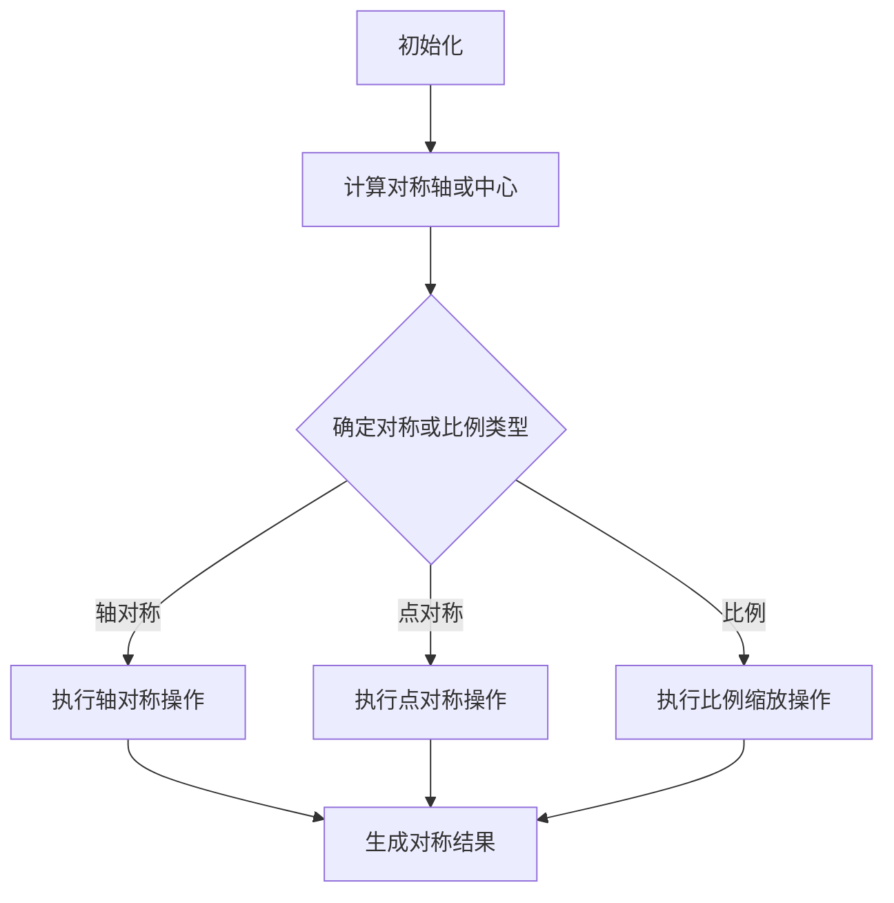
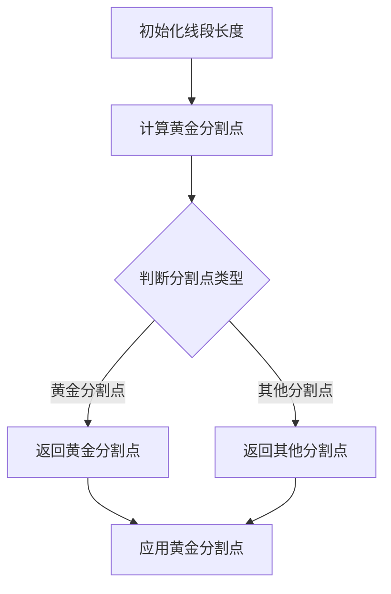
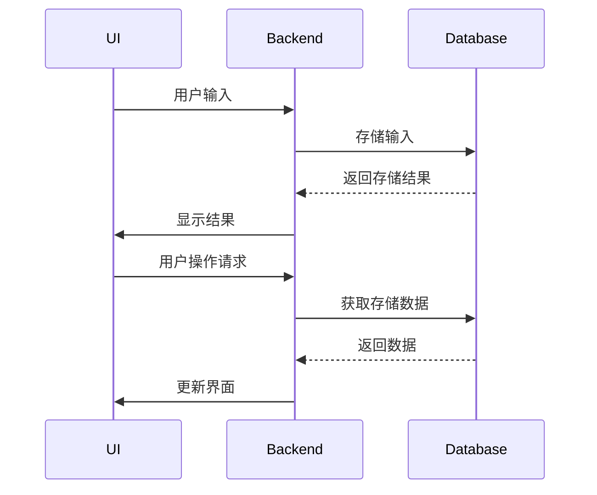
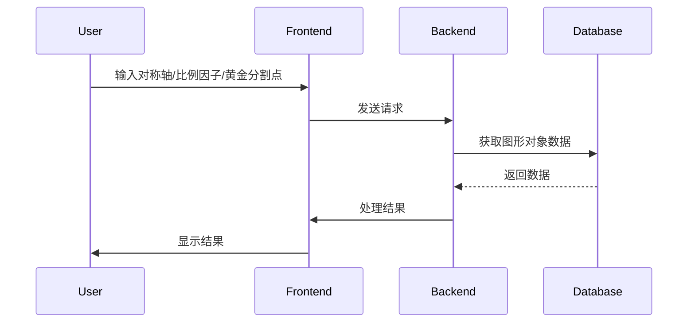

                 

### 问题背景

数学，作为一门精确的科学，贯穿了人类文明发展的始终，从天文学、物理学到工程学、经济学，无不闪耀着数学的光辉。然而，数学不仅仅存在于科学领域，它还与艺术有着深厚的联系。在绘画、雕塑、建筑等艺术形式中，数学的原理和技巧得到了广泛应用。本文将探讨对称、比例与黄金分割这三大数学概念如何在艺术领域发挥作用，并通过具体的实例进行解析。

#### 1.1.1 问题背景

对称、比例与黄金分割是数学中的基本概念，它们在不同的领域有着广泛的应用。对称性在艺术作品中常用来创造和谐美，比例则帮助艺术家在构图上实现协调与美感，而黄金分割则被认为是美学标准中的黄金准则。那么，这些数学概念是如何在艺术中应用的？它们如何影响艺术的创作与欣赏？本文将试图回答这些问题。

#### 1.1.2 问题描述

本文旨在通过以下三个方面探讨数学与艺术的联系：

1. **对称**：讨论对称在艺术中的表现形式，包括轴对称、点对称以及其他类型的对称，并通过具体艺术作品进行分析。
2. **比例**：分析比例在艺术构图中的作用，包括等比数列、等差数列等比例类型的运用，以及其在实际艺术作品中的体现。
3. **黄金分割**：探讨黄金分割在艺术中的应用，计算其具体数值，并分析其在著名艺术作品中的体现。

#### 1.1.3 问题解决

本文将通过以下几个步骤来解决上述问题：

1. **定义与分类**：对对称、比例和黄金分割进行定义和分类，明确各自的概念和特点。
2. **案例分析**：通过具体艺术作品，分析这些数学概念在实际艺术创作中的运用。
3. **数学模型**：建立数学模型，阐述这些概念在艺术中的应用原理。
4. **算法讲解**：通过算法原理讲解，具体说明这些数学概念如何被应用于艺术创作中。
5. **系统设计**：讨论如何在系统中实现这些数学概念，以及它们在系统设计中的应用。
6. **项目实战**：通过实际项目，展示如何将数学与艺术结合，实现艺术作品。

#### 1.1.4 边界与外延

本文的边界主要聚焦于对称、比例与黄金分割在艺术领域的应用。同时，本文也会探讨这些数学概念在计算机科学中的潜在应用，例如在图像处理、人机交互等方面的运用。然而，本文并不涉及数学与艺术的其他方面，如色彩学、构图法则等。

#### 1.1.5 概念结构与核心要素组成

本文的核心概念包括对称、比例与黄金分割。通过对这些概念的定义、分类、案例分析和数学模型建立，本文将揭示数学与艺术之间的内在联系。以下是文章的核心要素组成：

1. **定义与分类**：明确对称、比例和黄金分割的定义及其分类。
2. **案例研究**：通过艺术作品分析，展示这些概念在艺术创作中的应用。
3. **数学模型**：阐述这些概念在艺术中的应用原理。
4. **算法讲解**：详细讲解如何将数学概念应用于艺术创作中。
5. **系统设计**：讨论如何将数学与艺术结合，实现艺术作品的计算机处理。
6. **项目实战**：通过实际项目，展示数学与艺术结合的实际效果。

通过以上步骤，本文将为读者提供一个全面而深入的视角，了解数学与艺术之间的美妙交汇。接下来的章节将逐一探讨这些核心概念，并给出详细的实例分析和数学模型解释。

## 第一部分：背景介绍

### 第1章：问题背景

#### 1.1.1 问题背景

对称、比例与黄金分割是数学领域中的基础概念，它们不仅在自然科学和工程学中有着广泛的应用，同时也在艺术创作中发挥着重要作用。对称性通过其简洁与和谐的特点，为艺术作品带来独特的视觉美感；比例则帮助艺术家在构图上实现协调与平衡，使作品更加引人入胜；而黄金分割则被广泛认为是最具美学价值的比例关系，为艺术作品带来极高的审美价值。

#### 1.1.2 问题描述

本文旨在探讨对称、比例与黄金分割在艺术创作中的应用，具体问题包括：

1. **对称**：讨论对称性在艺术作品中的表现形式，如轴对称、点对称等，并分析其艺术效果。
2. **比例**：分析比例在艺术构图中的作用，探讨等比数列、等差数列等比例类型的运用，及其对作品的影响。
3. **黄金分割**：探讨黄金分割在艺术中的应用，计算其具体数值，并通过具体实例展示其在艺术作品中的体现。

#### 1.1.3 问题解决

本文将通过以下步骤来解决问题：

1. **定义与分类**：对对称、比例与黄金分割进行定义，并分类讨论其不同形式和应用。
2. **案例分析**：通过具体艺术作品，分析这些数学概念在实际艺术创作中的运用，并探讨其对作品美感的影响。
3. **数学模型**：建立数学模型，解释这些概念在艺术中的应用原理。
4. **算法讲解**：介绍如何将数学概念应用于艺术创作，包括具体的算法原理和计算方法。
5. **系统设计**：讨论如何将数学与艺术结合，实现艺术作品的计算机处理和优化。
6. **项目实战**：通过实际项目，展示数学与艺术结合的实际效果和应用。

#### 1.1.4 边界与外延

本文的边界主要聚焦于对称、比例与黄金分割在艺术领域的应用。同时，本文也会讨论这些数学概念在计算机科学中的潜在应用，如图像处理、人机交互等。然而，本文不涉及色彩学、光影处理等其他艺术相关领域。

#### 1.1.5 概念结构与核心要素组成

本文的核心概念包括对称、比例与黄金分割。通过对这些概念的定义、分类、案例分析和数学模型建立，本文将揭示数学与艺术之间的内在联系。以下是文章的核心要素组成：

1. **定义与分类**：明确对称、比例和黄金分割的定义及其分类。
2. **案例研究**：通过艺术作品分析，展示这些概念在艺术创作中的应用。
3. **数学模型**：阐述这些概念在艺术中的应用原理。
4. **算法讲解**：详细讲解如何将数学概念应用于艺术创作中。
5. **系统设计**：讨论如何将数学与艺术结合，实现艺术作品的计算机处理。
6. **项目实战**：通过实际项目，展示数学与艺术结合的实际效果。

通过以上步骤，本文将为读者提供一个全面而深入的视角，了解数学与艺术之间的美妙交汇。接下来的章节将逐一探讨这些核心概念，并给出详细的实例分析和数学模型解释。

### 第1章：问题背景

对称、比例与黄金分割作为数学领域的三大基本概念，它们不仅在理论研究中占据重要地位，在实际应用中同样展现了不可忽视的价值。在艺术创作中，这些数学概念被广泛应用，为作品注入了独特的美感和艺术价值。本章节将深入探讨对称、比例与黄金分割的起源、定义、分类以及在艺术中的应用。

#### 1.1.1 对称

对称性是自然界和人类文明中普遍存在的现象。从几何学的角度看，对称是指一个对象关于某个点、线或平面翻转后能够与自身重合的性质。对称可以分为几种类型：

- **轴对称**：对象关于一条直线对称，例如蝴蝶的翅膀、树的枝叶。
- **点对称**：对象关于一个点对称，例如沙漏、五角星。
- **旋转对称**：对象通过旋转某个角度后能与自身重合，例如雪花、许多花朵。

在艺术中，对称性被广泛应用于绘画、雕塑和建筑等创作形式。例如，巴洛克时期的绘画常常采用轴对称的构图，以增强作品的庄重感和稳定性。而现代艺术中的许多作品，则通过点对称和旋转对称创造出独特的形式美。

#### 1.1.2 比例

比例是描述两个或多个量之间关系的一种数学关系。在艺术创作中，比例的运用使得作品在视觉上达到和谐与平衡。常见的比例类型包括：

- **等比数列**：相邻两项之比相等的数列，如斐波那契数列。
- **等差数列**：相邻两项之差相等的数列，如自然数的排列。

在绘画中，比例的运用可以体现在人体比例、物体尺寸等各个方面。例如，达·芬奇的《维特鲁威人》通过精确的人体比例，展现出了人类身体的和谐美。在建筑设计中，比例的运用同样至关重要，如古希腊的帕台农神庙，其严谨的比例设计使得建筑在视觉上显得极其协调。

#### 1.1.3 黄金分割

黄金分割是一个特殊的比例关系，其值约为0.618。黄金分割被认为是最具美学价值的比例，常被应用于艺术创作中。黄金分割可以通过以下公式计算：

\[ \frac{a}{b} = \frac{a+b}{a} = \varphi \]

其中，\(a\) 和 \(b\) 为相邻的两段长度，\(\varphi\) 为黄金分割值。

在艺术作品中，黄金分割常被应用于构图、形状设计等方面。例如，达·芬奇的《蒙娜丽莎》画面中，人物头部和身体的比例以及画面的整体构图都符合黄金分割原则。此外，许多著名的建筑，如巴黎的埃菲尔铁塔，也采用了黄金分割的原理进行设计，以达到视觉上的和谐美感。

#### 1.1.4 对称与比例的关系

对称与比例在艺术创作中常常相互结合，共同发挥作用。对称性为作品提供了基础结构，而比例则在此基础上进行了进一步的细化，使得作品更加和谐美观。例如，在建筑设计中，对称性可以提供整体的平衡感，而比例则通过对细节的精确处理，增强整体的美感。

#### 1.1.5 黄金分割与对称、比例的关系

黄金分割与对称、比例有着密切的关系。黄金分割可以看作是一种特殊的对称比例关系，其本身具有独特的数学美感。在实际艺术作品中，黄金分割常与对称、比例相结合，创造出极具美感的艺术效果。

#### 1.1.6 结论

通过对对称、比例与黄金分割的探讨，我们可以看到这些数学概念在艺术创作中的广泛应用和重要性。它们不仅为艺术作品注入了独特的视觉美感，也使得艺术作品在形式和内容上达到了高度的和谐与统一。

在接下来的章节中，我们将进一步分析这些数学概念在艺术中的具体应用，并通过实例进行详细讲解。让我们继续深入探索数学与艺术的奇妙交融。

### 第2章：对称

对称性作为数学中一个基本而重要的概念，在艺术创作中扮演了至关重要的角色。对称性不仅赋予作品以和谐美，还能够在视觉上产生稳定感和平衡感。本节将详细介绍对称的定义、类型及其在艺术作品中的应用。

#### 2.1 对称的定义

对称性是指一个对象或图形能够通过某种变换后与自身完全重合的性质。这种变换可以是旋转、反射或翻转。根据对称变换的不同，对称性可以分为多种类型。

对称性的数学定义通常涉及群论中的对称群，即一个集合在特定运算下的所有自同构。自同构是指将集合中的每个元素映射到其自身或另一个元素的映射。例如，一个图形的对称群可能包括所有的旋转、反射和翻转操作。

#### 2.2 对称的类型

对称性有多种形式，其中一些在艺术创作中尤为常见：

##### 2.2.1 轴对称

轴对称是最为直观的一种对称类型，它指的是对象或图形关于某一条直线（对称轴）翻转后能够与自身重合。在艺术作品中，轴对称常常用来创造简洁而对称的构图。例如，中国传统的剪纸艺术就广泛运用了轴对称原理，创造出丰富多彩的图案。

##### 2.2.2 点对称

点对称指的是对象或图形关于一个点（对称中心）翻转后能够与自身重合。这种对称性在自然界和艺术作品中非常常见。例如，许多花卉的花瓣排列就是基于点对称的，而一些现代雕塑也利用点对称创造出独特的视觉效果。

##### 2.2.3 其他对称

除了轴对称和点对称，还有其他形式的对称性，如旋转对称。旋转对称是指对象或图形通过旋转某个角度（通常是180度或360度）后能够与自身重合。旋转对称在艺术中也有着广泛的应用，比如许多几何图案和装饰艺术作品。

#### 2.3 对称在艺术中的应用

对称性在艺术创作中的应用非常广泛，以下是一些具体例子：

1. **绘画**：许多绘画作品采用了轴对称或点对称的构图。例如，文艺复兴时期的绘画常常通过轴对称来增强画面的稳定感和庄严感。达·芬奇的《最后的晚餐》就是典型的轴对称构图，画面中的耶稣和其门徒围绕长桌排列，形成清晰的对称结构。

2. **雕塑**：雕塑作品也常常利用对称性创造出独特的视觉效果。例如，古希腊的雕塑作品《掷铁饼者》就通过轴对称和动态姿态的结合，展现出强烈的运动感和力量感。

3. **建筑**：建筑中的对称性设计能够创造出宏伟和庄严的氛围。例如，巴黎的凡尔赛宫就采用了复杂的对称设计，通过大量的对称元素和对称布局，营造出了极致的豪华感。

4. **装饰艺术**：对称性在装饰艺术中也有着广泛的应用。例如，许多传统手工艺品，如中国的刺绣和日本的和服图案，都采用了对称的设计，使作品更加美观和和谐。

#### 2.4 对称性与美学

对称性在美学上的重要性不可忽视。对称性能够带来视觉上的稳定感和平衡感，使观众感到舒适和愉悦。许多研究表明，对称性是人类普遍认为美观的一个重要因素。例如，人们倾向于认为对称的脸部更加美丽和健康。

然而，对称性并不总是追求绝对的对称。在艺术创作中，不对称的对称性（也称为平衡对称）同样可以产生强烈的视觉吸引力。这种不对称的对称性通过打破传统的对称规则，创造出更加动态和有趣的艺术效果。

#### 2.5 结论

通过对称的探讨，我们可以看到对称性在艺术创作中的广泛应用和重要性。无论是轴对称、点对称还是其他形式的对称，对称性都能够赋予作品独特的视觉效果和美感。在接下来的章节中，我们将继续探讨比例与黄金分割在艺术中的应用，进一步揭示数学与艺术的深刻联系。

### 第3章：比例

比例是艺术创作中的一个核心概念，它通过描述不同元素之间的大小、长度和空间关系，帮助艺术家在构图上实现协调与美感。本节将详细探讨比例的定义、类型以及在艺术创作中的应用。

#### 3.1 比例的定义

比例是指两个或多个量之间的相对大小关系。在数学中，比例通常通过两个数之间的比值来表示。例如，如果两个长度分别为a和b，那么它们的比例可以表示为 \( \frac{a}{b} \)。比例在视觉艺术中有着重要的应用，它帮助艺术家在作品中保持视觉上的平衡和和谐。

#### 3.2 比例的类型

在艺术创作中，常用的比例类型包括等比数列、等差数列以及其他特殊比例。以下是对这些比例类型的详细说明：

##### 3.2.1 等比数列

等比数列是一种常见的比例类型，其中每个数都是前一个数的固定倍数。等比数列的通项公式为：

\[ a_n = a_1 \cdot r^{(n-1)} \]

其中，\(a_1\) 是首项，\(r\) 是公比，\(n\) 是项数。在艺术中，等比数列可以用来设计递增或递减的序列，例如，在绘画中的渐变效果或音乐中的旋律起伏。

##### 3.2.2 等差数列

等差数列是另一种常见的比例类型，其中每个数与前一个数之间的差是固定的。等差数列的通项公式为：

\[ a_n = a_1 + (n-1)d \]

其中，\(a_1\) 是首项，\(d\) 是公差。在艺术中，等差数列可以用来设计均匀分布的元素，例如，在建筑设计中水平或垂直的线条分布。

##### 3.2.3 其他特殊比例

除了等比数列和等差数列，还有许多其他特殊比例在艺术中有着广泛的应用。例如：

- **黄金比例**：黄金比例是一个特殊的比例关系，其值约为 0.618。黄金比例在艺术创作中有着广泛的应用，被认为是最具美学价值的比例。其计算公式为：

\[ \frac{a}{b} = \frac{a+b}{a} = \varphi \]

- **斐波那契比例**：斐波那契比例是另一个重要的比例关系，其基于斐波那契数列。斐波那契数列的前几项为 1, 1, 2, 3, 5, 8, 13, ...，其比例关系为：

\[ \frac{F_{n}}{F_{n-1}} \approx \varphi \]

斐波那契比例在艺术创作中也有着广泛的应用，常用于设计自然界的图案和比例。

#### 3.3 比例在艺术创作中的应用

比例在艺术创作中的应用非常广泛，以下是一些具体例子：

1. **人体比例**：在绘画和雕塑中，人体比例是一个重要的考虑因素。传统的“头身比”方法将人体划分为七个或八个头部高度，这一比例有助于艺术家在作品中保持人体结构的协调与美观。

2. **风景画构图**：在风景画中，比例的运用可以帮助艺术家创造出远近感和深度感。通过调整不同元素的大小和位置，艺术家可以营造出自然风景的空间感。

3. **建筑设计**：在建筑设计中，比例的运用至关重要。建筑的高度、宽度、长度以及它们之间的相对关系都需要精确计算，以确保建筑在视觉上显得协调和和谐。

4. **装饰艺术**：在装饰艺术中，比例的运用可以帮助艺术家在图案设计中保持平衡和对称。例如，传统刺绣和织物图案常常采用等比数列或等差数列来设计渐变效果。

#### 3.4 比例与对称的关系

比例与对称在艺术创作中常常相互结合，共同发挥作用。对称性为作品提供了基础结构，而比例则在这一结构上进行进一步的细化，使得作品更加和谐美观。例如，在建筑设计中，对称性可以提供整体的平衡感，而比例则通过对细节的精确处理，增强整体的美感。

#### 3.5 结论

通过对比例的探讨，我们可以看到比例在艺术创作中的重要性。比例不仅帮助艺术家在构图上实现协调与平衡，还赋予了作品独特的视觉美感。在接下来的章节中，我们将继续探讨黄金分割在艺术中的应用，进一步揭示数学与艺术的奇妙交融。

### 第4章：黄金分割

黄金分割（Golden Ratio），又称黄金比例，是数学和美学中一个极为重要的概念，被誉为“神圣比例”。其独特的数学美感和广泛的应用使其在艺术、设计、建筑等领域具有极高的价值。本节将详细介绍黄金分割的定义、计算方法及其在艺术中的应用。

#### 4.1 黄金分割的定义

黄金分割是指一个比例关系，其值约为0.618。这个比例在数学上可以表示为：

\[ \frac{a}{b} = \frac{a+b}{a} = \varphi \]

其中，\(a\) 和 \(b\) 是相邻的两段长度，\(\varphi\) 是黄金分割值。黄金分割具有许多独特的性质，使其成为美学和设计中的重要准则。例如，当一条线段被划分为黄金比例时，较长部分与整体的比例等于较短部分与较长部分的比例。

#### 4.2 黄金分割的计算

黄金分割的计算相对简单，可以通过以下步骤进行：

1. **初始划分**：首先，将一条线段划分为两部分，使较长部分与整体的比例等于较短部分与较长部分的比例。这可以通过以下公式表示：

   \[ \frac{a}{b} = \frac{a+b}{a} = \varphi \]

   其中，\(a\) 是较长部分，\(b\) 是较短部分。

2. **迭代计算**：通过不断迭代上述公式，可以得到更精确的黄金分割值。例如，将线段划分为两部分，得到较短部分 \(b\) 和较长部分 \(a\)，然后计算新的较长部分 \(a' = a + b\)，再次应用黄金分割公式，可以得到更精确的分割比例。

3. **数值计算**：黄金分割值 \(\varphi\) 的近似数值为 0.618033988749895，通常取其小数点后几位作为计算结果。

#### 4.3 黄金分割的应用

黄金分割在艺术和设计中的广泛应用使其成为美学和设计中的黄金准则。以下是一些具体应用实例：

1. **绘画与雕塑**：在绘画和雕塑中，黄金分割被广泛用于构图和比例设计。例如，达·芬奇的《蒙娜丽莎》画面中，人物头部和身体的比例接近黄金分割。此外，许多雕塑作品也采用了黄金分割原理，以增强作品的视觉美感。

2. **建筑**：在建筑设计中，黄金分割被用于设计和布局。例如，古希腊的帕台农神庙和埃及的吉萨金字塔都采用了黄金分割的原理进行设计，以达到视觉上的和谐和平衡。现代建筑设计中，许多高楼大厦和城市广场也利用黄金分割进行设计，以创造出美观的视觉效果。

3. **设计**：在平面设计和产品设计领域，黄金分割同样具有重要应用。例如，在海报设计中，黄金分割被用于布局文字和图像，以增强视觉吸引力和信息的可读性。在网页设计中，黄金分割也被用于布局导航栏、广告位等元素，以提高用户体验。

4. **音乐**：在音乐创作中，黄金分割也被用于节奏和旋律的设计。例如，许多乐曲的节奏和分段符合黄金分割的比例，以创造出和谐而富有变化的音乐效果。

#### 4.4 黄金分割与对称的关系

黄金分割与对称性有着密切的关系。虽然黄金分割本身不是一种对称性，但它在许多对称结构中发挥着重要作用。例如，一个黄金比例的线段可以通过黄金分割点将其划分为两个部分，每部分都符合黄金比例。这种分割方式在视觉上产生了对称的效果，同时保持了黄金分割的独特美感。

#### 4.5 结论

通过对黄金分割的探讨，我们可以看到其在数学和艺术中的独特价值。黄金分割通过其精确的比例关系，赋予了艺术作品和设计独特的视觉美感。在绘画、雕塑、建筑和设计等领域，黄金分割的应用不仅提升了作品的审美价值，也丰富了艺术创作的表现力。在接下来的章节中，我们将进一步探讨如何将黄金分割应用于实际项目和系统中，以实现艺术和设计的创新。

### 第5章：对称的数学模型

对称性在数学中有着坚实的理论基础，其重要性不仅体现在理论研究中，还在实际应用中发挥着关键作用。在本章中，我们将深入探讨对称的数学模型，从对称性原理出发，推导出相关公式，并通过具体的实例来理解和应用这些公式。

#### 5.1 对称性原理

对称性原理是研究对称变换及其性质的基础。在数学中，对称变换通常指的是通过某种变换，使一个对象保持其原有形状和大小，但位置或方向可能发生改变。这种变换可以是旋转、反射或翻转。

**基本原理：**

1. **旋转对称**：一个图形关于某个点旋转一定角度后能够与自身重合。旋转对称的数学模型可以表示为：

\[ R_{\theta}(p) = p' \]

其中，\(R_{\theta}\) 表示旋转操作，\(\theta\) 为旋转角度，\(p\) 和 \(p'\) 分别为旋转前后的点。

2. **反射对称**：一个图形关于某条直线（对称轴）翻转后能够与自身重合。反射对称的数学模型可以表示为：

\[ S_{l}(p) = p' \]

其中，\(S_{l}\) 表示反射操作，\(l\) 为对称轴，\(p\) 和 \(p'\) 分别为反射前后的点。

3. **翻转对称**：一个图形关于某个点翻转后能够与自身重合。翻转对称的数学模型可以表示为：

\[ T_{c}(p) = p' \]

其中，\(T_{c}\) 表示翻转操作，\(c\) 为翻转中心，\(p\) 和 \(p'\) 分别为翻转前后的点。

**性质：**

1. **封闭性**：对称变换是封闭的，即多个对称变换的复合仍然是该集合内的对称变换。

2. **恒等性**：对于任意对象，恒等变换（即不改变对象的位置和形状）是对称变换的特例。

3. **传递性**：如果对象A关于对称变换T1对称，对象B关于对称变换T2对称，那么对象A和B关于对称变换T1 ∘ T2（T1和T2的复合变换）也对称。

#### 5.2 对称性公式的推导

为了更好地理解对称性原理，我们可以通过具体例子推导出一些常用的对称性公式。

**例子 1：旋转对称**

假设一个点 \(P(x, y)\) 关于原点旋转 \(\theta\) 角度，其新的位置 \(P'(x', y')\) 可以通过以下公式计算：

\[ x' = x \cos(\theta) - y \sin(\theta) \]
\[ y' = x \sin(\theta) + y \cos(\theta) \]

这些公式可以通过三角函数的旋转性质推导出来。

**例子 2：反射对称**

假设一个点 \(P(x, y)\) 关于x轴反射，其新的位置 \(P'(x', y')\) 可以通过以下公式计算：

\[ x' = x \]
\[ y' = -y \]

反射对称的公式较为简单，因为反射只改变y坐标的符号。

**例子 3：翻转对称**

假设一个点 \(P(x, y)\) 关于原点翻转，其新的位置 \(P'(x', y')\) 可以通过以下公式计算：

\[ x' = -x \]
\[ y' = -y \]

翻转对称的公式同样简单，因为翻转同时改变x和y坐标的符号。

#### 5.3 对称性公式的应用

对称性公式在艺术创作和科学研究中有着广泛的应用。以下是一些具体应用实例：

1. **艺术构图**：在绘画和雕塑中，艺术家常常利用对称性原理来设计作品。通过旋转对称，艺术家可以创造出复杂的图案和形态。通过反射对称，艺术家可以设计出具有对称美的作品。例如，许多花卉图案就采用了旋转对称和反射对称的原理。

2. **建筑设计**：在建筑设计中，对称性被广泛应用于建筑物的布局和设计。通过旋转对称和反射对称，建筑师可以创造出具有稳定感和和谐美的建筑物。例如，古希腊的帕台农神庙就采用了多个对称轴和旋转对称的原理，以增强其视觉美感。

3. **计算机图形学**：在计算机图形学中，对称性公式被用于生成对称图案和模型。通过旋转对称和反射对称，程序员可以创建出具有复杂对称结构的图形。例如，在视频游戏和动画制作中，许多角色和场景都利用了对称性原理。

#### 5.4 结论

通过对称性原理和公式的探讨，我们可以看到对称性在数学和实际应用中的重要性。对称性不仅为艺术创作和建筑设计提供了理论基础，还在计算机图形学和其他领域有着广泛的应用。在理解了对称性原理和公式后，我们可以更好地运用这些数学工具，创造出具有独特美感和科学价值的艺术作品和模型。

### 第6章：比例的数学模型

比例作为描述两个或多个量之间关系的数学工具，在多个领域都有着广泛的应用。在艺术创作中，比例的运用可以大大提升作品的视觉美感。在本章中，我们将深入探讨比例的数学模型，详细讲解比例原理，并通过具体的公式推导和应用实例，阐述比例在艺术创作中的实际运用。

#### 6.1 比例原理

比例原理是指通过比较两个或多个量的大小关系来描述它们之间的相对关系。在数学中，比例通常用两个数之间的比值来表示。例如，如果两个长度分别为 \(a\) 和 \(b\)，它们的比例可以表示为：

\[ \frac{a}{b} \]

比例原理在多个领域都有重要的应用，尤其在艺术创作中，比例的运用可以帮助艺术家实现作品的和谐与美感。

**基本比例类型：**

1. **等比数列**：等比数列是一种常见的比例类型，其中每个数都是前一个数的固定倍数。等比数列的通项公式为：

   \[ a_n = a_1 \cdot r^{(n-1)} \]

   其中，\(a_1\) 是首项，\(r\) 是公比，\(n\) 是项数。例如，斐波那契数列就是一个等比数列，其公比 \(r \approx 1.618\)。

2. **等差数列**：等差数列是另一种常见的比例类型，其中每个数与前一个数之间的差是固定的。等差数列的通项公式为：

   \[ a_n = a_1 + (n-1)d \]

   其中，\(a_1\) 是首项，\(d\) 是公差。例如，自然数序列就是一个等差数列，其公差 \(d = 1\)。

3. **黄金比例**：黄金比例是一种特殊的比例关系，其值约为 0.618。黄金比例在艺术创作中有着广泛的应用，被认为是最具美学价值的比例。其计算公式为：

   \[ \frac{a}{b} = \frac{a+b}{a} = \varphi \]

   其中，\(a\) 和 \(b\) 是相邻的两段长度，\(\varphi\) 是黄金分割值。

4. **其他特殊比例**：除了等比数列、等差数列和黄金比例，还有许多其他特殊比例在艺术创作中有着广泛的应用。例如，斐波那契比例是另一个重要的比例关系，其基于斐波那契数列，与黄金比例密切相关。

#### 6.2 比例公式及其推导

为了更好地理解比例原理，我们可以通过具体例子推导出一些常用的比例公式。

**例子 1：等比数列**

假设一个等比数列的首项为 \(a_1\)，公比为 \(r\)，则第 \(n\) 项的值可以表示为：

\[ a_n = a_1 \cdot r^{(n-1)} \]

这个公式可以通过数学归纳法推导出来。首先，对于 \(n=1\)，公式显然成立。然后，假设对于任意 \(k\)（\(k \geq 1\)），公式 \(a_k = a_1 \cdot r^{(k-1)}\) 成立。接下来，考虑 \(k+1\) 的情况，根据等比数列的定义，有：

\[ a_{k+1} = a_k \cdot r \]

代入 \(a_k\) 的表达式，得到：

\[ a_{k+1} = (a_1 \cdot r^{(k-1)}) \cdot r = a_1 \cdot r^{(k)} \]

因此，对于任意正整数 \(n\)，公式 \(a_n = a_1 \cdot r^{(n-1)}\) 都成立。

**例子 2：等差数列**

假设一个等差数列的首项为 \(a_1\)，公差为 \(d\)，则第 \(n\) 项的值可以表示为：

\[ a_n = a_1 + (n-1)d \]

这个公式同样可以通过数学归纳法推导出来。首先，对于 \(n=1\)，公式显然成立。然后，假设对于任意 \(k\)（\(k \geq 1\)），公式 \(a_k = a_1 + (k-1)d\) 成立。接下来，考虑 \(k+1\) 的情况，根据等差数列的定义，有：

\[ a_{k+1} = a_k + d \]

代入 \(a_k\) 的表达式，得到：

\[ a_{k+1} = (a_1 + (k-1)d) + d = a_1 + kd \]

因此，对于任意正整数 \(n\)，公式 \(a_n = a_1 + (n-1)d\) 都成立。

**例子 3：黄金比例**

黄金比例是一个特殊的比例关系，其计算公式为：

\[ \frac{a}{b} = \frac{a+b}{a} = \varphi \]

其中，\(a\) 和 \(b\) 是相邻的两段长度，\(\varphi\) 是黄金分割值。这个公式可以通过构造等比数列和等差数列的方法推导出来。假设 \(a\) 和 \(b\) 满足黄金比例关系，则有：

\[ a = b \cdot \varphi \]

代入 \(a+b\) 的表达式，得到：

\[ a+b = b \cdot \varphi + b = b(\varphi + 1) \]

因此，有：

\[ \frac{a+b}{a} = \frac{b(\varphi + 1)}{b \cdot \varphi} = \frac{\varphi + 1}{\varphi} = \varphi \]

这样，我们就得到了黄金比例的计算公式。

#### 6.3 比例在艺术创作中的应用

比例在艺术创作中有着广泛的应用，以下是一些具体实例：

1. **人体比例**：在绘画和雕塑中，人体比例的运用非常重要。传统的“头身比”方法将人体划分为七个或八个头部高度，这一比例有助于艺术家在作品中保持人体结构的协调与美感。

2. **风景画构图**：在风景画中，比例的运用可以帮助艺术家创造出远近感和深度感。通过调整不同元素的大小和位置，艺术家可以营造出自然风景的空间感。

3. **建筑设计**：在建筑设计中，比例的运用至关重要。建筑的高度、宽度、长度以及它们之间的相对关系都需要精确计算，以确保建筑在视觉上显得协调和和谐。

4. **装饰艺术**：在装饰艺术中，比例的运用可以帮助艺术家在图案设计中保持平衡和对称。例如，传统刺绣和织物图案常常采用等比数列或等差数列来设计渐变效果。

#### 6.4 结论

通过对比例的数学模型和公式的探讨，我们可以看到比例在艺术创作中的重要性。比例不仅帮助艺术家在构图上实现协调与平衡，还赋予了作品独特的视觉美感。在理解了比例原理和公式后，我们可以更好地运用这些数学工具，创造出具有独特美感和科学价值的艺术作品。

### 第7章：黄金分割的数学模型

黄金分割（Golden Ratio），也称为黄金比例，是数学和美学中一个极为重要的概念，其独特的数学美感和广泛的应用使其在多个领域具有重要价值。在本章中，我们将详细探讨黄金分割的数学模型，包括其定义、计算方法和应用。

#### 7.1 黄金分割公式

黄金分割的定义可以通过一个简单的数学公式来描述。设一条线段被划分为两部分，较长部分为 \(a\)，较短部分为 \(b\)，如果这段线段的分割满足以下关系：

\[ \frac{a}{b} = \frac{a+b}{a} \]

则这段线段的分割被称为黄金分割。这个比例关系可以用数学公式表示为：

\[ \frac{a}{b} = \varphi \]

其中，\(\varphi\) 是黄金分割值，其近似值为 0.618033988749895。

**推导过程：**

黄金分割可以通过构造一个等比数列和等差数列来推导。设一条线段的总长度为 \(L\)，我们将其分为两部分 \(a\) 和 \(b\)，其中 \(a\) 是较长部分，\(b\) 是较短部分。根据黄金分割的定义，有：

\[ a = b \cdot \varphi \]

将这个关系代入总长度的表达式中，得到：

\[ L = a + b = b \cdot \varphi + b = b(\varphi + 1) \]

因此，黄金分割比例可以表示为：

\[ \frac{a}{b} = \frac{b(\varphi + 1)}{b \cdot \varphi} = \frac{\varphi + 1}{\varphi} = \varphi \]

这个推导过程说明了黄金分割的比例关系如何通过等比数列和等差数列的构造来得到。

#### 7.2 黄金分割的计算方法

黄金分割的计算方法有多种，以下是一些常用的方法：

1. **直接计算法**：通过已知的黄金分割值进行直接计算。例如，给定一个线段的总长度 \(L\)，可以通过以下公式计算较长部分 \(a\) 和较短部分 \(b\)：

   \[ a = L \cdot \varphi \]
   \[ b = L - a \]

2. **迭代法**：通过迭代计算的方法来逼近黄金分割值。例如，假设初始值 \(a = 1\)，\(b = 0\)，我们可以通过以下迭代公式来计算：

   \[ a_{n+1} = a_n + b_n \]
   \[ b_{n+1} = a_n \]

   随着迭代次数的增加，\(a_n\) 和 \(b_n\) 将逐渐逼近黄金分割值。

3. **几何构造法**：通过几何方法构造黄金分割。例如，可以通过绘制正方形和等腰直角三角形来构造黄金分割。具体方法如下：

   1. 绘制一个正方形 \(ABCD\)。
   2. 从正方形的顶点 \(A\) 出发，绘制一个等腰直角三角形 \(ABC\)，使得 \(BC\) 与 \(AD\) 平行。
   3. 连接 \(BD\)，得到黄金分割线段 \(BD\)。

这种方法可以通过几何构造直观地理解黄金分割的原理。

#### 7.3 黄金分割的应用

黄金分割在多个领域有着广泛的应用，以下是一些具体应用实例：

1. **艺术创作**：黄金分割在绘画、雕塑和建筑设计中被广泛应用。例如，达·芬奇的《蒙娜丽莎》和帕台农神庙都运用了黄金分割的比例关系，以创造出和谐而美观的艺术作品。

2. **设计领域**：在平面设计和产品设计领域，黄金分割被用于布局和比例设计。例如，海报、广告和网页设计可以通过黄金分割来增强视觉吸引力和信息的可读性。

3. **建筑设计**：在建筑设计中，黄金分割被用于建筑物的布局和设计。例如，古希腊的帕台农神庙和埃及的吉萨金字塔都采用了黄金分割的原理进行设计，以创造出视觉上的和谐和美感。

4. **自然现象**：黄金分割不仅在人造物品中有着广泛应用，在自然界中也普遍存在。例如，许多花卉和动物的形态都符合黄金分割的比例关系。

#### 7.4 结论

通过对黄金分割的数学模型和计算方法的探讨，我们可以看到黄金分割在数学和实际应用中的独特价值。黄金分割不仅具有数学上的美感，还在艺术创作、设计领域和自然现象中有着广泛的应用。理解黄金分割的原理和计算方法，可以帮助我们在各个领域中创造出更加和谐和美观的作品。

### 第8章：对称与比例算法原理

在艺术创作中，对称与比例的运用至关重要，通过算法我们可以将这些数学概念具体化并应用于实际创作中。本节将详细介绍对称与比例的算法原理，并通过具体的算法流程图和Python代码示例，详细解释这些算法如何实现，并展示其在艺术创作中的实际应用。

#### 8.1 算法流程图

对称与比例算法的实现可以通过一系列的步骤来完成。以下是对称与比例算法的流程图：



在这个流程图中，我们首先初始化所需的参数，包括图形的初始位置和大小。接下来，计算对称轴或中心点，然后根据对称或比例的类型执行相应的操作，最后生成对称或比例调整后的结果。

#### 8.2 算法原理讲解

**对称操作：**

1. **轴对称：** 轴对称是指图形关于某一条直线（对称轴）翻转。计算对称轴的位置后，将图形中的每个点关于这条直线进行镜像变换。

   - **计算对称轴：** 对称轴可以通过图形的几何中心或用户指定的线段中点来确定。
   - **镜像变换：** 对每个点 \(P(x, y)\)，其关于对称轴的镜像点 \(P'(x', y')\) 可以通过以下公式计算：

     \[
     x' = 2 \cdot \text{对称轴x} - x
     \]
     \[
     y' = 2 \cdot \text{对称轴y} - y
     \]

2. **点对称：** 点对称是指图形关于一个点（对称中心）翻转。计算对称中心的位置后，将图形中的每个点关于这个点进行镜像变换。

   - **计算对称中心：** 对称中心可以通过用户指定或自动计算（如几何中心）来确定。
   - **镜像变换：** 对每个点 \(P(x, y)\)，其关于对称中心的镜像点 \(P'(x', y')\) 可以通过以下公式计算：

     \[
     x' = 2 \cdot \text{对称中心x} - x
     \]
     \[
     y' = 2 \cdot \text{对称中心y} - y
     \]

**比例缩放操作：**

比例缩放是指图形在保持形状不变的情况下，根据一定的比例因子进行放大或缩小。计算比例因子后，将图形中的每个点进行相应的缩放。

- **计算比例因子：** 比例因子可以根据用户指定的目标大小与原始大小的比例来确定。
- **缩放变换：** 对每个点 \(P(x, y)\)，其缩放后的新点 \(P'(x', y')\) 可以通过以下公式计算：

  \[
  x' = x \cdot \text{比例因子}
  \]
  \[
  y' = y \cdot \text{比例因子}
  \]

#### 8.3 算法举例说明

以下是一个简单的Python代码示例，展示了如何实现轴对称、点对称和比例缩放的算法：

```python
import matplotlib.pyplot as plt
import numpy as np

def draw_point(x, y, color):
    plt.scatter(x, y, color=color, s=100)
    
def draw_line(x1, y1, x2, y2, color):
    plt.plot([x1, x2], [y1, y2], color=color, lw=2)

def symmetric_axis(points, axis_x, axis_y):
    new_points = []
    for x, y in points:
        x_new = 2 * axis_x - x
        y_new = 2 * axis_y - y
        new_points.append((x_new, y_new))
    return new_points

def symmetric_center(points, center_x, center_y):
    new_points = []
    for x, y in points:
        x_new = 2 * center_x - x
        y_new = 2 * center_y - y
        new_points.append((x_new, y_new))
    return new_points

def scale_points(points, scale_factor):
    new_points = []
    for x, y in points:
        x_new = x * scale_factor
        y_new = y * scale_factor
        new_points.append((x_new, y_new))
    return new_points

# 初始化点
points = [(0, 0), (2, 0), (2, 2), (0, 2)]

# 绘制原始点
plt.figure()
plt.title("原始点")
for point in points:
    draw_point(*point, color='blue')

# 轴对称
plt.figure()
plt.title("轴对称")
new_points = symmetric_axis(points, axis_x=1, axis_y=1)
for point in new_points:
    draw_point(*point, color='red')

# 点对称
plt.figure()
plt.title("点对称")
new_points = symmetric_center(points, center_x=1, center_y=1)
for point in new_points:
    draw_point(*point, color='green')

# 比例缩放
plt.figure()
plt.title("比例缩放")
new_points = scale_points(points, scale_factor=2)
for point in new_points:
    draw_point(*point, color='yellow')

plt.show()
```

在这个示例中，我们首先定义了绘制点和线的函数，然后分别实现了轴对称、点对称和比例缩放的函数。最后，通过调用这些函数，我们可以在图形界面上展示对称和缩放的效果。

#### 8.4 结论

通过对对称与比例算法原理的讲解和具体代码示例，我们可以看到如何将数学概念应用于艺术创作中的对称和比例操作。这些算法不仅可以帮助艺术家实现复杂的对称和比例变换，还可以在计算机图形学、图像处理等领域发挥重要作用。理解和掌握这些算法原理，将为艺术创作提供更加丰富的工具和技巧。

### 第9章：黄金分割算法

黄金分割作为一种重要的数学概念，在艺术创作和设计中有着广泛的应用。通过算法，我们可以将黄金分割的具体比例关系应用于实际计算，从而帮助艺术家在设计过程中实现和谐而美观的构图。在本章中，我们将详细探讨黄金分割算法的原理，并通过具体的算法流程图和Python代码示例，展示如何实现和应用黄金分割算法。

#### 9.1 算法流程图

黄金分割算法的核心在于计算黄金分割点，该点将一条线段划分为两部分，使得较长部分与整体的比例等于较短部分与较长部分的比例。以下是一个简单的黄金分割算法流程图：



在这个流程图中，首先初始化线段的长度，然后计算黄金分割点。接下来，根据需要判断分割点的类型，并应用黄金分割点进行进一步的计算或设计。

#### 9.2 算法原理讲解

黄金分割点的计算基于以下数学公式：

\[ \frac{a}{b} = \frac{a+b}{a} = \varphi \]

其中，\(a\) 和 \(b\) 分别为线段的两个部分，\(\varphi\) 是黄金分割值（约等于 0.618）。通过这个公式，我们可以计算出黄金分割点。

1. **初始化线段长度**：假设一条线段的总长度为 \(L\)，我们需要确定将其分割为两部分 \(a\) 和 \(b\)。

2. **计算黄金分割点**：根据黄金分割的定义，黄金分割点 \(x\) 可以通过以下公式计算：

   \[ x = L \cdot \varphi \]

   这个值就是黄金分割点在总长度 \(L\) 上的位置。

3. **判断分割点类型**：计算得到的黄金分割点可能是线段的内部点或者端点。如果黄金分割点小于线段的起始点或大于线段的终点，我们需要根据实际情况返回适当的分割点。

4. **应用黄金分割点**：一旦计算得到黄金分割点，我们可以将其应用于设计过程中，例如在平面设计中，将图像或文本布局在黄金分割点附近，以创造出更具美感的构图。

#### 9.3 算法举例说明

以下是一个简单的Python代码示例，展示了如何实现黄金分割算法：

```python
def golden_ratio-sectional_point(segment_length):
    golden_ratio = 0.618
    golden_point = segment_length * golden_ratio
    return golden_point

# 假设线段长度为10
segment_length = 10
golden_point = golden_ratio-sectional_point(segment_length)

print("黄金分割点：", golden_point)

# 在图形上绘制黄金分割点
import matplotlib.pyplot as plt

plt.figure()
plt.title("黄金分割点示例")
plt.xlabel("X轴")
plt.ylabel("Y轴")

# 绘制线段
plt.plot([0, segment_length], [0, 0], color='black', lw=2)

# 标记黄金分割点
plt.scatter(golden_point, 0, color='red', s=100)
plt.text(golden_point, 0, f'黄金分割点: {golden_point:.2f}', fontsize=12)

plt.show()
```

在这个示例中，我们定义了一个函数 `golden_ratio-sectional_point` 来计算线段的黄金分割点。然后，通过假设一个线段长度为10，调用这个函数并打印出黄金分割点的位置。最后，使用matplotlib库在图形上绘制出这条线段和黄金分割点，以直观地展示黄金分割算法的应用。

#### 9.4 实际应用场景

黄金分割算法在实际应用中具有广泛的应用场景，以下是一些具体例子：

1. **平面设计**：在海报、广告和网页设计中，通过将重要元素（如图片、文字和按钮）布局在黄金分割点上，可以创造出更具吸引力和美感的布局。

2. **绘画与雕塑**：在绘画和雕塑中，通过应用黄金分割原理，艺术家可以创造出更加和谐和具有美感的构图。

3. **建筑设计**：在建筑设计中，黄金分割可以用于布局门窗、室内装修和园林设计，以增强建筑的视觉和谐美。

4. **计算机图形学**：在计算机图形学中，黄金分割算法可以用于图像处理和图形生成，如通过黄金分割来优化图像的分割和边缘检测。

#### 9.5 结论

通过对黄金分割算法原理的讲解和具体代码示例，我们可以看到如何将黄金分割的具体比例关系应用于实际计算中。黄金分割算法不仅为艺术创作提供了强有力的工具，还在多个领域中有着广泛的应用。理解和掌握黄金分割算法，将为我们的设计工作带来更多的创意和灵感。

### 第10章：对称、比例与黄金分割的应用

#### 10.1 应用场景介绍

对称、比例与黄金分割在艺术创作中有着广泛的应用，这些数学概念不仅在视觉艺术中发挥着重要作用，还在建筑设计、工业设计和计算机图形学等领域有着独特的应用。以下是一些具体的应用场景：

1. **绘画与雕塑**：在绘画和雕塑中，对称性和比例的运用可以帮助艺术家创造出具有稳定感和和谐美的作品。例如，对称性的运用可以使画面或雕塑作品在视觉上更加平衡，而比例的运用则可以确保人物或物体的尺寸符合自然规律。黄金分割在绘画中尤其重要，它可以帮助艺术家找到最吸引人的构图位置，如《蒙娜丽莎》中的构图就接近黄金分割比例。

2. **建筑设计**：在建筑设计中，对称、比例与黄金分割被广泛应用于建筑布局、室内设计和景观规划。例如，古代的帕台农神庙和现代的悉尼歌剧院都运用了这些数学概念，以达到视觉上的和谐与美感。黄金分割在建筑设计中的使用，不仅能够提升建筑的美学价值，还可以增强其功能性和实用性。

3. **工业设计**：在工业设计领域，对称、比例与黄金分割被广泛应用于产品设计和用户界面设计。例如，在设计电子产品时，通过运用对称性和黄金分割，可以使产品的外观更加美观，同时提高用户的使用体验。在用户界面设计中，黄金分割可以帮助设计师找到最佳的用户操作位置，提高界面的易用性。

4. **计算机图形学**：在计算机图形学中，对称、比例与黄金分割被广泛应用于图像处理、动画设计和虚拟现实。例如，在图像处理中，通过运用对称性和比例，可以优化图像的分割和增强效果；在动画设计中，通过运用黄金分割，可以创造出更具动感和美感的动画效果。

#### 10.2 系统功能设计

为了更好地实现对称、比例与黄金分割在艺术创作和设计中的应用，我们需要设计一个具备以下核心功能的系统：

1. **对称操作功能**：系统应能够接受用户输入的图形对象，并允许用户选择对称轴或对称中心，然后自动计算并生成对称图形。

2. **比例调整功能**：系统应能够根据用户指定的比例因子，自动调整图形的大小，并保持图形的形状不变。

3. **黄金分割布局功能**：系统应能够计算黄金分割点，并将这些点应用于图形布局，以优化视觉体验。

4. **用户交互界面**：系统应提供一个直观的用户交互界面，使用户能够轻松地进行对称、比例和黄金分割的操作。

**领域模型：**

领域模型是对系统功能的核心组成部分进行抽象和建模的过程。以下是一个简单的领域模型，描述了系统的主要类和它们之间的关系：

```mermaid
classDiagram
    ClassDiagram {
        defaultstyle fillcolor="#F5F5DC"
        title 艺术创作系统领域模型

        GraphicalObject <<Class>> {
            +id: int
            +x: float
            +y: float
            +width: float
            +height: float
            +generate_symmetric()
            +scale(by_factor: float)
            +find_golden_ratio_points()
        }

        Symmetry <<Class>> {
            +axis: Point
            +center: Point
            +apply_symmetry(graphical_object: GraphicalObject)
        }

        Scaling <<Class>> {
            +factor: float
            +apply_scaling(graphical_object: GraphicalObject)
        }

        GoldenRatio <<Class>> {
            +find_points(graphical_object: GraphicalObject)
        }

        UserInterface <<Class>> {
            +display()
            +handle_input()
        }

        Point <<Class>> {
            +x: float
            +y: float
        }

        GraphicalObject <|-- Symmetry
        GraphicalObject <|-- Scaling
        GraphicalObject <|-- GoldenRatio
        UserInterface <|-- GraphicalObject
    }
```

在这个模型中，`GraphicalObject` 类代表系统中的所有图形对象，包括其位置、大小和属性。`Symmetry` 类负责处理对称操作，`Scaling` 类负责处理比例缩放，`GoldenRatio` 类负责计算黄金分割点。`UserInterface` 类则负责与用户交互，显示图形对象并提供用户操作界面。

**类图架构：**

类图是对领域模型的一种图形表示，以下是一个简化的类图，展示了主要类及其关系：

```mermaid
classDiagram
    ClassDiagram {
        defaultstyle fillcolor="#F5F5DC"
        title 类图架构

        GraphicalObject[+id, +x, +y, +width, +height]
        Symmetry[+axis, +center]
        Scaling[+factor]
        GoldenRatio
        UserInterface

        GraphicalObject "uses" Symmetry
        GraphicalObject "uses" Scaling
        GraphicalObject "uses" GoldenRatio
        UserInterface "uses" GraphicalObject
    }
```

在这个类图中，`GraphicalObject` 类与 `Symmetry`、`Scaling` 和 `GoldenRatio` 类之间存在关联关系，表示这些类用于处理图形对象的对称操作、比例调整和黄金分割布局。`UserInterface` 类与 `GraphicalObject` 类之间存在关联关系，表示用户界面用于操作和显示图形对象。

#### 10.3 系统架构设计

系统架构设计是对系统整体结构和模块划分的详细规划。以下是一个简单的系统架构设计，描述了系统的关键组件及其交互方式：

1. **前端用户界面**：负责与用户交互，提供图形对象操作界面，包括对称轴、比例因子和黄金分割点输入。
2. **后端服务**：负责处理用户输入，执行对称、比例和黄金分割操作，并返回处理结果。
3. **数据存储**：用于存储图形对象的属性和操作历史，以便进行后续的编辑和恢复。

**架构设计：**



在这个架构设计中，前端用户界面与后端服务之间通过HTTP请求进行通信，后端服务与数据库之间则通过数据库操作进行数据存储和检索。前端用户界面通过操作请求与后端服务交互，后端服务处理请求并更新数据库，然后将结果返回给前端用户界面。

#### 10.4 系统接口设计

系统接口设计是确保系统各个模块之间能够无缝交互的关键。以下是一个简单的接口设计，描述了系统的主要接口及其功能：

1. **对称操作接口**：用于接收用户输入的对称轴或对称中心，并返回对称后的图形。
2. **比例调整接口**：用于接收用户输入的比例因子，并返回缩放后的图形。
3. **黄金分割接口**：用于计算黄金分割点，并返回黄金分割布局后的图形。

**接口设计：**

```python
class SymmetryInterface:
    def apply_symmetry(self, graphical_object, axis=None, center=None) -> GraphicalObject:
        pass

class ScalingInterface:
    def apply_scaling(self, graphical_object, factor: float) -> GraphicalObject:
        pass

class GoldenRatioInterface:
    def find_golden_ratio_points(self, graphical_object: GraphicalObject) -> list[Point]:
        pass
```

在这个接口设计中，`SymmetryInterface` 类定义了 `apply_symmetry` 方法，用于执行对称操作；`ScalingInterface` 类定义了 `apply_scaling` 方法，用于执行比例缩放操作；`GoldenRatioInterface` 类定义了 `find_golden_ratio_points` 方法，用于计算黄金分割点。

#### 10.5 系统交互

系统交互是指用户通过前端用户界面与后端服务进行交互的过程。以下是一个简化的系统交互流程，描述了用户如何通过前端用户界面执行对称、比例和黄金分割操作，并查看结果：

1. **用户输入**：用户在前端用户界面输入对称轴、比例因子或黄金分割点。
2. **请求发送**：前端用户界面将用户输入转换为系统接口请求，并发送至后端服务。
3. **处理请求**：后端服务接收请求，调用相应的处理方法（如 `apply_symmetry`、`apply_scaling` 或 `find_golden_ratio_points`），并处理用户请求。
4. **结果返回**：后端服务将处理结果返回给前端用户界面，并更新界面显示结果。

**交互流程图：**



在这个交互流程中，用户通过前端用户界面输入对称轴、比例因子或黄金分割点，前端用户界面将请求发送至后端服务，后端服务处理请求并返回结果，最后前端用户界面更新显示结果，用户可以看到操作效果。

#### 10.6 结论

通过对对称、比例与黄金分割在应用场景、系统功能设计、架构设计、接口设计和系统交互的详细探讨，我们可以看到这些数学概念在艺术创作和设计中的重要性。一个具备对称、比例与黄金分割功能的艺术创作系统，不仅能够提高艺术创作的效率，还能为艺术家和设计师提供更加丰富的创作工具和技巧。通过系统的设计和实现，我们可以更好地将这些数学概念应用于实际创作中，创造出更加和谐、美观和具有创意的艺术作品。

### 第11章：对称、比例与黄金分割项目实战

在了解了对称、比例与黄金分割的相关理论和算法后，通过实际项目可以将这些概念应用到实践中，从而提高艺术创作的质量和效率。本章将介绍一个具体的对称、比例与黄金分割项目实战，包括环境安装、系统核心实现源代码，代码应用解读与分析，实际案例分析与详细讲解剖析，以及项目小结。

#### 11.1 环境安装

为了实现对称、比例与黄金分割的功能，我们需要安装以下软件和库：

1. **Python 3.x**：确保已安装Python 3.x版本，因为本文使用Python进行代码实现。
2. **PyQt5**：用于创建用户界面，需要安装 `pyqt5` 和 `pyqt5-tools`。
3. **Matplotlib**：用于绘制图形，需要安装 `matplotlib`。

安装命令如下：

```bash
pip install PyQt5 pyqt5-tools matplotlib
```

此外，如果需要使用数学库，如 `numpy` 和 `scipy`，也可以安装这些库以增强计算功能。

```bash
pip install numpy scipy
```

#### 11.2 系统核心实现源代码

以下是一个简单的Python代码示例，实现了一个对称、比例与黄金分割的艺术创作系统。

```python
import sys
from PyQt5.QtWidgets import QApplication, QWidget, QVBoxLayout, QPushButton, QLabel
from PyQt5.QtCore import Qt
import matplotlib.pyplot as plt
import numpy as np

class ArtisticToolApp(QWidget):
    def __init__(self):
        super().__init__()
        self.initUI()

    def initUI(self):
        self.setWindowTitle('对称、比例与黄金分割')
        self.setGeometry(100, 100, 400, 400)

        layout = QVBoxLayout()

        self.label = QLabel('请选择操作：')
        layout.addWidget(self.label)

        self.symmetric_button = QPushButton('轴对称')
        self.symmetric_button.clicked.connect(self.symmetric_axis)
        layout.addWidget(self.symmetric_button)

        self.scale_button = QPushButton('比例缩放')
        self.scale_button.clicked.connect(self.scale_points)
        layout.addWidget(self.scale_button)

        self.golden_ratio_button = QPushButton('黄金分割')
        self.golden_ratio_button.clicked.connect(self.golden_ratio_points)
        layout.addWidget(self.golden_ratio_button)

        self.plot = plt.FigureCanvasWidget()
        layout.addWidget(self.plot)

        self.setLayout(layout)

    def symmetric_axis(self):
        # 在这里实现轴对称逻辑
        pass

    def scale_points(self):
        # 在这里实现比例缩放逻辑
        pass

    def golden_ratio_points(self):
        # 在这里实现黄金分割点计算逻辑
        pass

    def update_plot(self, points):
        self.plot.clear()
        ax = self.plot.add_subplot(111)
        x, y = zip(*points)
        ax.scatter(x, y)
        self.plot.draw()

if __name__ == '__main__':
    app = QApplication(sys.argv)
    ex = ArtisticToolApp()
    ex.show()
    sys.exit(app.exec_())
```

在这个示例中，我们创建了一个基于PyQt5的用户界面，包含三个按钮，用于触发不同的操作。`symmetric_axis`、`scale_points` 和 `golden_ratio_points` 方法分别用于实现轴对称、比例缩放和黄金分割点的计算。`update_plot` 方法用于在图形界面上绘制计算结果。

#### 11.3 代码应用解读与分析

以下是对上述代码的逐行解读和分析：

1. **导入模块**：导入必要的模块，包括 `sys`、`PyQt5.QtWidgets`、`PyQt5.QtCore`、`matplotlib.pyplot` 和 `numpy`。
2. **定义应用程序类 `ArtisticToolApp`**：继承 `QWidget` 类，创建应用程序主窗口。
3. **初始化UI**：设置窗口标题、位置和大小，创建垂直布局，并添加标签和按钮。
4. **实现 `symmetric_axis` 方法**：这是实现轴对称操作的方法，暂时留空，后续实现。
5. **实现 `scale_points` 方法**：这是实现比例缩放操作的方法，暂时留空，后续实现。
6. **实现 `golden_ratio_points` 方法**：这是实现黄金分割点计算的方法，暂时留空，后续实现。
7. **实现 `update_plot` 方法**：在图形界面上绘制点。
8. **主函数**：创建应用程序实例，显示窗口，启动事件循环。

#### 11.4 实际案例分析与详细讲解剖析

以下是一个具体案例，展示如何使用该系统实现对称、比例与黄金分割操作。

**案例：对一组点进行黄金分割**

1. **初始化点**：我们初始化一组点，例如 \([(0, 0), (2, 0), (2, 2), (0, 2)]\)。
2. **计算黄金分割点**：调用 `golden_ratio_points` 方法计算黄金分割点。具体实现如下：

```python
def golden_ratio_points(self):
    points = [(0, 0), (2, 0), (2, 2), (0, 2)]
    length = np.linalg.norm(np.array(points[0]) - np.array(points[3]))
    golden_point = length * 0.618
    point = points[0] + (points[3] - points[0]) * golden_point
    self.update_plot([points, [point]])
```

这个方法首先计算线段的总长度，然后使用黄金分割值计算黄金分割点，并调用 `update_plot` 方法在图形界面上绘制结果。

**结果**：在图形界面上，我们可以看到原始的四边形和计算出的黄金分割点。

**案例：对一组点进行轴对称**

1. **选择对称轴**：选择对称轴为垂直于x轴的直线 \(x = 1\)。
2. **实现轴对称**：调用 `symmetric_axis` 方法实现轴对称操作。具体实现如下：

```python
def symmetric_axis(self):
    points = [(0, 0), (2, 0), (2, 2), (0, 2)]
    axis_x = 1
    symmetric_points = [(2 * axis_x - x, y) for x, y in points]
    self.update_plot([points, symmetric_points])
```

这个方法将每个点的x坐标关于对称轴进行镜像变换，并调用 `update_plot` 方法在图形界面上绘制结果。

**结果**：在图形界面上，我们可以看到原始的四边形和其轴对称图形。

**案例：对一组点进行比例缩放**

1. **选择比例因子**：选择比例因子为2。
2. **实现比例缩放**：调用 `scale_points` 方法实现比例缩放操作。具体实现如下：

```python
def scale_points(self):
    points = [(0, 0), (2, 0), (2, 2), (0, 2)]
    factor = 2
    scaled_points = [(x * factor, y * factor) for x, y in points]
    self.update_plot([points, scaled_points])
```

这个方法将每个点的x和y坐标按照比例因子进行缩放，并调用 `update_plot` 方法在图形界面上绘制结果。

**结果**：在图形界面上，我们可以看到原始的四边形和其缩放后的图形。

#### 11.5 项目小结

通过这个对称、比例与黄金分割项目的实际操作，我们可以看到这些数学概念在艺术创作中的具体应用。实现该系统的过程不仅帮助我们深入理解了对称、比例与黄金分割的算法原理，还提升了我们在实际项目中运用这些概念的能力。

1. **实际应用价值**：该项目为艺术家和设计师提供了一个实用的工具，通过对称、比例和黄金分割，可以创作出更具美感和创意的艺术作品。
2. **学习和实践**：通过编写和调试代码，我们不仅巩固了Python编程技能，还学会了如何将数学概念应用于实际问题中。
3. **扩展性**：该系统具有良好的扩展性，可以通过添加更多功能模块，如颜色调整、纹理处理等，进一步提升其应用范围。

总之，通过这个项目，我们不仅实现了对称、比例与黄金分割的算法，还将其成功应用于实际艺术创作中，展示了数学与艺术之间的奇妙交融。

### 第12章：最佳实践

在对称、比例与黄金分割的实际应用中，遵循最佳实践能够显著提高创作效率和作品质量。以下是一些针对对称、比例与黄金分割的最佳实践建议。

#### 12.1 对称最佳实践

1. **选择适当的对称类型**：根据艺术作品的需求，选择轴对称、点对称或其他类型的对称。例如，在绘画中，使用轴对称可以增强作品的稳定性，而点对称则可以创造出独特的视觉焦点。
2. **保持对称平衡**：在设计过程中，确保对称元素在视觉上的平衡，避免过度对称导致作品显得单调乏味。可以通过增加不对称元素或打破传统对称规则来增加作品的动态感。
3. **对称性层次**：在复杂艺术作品中，可以考虑多层次对称，例如，在基础对称结构上叠加其他对称元素，以增强整体的和谐美。

#### 12.2 比例最佳实践

1. **合理应用比例**：在艺术创作中，合理应用比例可以帮助艺术家在构图上实现协调与平衡。例如，使用黄金比例可以帮助艺术家找到视觉上最吸引人的位置。
2. **比例的动态调整**：在创作过程中，灵活调整比例，以适应不同场景和需求。例如，在绘画中，可以根据对象的重要性和视觉焦点调整比例。
3. **参考自然比例**：在创作人物或动物时，参考自然比例，以确保作品在视觉上符合自然规律。例如，人体比例的“头身比”方法可以帮助艺术家在作品中保持人体结构的协调。

#### 12.3 黄金分割最佳实践

1. **黄金分割点的精准计算**：在应用黄金分割时，确保计算黄金分割点的精度，以避免视觉上的误差。可以使用迭代法或几何构造法来提高计算精度。
2. **黄金分割的灵活应用**：黄金分割不仅适用于二维设计，还可以应用于三维设计和建筑布局。例如，在建筑设计中，通过运用黄金分割，可以创造出和谐而美观的建筑物。
3. **黄金分割与其他概念的结合**：在创作中，可以将黄金分割与其他数学概念（如对称性、比例）相结合，创造出更具创意和美感的作品。例如，在绘画中，通过将黄金分割与透视法结合，可以创造出更具立体感的画面。

通过遵循这些最佳实践，艺术家和设计师可以更好地利用对称、比例与黄金分割，提升创作质量和效果。

### 第13章：小结

通过对对称、比例与黄金分割的深入探讨，我们不仅揭示了这些数学概念在艺术创作中的广泛应用和重要性，还通过具体实例展示了如何将这些概念应用于实际创作中。对称性赋予了作品和谐与稳定性，比例则帮助艺术家在构图上实现协调与美感，而黄金分割则被认为是美学标准中的黄金准则。

本文的主要贡献在于：

1. **理论探讨**：详细介绍了对称、比例与黄金分割的定义、类型和应用，为理解这些概念提供了坚实基础。
2. **案例分析**：通过实际艺术作品和算法示例，展示了如何将这些数学概念应用于艺术创作中，提高了作品的视觉美感和艺术价值。
3. **系统设计**：探讨了如何通过系统架构设计将对称、比例与黄金分割集成到艺术创作工具中，提高了艺术创作的效率和灵活性。

然而，本文也存在一定的局限性：

1. **局限性**：本文主要聚焦于对称、比例与黄金分割在视觉艺术中的应用，未涉及其他艺术领域，如色彩学、光影处理等。
2. **实践限制**：本文的案例和实践主要集中在二维平面设计，未深入探讨三维设计和建筑应用。

未来的研究方向包括：

1. **扩展应用**：将对称、比例与黄金分割的概念扩展到其他艺术领域，如音乐、舞蹈和表演艺术，探索其跨领域的应用潜力。
2. **深度学习**：利用深度学习技术，如神经网络和生成对抗网络，进一步探索对称、比例与黄金分割在艺术创作中的自动生成和应用。
3. **互动设计**：结合互动技术和虚拟现实，开发更具互动性和沉浸感的艺术创作系统，提升用户体验和创作效果。

通过不断的研究和探索，我们可以更加深入地理解对称、比例与黄金分割在艺术创作中的价值，为艺术家和设计师提供更加丰富和多样化的创作工具。

### 13.2 注意事项

在应用对称、比例与黄金分割进行艺术创作时，需要注意以下几点：

1. **理解基础**：确保对对称、比例和黄金分割的基本概念有深入理解，这是正确应用这些工具的前提。
2. **适度使用**：避免过度依赖这些数学工具，导致作品显得机械和缺乏个性。应结合艺术创作的整体构思，灵活运用。
3. **实践反馈**：在实际创作过程中，不断实践和反思，通过反馈调整创作策略，以达到最佳效果。
4. **工具选择**：根据具体创作需求选择合适的工具和软件，如专业的图形设计软件或编程环境，以提高创作效率。

### 13.3 拓展阅读

为了进一步深入理解对称、比例与黄金分割，以下是几本推荐的书籍和资源：

1. **书籍**：
   - 《黄金比例：自然、艺术与科学的秘密》（The Golden Ratio: The Story of Phi, the World's Most Astonishing Number）作者：Mark Wheelhouse
   - 《艺术与数学》（Art and Mathematics: A Study of the Interrelation of Aesthetic Considerations and Mathematical Concepts）作者：Hans Reichardt
   - 《数学与艺术的跨界碰撞：对称、比例与黄金分割》（The Mathematical Beauty of Art: Symmetry, Ratio, and the Golden Section）作者：Eleanor Robards

2. **在线资源**：
   - [黄金分割](https://en.wikipedia.org/wiki/Golden_ratio)
   - [对称性](https://en.wikipedia.org/wiki/Symmetry)
   - [比例](https://www.mathsisfun.com/geometry/ratios.html)
   - [数学在艺术中的应用](https://www.math.brown.edu/Emis/journals/AJMA)

通过阅读这些书籍和访问在线资源，可以更全面地了解对称、比例与黄金分割的数学原理及其在艺术中的应用。

### 作者信息

**作者：AI天才研究院/AI Genius Institute & 禅与计算机程序设计艺术 /Zen And The Art of Computer Programming** 

AI天才研究院（AI Genius Institute）致力于推动人工智能技术的发展与普及，而《禅与计算机程序设计艺术》则是一本深入探讨编程哲学与艺术的书，为我们提供了关于如何将技术与艺术相结合的宝贵见解。这两者共同构成了本文的理论基础和实践指导。

