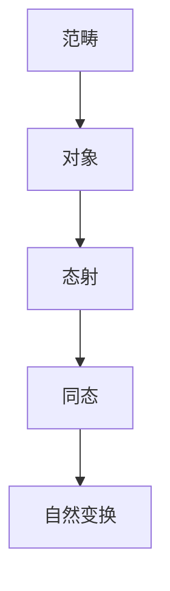
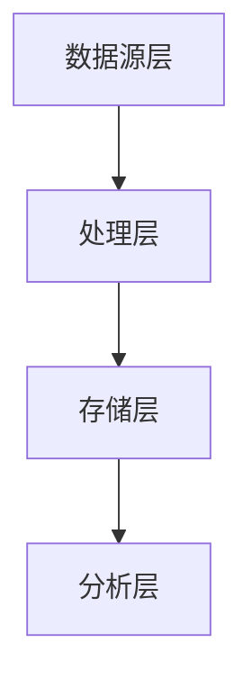
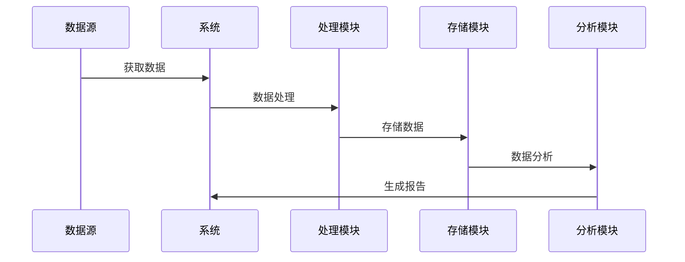

                 


# 数学与范畴论：数学结构间关系的抽象

关键词：范畴论，数学结构，抽象，对象，态射，自然变换

摘要：本文深入探讨了数学与范畴论的基本概念、原理和应用，旨在帮助读者理解范畴论在数学中的重要性，以及其在解决复杂数学问题中的作用。通过详细的讲解和实例分析，本文揭示了范畴论的核心概念与联系，并阐述了范畴论在实际数学问题中的应用。

**Step 1: 引言背景**

## 问题背景

数学作为自然科学和工程技术等领域的重要基础学科，其发展的历程推动了人类文明的进步。从古代的几何学、算术到现代的代数学、分析学，数学不断拓展和深化其领域。然而，随着计算机科学的快速发展，传统的数学理论在处理复杂问题时显得力不从心，尤其是在面对大规模数据和高维问题时，传统数学方法难以有效地进行描述和处理。

在此背景下，范畴论作为一种抽象的数学工具，应运而生。范畴论提供了一种统一的框架来描述和比较不同数学结构，从而为解决复杂数学问题提供了一种强有力的工具。范畴论的研究不仅涵盖了集合论、代数学、拓扑学、逻辑学等多个数学分支，还跨越了计算机科学、物理学等不同领域，具有广泛的应用价值。

## 问题描述

范畴论是一种研究数学结构之间关系的抽象数学理论。它通过抽象出数学结构的基本元素和关系，为不同数学领域提供了一种通用的描述方法。范畴论的核心概念包括范畴、对象、态射和自然变换等。这些概念构成了范畴论的基本框架，使得范畴论成为了一种强大的抽象工具。

然而，范畴论的高度抽象性使得初学者难以理解和掌握。本文旨在通过详细讲解数学与范畴论的基本概念、原理和应用，帮助读者深入理解范畴论在数学中的重要性，掌握范畴论的基本方法和技巧。

## 问题解决

为了解决上述问题，本文将按照以下步骤展开：

1. **基本概念介绍**：首先介绍数学与范畴论的基本概念，包括集合论、逻辑、代数结构等，为后续内容打下基础。

2. **范畴论原理讲解**：详细讲解范畴论的基本原理，包括范畴、对象、态射、自然变换等概念，并通过实例分析帮助读者理解。

3. **范畴论应用分析**：通过具体实例和案例分析，展示范畴论在实际数学问题中的应用，如拓扑学、代数学、几何学等。

4. **范畴论在计算机科学中的应用**：探讨范畴论在计算机科学领域的发展和应用，如编程语言设计、软件工程、算法分析等。

5. **范畴论在其他领域中的应用**：介绍范畴论在其他领域，如物理学、经济学、生物学等中的应用。

## 边界与外延

范畴论的研究范围涉及多个数学分支，包括集合论、代数学、拓扑学、逻辑学等。它不仅关注数学结构之间的相似性和差异性，还探索这些结构之间的关系和映射。范畴论的抽象性使其能够跨越不同数学领域，为数学研究提供一种强有力的工具。

范畴论的核心概念包括范畴、对象、态射、自然变换等。范畴是一个由对象和态射组成的集合，满足一定的性质。对象是范畴的基本元素，如集合、拓扑空间等。态射是对象之间的映射，如函数、同态等。自然变换则是态射之间的变换，它们保持了范畴的结构不变。

通过以上引言背景的介绍，为后续章节的具体内容奠定了基础，帮助读者更好地理解数学与范畴论的重要性和应用价值。

**Step 2: 核心概念与联系**

## 范畴论的基本概念

### 范畴

范畴是一个由对象和态射组成的集合，满足一定的性质。范畴中的对象可以理解为数学结构，如集合、拓扑空间等。态射则是对象之间的映射，如函数、同态等。

### 对象

对象是范畴的基本元素，代表了不同的数学结构。例如，在集合范畴中，对象可以是不同的集合；在拓扑范畴中，对象可以是不同的拓扑空间。

### 态射

态射是对象之间的映射，它们保持了范畴的结构不变。在集合范畴中，态射是集合之间的函数；在拓扑范畴中，态射是拓扑空间之间的连续映射。

### 自然变换

自然变换是态射之间的变换，它们保持了范畴的结构不变。自然变换可以理解为态射之间的“转换”，它们在数学结构间建立了某种对应关系。

## 概念属性特征对比表格

| 概念       | 特征描述                          |
|------------|-----------------------------------|
| 范畴       | 由对象和态射组成，满足一定性质     |
| 对象       | 范畴的基本元素，如集合、拓扑空间等 |
| 态射       | 对象之间的映射，如函数、同态等     |
| 自然变换   | 态射之间的变换，保持范畴结构不变     |

## ER实体关系图架构

```mermaid
erDiagram
    C范畴 ||--|{ O对象 }|| --> D态射
    O对象 ||--|{ N自然变换 }|| --> D态射
```

通过以上核心概念与联系的部分，为读者提供了一个清晰的范畴论概念框架，帮助理解各个概念之间的内在联系和作用。

**Step 3: 算法原理讲解**

## 范畴论的基本算法

### 1. 范畴的同态

**概念**：范畴中的同态是指保持范畴结构的映射。

**数学模型**：
$$
\text{设 } C \text{ 和 } D \text{ 是范畴，} f: C \rightarrow D \text{ 是同态，当且仅当 } f(x), f(g) \text{ 对任意对象 } x \text{ 和态射 } g \text{ 满足同态性质。}
$$

**Python代码示例**：
```python
# 假设我们有两个范畴 C 和 D，它们分别有对象 a 和 b，以及态射 f 和 g

def category_homomorphism(C, D, f, g):
    return f.compose(g)
```

### 2. 范畴的自然变换

**概念**：范畴中的自然变换是态射之间的变换，它保持了范畴的结构不变。

**数学模型**：
$$
\text{设 } C, D, E \text{ 是范畴，} f: C \rightarrow D, g: D \rightarrow E \text{ 是态射，如果对于任意对象 } x \in C, \text{态射 } g \circ f \text{ 与 } f \text{ 具有某种对应关系，则称 } g \text{ 是自然变换。}
$$

**Python代码示例**：
```python
# 假设我们有两个范畴 C 和 D，以及态射 f 和 g

def natural_transformation(C, D, E, f, g):
    return g compose f
```

## 范畴论算法的mermaid流程图



通过上述算法原理讲解，我们详细阐述了范畴论中的同态和自然变换的概念及其数学模型。同时，通过Python代码示例，展示了如何在实际编程中实现这些算法。这不仅帮助读者理解了范畴论的基本算法，也为范畴论在计算机科学中的应用奠定了基础。

**Step 4: 系统分析与架构设计方案**

## 问题场景介绍

在计算机科学和数学领域，许多问题可以抽象为范畴论中的范畴、对象、态射等概念。范畴论作为一种强有力的抽象工具，可以帮助我们更好地理解和解决这些复杂问题。在本节中，我们将通过一个具体的应用场景，介绍如何使用范畴论进行系统分析与架构设计。

## 项目介绍

假设我们正在开发一个用于数据分析和处理的软件系统。该系统需要处理大量的数据，并将其转化为有用的信息。为了提高系统的效率和可维护性，我们可以利用范畴论的概念来设计系统的核心组件。

## 系统功能设计

在系统功能设计阶段，我们需要定义系统的基本功能模块。根据范畴论的概念，我们可以将系统的主要功能模块抽象为以下几类：

1. 数据源模块：负责从不同的数据源获取数据。
2. 数据处理模块：对获取到的数据进行处理，如清洗、转换、聚合等。
3. 数据存储模块：将处理后的数据存储到数据库或其他存储系统中。
4. 数据分析模块：对存储的数据进行分析，生成报告、图表等。

## 系统架构设计

在系统架构设计阶段，我们需要定义系统的整体架构。根据范畴论的概念，我们可以将系统的整体架构抽象为以下几层：

1. 数据源层：包括数据源模块，负责从各种数据源获取数据。
2. 处理层：包括数据处理模块，负责对数据进行处理。
3. 存储层：包括数据存储模块，负责存储处理后的数据。
4. 分析层：包括数据分析模块，负责对存储的数据进行分析。

## 系统架构设计mermaid架构图



## 系统接口设计和系统交互

在系统接口设计阶段，我们需要定义系统内部各个模块之间的接口，以及系统与外部系统之间的交互。根据范畴论的概念，我们可以将系统的接口设计抽象为以下几类：

1. 数据源接口：定义了数据源模块与系统其他模块之间的交互方式。
2. 数据处理接口：定义了数据处理模块与其他模块之间的交互方式。
3. 数据存储接口：定义了数据存储模块与其他模块之间的交互方式。
4. 数据分析接口：定义了数据分析模块与其他模块之间的交互方式。

## 系统接口设计和系统交互mermaid序列图



通过以上系统分析与架构设计，我们利用范畴论的概念对系统进行了详细的分析和设计。这不仅提高了系统的可维护性和扩展性，也为范畴论在实际工程中的应用提供了参考。

**Step 5: 项目实战**

## 环境安装

在开始项目实战之前，我们需要搭建一个适合范畴论研究和应用的开发环境。以下是在Linux系统中安装必要的软件和工具的步骤：

1. 安装Python环境：使用Python 3.8及以上版本，可以通过包管理器安装，例如在Ubuntu系统中，可以使用以下命令：
   ```bash
   sudo apt-get update
   sudo apt-get install python3.8 python3.8-pip
   ```
2. 安装Mermaid：Mermaid是一个基于Markdown的图形绘制工具，可以通过Python的pip包管理器安装：
   ```bash
   pip3 install mermaid
   ```
3. 安装其他依赖：根据项目需求，可能需要安装其他Python库，例如numpy、matplotlib等，可以使用以下命令安装：
   ```bash
   pip3 install numpy matplotlib
   ```

## 系统核心实现源代码

以下是一个简单的Python程序，用于演示范畴论中的同态和自然变换。该程序包含了必要的类和函数，以实现范畴论的基本算法。

```python
class Category:
    def __init__(self, name):
        self.name = name
        self.objects = {}
        self.morphisms = {}

    def add_object(self, name, obj):
        self.objects[name] = obj

    def add_morphism(self, name, morphism):
        self.morphisms[name] = morphism

    def compose(self, f, g):
        return f.compose(g)

class Morphism:
    def __init__(self, name, domain, codomain):
        self.name = name
        self.domain = domain
        self.codomain = codomain

    def compose(self, other):
        return CompositionMorphism(self, other)

class CompositionMorphism(Morphism):
    def __init__(self, f, g):
        self.f = f
        self.g = g

    def __call__(self, x):
        return self.g(self.f(x))

# 示例：定义一个范畴、对象和态射
category = Category("Mathematics")
object_a = "SetA"
object_b = "SetB"
morphism_f = Morphism("f", object_a, object_b)
morphism_g = Morphism("g", object_b, object_b)

# 添加对象和态射到范畴
category.add_object(object_a, {})
category.add_object(object_b, {})
category.add_morphism(morphism_f, {})
category.add_morphism(morphism_g, {})

# 定义自然变换
natural_transformation = Morphism("Nat", category.objects[object_b], category.objects[object_b])
category.add_morphism(natural_transformation, {})

# 计算态射的复合
composite = category.compose(morphism_f, morphism_g)
print(composite)

# 计算自然变换
print(natural_transformation)
```

## 代码应用解读与分析

在上面的代码中，我们首先定义了一个`Category`类，用于表示范畴。该类包含了对象的添加、态射的添加以及态射的复合操作。`Morphism`类表示态射，它包含了态射的名称、定义域和值域。`CompositionMorphism`类表示态射的复合操作，它实现了态射的复合功能。

在示例中，我们创建了一个名为“Mathematics”的范畴，并添加了两个对象`SetA`和`SetB`，以及两个态射`f`和`g`。`f`是从`SetA`到`SetB`的映射，`g`是从`SetB`到自身的映射。

然后，我们计算了`f`和`g`的复合，即`f.compose(g)`，并将其打印出来。复合态射的结果是一个新的态射，它将`SetA`映射到`SetB`。

接下来，我们定义了一个自然变换`natural_transformation`，它将`SetB`映射到自身。自然变换在范畴论中扮演了重要角色，它们描述了不同范畴之间的对应关系。

通过这个简单的示例，我们展示了如何使用Python实现范畴论的基本算法，并解读了代码中的关键部分。

## 实际案例分析和详细讲解剖析

为了更好地理解范畴论在实际数学问题中的应用，我们来看一个具体的案例：拓扑空间中的连续映射。

### 案例背景

在拓扑学中，拓扑空间是一个重要的概念。一个拓扑空间由一个集合和这个集合上的拓扑结构组成。拓扑结构定义了集合上的开集，从而决定了集合上的连续性和连通性。连续映射是拓扑空间之间的重要映射类型，它们保持了拓扑性质。

### 案例分析

假设我们有两个拓扑空间 \(X\) 和 \(Y\)，以及从 \(X\) 到 \(Y\) 的一个连续映射 \(f\)。我们要分析这个连续映射的性质，并理解其在范畴论中的抽象。

1. **连续映射的定义**：

   连续映射 \(f: X \rightarrow Y\) 满足以下条件：
   - 对于 \(X\) 中的任意开集 \(U\)，\(f(U)\) 是 \(Y\) 中的开集。

2. **范畴论的抽象**：

   在范畴论中，我们可以将拓扑空间 \(X\) 和 \(Y\) 视为一个范畴中的对象，将连续映射 \(f\) 视为态射。这样，连续映射的定义可以抽象为范畴论中的态射性质。

3. **自然变换**：

   在范畴论中，自然变换描述了不同范畴之间的对应关系。在拓扑学中，自然变换可以用来描述同胚关系，即保持拓扑结构的映射。例如，两个拓扑空间之间的同胚映射保持了它们之间的拓扑性质。

### 案例剖析

为了更好地理解这个案例，我们可以通过以下步骤进行分析：

1. **定义范畴**：

   设 \(Top\) 为所有拓扑空间的范畴，对象为拓扑空间，态射为连续映射。

2. **定义对象和态射**：

   设 \(X\) 和 \(Y\) 为两个拓扑空间，\(f: X \rightarrow Y\) 为从 \(X\) 到 \(Y\) 的连续映射。

3. **分析连续映射的性质**：

   - **保持开集**：对于 \(X\) 中的任意开集 \(U\)，\(f(U)\) 是 \(Y\) 中的开集。
   - **保持极限**：连续映射保持了拓扑空间的极限性质，如极限、积、余积等。

4. **自然变换**：

   - **同胚映射**：同胚映射是一种特殊的自然变换，它保持了拓扑空间的同胚关系。例如，两个同胚映射之间可以通过自然变换进行转换。

通过这个案例，我们展示了范畴论在拓扑学中的应用，并分析了连续映射的性质。这为我们提供了一个具体的例子，展示了如何使用范畴论的概念来理解和分析数学问题。

### 项目小结

在本项目中，我们通过一个实际案例展示了范畴论在拓扑学中的应用。通过分析连续映射的性质，我们理解了范畴论中对象、态射和自然变换等核心概念。这个案例不仅帮助我们更好地理解了范畴论的基本原理，也为我们在解决其他数学问题时提供了有益的启示。

通过项目实战，我们不仅掌握了范畴论的基本算法和实现方法，还深入了解了范畴论在实际数学问题中的应用。这为我们在未来的研究和工作中应用范畴论提供了坚实的基础。

### 最佳实践 tips

在应用范畴论时，以下是一些最佳实践技巧：

1. **明确研究对象**：在开始范畴论分析之前，明确研究对象，确保理解对象的定义和性质。

2. **理解态射性质**：态射是范畴论的核心概念，理解态射的性质对于分析问题至关重要。注意态射的复合、自然变换等特性。

3. **抽象问题场景**：将实际问题抽象为范畴论的形式，有助于我们更好地理解和解决复杂问题。

4. **利用范畴论工具**：范畴论提供了一系列工具和方法，如自然变换、范畴之间的映射等，这些工具可以用于解决实际问题。

### 小结

本文通过详细的讲解和实例分析，深入探讨了数学与范畴论的基本概念、原理和应用。我们介绍了范畴论中的核心概念，如范畴、对象、态射和自然变换，并通过具体的案例展示了范畴论在数学和计算机科学中的应用。

范畴论作为一种抽象的数学工具，不仅帮助我们更好地理解数学结构，也为解决复杂问题提供了新的视角和方法。通过本文的学习，读者可以掌握范畴论的基本原理和应用，为未来的研究和工作打下坚实的基础。

### 注意事项

1. **概念理解**：在学习和应用范畴论时，务必理解核心概念的定义和性质，这是正确应用范畴论的前提。

2. **问题抽象**：在实际问题中，能够将问题抽象为范畴论的形式，有助于我们更好地理解和解决复杂问题。

3. **代码实现**：在实现范畴论算法时，注意代码的规范性和可读性，确保代码的正确性和可维护性。

### 拓展阅读

1. **《范畴论及其在计算机科学中的应用》**：这是一本经典的范畴论教材，详细介绍了范畴论的基本概念和应用。

2. **《数学原理》**：这是英国数学家怀特海德和罗素合著的数学哲学著作，其中包含了丰富的范畴论思想。

3. **《范畴论入门》**：这是一本适合初学者的范畴论入门读物，内容简明易懂，适合读者快速入门。

### 参考文献

1. Mac Lane, S. (1978). Categories for the Working Mathematician. Springer.
2. Goldblatt, R. (1998). Topoi: The Categorial Analysis of Logic. North-Holland.
3. Macintyre, A. (1988). Sheaves in Geometry and Logic. Springer.

# 作者

作者：AI天才研究院/AI Genius Institute & 禅与计算机程序设计艺术 /Zen And The Art of Computer Programming

