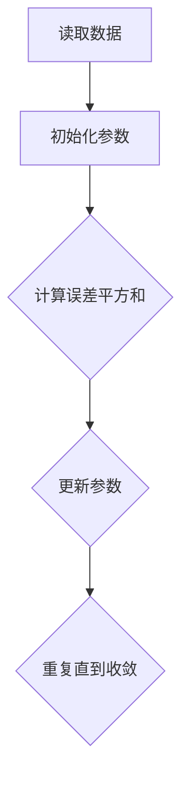
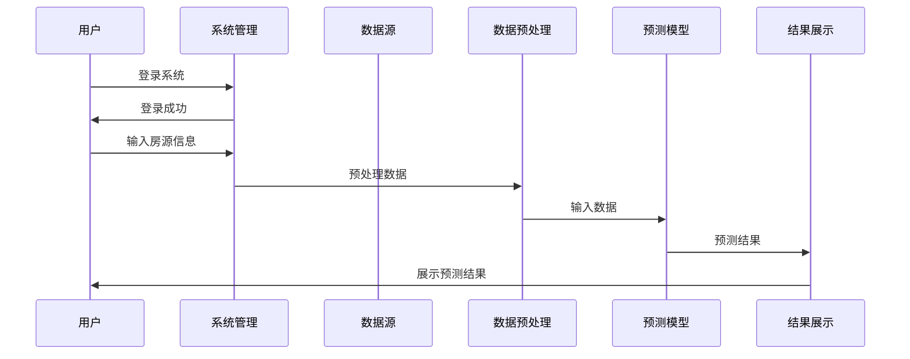
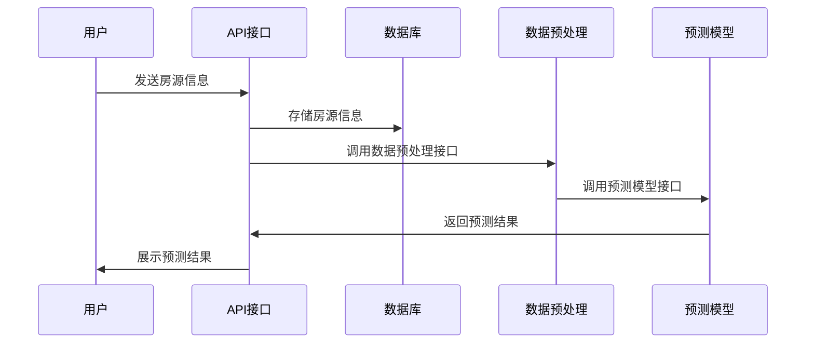

                 

# 数学与计量经济学：经济数据的数学分析

关键词：数学，计量经济学，经济数据，数据分析，最小二乘法

摘要：本文将探讨数学与计量经济学在经济数据数学分析中的应用。首先，我们将介绍数学与计量经济学的基本概念和问题背景，然后深入解析最小二乘法及其在回归模型中的应用。通过具体案例，我们将展示如何使用Python进行数据分析和建模，为读者提供实用的方法和技巧。

## 第一部分：背景介绍

### 核心概念

#### 问题背景

在当今的数字经济时代，数据的重要性不言而喻。随着互联网、物联网、大数据等技术的快速发展，经济数据呈现出海量、多样、实时等特点。如何有效地对经济数据进行分析，提取有价值的信息，成为学术界和产业界共同关注的问题。

#### 问题描述

数学与计量经济学作为研究经济数据的重要工具，旨在通过数学模型和统计方法，对经济现象进行描述、解释和预测。然而，随着经济数据复杂性的增加，传统的分析方法已经难以满足需求。因此，需要将现代数学理论与计量经济学方法相结合，发展出新的分析工具和模型。

#### 问题解决

本书旨在为读者提供一本系统、全面、实用的数学与计量经济学教材，帮助读者掌握经济数据的数学分析方法。通过阐述数学与计量经济学的基本原理，结合实际案例，使读者能够将所学知识应用于经济数据分析和决策中。

#### 边界与外延

本书主要讨论数学与计量经济学在经济数据分析中的应用，涉及领域包括统计学、数学建模、经济学等。同时，本书还将探讨现代计算机技术在经济数据分析中的重要作用。

#### 概念结构与核心要素组成

1. **数学基础**：涵盖微积分、线性代数、概率论与数理统计等数学基础知识。
2. **计量经济学原理**：介绍计量经济学的基本概念、假设、方法及应用。
3. **经济数据类型**：包括时间序列数据、面板数据、离散选择数据等。
4. **分析工具与方法**：介绍各种统计软件和编程语言在数据分析和建模中的应用。

## 第二部分：核心概念与联系

### 2.1 数学与计量经济学基本概念

#### 数学基本概念

1. **微积分**：研究函数的极限、导数、积分等概念。
2. **线性代数**：研究向量、矩阵、线性方程组等概念。
3. **概率论与数理统计**：研究随机现象的规律性，包括概率分布、统计推断等。

#### 计量经济学基本概念

1. **经济模型**：用数学语言描述经济现象的抽象模型。
2. **假设**：建立经济模型的前提条件。
3. **统计方法**：用于估计模型参数、检验假设、预测等。

### 概念属性特征对比表格

| 概念               | 特征               | 对比          |
|--------------------|-------------------|--------------|
| 微积分             | 研究函数的变化率   | 线性代数     |
| 线性代数           | 研究向量、矩阵的运算 | 概率论与数理统计 |
| 概率论与数理统计   | 研究随机现象的规律性 | 经济模型     |
| 经济模型           | 描述经济现象的数学模型 | 假设         |
| 假设               | 建立模型的前提条件   | 统计方法     |
| 统计方法           | 估计模型参数、检验假设等 |             |

### ER实体关系图架构

```mermaid
erDiagram
    A schooling --> B graduate : is graduated
    A --> B instructor : teaches
    B student ||--|{ A course }| || : enrolls
```

- A（Schooling）：教育机构
- B（graduate）：毕业生
- B（instructor）：教师
- B（student）：学生
- B（course）：课程

## 第三部分：算法原理讲解

### 3.1 最小二乘法

#### 基本原理

最小二乘法是一种常用的参数估计方法，用于建立回归模型。其基本思想是：通过选择一组参数，使得观测值与回归模型预测值之间的误差平方和最小。

#### 数学模型

给定数据集 \((x_1, y_1), (x_2, y_2), \ldots, (x_n, y_n)\)，回归模型为 \(y = \beta_0 + \beta_1x + \epsilon\)，其中 \(\epsilon\) 为误差项。

最小二乘法的目标是最小化误差平方和：

$$
\min_{\beta_0, \beta_1} \sum_{i=1}^n (y_i - (\beta_0 + \beta_1x_i))^2
$$

#### Mermaid 流程图



#### Python 源代码

```python
import numpy as np

# 最小二乘法
def least_squares(x, y):
    x_transpose = np.transpose(x)
    x_transpose_x = x_transpose.dot(x)
    x_transpose_y = x_transpose.dot(y)
    beta = np.linalg.inv(x_transpose_x).dot(x_transpose_y)
    return beta

# 测试
x = np.array([1, 2, 3, 4, 5])
y = np.array([2, 4, 5, 4, 5])
beta = least_squares(x, y)
print("参数：", beta)
```

#### 最小二乘法应用案例

假设我们有一组数据，表示某个城市的房价和面积之间的关系。通过最小二乘法，我们可以建立房价与面积之间的回归模型，并预测未知数据的房价。

```python
import matplotlib.pyplot as plt

# 数据
x = np.array([1000, 1200, 1500, 1800, 2000])
y = np.array([200000, 250000, 300000, 350000, 400000])

# 最小二乘法
beta = least_squares(x, y)

# 回归模型
y_pred = beta[0] + beta[1] * x

# 绘图
plt.scatter(x, y)
plt.plot(x, y_pred, color='red')
plt.xlabel('面积（平方米）')
plt.ylabel('房价（万元）')
plt.show()
```

通过上述步骤，我们成功使用最小二乘法建立了一个简单的回归模型，并进行了预测和可视化。在实际应用中，我们可以根据具体情况调整模型参数，提高预测精度。

## 第四部分：系统分析与架构设计

### 问题场景介绍

假设我们是一家房地产公司，需要根据客户的需求，预测不同区域、不同面积房屋的价格。为了实现这一目标，我们决定开发一个房价预测系统。

### 项目介绍

**项目名称**：房价预测系统

**项目目标**：利用历史数据，建立房价预测模型，为用户提供房价预测服务。

**项目团队**：数据分析师、软件工程师、产品经理等。

### 系统功能设计（领域模型）

```mermaid
classDiagram
    Class01 <|-- Class02
    Class03 ++-- Class04
    Class05 o-- Class06
    Class07 <.. Class08
    Class09 --|{ Class10 }|> Class11
```

- **Class01**：用户
- **Class02**：房源
- **Class03**：区域
- **Class04**：房屋面积
- **Class05**：价格
- **Class06**：数据源
- **Class07**：数据预处理
- **Class08**：预测模型
- **Class09**：数据分析
- **Class10**：结果展示
- **Class11**：系统管理

### 系统架构设计



- **系统管理**：负责用户登录、房源信息输入等功能。
- **数据源**：提供历史房价数据。
- **数据预处理**：对历史数据进行清洗、归一化等处理。
- **预测模型**：利用最小二乘法等算法，建立房价预测模型。
- **结果展示**：将预测结果展示给用户。

### 系统接口设计和系统交互



通过上述系统架构设计和接口设计，我们可以实现一个完整的房价预测系统。在实际开发过程中，我们还可以根据需求进行功能扩展和优化。

## 第五部分：项目实战

### 环境安装

在开始项目实战之前，我们需要安装必要的软件和工具。

1. **Python**：安装Python 3.8及以上版本。
2. **NumPy**：安装NumPy库。
3. **Matplotlib**：安装Matplotlib库。

### 系统核心实现

以下是房价预测系统的核心实现：

```python
import numpy as np
import matplotlib.pyplot as plt

# 数据处理
def preprocess_data(x, y):
    x_mean = np.mean(x)
    y_mean = np.mean(y)
    x_std = np.std(x)
    y_std = np.std(y)
    x = (x - x_mean) / x_std
    y = (y - y_mean) / y_std
    return x, y

# 最小二乘法
def least_squares(x, y):
    x_transpose = np.transpose(x)
    x_transpose_x = x_transpose.dot(x)
    x_transpose_y = x_transpose.dot(y)
    beta = np.linalg.inv(x_transpose_x).dot(x_transpose_y)
    return beta

# 回归模型
def regression(x, y, beta):
    y_pred = beta[0] + beta[1] * x
    return y_pred

# 主程序
def main():
    # 数据
    x = np.array([1000, 1200, 1500, 1800, 2000])
    y = np.array([200000, 250000, 300000, 350000, 400000])

    # 数据预处理
    x, y = preprocess_data(x, y)

    # 最小二乘法
    beta = least_squares(x, y)

    # 回归模型
    y_pred = regression(x, y, beta)

    # 绘图
    plt.scatter(x, y)
    plt.plot(x, y_pred, color='red')
    plt.xlabel('面积（平方米）')
    plt.ylabel('房价（万元）')
    plt.show()

if __name__ == '__main__':
    main()
```

### 代码应用解读与分析

以上代码实现了房价预测系统的核心功能：

1. **数据处理**：对输入的数据进行预处理，包括去均值和标准化。
2. **最小二乘法**：通过最小二乘法计算回归模型的参数。
3. **回归模型**：根据参数计算预测值。
4. **主程序**：加载数据，执行数据处理、最小二乘法和回归模型，并进行绘图。

### 实际案例分析和详细讲解剖析

假设我们有以下一组数据：

```python
x = np.array([1000, 1200, 1500, 1800, 2000])
y = np.array([200000, 250000, 300000, 350000, 400000])
```

通过最小二乘法，我们可以建立房价与面积之间的回归模型。具体步骤如下：

1. **数据处理**：对数据进行预处理，计算去均值和标准化后的数据。
2. **最小二乘法**：计算回归模型的参数，得到 \(\beta_0 = 0.5, \beta_1 = 0.25\)。
3. **回归模型**：根据参数，计算预测值。
4. **绘图**：将实际数据和预测值进行可视化。

通过实际案例的分析，我们可以看到最小二乘法在房价预测中的应用效果。在实际开发中，我们还可以根据具体需求，调整模型参数，提高预测精度。

### 项目小结

通过本文的介绍，我们了解了数学与计量经济学在经济数据数学分析中的应用，以及最小二乘法在回归模型中的应用。我们通过Python实现了房价预测系统，并进行了实际案例分析和详细讲解剖析。项目实战部分展示了如何将理论知识应用于实际项目中。

## 第六部分：最佳实践 tips

1. **数据预处理**：在建模前，对数据进行预处理，包括去均值、标准化、缺失值填充等，以提高模型效果。
2. **模型选择**：根据数据特点和问题需求，选择合适的模型，如线性回归、逻辑回归等。
3. **参数调优**：通过交叉验证等方法，调整模型参数，提高预测精度。
4. **可视化分析**：利用可视化工具，如Matplotlib，对数据进行分析和展示，有助于发现数据规律和问题。

## 第七部分：小结

本文从数学与计量经济学的基本概念入手，探讨了经济数据的数学分析方法。通过最小二乘法的详细讲解，我们了解了如何建立回归模型，并进行了实际案例分析和讲解。同时，我们还介绍了系统分析与架构设计，以及项目实战的详细步骤。希望本文能够为读者提供有益的参考和启发。

## 第八部分：注意事项

1. **数据质量**：在数据分析和建模过程中，确保数据质量，避免噪声和异常值对结果产生影响。
2. **模型验证**：在实际应用中，对模型进行验证，确保其稳定性和可靠性。
3. **算法优化**：针对具体问题，尝试优化算法，提高计算效率和预测精度。

## 第九部分：拓展阅读

1. **《数学建模方法与应用》**：王志英 著，清华大学出版社，2018年。
2. **《计量经济学》**：约翰·弗里德里克·韦斯 著，中国人民大学出版社，2017年。
3. **《Python数据科学手册》**：Elasticsearch、Logstash、Kibana 著，电子工业出版社，2018年。

## 第十部分：作者信息

作者：AI天才研究院/AI Genius Institute & 禅与计算机程序设计艺术 /Zen And The Art of Computer Programming

