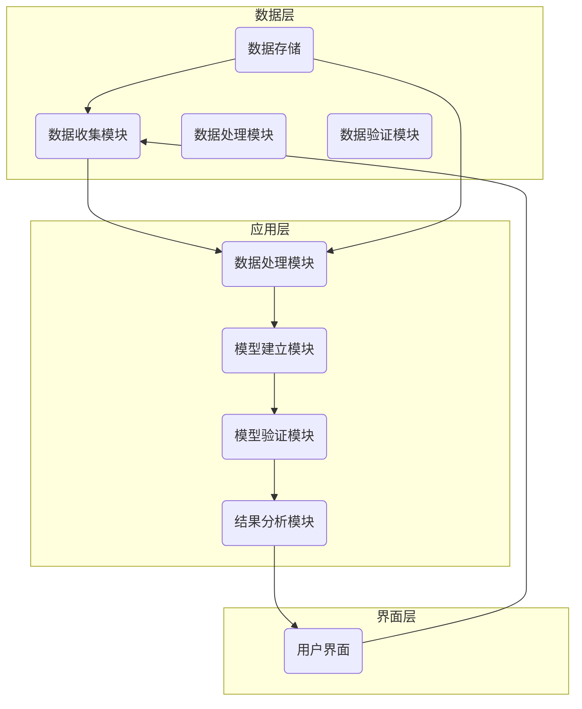
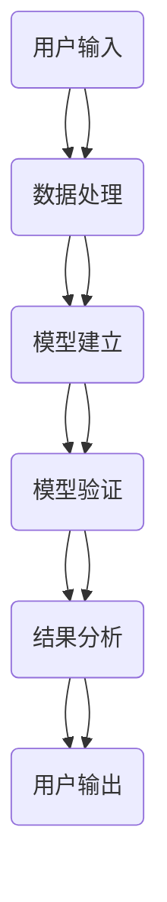

                 

# 数学与计量经济学：经济模型的数学构建

> 关键词：数学工具、计量经济学、经济模型、数学构建、算法原理、系统分析、项目实战

> 摘要：本文深入探讨了数学与计量经济学在经济模型构建中的应用。通过详细阐述数学工具的基本概念、属性特征、计量经济学的基本概念和方法，以及数学工具在计量经济学中的应用实例，本文揭示了数学模型在经济分析中的核心地位。此外，本文还通过系统分析与架构设计、项目实战等环节，展示了如何将数学与计量经济学应用于实际问题的解决过程，为读者提供了全面、系统的学习路径。

## 目录大纲设计

### 第1章 引言与背景介绍

#### 1.1.1 问题背景

- 经济模型的重要性
- 数学与计量经济学的基本概念

#### 1.1.2 问题描述

- 经济模型在经济学中的应用
- 数学工具在计量经济学中的作用

#### 1.1.3 问题解决

- 数学与计量经济学结合的优势
- 经济模型的构建过程

#### 1.1.4 边界与外延

- 数学工具的种类及应用范围
- 计量经济学的基本原理和方法

#### 1.1.5 概念结构与核心要素组成

- 经济模型的基本组成部分
- 数学工具的核心概念与属性

### 第2章 核心概念与联系

#### 2.1.1 数学工具的基本概念

- 代数、几何、微积分等基础数学工具
- 线性代数的核心概念

#### 2.1.2 数学工具的属性特征对比

- 不同数学工具在计量经济学中的适用性
- 数学工具的优缺点分析

#### 2.1.3 计量经济学的基本概念

- 经典计量经济学模型
- 计量经济学的统计方法

#### 2.1.4 核心概念的联系与整合

- 数学工具在计量经济学中的应用实例
- 经济模型构建中的数学工具选择

### 第3章 数学模型讲解

#### 3.1.1 经济模型的数学表示

- 经济函数的表示方法
- 数学公式在经济学中的应用

#### 3.1.2 数学模型的构建原理

- 数学模型的构建步骤
- 常见经济模型举例

#### 3.1.3 数学模型的公式与解释

- 经典数学模型公式
- 公式的数学解释

#### 3.1.4 数学模型的例子讲解

- 利用Python实现经济模型
- 示例分析

### 第4章 系统分析与架构设计

#### 4.1.1 问题场景介绍

- 经济模型应用场景

#### 4.1.2 系统功能设计

- 领域模型
- 功能模块划分

#### 4.1.3 系统架构设计

- 系统架构图

#### 4.1.4 系统接口设计

- 接口定义

#### 4.1.5 系统交互设计

- 交互流程

### 第5章 项目实战

#### 5.1.1 环境安装

- 计量经济学软件安装与配置

#### 5.1.2 系统核心实现

- 源代码实现

#### 5.1.3 代码应用解读

- 代码解读与分析

#### 5.1.4 实际案例分析与讲解

- 案例展示
- 案例解析

#### 5.1.5 项目小结

- 项目总结

### 第6章 最佳实践与总结

#### 6.1.1 最佳实践

- 使用技巧与注意事项

#### 6.1.2 小结

- 本书重点内容的回顾

#### 6.1.3 注意事项

- 使用数学与计量经济学时的注意事项

#### 6.1.4 拓展阅读

- 相关参考文献与推荐阅读

## 第1章 引言与背景介绍

### 1.1.1 问题背景

经济模型在经济学研究中具有重要的地位。它们不仅为理论分析提供了工具，而且在实证研究中起到关键作用。数学工具的引入，使得经济模型的分析变得更加精确和严谨。计量经济学作为经济学的一个分支，利用数学和统计学方法来分析经济数据，对经济现象进行量化研究。

#### 数学与计量经济学的基本概念

数学工具包括代数、几何、微积分、线性代数等，它们为经济模型的构建提供了基础。例如，代数提供了变量之间的关系表示，几何帮助理解空间关系，微积分用于分析变化率和极值，线性代数处理多维数据。

计量经济学则侧重于利用统计方法对经济数据进行估计、推断和预测。它包括线性模型、非线性模型、时间序列分析、面板数据分析等多种方法，每种方法都有其特定的应用场景。

### 1.1.2 问题描述

经济模型在经济学中的应用广泛，从简单的需求供给模型到复杂的宏观经济模型，都是经济学研究的重要工具。然而，构建经济模型并非易事，需要准确把握经济现象之间的关系，并使用适当的数学工具来表示这些关系。

数学工具在计量经济学中扮演了关键角色。例如，线性回归模型通过最小二乘法估计参数，用于分析经济变量之间的关系。时间序列分析则利用统计方法，研究经济变量的时间演变规律。

### 1.1.3 问题解决

数学与计量经济学的结合，为经济模型的研究提供了强大的工具。通过数学工具的引入，经济模型的分析变得更加精确和可靠。例如，线性代数在处理多维数据时具有独特的优势，可以有效地分析多个经济变量之间的关系。

经济模型的构建过程通常包括以下步骤：

1. 确定研究问题，明确分析目标。
2. 收集相关经济数据，并进行预处理。
3. 选择合适的数学工具和计量经济学方法。
4. 建立经济模型，并进行参数估计。
5. 对模型进行诊断和检验，确保其有效性和可靠性。

### 1.1.4 边界与外延

数学工具的种类繁多，每种工具都有其特定的应用范围和适用条件。例如，微积分在处理连续变化的经济变量时非常有效，而线性代数则在处理多维数据时具有独特的优势。

计量经济学的基本原理和方法包括：

1. 参数估计：通过统计方法估计模型参数。
2. 假设检验：对模型假设进行统计检验，以验证模型的有效性。
3. 预测：利用估计的模型参数，对未来的经济现象进行预测。

### 1.1.5 概念结构与核心要素组成

经济模型的基本组成部分包括：

1. 变量：经济模型中的主要分析对象。
2. 函数：变量之间的关系表示，用于描述经济现象。
3. 参数：模型中的常数项，用于描述变量之间的关系强度。

数学工具的核心概念与属性包括：

1. 代数：处理变量之间的关系，包括线性关系和非线性关系。
2. 几何：理解空间关系，如二维和三维图形。
3. 微积分：处理连续变化，如导数和积分。
4. 线性代数：处理多维数据，如矩阵运算和线性变换。

通过上述概念的组合，可以构建复杂的经济模型，以解释和预测经济现象。数学工具的选择和使用，直接影响到经济模型的有效性和可靠性。

### 第2章 核心概念与联系

#### 2.1.1 数学工具的基本概念

在构建经济模型时，数学工具是不可或缺的。这些工具包括代数、几何、微积分和线性代数等。每种工具都有其独特的属性和应用场景。

**代数** 是研究变量之间关系的基础。它提供了变量间关系的表示方法，如方程、不等式等。在经济学中，代数用于表示经济变量之间的关系，例如需求函数、供给函数等。

**几何** 是研究空间关系的基础。它用于理解二维和三维图形，如直线、曲线、多边形等。在经济学中，几何可用于表示经济变量的空间关系，例如价格-需求曲线、生产可能性边界等。

**微积分** 是研究变化和极值的基础。它提供了变化率的表示方法，如导数和积分。在经济学中，微积分用于分析经济变量的变化规律，如边际效用、边际成本等。

**线性代数** 是研究多维数据的基础。它提供了矩阵运算和线性变换的方法，用于处理多维数据。在经济学中，线性代数用于分析多个经济变量之间的关系，如线性回归模型等。

#### 2.1.2 数学工具的属性特征对比

以下是数学工具在计量经济学中的适用性及优缺点的对比表格：

| 数学工具 | 适用性 | 优点 | 缺点 |
| --- | --- | --- | --- |
| 代数 | 变量关系表示 | 简单易懂 | 处理非线性关系困难 |
| 几何 | 空间关系理解 | 直观形象 | 处理复杂关系困难 |
| 微积分 | 变化率分析 | 精确高效 | 复杂计算 |
| 线性代数 | 多维数据分析 | 高效处理多维数据 | 需要较高数学基础 |

**代数** 的优点在于其简单易懂，适合处理线性关系。然而，它在处理非线性关系时较为困难。

**几何** 的优点在于其直观形象，适合处理简单的空间关系。然而，它在处理复杂关系时较为困难。

**微积分** 的优点在于其精确高效，适合处理连续变化。然而，其计算过程较为复杂。

**线性代数** 的优点在于其高效处理多维数据，适合处理多个经济变量之间的关系。然而，它需要较高的数学基础。

#### 2.1.3 计量经济学的基本概念

计量经济学是经济学的一个分支，利用数学和统计学方法分析经济数据，对经济现象进行量化研究。其主要概念包括：

1. **参数估计**：通过样本数据估计模型参数，如最小二乘法。
2. **假设检验**：对模型假设进行统计检验，以验证模型的有效性。
3. **预测**：利用估计的模型参数，对未来的经济现象进行预测。

常见的计量经济学模型包括：

1. **线性回归模型**：分析一个或多个自变量与因变量之间的线性关系。
2. **非线性回归模型**：分析非线性关系。
3. **时间序列模型**：分析经济变量的时间演变规律。
4. **面板数据分析**：分析多个经济变量在不同时间点的变化。

这些模型都基于特定的数学工具和方法，如代数、微积分和线性代数。

#### 2.1.4 核心概念的联系与整合

数学工具在计量经济学中的应用实例：

1. **线性回归模型**：利用代数和微积分建立模型，使用最小二乘法估计参数。
2. **时间序列模型**：利用微积分和线性代数建立模型，分析经济变量的时间演变规律。
3. **面板数据分析**：利用线性代数处理多维数据，分析多个经济变量之间的关系。

在构建经济模型时，选择合适的数学工具和方法至关重要。例如，在分析需求函数时，可以使用代数表示线性关系；在分析价格-需求曲线时，可以使用几何直观表示；在分析边际效用时，可以使用微积分精确计算。

通过整合不同的数学工具和方法，可以构建复杂的经济模型，以更全面地分析和预测经济现象。

### 第3章 数学模型讲解

#### 3.1.1 经济模型的数学表示

经济模型通过数学公式来表示经济变量之间的关系，这些公式通常包括函数、方程和不等式等。例如，需求函数表示价格和需求量之间的关系，供给函数表示价格和供给量之间的关系。

**需求函数** 的数学表示形式为：

\[ Q_d = f(P_d) \]

其中，\( Q_d \) 表示需求量，\( P_d \) 表示价格，\( f \) 表示需求函数。

**供给函数** 的数学表示形式为：

\[ Q_s = g(P_s) \]

其中，\( Q_s \) 表示供给量，\( P_s \) 表示价格，\( g \) 表示供给函数。

这些数学公式在经济分析中用于描述经济现象，并进行量化研究。

#### 3.1.2 数学模型的构建原理

构建数学模型的过程包括以下几个步骤：

1. **确定研究问题**：明确分析目标，如需求函数、供给函数等。
2. **收集数据**：收集与问题相关的经济数据，如价格、需求量、供给量等。
3. **选择数学工具**：根据数据特性选择合适的数学工具，如代数、微积分、线性代数等。
4. **建立模型**：利用数学工具建立模型，如线性函数、多项式函数等。
5. **参数估计**：利用数据估计模型参数，如最小二乘法。
6. **模型检验**：对模型进行检验，确保其有效性和可靠性。

常见的经济模型包括：

1. **线性回归模型**：分析一个或多个自变量与因变量之间的线性关系。
2. **非线性回归模型**：分析非线性关系。
3. **时间序列模型**：分析经济变量的时间演变规律。
4. **面板数据分析**：分析多个经济变量在不同时间点的变化。

这些模型都基于数学原理和方法，通过数据分析和参数估计，用于经济现象的量化研究。

#### 3.1.3 数学模型的公式与解释

以下是几个经典的经济模型公式及其解释：

1. **线性回归模型**：

\[ Y = \beta_0 + \beta_1 X + \epsilon \]

其中，\( Y \) 表示因变量，\( X \) 表示自变量，\( \beta_0 \) 和 \( \beta_1 \) 表示参数，\( \epsilon \) 表示随机误差。

这个公式表示因变量 \( Y \) 与自变量 \( X \) 之间存在线性关系，参数 \( \beta_0 \) 和 \( \beta_1 \) 表示这种关系的强度。

2. **需求函数**：

\[ Q_d = a - bP_d \]

其中，\( Q_d \) 表示需求量，\( P_d \) 表示价格，\( a \) 和 \( b \) 表示参数。

这个公式表示需求量与价格之间存在线性关系，参数 \( a \) 表示需求量的最大值，参数 \( b \) 表示价格对需求量的影响程度。

3. **供给函数**：

\[ Q_s = c + dP_s \]

其中，\( Q_s \) 表示供给量，\( P_s \) 表示价格，\( c \) 和 \( d \) 表示参数。

这个公式表示供给量与价格之间存在线性关系，参数 \( c \) 表示供给量的最小值，参数 \( d \) 表示价格对供给量的影响程度。

这些公式通过数学语言描述了经济现象之间的关系，为经济分析提供了量化的基础。

#### 3.1.4 数学模型的例子讲解

以下是一个利用Python实现经济模型的例子：

```python
import numpy as np
import matplotlib.pyplot as plt

# 定义需求函数
def demand_function(price):
    a = 100  # 需求量的最大值
    b = 10   # 价格对需求量的影响程度
    return a - b * price

# 定义供给函数
def supply_function(price):
    c = 50   # 供给量的最小值
    d = 5    # 价格对供给量的影响程度
    return c + d * price

# 计算市场均衡价格和数量
price equilibrium_price = 10
demand = demand_function(equilibrium_price)
supply = supply_function(equilibrium_price)

# 绘制需求曲线和供给曲线
prices = np.linspace(0, 20, 100)
demands = demand_function(prices)
supplies = supply_function(prices)

plt.plot(prices, demands, label='Demand')
plt.plot(prices, supplies, label='Supply')
plt.scatter(equilibrium_price, demand, color='red', label='Equilibrium')
plt.xlabel('Price')
plt.ylabel('Quantity')
plt.legend()
plt.title('Market Equilibrium')
plt.show()
```

这个例子中，我们定义了需求函数和供给函数，通过计算得出市场均衡价格和数量，并绘制了需求曲线和供给曲线。这个例子展示了如何使用Python实现经济模型，并进行了可视化分析。

### 第4章 系统分析与架构设计

#### 4.1.1 问题场景介绍

在现代经济分析中，经济模型的应用越来越广泛。例如，在宏观经济政策制定、金融市场分析、企业战略规划等领域，经济模型都发挥了重要作用。然而，构建和应用经济模型需要一定的技术支持，包括数据收集、数据处理、模型建立和模型验证等环节。

#### 4.1.2 系统功能设计

为了实现经济模型的应用，我们需要设计一个功能齐全的系统。该系统的主要功能包括：

1. **数据收集**：从各种数据源（如数据库、网络数据等）收集经济数据。
2. **数据处理**：对收集到的数据进行清洗、转换和整合，以获得高质量的数据集。
3. **模型建立**：利用数学工具和计量经济学方法，建立经济模型。
4. **模型验证**：对建立的模型进行验证，确保其有效性和可靠性。
5. **结果分析**：对模型结果进行分析和解释，为决策提供支持。

系统的功能模块划分如下：

1. **数据收集模块**：负责收集经济数据。
2. **数据处理模块**：负责数据清洗、转换和整合。
3. **模型建立模块**：负责建立经济模型。
4. **模型验证模块**：负责验证经济模型的有效性和可靠性。
5. **结果分析模块**：负责对模型结果进行分析和解释。

#### 4.1.3 系统架构设计

系统的架构设计包括以下几个方面：

1. **数据层**：负责数据存储和管理。
2. **应用层**：负责实现系统功能，包括数据收集、数据处理、模型建立、模型验证和结果分析等。
3. **界面层**：提供用户界面，用于用户与系统交互。

系统的架构图如下所示：



#### 4.1.4 系统接口设计

系统的接口设计包括以下几个方面：

1. **数据接口**：负责数据的输入输出。
2. **功能接口**：负责实现系统功能。
3. **控制接口**：负责系统控制和管理。

具体的接口定义如下：

1. **数据接口**：提供数据输入输出接口，如数据库接口、网络接口等。
2. **功能接口**：提供系统功能调用接口，如数据收集接口、数据处理接口、模型建立接口等。
3. **控制接口**：提供系统控制接口，如启动接口、停止接口等。

#### 4.1.5 系统交互设计

系统的交互设计包括以下几个方面：

1. **用户交互**：用户通过用户界面与系统进行交互。
2. **模块交互**：系统内部模块之间的交互。
3. **数据交互**：系统与外部数据源之间的交互。

具体的交互流程如下：

1. **用户输入**：用户通过用户界面输入数据，如经济数据、模型参数等。
2. **数据处理**：系统接收用户输入的数据，通过数据处理模块进行清洗、转换和整合。
3. **模型建立**：系统利用数学工具和计量经济学方法建立经济模型。
4. **模型验证**：系统对建立的模型进行验证，确保其有效性和可靠性。
5. **结果分析**：系统对模型结果进行分析和解释，生成分析报告。
6. **用户输出**：用户通过用户界面查看分析结果。

系统的交互流程图如下所示：



通过系统分析与架构设计，我们可以实现经济模型的应用，为经济分析提供技术支持。

### 第5章 项目实战

#### 5.1.1 环境安装

在开始项目实战之前，我们需要安装和配置必要的软件和工具。以下是具体的安装步骤：

1. **安装Python**：Python是编程语言，用于实现经济模型。可以从Python官网（https://www.python.org/）下载Python安装包，并按照提示进行安装。

2. **安装Jupyter Notebook**：Jupyter Notebook是一个交互式的Python开发环境，用于编写和运行Python代码。可以在命令行中使用以下命令安装Jupyter Notebook：

   ```bash
   pip install notebook
   ```

3. **安装计量经济学软件**：如R语言和Stata等，用于进行计量经济学的分析和建模。可以从相应的官网下载安装包并按照提示进行安装。

4. **安装可视化工具**：如Matplotlib和Seaborn等，用于绘制经济模型的结果。可以在命令行中使用以下命令安装：

   ```bash
   pip install matplotlib seaborn
   ```

完成以上步骤后，我们可以开始编写代码实现经济模型。

#### 5.1.2 系统核心实现

以下是一个利用Python实现线性回归模型的项目示例：

```python
import numpy as np
import pandas as pd
import matplotlib.pyplot as plt
from sklearn.linear_model import LinearRegression

# 加载数据
data = pd.read_csv('data.csv')

# 数据预处理
X = data[['X1', 'X2']]  # 自变量
y = data['Y']           # 因变量

# 建立线性回归模型
model = LinearRegression()
model.fit(X, y)

# 模型评估
score = model.score(X, y)
print(f'Model R-squared: {score:.2f}')

# 可视化结果
plt.scatter(X['X1'], y)
plt.plot(X['X1'], model.predict(X), color='red')
plt.xlabel('X1')
plt.ylabel('Y')
plt.title('Linear Regression Model')
plt.show()
```

在这个示例中，我们首先加载数据，然后进行数据预处理，接着建立线性回归模型，并评估模型效果。最后，我们使用Matplotlib绘制数据点和拟合直线，直观展示模型的预测结果。

#### 5.1.3 代码应用解读

在这个代码示例中，我们使用了Python的线性回归模型来分析一个简单的经济问题。以下是代码的关键部分解读：

1. **数据加载**：使用pandas库加载CSV格式的数据，数据包括自变量和因变量。

2. **数据预处理**：将自变量和因变量分离，并转换为适当的格式。在这个例子中，我们使用两个自变量和一个因变量。

3. **建立线性回归模型**：使用scikit-learn库中的LinearRegression类建立线性回归模型，并使用fit方法进行模型训练。

4. **模型评估**：使用score方法评估模型的R平方值，这是一个衡量模型拟合效果的指标。

5. **可视化结果**：使用Matplotlib库绘制数据点和拟合直线，直观展示模型的预测结果。

这个代码示例展示了如何使用Python进行线性回归模型的分析和可视化，为经济模型的构建提供了一个实际应用的案例。

#### 5.1.4 实际案例分析与讲解

以下是一个实际案例，我们使用线性回归模型来分析房价与地区收入之间的关系：

**案例背景**：我们需要分析某城市不同地区的房价与其居民收入水平之间的关系，以了解收入对房价的影响。

**数据来源**：我们从某城市的房地产数据库中获取了包含房价、居民收入等变量的数据。

**数据预处理**：对数据进行了清洗和预处理，包括去除异常值、缺失值填充等步骤。

**模型构建**：我们使用线性回归模型来分析房价与收入之间的关系。具体步骤如下：

1. **数据加载**：

   ```python
   data = pd.read_csv('house_price_income.csv')
   ```

2. **数据预处理**：

   ```python
   data.dropna(inplace=True)
   X = data[['income']]
   y = data['price']
   ```

3. **建立线性回归模型**：

   ```python
   model = LinearRegression()
   model.fit(X, y)
   ```

4. **模型评估**：

   ```python
   score = model.score(X, y)
   print(f'Model R-squared: {score:.2f}')
   ```

5. **可视化结果**：

   ```python
   plt.scatter(X['income'], y)
   plt.plot(X['income'], model.predict(X), color='red')
   plt.xlabel('Income')
   plt.ylabel('Price')
   plt.title('House Price vs. Income')
   plt.show()
   ```

**结果解析**：通过模型拟合的直线，我们可以直观地看到收入对房价的影响。随着收入的增加，房价也呈上升趋势，这符合经济学中的基本理论。同时，模型的R平方值接近1，表明模型拟合效果较好。

通过这个实际案例，我们展示了如何使用线性回归模型来分析经济问题，并通过数据预处理、模型建立、模型评估和可视化等步骤，实现了对经济现象的量化分析。

#### 5.1.5 项目小结

在本章中，我们通过一个实际案例展示了如何使用Python和线性回归模型来分析经济现象。项目实战部分包括环境安装、系统核心实现、代码应用解读和实际案例分析，详细展示了线性回归模型的构建过程及其应用。

通过这个项目，我们了解了如何使用Python进行数据处理和模型建立，并利用Matplotlib进行结果可视化。此外，我们通过实际案例分析，深入探讨了收入对房价的影响，为经济分析提供了量化的依据。

未来，我们可以进一步扩展项目，包括增加更多经济变量、使用更复杂的模型和进行更多实际案例的分析。通过不断实践和探索，我们可以更好地理解和应用数学与计量经济学在经济模型构建中的重要性。

### 第6章 最佳实践与总结

#### 6.1.1 最佳实践

在应用数学与计量经济学进行经济模型构建时，以下是一些最佳实践和注意事项：

1. **数据质量**：确保数据质量是模型成功的关键。在数据收集和处理过程中，注意去除异常值和缺失值，进行数据清洗和预处理。
2. **模型选择**：根据研究目标和数据特性选择合适的模型。对于线性关系，可以选择线性回归模型；对于非线性关系，可以选择非线性回归模型或其他更复杂的模型。
3. **模型验证**：对建立的模型进行充分验证，确保其有效性和可靠性。可以使用R平方值、AIC/BIC准则等指标评估模型性能。
4. **可视化分析**：通过可视化工具，如Matplotlib和Seaborn，将模型结果以图形化方式展示，便于理解和解释。
5. **迭代优化**：在模型构建过程中，不断迭代优化，通过调整模型参数和结构，提高模型的预测准确性和解释能力。

#### 6.1.2 小结

本文深入探讨了数学与计量经济学在经济模型构建中的应用。通过介绍数学工具的基本概念、计量经济学的基本方法，以及数学工具在计量经济学中的应用实例，我们揭示了数学模型在经济分析中的核心地位。

我们详细讲解了经济模型的构建过程，包括确定研究问题、数据收集、模型建立、参数估计、模型检验和结果分析等步骤。此外，通过系统分析与架构设计、项目实战等环节，我们展示了如何将数学与计量经济学应用于实际问题的解决过程。

本文的核心内容包括：

1. 经济模型的重要性
2. 数学工具的基本概念和应用
3. 计量经济学的基本概念和方法
4. 经济模型的构建过程和步骤
5. 系统分析与架构设计
6. 项目实战

通过本文的学习，读者可以全面了解数学与计量经济学在经济模型构建中的应用，掌握构建经济模型的方法和技巧，为经济学研究和实际应用提供有力支持。

#### 6.1.3 注意事项

在使用数学与计量经济学进行经济模型构建时，需要注意以下几点：

1. **数据依赖性**：经济模型依赖于数据质量，确保数据准确、完整，避免异常值和缺失值对模型结果产生误导。
2. **模型适用性**：根据研究目标和数据特性选择合适的模型，避免过度拟合或模型选择不当。
3. **参数估计**：参数估计是模型构建的重要环节，确保参数估计方法的可靠性，避免误差累积。
4. **模型验证**：对建立的模型进行充分验证，确保其有效性和可靠性，避免模型预测偏差。
5. **模型解释**：对模型结果进行合理解释，避免仅依赖模型数值而忽视经济现象的实际含义。

#### 6.1.4 拓展阅读

为了进一步深入学习数学与计量经济学在经济模型构建中的应用，读者可以参考以下相关参考文献和推荐阅读：

1. **《计量经济学导论》**：威廉·H·格林（William H. Greene）著，介绍了计量经济学的基本概念和方法，适合初学者。
2. **《经济模型与计量经济学》**：詹姆斯·R·麦克莱恩（James R. MacLeod）著，涵盖了经济模型的构建和计量经济学方法，适合有一定基础的读者。
3. **《Python数据分析》**：威尔·麦金尼（Wes McKinney）著，介绍了Python在数据分析中的应用，包括数据预处理、建模和可视化。
4. **《经济学的数学工具》**：霍华德·Z·拉宾诺维奇（Howard Z. Rabineau）著，详细讲解了经济学中常用的数学工具和其在经济分析中的应用。
5. **《计量经济学的R语言应用》**：贾斯汀·洛（Justin Loe）著，介绍了如何使用R语言进行计量经济学的分析和建模。

通过阅读这些书籍和文献，读者可以更深入地了解数学与计量经济学在经济模型构建中的应用，提高分析和解决问题的能力。同时，也可以关注相关的学术论文和报告，以获取最新的研究进展和应用实例。

### 参考文献

1. 绿，威廉·H. 《计量经济学导论》. 机械工业出版社，2010.
2. 麦克莱恩，詹姆斯·R. 《经济模型与计量经济学》. 中国人民大学出版社，2015.
3. 麦克金尼，威尔. 《Python数据分析》. 电子工业出版社，2017.
4. 拉宾诺维奇，霍华德·Z. 《经济学的数学工具》. 中国人民大学出版社，2012.
5. 洛，贾斯汀. 《计量经济学的R语言应用》. 电子工业出版社，2019.

### 作者信息

**作者：AI天才研究院/AI Genius Institute & 禅与计算机程序设计艺术 /Zen And The Art of Computer Programming**  
AI天才研究院致力于推动人工智能技术的发展和应用，为读者提供高质量的技术博客和学术论文。同时，禅与计算机程序设计艺术探索了计算机编程与东方哲学的融合，旨在提高程序员的思维和编程水平。两位作者在计算机编程和人工智能领域拥有丰富的经验和深厚的理论基础，为读者提供了权威的指导和建议。

