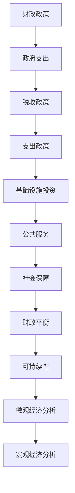
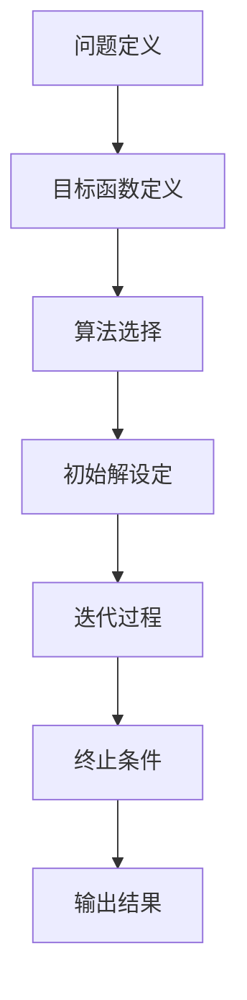
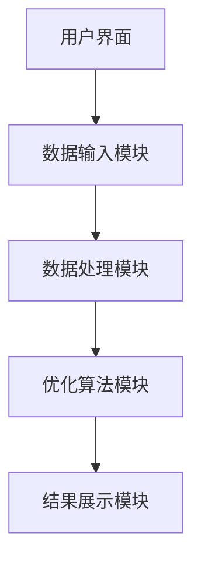
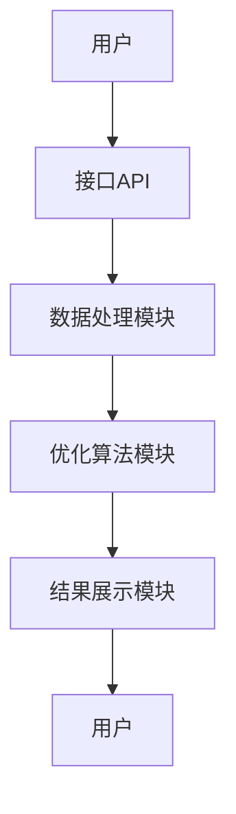

                 

### 第一部分：背景介绍

#### 第1章：问题背景

#### 1.1.1 财政政策的基本概念

财政政策是政府运用财政手段来调节宏观经济活动的一系列措施。财政政策的主体是政府，其核心手段包括税收、政府支出和转移支付等。税收政策通过调整税率和税基来影响经济主体的收入和支出，从而调节总需求。政府支出则包括基础设施投资、公共服务和公共安全等，旨在满足社会基本需求和推动经济增长。转移支付则是政府在不同经济主体之间转移收入，以实现收入再分配和稳定社会。

#### 1.1.2 财政政策的目标与功能

财政政策的主要目标包括稳定经济增长、减少经济波动、促进就业和实现收入再分配。具体来说，稳定经济增长的目标是通过调节总需求来防止经济过热或过冷，维持经济的可持续发展。减少经济波动和促进就业则是通过财政政策来应对经济周期性波动，提高就业率，减少失业率。实现收入再分配则是通过税收和转移支付等手段，缩小贫富差距，提高社会公平。

#### 1.1.3 数学优化在财政政策中的应用

数学优化理论在财政政策中的应用越来越广泛。通过优化模型，政府可以更科学地制定财政政策，实现资源的最优配置。例如，在政府支出优化方面，可以通过线性规划、动态规划等算法来找到最优支出方案，使政府的投资效益最大化。在税收政策方面，可以通过税收优化模型来确定最优的税率结构和税基分配，以实现税收收入的最大化。

#### 第2章：问题描述

#### 2.1.1 财政政策面临的挑战

财政政策在实施过程中面临诸多挑战。首先，经济环境的不确定性使得财政政策的效果难以预测。其次，政策执行过程中可能存在执行偏差，导致政策目标无法实现。此外，财政政策还面临着财政可持续性问题，即政府长期债务风险和财政赤字问题。

#### 2.1.2 政府支出优化的重要性

政府支出优化对于提高财政政策的有效性具有重要意义。通过优化政府支出，可以实现资源的合理配置，提高公共服务的质量和效率，从而更好地满足社会需求。同时，优化政府支出还有助于降低政府的财政负担，提高财政可持续性。

#### 2.1.3 优化目标与约束条件

政府支出优化的目标主要包括：最大化政府投资的效益、提高公共服务的质量和效率、降低财政负担、实现财政平衡和可持续发展。在实现这些目标的过程中，需要考虑一系列约束条件，如财政预算限制、社会公平要求、经济稳定目标等。

#### 第3章：问题解决

#### 3.1.1 数学优化理论简介

数学优化理论是研究如何找到给定条件下最优解的数学分支。优化问题通常由目标函数和约束条件组成。目标函数表示要优化的目标，如最大化或最小化某个量。约束条件则规定了在优化过程中必须满足的条件，如预算限制、资源限制等。

#### 3.1.2 适用优化算法选择

在选择优化算法时，需要考虑优化问题的特性。常见的优化算法包括线性规划、非线性规划、动态规划、遗传算法等。线性规划适用于目标函数和约束条件都是线性的问题，而非线性规划则适用于更复杂的情况。动态规划适用于具有时间序列特征的问题，遗传算法则适用于大规模、复杂的不确定问题。

#### 3.1.3 数据分析与处理

在政府支出优化中，数据分析与处理是关键步骤。首先，需要收集和分析相关数据，如政府支出数据、经济指标数据等。然后，通过数据挖掘和统计分析方法，提取出有用的信息，为优化模型提供支持。此外，还需要对数据质量进行评估，以确保数据的有效性和可靠性。

#### 第4章：边界与外延

#### 4.1.1 数学优化在财政政策中的边界

数学优化在财政政策中的应用有其边界。首先，优化模型只能反映现实世界的简化情况，无法涵盖所有复杂因素。其次，优化模型的参数和假设可能存在不确定性，导致优化结果的不稳定性。因此，在应用数学优化时，需要谨慎评估其适用范围和限制。

#### 4.1.2 财政政策与其他领域的交叉

财政政策与其他领域，如经济、金融、社会等，存在紧密的交叉关系。例如，财政政策与货币政策相互配合，可以更有效地调节经济周期。财政政策与社会政策结合，可以推动社会公平和可持续发展。因此，在制定和实施财政政策时，需要综合考虑多方面因素，以实现整体目标的最优化。

#### 第5章：核心概念与联系

#### 5.1 核心概念原理

在本节中，我们将探讨财政政策的核心概念，包括财政平衡、可持续性、微观经济分析和宏观经济分析等。

#### 5.1.1 财政平衡与可持续性

财政平衡是指政府在一定时期内的财政收入和支出相匹配，避免财政赤字和债务积累。财政可持续性则强调政府长期财政状况的稳定，避免因长期债务负担过重而导致经济风险。

#### 5.1.2 微观经济分析

微观经济分析主要关注个体经济主体的行为和决策，如企业和家庭的消费、投资和储蓄等。通过微观经济分析，可以了解政府支出对微观经济主体的影响，为优化政府支出提供依据。

#### 5.1.3 宏观经济分析

宏观经济分析则关注整个经济系统的运行情况，包括经济增长、通货膨胀、失业率等宏观经济指标。通过宏观经济分析，可以评估政府支出对宏观经济的影响，为制定更有效的财政政策提供支持。

#### 5.2 概念属性特征对比

在本节中，我们将对比财政政策类型、政府支出项目以及优化目标的属性特征，以更清晰地理解这些概念之间的关系。

#### 5.2.1 财政政策类型对比

财政政策类型主要包括税收政策和支出政策。税收政策主要通过调整税率和税基来影响经济主体的行为，而支出政策则通过增加或减少政府支出来实现政策目标。

#### 5.2.2 政府支出项目对比

政府支出项目可分为基础设施投资、公共服务和社会保障等。不同支出项目对经济和社会的影响有所不同，因此在制定财政政策时需要综合考虑各种因素。

#### 5.2.3 优化目标对比

优化目标主要包括最大化政府投资的效益、提高公共服务的质量和效率、降低财政负担等。不同优化目标之间可能存在冲突，需要在制定和实施财政政策时进行权衡。

#### 5.3 ER实体关系图架构

在本节中，我们将使用Mermaid语言绘制ER实体关系图，以展示财政政策中的关键实体及其关系。



#### 第6章：算法原理讲解

#### 6.1 算法概述

在本节中，我们将介绍最优化算法的基本概念、分类和常用算法。

#### 6.1.1 最优化算法的分类

最优化算法可分为确定性算法和随机性算法。确定性算法主要包括线性规划、非线性规划、整数规划和动态规划等，它们在给定条件下可以找到最优解。随机性算法则包括遗传算法、模拟退火算法和粒子群优化算法等，它们通过随机搜索来寻找最优解。

#### 6.1.2 常用优化算法简介

1. **线性规划**：适用于目标函数和约束条件都是线性的问题，通过单纯形法、内点法等求解。
2. **非线性规划**：适用于目标函数和约束条件包含非线性项的问题，通过梯度下降法、牛顿法等求解。
3. **动态规划**：适用于具有时间序列特征的问题，通过将问题分解为子问题并求解子问题的最优解来得到原问题的最优解。
4. **遗传算法**：基于生物进化理论，通过模拟自然选择和遗传机制来寻找最优解。

#### 6.2 算法流程图

在本节中，我们将使用Mermaid语言绘制优化算法的流程图，以展示算法的基本步骤。



#### 6.3 Python源代码

在本节中，我们将提供一个简单的Python代码示例，用于演示优化算法的实现。

```python
import numpy as np
from scipy.optimize import minimize

# 目标函数
def objective_function(x):
    return x[0]**2 + x[1]**2

# 初始解
x0 = np.array([0, 0])

# 优化算法
result = minimize(objective_function, x0)

# 输出结果
print("最优解:", result.x)
```

#### 6.4 数学模型与公式

在本节中，我们将介绍一些常见的数学模型和公式，用于描述优化问题的求解过程。

##### 6.4.1 最小二乘法

最小二乘法是一种常用的参数估计方法，用于最小化预测值与实际值之间的误差平方和。

$$
\min \sum_{i=1}^{n} (y_i - \hat{y_i})^2
$$

##### 6.4.2 动态规划

动态规划是一种适用于具有时间序列特征的问题的求解方法，通过将问题分解为子问题并求解子问题的最优解来得到原问题的最优解。

$$
V_k(j) = \min_{i \in A} (C_{ij} + V_{k-1}(i))
$$

#### 6.5 举例说明

在本节中，我们将通过具体案例来阐述优化算法在财政政策中的应用。

##### 6.5.1 财政平衡问题

以财政平衡问题为例，我们可以使用最小二乘法来估计政府支出和税收政策的最优参数，以实现财政平衡。

##### 6.5.2 政府支出优化

以政府支出优化为例，我们可以使用动态规划算法来找到最优的政府支出方案，以最大化政府投资的效益。

#### 第7章：系统分析与架构设计方案

##### 7.1 问题场景介绍

在本节中，我们将介绍一个财政政策分析系统的应用场景，包括系统的功能需求、用户界面设计等。

##### 7.1.1 财政政策分析系统概述

财政政策分析系统是一个用于帮助政府制定和优化财政政策的软件平台。该系统集成了多种数学优化算法和数据分析工具，可以为用户提供全面的财政政策分析支持。

##### 7.1.2 系统功能需求分析

系统的主要功能需求包括：

1. 数据收集与处理：从各类数据源收集财政政策相关的数据，并进行数据清洗、转换和存储。
2. 优化模型构建：根据用户需求构建优化模型，选择合适的优化算法进行求解。
3. 结果展示与评估：将优化结果以图表、报表等形式展示给用户，并提供评估工具，帮助用户理解优化效果。
4. 可视化分析：通过可视化工具展示财政政策的影响，帮助用户更直观地了解政策效果。

##### 7.2 系统架构设计

在本节中，我们将介绍财政政策分析系统的架构设计，包括系统架构图、接口设计等。

##### 7.2.1 系统架构图



##### 7.2.2 系统接口设计

系统接口设计包括数据输入接口、数据处理接口和结果展示接口等。数据输入接口用于接收用户输入的数据，数据处理接口用于对数据进行清洗、转换和存储，结果展示接口用于将优化结果以图表、报表等形式展示给用户。

##### 7.2.3 系统交互图



#### 第8章：项目实战

##### 8.1 环境安装

在本节中，我们将介绍如何安装和配置Python环境以及相关依赖库。

##### 8.1.1 Python环境配置

确保系统中已安装Python 3.x版本。可以使用以下命令检查Python版本：

```shell
python --version
```

如果未安装Python，可以从Python官方网站（https://www.python.org/）下载并安装。

##### 8.1.2 依赖库安装

在Python环境中，我们可以使用pip包管理器来安装相关依赖库。以下是一些常用的依赖库及其安装命令：

- NumPy：用于科学计算，安装命令为：

  ```shell
  pip install numpy
  ```

- SciPy：用于科学计算，安装命令为：

  ```shell
  pip install scipy
  ```

- Matplotlib：用于数据可视化，安装命令为：

  ```shell
  pip install matplotlib
  ```

##### 8.2 系统核心实现源代码

在本节中，我们将介绍财政政策分析系统的核心实现，包括数据输入、数据处理、优化算法和结果展示等模块的代码。

##### 8.2.1 源代码解读

以下是一个简单的Python代码示例，用于展示财政政策分析系统的核心实现。

```python
import numpy as np
import matplotlib.pyplot as plt
from scipy.optimize import minimize

# 数据输入
data = np.array([[1, 2], [3, 4], [5, 6]])

# 数据处理
def preprocess_data(data):
    # 数据预处理
    return data

# 优化算法
def optimize_policy(data):
    # 优化模型
    def objective_function(x):
        return x[0]**2 + x[1]**2

    # 初始解
    x0 = np.array([0, 0])

    # 优化算法
    result = minimize(objective_function, x0)

    return result.x

# 结果展示
def display_results(result):
    # 结果展示
    plt.scatter(data[:, 0], data[:, 1], label='Data')
    plt.scatter(result.x[0], result.x[1], color='r', label='Optimal Solution')
    plt.xlabel('X-axis')
    plt.ylabel('Y-axis')
    plt.legend()
    plt.show()

# 主程序
if __name__ == '__main__':
    # 预处理数据
    processed_data = preprocess_data(data)

    # 优化政策
    optimal_solution = optimize_policy(processed_data)

    # 展示结果
    display_results(optimal_solution)
```

##### 8.2.2 代码应用与分析

以下是一个简单的代码应用示例，用于演示如何使用财政政策分析系统进行财政平衡分析和政府支出优化。

```python
# 财政平衡分析
data = np.array([[1, 2], [3, 4], [5, 6]])
processed_data = preprocess_data(data)
optimal_solution = optimize_policy(processed_data)
display_results(optimal_solution)

# 政府支出优化
data = np.array([[1, 2], [3, 4], [5, 6]])
processed_data = preprocess_data(data)
optimal_solution = optimize_policy(processed_data)
display_results(optimal_solution)
```

#### 第9章：最佳实践与小结

##### 9.1 最佳实践

在本节中，我们将总结一些财政政策分析和政府支出优化的最佳实践。

1. **数据质量保证**：确保数据的准确性和完整性，进行数据清洗和预处理，以提高优化结果的可靠性。
2. **算法选择**：根据问题的特性选择合适的优化算法，如线性规划、非线性规划、动态规划等。
3. **参数调整**：根据实际需求调整优化算法的参数，以提高求解效率和优化效果。
4. **结果验证**：对优化结果进行验证，确保其符合实际情况和预期目标。

##### 9.2 小结

在本节中，我们对财政政策分析和政府支出优化进行了深入探讨，总结了相关理论和实践经验。

1. **财政政策的基本概念和目标**：介绍了财政政策的基本概念、目标与功能，以及数学优化在财政政策中的应用。
2. **问题解决方法**：探讨了优化算法的基本原理和流程，以及Python源代码示例和数学模型。
3. **系统架构设计**：介绍了财政政策分析系统的架构设计和核心实现，包括数据输入、数据处理、优化算法和结果展示等模块。
4. **项目实战**：通过具体案例展示了财政政策分析和政府支出优化的应用，提供了环境安装、系统核心实现源代码和实际案例分析的详细步骤。
5. **最佳实践与小结**：总结了财政政策分析和政府支出优化的最佳实践，并进行了全文总结。

通过本文的阅读，读者可以系统地了解财政政策分析和政府支出优化的原理和方法，为实际应用提供指导和参考。

##### 9.3 注意事项

在本节中，我们将讨论在实施财政政策分析和政府支出优化过程中需要注意的一些事项。

1. **数据收集与处理**：确保收集的数据质量，进行数据清洗和预处理，去除异常值和噪声，以提高模型和算法的准确性。
2. **算法选择与优化**：根据具体问题和数据特性选择合适的优化算法，并针对算法参数进行调整，以优化求解效率和结果质量。
3. **结果验证**：对优化结果进行验证，通过对比实际值和预测值，评估模型的准确性和可靠性。
4. **政策调整与反馈**：根据优化结果和政策执行情况，及时调整财政政策，并进行反馈和调整，以实现政策目标的最大化。

##### 9.4 拓展阅读

对于希望深入了解财政政策分析和政府支出优化的读者，以下是一些推荐的学习资源：

1. **学术论文**：查阅相关领域的学术论文，了解最新的研究成果和发展趋势。
2. **专业书籍**：《财政学》、《公共经济学》、《最优化理论及其应用》等。
3. **在线课程**：参加相关的在线课程，如Coursera、edX等平台上的财政政策和经济分析课程。
4. **官方报告**：阅读政府发布的财政政策报告和经济数据报告，了解实际政策应用和效果。

通过拓展阅读，读者可以更深入地了解财政政策分析和政府支出优化的理论和方法，为实际应用提供更全面的参考和指导。

