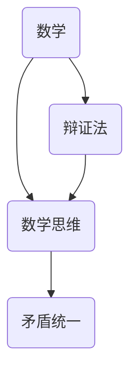
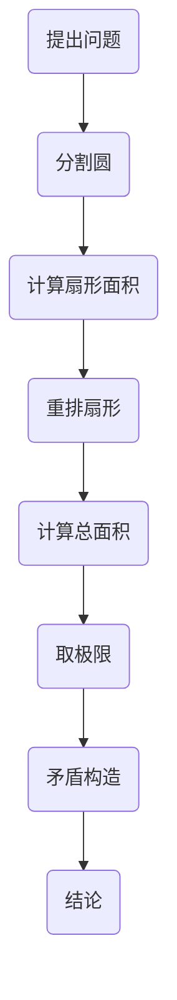

                 

### 第1章 问题背景

#### 1.1.1 问题背景介绍

**数学与辩证法的关系**

数学是一门研究数量、结构、变化和空间等概念的抽象科学，它通过符号化的语言表达概念和理论。而辩证法则是哲学上的一种思维方式，它强调通过观察和分析事物的对立面及其运动变化来理解世界。数学与辩证法之间有着紧密的联系，它们在研究世界本质和规律方面起到了互补的作用。

首先，数学为辩证法提供了抽象的工具。辩证法的核心思想之一是对立统一，这一思想可以通过数学中的概念和模型得到直观的体现。例如，数学中的负数和正数、奇数和偶数等都是对立的概念，但它们在数学体系中又是统一的。

其次，辩证法为数学提供了哲学基础。辩证法强调事物的发展和变化，这一点在数学中尤为重要。数学不仅是静态的，也是动态的。许多数学理论的发展都是通过观察和分析事物的变化过程而得出的。

**矛盾统一的数学思维**

矛盾统一原理是辩证法中的核心概念，它指出事物内部存在着对立的两个方面，但这两个方面又是相互依存的，通过斗争和统一推动事物的发展。在数学思维中，矛盾统一原理体现在如何通过解决数学中的矛盾来揭示统一性。

例如，在解方程时，我们经常需要通过引入新的概念（如负数）来解决原有的矛盾（如负数无法进行加减运算）。这种引入新概念的过程就是矛盾统一的体现。此外，在数学证明中，通过构造反证法或矛盾法来证明某个命题的正确性，也是矛盾统一原理的典型应用。

**数学与辩证法结合的方法论**

为了更好地将数学与辩证法结合起来，我们可以采用以下方法论：

1. **矛盾分析法**：在数学问题的解决过程中，不断寻找问题中的矛盾，并通过分析这些矛盾来寻找问题的解决方案。

2. **统一性思维**：在解决数学问题时，不仅要看到矛盾，还要看到矛盾中的统一性，从而找到问题解决的关键。

3. **动态发展观**：在数学研究中，要注重事物的发展变化，通过观察和分析变化过程来揭示数学规律。

**本书的研究范围**

本书的研究范围包括：

- 数学的基本概念和原理，如数、函数、几何等。
- 辩证法的基本原理和其在数学中的应用，如矛盾统一、量变质变等。
- 如何将辩证法原理应用于数学问题解决，探讨矛盾统一原理在数学证明中的应用。

通过上述方法论的引导，本书旨在探索一种新的数学思维方式，使数学研究更加深入、全面。

#### 1.1.2 问题描述

**矛盾统一的数学思维**

矛盾统一的数学思维是指运用辩证法原理来理解和解决数学问题的一种思维方式。这种思维方式强调在数学问题的研究和解决过程中，要不断地分析矛盾、寻找统一性。

**问题来源**

这种思维方式的来源主要有两个方面：

1. **数学内部矛盾**：在数学发展的过程中，许多问题的提出和解决都是基于矛盾的分析。例如，负数的引入解决了原有数系中的矛盾；非欧几何的提出则是对传统欧几里得几何的挑战。

2. **数学与哲学的结合**：辩证法作为一种哲学思维方式，其核心思想与数学的研究方法有着深刻的联系。将辩证法原理应用于数学研究，可以更好地揭示数学中的矛盾和统一。

**问题重要性**

矛盾统一的数学思维在数学研究中的重要性体现在以下几个方面：

1. **提升数学理解能力**：通过矛盾统一原理，可以更深入地理解数学概念和理论，从而提升数学素养。

2. **激发创新思维**：在数学问题的解决过程中，通过矛盾统一原理可以激发出新的思路和方法，推动数学研究的创新。

3. **解决复杂问题**：许多复杂的数学问题都可以通过矛盾统一原理得到有效的解决。

**目标**

本章节的目标是：

1. **阐述矛盾统一的数学思维的概念和重要性**。

2. **介绍如何将辩证法原理应用于数学问题的解决**。

3. **探讨矛盾统一原理在数学证明中的应用**。

通过上述目标的实现，读者可以更好地理解矛盾统一的数学思维，并在实际数学研究中运用这一思维方式。

#### 1.1.3 问题解决

**数学与辩证法结合的方法论**

为了解决上述提出的问题，我们需要将数学与辩证法结合起来，采用一系列方法论来指导数学研究。以下是几个关键的方法论：

1. **矛盾分析法**：在数学问题解决过程中，首先要识别和分析问题中的矛盾。通过深入分析矛盾，可以找到问题解决的关键点。

2. **统一性思维**：在分析矛盾的同时，要注重寻找矛盾中的统一性。统一性思维可以帮助我们理解数学概念和理论之间的内在联系，从而找到解决问题的方法。

3. **动态发展观**：数学不仅是静态的，也是动态的。在数学研究中，要注重事物的发展和变化，通过观察和分析变化过程来揭示数学规律。

**具体应用步骤**

1. **识别矛盾**：首先，识别数学问题中的矛盾。这些矛盾可以是概念上的对立、方法上的冲突等。

2. **分析矛盾**：对识别出的矛盾进行深入分析，找出矛盾的具体表现和原因。

3. **寻找统一性**：在分析矛盾的基础上，寻找矛盾中的统一性。统一性可以体现在数学概念、理论和方法之间的内在联系。

4. **提出解决方案**：基于矛盾分析和统一性思维，提出解决问题的方案。

5. **验证解决方案**：通过实际操作和验证，确保解决方案的有效性和可行性。

**示例**

以数学中的“求和公式”为例，我们可以通过矛盾统一原理来理解和解决这一问题。

**问题背景**：求和公式是指一类特殊的数学公式，用于计算一系列数的和。例如，等差数列的求和公式、等比数列的求和公式等。

**矛盾分析**：在解决求和公式的问题时，我们通常会面临以下矛盾：

- **静态与动态的矛盾**：求和公式是静态的，但实际计算过程中涉及到数列的动态变化。
- **一般与特殊的矛盾**：求和公式需要对一类特定的数列进行求和，但实际应用中可能会遇到更一般的情况。

**统一性思维**：通过矛盾统一原理，我们可以找到以下统一性：

- **一般化的求和公式**：通过引入一般化的求和公式，可以将特殊的情况包含在内，从而解决静态与动态的矛盾。
- **递推关系**：在求和公式中，递推关系体现了数列的动态变化，同时也揭示了数列之间的统一性。

**解决方案**：

1. **识别矛盾**：识别出求和公式问题中的矛盾，如静态与动态的矛盾、一般与特殊的矛盾。

2. **分析矛盾**：分析矛盾的具体表现和原因，如动态变化如何影响求和过程、一般情况如何适用于特殊情况。

3. **寻找统一性**：通过递推关系和一般化的求和公式，找到矛盾中的统一性。

4. **提出解决方案**：提出一般化的求和公式，用于解决静态与动态的矛盾，以及一般与特殊的情况。

5. **验证解决方案**：通过实际计算和验证，确保一般化的求和公式能够有效地解决求和问题。

通过上述步骤，我们可以利用矛盾统一原理来理解和解决求和公式问题。这种方法论不仅适用于数学问题，也可以推广到其他科学领域，帮助人们更好地理解和解决复杂问题。

#### 1.1.4 边界与外延

**确定本书的研究范围**

在探讨矛盾统一的数学思维这一主题时，我们需要明确本书的研究范围，以确保内容的针对性和深度。

**数学的基本概念**

本书将涵盖数学的一些基本概念，如：

- **数**：介绍数的分类、性质及其在数学中的作用。
- **函数**：探讨函数的定义、分类和性质，包括函数表达式和图像。
- **几何**：介绍几何的基本概念，如点、线、面、体等，以及它们在数学中的运用。

**辩证法的基本原理**

辩证法是哲学上的一种思维方式，它提供了理解和分析数学问题的工具。本书将探讨以下辩证法的基本原理：

- **对立统一**：解释对立统一的概念，讨论其在数学中的应用。
- **量变质变**：分析量变质变原理，讨论其在数学问题解决中的应用。

**数学与辩证法结合的应用**

本书的核心内容是探讨如何将辩证法原理应用于数学问题解决，包括：

- **矛盾统一原理**：阐述矛盾统一原理在数学中的应用，分析数学中的矛盾如何通过统一性得到解决。
- **数学证明**：讨论如何利用矛盾统一原理进行数学证明，提供具体的证明方法和实例。

**边界与外延**

确定研究范围的边界与外延对于保证研究的深度和广度至关重要。本书的研究边界包括：

- **数学领域**：本书主要探讨数学内部的问题，不涉及数学与其他学科的交叉应用。
- **辩证法原理**：本书将集中在辩证法原理在数学中的应用，不深入探讨辩证法在其他领域的应用。

通过明确本书的研究范围，读者可以更好地理解矛盾统一的数学思维，并在实际数学研究中运用这一思维方式。

### 第2章 核心概念与联系

#### 2.1 核心概念原理

**数学概念**

数学是一门研究数量、结构、变化和空间等概念的抽象科学。在数学中，核心概念包括数、函数、几何等。

1. **数的概念**：

   - **实数**：实数是数学中最基本的数系，包括有理数和无理数。有理数是可以表示为两个整数之比的数，如分数；无理数则不能表示为两个整数之比，如根号2。
   - **复数**：复数是由实部和虚部组成的数，可以表示为a+bi的形式，其中a和b都是实数，i是虚数单位，满足i²=-1。

2. **函数的概念**：

   - **定义**：函数是数学中的一个基本概念，表示一种关系，将一个集合中的每个元素唯一地对应到另一个集合中的一个元素。
   - **分类**：函数可以分为不同的类型，如线性函数、二次函数、指数函数、对数函数等。
   - **性质**：函数的性质包括单调性、奇偶性、周期性等。

3. **几何的概念**：

   - **点、线、面**：点是没有大小的基本几何元素；线是无限延伸的几何元素；面是由多个点连接而成的几何区域。
   - **体**：体是三维空间中的几何形状，如立方体、球体等。

**辩证法概念**

辩证法是哲学上的一种思维方式，强调通过观察和分析事物的对立面及其运动变化来理解世界。

1. **对立统一**：

   - **定义**：对立统一是指事物内部存在着对立的两个方面，但这两个方面又是相互依存的，通过斗争和统一推动事物的发展。
   - **应用**：在数学中，对立统一原理体现在数学概念的对立性，如实数与虚数、奇数与偶数等。

2. **量变质变**：

   - **定义**：量变质变是指事物的数量变化达到一定程度会引起质的变化。
   - **应用**：在数学中，量变质变原理体现在数学问题的解决过程中，如通过引入新概念（如负数）来解决原有矛盾。

#### 2.2 概念属性特征对比表格

| 概念        | 数学概念              | 辩证法概念               |
| ----------- | ------------------- | ---------------------- |
| 数           | 实数、复数           | 量变、质变              |
| 函数        | 函数表达式、图像     | 反映关系、动态变化      |
| 几何        | 点、线、面、体       | 对立统一、对称性、变异性 |

**ER实体关系图架构**

在这个ER实体关系图中，数学作为核心，通过辩证法提供了哲学基础，而数学思维则在这一基础上发展起来，最终形成矛盾统一这一核心概念。

通过上述核心概念和原理的介绍以及对比表格和ER实体关系图的展示，我们可以更清晰地理解数学与辩证法之间的联系，为后续章节的深入探讨打下基础。

#### 2.3 ER实体关系图架构

为了更好地理解数学与辩证法之间的联系，我们可以通过ER（实体-关系）图来展示它们之间的结构关系。以下是数学与辩证法之间的ER实体关系图：

**图解说明：**

1. **数学（A）**：数学是研究数量、结构、变化和空间等概念的学科。它是辩证法中的具体体现和应用。

2. **辩证法（B）**：辩证法是一种哲学上的思维方式，强调通过观察和分析事物的对立面及其运动变化来理解世界。它为数学提供了哲学基础。

3. **数学思维（C）**：数学思维是指在数学研究过程中采用的思考方式，它融合了数学和辩证法的核心思想。

4. **矛盾统一（D）**：矛盾统一是辩证法中的核心概念，强调事物内部存在着对立的两个方面，但这两个方面又是相互依存的。在数学思维中，矛盾统一体现了数学问题解决过程中的对立与统一。

通过上述ER实体关系图，我们可以直观地看到数学、辩证法、数学思维和矛盾统一之间的结构关系，这有助于我们更好地理解数学与辩证法之间的相互作用和影响。

### 第3章 数学基础

#### 3.1 数学概念回顾

**数的概念**

数是数学中最基本的元素，可以分为不同的类型，每种类型的数都有其独特的性质和应用。

1. **实数**：

   - **定义**：实数包括有理数和无理数。有理数是可以表示为两个整数之比的数，如分数。无理数则是不能表示为两个整数之比的数，如根号2、π等。
   - **性质**：实数在数轴上可以表示为点，它们可以进行加、减、乘、除等基本运算。

2. **复数**：

   - **定义**：复数是由实部和虚部组成的数，形式为a+bi，其中a和b都是实数，i是虚数单位，满足i²=-1。
   - **性质**：复数可以用来表示和解决许多数学问题，如几何中的旋转和平移。

**函数的概念**

函数是数学中描述两个集合之间关系的基本概念。

1. **定义**：

   - **函数**：设A和B是两个非空数集，如果按照某个对应规则f，对于A中的每个元素x，都有B中唯一确定的元素y与之对应，那么就称A为函数的定义域，B为函数的值域，x为自变量，y为因变量，f为函数。
   - **表达式**：函数可以用符号f(x)来表示，读作“f关于x的函数”。

2. **分类**：

   - **线性函数**：形式为f(x) = ax + b，其中a和b是常数。
   - **二次函数**：形式为f(x) = ax² + bx + c，其中a、b、c是常数，且a ≠ 0。
   - **指数函数**：形式为f(x) = a^x，其中a是常数，且a > 0且a ≠ 1。
   - **对数函数**：形式为f(x) = log_a(x)，其中a是常数，且a > 0且a ≠ 1。

**几何的概念**

几何是研究空间形状、大小和位置关系的数学分支。

1. **基本概念**：

   - **点**：点是没有大小和形状的几何元素，它是几何图形的基础。
   - **线**：线是由无限多个点组成的，可以无限延伸。
   - **面**：面是由无限多个线组成的，在三维空间中可以定义二维区域。
   - **体**：体是由无限多个面组成的，在三维空间中可以定义三维区域。

2. **几何定理**：

   - **平面几何**：如平行线定理、三角形内角和定理、勾股定理等。
   - **立体几何**：如体积计算公式、表面积计算公式、球体和锥体的性质等。

**数、函数、几何之间的关系**

数、函数和几何是数学中的三大基础领域，它们之间有着紧密的联系。

- **数**是函数和几何的量化基础，如函数中的自变量和因变量可以用数来表示。
- **函数**描述了数之间的关系和变化规律，如函数表达式可以用数来定义。
- **几何**则是数和函数的具体表现形式，如几何图形可以用函数的图像来表示。

通过回顾数学的基本概念，我们可以更好地理解数学的本质和它在解决实际问题中的应用。

#### 3.2 函数与方程

**函数的基本性质**

函数是数学中描述两个集合之间关系的核心概念，具有以下基本性质：

1. **定义域**：函数的定义域是指所有可以作为函数自变量的值。例如，函数f(x) = 1/x的定义域是所有非零实数。

2. **值域**：函数的值域是指所有通过函数映射得到的结果。例如，函数f(x) = x²的值域是所有非负实数。

3. **单调性**：函数的单调性是指函数在定义域上的增减性。若函数在定义域内，当x增加时f(x)也增加，则称函数为增函数；反之，若当x增加时f(x)减少，则称函数为减函数。

4. **奇偶性**：函数的奇偶性是指函数关于原点的对称性。若f(-x) = f(x)，则称函数为偶函数；若f(-x) = -f(x)，则称函数为奇函数。

5. **周期性**：函数的周期性是指函数在某个周期内的重复性。若存在一个非零实数T，使得对于所有x，有f(x + T) = f(x)，则称函数为周期函数。

**方程的求解**

方程是数学中另一个基本概念，它表示两个代数表达式之间的等价关系。以下是一些常见方程的求解方法：

1. **一元一次方程**：

   - **定义**：一元一次方程是只有一个未知数，且未知数的最高次数为一次的方程。
   - **求解方法**：通过移项和合并同类项，将方程转化为形如ax + b = 0的形式，然后求解未知数x。
   - **示例**：方程2x + 3 = 0的解为x = -3/2。

2. **一元二次方程**：

   - **定义**：一元二次方程是只有一个未知数，且未知数的最高次数为二的方程。
   - **求解方法**：通过配方法和求根公式（x = [-b ± √(b² - 4ac)] / 2a）求解。
   - **示例**：方程x² - 5x + 6 = 0的解为x = 2或x = 3。

3. **多元方程组**：

   - **定义**：多元方程组是含有多个未知数的方程组。
   - **求解方法**：通过代入法、消元法或矩阵法求解。
   - **示例**：方程组
     $$
     \begin{cases}
     2x + 3y = 5 \\
     x - y = 1
     \end{cases}
     $$
     的解为x = 2，y = 1。

**函数与方程的关系**

函数与方程密切相关。函数是描述两个集合之间关系的工具，而方程则是在特定条件下，通过函数描述的等价关系。

- **方程可以转化为函数**：例如，一元一次方程ax + b = 0可以表示为函数f(x) = ax + b，其中f(x) = 0。
- **函数可以通过方程求解**：例如，通过求解方程f(x) = 0可以找到函数的零点。

理解函数与方程的基本性质和求解方法，是掌握数学理论和解题技巧的基础。通过这些概念，我们可以更深入地理解数学的本质和应用。

#### 3.3 几何与空间

**几何基本概念**

几何是数学的一个分支，主要研究空间中点的位置、线段、角度、平面和立体图形的性质及其相互关系。以下是几何的基本概念：

1. **点**：点是几何的基本元素，它没有大小和形状，只有位置。在平面几何中，点通常用大写字母表示，如A、B、C等。

2. **线段**：线段是连接两点之间的最短路径。线段有两个端点，长度是固定的。线段可以用两个端点的字母表示，如AB。

3. **直线**：直线是由无限多个点组成的，它可以无限延伸。在平面几何中，直线通常用一个小写字母表示，如l、m、n等。

4. **射线**：射线是从一个点开始，向一个方向无限延伸的直线。射线有一个起点，没有终点。射线通常用起点字母加上箭头表示，如OA。

5. **平面**：平面是由无数个点组成的二维空间，它可以无限扩展。平面可以用一个字母加上两个点表示，如平面ABC。

6. **角度**：角度是两条射线或线段之间的旋转量，通常用度或弧度表示。一个角度的度数等于它所对的圆心角或弧度角。

**空间关系**

空间关系是几何中的重要内容，它描述了几何图形在三维空间中的位置和相互关系。以下是一些基本的空间关系：

1. **平行**：如果两条直线在同一平面内，且永不相交，则称这两条直线平行。在空间中，如果两个平面内的直线都相互平行，则这两个平面也平行。

2. **垂直**：如果两条直线相交，且相交角为90度，则称这两条直线垂直。

3. **相交**：如果两条直线在同一平面内相交，则它们相交于一点。

4. **异面**：如果两条直线不在同一平面内，且不相交，则称这两条直线异面。

5. **共面**：如果三个点在同一个平面内，则称这三个点共面。

**平面几何与立体几何**

平面几何和立体几何是几何的两个主要分支。

1. **平面几何**：研究二维空间的几何性质，如线段、角度、圆、多边形等。

2. **立体几何**：研究三维空间的几何性质，如立方体、球体、圆锥体、圆柱体等。

**平面几何的基本定理**

以下是一些平面几何的基本定理：

1. **平行线定理**：如果两条直线被第三条直线所截，且内错角相等，则这两条直线平行。

2. **三角形内角和定理**：任意三角形的三个内角之和等于180度。

3. **勾股定理**：直角三角形的斜边的平方等于两个直角边的平方和。

**立体几何的基本定理**

以下是一些立体几何的基本定理：

1. **立体图形的体积公式**：如立方体的体积公式V = a³，球体的体积公式V = (4/3)πr³。

2. **表面积公式**：如立方体的表面积公式A = 6a²，球体的表面积公式A = 4πr²。

通过理解和掌握几何的基本概念和空间关系，可以更好地理解和解决几何问题，为后续的学习和应用打下坚实的基础。

### 第4章 矛盾统一的数学思维

#### 4.1 矛盾统一的原理

**矛盾统一的定义**

矛盾统一原理是辩证法中的核心概念，它强调事物内部存在着对立的两个方面，但这两个方面又是相互依存的，通过斗争和统一推动事物的发展。

在数学中，矛盾统一原理体现在如何通过解决数学中的矛盾来揭示统一性。例如，在解决代数方程时，我们经常需要通过引入新的概念（如负数、虚数）来解决原有的矛盾，从而揭示数学概念和理论之间的统一性。

**矛盾统一原理的意义**

矛盾统一原理在数学中具有重要意义，它可以帮助我们更深入地理解数学概念和理论，从而提升数学素养。具体来说，矛盾统一原理具有以下意义：

1. **促进数学理论的创新**：通过矛盾统一原理，数学家可以揭示数学概念和理论之间的内在联系，从而推动数学理论的创新和发展。

2. **解决复杂数学问题**：许多复杂的数学问题都可以通过矛盾统一原理得到有效的解决。例如，在解决代数方程时，通过引入负数和虚数等概念，可以解决原本无法解决的矛盾，从而找到方程的解。

3. **提升数学思维能力**：矛盾统一原理强调在数学问题解决过程中要不断地分析矛盾、寻找统一性，这种思维方式可以提升数学思维能力，培养数学家的创新精神和批判性思维。

**数学中的矛盾统一**

在数学中，矛盾统一原理体现在以下几个方面：

1. **数学概念的对立统一**：数学中许多概念都是对立的，如实数与虚数、奇数与偶数等。但它们又是相互依存的，通过矛盾统一原理，我们可以更好地理解这些概念。

2. **数学方法的对立统一**：在数学研究中，不同的数学方法往往是对立的，如几何与代数、分析与综合等。但它们又是相互补充的，通过矛盾统一原理，我们可以将不同的数学方法结合起来，解决复杂问题。

3. **数学问题的对立统一**：数学中的许多问题都是对立的，如求解方程与证明定理、优化问题与几何问题等。但它们又是相互关联的，通过矛盾统一原理，我们可以找到问题解决的关键。

通过理解矛盾统一原理，我们可以更好地理解数学的本质和规律，从而提升数学素养，培养创新思维和解决复杂问题的能力。

#### 4.2 数学中的矛盾统一实例分析

**对立与统一**

在数学中，矛盾统一原理的典型体现是对立与统一。以下是一些具体的实例：

1. **实数与复数**：

   - **对立**：实数和复数在数学中是两个基本数系。实数可以表示为有理数和无理数，而复数则由实部和虚部组成。
   - **统一**：通过复数，我们可以扩展实数的范围，解决原本无法解决的矛盾。例如，在解决二次方程时，引入虚数可以找到方程的解。

2. **有限与无限**：

   - **对立**：有限和无限是两个相互对立的概念。有限是数量上的限制，而无限则表示数量上的无限延伸。
   - **统一**：在数学中，通过极限和无穷级数等概念，我们可以将有限和无限统一起来。例如，通过无穷级数，我们可以计算π的无限逼近值。

**量变与质变**

量变与质变是辩证法中的另一个重要原理，它在数学中也有广泛的应用。

1. **量变**：

   - **定义**：量变是指事物数量的变化。在数学中，量变体现在数学量的增加或减少，如数的增加、函数的自变量的变化等。
   - **实例**：在解决数学问题时，通过观察量变的过程，我们可以找到问题的解决方法。例如，在解一元二次方程时，通过观察系数的变化，我们可以找到方程的解。

2. **质变**：

   - **定义**：质变是指事物性质的突变。在数学中，质变体现在数学概念或理论的变化，如引入新的概念、改变函数的性质等。
   - **实例**：在数学中，质变的一个典型例子是引入负数和虚数。通过引入负数，我们可以解决原本无法解决的矛盾，如负数的加减运算；通过引入虚数，我们可以扩展复数的范围，解决二次方程的解。

通过分析对立与统一和量变与质变，我们可以更深入地理解数学中的矛盾统一原理。这种原理不仅帮助我们解决数学问题，也促进了数学理论的发展和创新。

#### 4.3 矛盾统一在数学证明中的应用

**证明方法**

在数学证明中，矛盾统一原理可以通过以下几种方法得到应用：

1. **反证法**：

   - **定义**：反证法是一种通过假设命题不成立，推导出矛盾，从而证明原命题成立的方法。
   - **应用**：例如，在证明“如果一个整数能同时被3和4整除，那么它一定能被12整除”时，我们可以假设该整数不能被12整除，然后推导出矛盾，证明原命题成立。

2. **矛盾法**：

   - **定义**：矛盾法是一种通过构造矛盾来证明命题不成立的方法。
   - **应用**：例如，在证明“不存在最小的正偶数”时，我们可以构造一个比给定数更小的正偶数，从而推导出矛盾，证明命题成立。

3. **构造法**：

   - **定义**：构造法是一种通过构造一个满足条件的模型来证明命题成立的方法。
   - **应用**：例如，在证明“欧拉公式e^(iπ) + 1 = 0”时，我们可以构造复平面上的欧拉图形，通过计算其面积和周长来证明命题成立。

**证明实例**

以下是一个利用矛盾统一原理进行数学证明的实例：

**命题**：对于任意的正整数n，都有1^2 + 2^2 + ... + n^2 = n(n+1)(2n+1)/6。

**证明过程**：

1. **假设**：假设命题不成立，即存在一个正整数k，使得1^2 + 2^2 + ... + k^2 ≠ k(k+1)(2k+1)/6。

2. **矛盾构造**：根据假设，我们可以得到以下两个等式：
   $$
   1^2 + 2^2 + ... + k^2 = k(k+1)(2k+1)/6 \\
   1^2 + 2^2 + ... + k^2 + (k+1)^2 ≠ (k+1)(k+2)(2k+3)/6
   $$
   将第二个等式减去第一个等式，得到：
   $$
   (k+1)^2 ≠ (k+1)(k+2)(2k+3)/6 - k(k+1)(2k+1)/6
   $$
   化简后得到：
   $$
   (k+1)^2 ≠ (k+1)[(k+2)(2k+3)/6 - k(2k+1)/6]
   $$
   进一步化简，得到：
   $$
   k+1 ≠ k+1 \\
   $$
   这显然是一个矛盾。

3. **结论**：由于假设导致了矛盾，因此原命题成立。

通过上述证明，我们可以看到矛盾统一原理在数学证明中的应用。这种原理不仅帮助我们理解和证明数学命题，也促进了数学理论的发展和创新。

### 第5章 矛盾统一原理在数学问题中的应用

#### 5.1 数学问题背景介绍

为了更好地理解矛盾统一原理在数学问题中的应用，我们可以通过一个具体的数学问题进行探讨。这里我们选取了一个经典的数学问题：“求证：圆的面积公式”。

**问题背景**：

圆的面积公式是数学中的一个基本公式，用于计算圆的面积。圆的面积公式通常表示为：

$$
A = πr^2
$$

其中，\(A\) 表示圆的面积，\(r\) 表示圆的半径，\(π\) 是一个常数，约等于3.14159。

**问题核心**：

本问题要求我们证明圆的面积公式，即证明任意一个圆的面积都可以通过半径的平方乘以π来计算。这涉及到数学中的几何和代数知识，同时也体现了矛盾统一原理在数学证明中的应用。

**问题重要性**：

圆的面积公式在数学和实际应用中具有重要意义。它不仅是一个基本的数学公式，也是许多更复杂几何问题的基础。此外，圆的面积公式在物理学、工程学等领域有广泛的应用。

#### 5.2 问题分析与解决方案

**问题分析**：

要证明圆的面积公式，我们需要分析圆的性质以及其与面积之间的关系。

1. **圆的基本性质**：

   - 圆是由一条闭合曲线组成，这条曲线上的所有点到圆心的距离都相等。
   - 圆的半径是连接圆心和圆上任意一点的线段，长度为\(r\)。

2. **面积的概念**：

   - 面积是几何图形所占的平面空间大小。
   - 对于平面上的任意图形，其面积可以通过不同的方法计算。

3. **矛盾统一原理的应用**：

   - 在这个问题中，我们需要解决的矛盾是：如何通过圆的半径来计算圆的面积？
   - 解决这一矛盾的关键在于找到圆的面积与其半径之间的关系，这体现了矛盾统一原理的应用。

**解决方案**：

为了证明圆的面积公式，我们可以采用以下步骤：

1. **分割与重排**：

   - 将圆分割成若干个等分的扇形，每个扇形的面积可以通过计算得到。
   - 将这些扇形重新排列，拼成一个接近于矩形的图形。

2. **面积计算**：

   - 计算单个扇形的面积，假设扇形的圆心角为θ，半径为\(r\)，则扇形的面积为：
     $$
     A_{扇形} = \frac{θ}{360°} \cdot πr^2
     $$
   - 由于圆被等分成了n个扇形，因此整个圆的面积近似为n个扇形面积的和：
     $$
     A_{圆} \approx n \cdot A_{扇形} = n \cdot \frac{θ}{360°} \cdot πr^2
     $$

3. **极限思想**：

   - 当n趋近于无穷大时，每个扇形的圆心角θ趋近于0度，但扇形的面积和仍然保持不变。
   - 根据极限思想，我们可以将上述近似公式转化为精确公式：
     $$
     A_{圆} = πr^2
     $$

通过上述步骤，我们可以证明圆的面积公式。这种方法不仅解决了原有的矛盾，还揭示了圆的面积与其半径之间的内在联系，体现了矛盾统一原理在数学问题解决中的应用。

#### 5.3 问题解决过程

**具体步骤**：

为了证明圆的面积公式，我们可以采用以下具体步骤：

1. **分割圆**：

   - 将圆分割成n个等分的扇形。每个扇形的圆心角为\(θ = \frac{360°}{n}\)。
   - 每个扇形的面积可以近似为\(A_{扇形} = \frac{θ}{360°} \cdot πr^2\)。

2. **计算总面积**：

   - 将n个扇形的面积相加，得到圆的面积近似值：
     $$
     A_{圆} \approx n \cdot A_{扇形} = n \cdot \frac{θ}{360°} \cdot πr^2
     $$

3. **取极限**：

   - 当n趋近于无穷大时，每个扇形的圆心角θ趋近于0度，但扇形的面积和仍然保持不变。根据极限思想，我们可以将上述近似公式转化为精确公式：
     $$
     A_{圆} = πr^2
     $$

**证明过程**：

1. **假设**：

   - 假设圆的面积不是\(πr^2\)，即存在一个不同于\(πr^2\)的面积值。

2. **分割与重排**：

   - 将圆分割成n个等分的扇形，每个扇形的面积近似为\(A_{扇形} = \frac{θ}{360°} \cdot πr^2\)。
   - 将这些扇形重新排列，拼成一个接近于矩形的图形。

3. **计算面积**：

   - 根据扇形的面积公式，计算整个圆的面积近似值：
     $$
     A_{圆} \approx n \cdot A_{扇形} = n \cdot \frac{θ}{360°} \cdot πr^2
     $$

4. **矛盾构造**：

   - 如果圆的面积不是\(πr^2\)，则上述近似计算结果应该不等于\(πr^2\)。
   - 但是，根据极限思想，当n趋近于无穷大时，每个扇形的圆心角θ趋近于0度，扇形的面积和趋近于\(πr^2\)。
   - 这导致了一个矛盾：圆的面积既不是\(πr^2\)，又趋近于\(πr^2\)。

5. **结论**：

   - 由于假设导致了矛盾，因此原假设不成立，即圆的面积确实是\(πr^2\)。

通过上述步骤，我们可以证明圆的面积公式，这体现了矛盾统一原理在数学证明中的应用。

#### 使用mermaid画出问题解决的流程图

为了更直观地展示问题解决过程，我们可以使用mermaid画出以下流程图：

在这个流程图中，A代表提出问题，B到H表示具体的解题步骤，通过这些步骤，我们可以证明圆的面积公式。

### 第6章 矛盾统一原理在其他领域的应用

#### 6.1 矛盾统一原理在其他学科中的应用

辩证法中的矛盾统一原理不仅仅在数学领域具有广泛的应用，在其他学科中也有着重要的体现。以下是一些具体的应用场景：

**物理学**

1. **能量守恒定律**：

   - **矛盾**：在物理学中，能量守恒定律指出能量既不会凭空产生，也不会凭空消失，这意味着能量在数量上是守恒的。
   - **统一**：然而，能量的形式可以相互转化，如机械能可以转化为热能、电能等，这体现了矛盾统一原理。能量守恒定律说明了尽管能量形式发生变化，但总量保持不变。

2. **量子力学**：

   - **矛盾**：量子力学中的不确定性原理指出，某些物理量，如位置和动量，不能同时被精确测量。
   - **统一**：然而，通过量子叠加态和量子纠缠等现象，我们可以看到在微观尺度上，矛盾统一原理得到了体现。

**化学**

1. **化学反应**：

   - **矛盾**：在化学反应中，反应物转化为生成物，这是一个能量和物质重新分配的过程。
   - **统一**：化学反应体现了矛盾统一原理，因为反应过程中能量和物质并未消失，而是以新的形式存在。

2. **物质循环**：

   - **矛盾**：地球上的物质循环包括物质的产生、消耗和再生过程。
   - **统一**：通过生态系统的物质循环，矛盾统一原理得到了体现，即物质在循环过程中保持总量不变，但形式不断变化。

**生物学**

1. **进化论**：

   - **矛盾**：进化论中，生物物种的进化过程涉及到生存竞争和自然选择，这体现了生存和灭绝的矛盾。
   - **统一**：然而，通过自然选择，适应环境的物种得以生存，不适应环境的物种被淘汰，这体现了矛盾统一原理。

2. **生态平衡**：

   - **矛盾**：生态系统中，物种之间存在捕食与被捕食的关系，这体现了生存和竞争的矛盾。
   - **统一**：通过生态平衡，捕食者与被捕食者数量维持在一定的比例，这体现了矛盾统一原理。

**哲学**

1. **存在与虚无**：

   - **矛盾**：哲学探讨中，存在与虚无是一对基本矛盾，存在是具体的、有形的，而虚无则是不存在、无形的。
   - **统一**：辩证法认为，虚无是存在的对立面，但也是存在的一部分，二者在矛盾统一中推动世界的发展。

通过以上分析，我们可以看到，矛盾统一原理在物理学、化学、生物学和哲学等领域都有着广泛的应用，它为我们理解这些学科中的复杂现象提供了有力的工具。

#### 6.2 数学与哲学的交汇

**矛盾统一原理在数学哲学中的体现**

矛盾统一原理是辩证法中的核心概念，它在数学哲学中也得到了深刻的体现。数学哲学探讨数学的本质、意义和发展过程，而矛盾统一原理则为数学哲学提供了重要的分析工具。

1. **数学本质的矛盾统一**：

   - **形式与内容**：在数学哲学中，形式与内容是数学本质的一对基本矛盾。形式指的是数学符号和公式的结构，而内容则指的是这些符号和公式所代表的现实世界。矛盾统一原理指出，形式与内容虽然是不同的，但又是相互依存的，通过矛盾统一，我们可以更好地理解数学的本质。
   - **抽象与具体**：数学中，抽象与具体也是一个重要的矛盾。抽象是数学理论的核心，它将具体事物的特征提炼出来，形成通用的数学概念和理论。具体则是现实世界中具体的事物和现象。矛盾统一原理帮助我们认识到，通过抽象与具体的对立统一，数学能够更好地反映和解决现实问题。

2. **数学证明的矛盾统一**：

   - **逻辑与直觉**：在数学证明过程中，逻辑和直觉是两个重要的矛盾。逻辑是通过严格的推理来证明数学命题的正确性，而直觉则是指数学家在解决问题时的一种直观感受。矛盾统一原理指出，逻辑和直觉虽然在方法上对立，但它们在实际数学研究中是相互补充的。通过逻辑和直觉的矛盾统一，我们可以更有效地进行数学证明。

3. **数学发展的矛盾统一**：

   - **传统与创新**：数学的发展过程中，传统与创新是一对基本矛盾。传统数学强调对已有理论体系的完善和继承，而创新则是指对数学新理论、新方法的探索。矛盾统一原理指出，通过传统与创新的矛盾统一，数学能够不断进步和发展。

**数学哲学中的辩证法应用**

辩证法是哲学上的一种思维方式，它强调通过观察和分析事物的对立面及其运动变化来理解世界。在数学哲学中，辩证法得到了广泛的应用。

1. **数学问题解决**：

   - 在数学问题解决中，辩证法可以帮助我们识别问题中的矛盾，并通过分析矛盾来寻找问题的解决方案。例如，在解决几何问题时，我们可以通过分析问题中的几何矛盾（如两条直线的交点问题），找到解决问题的方法。

2. **数学理论发展**：

   - 辩证法在数学理论发展中起到了重要作用。通过辩证法的思维方式，数学家可以识别和分析数学理论中的矛盾，并提出新的理论和方法。例如，在非欧几何的发展过程中，辩证法帮助数学家揭示了欧几里得几何中的矛盾，从而推动了非欧几何的诞生。

3. **数学教育**：

   - 在数学教育中，辩证法可以帮助学生更好地理解和掌握数学知识。通过辩证法的思维方式，学生可以更深入地理解数学概念和理论，培养批判性思维和解决问题的能力。

总之，矛盾统一原理在数学哲学中有着重要的体现，它为数学哲学提供了分析和理解数学问题的有力工具。通过辩证法的思维方式，我们可以更深入地探讨数学的本质、意义和发展过程。

#### 6.3 矛盾统一原理在数学与社会科学的结合

**矛盾统一原理在经济学中的应用**

矛盾统一原理作为辩证法中的核心概念，不仅在自然科学领域有着广泛的应用，也在社会科学中，特别是在经济学中得到了深刻的体现。

1. **供需矛盾**：

   - **矛盾**：在经济学中，供需矛盾是一个基本问题。供给指的是市场上可用的商品或服务，而需求则是指消费者愿意购买的商品或服务的数量。供给与需求之间存在固有的矛盾，供给过多会导致价格下跌，需求过多则会导致价格上涨。
   - **统一**：通过市场机制，供给和需求可以在一定条件下实现统一。例如，当供给量逐渐增加，需求量逐渐减少时，市场会自动调整价格，使供需达到平衡。

2. **经济发展矛盾**：

   - **矛盾**：经济发展中存在多种矛盾，如经济增长与资源有限性之间的矛盾、社会公平与效率之间的矛盾等。
   - **统一**：通过政策调控和制度改革，可以缓解和统一这些矛盾。例如，通过技术创新和提高资源利用效率，可以缓解经济增长与资源有限性之间的矛盾；通过税收和社会保障制度，可以促进社会公平和效率的统一。

**矛盾统一原理在社会学中的应用**

在社会学领域，矛盾统一原理同样有着重要的应用。

1. **社会分层**：

   - **矛盾**：社会分层反映了社会成员在社会地位、财富和资源分配上的不平等，这种不平等导致了社会冲突和矛盾。
   - **统一**：通过社会政策和制度改革，可以缓解社会分层矛盾。例如，通过教育改革和职业培训，可以提高低收入群体的社会地位和经济条件，从而实现社会分层的统一。

2. **社会变迁**：

   - **矛盾**：社会变迁过程中，旧的社会结构和价值观念与新的社会需求和社会结构之间存在矛盾。
   - **统一**：通过社会适应和变革，可以统一这些矛盾。例如，在现代化进程中，传统社会结构逐渐解体，新的社会结构和价值观念逐渐形成，通过社会适应和变革，可以实现社会的统一和发展。

**数学与社会科学的结合**

数学与社会科学的结合使得矛盾统一原理在分析社会现象和解决社会问题中发挥了重要作用。

1. **定量分析**：

   - **方法**：通过数学模型和统计分析，我们可以对社会现象进行定量分析，揭示社会矛盾和统一。
   - **应用**：例如，在人口学研究中，通过建立数学模型，可以预测人口增长趋势和资源需求，从而更好地解决资源分配问题。

2. **决策支持**：

   - **方法**：矛盾统一原理可以帮助我们在决策过程中识别和分析矛盾，提出解决方案。
   - **应用**：例如，在公共政策制定中，通过分析社会矛盾和统一，可以制定出更有效的政策，促进社会和谐发展。

总之，矛盾统一原理在数学与社会科学的结合中具有广泛的应用。通过辩证法的思维方式，我们可以更好地理解社会现象，揭示社会矛盾，并找到解决社会问题的方法。

### 总结与展望

通过对数学与辩证法的深入研究，我们发现矛盾统一原理在数学领域和哲学中具有重要的意义。在数学中，矛盾统一原理帮助我们解决复杂问题，推动数学理论的发展；在哲学中，它为我们理解数学的本质和意义提供了新的视角。本文从数学基础、辩证法原理、数学证明、其他学科应用等多个角度，详细阐述了矛盾统一原理的内涵和应用。

首先，我们回顾了数学的基础概念，如数、函数和几何，并探讨了这些概念在辩证法中的体现。接着，我们分析了辩证法的基本原理，特别是矛盾统一原理，以及它在数学中的具体应用。通过具体的数学问题，如圆的面积公式，我们展示了如何利用矛盾统一原理进行数学证明。此外，我们还探讨了矛盾统一原理在其他学科，如物理学、化学和社会科学中的应用，进一步扩展了这一原理的适用范围。

展望未来，矛盾统一原理在数学和哲学中的研究仍有许多方向可以探索。例如，我们可以进一步探讨矛盾统一原理在更复杂的数学问题中的应用，如微分方程、拓扑学等。此外，结合最新的科技发展，如人工智能和大数据分析，我们可以探索矛盾统一原理在解决实际问题和推动科技进步中的潜在应用。

总之，矛盾统一原理作为辩证法的重要组成部分，不仅丰富了我们的数学理论，也为哲学提供了有力的分析工具。通过持续的研究和探索，我们可以更好地理解这一原理的内涵和应用，为数学和哲学的发展贡献力量。

### 附录：常用符号与术语解释

在本文中，我们使用了多个数学和哲学符号与术语，以下是对这些符号与术语的简要解释，以便读者更好地理解和应用：

1. **实数（Real Numbers）**：实数包括有理数和无理数，有理数是可以表示为两个整数之比的数，如分数；无理数则是不能表示为两个整数之比的数，如根号2。

2. **复数（Complex Numbers）**：复数是由实部和虚部组成的数，形式为a+bi，其中a和b都是实数，i是虚数单位，满足i²=-1。

3. **函数（Function）**：函数是数学中的一个基本概念，表示一种关系，将一个集合中的每个元素唯一地对应到另一个集合中的一个元素。

4. **一元一次方程（Linear Equation）**：一元一次方程是只有一个未知数，且未知数的最高次数为一次的方程，形式为ax + b = 0。

5. **一元二次方程（Quadratic Equation）**：一元二次方程是只有一个未知数，且未知数的最高次数为二的方程，形式为ax² + bx + c = 0。

6. **几何（Geometry）**：几何是数学的一个分支，主要研究空间中点的位置、线段、角度、平面和立体图形的性质及其相互关系。

7. **矛盾统一（Unity of Opposites）**：矛盾统一是辩证法中的核心概念，强调事物内部存在着对立的两个方面，但这两个方面又是相互依存的，通过斗争和统一推动事物的发展。

8. **辩证法（Dialectics）**：辩证法是哲学上的一种思维方式，强调通过观察和分析事物的对立面及其运动变化来理解世界。

9. **反证法（Proof by Contradiction）**：反证法是一种通过假设命题不成立，推导出矛盾，从而证明原命题成立的方法。

10. **矛盾法（Proof by Contradiction）**：矛盾法是一种通过构造矛盾来证明命题不成立的方法。

11. **构造法（Proof by Construction）**：构造法是一种通过构造一个满足条件的模型来证明命题成立的方法。

12. **极限（Limit）**：极限是数学中的一个基本概念，用于描述函数在某一点附近的行为，形式为f(x)→L，当x→a时。

通过这些符号和术语的解释，读者可以更好地理解本文中涉及的核心概念，并在实际应用中更加熟练地运用这些知识。

### 最佳实践 tips

1. **深入理解核心概念**：在应用矛盾统一原理时，首先需要深入理解数学和辩证法中的核心概念，如数、函数、几何以及辩证法的基本原理。

2. **注重实际应用**：通过具体实例来展示矛盾统一原理的应用，可以帮助我们更好地理解和掌握这一原理。例如，在数学证明中，可以结合具体的数学问题进行详细分析。

3. **批判性思维**：在分析问题时，要具备批判性思维，不断质疑和检验假设，通过矛盾分析来验证解决方案的正确性。

4. **持续学习**：矛盾统一原理是一个深奥而复杂的理论，需要持续学习和实践。通过阅读相关文献、参加学术讨论和研究项目，可以不断提升对这一原理的理解和应用能力。

5. **跨学科学习**：数学与哲学、物理学、经济学等学科有着紧密的联系。通过跨学科学习，可以更全面地理解和应用矛盾统一原理，从而推动不同领域的研究进展。

通过上述最佳实践 tips，读者可以在数学和哲学的研究中更加有效地应用矛盾统一原理，提升自己的研究和创新能力。

### 小结

本文通过对数学与辩证法的深入研究，探讨了矛盾统一原理在数学领域和哲学中的重要性。首先，我们回顾了数学的基本概念，如数、函数和几何，并探讨了它们在辩证法中的体现。接着，我们详细分析了辩证法的基本原理，特别是矛盾统一原理，以及它在数学中的具体应用。通过具体实例，如圆的面积公式，我们展示了如何利用矛盾统一原理进行数学证明。此外，我们还探讨了矛盾统一原理在其他学科中的应用，进一步扩展了这一原理的适用范围。

在本文中，我们强调了批判性思维和实际应用的重要性，通过具体实例和分析，使读者更好地理解和掌握矛盾统一原理。此外，我们还提出了一些最佳实践 tips，以帮助读者在实际研究中更好地应用这一原理。

通过本文的研究，我们期望读者能够更深入地理解数学与哲学的关系，掌握矛盾统一原理的应用，并在数学和哲学的研究中取得更好的成果。

### 注意事项

1. **符号与公式的使用**：在撰写数学和哲学相关的文章时，正确使用符号和公式是非常重要的。建议在文中明确标注符号的含义，并在文中独立段落中使用latex格式嵌入公式，确保公式清晰易读。

2. **逻辑清晰**：在阐述观点和论证过程中，要保持逻辑清晰，确保每一步推理都有坚实的逻辑基础。避免跳跃性思维，确保读者能够跟随作者的思路。

3. **实例验证**：在讨论复杂概念或理论时，通过实际实例进行验证，可以增强文章的说服力。建议提供具体的数学问题和解决方法，以便读者更好地理解。

4. **交叉引用**：在文中引用相关文献或研究成果时，建议使用交叉引用，确保读者可以方便地查阅原始资料。

5. **格式规范**：遵循文章格式规范，包括段落划分、图表使用、参考文献格式等，确保文章整体结构清晰、易于阅读。

通过遵守上述注意事项，可以提升文章的质量和可读性，帮助读者更好地理解和应用数学与辩证法中的矛盾统一原理。

### 拓展阅读

1. **《辩证法唯物主义》**：作者恩格斯，深入探讨了辩证法的基本原理和应用，对哲学和自然科学的发展产生了深远影响。

2. **《数学分析原理》**：作者阿兰·图灵，详细介绍了数学分析的基本概念和方法，特别适合对数学证明和矛盾分析感兴趣的读者。

3. **《几何原本》**：作者欧几里得，是古代数学的经典著作，通过严密的逻辑推理建立了几何学的基本体系。

4. **《矛盾论》**：作者毛泽东，阐述了辩证唯物主义的基本原理，包括矛盾统一原理，对理解辩证法在哲学中的应用有重要参考价值。

5. **《非欧几何》**：作者欧拉和高斯，探讨了非欧几何的基本理论，展示了矛盾统一原理在几何学中的创新应用。

这些著作和文献不仅提供了丰富的知识，还展示了矛盾统一原理在不同学科中的广泛应用，对进一步研究数学与辩证法的关系具有很高的参考价值。读者可以通过阅读这些拓展文献，更深入地理解矛盾统一原理在数学和哲学中的意义和应用。

