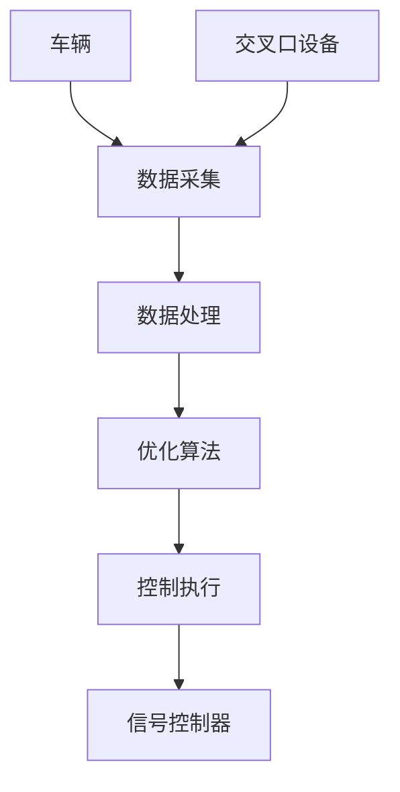
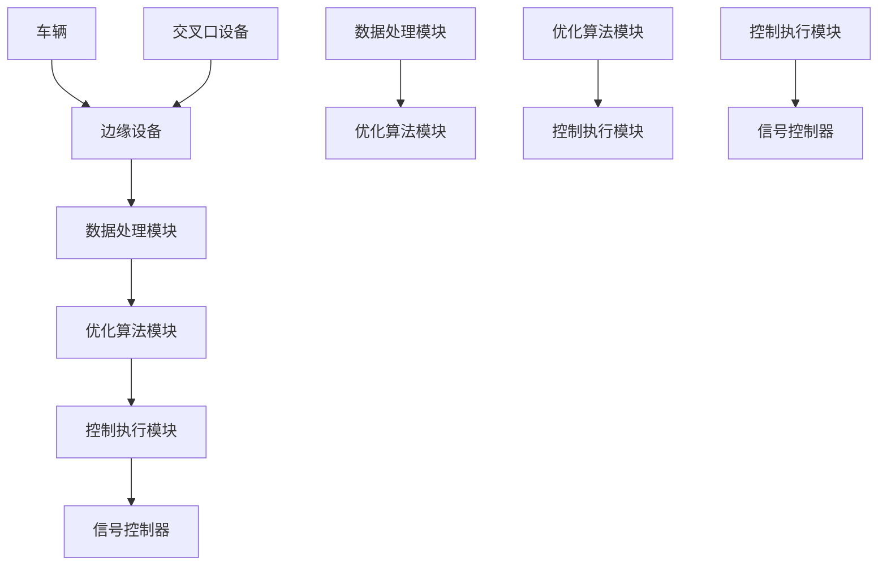
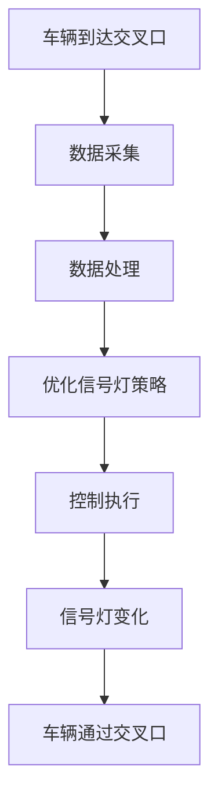
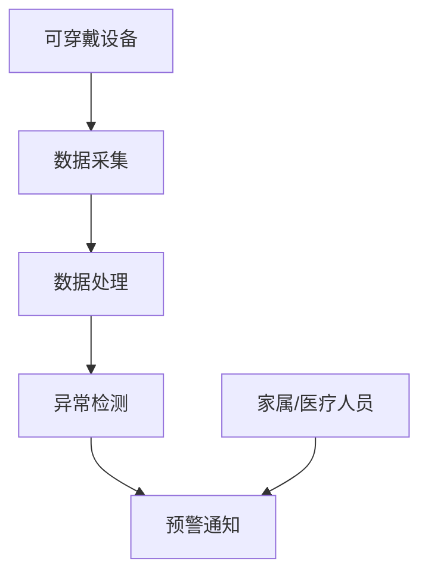
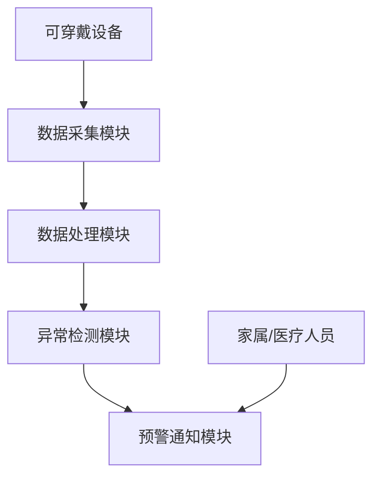
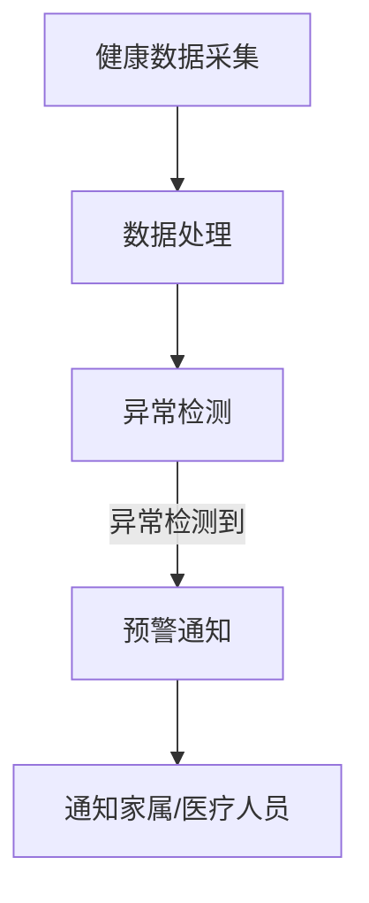

                 

## 第5章 应用案例

### 5.1 智能交通系统

智能交通系统（ITS）是边缘计算的一个典型应用场景。通过在道路交叉口和车辆上部署边缘设备，可以实现实时交通监控、信号控制和交通流量优化。以下是一个应用案例：

#### 5.1.1 问题场景

某城市交通繁忙，交通拥堵问题严重。为了提高交通效率和安全性，决定部署边缘计算设备来实时监控交通流量并优化信号灯控制。

#### 5.1.2 项目介绍

该项目旨在通过边缘计算设备收集交通数据，使用数学优化算法进行实时交通流量分析，并优化信号灯控制策略。

#### 5.1.3 系统功能设计

- **数据采集**：部署在道路交叉口和车辆上的边缘设备实时收集交通流量、车辆速度、车辆密度等信息。
- **数据处理**：边缘设备使用本地计算资源对收集到的数据进行预处理和初步分析。
- **优化算法**：使用数学优化算法（如遗传算法或粒子群优化）对信号灯控制策略进行优化，以减少交通拥堵和排放。
- **控制执行**：优化后的信号灯控制策略通过边缘设备发送给交通信号控制器，实现实时调整。

#### 5.1.4 系统架构设计

系统架构设计如下：

#### 5.1.5 系统接口设计和系统交互

系统接口设计如下：

系统交互序列图如下：

### 5.2 健康监测系统

健康监测系统是另一个典型的边缘计算应用场景。通过在个人设备上部署边缘计算，可以实现实时健康监测和预警。

#### 5.2.1 问题场景

某养老社区希望为其居民提供实时健康监测服务，以便及时发现异常情况并采取相应措施。

#### 5.2.2 项目介绍

该项目旨在通过边缘计算设备实时监测老年人的健康数据，使用数学优化算法进行异常检测，并在检测到异常时及时通知家属和医疗人员。

#### 5.2.3 系统功能设计

- **数据采集**：部署在老年人身上的可穿戴设备实时收集心率、血压、血糖等健康数据。
- **数据处理**：边缘设备对采集到的健康数据进行预处理和初步分析。
- **异常检测**：使用数学优化算法对健康数据进行实时异常检测。
- **预警通知**：在检测到异常情况时，通过短信、电话等方式通知家属和医疗人员。

#### 5.2.4 系统架构设计

系统架构设计如下：

#### 5.2.5 系统接口设计和系统交互

系统接口设计如下：

系统交互序列图如下：

## 第6章 最佳实践与注意事项

### 6.1 最佳实践

在部署边缘计算应用时，以下是一些最佳实践：

- **需求分析**：明确应用需求，确保边缘计算系统能够满足需求。
- **设备选型**：选择适合应用场景的边缘设备，考虑计算能力、存储容量、网络连接等指标。
- **算法优化**：根据应用需求选择合适的数学优化算法，并进行优化和调整。
- **数据安全**：确保数据在传输和存储过程中的安全性，采取加密和访问控制等措施。

### 6.2 注意事项

在设计和部署边缘计算应用时，需要注意以下事项：

- **资源限制**：边缘设备通常具有有限的计算资源和带宽，需要优化算法和数据处理策略以适应这些限制。
- **实时性要求**：边缘计算应用通常具有实时性要求，需要确保数据处理和分析的速度。
- **数据隐私**：边缘设备可能收集和处理敏感数据，需要采取适当措施保护数据隐私。
- **系统可靠性**：边缘设备可能会面临环境变化和故障风险，需要设计高可靠性的系统架构。

## 第7章 拓展阅读

- **边缘计算**：
  - 《边缘计算：理论与实践》（作者：陈国良）
  - 《边缘计算：从概念到实践》（作者：马克·威尔逊）
  
- **数学优化**：
  - 《运筹学导论》（作者：乔治·D·莱文）
  - 《非线性优化》（作者：安德斯·罗森布拉特）

- **边缘计算与数学优化结合**：
  - 《边缘智能：理论、方法与应用》（作者：张晓玲）
  - 《边缘计算优化算法：设计与实现》（作者：克里斯托弗·诺兰）

## 第8章 总结

边缘计算是一种分布式计算范式，旨在将数据处理、分析和服务从中心化的云基础设施迁移到网络的边缘。数学优化在边缘计算中扮演了关键角色，通过优化资源调度、数据压缩和异常检测等，提高边缘计算系统的性能和效率。本文介绍了边缘计算和数学优化的基本概念，通过应用案例展示了数学优化在边缘计算中的实际应用，并提供了最佳实践和注意事项。希望本文能够帮助读者更好地理解和应用数学优化于边缘计算领域。

---

### 附录

- **作者信息**：作者：AI天才研究院/AI Genius Institute & 禅与计算机程序设计艺术 /Zen And The Art of Computer Programming
- **版权声明**：本文版权归AI天才研究院/AI Genius Institute所有，未经许可，不得转载或用于商业用途。
- **联系方式**：如需进一步交流或获取更多资料，请联系AI天才研究院/AI Genius Institute。联系方式：[联系方式]

