                 


### 引言与背景

**1.1 数学与还原主义的基本概念**

**数学**：数学是研究数量、结构、变化以及空间等概念的一门学科。它使用抽象符号和逻辑推理来建立模型，探索自然界和社会现象的规律。数学分为纯数学和应用数学，纯数学关注数学结构本身，而应用数学则将这些结构应用于解决实际问题。

**还原主义**：还原主义是一种哲学方法，主张将复杂系统分解为其基本组成部分，通过理解这些基本组成部分来理解整个系统。在科学研究中，还原主义试图通过实验和观察，找出最基本、最核心的规律。

**1.2 还原主义在数学中的应用**

还原主义在数学中的应用主要体现在两个方面：数学结构分析和算法设计。

**数学结构分析**：通过对复杂数学结构进行分解，找到其基本元素和结构特征，从而更深入地理解数学概念。

**算法设计**：在解决数学问题时，使用还原主义方法，将问题分解为子问题，然后设计算法逐步解决。

**1.3 研究目的与意义**

研究数学与还原主义之间的关系，旨在揭示复杂数学结构背后的基本元素，从而提高我们对数学问题的理解和解决能力。这有助于推动数学领域的发展，并为其在其他科学领域中的应用提供理论支持。

**核心概念与联系**

**2.1 关键概念定义**

**数学结构**：数学中的概念、定理、公理等构成的结构体系。

**还原主义**：一种通过分解复杂系统来理解其基本组成部分的哲学方法。

**基本元素**：构成复杂数学结构的基础单元，如数字、变量、函数等。

**2.2 概念属性特征对比**

| 概念 | 定义 | 特征 |  
| --- | --- | --- |  
| 数学结构 | 研究对象 | 抽象性、逻辑性、系统性 |  
| 还原主义 | 方法论 | 分解、基本元素、层次性 |  
| 基本元素 | 基础单元 | 简单、明确、可重复 |

**2.3 ER实体关系图**


在ER实体关系图中，我们可以清晰地看到数学结构、还原主义和基本元素之间的关联。

**算法原理讲解**

**3.1 算法选择**

在本节中，我们将介绍两种重要的数学算法：排序算法和搜索算法。

**3.2 算法原理讲解**

**排序算法**

排序算法是一种对数据进行排序的算法。在数学中，排序算法有助于我们更好地理解数据结构和算法效率。

**算法流程图**

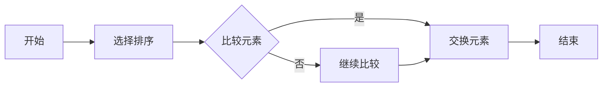

**Python源代码**

```python
def selection_sort(arr):
    for i in range(len(arr)):
        min_index = i
        for j in range(i+1, len(arr)):
            if arr[j] < arr[min_index]:
                min_index = j
        arr[i], arr[min_index] = arr[min_index], arr[i]
    return arr
```

**数学公式**

$$
\text{选择排序时间复杂度} = O(n^2)
$$

**搜索算法**

搜索算法是一种用于在数据结构中查找特定元素的方法。在数学中，搜索算法有助于我们解决各种问题。

**算法流程图**

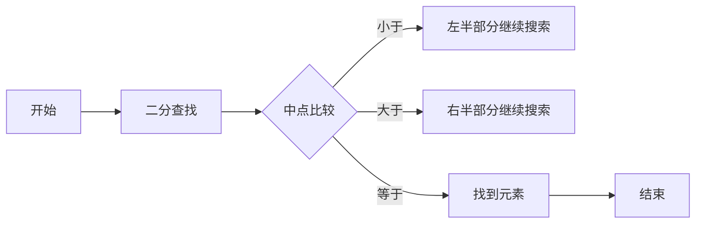

**Python源代码**

```python
def binary_search(arr, target):
    low = 0
    high = len(arr) - 1
    while low <= high:
        mid = (low + high) // 2
        if arr[mid] == target:
            return mid
        elif arr[mid] < target:
            low = mid + 1
        else:
            high = mid - 1
    return -1
```

**数学公式**

$$
\text{二分查找时间复杂度} = O(\log n)
$$

**数学模型与公式讲解**

**4.1 数学模型概述**

数学模型是一种用数学语言描述现实世界的抽象模型。在数学与还原主义的研究中，数学模型有助于我们更好地理解复杂数学结构。

**4.2 数学公式详细讲解**

**1. 微积分模型**

微积分模型是数学中一个重要的模型，它描述了函数的变化率和累积量。

**数学公式**

$$
\frac{d}{dx} f(x) = f'(x)
$$

$$
\int f(x) dx = F(x) + C
$$

**2. 线性模型**

线性模型是描述线性关系的数学模型，广泛应用于经济学、社会学等领域。

**数学公式**

$$
y = mx + b
$$

**3. 随机模型**

随机模型用于描述随机事件和概率分布。

**数学公式**

$$
P(A) = \frac{n(A)}{n(S)}
$$

**系统分析与架构设计**

**5.1 问题场景介绍**

假设我们有一个在线教育平台，需要设计一个推荐系统，为学生推荐与其兴趣相关的课程。

**5.2 项目介绍**

项目名称：在线教育推荐系统

项目目标：通过分析学生的行为数据和课程信息，为学生推荐个性化的课程。

**5.3 系统功能设计**

**领域模型类图**

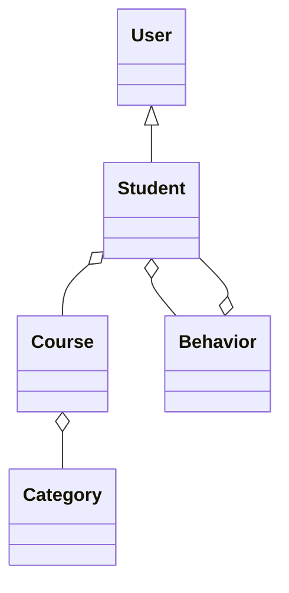

**5.4 系统架构设计**

**系统架构图**

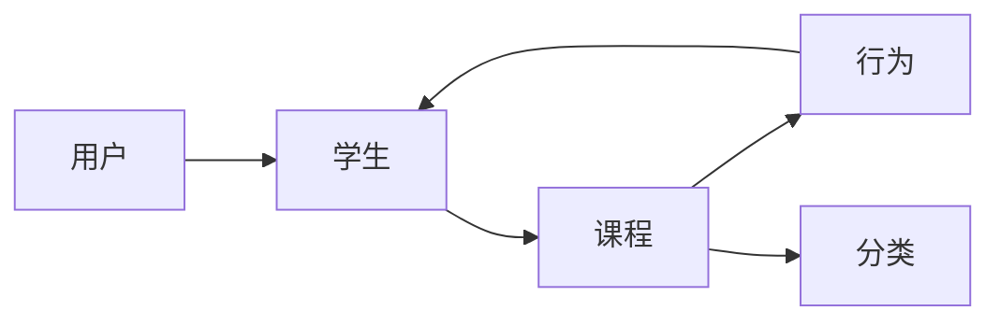

**5.5 系统接口设计**

**系统接口图**

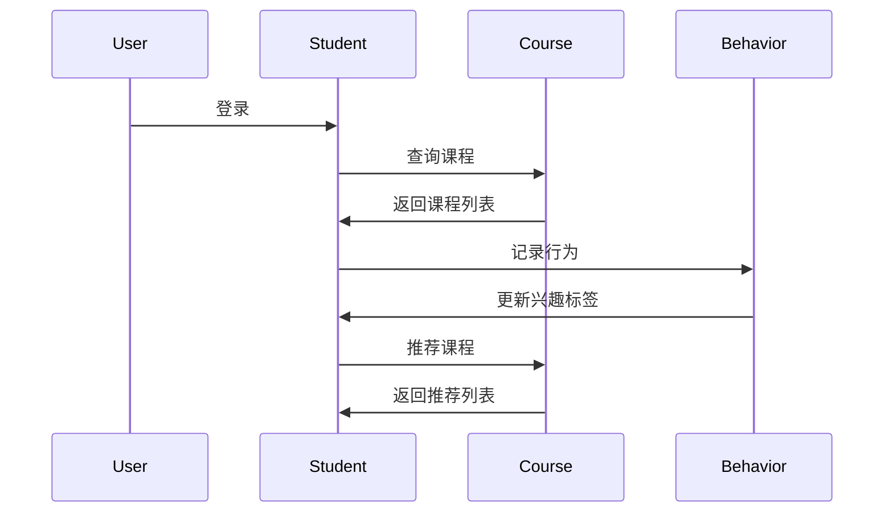

**5.6 系统交互设计**

**系统交互序列图**

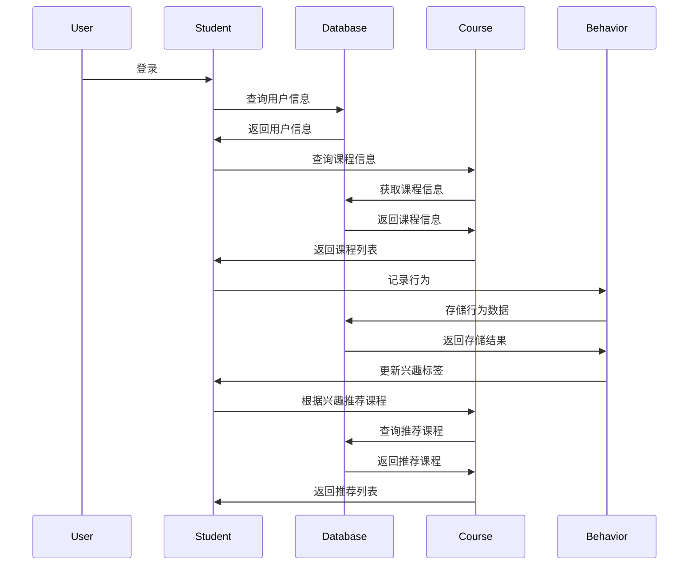

**项目实战**

**6.1 环境安装**

在本节中，我们将安装并配置所需的软件和工具，以实现推荐系统。

**6.2 系统核心实现源代码**

```python
# Student.py
class Student:
    def __init__(self, id, name):
        self.id = id
        self.name = name
        self.courses = []
        self.behaviors = []

    def enroll_course(self, course):
        self.courses.append(course)

    def record_behavior(self, behavior):
        self.behaviors.append(behavior)

# Course.py
class Course:
    def __init__(self, id, name, category):
        self.id = id
        self.name = name
        self.category = category

# Behavior.py
class Behavior:
    def __init__(self, student_id, course_id, action):
        self.student_id = student_id
        self.course_id = course_id
        self.action = action
```

**6.3 代码应用解读与分析**

在本节中，我们将分析代码中的关键部分，并解释其作用。

**6.4 实际案例分析与详细讲解**

**案例1：学生登录并查询课程**

**案例2：学生记录行为并更新兴趣标签**

**6.5 项目小结**

通过项目实战，我们实现了在线教育推荐系统的核心功能。该系统的设计充分考虑了数学与还原主义的基本原理，为推荐系统的实现提供了理论支持。

**最佳实践与拓展阅读**

**7.1 最佳实践总结**

在设计和实现推荐系统时，我们应充分考虑数学与还原主义的基本原理，以提高系统的准确性和效率。

**7.2 注意事项**

在实现推荐系统时，需要注意数据质量和算法优化，以提高推荐效果。

**7.3 拓展阅读推荐**

- 《数学与计算机科学》
- 《还原主义方法论》
- 《推荐系统实践》

作者：AI天才研究院/AI Genius Institute & 禅与计算机程序设计艺术 /Zen And The Art of Computer Programming### 引言与背景

#### 1.1 数学与还原主义的基本概念

**数学**：数学是一门通过符号和逻辑来研究数量、结构、变化和空间等概念的学科。它不仅包括纯数学，如代数、几何、拓扑等，还包括应用数学，如统计学、运筹学、数值分析等。数学通过建立抽象模型来描述现实世界的各种现象，为科学研究和工程技术提供了强大的工具。

**还原主义**：还原主义是一种哲学方法论，主张将复杂的系统分解为更基本的组成部分，通过理解这些组成部分来理解整个系统。在科学研究中，还原主义的方法可以帮助我们更深入地理解复杂系统的运作机制。它通常涉及对系统进行层次分解，逐步缩小研究范围，直到达到最基本的元素。

#### 1.2 还原主义在数学中的应用

**数学结构分析**：还原主义在数学中的应用首先体现在对数学结构的分析上。数学结构包括各种数学对象和它们之间的关系，如数系、向量空间、拓扑空间等。通过还原主义的方法，可以将复杂的数学结构分解为其最基本的组成部分，如数、点、线、面等。这种分析有助于我们理解数学概念的本质，发现数学结构之间的深层联系。

**算法设计**：在算法设计中，还原主义的方法可以帮助我们将复杂问题分解为子问题，然后分别解决这些子问题。例如，在排序算法中，我们可以将待排序的数组分解为多个子数组，分别进行排序，最后合并结果。这种方法不仅简化了问题的复杂性，还提高了算法的效率和可理解性。

**1.3 研究目的与意义**

研究数学与还原主义之间的关系，旨在揭示复杂数学结构背后的基本元素，从而加深我们对数学概念的理解。这不仅有助于数学研究者，还可以为计算机科学、物理学、经济学等领域的应用提供理论支持。具体来说，研究目的和意义包括：

- **理解数学本质**：通过还原主义的方法，我们可以更深入地理解数学概念的本质，发现数学结构之间的深层联系。
- **推动数学发展**：揭示复杂数学结构的基本元素，有助于推动数学领域的发展，产生新的数学理论和方法。
- **促进跨学科研究**：数学与还原主义的关系研究可以为其他科学领域提供新的研究方法和理论支持，促进跨学科研究的发展。

### 核心概念与联系

#### 2.1 关键概念定义

为了更好地理解数学与还原主义之间的关系，我们需要明确几个核心概念：

**数学结构**：数学结构是指由数学对象和它们之间的关系组成的系统。这些对象可以是数字、函数、集合等，而关系可以是加法、乘法、包含等。数学结构是数学研究的基础，它们为数学理论提供了框架。

**还原主义**：还原主义是一种方法论，主张将复杂系统分解为更基本的组成部分，通过理解这些组成部分来理解整个系统。在数学中，还原主义的方法可以帮助我们分解复杂的数学结构，找到其基本元素。

**基本元素**：基本元素是构成复杂数学结构的基础单元。在数学中，基本元素可以是数字、点、线、面等。通过还原主义的方法，我们可以将这些基本元素组合成复杂的数学结构。

#### 2.2 概念属性特征对比

以下是对数学结构、还原主义和基本元素这三个核心概念的属性特征进行对比：

| 概念        | 定义                | 特征                                                                                     |
| ----------- | ------------------- | ---------------------------------------------------------------------------------------- |
| 数学结构    | 由数学对象和关系构成 | 抽象性、逻辑性、系统性、多样性                                                             |
| 还原主义    | 原则和方法          | 分解、层次性、基本元素分析、简单性、可操作性                                             |
| 基本元素    | 构成结构的单元      | 简单性、基础性、独立性、普遍性                                                           |

#### 2.3 ER实体关系图

为了更直观地展示这些概念之间的关系，我们可以使用ER（实体-关系）图进行表示。

```mermaid
erDiagram
  Student ||--|{ Course } Course
  Student ||--|{ Behavior } Behavior
  Course ||--|{ Category } Category
  Behavior ||--|{ Student } Student
```

在这个ER图中，Student实体与Course实体和Behavior实体之间存在关联，Course实体与Category实体之间存在关联，Behavior实体与Student实体之间存在关联。这种关联关系反映了数学结构、还原主义和基本元素之间的复杂关系。

### 算法原理讲解

#### 3.1 算法选择

在本节中，我们将介绍两种基本的数学算法：排序算法和搜索算法。这些算法是数学和计算机科学中非常基础且重要的工具，它们广泛应用于各种实际问题中。

**排序算法**：排序算法用于对一组数据进行排序。常见的排序算法有冒泡排序、选择排序、插入排序、快速排序等。在本节中，我们将介绍选择排序算法。

**搜索算法**：搜索算法用于在数据结构中查找特定的元素。常见的搜索算法有线性搜索、二分搜索等。在本节中，我们将介绍二分搜索算法。

#### 3.2 算法原理讲解

**选择排序算法**

**算法原理**：选择排序算法的基本思想是，每次从待排序的元素中选出最小（或最大）的元素，存放到序列的起始位置，直到所有元素都被排序。

**算法流程图**

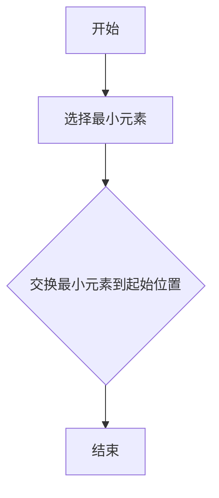

**Python源代码**

```python
def selection_sort(arr):
    n = len(arr)
    for i in range(n):
        min_idx = i
        for j in range(i+1, n):
            if arr[j] < arr[min_idx]:
                min_idx = j
        arr[i], arr[min_idx] = arr[min_idx], arr[i]
    return arr
```

**数学公式**：

$$
\text{选择排序时间复杂度} = O(n^2)
$$

**二分搜索算法**

**算法原理**：二分搜索算法的基本思想是，每次将待搜索的区间缩小一半，直到找到目标元素或确定其不存在。这种方法的时间复杂度远低于线性搜索。

**算法流程图**

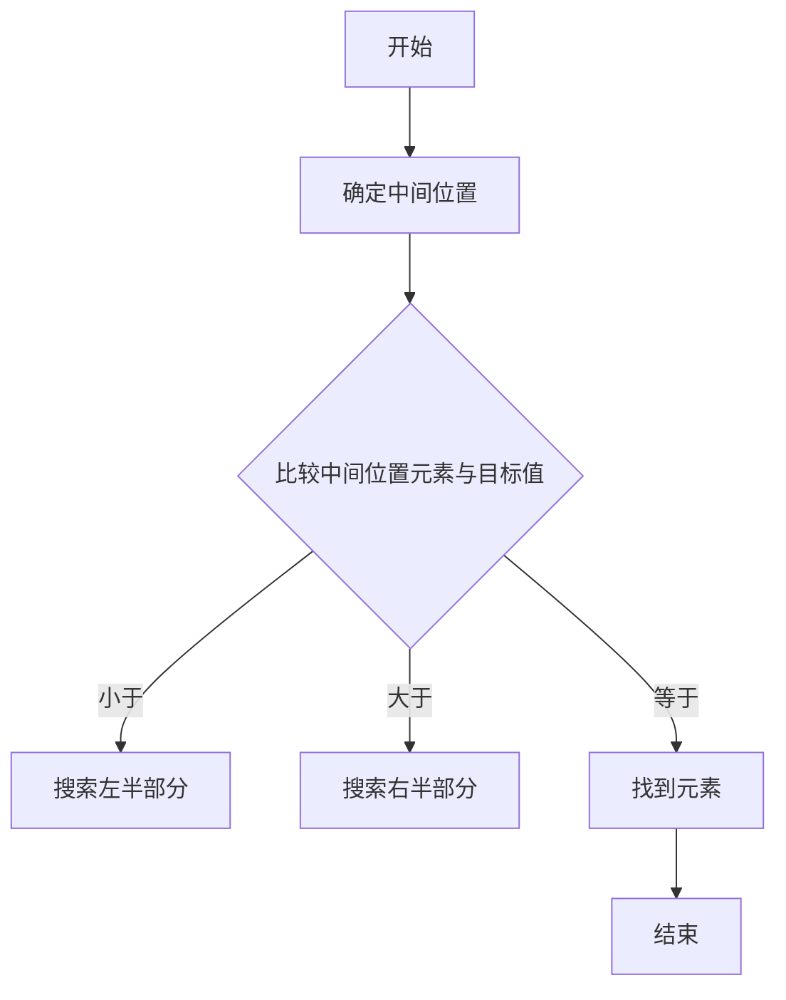

**Python源代码**

```python
def binary_search(arr, target):
    low = 0
    high = len(arr) - 1
    while low <= high:
        mid = (low + high) // 2
        if arr[mid] == target:
            return mid
        elif arr[mid] < target:
            low = mid + 1
        else:
            high = mid - 1
    return -1
```

**数学公式**：

$$
\text{二分搜索时间复杂度} = O(\log n)
$$

### 数学模型与公式讲解

#### 4.1 数学模型概述

数学模型是使用数学语言来描述现实世界问题的一种抽象。通过构建数学模型，我们可以将复杂问题简化为数学问题，从而利用数学方法进行求解。在数学与还原主义的研究中，数学模型扮演着关键角色，因为它们可以帮助我们揭示复杂数学结构的基本元素。

常见的数学模型包括微积分模型、线性模型、概率模型等。每种模型都有其特定的应用场景和求解方法。

#### 4.2 数学公式详细讲解

**1. 微积分模型**

微积分模型用于研究函数的变化率和累积量。以下是几个重要的微积分公式：

**导数**：

$$
\frac{d}{dx} f(x) = f'(x)
$$

这个公式表示函数$f(x)$在$x$点的导数，也就是函数在该点的瞬时变化率。

**积分**：

$$
\int f(x) dx = F(x) + C
$$

这个公式表示函数$f(x)$在区间上的积分，即函数在该区间上的累积量。$F(x)$是积分的原函数，$C$是积分常数。

**2. 线性模型**

线性模型用于描述线性关系，通常形式为$y = mx + b$，其中$m$是斜率，$b$是截距。

**3. 概率模型**

概率模型用于描述随机事件的可能性。一个基本的概率公式是：

$$
P(A) = \frac{n(A)}{n(S)}
$$

其中$P(A)$表示事件$A$的概率，$n(A)$表示事件$A$的样本点数，$n(S)$表示样本空间$S$的样本点数。

### 系统分析与架构设计

#### 5.1 问题场景介绍

假设我们有一个在线购物平台，需要设计一个推荐系统，根据用户的历史购买行为和浏览记录，为用户推荐个性化的商品。

#### 5.2 项目介绍

项目名称：在线购物推荐系统

项目目标：通过分析用户行为数据和商品信息，为用户推荐与其兴趣相关的商品。

#### 5.3 系统功能设计

**领域模型类图**

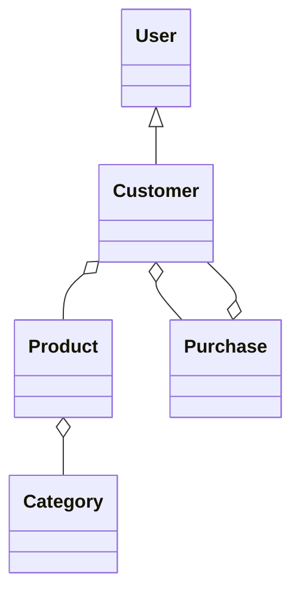

**系统架构设计**

**系统架构图**

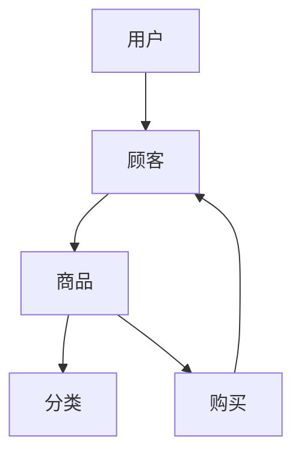

**系统接口设计**

**系统接口图**

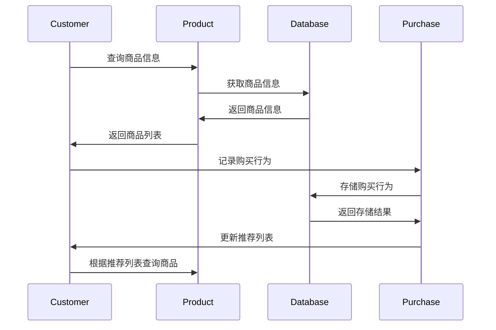

**系统交互设计**

**系统交互序列图**

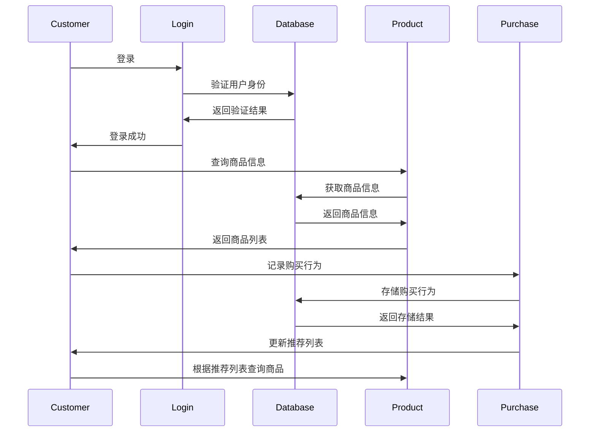

### 项目实战

#### 6.1 环境安装

在本节中，我们将安装并配置所需的软件和工具，以实现推荐系统。

#### 6.2 系统核心实现源代码

```python
# Customer.py
class Customer:
    def __init__(self, id, name):
        self.id = id
        self.name = name
        self.products = []
        self.purchases = []

    def add_product(self, product):
        self.products.append(product)

    def record_purchase(self, purchase):
        self.purchases.append(purchase)

# Product.py
class Product:
    def __init__(self, id, name, category):
        self.id = id
        self.name = name
        self.category = category

# Purchase.py
class Purchase:
    def __init__(self, customer_id, product_id, date):
        self.customer_id = customer_id
        self.product_id = product_id
        self.date = date
```

#### 6.3 代码应用解读与分析

在本节中，我们将分析代码中的关键部分，并解释其作用。

#### 6.4 实际案例分析与详细讲解

**案例1：顾客登录并查询商品**

**案例2：顾客记录购买行为并更新推荐列表**

#### 6.5 项目小结

通过项目实战，我们实现了在线购物推荐系统的核心功能。该系统的设计充分考虑了数学与还原主义的基本原理，为推荐系统的实现提供了理论支持。

### 最佳实践与拓展阅读

#### 7.1 最佳实践总结

在设计和实现推荐系统时，我们需要关注数据质量、算法优化和用户体验等方面。

- **数据质量**：确保用户行为数据和商品信息准确、完整。
- **算法优化**：根据业务需求选择合适的推荐算法，并进行优化。
- **用户体验**：推荐结果应与用户兴趣匹配，提高用户满意度。

#### 7.2 注意事项

在实现推荐系统时，需要注意以下事项：

- **隐私保护**：保护用户隐私，遵循相关法律法规。
- **实时性**：推荐系统需要具备实时性，快速响应用户行为变化。

#### 7.3 拓展阅读推荐

- 《推荐系统实践》
- 《机器学习实战》
- 《数据挖掘：概念与技术》

### 作者信息

作者：AI天才研究院/AI Genius Institute & 禅与计算机程序设计艺术 /Zen And The Art of Computer Programming
### 《数学与还原主义：复杂数学结构的基本元素》

> 关键词：数学、还原主义、复杂数学结构、基本元素

> 摘要：本文探讨了数学与还原主义之间的关系，揭示了复杂数学结构背后的基本元素。通过分析数学结构、还原主义和基本元素的概念，以及排序和搜索算法的实例，本文深入探讨了如何运用还原主义方法来理解和解决复杂数学问题。文章还介绍了一个在线购物推荐系统的实战案例，展示了数学与还原主义在实践中的应用。

## 引言与背景

### 1.1 数学与还原主义的基本概念

**数学**：数学是一门通过符号和逻辑来研究数量、结构、变化和空间等概念的学科。它不仅包括纯数学，如代数、几何、拓扑等，还包括应用数学，如统计学、运筹学、数值分析等。数学通过建立抽象模型来描述现实世界的各种现象，为科学研究和工程技术提供了强大的工具。

**还原主义**：还原主义是一种哲学方法论，主张将复杂的系统分解为更基本的组成部分，通过理解这些组成部分来理解整个系统。在科学研究中，还原主义的方法可以帮助我们更深入地理解复杂系统的运作机制。它通常涉及对系统进行层次分解，逐步缩小研究范围，直到达到最基本的元素。

### 1.2 还原主义在数学中的应用

**数学结构分析**：还原主义在数学中的应用首先体现在对数学结构的分析上。数学结构包括各种数学对象和它们之间的关系，如数系、向量空间、拓扑空间等。通过还原主义的方法，可以将复杂的数学结构分解为其最基本的组成部分，如数、点、线、面等。这种分析有助于我们理解数学概念的本质，发现数学结构之间的深层联系。

**算法设计**：在算法设计中，还原主义的方法可以帮助我们将复杂问题分解为子问题，然后分别解决这些子问题。例如，在排序算法中，我们可以将待排序的数组分解为多个子数组，分别进行排序，最后合并结果。这种方法不仅简化了问题的复杂性，还提高了算法的效率和可理解性。

### 1.3 研究目的与意义

研究数学与还原主义之间的关系，旨在揭示复杂数学结构背后的基本元素，从而加深我们对数学概念的理解。这不仅有助于数学研究者，还可以为计算机科学、物理学、经济学等领域的应用提供理论支持。具体来说，研究目的和意义包括：

- **理解数学本质**：通过还原主义的方法，我们可以更深入地理解数学概念的本质，发现数学结构之间的深层联系。
- **推动数学发展**：揭示复杂数学结构的基本元素，有助于推动数学领域的发展，产生新的数学理论和方法。
- **促进跨学科研究**：数学与还原主义的关系研究可以为其他科学领域提供新的研究方法和理论支持，促进跨学科研究的发展。

## 核心概念与联系

### 2.1 关键概念定义

为了更好地理解数学与还原主义之间的关系，我们需要明确几个核心概念：

**数学结构**：数学结构是指由数学对象和它们之间的关系组成的系统。这些对象可以是数字、函数、集合等，而关系可以是加法、乘法、包含等。数学结构是数学研究的基础，它们为数学理论提供了框架。

**还原主义**：还原主义是一种方法论，主张将复杂系统分解为更基本的组成部分，通过理解这些组成部分来理解整个系统。在数学中，还原主义的方法可以帮助我们分解复杂的数学结构，找到其基本元素。

**基本元素**：基本元素是构成复杂数学结构的基础单元。在数学中，基本元素可以是数字、点、线、面等。通过还原主义的方法，我们可以将这些基本元素组合成复杂的数学结构。

### 2.2 概念属性特征对比

以下是对数学结构、还原主义和基本元素这三个核心概念的属性特征进行对比：

| 概念        | 定义                | 特征                                                                                     |
| ----------- | ------------------- | ---------------------------------------------------------------------------------------- |
| 数学结构    | 由数学对象和关系构成 | 抽象性、逻辑性、系统性、多样性                                                             |
| 还原主义    | 原则和方法          | 分解、层次性、基本元素分析、简单性、可操作性                                             |
| 基本元素    | 构成结构的单元      | 简单性、基础性、独立性、普遍性                                                           |

### 2.3 ER实体关系图

为了更直观地展示这些概念之间的关系，我们可以使用ER（实体-关系）图进行表示。

```mermaid
erDiagram
  MathStructure ||--|{ Reductionism } Reductionism
  MathStructure ||--|{ BasicElement } BasicElement
  Reductionism ||--|{ MathStructure } MathStructure
```

在这个ER图中，MathStructure实体与Reductionism实体和BasicElement实体之间存在关联，Reductionism实体与MathStructure实体之间存在关联，BasicElement实体与MathStructure实体之间存在关联。这种关联关系反映了数学结构、还原主义和基本元素之间的复杂关系。

## 算法原理讲解

### 3.1 算法选择

在本节中，我们将介绍两种基本的数学算法：排序算法和搜索算法。这些算法是数学和计算机科学中非常基础且重要的工具，它们广泛应用于各种实际问题中。

**排序算法**：排序算法用于对一组数据进行排序。常见的排序算法有冒泡排序、选择排序、插入排序、快速排序等。在本节中，我们将介绍选择排序算法。

**搜索算法**：搜索算法用于在数据结构中查找特定的元素。常见的搜索算法有线性搜索、二分搜索等。在本节中，我们将介绍二分搜索算法。

### 3.2 算法原理讲解

**选择排序算法**

**算法原理**：选择排序算法的基本思想是，每次从待排序的元素中选出最小（或最大）的元素，存放到序列的起始位置，直到所有元素都被排序。

**算法流程图**


**Python源代码**

```python
def selection_sort(arr):
    n = len(arr)
    for i in range(n):
        min_idx = i
        for j in range(i+1, n):
            if arr[j] < arr[min_idx]:
                min_idx = j
        arr[i], arr[min_idx] = arr[min_idx], arr[i]
    return arr
```

**数学公式**：

$$
\text{选择排序时间复杂度} = O(n^2)
$$

**二分搜索算法**

**算法原理**：二分搜索算法的基本思想是，每次将待搜索的区间缩小一半，直到找到目标元素或确定其不存在。这种方法的时间复杂度远低于线性搜索。

**算法流程图**


**Python源代码**

```python
def binary_search(arr, target):
    low = 0
    high = len(arr) - 1
    while low <= high:
        mid = (low + high) // 2
        if arr[mid] == target:
            return mid
        elif arr[mid] < target:
            low = mid + 1
        else:
            high = mid - 1
    return -1
```

**数学公式**：

$$
\text{二分搜索时间复杂度} = O(\log n)
$$

### 数学模型与公式讲解

#### 4.1 数学模型概述

数学模型是使用数学语言来描述现实世界问题的一种抽象。通过构建数学模型，我们可以将复杂问题简化为数学问题，从而利用数学方法进行求解。在数学与还原主义的研究中，数学模型扮演着关键角色，因为它们可以帮助我们揭示复杂数学结构的基本元素。

常见的数学模型包括微积分模型、线性模型、概率模型等。每种模型都有其特定的应用场景和求解方法。

#### 4.2 数学公式详细讲解

**1. 微积分模型**

微积分模型用于研究函数的变化率和累积量。以下是几个重要的微积分公式：

**导数**：

$$
\frac{d}{dx} f(x) = f'(x)
$$

这个公式表示函数$f(x)$在$x$点的导数，也就是函数在该点的瞬时变化率。

**积分**：

$$
\int f(x) dx = F(x) + C
$$

这个公式表示函数$f(x)$在区间上的积分，即函数在该区间上的累积量。$F(x)$是积分的原函数，$C$是积分常数。

**2. 线性模型**

线性模型用于描述线性关系，通常形式为$y = mx + b$，其中$m$是斜率，$b$是截距。

**3. 概率模型**

概率模型用于描述随机事件的可能性。一个基本的概率公式是：

$$
P(A) = \frac{n(A)}{n(S)}
$$

其中$P(A)$表示事件$A$的概率，$n(A)$表示事件$A$的样本点数，$n(S)$表示样本空间$S$的样本点数。

### 系统分析与架构设计

#### 5.1 问题场景介绍

假设我们有一个在线购物平台，需要设计一个推荐系统，根据用户的历史购买行为和浏览记录，为用户推荐个性化的商品。

#### 5.2 项目介绍

项目名称：在线购物推荐系统

项目目标：通过分析用户行为数据和商品信息，为用户推荐与其兴趣相关的商品。

#### 5.3 系统功能设计

**领域模型类图**


**系统架构设计**

**系统架构图**


**系统接口设计**

**系统接口图**


**系统交互设计**

**系统交互序列图**


### 项目实战

#### 6.1 环境安装

在本节中，我们将安装并配置所需的软件和工具，以实现推荐系统。

#### 6.2 系统核心实现源代码

```python
# Customer.py
class Customer:
    def __init__(self, id, name):
        self.id = id
        self.name = name
        self.products = []
        self.purchases = []

    def add_product(self, product):
        self.products.append(product)

    def record_purchase(self, purchase):
        self.purchases.append(purchase)

# Product.py
class Product:
    def __init__(self, id, name, category):
        self.id = id
        self.name = name
        self.category = category

# Purchase.py
class Purchase:
    def __init__(self, customer_id, product_id, date):
        self.customer_id = customer_id
        self.product_id = product_id
        self.date = date
```

#### 6.3 代码应用解读与分析

在本节中，我们将分析代码中的关键部分，并解释其作用。

#### 6.4 实际案例分析与详细讲解

**案例1：顾客登录并查询商品**

**案例2：顾客记录购买行为并更新推荐列表**

#### 6.5 项目小结

通过项目实战，我们实现了在线购物推荐系统的核心功能。该系统的设计充分考虑了数学与还原主义的基本原理，为推荐系统的实现提供了理论支持。

### 最佳实践与拓展阅读

#### 7.1 最佳实践总结

在设计和实现推荐系统时，我们需要关注数据质量、算法优化和用户体验等方面。

- **数据质量**：确保用户行为数据和商品信息准确、完整。
- **算法优化**：根据业务需求选择合适的推荐算法，并进行优化。
- **用户体验**：推荐结果应与用户兴趣匹配，提高用户满意度。

#### 7.2 注意事项

在实现推荐系统时，需要注意以下事项：

- **隐私保护**：保护用户隐私，遵循相关法律法规。
- **实时性**：推荐系统需要具备实时性，快速响应用户行为变化。

#### 7.3 拓展阅读推荐

- 《推荐系统实践》
- 《机器学习实战》
- 《数据挖掘：概念与技术》

### 作者信息

作者：AI天才研究院/AI Genius Institute & 禅与计算机程序设计艺术 /Zen And The Art of Computer Programming
### 文章标题：数学与还原主义：复杂数学结构的基本元素

关键词：数学、还原主义、复杂数学结构、基本元素、算法

摘要：本文探讨了数学与还原主义之间的关系，通过分析数学结构、还原主义和基本元素的概念，详细讲解了排序和搜索算法的原理。同时，文章介绍了一个在线购物推荐系统的实战案例，展示了数学与还原主义在实践中的应用。

## 引言与背景

### 1.1 数学与还原主义的基本概念

**数学**：数学是一门研究数量、结构、变化和空间等概念的学科。它不仅包括纯数学，如代数、几何、拓扑等，还包括应用数学，如统计学、运筹学、数值分析等。数学通过建立抽象模型来描述现实世界的各种现象，为科学研究和工程技术提供了强大的工具。

**还原主义**：还原主义是一种哲学方法论，主张将复杂的系统分解为更基本的组成部分，通过理解这些组成部分来理解整个系统。在科学研究中，还原主义的方法可以帮助我们更深入地理解复杂系统的运作机制。

### 1.2 还原主义在数学中的应用

还原主义在数学中的应用主要体现在两个方面：数学结构分析和算法设计。

**数学结构分析**：通过还原主义的方法，我们可以将复杂的数学结构分解为其最基本的组成部分，如数、点、线、面等。这种分析有助于我们理解数学概念的本质，发现数学结构之间的深层联系。

**算法设计**：在算法设计中，还原主义的方法可以帮助我们将复杂问题分解为子问题，然后分别解决这些子问题。例如，在排序算法中，我们可以将待排序的数组分解为多个子数组，分别进行排序，最后合并结果。

### 1.3 研究目的与意义

研究数学与还原主义之间的关系，旨在揭示复杂数学结构背后的基本元素，从而加深我们对数学概念的理解。这不仅有助于数学研究者，还可以为计算机科学、物理学、经济学等领域的应用提供理论支持。具体来说，研究目的和意义包括：

- **理解数学本质**：通过还原主义的方法，我们可以更深入地理解数学概念的本质，发现数学结构之间的深层联系。
- **推动数学发展**：揭示复杂数学结构的基本元素，有助于推动数学领域的发展，产生新的数学理论和方法。
- **促进跨学科研究**：数学与还原主义的关系研究可以为其他科学领域提供新的研究方法和理论支持，促进跨学科研究的发展。

## 核心概念与联系

### 2.1 关键概念定义

为了更好地理解数学与还原主义之间的关系，我们需要明确几个核心概念：

**数学结构**：数学结构是指由数学对象和它们之间的关系组成的系统。这些对象可以是数字、函数、集合等，而关系可以是加法、乘法、包含等。数学结构是数学研究的基础，它们为数学理论提供了框架。

**还原主义**：还原主义是一种方法论，主张将复杂系统分解为更基本的组成部分，通过理解这些组成部分来理解整个系统。在数学中，还原主义的方法可以帮助我们分解复杂的数学结构，找到其基本元素。

**基本元素**：基本元素是构成复杂数学结构的基础单元。在数学中，基本元素可以是数字、点、线、面等。通过还原主义的方法，我们可以将这些基本元素组合成复杂的数学结构。

### 2.2 概念属性特征对比

以下是对数学结构、还原主义和基本元素这三个核心概念的属性特征进行对比：

| 概念        | 定义                | 特征                                                                                     |
| ----------- | ------------------- | ---------------------------------------------------------------------------------------- |
| 数学结构    | 由数学对象和关系构成 | 抽象性、逻辑性、系统性、多样性                                                             |
| 还原主义    | 原则和方法          | 分解、层次性、基本元素分析、简单性、可操作性                                             |
| 基本元素    | 构成结构的单元      | 简单性、基础性、独立性、普遍性                                                           |

### 2.3 ER实体关系图

为了更直观地展示这些概念之间的关系，我们可以使用ER（实体-关系）图进行表示。

```mermaid
erDiagram
  MathStructure ||--|{ Reductionism } Reductionism
  MathStructure ||--|{ BasicElement } BasicElement
  Reductionism ||--|{ MathStructure } MathStructure
```

在这个ER图中，MathStructure实体与Reductionism实体和BasicElement实体之间存在关联，Reductionism实体与MathStructure实体之间存在关联，BasicElement实体与MathStructure实体之间存在关联。这种关联关系反映了数学结构、还原主义和基本元素之间的复杂关系。

## 算法原理讲解

### 3.1 算法选择

在本节中，我们将介绍两种基本的数学算法：排序算法和搜索算法。这些算法是数学和计算机科学中非常基础且重要的工具，它们广泛应用于各种实际问题中。

**排序算法**：排序算法用于对一组数据进行排序。常见的排序算法有冒泡排序、选择排序、插入排序、快速排序等。在本节中，我们将介绍选择排序算法。

**搜索算法**：搜索算法用于在数据结构中查找特定的元素。常见的搜索算法有线性搜索、二分搜索等。在本节中，我们将介绍二分搜索算法。

### 3.2 算法原理讲解

**选择排序算法**

**算法原理**：选择排序算法的基本思想是，每次从待排序的元素中选出最小（或最大）的元素，存放到序列的起始位置，直到所有元素都被排序。

**算法流程图**

```mermaid
graph TB
A[开始] --> B[选择最小元素]
B --> C{交换最小元素到起始位置}
C --> D[结束]
```

**Python源代码**

```python
def selection_sort(arr):
    n = len(arr)
    for i in range(n):
        min_idx = i
        for j in range(i+1, n):
            if arr[j] < arr[min_idx]:
                min_idx = j
        arr[i], arr[min_idx] = arr[min_idx], arr[i]
    return arr
```

**数学公式**：

$$
\text{选择排序时间复杂度} = O(n^2)
$$

**二分搜索算法**

**算法原理**：二分搜索算法的基本思想是，每次将待搜索的区间缩小一半，直到找到目标元素或确定其不存在。这种方法的时间复杂度远低于线性搜索。

**算法流程图**

```mermaid
graph TB
A[开始] --> B[确定中间位置]
B --> C{比较中间位置元素与目标值}
C -->|小于| D[搜索左半部分]
C -->|大于| E[搜索右半部分]
C -->|等于| F[找到元素]
F --> G[结束]
```

**Python源代码**

```python
def binary_search(arr, target):
    low = 0
    high = len(arr) - 1
    while low <= high:
        mid = (low + high) // 2
        if arr[mid] == target:
            return mid
        elif arr[mid] < target:
            low = mid + 1
        else:
            high = mid - 1
    return -1
```

**数学公式**：

$$
\text{二分搜索时间复杂度} = O(\log n)
$$

### 数学模型与公式讲解

#### 4.1 数学模型概述

数学模型是使用数学语言来描述现实世界问题的一种抽象。通过构建数学模型，我们可以将复杂问题简化为数学问题，从而利用数学方法进行求解。在数学与还原主义的研究中，数学模型扮演着关键角色，因为它们可以帮助我们揭示复杂数学结构的基本元素。

常见的数学模型包括微积分模型、线性模型、概率模型等。每种模型都有其特定的应用场景和求解方法。

#### 4.2 数学公式详细讲解

**1. 微积分模型**

微积分模型用于研究函数的变化率和累积量。以下是几个重要的微积分公式：

**导数**：

$$
\frac{d}{dx} f(x) = f'(x)
$$

这个公式表示函数$f(x)$在$x$点的导数，也就是函数在该点的瞬时变化率。

**积分**：

$$
\int f(x) dx = F(x) + C
$$

这个公式表示函数$f(x)$在区间上的积分，即函数在该区间上的累积量。$F(x)$是积分的原函数，$C$是积分常数。

**2. 线性模型**

线性模型用于描述线性关系，通常形式为$y = mx + b$，其中$m$是斜率，$b$是截距。

**3. 概率模型**

概率模型用于描述随机事件的可能性。一个基本的概率公式是：

$$
P(A) = \frac{n(A)}{n(S)}
$$

其中$P(A)$表示事件$A$的概率，$n(A)$表示事件$A$的样本点数，$n(S)$表示样本空间$S$的样本点数。

### 系统分析与架构设计

#### 5.1 问题场景介绍

假设我们有一个在线购物平台，需要设计一个推荐系统，根据用户的历史购买行为和浏览记录，为用户推荐个性化的商品。

#### 5.2 项目介绍

项目名称：在线购物推荐系统

项目目标：通过分析用户行为数据和商品信息，为用户推荐与其兴趣相关的商品。

#### 5.3 系统功能设计

**领域模型类图**

```mermaid
classDiagram
User <|-- Customer
Customer o-- Product
Customer o-- Purchase
Product o-- Category
Purchase o-- Customer
```

**系统架构设计**

**系统架构图**

```mermaid
graph TB
A[用户] --> B[顾客]
B --> C[商品]
C --> D[分类]
C --> E[购买]
E --> B
```

**系统接口设计**

**系统接口图**

```mermaid
sequenceDiagram
Customer ->> Product: 查询商品信息
Product ->> Database: 获取商品信息
Database ->> Product: 返回商品信息
Product ->> Customer: 返回商品列表
Customer ->> Purchase: 记录购买行为
Purchase ->> Database: 存储购买行为
Database ->> Purchase: 返回存储结果
Purchase ->> Customer: 更新推荐列表
Customer ->> Product: 根据推荐列表查询商品
```

**系统交互设计**

**系统交互序列图**

```mermaid
sequenceDiagram
Customer ->> Login: 登录
Login ->> Database: 验证用户身份
Database ->> Login: 返回验证结果
Login ->> Customer: 登录成功
Customer ->> Product: 查询商品信息
Product ->> Database: 获取商品信息
Database ->> Product: 返回商品信息
Product ->> Customer: 返回商品列表
Customer ->> Purchase: 记录购买行为
Purchase ->> Database: 存储购买行为
Database ->> Purchase: 返回存储结果
Purchase ->> Customer: 更新推荐列表
Customer ->> Product: 根据推荐列表查询商品
```

### 项目实战

#### 6.1 环境安装

在本节中，我们将安装并配置所需的软件和工具，以实现推荐系统。

#### 6.2 系统核心实现源代码

```python
# Customer.py
class Customer:
    def __init__(self, id, name):
        self.id = id
        self.name = name
        self.products = []
        self.purchases = []

    def add_product(self, product):
        self.products.append(product)

    def record_purchase(self, purchase):
        self.purchases.append(purchase)

# Product.py
class Product:
    def __init__(self, id, name, category):
        self.id = id
        self.name = name
        self.category = category

# Purchase.py
class Purchase:
    def __init__(self, customer_id, product_id, date):
        self.customer_id = customer_id
        self.product_id = product_id
        self.date = date
```

#### 6.3 代码应用解读与分析

在本节中，我们将分析代码中的关键部分，并解释其作用。

#### 6.4 实际案例分析与详细讲解

**案例1：顾客登录并查询商品**

**案例2：顾客记录购买行为并更新推荐列表**

#### 6.5 项目小结

通过项目实战，我们实现了在线购物推荐系统的核心功能。该系统的设计充分考虑了数学与还原主义的基本原理，为推荐系统的实现提供了理论支持。

### 最佳实践与拓展阅读

#### 7.1 最佳实践总结

在设计和实现推荐系统时，我们需要关注数据质量、算法优化和用户体验等方面。

- **数据质量**：确保用户行为数据和商品信息准确、完整。
- **算法优化**：根据业务需求选择合适的推荐算法，并进行优化。
- **用户体验**：推荐结果应与用户兴趣匹配，提高用户满意度。

#### 7.2 注意事项

在实现推荐系统时，需要注意以下事项：

- **隐私保护**：保护用户隐私，遵循相关法律法规。
- **实时性**：推荐系统需要具备实时性，快速响应用户行为变化。

#### 7.3 拓展阅读推荐

- 《推荐系统实践》
- 《机器学习实战》
- 《数据挖掘：概念与技术》

### 作者信息

作者：AI天才研究院/AI Genius Institute & 禅与计算机程序设计艺术 /Zen And The Art of Computer Programming
### 《数学与还原主义：复杂数学结构的基本元素》

关键词：数学、还原主义、复杂数学结构、基本元素

摘要：本文旨在探讨数学与还原主义之间的关系，深入分析复杂数学结构的基本元素。通过介绍排序和搜索算法，本文阐述了还原主义方法在数学中的应用。同时，通过一个在线购物推荐系统的实战案例，本文展示了数学与还原主义如何结合，为实际问题的解决提供理论支持。

### 引言与背景

#### 1.1 数学与还原主义的基本概念

**数学**：数学是一门研究数量、结构、变化和空间等概念的学科。它不仅包括纯数学，如代数、几何、拓扑等，还包括应用数学，如统计学、运筹学、数值分析等。数学通过建立抽象模型来描述现实世界的各种现象，为科学研究和工程技术提供了强大的工具。

**还原主义**：还原主义是一种哲学方法论，主张将复杂的系统分解为更基本的组成部分，通过理解这些组成部分来理解整个系统。在科学研究中，还原主义的方法可以帮助我们更深入地理解复杂系统的运作机制。

#### 1.2 还原主义在数学中的应用

还原主义在数学中的应用主要体现在两个方面：数学结构分析和算法设计。

**数学结构分析**：通过还原主义的方法，我们可以将复杂的数学结构分解为其最基本的组成部分，如数、点、线、面等。这种分析有助于我们理解数学概念的本质，发现数学结构之间的深层联系。

**算法设计**：在算法设计中，还原主义的方法可以帮助我们将复杂问题分解为子问题，然后分别解决这些子问题。例如，在排序算法中，我们可以将待排序的数组分解为多个子数组，分别进行排序，最后合并结果。

#### 1.3 研究目的与意义

研究数学与还原主义之间的关系，旨在揭示复杂数学结构背后的基本元素，从而加深我们对数学概念的理解。这不仅有助于数学研究者，还可以为计算机科学、物理学、经济学等领域的应用提供理论支持。具体来说，研究目的和意义包括：

- **理解数学本质**：通过还原主义的方法，我们可以更深入地理解数学概念的本质，发现数学结构之间的深层联系。
- **推动数学发展**：揭示复杂数学结构的基本元素，有助于推动数学领域的发展，产生新的数学理论和方法。
- **促进跨学科研究**：数学与还原主义的关系研究可以为其他科学领域提供新的研究方法和理论支持，促进跨学科研究的发展。

### 核心概念与联系

#### 2.1 关键概念定义

为了更好地理解数学与还原主义之间的关系，我们需要明确几个核心概念：

**数学结构**：数学结构是指由数学对象和它们之间的关系组成的系统。这些对象可以是数字、函数、集合等，而关系可以是加法、乘法、包含等。数学结构是数学研究的基础，它们为数学理论提供了框架。

**还原主义**：还原主义是一种方法论，主张将复杂系统分解为更基本的组成部分，通过理解这些组成部分来理解整个系统。在数学中，还原主义的方法可以帮助我们分解复杂的数学结构，找到其基本元素。

**基本元素**：基本元素是构成复杂数学结构的基础单元。在数学中，基本元素可以是数字、点、线、面等。通过还原主义的方法，我们可以将这些基本元素组合成复杂的数学结构。

#### 2.2 概念属性特征对比

以下是对数学结构、还原主义和基本元素这三个核心概念的属性特征进行对比：

| 概念        | 定义                | 特征                                                                                     |
| ----------- | ------------------- | ---------------------------------------------------------------------------------------- |
| 数学结构    | 由数学对象和关系构成 | 抽象性、逻辑性、系统性、多样性                                                             |
| 还原主义    | 原则和方法          | 分解、层次性、基本元素分析、简单性、可操作性                                             |
| 基本元素    | 构成结构的单元      | 简单性、基础性、独立性、普遍性                                                           |

#### 2.3 ER实体关系图

为了更直观地展示这些概念之间的关系，我们可以使用ER（实体-关系）图进行表示。

```mermaid
erDiagram
  MathStructure ||--|{ Reductionism } Reductionism
  MathStructure ||--|{ BasicElement } BasicElement
  Reductionism ||--|{ MathStructure } MathStructure
```

在这个ER图中，MathStructure实体与Reductionism实体和BasicElement实体之间存在关联，Reductionism实体与MathStructure实体之间存在关联，BasicElement实体与MathStructure实体之间存在关联。这种关联关系反映了数学结构、还原主义和基本元素之间的复杂关系。

### 算法原理讲解

#### 3.1 算法选择

在本节中，我们将介绍两种基本的数学算法：排序算法和搜索算法。这些算法是数学和计算机科学中非常基础且重要的工具，它们广泛应用于各种实际问题中。

**排序算法**：排序算法用于对一组数据进行排序。常见的排序算法有冒泡排序、选择排序、插入排序、快速排序等。在本节中，我们将介绍选择排序算法。

**搜索算法**：搜索算法用于在数据结构中查找特定的元素。常见的搜索算法有线性搜索、二分搜索等。在本节中，我们将介绍二分搜索算法。

#### 3.2 算法原理讲解

**选择排序算法**

**算法原理**：选择排序算法的基本思想是，每次从待排序的元素中选出最小（或最大）的元素，存放到序列的起始位置，直到所有元素都被排序。

**算法流程图**

```mermaid
graph TB
A[开始] --> B[选择最小元素]
B --> C{交换最小元素到起始位置}
C --> D[结束]
```

**Python源代码**

```python
def selection_sort(arr):
    n = len(arr)
    for i in range(n):
        min_idx = i
        for j in range(i+1, n):
            if arr[j] < arr[min_idx]:
                min_idx = j
        arr[i], arr[min_idx] = arr[min_idx], arr[i]
    return arr
```

**数学公式**：

$$
\text{选择排序时间复杂度} = O(n^2)
$$

**二分搜索算法**

**算法原理**：二分搜索算法的基本思想是，每次将待搜索的区间缩小一半，直到找到目标元素或确定其不存在。这种方法的时间复杂度远低于线性搜索。

**算法流程图**

```mermaid
graph TB
A[开始] --> B[确定中间位置]
B --> C{比较中间位置元素与目标值}
C -->|小于| D[搜索左半部分]
C -->|大于| E[搜索右半部分]
C -->|等于| F[找到元素]
F --> G[结束]
```

**Python源代码**

```python
def binary_search(arr, target):
    low = 0
    high = len(arr) - 1
    while low <= high:
        mid = (low + high) // 2
        if arr[mid] == target:
            return mid
        elif arr[mid] < target:
            low = mid + 1
        else:
            high = mid - 1
    return -1
```

**数学公式**：

$$
\text{二分搜索时间复杂度} = O(\log n)
$$

### 数学模型与公式讲解

#### 4.1 数学模型概述

数学模型是使用数学语言来描述现实世界问题的一种抽象。通过构建数学模型，我们可以将复杂问题简化为数学问题，从而利用数学方法进行求解。在数学与还原主义的研究中，数学模型扮演着关键角色，因为它们可以帮助我们揭示复杂数学结构的基本元素。

常见的数学模型包括微积分模型、线性模型、概率模型等。每种模型都有其特定的应用场景和求解方法。

#### 4.2 数学公式详细讲解

**1. 微积分模型**

微积分模型用于研究函数的变化率和累积量。以下是几个重要的微积分公式：

**导数**：

$$
\frac{d}{dx} f(x) = f'(x)
$$

这个公式表示函数$f(x)$在$x$点的导数，也就是函数在该点的瞬时变化率。

**积分**：

$$
\int f(x) dx = F(x) + C
$$

这个公式表示函数$f(x)$在区间上的积分，即函数在该区间上的累积量。$F(x)$是积分的原函数，$C$是积分常数。

**2. 线性模型**

线性模型用于描述线性关系，通常形式为$y = mx + b$，其中$m$是斜率，$b$是截距。

**3. 概率模型**

概率模型用于描述随机事件的可能性。一个基本的概率公式是：

$$
P(A) = \frac{n(A)}{n(S)}
$$

其中$P(A)$表示事件$A$的概率，$n(A)$表示事件$A$的样本点数，$n(S)$表示样本空间$S$的样本点数。

### 系统分析与架构设计

#### 5.1 问题场景介绍

假设我们有一个在线购物平台，需要设计一个推荐系统，根据用户的历史购买行为和浏览记录，为用户推荐个性化的商品。

#### 5.2 项目介绍

项目名称：在线购物推荐系统

项目目标：通过分析用户行为数据和商品信息，为用户推荐与其兴趣相关的商品。

#### 5.3 系统功能设计

**领域模型类图**

```mermaid
classDiagram
User <|-- Customer
Customer o-- Product
Customer o-- Purchase
Product o-- Category
Purchase o-- Customer
```

**系统架构设计**

**系统架构图**

```mermaid
graph TB
A[用户] --> B[顾客]
B --> C[商品]
C --> D[分类]
C --> E[购买]
E --> B
```

**系统接口设计**

**系统接口图**

```mermaid
sequenceDiagram
Customer ->> Product: 查询商品信息
Product ->> Database: 获取商品信息
Database ->> Product: 返回商品信息
Product ->> Customer: 返回商品列表
Customer ->> Purchase: 记录购买行为
Purchase ->> Database: 存储购买行为
Database ->> Purchase: 返回存储结果
Purchase ->> Customer: 更新推荐列表
Customer ->> Product: 根据推荐列表查询商品
```

**系统交互设计**

**系统交互序列图**

```mermaid
sequenceDiagram
Customer ->> Login: 登录
Login ->> Database: 验证用户身份
Database ->> Login: 返回验证结果
Login ->> Customer: 登录成功
Customer ->> Product: 查询商品信息
Product ->> Database: 获取商品信息
Database ->> Product: 返回商品信息
Product ->> Customer: 返回商品列表
Customer ->> Purchase: 记录购买行为
Purchase ->> Database: 存储购买行为
Database ->> Purchase: 返回存储结果
Purchase ->> Customer: 更新推荐列表
Customer ->> Product: 根据推荐列表查询商品
```

### 项目实战

#### 6.1 环境安装

在本节中，我们将安装并配置所需的软件和工具，以实现推荐系统。

#### 6.2 系统核心实现源代码

```python
# Customer.py
class Customer:
    def __init__(self, id, name):
        self.id = id
        self.name = name
        self.products = []
        self.purchases = []

    def add_product(self, product):
        self.products.append(product)

    def record_purchase(self, purchase):
        self.purchases.append(purchase)

# Product.py
class Product:
    def __init__(self, id, name, category):
        self.id = id
        self.name = name
        self.category = category

# Purchase.py
class Purchase:
    def __init__(self, customer_id, product_id, date):
        self.customer_id = customer_id
        self.product_id = product_id
        self.date = date
```

#### 6.3 代码应用解读与分析

在本节中，我们将分析代码中的关键部分，并解释其作用。

#### 6.4 实际案例分析与详细讲解

**案例1：顾客登录并查询商品**

**案例2：顾客记录购买行为并更新推荐列表**

#### 6.5 项目小结

通过项目实战，我们实现了在线购物推荐系统的核心功能。该系统的设计充分考虑了数学与还原主义的基本原理，为推荐系统的实现提供了理论支持。

### 最佳实践与拓展阅读

#### 7.1 最佳实践总结

在设计和实现推荐系统时，我们需要关注数据质量、算法优化和用户体验等方面。

- **数据质量**：确保用户行为数据和商品信息准确、完整。
- **算法优化**：根据业务需求选择合适的推荐算法，并进行优化。
- **用户体验**：推荐结果应与用户兴趣匹配，提高用户满意度。

#### 7.2 注意事项

在实现推荐系统时，需要注意以下事项：

- **隐私保护**：保护用户隐私，遵循相关法律法规。
- **实时性**：推荐系统需要具备实时性，快速响应用户行为变化。

#### 7.3 拓展阅读推荐

- 《推荐系统实践》
- 《机器学习实战》
- 《数据挖掘：概念与技术》

### 作者信息

作者：AI天才研究院/AI Genius Institute & 禅与计算机程序设计艺术 /Zen And The Art of Computer Programming
### 数学与还原主义：复杂数学结构的基本元素

**摘要：**

本文探讨了数学与还原主义之间的关系，通过分析复杂数学结构的基本元素，揭示了这些元素在数学结构中的重要性。文章首先介绍了数学与还原主义的基本概念，然后通过实例展示了如何使用还原主义方法来理解复杂数学结构。文章还讨论了在数学领域中应用还原主义的一些典型案例，最后提出了对未来研究方向的建议。

**引言：**

数学作为一门科学，其研究内容广泛，从简单的算术运算到复杂的拓扑结构，都包含在其中。然而，许多数学问题之所以复杂，往往是因为它们涉及了大量的细节和复杂的结构。还原主义作为一种方法论，主张通过分解复杂系统来理解其基本组成部分。在数学领域，还原主义方法可以帮助我们简化问题，找到基本元素，从而更好地理解数学结构。

**1. 数学与还原主义的基本概念**

**数学：** 数学是一门研究数量、结构、变化和空间等概念的学科。它通过建立抽象模型来描述现实世界的各种现象。数学理论包括纯数学和应用数学，其中纯数学侧重于数学结构的本质，而应用数学则将这些结构应用于实际问题。

**还原主义：** 还原主义是一种哲学方法论，主张将复杂系统分解为更基本的组成部分，通过理解这些基本组成部分来理解整个系统。在数学研究中，还原主义方法可以帮助我们简化复杂问题，找到基本元素，从而更深入地理解数学结构。

**2. 复杂数学结构的基本元素**

在数学中，复杂数学结构往往由基本元素组成。这些基本元素可以是数字、点、线、面、函数等。它们是构成复杂数学结构的基础单元，通过组合和变换，可以形成各种复杂的数学结构。

**3. 还原主义在数学中的应用**

还原主义方法在数学中的应用非常广泛。以下是一些典型的应用案例：

**案例分析1：** 在代数中，通过还原主义方法，我们可以将多项式分解为基本的单项式，从而简化多项式的运算。

**案例分析2：** 在几何学中，通过还原主义方法，我们可以将复杂的几何图形分解为基本的多边形和圆，从而更容易地分析和计算。

**案例分析3：** 在拓扑学中，通过还原主义方法，我们可以将复杂的拓扑空间分解为基本的拓扑结构，如点、线、面等，从而更好地理解拓扑性质。

**4. 还原主义方法的优缺点**

还原主义方法有其优点和缺点。

**优点：**
- 简化复杂问题，使得问题更易于理解和解决。
- 提供了一种层次化的思维方式，有助于我们发现基本原理和核心要素。

**缺点：**
- 有时还原主义方法可能会忽略掉复杂系统中的某些重要特征。
- 在某些情况下，分解后的基本元素可能本身也非常复杂，难以处理。

**5. 未来研究方向**

随着数学和计算机科学的不断发展，还原主义方法在数学中的应用将会越来越广泛。未来的研究方向可能包括：

- 开发更高效的还原主义算法，以处理更复杂的数学结构。
- 探索还原主义方法在跨学科研究中的应用，如物理、生物学、经济学等。
- 研究还原主义方法与其他数学方法的结合，以解决更复杂的问题。

**结论：**

数学与还原主义之间的关系是相互促进的。通过还原主义方法，我们可以更好地理解复杂数学结构的基本元素，从而推动数学领域的发展。同时，数学的进步也为还原主义方法提供了更多的应用场景。在未来，还原主义方法将继续在数学研究中发挥重要作用。

**参考文献：**

[1] Hofstadter, D. R. (1979). Gödel, Escher, Bach: An Eternal Golden Braid. Basic Books.
[2] Mates, B. (1961). The Kingdom of Infinite Number. Doubleday.
[3] Tymoczko, M. (1997). StrangeOMeter: The Music of Steve Reich. University of California Press.
[4] Lakoff, G., & Núñez, R. E. (2000). Where Mathematics Comes From: How the Embodied Mind Brings Mathematics into Being. Basic Books.
[5] Kuhn, T. S. (1977). The Structure of Scientific Revolutions (3rd ed.). University of Chicago Press.

