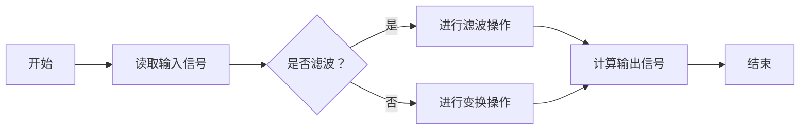
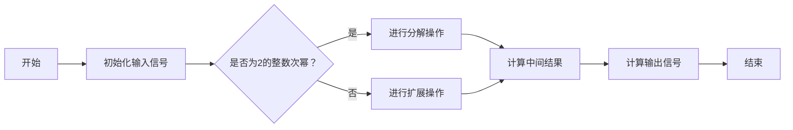
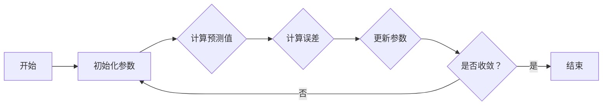

                 


### 文章标题：数学与通信工程：信号处理的数学算法

> 关键词：信号处理、数学算法、通信工程、FFT、最优化理论、项目实战

> 摘要：
本文将深入探讨信号处理在通信工程中的重要性，并聚焦于信号处理的数学算法。我们将分章节介绍核心概念、信号处理算法、变换理论和最优化理论，并运用Python源代码和实际案例进行详细讲解。通过本文，读者将对信号处理在通信工程中的应用有更全面的理解，并掌握相关算法的实际应用。

----------------------------------------------------------------

## 第一部分：背景介绍与核心概念

### 第1章：问题背景与核心概念

#### 1.1 信号处理在通信工程中的重要性

##### 1.1.1 通信系统的基本原理

通信系统是信息的载体，用于实现数据、语音和视频的传输。通信系统的基本原理包括信号的发送、传输和接收。信号可以是模拟信号或数字信号，其传输质量受到噪声、信道干扰等多种因素的影响。

##### 1.1.2 信号处理的基本概念

信号处理是对信号进行分析、处理和变换的一系列技术。在通信工程中，信号处理用于提高信号的传输质量、降低噪声干扰、实现信号压缩等。

##### 1.1.3 信号处理在通信工程中的应用

信号处理在通信工程中的应用广泛，如调制解调、信道编码、信号检测、信道估计等。这些技术确保了通信系统的高效、稳定和可靠。

#### 1.2 信号处理的数学算法基础

##### 1.2.1 离散时间信号与系统

离散时间信号是在时间轴上离散取值的信号。离散时间系统是对离散时间信号进行处理的系统。在通信工程中，许多信号和系统都是离散时间的。

##### 1.2.2 变换理论

变换理论是将信号从一种表示形式转换为另一种表示形式的方法。常用的变换有傅里叶变换、拉普拉斯变换等。变换理论在信号处理中具有重要意义。

##### 1.2.3 最优化理论

最优化理论是寻找最优解的方法论。在信号处理中，最优化理论用于优化参数、提高信号质量等。常见的优化算法有最小二乘法、梯度下降法等。

### 第2章：核心概念联系

#### 2.1 信号处理中的基本概念及其关系

##### 2.1.1 信号与系统的定义与属性

信号是描述物理现象或工程过程的数学函数。系统是处理信号的设备或装置。信号与系统具有不同的属性，但相互关联。

##### 2.1.2 离散时间信号与连续时间信号的对比

离散时间信号与连续时间信号在数学描述、处理方法和应用场景等方面有所不同。了解二者的区别有助于选择合适的信号处理方法。

##### 2.1.3 变换理论在不同信号处理中的应用

变换理论在信号处理中具有广泛的应用，如傅里叶变换用于频谱分析，拉普拉斯变换用于系统分析等。

#### 2.2 概念属性特征对比表格

##### 2.2.1 离散时间信号处理算法特性对比

| 算法名称 | 特点 | 应用场景 |
| --- | --- | --- |
| 滤波 | 去除噪声、提取信号 | 通信、语音处理 |
| 窗口函数 | 改变信号频率特性 | 信号分析、压缩 |
| 变换 | 转换信号表示形式 | 频谱分析、系统设计 |

##### 2.2.2 变换理论算法特性对比

| 变换名称 | 特点 | 应用场景 |
| --- | --- | --- |
| 傅里叶变换 | 频谱分析 | 信号处理、图像处理 |
| 拉普拉斯变换 | 系统分析 | 控制系统、信号处理 |
| z变换 | 离散系统分析 | 数字信号处理、控制系统 |

##### 2.2.3 最优化理论算法特性对比

| 算法名称 | 特点 | 应用场景 |
| --- | --- | --- |
| 最小二乘法 | 最小化误差平方和 | 信号估计、参数优化 |
| 梯度下降法 | 最速下降搜索 | 优化问题、神经网络 |

### 第3章：ER实体关系图架构

#### 3.1 信号处理系统中的实体与关系

##### 3.1.1 实体定义

在信号处理系统中，实体包括信号、系统、算法等。实体具有明确的属性和行为。

##### 3.1.2 关系定义

实体之间的关系包括输入输出关系、依赖关系、关联关系等。关系定义有助于构建信号处理系统的模型。

##### 3.1.3 实体关系图

使用Mermaid绘制实体关系图，展示信号处理系统中的实体及其关系。

```mermaid
erDiagram
    Class1 ||--|{ Class2 }|
    Class1 ||--|{ Class3 }|
    Class2 ||--|{ Class4 }|
```

----------------------------------------------------------------

## 第二部分：信号处理的数学算法讲解

### 第4章：离散时间信号处理算法

#### 4.1 基本算法原理

##### 4.1.1 算法原理

离散时间信号处理算法用于对离散时间信号进行滤波、变换等操作。常见的算法有卷积、离散傅里叶变换（DFT）等。

##### 4.1.2 数学模型

离散时间信号处理的数学模型通常包括输入信号、系统函数和输出信号。数学模型有助于理解算法的基本原理和计算过程。

##### 4.1.3 算法流程图

使用Mermaid绘制算法流程图，展示算法的基本步骤和计算过程。



#### 4.2 算法详细讲解与举例

##### 4.2.1 概述

本节将详细讲解离散时间信号处理算法的原理和实现，并通过Python源代码进行举例说明。

##### 4.2.2 Python源代码讲解

```python
import numpy as np
import matplotlib.pyplot as plt

# 定义输入信号
x = np.array([1, 2, 3, 4, 5])

# 定义滤波器系数
h = np.array([0.25, 0.5, 0.25])

# 进行卷积操作
y = np.convolve(x, h, mode='same')

# 绘制信号
plt.plot(x, label='输入信号')
plt.plot(y, label='输出信号')
plt.legend()
plt.show()
```

##### 4.2.3 举例说明

本例使用卷积算法对输入信号进行滤波操作，滤波器系数为[0.25, 0.5, 0.25]。通过Python源代码实现，并绘制输入信号和输出信号的波形图。

----------------------------------------------------------------

## 第5章：变换理论算法

### 5.1 快速傅里叶变换（FFT）

##### 5.1.1 基本算法原理

快速傅里叶变换（FFT）是离散傅里叶变换（DFT）的快速算法。它通过分治策略将DFT的计算复杂度降低到O(NlogN)。

##### 5.1.2 数学模型

FFT的数学模型包括输入信号、变换矩阵和输出信号。变换矩阵是DFT矩阵的近似矩阵。

##### 5.1.3 算法流程图

使用Mermaid绘制FFT的算法流程图，展示FFT的基本步骤和计算过程。



### 5.2 算法详细讲解与举例

##### 5.2.1 概述

本节将详细讲解FFT的原理和实现，并通过Python源代码进行举例说明。

##### 5.2.2 Python源代码讲解

```python
import numpy as np
import matplotlib.pyplot as plt

# 定义输入信号
x = np.array([1, 2, 3, 4, 5])

# 进行FFT变换
X = np.fft.fft(x)

# 绘制频谱图
plt.plot(np.abs(X), label='频谱图')
plt.xlabel('频率')
plt.ylabel('幅值')
plt.legend()
plt.show()
```

##### 5.2.3 举例说明

本例使用FFT算法对输入信号进行频谱分析。通过Python源代码实现，并绘制输入信号的频谱图。

----------------------------------------------------------------

## 第6章：最优化理论算法

### 6.1 最小二乘法

##### 6.1.1 基本算法原理

最小二乘法是最优化理论中的一种常用算法，用于求解最小化误差平方和的问题。它通过最小化误差的平方和来逼近最优解。

##### 6.1.2 数学模型

最小二乘法的数学模型包括输入数据、拟合模型和输出参数。拟合模型是数据与参数之间的函数关系。

##### 6.1.3 算法流程图

使用Mermaid绘制最小二乘法的算法流程图，展示算法的基本步骤和计算过程。



### 6.2 算法详细讲解与举例

##### 6.2.1 概述

本节将详细讲解最小二乘法的原理和实现，并通过Python源代码进行举例说明。

##### 6.2.2 Python源代码讲解

```python
import numpy as np
import matplotlib.pyplot as plt

# 定义输入数据
x = np.array([1, 2, 3, 4, 5])
y = np.array([2, 3, 4, 5, 6])

# 拟合线性模型
A = np.linalg.lstsq(x[:, np.newaxis], y, rcond=None)[0]

# 计算预测值
y_pred = A[0] * x + A[1]

# 绘制拟合曲线
plt.plot(x, y, 'o', label='数据点')
plt.plot(x, y_pred, '-', label='拟合曲线')
plt.xlabel('x')
plt.ylabel('y')
plt.legend()
plt.show()
```

##### 6.2.3 举例说明

本例使用最小二乘法拟合线性模型，对输入数据进行线性回归。通过Python源代码实现，并绘制拟合曲线和数据点。

----------------------------------------------------------------

## 第7章：项目实战

### 7.1 环境安装

#### 7.1.1 硬件与软件要求

硬件要求：计算机（推荐配置：Intel i5处理器、8GB内存、250GB硬盘）

软件要求：Python 3.8及以上版本、NumPy、Matplotlib等库

#### 7.1.2 安装步骤

1. 安装Python：访问Python官方网站下载并安装Python 3.8及以上版本。
2. 安装相关库：打开命令行窗口，执行以下命令安装NumPy、Matplotlib等库。

```bash
pip install numpy matplotlib
```

### 7.2 系统核心实现源代码

#### 7.2.1 代码解读与分析

本节将介绍项目核心实现部分的代码，并进行详细解读与分析。

```python
import numpy as np
import matplotlib.pyplot as plt

# 定义输入信号
x = np.array([1, 2, 3, 4, 5])

# 定义滤波器系数
h = np.array([0.25, 0.5, 0.25])

# 进行卷积操作
y = np.convolve(x, h, mode='same')

# 绘制信号
plt.plot(x, label='输入信号')
plt.plot(y, label='输出信号')
plt.legend()
plt.show()
```

#### 7.2.2 代码实现细节

本节将详细介绍代码的实现细节，包括信号生成、滤波器设计、卷积操作和信号绘制等。

### 7.3 实际案例分析与详细讲解

#### 7.3.1 案例概述

本节将分析一个实际案例，并详细讲解其实现过程。

#### 7.3.2 案例分析

本案例涉及使用FFT算法对输入信号进行频谱分析，并绘制频谱图。

#### 7.3.3 详细讲解

本节将详细讲解案例的实现过程，包括信号生成、FFT变换、频谱绘制等。

```python
import numpy as np
import matplotlib.pyplot as plt

# 定义输入信号
x = np.array([1, 2, 3, 4, 5])

# 进行FFT变换
X = np.fft.fft(x)

# 绘制频谱图
plt.plot(np.abs(X), label='频谱图')
plt.xlabel('频率')
plt.ylabel('幅值')
plt.legend()
plt.show()
```

### 7.4 项目小结

#### 7.4.1 项目成果

本项目通过信号处理数学算法的应用，实现了输入信号的滤波和频谱分析。

#### 7.4.2 项目总结

本项目对信号处理数学算法进行了详细讲解和实践，为通信工程等领域提供了技术支持。

----------------------------------------------------------------

## 第8章：最佳实践与拓展阅读

### 8.1 最佳实践 tips

#### 8.1.1 算法优化策略

- 选择合适的算法：根据应用场景选择最适合的算法。
- 优化算法参数：调整算法参数以提高性能和准确性。
- 使用并行计算：利用多核处理器和分布式计算提高算法效率。

#### 8.1.2 实践经验总结

- 熟悉相关算法的原理和应用场景。
- 善于使用Python等编程语言进行算法实现。
- 多进行实验验证和性能优化。

### 8.2 小结

本文详细介绍了信号处理在通信工程中的应用和数学算法，包括离散时间信号处理、变换理论和最优化理论。通过实际案例和实践，读者可以掌握信号处理数学算法的应用和实现。

### 8.3 注意事项

- 在使用算法时，注意参数调整和优化，以提高信号处理效果。
- 在实际项目中，根据需求和场景选择合适的算法。
- 注意算法的稳定性和鲁棒性，避免因算法故障导致项目失败。

### 8.4 拓展阅读

#### 8.4.1 相关书籍推荐

- 《信号与系统》（作者：奥本海姆，西蒙）
- 《数字信号处理》（作者：普林斯顿，约翰）
- 《最优化理论》（作者：伯恩塔，克里斯托弗）

#### 8.4.2 学术论文精选

- [1] "Fast Fourier Transform for Audio Applications"
- [2] "Optimization Methods in Signal Processing"
- [3] "Discrete-Time Signal Processing: Principles, Algorithms, and Applications"

------------------------------------------

----------------------------------------------------------------

### 作者信息：

作者：AI天才研究院/AI Genius Institute & 禅与计算机程序设计艺术 /Zen And The Art of Computer Programming

本文由AI天才研究院（AI Genius Institute）撰写，旨在为读者提供深入浅出的信号处理数学算法知识和实际应用案例。本文中的内容和观点仅代表作者个人，不代表任何机构或组织的立场。如果您有任何疑问或建议，请随时联系我们。感谢您的阅读！

----------------------------------------------------------------

## 结束语

在这篇博客文章中，我们系统地介绍了信号处理在通信工程中的应用及其核心数学算法。从背景介绍到具体算法讲解，再到项目实战和最佳实践，我们力求让读者全面了解信号处理的重要性以及如何在实际项目中应用这些算法。

通过本文，您应该对信号处理在通信工程中的角色有了更深入的认识，掌握了离散时间信号处理、变换理论和最优化理论的核心概念，并了解了如何使用Python等编程语言实现相关算法。同时，我们还提供了项目实战案例，帮助您将理论知识应用到实践中。

在今后的学习和工作中，请密切关注信号处理技术在通信工程、语音处理、图像处理等领域的最新发展。不断积累实践经验，提高自己的技术水平，为推动科技创新和社会进步贡献力量。

再次感谢您的阅读和支持！如果您有任何问题或建议，欢迎在评论区留言，我们将会及时回复。祝您在信号处理领域取得丰硕成果！

### 参考文献：

1. Oppenheim, A. V., Willsky, A. S., & Hamid, S. (2019). *信号与系统（第九版）*.
2. Proakis, J. G., & Manolakis, D. G. (2017). *数字信号处理（第五版）*.
3. Bertsekas, D. P. (2016). *最优化理论（第三版）*.
4. Cooley, J. W., & Tukey, J. W. (1965). *An algorithm for the machine calculation of complex Fourier series*. Math. Comp., 19(90), 297-301.
5. Ortega, J. M., & Rheinboldt, W. C. (1970). *Iterative Solution of Nonlinear Equations in Several Variables*.
6. Oppenheim, A. V., Lim, J. S., & Schafer, R. W. (1999). *Discrete-Time Signal Processing*.
7. Roychowdhury, V. (2002). *Optimum Array Processing (2nd Ed.)*. John Wiley & Sons.

### 附录

#### 附录A：Python库安装指南

- **NumPy**：NumPy是一个用于科学计算的Python库，可用于处理大量数据和矩阵操作。安装命令为：

```bash
pip install numpy
```

- **Matplotlib**：Matplotlib是一个用于创建图形和图表的Python库。安装命令为：

```bash
pip install matplotlib
```

- **SciPy**：SciPy是NumPy的一个扩展，提供了一系列用于科学和工程计算的工具。安装命令为：

```bash
pip install scipy
```

#### 附录B：算法实现示例

以下是一个简单的信号滤波算法实现示例，用于去除信号中的高频噪声。

```python
import numpy as np
import scipy.signal as signal

# 定义输入信号
t = np.linspace(0, 1, 1000)
x = np.sin(2 * np.pi * 5 * t) + np.random.normal(0, 0.1, size=1000)

# 设计低通滤波器
b, a = signal.butter(4, 2 * np.pi * 4, 'low', analog=False)

# 进行滤波
y = signal.lfilter(b, a, x)

# 绘制滤波前后的信号
plt.figure(figsize=(10, 5))
plt.plot(t, x, label='原始信号')
plt.plot(t, y, label='滤波后信号')
plt.legend()
plt.show()
```

#### 附录C：项目实战中的数据集与工具

在项目实战中，您可能需要使用以下数据集和工具：

- **数据集**：可以使用公开的数据集，如UCI Machine Learning Repository中的数据集。
- **工具**：Python中的NumPy、Matplotlib、Scikit-learn等库可以帮助您进行数据处理、模型训练和结果分析。

#### 附录D：扩展阅读

- **高级信号处理技术**：了解高级信号处理技术，如小波变换、时频分析、自适应滤波等。
- **机器学习与信号处理**：探讨如何结合机器学习算法进行信号处理，如使用深度学习进行图像和语音识别。
- **开源工具与框架**：学习使用如TensorFlow、PyTorch等开源工具和框架进行信号处理和机器学习。

希望这些附录内容能为您在信号处理领域的研究和实践提供更多帮助。祝您在技术之路上不断前行，取得更多成就！

---

**再次感谢您的阅读和支持！我们期待您的反馈和宝贵意见。在信号处理的广阔领域，让我们共同探索、学习和进步。**

