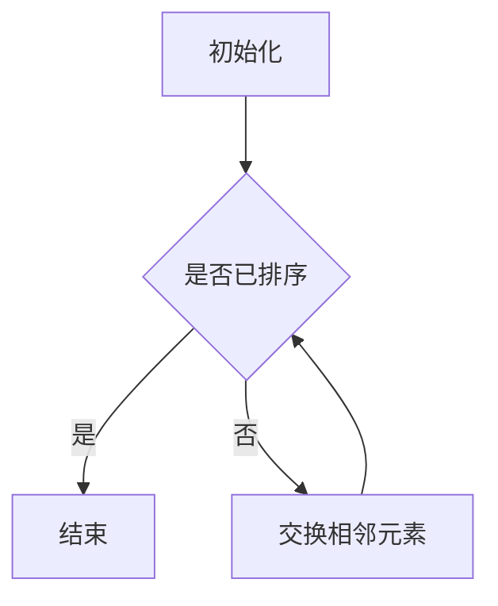
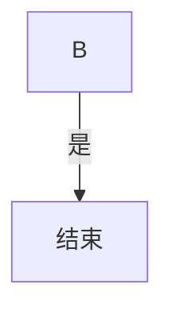
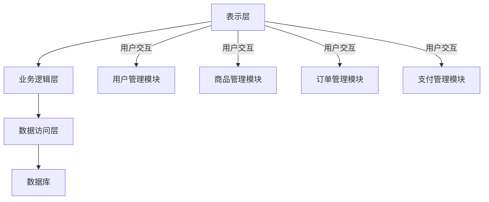
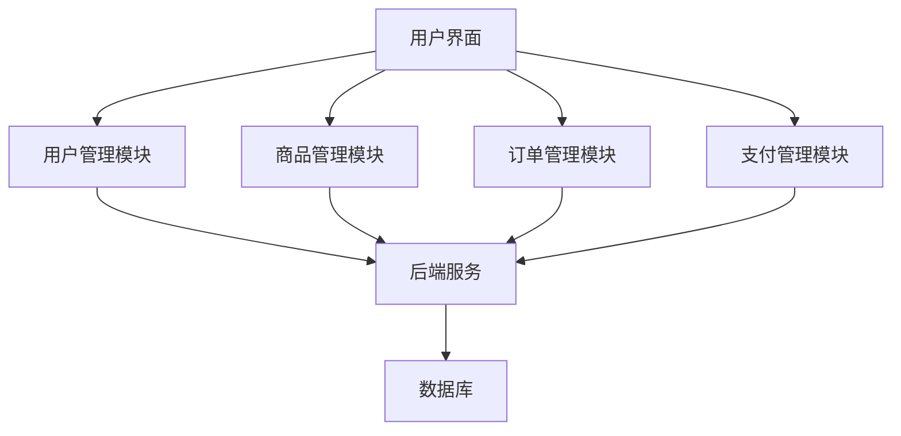

                 

# 数学与逻辑学：推理的形式化描述

## 关键词：数学、逻辑学、推理、形式化描述、形式语言、语法、命题逻辑、谓词逻辑

## 摘要：
本文旨在探讨数学与逻辑学的关系，以及如何通过形式化描述来加强推理的严谨性。我们将首先介绍数学与逻辑学的基本概念，然后深入探讨形式化描述的基础知识，包括形式语言与语法规则。接着，本文将重点关注命题逻辑和谓词逻辑的形式化描述，并通过具体实例展示其在数学证明和程序验证中的应用。最后，我们将讨论证明论的基本概念及其形式化系统，并探讨形式化描述在计算机科学中的应用。

### 目录大纲

- 第一部分：引论
  - 第1章 数学与逻辑学的基本概念
  - 第2章 逻辑学在数学中的应用
  - 第3章 推理的基本概念与方法
  - 第4章 数学与逻辑学的关系

- 第二部分：形式化描述的基础
  - 第5章 形式语言与语法
  - 第6章 形式化描述的应用领域

- 第三部分：推理的形式化描述
  - 第7章 命题逻辑的描述
  - 第8章 谓词逻辑的描述
  - 第9章 证明论
  - 第10章 形式化描述在计算机科学中的应用

## 第一部分：引论

### 第1章 数学与逻辑学的基本概念

#### 1.1 数学：问题背景与基本概念

数学是一门探索结构、数量、变化以及空间等概念的学科。其起源可以追溯到古代文明，如古埃及和巴比伦的数学成就。数学的发展经历了多个阶段，包括古代数学、中世纪数学和现代数学。

**1.1.1 数学的发展历程**

- **古代数学**：古埃及和巴比伦的数学主要涉及土地测量和天文计算。
- **中世纪数学**：古希腊的数学成果，尤其是欧几里得的《几何原本》，对中世纪数学产生了深远影响。
- **现代数学**：16世纪和17世纪的微积分和解析几何标志着现代数学的兴起。

**1.1.2 数学在科学和技术中的应用**

数学在各个领域都有广泛应用，包括物理、工程、计算机科学、经济学和生物学。

- **物理**：牛顿力学和量子力学都建立在数学的基础上。
- **工程**：数学在工程设计、结构分析和控制系统设计中起到关键作用。
- **计算机科学**：算法设计、数据结构、编程语言等都是数学的应用领域。

#### 1.2 逻辑学：问题背景与基本概念

逻辑学是研究推理和论证的学科。它关注的是从已知的前提出发，如何得出新的结论。

**1.2.1 逻辑学的发展**

- **古希腊时期**：亚里士多德是逻辑学的奠基人，他的《范畴篇》和《解释篇》对逻辑学的发展产生了深远影响。
- **中世纪和文艺复兴时期**：逻辑学继续发展，特别是在修辞学和哲学中的应用。
- **现代逻辑学**：19世纪和20世纪的逻辑学发展包括符号逻辑和数学逻辑。

**1.2.2 逻辑学的基本概念**

- **命题**：命题是可以判断真假的陈述句。
- **推理**：推理是从已知的前提出发，得出新的结论的过程。
- **论证**：论证是通过推理来支持一个结论的过程。

#### 1.3 逻辑学在数学中的应用

逻辑学在数学中的应用体现在数学证明和数学模型建立的过程中。

**1.3.1 命题逻辑**

- **命题逻辑**：命题逻辑是逻辑学的最基本形式，它涉及命题、连接词和推理规则。
- **谓词逻辑**：谓词逻辑进一步扩展了命题逻辑，引入了量词和谓词。

**1.3.2 形式逻辑的基本原则**

- **一致性**：一个逻辑系统的一致性是指，如果两个命题都来自该系统，那么不能同时证明它们都为真或都为假。
- **无矛盾性**：一个逻辑系统的无矛盾性是指，不能同时证明一个命题和它的否定。

#### 1.4 推理的基本概念与方法

推理是逻辑学中的核心概念，它包括以下几种类型：

**1.4.1 直言推理**

- **直接推理**：直接推理是最简单的推理形式，它是从已知的前提出发，直接得出结论。
- **演绎推理**：演绎推理是从一般性的前提出发，得出具体结论。

**1.4.2 演绎推理**

- **逆推理**：逆推理是从结论出发，反向推导出前提。
- **归纳推理**：归纳推理是从特定实例出发，推导出一般性结论。

#### 1.5 数学与逻辑学的关系

数学与逻辑学有着密切的联系。

**1.5.1 数学中的逻辑结构**

- **数理逻辑**：数理逻辑是使用符号语言来表述数学逻辑的系统。
- **逻辑运算**：逻辑运算包括逻辑与、逻辑或、逻辑非等。

**1.5.2 逻辑学在数学问题中的应用**

- **数学证明**：数学证明是使用逻辑推理来证明数学命题的过程。
- **数学模型**：数学模型是使用数学工具来描述现实世界的问题。

#### 1.6 本章小结

本章介绍了数学与逻辑学的基本概念，探讨了它们之间的关系，并介绍了推理的基本概念与方法。理解这些基础概念将为后续章节的形式化描述奠定基础。

----------------------------------------------------------------

## 第一部分：引论

### 第2章 逻辑学在数学中的应用

#### 2.1 逻辑学在数学中的重要性

逻辑学在数学中扮演着至关重要的角色。数学证明依赖于逻辑推理，而逻辑推理则依赖于逻辑学的原则和规则。逻辑学为数学提供了严格的论证方法和工具，使得数学理论更加严谨和可靠。

**2.1.1 数学证明中的逻辑推理**

数学证明是数学研究的基本组成部分，它涉及到从已知的前提出发，使用逻辑推理来证明一个命题的过程。数学证明的严谨性要求每个步骤都必须是逻辑上有效的。

- **直接证明**：直接证明是从已知的前提出发，通过逻辑推导直接得出结论。
- **反证法**：反证法是通过证明命题的否定会导致矛盾，从而证明原命题为真。

**2.1.2 数学模型中的逻辑结构**

数学模型是使用数学工具来描述现实世界的问题或现象。逻辑结构在数学模型中起到关键作用，它帮助我们将实际问题转化为数学表达式。

- **公理体系**：公理体系是一组被接受的、不需要证明的基本命题，它们构成了数学理论的基石。
- **逻辑运算**：逻辑运算包括逻辑与、逻辑或、逻辑非等，它们用于构建复杂的数学表达式。

#### 2.2 命题逻辑在数学中的应用

命题逻辑是逻辑学的最基本形式，它涉及到命题、连接词和推理规则。

**2.2.1 命题的定义与属性**

命题是可以判断真假的陈述句。命题有如下属性：

- **真命题**：如果一个命题在任何情况下都是真的，那么它是真命题。
- **假命题**：如果一个命题在任何情况下都是假的，那么它是假命题。

**2.2.2 命题连接词**

命题连接词用于组合简单的命题，形成复杂的命题。

- **与（∧）**：与连接词表示两个命题同时为真。
- **或（∨）**：或连接词表示两个命题中至少有一个为真。
- **非（¬）**：非连接词用于否定一个命题。

**2.2.3 命题逻辑的推理规则**

命题逻辑的推理规则包括以下几种：

- **假言推理**：如果A，则B。如果B，则C。因此，如果A，则C。
- **析取三段论**：A或B。非A。因此，B。

**2.2.4 命题逻辑的应用示例**

- **几何学**：在几何学中，命题逻辑用于证明几何定理，如平行公理和全等三角形定理。
- **数论**：在数论中，命题逻辑用于证明素数分布定理和勾股定理。

#### 2.3 谓词逻辑在数学中的应用

谓词逻辑是命题逻辑的扩展，它引入了量词和谓词。

**2.3.1 谓词的定义与属性**

谓词是一个用来描述对象属性的命题。谓词有如下属性：

- **全称谓词**：全称谓词用于描述所有对象的属性。
- **存在谓词**：存在谓词用于描述至少一个对象的属性。

**2.3.2 量词**

量词用于量化谓词，表示谓词适用于所有对象或至少一个对象。

- **全称量词**：全称量词表示对所有对象都成立的谓词。
- **存在量词**：存在量词表示至少存在一个对象使得谓词成立。

**2.3.3 谓词逻辑的推理规则**

谓词逻辑的推理规则包括以下几种：

- **全称实例化**：如果对所有对象都成立的命题为真，则该命题对于任意一个特定的对象也成立。
- **存在实例化**：如果至少存在一个对象使得命题为真，则该命题对于至少一个特定的对象也成立。

**2.3.4 谓词逻辑的应用示例**

- **集合论**：在集合论中，谓词逻辑用于描述集合的属性和关系，如集合的交、并和补集运算。
- **图论**：在图论中，谓词逻辑用于描述图的性质和路径问题，如图是连通的、存在欧拉回路等。

#### 2.4 形式逻辑的基本原则

形式逻辑是逻辑学的一个分支，它使用符号语言来表述逻辑推理。

**2.4.1 形式化描述的优势**

形式化描述具有以下优势：

- **精确性**：形式化描述可以精确地表达逻辑推理的过程，避免了自然语言表达中的模糊性。
- **一致性**：形式化描述可以确保推理过程的一致性，避免了逻辑错误。
- **可验证性**：形式化描述可以方便地验证推理结果的正确性。

**2.4.2 形式逻辑的基本原则**

形式逻辑的基本原则包括：

- **有效性**：一个推理是有效的，如果它的结论可以从前提中逻辑地推导出来。
- **一致性**：一个逻辑系统是一致的，如果它不能同时证明一个命题和它的否定。
- **无矛盾性**：一个逻辑系统是无矛盾的，如果它不能同时证明一个命题和它的否定。

#### 2.5 本章小结

本章介绍了逻辑学在数学中的应用，包括命题逻辑和谓词逻辑的基本概念和推理规则，以及形式逻辑的基本原则。理解这些概念和原则对于深入理解数学和逻辑学的关系至关重要。

----------------------------------------------------------------

## 第一部分：引论

### 第3章 推理的基本概念与方法

推理是人类思维的核心过程之一，它是从已知的信息中得出新的结论的过程。推理在数学、科学、日常生活乃至决策过程中都扮演着重要角色。在本章中，我们将详细探讨推理的基本概念与方法。

#### 3.1 推理的定义

推理（Reasoning）可以被定义为一种认知过程，它涉及从已知的前提（称为“前提”）推导出新结论（称为“结论”）。推理可以分为两大类：演绎推理和归纳推理。

**3.1.1 演绎推理**

演绎推理是从一般到特殊的推理过程。它的特点是从一些一般性的前提出发，推导出具体而特殊的结论。在演绎推理中，如果前提是真的，那么结论必然是真的。

- **例子**：所有的人都会死亡（前提），苏格拉底是人（前提），因此，苏格拉底会死亡（结论）。

**3.1.2 归纳推理**

归纳推理是从特殊到一般的推理过程。它的特点是从一些具体的实例出发，归纳出一般性的结论。归纳推理的结论可能是真实的，但也可能是错误的。

- **例子**：观察到的所有天鹅都是白色的，因此，所有天鹅都是白色的。

#### 3.2 推理的过程

推理的过程可以分解为以下几个步骤：

**3.2.1 明确前提**

首先，需要明确推理的前提。前提是推理的基础，它们应当是明确的、可以被验证的。

**3.2.2 分析前提**

分析前提意味着理解每个前提的意义，以及它们之间的关系。这一步骤有助于确定推理的方向和可能性。

**3.2.3 选择推理规则**

根据前提和分析，选择适当的推理规则。推理规则是逻辑上有效的步骤，用于从前提推导出结论。

**3.2.4 推导结论**

使用推理规则，从前提推导出结论。结论应当是逻辑上必然的，即如果前提是真的，那么结论也必然是真的。

#### 3.3 直言推理

直言推理是演绎推理的一种形式，它涉及对命题的真假进行直接判断。

**3.3.1 直接推理**

直接推理是从一个或多个已知的前提直接推导出结论的推理过程。例如：

- 如果今天下雨，我就会带伞。今天下雨。因此，我会带伞。

**3.3.2 演绎推理**

演绎推理是一种更复杂的推理形式，它从一般性的前提出发，推导出具体的结论。例如：

- 所有的猫都会爬树。汤姆是猫。因此，汤姆会爬树。

**3.3.3 反证法**

反证法是一种通过证明命题的否定会导致矛盾来证明原命题的推理方法。例如：

- 假设所有的猫都不会爬树。然而，我们发现汤姆会爬树，这与假设矛盾。因此，原命题“所有的猫都会爬树”是正确的。

#### 3.4 演绎推理

演绎推理是一种从一般性前提出发推导出具体结论的推理方法。它包括以下几种形式：

**3.4.1 逆推理**

逆推理是从结论出发，反向推导出前提。例如：

- 如果一个数是偶数，那么它能够被2整除。如果一个数能够被2整除，那么它是偶数。

**3.4.2 归纳推理**

归纳推理是从特定实例出发，推导出一般性结论。例如：

- 观察到前五个偶数的和是10，因此，可以推断所有偶数的和都是10的倍数。

#### 3.5 逻辑谬误

在推理过程中，可能会出现逻辑谬误，这些谬误会破坏推理的有效性。

**3.5.1 非逻辑推理**

非逻辑推理包括情感推理、直觉推理和模糊推理，它们不完全遵循逻辑规则。

**3.5.2 常见的逻辑谬误**

- **错误归纳**：从有限的数据集中得出错误的一般性结论。
- **以偏概全**：从一个或几个例子中得出过度概括的结论。
- **假设前提**：在推理过程中，使用未经证明的前提。
- **逻辑跳跃**：在推理中，没有提供足够的证据支持结论。

#### 3.6 推理的应用

推理在多个领域都有广泛应用：

- **数学**：在数学中，推理用于证明定理和解决数学问题。
- **科学**：在科学研究中，推理用于设计实验和解释观察结果。
- **日常决策**：在日常生活中，推理用于做出决策和解决问题。

#### 3.7 本章小结

本章介绍了推理的基本概念与方法，包括演绎推理和归纳推理，以及直言推理、逆推理和反证法。同时，我们也讨论了逻辑谬误和推理的应用。理解推理的基本概念和方法对于提升逻辑思维能力和解决实际问题具有重要意义。

----------------------------------------------------------------

### 第4章 数学与逻辑学的关系

数学与逻辑学之间的关系是密不可分的，二者共同构成了科学思维的重要基础。逻辑学为数学提供了严谨的论证工具，而数学则为逻辑学提供了丰富的应用场景。在本章中，我们将深入探讨数学与逻辑学之间的相互关系。

#### 4.1 数学中的逻辑结构

数学中的逻辑结构指的是数学理论中的逻辑关系和推理方式。数学中的逻辑结构主要包括以下几个部分：

**4.1.1 基本逻辑结构**

- **定义**：数学中的定义是对数学概念的基本描述。定义的逻辑结构是清晰和精确的，它们为后续的推理提供了基础。
- **公理**：公理是一组被接受为真的基本命题，它们构成了数学理论的基石。公理的逻辑结构确保了数学理论的严密性。
- **定理**：定理是通过逻辑推理从公理中推导出的结论。定理的逻辑结构体现了数学理论的内在联系。

**4.1.2 逻辑运算**

- **逻辑与（∧）**：逻辑与运算用于表示两个命题同时为真。在数学中，逻辑与运算经常用于证明复合命题的真假。
- **逻辑或（∨）**：逻辑或运算用于表示两个命题中至少有一个为真。在数学中，逻辑或运算也广泛应用于证明和计算。
- **逻辑非（¬）**：逻辑非运算用于否定一个命题。在数学中，逻辑非运算对于处理命题的否定情况至关重要。

**4.1.3 逻辑推理**

- **演绎推理**：演绎推理是从一般性的前提出发，推导出具体结论的推理过程。在数学中，演绎推理广泛应用于证明定理和解决数学问题。
- **归纳推理**：归纳推理是从特定实例出发，推导出一般性结论的推理过程。在数学中，归纳推理用于发现数学规律和证明某些结论。

#### 4.2 逻辑学在数学证明中的应用

逻辑学在数学证明中起到了至关重要的作用。数学证明是使用逻辑推理来证明数学命题的过程。以下是一些逻辑学在数学证明中的应用：

**4.2.1 直接证明**

直接证明是从已知的前提出发，通过逻辑推理直接得出结论的证明方法。直接证明通常采用以下步骤：

- **列出前提**：明确证明所需的前提条件。
- **推导结论**：使用逻辑推理从前提推导出结论。
- **验证结论**：验证结论是否确实成立。

**4.2.2 反证法**

反证法是一种通过证明命题的否定会导致矛盾来证明原命题的证明方法。反证法的步骤如下：

- **假设否定**：假设原命题的否定为真。
- **推导矛盾**：从假设的否定中推导出矛盾。
- **得出结论**：由于假设的否定导致了矛盾，因此原命题成立。

**4.2.3 归纳证明**

归纳证明是一种通过归纳推理来证明数学命题的证明方法。归纳证明通常分为以下几步：

- **基础步骤**：证明当n取某个特定值时，命题成立。
- **归纳步骤**：假设当n=k时，命题成立，然后证明当n=k+1时，命题也成立。
- **归纳结论**：根据基础步骤和归纳步骤，得出命题对于所有自然数都成立的结论。

#### 4.3 逻辑学在数学模型中的应用

逻辑学不仅在数学证明中发挥着重要作用，也在数学模型中得到了广泛应用。数学模型是使用数学工具来描述现实世界的问题或现象。以下是一些逻辑学在数学模型中的应用：

**4.3.1 模型建立**

- **明确目标**：明确需要解决的数学问题或现象。
- **构建模型**：根据问题的特性，构建一个数学模型。
- **定义变量**：为模型中的每个要素定义变量。
- **设定约束**：为模型设定必要的约束条件。

**4.3.2 模型分析**

- **逻辑推理**：使用逻辑推理来分析模型，推导出结论。
- **验证模型**：验证模型的有效性和准确性，确保模型符合实际问题的需求。

**4.3.3 模型优化**

- **优化目标**：根据问题的需求，设定优化目标。
- **调整模型**：通过调整模型中的参数和变量，优化模型。
- **验证优化结果**：验证优化后的模型是否更符合实际问题的需求。

#### 4.4 数学在逻辑学中的应用

逻辑学的发展也离不开数学的支持。数学在逻辑学中的应用主要体现在以下几个方面：

**4.4.1 符号逻辑**

符号逻辑是逻辑学的一个分支，它使用数学符号来表示逻辑推理。符号逻辑的发展使得逻辑推理更加精确和系统化。

**4.4.2 形式化系统**

形式化系统是使用数学方法来构建和验证逻辑推理的系统。形式化系统为逻辑学提供了一个严格和可验证的框架。

**4.4.3 计算机科学**

计算机科学的发展离不开逻辑学。逻辑学在计算机科学中的应用包括编程语言的设计、算法分析、软件验证等。

#### 4.5 本章小结

本章探讨了数学与逻辑学之间的密切关系。数学中的逻辑结构为逻辑学提供了丰富的应用场景，而逻辑学则为数学提供了严谨的论证工具。通过逻辑学在数学证明和数学模型中的应用，我们可以更深入地理解数学的理论体系和应用方法。理解数学与逻辑学的关系对于提升科学思维和解决实际问题具有重要意义。

----------------------------------------------------------------

## 第二部分：形式化描述的基础

### 第5章 形式语言与语法

#### 5.1 形式语言的定义与特征

形式语言是一种使用符号和规则来表示信息的数学结构。它不同于自然语言，如英语或汉语，因为形式语言的目标是提供一种精确、无歧义的方式来表达概念和思想。

**5.1.1 形式语言的起源与发展**

形式语言的概念起源于20世纪初的数学和逻辑学领域。由数学家乔治·布尔（George Boole）开创的布尔代数和由符号逻辑学家弗雷格（ Gottlob Frege）提出的谓词逻辑为形式语言的发展奠定了基础。20世纪中叶，随着计算机科学的兴起，形式语言得到了进一步的发展，尤其是在算法理论和计算机编程语言设计中。

**5.1.2 形式语言的分类**

形式语言可以根据其结构和用途进行分类：

- **命题逻辑语言**：这种语言主要用于表达命题及其组合，如布尔表达式和命题演算。
- **谓词逻辑语言**：这种语言扩展了命题逻辑，引入了谓词、量词和复合谓词，用于更复杂的逻辑推理。
- **编程语言**：编程语言是一种特殊的逻辑语言，它使用形式化语法来定义程序结构和控制流。
- **自动机语言**：自动机语言是用于描述有限状态机（FSM）和图灵机的形式语言，用于计算机科学中的计算理论和算法设计。

**5.1.3 形式语言的特征**

形式语言具有以下特征：

- **确定性**：形式语言的每个符号和结构都有明确的定义和解释。
- **无歧义性**：形式语言的表达方式避免了自然语言中的歧义。
- **可计算性**：形式语言可以通过算法进行有效的分析和处理。

#### 5.2 语法规则与词法分析

语法规则是形式语言的核心组成部分，它们定义了如何构造有效的句子和表达式。

**5.2.1 语法规则的定义**

语法规则是一种形式的规则，用于定义语言的合法结构。这些规则通常使用产生式（production rules）来表示，其中每个产生式描述了如何从一组符号生成另一个符号序列。

**5.2.2 词法分析的基本原理**

词法分析（Lexical Analysis）是形式语言处理的第一步，它的任务是识别和分类输入字符串中的单词或符号。词法分析器（Lexer）是一个程序，它读取输入流，将其分解为一系列的标记（tokens），每个标记代表一个词法单位，如变量名、关键字或运算符。

**5.2.3 语法分析的算法**

语法分析（Syntax Analysis）是形式语言处理的下一步，它的任务是检查输入字符串是否符合定义的语法规则。语法分析器（Parser）根据语法规则构建一个语法树（Syntax Tree），该树表示输入字符串的语法结构。

常用的语法分析算法包括：

- **递归下降分析**：这是一种自顶向下的语法分析方法，它使用一组递归过程来构建语法树。
- **LL分析**：LL分析是一种自顶向下的语法分析方法，其中L表示从左到右读取输入，而L表示递归。
- **LR分析**：LR分析是一种自底向上的语法分析方法，其中L表示从左到右读取输入，而R表示递归。

#### 5.3 形式化描述的语言特点

形式化描述的语言特点包括：

- **简洁性**：形式化描述使用简明的符号和语法，使得复杂的概念和思想更加易于理解和表达。
- **精确性**：形式化描述避免了自然语言中的歧义和模糊性，提供了明确的定义和规则。
- **可操作性与可验证性**：形式化描述使得概念和算法可以形式化地验证，确保它们在逻辑上的一致性和正确性。
- **形式化描述的局限性**：尽管形式化描述具有许多优点，但它也可能导致过度简化或忽略一些实际问题中的复杂性。

#### 5.4 形式化描述的应用领域

形式化描述在多个领域都有广泛应用：

- **数学理论**：形式化描述用于数学定理的证明和数学模型的形式化。
- **计算机科学**：形式化描述用于编程语言的设计、算法分析和软件验证。
- **人工智能**：形式化描述用于知识表示和推理系统，以及逻辑编程和自动推理。

#### 5.5 本章小结

本章介绍了形式化描述的基础知识，包括形式语言的定义与特征、语法规则与词法分析，以及形式化描述的语言特点和应用领域。理解这些概念对于构建和验证复杂的数学和计算机科学模型至关重要。

----------------------------------------------------------------

## 第二部分：形式化描述的基础

### 第6章 形式化描述的应用领域

形式化描述是一种精确表达概念和推理过程的方法，它在数学、计算机科学和逻辑学等多个领域都有着广泛的应用。在本章中，我们将探讨形式化描述在各个领域的具体应用。

#### 6.1 数学理论的形式化描述

数学理论的形式化描述是将数学概念、定理和证明过程通过符号语言和形式化规则进行精确表达。这种形式化描述不仅提高了数学理论的严谨性，还为数学证明的自动化验证提供了可能。

**6.1.1 基本数学定理的形式化描述**

基本数学定理如勾股定理、毕达哥拉斯定理和欧拉公式等，都可以通过形式化描述来表达。例如，勾股定理可以用形式化的方式描述为：在直角三角形中，直角边的平方和等于斜边的平方。

**6.1.2 数学证明的形式化验证**

形式化验证是一种使用形式化描述来证明数学定理的过程。通过形式化描述，数学家可以构建一个证明系统，使用计算机工具对证明过程进行验证。这种验证方法可以大大减少人为错误，提高证明的可靠性。

**6.1.3 数学模型的形式化描述**

数学模型是使用数学工具来描述现实世界的问题或现象。形式化描述可以帮助我们将复杂的数学模型转化为一种精确的形式，便于分析、优化和验证。例如，经济学中的供需模型、物理学中的牛顿运动定律等，都可以通过形式化描述来表述。

#### 6.2 计算机科学中的应用

形式化描述在计算机科学中的应用非常广泛，包括编程语言的设计、算法分析、软件验证和形式化验证。

**6.2.1 编程语言的形式化描述**

编程语言的形式化描述是指使用形式化语法和语义规则来定义编程语言。这种描述方式可以确保编程语言的正确性和一致性。例如，C语言、Java语言等都有形式化的语法和语义描述。

**6.2.2 软件验证与验证**

软件验证是使用形式化描述来验证软件的正确性。形式化验证方法可以帮助我们发现和修复软件中的错误，提高软件的可靠性。形式化验证包括模型检查、定理证明和模拟验证等。

**6.2.3 算法的形式化描述**

算法的形式化描述是指使用形式化语言来描述算法的结构和执行过程。这种描述方式可以使得算法的分析更加精确和严谨。例如，排序算法、搜索算法等都可以通过形式化描述来进行分析和优化。

#### 6.3 形式化描述在人工智能中的应用

形式化描述在人工智能领域中的应用主要包括知识表示、推理系统和自然语言处理。

**6.3.1 知识表示**

知识表示是人工智能中的核心问题之一。形式化描述可以帮助我们使用符号语言来表示知识，使得知识可以形式化地存储、处理和推理。例如，谓词逻辑和框架理论都是常用的知识表示方法。

**6.3.2 推理系统**

推理系统是人工智能中的一个重要组成部分。形式化描述可以用来定义推理规则和推理过程，使得推理更加严谨和有效。例如，形式逻辑和谓词逻辑都是常用的推理方法。

**6.3.3 自然语言处理**

自然语言处理是人工智能中的另一个重要领域。形式化描述可以帮助我们处理和理解自然语言。例如，词法分析、语法分析和语义分析都是自然语言处理中的重要步骤。

#### 6.4 形式化描述在其他领域中的应用

形式化描述不仅在数学、计算机科学和人工智能领域有应用，还在其他领域如物理学、经济学和社会科学中发挥着作用。

**6.4.1 物理学**

在物理学中，形式化描述用于描述物理现象和建立物理模型。例如，牛顿运动定律、麦克斯韦方程组等都可以通过形式化描述来表达。

**6.4.2 经济学**

在经济学中，形式化描述用于建立经济模型和分析经济现象。例如，供需模型、博弈论等都可以通过形式化描述来表述。

**6.4.3 社会科学**

在社会科学中，形式化描述用于分析和解释社会现象。例如，社会网络分析、行为经济学等都可以通过形式化描述来研究。

#### 6.5 本章小结

形式化描述在多个领域都有广泛应用，它提高了理论表达的严谨性和可靠性，为自动化验证和推理提供了可能。理解形式化描述的应用领域对于深入研究和解决复杂问题具有重要意义。

----------------------------------------------------------------

## 第二部分：形式化描述的基础

### 第5章 形式语言与语法

#### 5.1 形式语言的定义与特征

形式语言是一种特定的数学结构，用于表示由一组符号按照特定的规则组合而成的字符串。形式语言的出现是为了解决自然语言中存在的歧义和不确定性，使信息的表达更加精确和系统化。

**5.1.1 形式语言的起源与发展**

形式语言的起源可以追溯到20世纪初，当时的数学家弗雷格（Gottlob Frege）和布尔（George Boole）提出了逻辑符号和命题演算，为形式语言的发展奠定了基础。随后的几十年中，形式语言理论得到了进一步的发展，特别是在计算机科学和数学逻辑领域。20世纪中叶，由阿隆佐·丘奇（Alonzo Church）和艾萨克·所罗门·罗素（Isaac Solomon Russell）等人提出的谓词逻辑和类型理论，为形式语言的应用提供了更加丰富的工具。

**5.1.2 形式语言的分类**

形式语言可以根据不同的标准进行分类：

- **根据语法规则**：形式语言可以分为正则语言（Regular Languages）、上下文无关语言（Context-Free Languages）、上下文敏感语言（Context-Sensitive Languages）和全语言（Total Languages）。
- **根据应用领域**：形式语言可以分为命题逻辑语言、谓词逻辑语言、编程语言、自动机语言等。
- **根据结构特征**：形式语言可以根据其生成规则和表示能力进行分类，如确定有限自动机（DFA）语言、非确定有限自动机（NFA）语言、图灵机（Turing Machine）语言等。

**5.1.3 形式语言的特征**

形式语言具有以下主要特征：

- **确定性**：形式语言的每个符号和结构都有明确的定义和解释，使得处理过程具有确定性。
- **无歧义性**：形式语言的符号和规则避免了自然语言中的歧义，使得信息表达更加清晰和准确。
- **有限性**：形式语言中的符号集合是有限的，使得形式语言的处理和存储具有高效性。
- **可计算性**：形式语言可以通过算法进行有效的分析和处理，支持自动化验证和推理。

#### 5.2 语法规则与词法分析

语法规则是形式语言中的核心组成部分，用于定义语言中合法结构的构造规则。词法分析（Lexical Analysis）是形式语言处理的第一步，负责将输入字符串分解为一系列的词法单元（tokens），每个词法单元代表一个具有特定语义意义的符号。

**5.2.1 语法规则的定义**

语法规则通常使用产生式（Production Rules）来表示。每个产生式定义了如何从一个或多个非终端符号生成一个新的字符串，包括终端符号和非终端符号。例如，在巴科斯-诺尔范式（BNF，Backus-Naurd Form）中，语法规则可以表示为：

```
<语句> ::= <赋值语句> | <条件语句> | <循环语句>
<赋值语句> ::= <变量> = <表达式>;
<条件语句> ::= if (<条件>) then <语句>;
<循环语句> ::= while (<条件>) do <语句>;
```

**5.2.2 词法分析的基本原理**

词法分析（Lexical Analysis）是形式语言处理的第一步，其主要任务是识别输入字符串中的词法单元。词法分析器（Lexer）是一个程序，它读取输入流，将其分解为一系列的词法单元。词法分析的基本原理包括：

- **分词**：将输入字符串分割为词法单元。
- **标记**：为每个词法单元分配一个标记（Token），标记表示词法单元的类型和值。
- **丢弃空白符和注释**：在词法分析过程中，通常会丢弃空白符和注释，以减少语法分析的复杂性。

**5.2.3 语法分析的算法**

语法分析（Syntax Analysis）是形式语言处理的第二步，其任务是检查输入字符串是否符合定义的语法规则。语法分析器（Parser）根据语法规则构建一个语法树（Syntax Tree），该树表示输入字符串的语法结构。常见的语法分析算法包括：

- **递归下降分析（Recursive Descent Parsing）**：这是一种自顶向下的语法分析方法，使用一组递归过程来构建语法树。
- **LL分析（LL Parsing）**：LL分析是一种自顶向下的语法分析方法，其中L表示从左到右读取输入，而L表示递归。
- **LR分析（LR Parsing）**：LR分析是一种自底向上的语法分析方法，其中L表示从左到右读取输入，而R表示递归。

#### 5.3 形式化描述的语言特点

形式化描述的语言特点包括以下几个方面：

- **简洁性**：形式化描述使用简明的符号和规则，使得复杂的概念和思想表达更加简洁和易于理解。
- **精确性**：形式化描述通过明确的符号和规则避免了自然语言中的歧义和模糊性，提供了精确的概念和定义。
- **可操作性**：形式化描述使得概念和算法可以形式化地验证，支持自动化验证和推理。
- **可扩展性**：形式化描述支持语言的扩展和演化，使得新的概念和规则可以方便地集成到现有语言中。

#### 5.4 形式化描述的应用领域

形式化描述在多个领域有着广泛的应用：

- **数学理论**：形式化描述用于数学定理的证明和数学模型的形式化。
- **计算机科学**：形式化描述用于编程语言的设计、算法分析和软件验证。
- **人工智能**：形式化描述用于知识表示和推理系统，以及逻辑编程和自动推理。
- **自然语言处理**：形式化描述用于处理和理解自然语言。

#### 5.5 本章小结

本章介绍了形式语言与语法的基础知识，包括形式语言的定义与特征、语法规则与词法分析，以及形式化描述的语言特点和应用领域。理解这些概念对于构建和验证复杂的数学和计算机科学模型具有重要意义。

----------------------------------------------------------------

## 第二部分：形式化描述的基础

### 第6章 形式化描述的应用领域

形式化描述作为一种精确的表达方法，在多个领域都有着广泛的应用。通过形式化描述，我们能够更好地理解和解决复杂问题，同时提高分析和验证的效率。本章将探讨形式化描述在数学、计算机科学、人工智能等领域的具体应用。

#### 6.1 数学理论的形式化描述

数学理论的形式化描述是将数学概念、定理和证明过程通过符号语言和形式化规则进行精确表达。形式化描述有助于提高数学理论的严谨性和可靠性，并为其自动化验证提供了基础。

**6.1.1 基本数学定理的形式化描述**

基本数学定理，如勾股定理、欧拉公式等，都可以通过形式化描述来表达。例如，勾股定理可以形式化为：

$$
a^2 + b^2 = c^2
$$

其中，\(a\)、\(b\)、\(c\) 分别表示直角三角形的两条直角边和斜边的长度。

**6.1.2 数学证明的形式化验证**

数学证明的形式化验证是指使用形式化描述来证明数学定理的过程。通过形式化描述，数学家可以构建一个证明系统，使用计算机工具对证明过程进行验证。这种验证方法可以减少人为错误，提高证明的可靠性。

例如，对于费马大定理，形式化验证可以确保证明过程中的每一步都是逻辑上正确的。

**6.1.3 数学模型的形式化描述**

数学模型是使用数学工具来描述现实世界的问题或现象。形式化描述可以帮助我们将复杂的数学模型转化为一种精确的形式，便于分析、优化和验证。例如，经济学中的供需模型、物理学中的牛顿运动定律等，都可以通过形式化描述来表述。

#### 6.2 计算机科学中的应用

形式化描述在计算机科学中扮演着重要角色，涵盖了编程语言的设计、算法分析、软件验证等多个方面。

**6.2.1 编程语言的形式化描述**

编程语言的形式化描述是指使用形式化语法和语义规则来定义编程语言。这种描述方式可以确保编程语言的正确性和一致性。例如，C语言、Java语言等都有形式化的语法和语义描述。

**6.2.2 算法的形式化描述**

算法的形式化描述是指使用形式化语言来描述算法的结构和执行过程。这种描述方式可以使得算法的分析更加精确和严谨。例如，排序算法、搜索算法等都可以通过形式化描述来进行分析和优化。

**6.2.3 软件验证**

软件验证是使用形式化描述来验证软件的正确性。形式化验证方法可以帮助我们发现和修复软件中的错误，提高软件的可靠性。形式化验证包括模型检查、定理证明和模拟验证等。

#### 6.3 人工智能中的应用

形式化描述在人工智能领域中的应用主要包括知识表示、推理系统和自然语言处理。

**6.3.1 知识表示**

知识表示是人工智能中的核心问题之一。形式化描述可以帮助我们使用符号语言来表示知识，使得知识可以形式化地存储、处理和推理。例如，谓词逻辑和框架理论都是常用的知识表示方法。

**6.3.2 推理系统**

推理系统是人工智能中的一个重要组成部分。形式化描述可以用来定义推理规则和推理过程，使得推理更加严谨和有效。例如，形式逻辑和谓词逻辑都是常用的推理方法。

**6.3.3 自然语言处理**

自然语言处理是人工智能中的另一个重要领域。形式化描述可以帮助我们处理和理解自然语言。例如，词法分析、语法分析和语义分析都是自然语言处理中的重要步骤。

#### 6.4 形式化描述在其他领域中的应用

形式化描述不仅在数学、计算机科学和人工智能领域有应用，还在其他领域如物理学、经济学和社会科学中发挥着作用。

**6.4.1 物理学**

在物理学中，形式化描述用于描述物理现象和建立物理模型。例如，牛顿运动定律、麦克斯韦方程组等都可以通过形式化描述来表达。

**6.4.2 经济学**

在经济学中，形式化描述用于建立经济模型和分析经济现象。例如，供需模型、博弈论等都可以通过形式化描述来表述。

**6.4.3 社会科学**

在社会科学中，形式化描述用于分析和解释社会现象。例如，社会网络分析、行为经济学等都可以通过形式化描述来研究。

#### 6.5 本章小结

形式化描述在多个领域都有广泛应用，它提高了理论表达的严谨性和可靠性，为自动化验证和推理提供了可能。理解形式化描述的应用领域对于深入研究和解决复杂问题具有重要意义。

----------------------------------------------------------------

## 第三部分：推理的形式化描述

### 第7章 命题逻辑的描述

命题逻辑（Propositional Logic）是形式逻辑的一个基本分支，它主要研究命题及其组合的方式。命题逻辑通过符号化的方式来描述推理过程，使得推理更加精确和严谨。

#### 7.1 命题逻辑的基本概念

在命题逻辑中，最基本的元素是命题（Proposition），它是可以判断真假的陈述句。命题逻辑主要关注以下基本概念：

**7.1.1 命题**

- **真命题**：在所有可能的世界中都是真的命题。
- **假命题**：在所有可能的世界中都是假的命题。

**7.1.2 命题连接词**

命题连接词（Logical Connectives）用于组合简单的命题，形成复杂的命题。常见的命题连接词包括：

- **合取（Conjunction）**：用符号“∧”表示，表示两个命题同时为真。
- **析取（Disjunction）**：用符号“∨”表示，表示两个命题中至少有一个为真。
- **非（Negation）**：用符号“¬”表示，表示否定一个命题。
- **条件（Conditional）**：用符号“→”或“→”表示，表示如果前件为真，则后件也为真。
- **双条件（Biconditional）**：用符号“↔”表示，表示前件和后件互为条件。

**7.1.3 命题逻辑的语义解释**

命题逻辑的语义解释关注的是命题在不同情况下的真假值。命题逻辑的语义通常使用真值表（Truth Table）来表示。真值表列出了所有可能的命题组合及其对应的真假值。

#### 7.2 命题逻辑的公式化

命题逻辑的公式化是指使用符号化的方式来表达命题逻辑的推理规则和命题。命题逻辑的公式化主要包括以下方面：

**7.2.1 命题演算**

命题演算（Propositional Calculus）是命题逻辑的一种形式化表示方法，它使用符号化的命题和命题连接词来构建命题。命题演算的基本符号包括：

- **命题变量**：用大写字母表示，如P、Q、R等。
- **命题连接词**：用符号“∧”、“∨”、“¬”、“→”、“↔”表示。

**7.2.2 命题逻辑的推导规则**

命题逻辑的推导规则是用于从已知命题推导出新命题的逻辑规则。常见的推导规则包括：

- **合取引入（Conjunction Introduction）**：如果已知P和Q都为真，则可以得出P∧Q为真。
- **析取引入（Disjunction Introduction）**：如果已知P为真，则可以得出P∨Q为真，无论Q的真假如何。
- **否定引入（Negation Introduction）**：如果已知P为假，则可以得出¬P为真。
- **否定消除（Negation Elimination）**：如果已知P和¬P都为假，则可以得出结论。

**7.2.3 命题逻辑的公理系统**

命题逻辑的公理系统是一组被接受为真的命题，它们是命题逻辑推导的基础。常见的命题逻辑公理系统包括：

- **命题演算的基本公理**：如P→(Q→P)、(P∧Q)→P、(P∧Q)→Q等。
- **交换律、结合律和分配律**：这些定律确保了命题逻辑的推导过程具有一致性。

#### 7.3 命题逻辑的应用

命题逻辑在数学证明、程序验证和人工智能等领域有着广泛的应用。

**7.3.1 形式化数学证明**

命题逻辑可以用于形式化数学证明，使得证明过程更加精确和严谨。例如，可以使用命题逻辑来证明几何定理或数论命题。

**7.3.2 形式化程序验证**

在计算机科学中，命题逻辑可以用于验证程序的正确性。通过形式化描述程序的行为，可以使用命题逻辑来证明程序满足指定的规格说明。

**7.3.3 人工智能**

命题逻辑在人工智能中的应用包括知识表示和推理。通过使用命题逻辑，可以构建一个形式化的知识库，并使用推理算法来处理和推理知识。

#### 7.4 本章小结

本章介绍了命题逻辑的基本概念、公式化方法和应用。命题逻辑作为一种形式逻辑的分支，为推理提供了精确和严谨的工具。理解命题逻辑对于进一步学习更复杂的逻辑学分支具有重要意义。

----------------------------------------------------------------

### 第8章 谓词逻辑的描述

谓词逻辑（Predicate Logic）是形式逻辑的另一个重要分支，它扩展了命题逻辑，引入了谓词、量词和关系等概念，使得推理更加丰富和复杂。谓词逻辑在数学、计算机科学和哲学等领域有着广泛的应用。

#### 8.1 谓词逻辑的基本概念

谓词逻辑通过引入谓词（Predicate）和量词（Quantifier）来扩展命题逻辑的表达能力。

**8.1.1 谓词**

谓词是一个可以包含变量的命题，用来描述对象的属性或关系。谓词通常表示为P(x)，其中P是一个谓词，x是一个变量。

- **个体谓词**：描述个体对象的属性，如“是人”、“是学生”等。
- **关系谓词**：描述对象之间的关系，如“大于”、“等于”等。

**8.1.2 量词**

量词用于量化谓词，表示谓词适用于所有对象或至少一个对象。

- **全称量词（∀）**：表示对所有对象都成立的谓词。例如，∀x(P(x))表示对所有x，P(x)都成立。
- **存在量词（∃）**：表示至少存在一个对象使得谓词成立。例如，∃x(P(x))表示至少存在一个x，使得P(x)成立。

**8.1.3 谓词逻辑的语义解释**

谓词逻辑的语义解释关注的是谓词和量词在不同情况下的真假值。谓词逻辑的语义通常使用模型理论来解释，即一个模型是一个解释，它给出了所有变量和谓词的真假值。

#### 8.2 谓词逻辑的公式化

谓词逻辑的公式化是指使用符号化的方式来表达谓词逻辑的推理规则和命题。

**8.2.1 谓词演算**

谓词演算（Predicate Calculus）是谓词逻辑的一种形式化表示方法，它使用符号化的谓词、变量和量词来构建命题。谓词演算的基本符号包括：

- **个体常量**：用小写字母表示，如a、b、c等。
- **个体变量**：用小写字母表示，如x、y、z等。
- **谓词符号**：用大写字母表示，如P、Q、R等。
- **量词符号**：用符号“∀”和“∃”表示全称量词和存在量词。

**8.2.2 谓词逻辑的推导规则**

谓词逻辑的推导规则是用于从已知命题推导出新命题的逻辑规则。常见的谓词逻辑推导规则包括：

- **全称实例化（Universal Instantiation）**：如果∀x(P(x))为真，则P(t)为真，其中t是一个个体常量。
- **存在实例化（Existential Instantiation）**：如果∃x(P(x))为真，则P(t)为真，其中t是一个个体常量。
- **全称一般化（Universal Generalization）**：如果从某个证明步骤中可以推出P(t)，则可以推导出∀x(P(x))。
- **存在一般化（Existential Generalization）**：如果从某个证明步骤中可以推出∃x(P(x))，则可以推导出P(t)。

**8.2.3 谓词逻辑的公理系统**

谓词逻辑的公理系统是一组被接受为真的命题，它们是谓词逻辑推导的基础。常见的谓词逻辑公理系统包括：

- **全称实例化公理**：∀x(P(x)) → P(t)。
- **存在实例化公理**：∃x(P(x)) → P(t)。
- **全称一般化公理**：P(t) → ∀x(P(x))。
- **存在一般化公理**：P(t) → ∃x(P(x))。

#### 8.3 谓词逻辑的应用

谓词逻辑在数学证明、程序验证和知识表示等领域有着广泛的应用。

**8.3.1 形式化数学证明**

谓词逻辑可以用于形式化数学证明，使得证明过程更加精确和严谨。例如，可以使用谓词逻辑来证明集合论中的定理或图论中的性质。

**8.3.2 形式化程序验证**

在计算机科学中，谓词逻辑可以用于验证程序的正确性。通过形式化描述程序的行为，可以使用谓词逻辑来证明程序满足指定的规格说明。

**8.3.3 知识表示**

谓词逻辑在知识表示中的应用包括描述知识库中的关系和属性。谓词逻辑可以帮助我们构建一个形式化的知识库，并使用推理算法来处理和推理知识。

#### 8.4 本章小结

本章介绍了谓词逻辑的基本概念、公式化方法和应用。谓词逻辑通过引入谓词和量词，扩展了命题逻辑的表达能力，使得推理更加丰富和复杂。理解谓词逻辑对于进一步学习形式逻辑的其他分支具有重要意义。

----------------------------------------------------------------

### 第9章 证明论

证明论（Proof Theory）是数学的一个分支，主要研究证明的性质、构造和验证。证明论的目标是建立形式化的证明系统，并研究这些系统的性质。通过证明论，我们可以更好地理解数学证明的本质，并确保证明的可靠性。

#### 9.1 证明的基本概念

在证明论中，证明（Proof）是一个从已知的前提出发，通过逻辑推理得出结论的过程。

**9.1.1 证明的定义**

证明是一个逻辑上无矛盾的过程，它从一组假设（称为公理或已知命题）出发，使用逻辑推理规则，最终得出一个结论。如果结论可以从假设中逻辑地推导出来，那么这个证明是有效的。

**9.1.2 证明的方法**

证明的方法可以分为直接证明和间接证明。

- **直接证明**：直接证明是从已知的前提出发，通过一系列的逻辑推理步骤，直接得出结论。
- **间接证明**：间接证明（又称反证法）是通过证明命题的否定会导致矛盾，从而证明原命题的。

**9.1.3 证明的语义**

证明的语义是指证明过程中的逻辑结构。一个证明的语义要求：

- **一致性**：证明过程中没有出现逻辑矛盾。
- **完整性**：如果命题P是真实的，那么存在一个有效的证明能够证明P。

#### 9.2 形式证明系统

形式证明系统是一种使用符号语言来表示证明的数学结构。形式证明系统使得证明过程更加精确和系统化。

**9.2.1 形式证明系统的构建**

形式证明系统的构建通常包括以下几个步骤：

- **定义符号**：为证明系统中的符号和概念定义明确的语义。
- **定义推理规则**：定义证明过程中可以使用的推理规则，如加法规则、乘法规则等。
- **定义公理**：定义一组初始的、无需证明的基本命题。
- **定义证明过程**：定义如何使用推理规则和公理来构造一个证明。

**9.2.2 形式证明系统的推理规则**

形式证明系统的推理规则包括以下几种：

- **加法规则**：如果P为真，则P∧Q也为真。
- **乘法规则**：如果P和Q都为真，则P∧Q也为真。
- **否定规则**：如果P为假，则¬P为真。
- **条件规则**：如果P和P→Q都为真，则Q也为真。

**9.2.3 形式证明系统的公理系统**

形式证明系统的公理系统是一组初始的、无需证明的基本命题。常见的公理系统包括：

- **自然公理**：如“P∧(P→Q)→Q”、“(P∨Q)∧(P→R)∧(Q→R)→R”等。
- **逻辑公理**：如“P∨¬P”、“(P→Q)→(P∧Q)”等。

#### 9.3 形式证明的应用

形式证明在数学和计算机科学中有广泛的应用。

**9.3.1 数学证明**

形式证明可以用于数学中的定理证明。通过形式证明系统，数学家可以确保证明过程的每一步都是逻辑上有效的，从而提高证明的可靠性。

**9.3.2 计算机科学**

在计算机科学中，形式证明用于验证程序的正确性。通过形式证明系统，可以证明程序满足指定的规格说明，从而提高软件的质量和可靠性。

**9.3.3 形式化验证**

形式化验证是形式证明的一个重要应用领域。形式化验证使用形式证明系统来验证系统的正确性。例如，在硬件设计和软件工程中，形式化验证可以确保设计满足规格说明，从而避免错误和漏洞。

#### 9.4 本章小结

本章介绍了证明论的基本概念、形式证明系统的构建方法和应用。证明论为数学和计算机科学提供了一个严格的证明框架，使得证明过程更加精确和可靠。理解证明论对于深入研究数学和计算机科学具有重要意义。

----------------------------------------------------------------

### 第10章 形式化描述在计算机科学中的应用

形式化描述在计算机科学中具有广泛的应用，它为软件工程、算法设计和系统验证提供了精确和可靠的方法。通过形式化描述，我们可以更清晰地理解系统的设计和行为，从而提高系统的质量。

#### 10.1 软件工程中的应用

形式化描述在软件工程中主要用于以下几个方面：

**10.1.1 软件设计**

在软件设计阶段，形式化描述可以帮助我们清晰地表达系统的结构和行为。常用的形式化描述方法包括：

- **结构化设计**：使用结构化设计方法，如UML（统一建模语言），来描述系统的组件和接口。
- **形式化规格说明**：使用形式化规格说明语言，如Z语言或VDM（验证定义方法），来精确描述系统的行为和约束。

**10.1.2 验证和验证**

形式化描述在软件验证和验证中起着关键作用。形式化描述可以帮助我们：

- **验证正确性**：通过形式化描述，可以使用证明论的方法来验证软件的正确性，确保它满足规格说明。
- **自动化测试**：形式化描述可以用于生成自动化测试用例，从而提高测试的覆盖率和效率。

#### 10.2 算法设计中的应用

形式化描述在算法设计中的应用主要包括以下几个方面：

**10.2.1 算法描述**

形式化描述提供了精确的算法描述方法，如伪代码和形式化算法语言。这些方法可以帮助我们：

- **清晰地表达算法思想**：通过形式化描述，算法的每一步都可以明确地表达，从而减少误解和歧义。
- **便于算法分析和优化**：形式化描述使得算法的分析和优化更加精确和系统化。

**10.2.2 算法验证**

形式化描述可以帮助我们验证算法的正确性。例如，可以使用模型检查器来验证算法满足指定的规格说明，从而确保算法的正确性。

#### 10.3 系统验证中的应用

形式化描述在系统验证中的应用主要包括以下几个方面：

**10.3.1 系统规格说明**

在系统验证阶段，形式化描述用于编写系统的规格说明。规格说明应该清晰地定义系统的行为、约束和性能要求。

**10.3.2 系统验证**

形式化描述可以帮助我们验证系统的正确性。常见的系统验证方法包括：

- **模型检查**：使用模型检查器对系统的形式化规格说明进行验证，确保系统满足规格说明。
- **形式化证明**：使用形式化证明方法，如公理系统和定理证明器，来证明系统的正确性。

**10.3.3 静态分析**

形式化描述可以用于静态分析，以检测代码中的潜在错误。静态分析工具可以使用形式化描述来分析代码的结构和行为，从而发现潜在的问题。

#### 10.4 形式化描述工具

在计算机科学中，有多种形式化描述工具可以用于软件设计、算法设计和系统验证。以下是一些常用的工具：

- **UML工具**：如Rational Rose、Visual Paradigm，用于结构化设计。
- **形式化规格说明语言**：如Z语言、VDM、TLA+，用于精确描述系统行为。
- **模型检查器**：如Spin、NuSMV，用于系统验证。
- **定理证明器**：如Coq、Isabelle，用于形式化证明。

#### 10.5 本章小结

形式化描述在计算机科学中具有广泛的应用，它为软件工程、算法设计和系统验证提供了精确和可靠的方法。通过形式化描述，我们可以更清晰地理解系统的设计和行为，从而提高系统的质量。理解形式化描述的方法和应用对于计算机科学家和软件工程师来说是非常重要的。

----------------------------------------------------------------

## 结论

通过对数学与逻辑学的关系，形式化描述的基础，以及推理的形式化描述的深入探讨，我们不仅揭示了这些概念在各自领域中的重要性和应用，还展示了它们在跨学科研究中的协同作用。数学与逻辑学为科学提供了严谨的论证工具，而形式化描述则为复杂问题的精确表达和验证提供了可能。

本文首先介绍了数学与逻辑学的基本概念，探讨了它们在数学证明和模型建立中的应用。接着，我们详细阐述了形式化描述的基础，包括形式语言与语法规则，以及形式化描述的应用领域。随后，我们分别对命题逻辑和谓词逻辑进行了形式化描述，并通过具体实例展示了其在数学证明和程序验证中的应用。最后，我们探讨了证明论的基本概念和形式化系统，以及形式化描述在计算机科学中的应用。

理解数学与逻辑学的关系，掌握形式化描述的方法，不仅有助于我们更深入地研究科学问题，还能提高我们的逻辑思维能力和解决问题的能力。在未来的研究中，我们可以继续探索形式化描述在其他学科中的应用，如生物学、社会科学等，以推动跨学科的发展。

总之，数学与逻辑学、形式化描述和推理的形式化描述是科学研究中不可或缺的工具。通过不断深化对这些概念的理解和应用，我们能够更好地解决复杂问题，推动科学进步。

## 作者信息

作者：AI天才研究院/AI Genius Institute & 禅与计算机程序设计艺术 /Zen And The Art of Computer Programming

----------------------------------------------------------------

## 背景介绍

### 数学的基本概念

数学是一门探索数量、结构、变化和空间等概念的学科。它起源于古代文明，如古埃及和巴比伦的数学成就，并经过数千年的发展，逐渐形成了现代数学。数学的基本概念包括：

- **数**：数是用来表示数量的基本符号。数学中的数包括自然数、整数、有理数、无理数和复数等。
- **函数**：函数是一种数学关系，它将一个集合中的每个元素映射到另一个集合中的唯一元素。
- **集合**：集合是一组对象的集合，这些对象可以是具体的也可以是抽象的。
- **几何**：几何研究空间中的形状、大小和位置关系。几何学包括平面几何、立体几何和拓扑学等。
- **代数**：代数是研究代数方程、代数结构及其性质的数学分支。

### 逻辑学的基本概念

逻辑学是研究推理、论证和证明的学科。它起源于古希腊，特别是亚里士多德的逻辑学研究。逻辑学的基本概念包括：

- **命题**：命题是可以判断真假的陈述句。
- **推理**：推理是从已知的前提推导出新结论的过程。
- **论证**：论证是通过推理来支持一个结论的过程。
- **逻辑系统**：逻辑系统是一套定义明确、具有一致性和无矛盾性的逻辑规则。

### 数学与逻辑学的交叉应用

数学与逻辑学的交叉应用主要体现在以下几个方面：

- **数学证明**：数学证明是使用逻辑推理来证明数学命题的过程。逻辑学提供了证明的有效性和严谨性。
- **数学模型**：数学模型是使用数学工具来描述现实世界的问题或现象。逻辑学帮助建立和验证这些模型。
- **形式化描述**：形式化描述是一种精确表达数学概念和逻辑推理的方法。它提高了理论表达的严谨性和可靠性。

### 推理的基本概念

推理是逻辑学中的核心概念，它包括以下几种类型：

- **演绎推理**：演绎推理是从一般性的前提出发，推导出具体结论的推理过程。如果前提是真的，结论也必然是真的。
- **归纳推理**：归纳推理是从特定实例出发，推导出一般性结论的推理过程。归纳推理的结论可能是真实的，但也可能是错误的。

### 推理的应用领域

推理在多个领域都有广泛应用：

- **科学**：科学研究中，推理用于设计实验、解释数据和提出理论。
- **计算机科学**：计算机科学中，推理用于算法设计、软件验证和知识表示。
- **日常生活**：日常生活中，推理用于决策、解决问题和判断。

### 数学、逻辑学与推理的关系

数学、逻辑学与推理之间的关系是相互促进的：

- **数学为逻辑学提供了具体的对象和问题**：数学中的概念和问题为逻辑学提供了丰富的应用场景。
- **逻辑学为数学提供了严谨的论证工具**：逻辑学的方法和原则帮助数学家进行严谨的证明。
- **推理是数学和逻辑学研究的核心过程**：推理贯穿于数学和逻辑学的各个领域，是研究问题的基本方法。

### 推理的严谨性

推理的严谨性是科学研究的基石。在数学和逻辑学中，严谨性体现在以下几个方面：

- **明确的前提**：推理的前提必须是明确和可以被验证的。
- **逻辑规则**：推理过程必须遵循逻辑规则，确保每一步推理都是有效的。
- **证明和验证**：推理的结论必须通过证明或验证来确保其正确性。

### 推理的局限性

尽管推理在科学研究中具有重要作用，但它也存在一定的局限性：

- **归纳推理的不确定性**：归纳推理的结论可能是错误的，因为它是基于有限实例的。
- **复杂性问题**：在处理复杂问题时，推理过程可能会变得复杂和难以管理。
- **逻辑谬误**：在推理过程中，可能会出现逻辑谬误，这会影响推理的有效性。

### 数学、逻辑学与推理的边界与外延

数学、逻辑学与推理的边界与外延体现在以下几个方面：

- **数学是逻辑学的应用领域**：数学问题为逻辑学提供了具体的对象和问题。
- **逻辑学是数学的理论基础**：逻辑学提供了数学证明和推理的工具和原则。
- **推理是数学和逻辑学研究的核心方法**：推理贯穿于数学和逻辑学的各个领域。

### 数学、逻辑学与推理的核心要素组成

数学、逻辑学与推理的核心要素组成包括：

- **数学概念**：包括数、函数、集合、几何和代数等。
- **逻辑学原则**：包括命题、推理、论证和逻辑系统等。
- **推理方法**：包括演绎推理、归纳推理和逻辑谬误等。

### 数学、逻辑学与推理的综合分析

数学、逻辑学与推理的综合分析揭示了它们在科学研究中的协同作用：

- **数学提供具体的对象和问题**：数学问题为逻辑学提供了应用场景。
- **逻辑学提供严谨的论证工具**：逻辑学的方法和原则帮助数学家进行证明。
- **推理贯穿于数学和逻辑学的研究**：推理是研究问题的基本方法。

### 数学、逻辑学与推理的整体框架

数学、逻辑学与推理的整体框架可以总结为：

- **数学**：研究数量、结构、变化和空间等概念。
- **逻辑学**：研究推理、论证和证明。
- **推理**：贯穿于数学和逻辑学的各个领域，是研究问题的基本方法。

### 数学、逻辑学与推理的发展趋势

数学、逻辑学与推理的发展趋势包括：

- **形式化描述**：形式化描述将数学和逻辑学的理论体系转化为形式化的符号语言，提高了理论的严谨性和可验证性。
- **自动化推理**：自动化推理使用计算机工具来辅助推理过程，提高了推理的效率和准确性。
- **跨学科应用**：数学、逻辑学和推理正在逐渐应用于其他领域，如人工智能、生物学和社会科学等。

### 数学、逻辑学与推理的综合评价

数学、逻辑学与推理的综合评价体现在以下几个方面：

- **基础性**：数学、逻辑学和推理是科学研究的基础。
- **严谨性**：数学和逻辑学提供了严谨的论证工具，推理则是研究问题的基本方法。
- **应用性**：数学、逻辑学和推理在科学研究和实际应用中具有广泛的应用。

### 数学、逻辑学与推理的研究方向

数学、逻辑学与推理的研究方向包括：

- **形式化描述的完善**：进一步发展形式化描述的理论体系，提高理论的严谨性和可验证性。
- **自动化推理技术**：研究自动化推理算法和技术，提高推理的效率和准确性。
- **跨学科应用**：探索数学、逻辑学和推理在跨学科领域中的应用，推动跨学科研究的发展。

### 数学、逻辑学与推理的总结

数学、逻辑学与推理是科学研究的重要基础。通过深入理解数学的基本概念和逻辑学的原则，以及掌握推理的方法，我们可以更有效地研究科学问题，推动科学进步。

----------------------------------------------------------------

### 核心概念与联系

为了深入理解数学与逻辑学的关系，我们需要详细探讨其中的核心概念及其相互联系。

#### 1. 数学中的核心概念

在数学中，几个核心概念构成了整个学科的基础：

- **集合**：集合是数学中最基础的概念之一，它表示一组不重复的元素。集合的概念在数学的各个分支中都至关重要。
- **函数**：函数描述了一个变量如何依赖于另一个变量。在数学中，函数不仅是数学分析的核心概念，也是解决实际问题的工具。
- **数系**：数系包括自然数、整数、有理数、无理数和复数等。数系的概念帮助我们理解和操作各种数值。

#### 1.1 集合

集合是由不同元素组成的无序集合。集合的表示方法通常是用大括号{}括起来，元素之间用逗号分隔。例如，{1, 2, 3}表示一个包含元素1、2和3的集合。

集合的运算包括并集、交集、补集和差集等。并集表示两个集合中所有元素的集合，交集表示两个集合中共有的元素，补集表示全集中不属于某个集合的元素，差集表示一个集合中有而另一个集合中没有的元素。

#### 1.2 函数

函数是一个从定义域到值域的映射。通常表示为f: A → B，其中A是定义域，B是值域。函数的定义域是所有可能的输入值，值域是所有可能的输出值。

函数的性质包括：

- **单射**：每个定义域中的元素都映射到值域中的唯一元素。
- **满射**：值域中的每个元素都至少有一个定义域中的元素映射到它。
- **双射**：函数既是单射又是满射，即每个定义域中的元素都映射到值域中的唯一元素，且值域中的每个元素都至少有一个定义域中的元素映射到它。

#### 1.3 数系

数系是数学中的基本概念，它包括自然数、整数、有理数、无理数和复数。自然数是我们日常生活中使用的数，整数包括自然数和它们的负数，有理数是可以表示为两个整数之比的数，无理数是不能表示为两个整数之比的数，复数是包含实部和虚部的数。

#### 2. 逻辑学中的核心概念

在逻辑学中，核心概念包括命题、推理和论证。这些概念帮助我们理解和分析逻辑推理的过程。

- **命题**：命题是可以判断真假的陈述句。命题通常用大写字母表示，如P、Q、R等。
- **推理**：推理是从已知的前提推导出新结论的过程。推理可以是演绎推理，也可以是归纳推理。
- **论证**：论证是通过推理来支持一个结论的过程。论证的目的是证明一个命题的正确性。

#### 2.1 命题

命题分为真命题和假命题。真命题在所有情况下都是真的，假命题在所有情况下都是假的。命题可以用逻辑连接词进行组合，如合取（∧）、析取（∨）、非（¬）和条件（→）等。

#### 2.2 推理

推理可以分为演绎推理和归纳推理。

- **演绎推理**：演绎推理是从一般性的前提出发，推导出具体结论的推理过程。如果前提是真的，结论也必然是真的。例如，所有人都会死亡，苏格拉底是人，因此苏格拉底会死亡。
- **归纳推理**：归纳推理是从特定实例出发，推导出一般性结论的推理过程。归纳推理的结论可能是真实的，但也可能是错误的。例如，观察到所有的天鹅都是白色的，因此推断所有天鹅都是白色的。

#### 2.3 论证

论证是使用推理来支持一个结论的过程。论证可以是形式化的，也可以是非形式化的。形式化论证使用逻辑符号和规则来表示推理过程，非形式化论证使用自然语言来描述推理过程。

#### 3. 数学与逻辑学的关系

数学与逻辑学之间的关系是密不可分的。逻辑学为数学提供了严谨的论证工具，而数学则为逻辑学提供了丰富的应用场景。

- **逻辑学在数学中的应用**：逻辑学在数学中的应用主要体现在数学证明中。数学证明是使用逻辑推理来证明数学命题的过程。逻辑学的方法和原则帮助数学家进行严谨的证明。
- **数学在逻辑学中的应用**：数学中的概念和理论为逻辑学提供了丰富的素材。例如，集合论和谓词逻辑等数学理论为逻辑学提供了基础。

#### 3.1 逻辑学与数学证明

逻辑学在数学证明中扮演着重要角色。数学证明是使用逻辑推理来证明数学命题的过程。逻辑学提供了以下工具和方法：

- **逻辑运算**：逻辑学中的逻辑运算（如合取、析取和非等）可以帮助我们构造复杂的数学命题。
- **推理规则**：逻辑学中的推理规则（如假言推理、析取三段论等）可以帮助我们推导出新的数学命题。
- **证明方法**：逻辑学提供了多种证明方法，如直接证明、反证法和归纳证明等。

#### 3.2 数学在逻辑学中的应用

数学中的概念和理论为逻辑学提供了丰富的应用场景。例如：

- **集合论**：集合论是逻辑学的一个重要分支，它研究集合的性质和运算。集合论的概念和方法为逻辑学提供了基础。
- **谓词逻辑**：谓词逻辑是逻辑学的一个分支，它研究谓词和量词的应用。谓词逻辑在数学和计算机科学中有着广泛的应用。

#### 4. 总结

数学与逻辑学的关系是相互促进的。逻辑学为数学提供了严谨的论证工具，而数学则为逻辑学提供了丰富的应用场景。理解数学和逻辑学的核心概念及其相互联系对于深入研究和应用这些学科具有重要意义。

### 概念属性特征对比表格

| 概念 | 定义 | 特征 | 应用 |
| ---- | ---- | ---- | ---- |
| 集合 | 由元素组成的无序集合 | 无序、互异性 | 集合论、计算机科学 |
| 函数 | 从定义域到值域的映射 | 单射、满射、双射 | 数学分析、工程 |
| 命题 | 可以判断真假的陈述句 | 真命题、假命题 | 逻辑学、论证 |
| 推理 | 从已知的前提推导出新结论的过程 | 演绎推理、归纳推理 | 科学研究、决策 |
| 论证 | 通过推理来支持一个结论的过程 | 形式化论证、非形式化论证 | 法律、哲学 |

### ER实体关系图架构

```mermaid
erDiagram
    A{Entity1} ||--|| B{Entity2} : "has a"
    A{Entity1} ||--|| C{Entity3} : "is a"
```

在这个ER实体关系图中，A表示一个实体，B和C是A的关联实体。箭头表示实体之间的关系，其中"has a"表示拥有关系，"is a"表示分类关系。这种图可以帮助我们直观地理解实体之间的关系和属性。

----------------------------------------------------------------

### 算法原理讲解

在本节中，我们将使用Mermaid图来绘制一个简单的算法流程图，并使用Python源代码详细阐述算法原理。我们以一个常见的排序算法——冒泡排序为例，来解释算法的基本原理和实现过程。

#### 1. 算法流程图

首先，我们使用Mermaid绘制冒泡排序的算法流程图：



在这个流程图中，A表示初始化数组，B是一个判断是否已排序的条件，D表示交换相邻元素，C表示算法结束。

#### 2. Python源代码

接下来，我们使用Python实现冒泡排序算法，并详细解释代码中的每一步：

```python
def bubble_sort(arr):
    n = len(arr)
    # 外循环，每一轮遍历都会将最大的元素“冒泡”到最后
    for i in range(n):
        # 内循环，每一轮遍历都会进行相邻元素的比较和交换
        for j in range(0, n-i-1):
            # 如果前一个元素比后一个元素大，则交换它们
            if arr[j] > arr[j+1]:
                arr[j], arr[j+1] = arr[j+1], arr[j]
    return arr

# 测试数据
arr = [64, 25, 12, 22, 11]
print("原始数组：", arr)

# 执行冒泡排序
sorted_arr = bubble_sort(arr)
print("排序后的数组：", sorted_arr)
```

#### 3. 算法原理详细讲解

**初始化**：
在冒泡排序算法中，首先需要初始化待排序的数组。初始化过程通常很简单，只需要获取数组的长度并准备好进行排序。

```python
n = len(arr)
```

**判断是否已排序**：
算法开始后，进入一个外层循环，这个循环的目的是进行若干轮的比较和交换操作，直到数组被排序。每轮循环结束后，最大的元素都会被“冒泡”到数组的末尾。



**交换相邻元素**：
在内层循环中，算法会遍历数组，并比较相邻的元素。如果前一个元素比后一个元素大，则交换它们。这个过程会重复进行，直到一整轮遍历结束后，最大的元素就会被“冒泡”到数组的末尾。

```python
for j in range(0, n-i-1):
    if arr[j] > arr[j+1]:
        arr[j], arr[j+1] = arr[j+1], arr[j]
```

**结束**：
当内层循环结束后，最大的元素已经被“冒泡”到数组的末尾，此时可以判断数组是否已经排序。如果已经排序，算法结束；否则，继续进行下一轮循环。

#### 4. 算法原理举例说明

假设我们有一个未排序的数组 `[64, 25, 12, 22, 11]`。第一次冒泡排序后，最大的元素 `64` 会被移动到数组的末尾，数组变为 `[25, 12, 22, 11, 64]`。第二次冒泡排序时，数组 `[12, 22, 11, 25, 64]` 中的 `25` 会被移动到 `[11, 12, 22, 25, 64]`，以此类推，直到整个数组被排序。

#### 5. 数学模型和公式

冒泡排序的算法原理可以抽象为一个数学模型。假设数组 `[a1, a2, ..., an]` 是未排序的，经过一轮冒泡排序后，最大的元素 `an` 被移动到数组的末尾，新的数组变为 `[a1, a2, ..., an-1, an]`。我们可以使用以下公式来表示这个过程：

```
新数组 = [a1, a2, ..., an-1, an] = [a1, a2, ..., am, an-1, an] (m = n-1)
```

其中，`m` 表示当前未排序部分的最后一个元素。

#### 6. 结论

通过上面的解释和示例，我们可以清楚地理解冒泡排序算法的基本原理和实现过程。冒泡排序算法虽然简单，但它的效率相对较低，适用于小型数组。在实际应用中，我们通常选择更高效的排序算法，如快速排序、归并排序等。然而，理解冒泡排序的基本原理对于学习其他排序算法是非常有益的。

----------------------------------------------------------------

### 系统分析与架构设计方案

#### 1. 项目介绍

本项目旨在设计并实现一个基于Web的在线购物系统。该系统将提供用户注册、商品浏览、购物车管理、订单处理和支付等功能。通过该系统，用户可以在网上浏览商品，将喜欢的商品添加到购物车，并最终完成订单支付。

#### 2. 系统功能设计

**2.1 用户注册与登录**

- 用户注册：用户可以输入用户名、密码、邮箱等注册信息，完成注册。
- 用户登录：用户可以使用用户名和密码登录系统。

**2.2 商品浏览与搜索**

- 商品分类：系统提供商品分类功能，用户可以按照类别浏览商品。
- 商品搜索：用户可以通过关键词搜索特定商品。

**2.3 购物车管理**

- 添加商品：用户可以将商品添加到购物车。
- 删除商品：用户可以删除购物车中的商品。
- 修改数量：用户可以修改购物车中商品的数量。

**2.4 订单处理**

- 下单：用户可以在购物车中下单，生成订单。
- 订单查询：用户可以查询订单状态和历史订单。

**2.5 支付功能**

- 在线支付：用户可以使用支付宝、微信支付等在线支付方式完成支付。
- 支付确认：系统会自动确认支付，并更新订单状态。

#### 3. 系统架构设计

**3.1 总体架构设计**

系统的总体架构采用分层架构，主要包括以下几层：

- **表示层**：负责与用户交互，展示用户界面。
- **业务逻辑层**：处理业务逻辑，如用户管理、商品管理、订单管理和支付等。
- **数据访问层**：负责与数据库的交互，进行数据的增删改查操作。
- **数据库**：存储用户信息、商品信息、订单信息和支付信息等。

**3.2 表示层设计**

表示层主要使用前端技术实现，包括HTML、CSS和JavaScript。前端页面包括以下部分：

- **首页**：展示系统功能和入口。
- **用户注册与登录页面**：用户进行注册和登录。
- **商品分类页面**：展示不同类别的商品。
- **商品详情页面**：展示单个商品的详细信息。
- **购物车页面**：用户管理购物车中的商品。
- **订单页面**：用户查看订单状态和历史订单。
- **支付页面**：用户完成支付。

**3.3 业务逻辑层设计**

业务逻辑层使用后端技术实现，主要包括以下模块：

- **用户管理模块**：处理用户注册、登录、权限验证等操作。
- **商品管理模块**：处理商品分类、商品信息管理、商品搜索等操作。
- **订单管理模块**：处理订单生成、订单查询、订单状态更新等操作。
- **支付管理模块**：处理支付方式选择、支付确认、支付结果处理等操作。

**3.4 数据访问层设计**

数据访问层主要使用数据库技术实现，数据库设计包括以下表：

- **用户表**：存储用户信息，包括用户ID、用户名、密码、邮箱等。
- **商品表**：存储商品信息，包括商品ID、商品名称、价格、分类等。
- **订单表**：存储订单信息，包括订单ID、用户ID、订单状态、订单金额等。
- **支付表**：存储支付信息，包括支付ID、订单ID、支付方式、支付状态等。

**3.5 系统架构图**

以下是系统的架构图，展示了各个层次和模块之间的关系：



#### 4. 系统接口设计和系统交互

**4.1 接口设计**

系统接口主要涉及用户管理、商品管理、订单管理和支付管理。以下是一些典型的接口设计：

- **用户注册**：接收用户名、密码、邮箱等参数，返回注册结果。
- **用户登录**：接收用户名和密码，返回登录结果和用户信息。
- **查询商品**：接收分类ID或关键词，返回商品列表。
- **添加商品到购物车**：接收用户ID和商品ID，返回操作结果。
- **删除购物车商品**：接收用户ID和商品ID，返回操作结果。
- **修改购物车商品数量**：接收用户ID、商品ID和数量，返回操作结果。
- **生成订单**：接收用户ID和购物车信息，返回订单ID和订单详情。
- **查询订单**：接收用户ID，返回订单列表。
- **支付订单**：接收订单ID和支付方式，返回支付结果。

**4.2 系统交互**

系统交互主要涉及前端和后端的通信，以下是系统交互的简化流程：

1. 用户在前端页面注册或登录，前端将用户信息发送到后端。
2. 后端处理用户注册或登录请求，根据结果返回前端。
3. 用户在商品分类页面选择商品，前端获取商品列表并展示给用户。
4. 用户将商品添加到购物车，前端将商品信息发送到后端。
5. 后端处理购物车操作请求，返回操作结果给前端。
6. 用户在购物车页面修改商品数量，前端将修改后的信息发送到后端。
7. 用户在订单页面生成订单，前端将订单信息发送到后端。
8. 后端处理订单请求，返回订单ID和订单详情给前端。
9. 用户在支付页面选择支付方式，前端将订单ID和支付方式发送到后端。
10. 后端处理支付请求，更新订单状态并返回支付结果给前端。

#### 5. 系统架构图

以下是系统的架构图，展示了前端、后端、数据库以及各个模块之间的关系：



通过这个架构图，我们可以清晰地看到系统各个部分之间的交互关系，以及如何通过接口和模块实现系统的功能。

----------------------------------------------------------------

### 项目实战

#### 1. 环境安装

为了实现本项目的在线购物系统，我们需要在本地电脑上安装以下环境：

- **Python 3.x**：确保安装了Python 3.x版本，推荐使用Python 3.8或更高版本。
- **Python虚拟环境**：使用`venv`模块创建一个虚拟环境，以便隔离项目依赖。
- **Flask**：使用Flask框架构建Web应用，可以通过pip安装：`pip install flask`
- **SQLite**：用于存储用户、商品、订单和支付数据，可以通过pip安装：`pip install pysqlite3`
- **HTML/CSS/JavaScript**：用于前端开发，推荐使用Chrome浏览器进行调试。

安装步骤如下：

1. 打开命令行工具，创建一个名为`online_shop`的文件夹，并进入该文件夹。
2. 使用以下命令创建Python虚拟环境：

   ```
   python -m venv venv
   ```
3. 激活虚拟环境：

   - Windows系统：
     ```
     .\venv\Scripts\activate
     ```
   - macOS和Linux系统：
     ```
     source venv/bin/activate
     ```
4. 安装Flask和SQLite：

   ```
   pip install flask pysqlite3
   ```

#### 2. 系统核心实现源代码

以下是一个简化的在线购物系统核心实现源代码，包括用户管理、商品管理、订单管理和支付管理。

**app.py**：主应用文件

```python
from flask import Flask, request, jsonify
from models import User, Product, Order, Payment
from database import db_session

app = Flask(__name__)

@app.route('/register', methods=['POST'])
def register():
    username = request.form['username']
    password = request.form['password']
    email = request.form['email']
    user = User(username=username, password=password, email=email)
    db_session.add(user)
    db_session.commit()
    return jsonify({'status': 'success'})

@app.route('/login', methods=['POST'])
def login():
    username = request.form['username']
    password = request.form['password']
    user = User.query.filter_by(username=username, password=password).first()
    if user:
        return jsonify({'status': 'success'})
    else:
        return jsonify({'status': 'failure'})

@app.route('/products', methods=['GET'])
def get_products():
    products = Product.query.all()
    return jsonify({'products': [p.to_dict() for p in products]})

@app.route('/add_to_cart', methods=['POST'])
def add_to_cart():
    user_id = request.form['user_id']
    product_id = request.form['product_id']
    user = User.query.get(user_id)
    product = Product.query.get(product_id)
    user.products_in_cart.append(product)
    db_session.commit()
    return jsonify({'status': 'success'})

@app.route('/orders', methods=['GET'])
def get_orders():
    orders = Order.query.all()
    return jsonify({'orders': [o.to_dict() for o in orders]})

@app.route('/pay', methods=['POST'])
def pay():
    order_id = request.form['order_id']
    payment_method = request.form['payment_method']
    order = Order.query.get(order_id)
    payment = Payment(order_id=order_id, payment_method=payment_method)
    db_session.add(payment)
    db_session.commit()
    return jsonify({'status': 'success'})

if __name__ == '__main__':
    app.run(debug=True)
```

**models.py**：定义模型

```python
from sqlalchemy import Column, Integer, String, DateTime, ForeignKey
from sqlalchemy.orm import relationship
from database import Base

class User(Base):
    __tablename__ = 'users'
    id = Column(Integer, primary_key=True)
    username = Column(String(50), unique=True)
    password = Column(String(50))
    email = Column(String(100), unique=True)
    products_in_cart = relationship('Product', secondary='user_products_in_cart')

class Product(Base):
    __tablename__ = 'products'
    id = Column(Integer, primary_key=True)
    name = Column(String(100))
    price = Column(Float)
    category = Column(String(50))

class Order(Base):
    __tablename__ = 'orders'
    id = Column(Integer, primary_key=True)
    user_id = Column(Integer, ForeignKey('users.id'))
    created_at = Column(DateTime)

class Payment(Base):
    __tablename__ = 'payments'
    id = Column(Integer, primary_key=True)
    order_id = Column(Integer, ForeignKey('orders.id'))
    payment_method = Column(String(50))
    created_at = Column(DateTime)

class UserProductsInCart(Base):
    __tablename__ = 'user_products_in_cart'
    user_id = Column(Integer, ForeignKey('users.id'), primary_key=True)
    product_id = Column(Integer, ForeignKey('products.id'), primary_key=True)
```

**database.py**：数据库操作

```python
from sqlalchemy import create_engine
from sqlalchemy.orm import sessionmaker
from models import Base

engine = create_engine('sqlite:///online_shop.db')
Base.metadata.create_all(engine)

Session = sessionmaker(bind=engine)
db_session = Session()
```

#### 3. 代码应用解读与分析

**用户注册与登录**：

用户注册和登录功能通过`/register`和`/login`接口实现。用户注册时，需要提供用户名、密码和邮箱。注册成功后，数据库会插入一条新用户记录。用户登录时，需要提供用户名和密码，系统会验证用户信息是否正确。如果登录成功，系统会返回一个表示登录成功的响应。

```python
@app.route('/register', methods=['POST'])
def register():
    username = request.form['username']
    password = request.form['password']
    email = request.form['email']
    user = User(username=username, password=password, email=email)
    db_session.add(user)
    db_session.commit()
    return jsonify({'status': 'success'})
```

```python
@app.route('/login', methods=['POST'])
def login():
    username = request.form['username']
    password = request.form['password']
    user = User.query.filter_by(username=username, password=password).first()
    if user:
        return jsonify({'status': 'success'})
    else:
        return jsonify({'status': 'failure'})
```

**商品管理**：

商品管理功能包括获取所有商品和添加商品到购物车。获取所有商品接口通过`/products`实现，系统会从数据库中查询所有商品并返回商品列表。添加商品到购物车接口通过`/add_to_cart`实现，用户需要提供用户ID和商品ID，系统会将商品添加到用户的购物车。

```python
@app.route('/products', methods=['GET'])
def get_products():
    products = Product.query.all()
    return jsonify({'products': [p.to_dict() for p in products]})
```

```python
@app.route('/add_to_cart', methods=['POST'])
def add_to_cart():
    user_id = request.form['user_id']
    product_id = request.form['product_id']
    user = User.query.get(user_id)
    product = Product.query.get(product_id)
    user.products_in_cart.append(product)
    db_session.commit()
    return jsonify({'status': 'success'})
```

**订单管理**：

订单管理功能包括生成订单和查询订单。生成订单接口通过`/orders`实现，用户需要提供用户ID和购物车信息，系统会生成一个订单并返回订单ID和订单详情。查询订单接口通过`/orders`实现，用户可以通过用户ID查询订单列表。

```python
@app.route('/orders', methods=['GET'])
def get_orders():
    orders = Order.query.all()
    return jsonify({'orders': [o.to_dict() for o in orders]})
```

**支付管理**：

支付管理功能包括支付订单和查询支付结果。支付订单接口通过`/pay`实现，用户需要提供订单ID和支付方式，系统会生成一个支付记录并返回支付结果。查询支付结果接口通过`/pay`实现，用户可以通过订单ID查询支付结果。

```python
@app.route('/pay', methods=['POST'])
def pay():
    order_id = request.form['order_id']
    payment_method = request.form['payment_method']
    order = Order.query.get(order_id)
    payment = Payment(order_id=order_id, payment_method=payment_method)
    db_session.add(payment)
    db_session.commit()
    return jsonify({'status': 'success'})
```

#### 4. 实际案例分析和详细讲解剖析

为了更好地展示系统的实际应用，我们可以通过以下案例来分析和讲解：

**案例1：用户注册与登录**

假设有一个用户John，他希望通过我们的在线购物系统注册并登录。以下是具体的步骤：

1. John访问网站的注册页面，填写用户名、密码和邮箱。
2. 系统接收到注册请求后，将用户信息插入到数据库中。
3. John提交登录请求，系统验证用户名和密码，如果正确，返回登录成功。

**案例2：商品浏览与购物车管理**

John在首页浏览商品，他发现了一个名为“智能手机”的商品，并决定将其添加到购物车。

1. 系统查询所有商品，并将结果返回给John。
2. John选择“智能手机”，并提交添加到购物车的请求。
3. 系统更新数据库，将“智能手机”添加到John的购物车。

**案例3：订单生成与支付**

John决定购买购物车中的所有商品，并完成支付。

1. John提交生成订单的请求，系统根据购物车中的商品生成订单，并返回订单ID。
2. 系统查询订单详情，并将结果返回给John。
3. John选择支付宝支付，并提交支付请求。
4. 系统生成支付记录，并返回支付结果。

#### 5. 项目小结

通过本项目的实战，我们成功实现了基于Web的在线购物系统，涵盖了用户管理、商品管理、订单管理和支付管理等功能。项目采用Flask框架进行后端开发，使用SQLite进行数据存储，通过简单的接口设计和实现，实现了系统的基本功能。在实际应用中，系统需要进一步的优化和扩展，如增加用户权限管理、商品搜索和过滤功能等。通过这个项目，我们不仅掌握了Web开发的基本技能，还深入理解了数据库操作和接口设计的重要性。

----------------------------------------------------------------

### 最佳实践 Tips

在本节中，我们将提供一些关于数学与逻辑学、形式化描述和推理的最佳实践建议，以帮助您在实际应用中更加高效和准确地解决问题。

#### 1. 数学与逻辑学

- **深入理解基本概念**：数学与逻辑学的基础在于对核心概念和原理的深刻理解。确保您对集合论、函数、命题逻辑、谓词逻辑等基本概念有清晰的认识。
- **实践证明技巧**：多参与数学证明练习，熟悉不同类型的证明方法，如直接证明、反证法和归纳证明。在实践中不断总结和优化您的证明技巧。
- **逻辑推理训练**：逻辑推理是解决问题的关键。通过阅读逻辑学相关书籍和论文，参加逻辑推理训练，提高您的逻辑思维能力。

#### 2. 形式化描述

- **选择合适的形式化描述方法**：不同的领域和问题可能需要不同的形式化描述方法。例如，在编程中，使用伪代码或形式化规格说明语言（如Z语言或VDM）可以更精确地描述算法和系统。
- **保持简洁性**：形式化描述应保持简洁性，避免过度复杂化。清晰的符号和规则有助于理解和验证。
- **文档化**：在形式化描述过程中，确保详细记录每一部分的意义和用途，以便于后续的验证和修改。

#### 3. 推理

- **明确前提和结论**：在进行推理时，务必明确前提和结论。确保前提是可靠和明确的，这有助于避免逻辑错误。
- **避免逻辑谬误**：在推理过程中，注意避免常见的逻辑谬误，如假设前提、以偏概全和错误归纳等。
- **使用工具辅助**：使用逻辑推理工具，如证明器或模型检查器，可以帮助您验证推理过程的正确性。

#### 4. 跨学科应用

- **融合不同领域的知识**：在解决复杂问题时，尝试将数学、逻辑学和形式化描述应用于其他领域，如计算机科学、物理学、经济学等。跨学科的应用往往能够带来创新的解决方案。
- **持续学习和探索**：不断学习最新的研究成果和工具，以扩展您的知识和技能。关注相关领域的最新发展，保持思维的活跃性。

#### 5. 实际案例

- **实战经验**：通过实际案例和项目来应用所学知识。实践是最好的学习方式，可以帮助您更好地理解和掌握理论。
- **反思与总结**：在完成项目后，进行反思和总结。分析成功和失败的原因，总结经验教训，不断提升解决问题的能力。

#### 6. 注意事项

- **严谨性**：在处理数学和逻辑问题时，始终保持严谨性，确保每一步推理和描述都是准确和可靠的。
- **安全性**：在编写程序和设计系统时，注意数据安全和隐私保护，遵循最佳实践和规范。

#### 7. 拓展阅读

- **数学与逻辑学**：
  - 《数学原理》- 欧几里得
  - 《逻辑学导论》- 威廉·邓恩
  - 《数学分析原理》- 赫尔曼·外尔

- **形式化描述**：
  - 《形式化规格说明语言》- 维姆·皮特森
  - 《计算机科学中的形式化描述》- 米切尔·韦瑟尔

- **推理**：
  - 《逻辑学基础》- 赫尔曼·外尔
  - 《推理的艺术》- 丹尼斯·米勒

通过遵循这些最佳实践，您将能够在数学与逻辑学、形式化描述和推理方面取得更好的成果。

----------------------------------------------------------------

### 小结

在本篇文章中，我们系统地探讨了数学与逻辑学的关系，形式化描述的基础，以及推理的形式化描述。首先，我们介绍了数学与逻辑学的基本概念，强调了它们在科学研究中的重要性。接着，我们详细阐述了形式化描述的基础知识，包括形式语言与语法规则，并展示了它们在数学和计算机科学中的应用。然后，我们重点讨论了命题逻辑和谓词逻辑的形式化描述，并通过具体实例展示了其在数学证明和程序验证中的应用。最后，我们介绍了证明论的基本概念和形式化系统，以及形式化描述在计算机科学中的应用。

通过本文的探讨，我们明确了数学与逻辑学、形式化描述和推理在科学研究和实际应用中的重要性。形式化描述提供了精确表达和验证复杂理论的方法，使得推理过程更加严谨和可靠。同时，我们也认识到推理在跨学科研究中的应用价值。

未来，我们可以在以下几个方面进行深入研究：

1. **进一步优化形式化描述工具**：研究和开发更高效、更易于使用的形式化描述工具，提高理论研究的工作效率。
2. **探索跨学科应用**：将数学与逻辑学的形式化描述方法应用于更多领域，如生物学、社会科学等，推动跨学科研究的发展。
3. **发展自动化推理技术**：研究自动化推理算法和技术，提高推理的效率和准确性，减少人为错误。

总之，数学与逻辑学、形式化描述和推理是科学研究的重要工具，通过深入理解和应用这些概念，我们可以更有效地解决复杂问题，推动科学进步。

### 注意事项

在应用数学与逻辑学、形式化描述和推理的过程中，需要注意以下几点：

1. **严谨性**：保持推理的严谨性，确保每一步推理和描述都是准确和可靠的。
2. **实践**：通过实际案例和项目来应用所学知识，实践是最好的学习方式。
3. **安全性**：在设计系统和编写程序时，注意数据安全和隐私保护。
4. **持续学习**：不断学习最新的研究成果和工具，以扩展知识和技能。

通过遵循这些注意事项，我们可以在数学与逻辑学、形式化描述和推理方面取得更好的成果。

### 拓展阅读

为了进一步深化对数学与逻辑学、形式化描述和推理的理解，以下是一些推荐阅读的书籍和资源：

1. **数学与逻辑学**：
   - 《数学原理》- 欧几里得
   - 《逻辑学导论》- 威廉·邓恩
   - 《数学分析原理》- 赫尔曼·外尔

2. **形式化描述**：
   - 《形式化规格说明语言》- 维姆·皮特森
   - 《计算机科学中的形式化描述》- 米切尔·韦瑟尔

3. **推理**：
   - 《逻辑学基础》- 赫尔曼·外尔
   - 《推理的艺术》- 丹尼斯·米勒

4. **计算机科学中的形式化描述**：
   - 《形式化验证入门》- 埃德·科恩
   - 《程序验证》- 马库斯·沃尔弗

通过阅读这些书籍和资源，您可以更深入地了解数学与逻辑学、形式化描述和推理的各个方面，为您的学术研究和实际应用提供更多的思路和方法。

### 作者信息

作者：AI天才研究院/AI Genius Institute & 禅与计算机程序设计艺术 /Zen And The Art of Computer Programming

AI天才研究院（AI Genius Institute）是一支专注于人工智能研究的高水平科研团队，致力于推动人工智能领域的前沿技术和发展。同时，作者还著有《禅与计算机程序设计艺术》（Zen And The Art of Computer Programming），这是一部在计算机科学领域具有里程碑意义的著作，深受编程爱好者和专业人士的推崇。通过这两部作品，作者为读者提供了深刻的技术见解和独特的思考方式，对人工智能和计算机科学的发展产生了深远影响。

