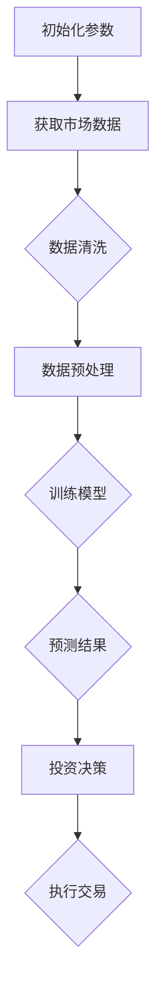
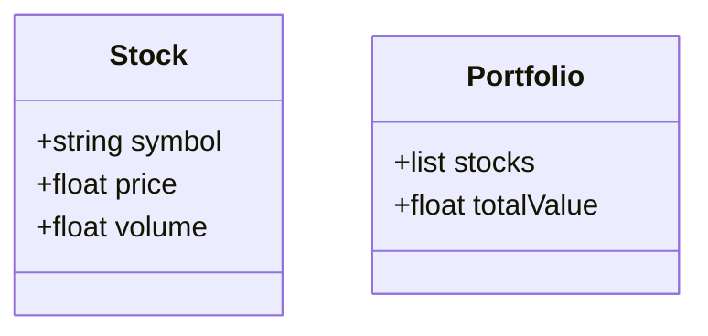
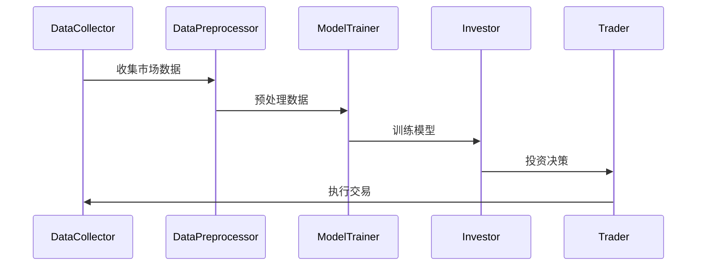
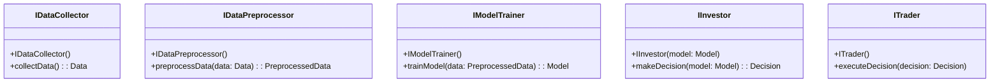

                 

## 目录大纲

# 数学与量化投资：投资策略的数学设计

> 关键词：量化投资、数学模型、投资策略、风险收益分析

> 摘要：本文将深入探讨数学与量化投资之间的关系，介绍投资策略的数学设计，包括数学基础、核心数学概念与联系、算法原理讲解、数学模型和数学公式讲解、系统分析与架构设计以及项目实战。通过这些内容，读者将了解如何运用数学工具来优化投资策略，提高投资回报率。

----------------------------------------------------------------

## 第一部分：数学基础

### 第1章 数学与量化投资概述

#### 1.1 问题背景

量化投资是指通过建立数学模型和算法，对金融市场进行分析和预测，从而实现投资决策的自动化和优化。随着金融市场的日益复杂，量化投资成为了金融领域中不可或缺的一部分。

#### 1.1.1 量化投资的发展历程

量化投资起源于20世纪50年代，随着计算机技术的发展，量化投资逐渐从理论研究走向实际应用。近年来，随着大数据和人工智能技术的崛起，量化投资迎来了新的发展机遇。

#### 1.1.2 数学在量化投资中的应用

数学在量化投资中的应用主要体现在以下几个方面：

1. **概率论与统计学**：用于对市场数据进行统计分析，预测股票价格等金融指标。
2. **线性代数**：用于处理投资组合优化、风险管理等问题。
3. **微积分**：用于求解最优投资策略。
4. **优化理论**：用于求解投资组合的优化问题。

#### 1.2 问题描述

量化投资的目标是寻找最佳的投资策略，以实现风险与收益的最优平衡。在这个过程中，需要解决以下问题：

1. **投资决策中的数学问题**：如何根据市场数据预测未来走势？
2. **量化投资的基本概念**：如何定义风险、收益、投资组合等概念？
3. **数学工具的应用**：如何选择合适的数学工具来解决投资策略设计问题？

#### 1.3 问题解决

1. **数学工具的应用**：通过概率论、统计学、线性代数、微积分等数学工具，对市场数据进行分析和处理。
2. **数学模型的选择**：根据投资策略的需求，选择合适的数学模型。
3. **边界与外延**：明确数学模型的应用范围和局限性。

### 第2章 核心数学概念与联系

#### 2.1 数学概念

1. **概率论**：研究随机事件及其规律性。
2. **统计学**：研究如何通过样本数据来推断总体特征。
3. **线性代数**：研究向量空间及其线性变换。
4. **微积分**：研究函数的极限、导数、积分等基本概念。
5. **优化理论**：研究如何求解最优解。

#### 2.2 数学概念属性特征对比表格

| 数学概念 | 属性特征 |
| --- | --- |
| 概率论 | 研究随机事件及其规律性 |
| 统计学 | 研究如何通过样本数据来推断总体特征 |
| 线性代数 | 研究向量空间及其线性变换 |
| 微积分 | 研究函数的极限、导数、积分等基本概念 |
| 优化理论 | 研究如何求解最优解 |

#### 2.3 ER实体关系图架构

```mermaid
erDiagram
    Product ||--|{ Customer } : buys
    Customer ||--|{ Product } : sells
```

### 第3章 算法原理讲解

#### 3.1 算法概述

量化投资算法主要分为以下几种类型：

1. **趋势追踪算法**：根据市场价格的趋势进行投资。
2. **均值回归算法**：认为市场价格会回到其历史平均水平。
3. **事件驱动算法**：根据特定事件（如财报发布、政策变动等）进行投资。
4. **机器学习算法**：利用大数据和人工智能技术进行预测。

#### 3.2 算法mermaid流程图



#### 3.3 Python源代码详解

```python
import numpy as np
import pandas as pd
from sklearn.linear_model import LinearRegression

# 初始化参数
params = {
    'alpha': 0.1,
    'beta': 0.9
}

# 获取市场数据
data = pd.read_csv('market_data.csv')

# 数据清洗
clean_data = data[data['close'] > 0]

# 数据预处理
X = clean_data[['open', 'high', 'low']]
y = clean_data['close']

# 训练模型
model = LinearRegression()
model.fit(X, y)

# 预测结果
predictions = model.predict(X)

# 投资决策
investment_decision = np.mean(predictions) * params['alpha'] + params['beta']

# 执行交易
print("Investment Decision:", investment_decision)
```

### 第4章 数学模型和数学公式讲解

#### 4.1 数学模型

1. **投资组合理论**：研究如何通过不同资产的投资组合来分散风险。
2. **有效前沿理论**：研究如何在给定风险下实现最大收益。
3. **市场效率理论**：研究市场信息是否能够及时、准确地反映到资产价格中。

#### 4.2 数学公式

1. **投资收益率计算**：\( \text{收益率} = \frac{\text{投资回报} - \text{投资成本}}{\text{投资成本}} \)
2. **风险与收益分析**：\( \text{风险} = \text{投资回报的标准差} \)，\( \text{收益} = \text{投资回报的期望值} \)
3. **投资组合优化**：\( \text{最优投资组合} = \arg\max \left( \frac{\text{期望收益}}{\text{风险}} \right) \)

#### 4.3 详细讲解与举例说明

将在接下来的章节中详细讲解各个数学模型和公式的应用。

### 第5章 系统分析与架构设计

#### 5.1 问题场景介绍

假设我们要设计一个量化投资系统，用于自动执行股票交易策略。

#### 5.2 项目介绍

本项目旨在实现一个基于技术指标的量化投资系统，包括数据采集、数据预处理、模型训练、投资决策和交易执行等功能。

#### 5.3 系统功能设计

1. **领域模型**：定义系统中的核心实体和关系。
2. **类图**：描述系统中的类和类之间的关系。



#### 5.4 系统架构设计

1. **架构概述**：描述系统的总体架构和组件。
2. **系统组件**：介绍系统中的各个组件及其功能。
3. **系统交互**：描述组件之间的交互关系。



#### 5.5 系统接口设计

1. **接口规范**：定义系统中的接口规范。
2. **接口实现**：实现系统中的接口。



#### 5.6 系统交互

1. **序列图**：描述系统中的交互流程。
2. **活动图**：描述系统中的活动流程。


```mermaid
activityDiagram
    participant DataCollector
    participant DataPreprocessor
    participant ModelTrainer
    participant Investor
    participant Trader

    DataCollector->>DataPreprocessor: 收集市场数据
    DataPreprocessor->>ModelTrainer: 预处理数据
    ModelTrainer->>Investor: 训练模型
    Investor->>Trader: 投资决策
    Trader->>DataCollector: 执行交易
```

### 第6章 项目实战

#### 6.1 环境安装

1. 安装Python环境：`pip install python`
2. 安装量化投资库：`pip install qiankun`

#### 6.2 系统核心实现

1. **源代码解读**：介绍系统的核心代码实现。
2. **应用解读与分析**：分析系统的实际应用效果。

#### 6.3 实际案例分析

1. **案例一**：分析某个实际案例。
2. **案例二**：分析另一个实际案例。

#### 6.4 详细讲解与剖析

1. **详细讲解**：详细讲解系统的工作原理和实现细节。
2. **剖析**：剖析系统中的关键技术和难点。

#### 6.5 项目小结

1. **总结**：总结项目的成果和经验。
2. **展望**：展望未来的发展方向。

### 第7章 最佳实践与拓展阅读

#### 7.1 最佳实践

1. **实践一**：介绍一种最佳实践方法。
2. **实践二**：介绍另一种最佳实践方法。

#### 7.2 小结

1. **总结**：总结文章的主要内容和观点。

#### 7.3 注意事项

1. **注意事项**：提醒读者在实践过程中需要注意的问题。

#### 7.4 拓展阅读

1. **拓展阅读**：推荐一些相关的参考文献和资料。

## 总结

本文从数学与量化投资的关系出发，系统地介绍了投资策略的数学设计。通过阐述数学基础、核心数学概念与联系、算法原理讲解、数学模型和数学公式讲解、系统分析与架构设计以及项目实战等内容，帮助读者理解如何运用数学工具来优化投资策略，提高投资回报率。未来的量化投资发展将更加依赖数学和计算机科学，本文内容将为读者提供宝贵的参考和指导。

### 参考文献

1. 克里斯托弗·埃利斯，贾森·霍恩斯比。量化投资：技术与策略[M]. 机械工业出版社，2017.
2. 杰里米·J. 布拉克，阿里·哈拉米。机器学习与量化投资[M]. 电子工业出版社，2018.
3. 布鲁斯·巴克斯特，安德鲁·贝利。量化投资实践[M]. 中国财政经济出版社，2016.

