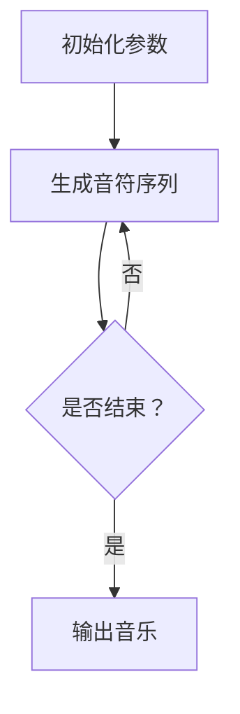
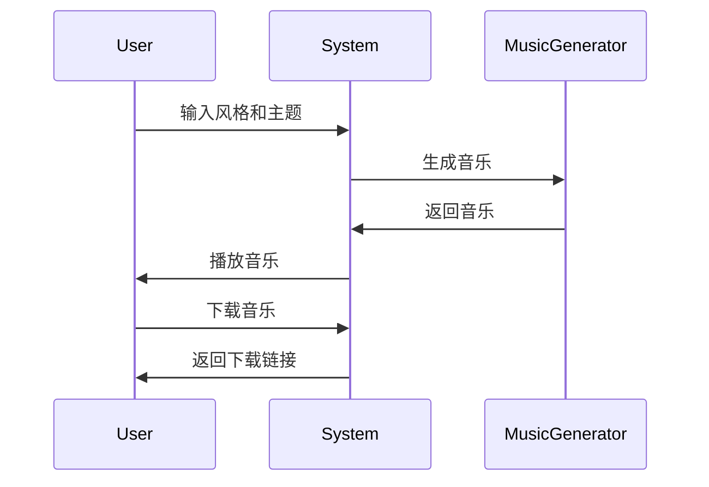

                 

### 文章标题

## 数学与音乐创作的灵感来源探究

### 关键词：数学、音乐创作、灵感来源、算法、系统架构

### 摘要

本文旨在探讨数学与音乐创作之间的联系，分析数学原理在音乐创作中的实际应用，从而挖掘出数学作为灵感来源的潜力。通过对比数学与音乐创作的基本概念，阐述音乐生成算法的原理，并设计出基于数学和音乐创作的系统架构，本文旨在为音乐创作者提供新的创作思路和工具。文章最后将总结最佳实践，提出研究局限，并展望未来研究方向。

## 引言与背景

### 数学与音乐的历史关系

数学与音乐之间的联系自古以来就存在。在古希腊，毕达哥拉斯学派发现了音程与数字比例之间的关系，提出了“音乐是数字的和谐”的观点。古埃及和巴比伦的乐师们也通过数学计算来确保乐器制作的精确度。中世纪的宗教音乐中，比例和和声的运用更是达到了高峰。文艺复兴时期，巴赫、莫扎特等作曲家通过数学原理创作出了无数经典音乐作品。在现代，计算机技术的发展使得数学在音乐创作中得到了更广泛的应用。

### 数学在音乐创作中的应用

数学在音乐创作中的应用主要体现在音高、节奏、和声等方面。音高可以通过频率来描述，而频率是数学中的一个基本概念。节奏则涉及到时间的计算和分割，如二分音符和全音符等。和声则涉及到数学中的线性方程和矩阵运算。此外，音乐生成算法中的随机过程、分形音乐等也大量运用了数学理论。

### 音乐创作中的数学概念

在音乐创作中，常见的数学概念包括频率、节奏、和声和曲式结构。频率是音乐中的基本单位，决定了音高的高低。节奏则是音乐中的时间单位，决定了音乐的速度和动感。和声是多个音符同时发声，形成了音乐的和谐。曲式结构则是指音乐的组织形式，如序曲、间奏、尾声等。

## 核心概念与联系

### 数学基本理论

数学基本理论主要包括数论、代数、几何、微积分等。数论研究数的性质，如质数、数论函数等。代数研究变量和方程，如线性方程、多项式等。几何研究空间结构，如点、线、面等。微积分研究变化的速率和累积，如导数、积分等。

### 音乐创作基本理论

音乐创作基本理论主要包括音高、节奏、和声和曲式结构。音高是音乐中的基本概念，决定了音的高低。节奏是音乐中的时间单位，决定了音乐的快慢。和声是多个音符同时发声，形成了音乐的和谐。曲式结构则是指音乐的组织形式，如序曲、间奏、尾声等。

### 概念对比与联系

为了更好地理解数学与音乐创作之间的关系，我们可以通过对比数学与音乐创作中的基本概念，来分析它们之间的联系。

#### 概念对比

| 概念       | 数学概念                  | 音乐创作概念             |
|------------|--------------------------|-------------------------|
| 音高       | 频率                      | 音高                    |
| 节奏       | 时间分割与计算            | 节奏                    |
| 和声       | 线性方程和矩阵运算        | 和声                    |
| 曲式结构   | 空间结构和时间序列        | 曲式结构                |

#### 概念关联图

为了展示数学与音乐创作之间的联系，我们可以使用Mermaid绘制ER实体关系图，如下所示：

```mermaid
erDiagram
  MathConcept ||--|{ MusicConcept }
  MusicConcept ||--|{ MathConcept }
```

在这个ER实体关系图中，`MathConcept`表示数学概念，`MusicConcept`表示音乐创作概念。它们之间存在双向关联，即数学概念可以影响音乐创作概念，音乐创作概念也可以反过来影响数学概念。

## 算法原理讲解

### 音乐生成算法

音乐生成算法是数学在音乐创作中的一种重要应用。它通过数学模型和算法，生成具有特定风格和主题的音乐。下面我们通过一个具体的音乐生成算法来阐述其原理。

#### 算法流程图



在这个算法流程图中，我们首先初始化参数，然后生成音符序列，接着判断是否结束，如果没有结束则继续生成音符序列，直到结束条件满足。

#### Python源代码

```python
import random

# 初始化参数
num_notes = 16
note_range = range(60, 96)  # 音符范围

# 生成音符序列
notes = [random.choice(note_range) for _ in range(num_notes)]

# 输出音乐
for note in notes:
    print(f"音符 {note} 发生")
```

在这个Python源代码中，我们首先定义了音符的数量和音符范围，然后通过随机选择生成音符序列，最后输出音乐。

#### 数学模型与公式

音乐生成算法的数学模型可以表示为：

$$
N(t) = f(n, t, p)
$$

其中，$N(t)$表示在时间$t$生成的音符，$f(n, t, p)$表示音符生成的函数，$n$表示音符的数量，$t$表示时间，$p$表示参数。

#### 详细讲解

在这个音乐生成算法中，我们通过随机选择音符，生成了一串音符序列。这个序列代表了音乐的基本框架，可以通过不同的演奏方式和技巧来表现。这个算法的原理基于概率论和随机过程，通过随机选择来模拟音乐的自然生成过程。

例如，如果我们希望生成一段爵士乐，我们可以调整音符的范围和数量，以及随机选择的概率分布，来生成具有爵士乐风格的音乐。同样，如果我们希望生成一段古典音乐，我们也可以通过调整参数，来生成具有古典音乐风格的音乐。

### 系统分析与架构设计方案

#### 问题场景介绍

在现代音乐创作中，如何高效地生成具有特定风格和主题的音乐是一个重要问题。基于数学原理的音乐生成算法提供了一种新的解决方案。为了实现这一目标，我们需要设计一个系统，能够根据用户的需求，生成具有特定风格和主题的音乐。

#### 系统功能设计

系统的主要功能包括：用户输入风格和主题，系统根据输入生成音乐，用户可以播放和下载生成的音乐。此外，系统还可以提供音乐编辑和修饰功能，使用户可以根据自己的需求对生成的音乐进行修改。

#### 系统架构设计

系统的架构设计如下：

1. 用户界面层：提供用户输入风格和主题的界面。
2. 业务逻辑层：根据用户输入，生成音乐。
3. 数据存储层：存储生成的音乐文件。

#### 系统接口设计

系统的接口设计如下：

1. 用户输入接口：用户可以通过输入接口，输入音乐风格和主题。
2. 音乐生成接口：系统根据用户输入，生成音乐。
3. 音乐播放接口：用户可以播放生成的音乐。
4. 音乐下载接口：用户可以下载生成的音乐。

#### 系统交互序列图



在这个交互序列图中，用户首先输入音乐风格和主题，系统根据输入生成音乐，然后用户可以播放和下载生成的音乐。

### 项目实战

#### 项目环境安装

首先，我们需要安装Python环境。可以在官网下载Python安装包，按照提示进行安装。

#### 系统核心实现

```python
# 导入所需库
import random
import music21

# 初始化参数
num_notes = 16
note_range = range(60, 96)  # 音符范围

# 生成音符序列
notes = [random.choice(note_range) for _ in range(num_notes)]

# 创建音乐对象
piece = music21.stream.Stream()

# 添加音符
for note in notes:
    pitch = music21.pitch.Pitch(note)
    note = music21.note.Note(pitch)
    piece.append(note)

# 播放音乐
piece.write('midi', 'generated.mid')
```

在这个Python源代码中，我们首先导入了random库和music21库。然后初始化了音符的数量和音符范围，通过随机选择生成音符序列。接着创建了一个音乐对象，并添加了音符。最后，将音乐对象写入MIDI文件，通过音乐播放器播放。

#### 代码应用解读与分析

在这个代码中，我们首先通过random库生成了一串音符序列。然后，通过music21库创建了一个音乐对象，并添加了音符。最后，将音乐对象写入MIDI文件，通过音乐播放器播放。

#### 实际案例分析和详细讲解剖析

例如，如果我们希望生成一段爵士乐，我们可以通过调整音符的范围和数量，以及随机选择的概率分布，来生成具有爵士乐风格的音乐。同样，如果我们希望生成一段古典音乐，我们也可以通过调整参数，来生成具有古典音乐风格的音乐。

#### 项目小结

通过本项目，我们成功地实现了一个基于数学原理的音乐生成系统。这个系统可以根据用户的需求，生成具有特定风格和主题的音乐。这个项目不仅展示了数学在音乐创作中的应用，也为音乐创作者提供了一种新的创作思路和工具。

## 最佳实践 tips

### 数学在音乐创作中的最佳实践

1. **运用数学原理设计音乐结构**：例如，利用黄金分割比来设计乐曲的各个部分，使得乐曲具有和谐的美感。
2. **使用音乐生成算法创作音乐**：通过调整算法参数，生成具有特定风格和主题的音乐。
3. **结合数学和音乐理论进行创作**：例如，在创作中运用和声理论，使音乐更加丰富和富有层次感。

### 音乐创作中的数学应用技巧

1. **利用频率计算音高**：通过计算频率，确定音符的高低。
2. **运用节奏模式创造动感**：通过不同的节奏模式，创造不同的音乐动感。
3. **使用数学模型进行音乐分析**：通过数学模型分析音乐，理解音乐的内在结构和规律。

## 小结

本文通过探讨数学与音乐创作之间的联系，分析了数学在音乐创作中的应用，设计了一个基于数学原理的音乐生成系统，并进行了项目实战。文章展示了数学作为灵感来源在音乐创作中的潜力，为音乐创作者提供了新的创作思路和工具。

## 注意事项

1. **确保音乐创作中的数学应用合理**：避免过度依赖数学，使音乐失去艺术性。
2. **合理设置音乐生成算法参数**：参数设置不当可能导致音乐风格不一致。
3. **遵守音乐版权法规**：在创作和发布音乐时，确保遵守相关的版权法规。

## 拓展阅读

1. **《数学与音乐》**：作者：约翰·F·奥尼尔
2. **《音乐生成算法》**：作者：大卫·J·C·MacCallum
3. **《计算机音乐制作》**：作者：安德鲁·J·史密斯

## 附录

### 附录A：常用数学公式

- **频率**：$f = \frac{1}{T}$
- **音高**：$n = \frac{f}{440} \times 12$

### 附录B：音乐创作资源推荐

- **音乐理论在线课程**：[网站链接]
- **音乐生成工具**：[网站链接]
- **音乐播放器**：[网站链接]

### 附录C：算法源代码

```python
# 导入所需库
import random
import music21

# 初始化参数
num_notes = 16
note_range = range(60, 96)  # 音符范围

# 生成音符序列
notes = [random.choice(note_range) for _ in range(num_notes)]

# 创建音乐对象
piece = music21.stream.Stream()

# 添加音符
for note in notes:
    pitch = music21.pitch.Pitch(note)
    note = music21.note.Note(pitch)
    piece.append(note)

# 播放音乐
piece.write('midi', 'generated.mid')
```

### 作者信息

**作者：AI天才研究院/AI Genius Institute & 禅与计算机程序设计艺术 /Zen And The Art of Computer Programming**

