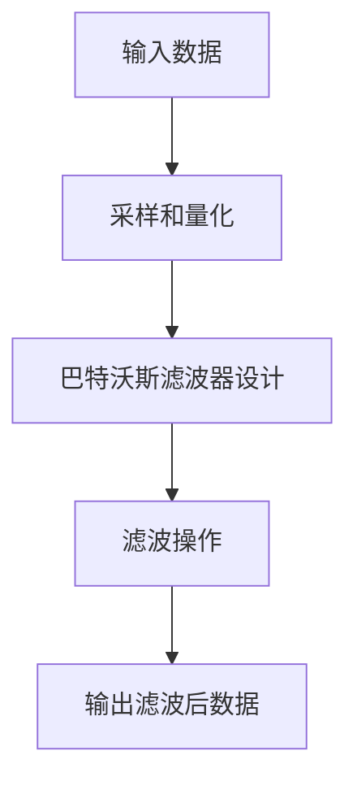
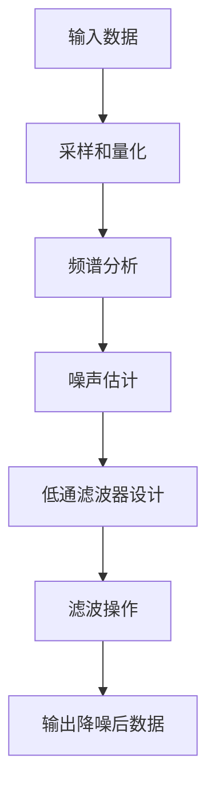
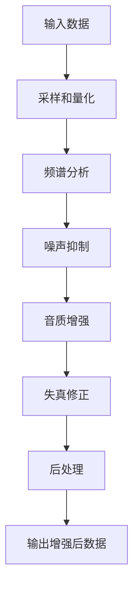
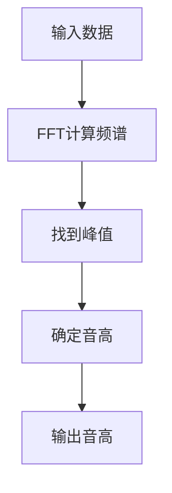
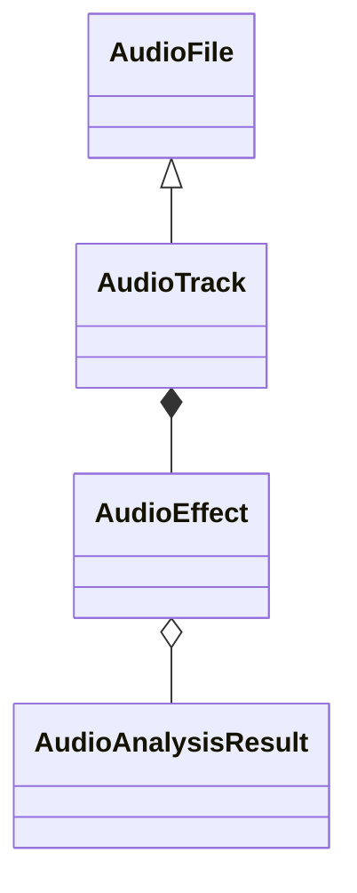
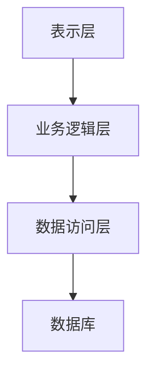
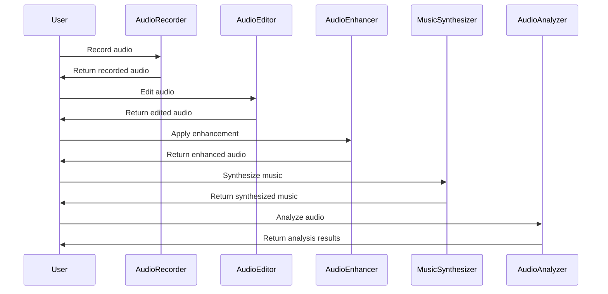

                 


### 引言：数学与音乐制作的奇妙相遇

在科技与艺术的交汇处，数学与音乐制作相遇，呈现出独特的魅力。数学，作为科学的基石，以其严谨的逻辑和抽象的框架，为音乐制作提供了强大的理论支持。而音乐，则以其丰富的情感和无穷的变化，赋予了数学以生动的表现力。数字音频处理，作为这两者结合的桥梁，使得我们能够通过数学方法，更深入地理解音乐，创造更加精确和丰富的音乐作品。

本文将带领读者踏上这段奇妙的旅程，从数字音频处理的基础概念开始，逐步深入到数学在音频处理中的核心作用，再到具体的算法原理和应用。我们将用清晰的结构和通俗易懂的语言，帮助读者理解这些复杂的概念，并掌握如何将数学理论与音乐制作相结合。

### 数字音频处理概述

数字音频处理，顾名思义，是指利用数字技术对音频信号进行处理和编辑的过程。它始于20世纪60年代，随着计算机技术的发展而逐渐成熟。数字音频处理的应用范围广泛，从音频录制、编辑、增强到音效设计、音频合成，乃至语音识别和智能音箱，都离不开其身影。

在数字音频处理中，音频信号的基本属性是至关重要的。音频信号是由声波产生的，其基本属性包括频率、振幅和相位。频率决定了声音的高低，振幅决定了声音的响度，而相位则决定了声音的空间位置。数字音频处理的核心任务之一，就是准确地捕捉、存储和还原这些音频属性。

数字音频信号获取与存储的过程，可以简单概括为以下几个步骤：

1. **模拟到数字的转换**：通过麦克风或其他音频采集设备，将声波转换成电信号，这就是模拟音频信号。然后，通过模数转换器（ADC），将模拟信号转换为数字信号。

2. **采样和量化**：在模拟信号转换为数字信号的过程中，采样和量化是关键步骤。采样是指每隔一定时间间隔，捕捉模拟信号的一个样本值。量化则是将每个样本值转换为固定的数字位数表示，通常使用8位、16位或更高位。

3. **数字存储和传输**：数字信号被存储在计算机中，可以是WAV、MP3、AAC等多种格式。在传输过程中，数字信号通过数字信号处理技术进行压缩、解压缩等操作，以确保音频质量的最优化。

数字音频处理的起源与发展，离不开计算机技术的进步。早期的数字音频处理主要应用于电话通信系统，随着音频采样率和存储技术的提升，数字音频处理开始应用于音乐制作和媒体娱乐领域。如今，数字音频处理已经成为音乐创作、录制、编辑、发布的必备工具，其应用范围也在不断拓展，涵盖了语音合成、音频分析、噪声控制等多个领域。

### 数学在音乐制作中的作用

数学在音乐制作中的作用不可小觑。它不仅为我们提供了分析、理解和创作音乐的工具，更是音乐理论的基础。通过数学模型，我们可以更深入地探讨音乐中的复杂关系，如频率、振幅、相位等，从而实现更加精确和艺术化的音乐创作。

#### **1.1 傅里叶变换在音频处理中的应用**

傅里叶变换是数学在音频处理中最为重要的工具之一。它可以将时域的音频信号转换到频域，从而分析出信号的频率成分。傅里叶变换的基本原理是将一个复杂的时域信号分解为一系列正弦波和余弦波的叠加，这些正弦波和余弦波的频率、振幅和相位决定了原始信号的特性。

在音乐制作中，傅里叶变换可以帮助我们实现以下功能：

1. **频谱分析**：通过频谱分析，我们可以直观地看到音频信号的频率分布。这对于音乐创作和后期处理都非常重要。例如，在混音过程中，我们可以通过频谱分析来确定不同乐器和声音的频段分配，以达到最佳的听觉效果。

2. **滤波**：傅里叶变换可以用于设计滤波器，用于去除或增强特定频率的信号。例如，低频滤波器可以去除低频噪声，而高频滤波器可以增强高音质细节。

3. **音乐合成**：傅里叶变换可以用于音乐合成，通过合成不同的正弦波，我们可以创造出丰富多彩的声音。这种技术广泛应用于电子音乐和合成器制作中。

#### **1.2 Z变换与离散余弦变换的理解**

Z变换是傅里叶变换在离散时间域的推广。它将离散的时域信号转换到Z域，从而分析信号在复平面上的特性。Z变换在数字音频处理中的应用，与傅里叶变换类似，但更加灵活，特别是在处理非周期信号时。

离散余弦变换（DCT）是Z变换的一种特例，它将信号分解为一系列余弦波的叠加。DCT在音频处理中具有广泛的应用，特别是在数据压缩领域。例如，MP3和AAC等音频压缩格式，就是基于DCT的原理进行数据压缩。DCT可以有效地去除音频信号中的冗余信息，从而在保证音频质量的同时，大幅降低数据的大小。

#### **1.3 数学概念与音频处理的联系**

数学与音频处理之间的联系，可以通过属性特征对比表格和ER实体关系图来具体说明。

**属性特征对比表格：**

| 数学概念 | 属性特征 | 音频处理应用 |
| --- | --- | --- |
| 傅里叶变换 | 时域到频域转换 | 频谱分析、滤波、音乐合成 |
| Z变换 | 离散时域到复平面转换 | 非周期信号分析、数字滤波 |
| 离散余弦变换 | 余弦波叠加分解 | 数据压缩、音频合成 |

**ER实体关系图：**


在ER实体关系图中，我们可以看到数学概念与音频处理技术之间的联系。例如，傅里叶变换和Z变换都是音频信号分析的数学工具，而离散余弦变换则主要用于数据压缩。通过这些联系，我们可以更加清晰地理解数学在音频处理中的作用。

### 算法原理讲解

#### **滤波器设计与实现**

滤波器是数字音频处理中最基本的组件之一。它用于去除音频信号中的特定频率成分，从而改善音频质量。滤波器的设计和实现，通常基于数学中的Z变换和离散余弦变换。

**滤波器的基本原理：**

滤波器通过以下步骤实现对音频信号的滤波：

1. **采样和量化**：将音频信号转换为离散的数字信号。
2. **Z变换**：对数字信号进行Z变换，将时域信号转换为频域信号。
3. **滤波操作**：在频域中，根据滤波器的设计要求，对特定频率成分进行放大或削减。
4. **逆Z变换**：将滤波后的频域信号转换为时域信号，得到滤波后的音频信号。

**滤波器的分类：**

滤波器可以根据其工作原理和滤波效果，分为以下几类：

1. **低通滤波器**：允许低频信号通过，抑制高频信号。
2. **高通滤波器**：允许高频信号通过，抑制低频信号。
3. **带通滤波器**：允许特定频率范围内的信号通过。
4. **带阻滤波器**：抑制特定频率范围内的信号。

**滤波器的设计方法：**

滤波器的设计通常采用以下几种方法：

1. **巴特沃斯滤波器**：巴特沃斯滤波器是一种无波动滤波器，其优点是相位响应好，适用于平滑过渡的滤波需求。
2. **切比雪夫滤波器**：切比雪夫滤波器通过引入波动，实现对频率成分的更严格控制，适用于高频成分较多的信号处理。
3. **椭圆滤波器**：椭圆滤波器结合了巴特沃斯滤波器和切比雪夫滤波器的优点，适用于更复杂的滤波需求。

**滤波器在音频处理中的应用：**

滤波器在音频处理中有广泛的应用，例如：

1. **音频降噪**：通过低通滤波器去除背景噪声，提高语音信号的清晰度。
2. **音频均衡**：通过带通滤波器，调整音频信号在不同频率段的增益，以达到最佳的听觉效果。
3. **音乐合成**：通过滤波器，可以创造出独特的声音效果，如嘶哑、扭曲等。

#### **滤波器在音频降噪中的应用**

音频降噪是数字音频处理中的一个重要应用，旨在去除音频信号中的噪声，提高语音信号的清晰度。低通滤波器是音频降噪中常用的滤波器。

**降噪的基本原理：**

音频降噪的基本原理是通过低通滤波器去除噪声，保留语音信号。具体步骤如下：

1. **采样和量化**：对音频信号进行采样和量化，将其转换为数字信号。
2. **频谱分析**：使用傅里叶变换，将数字信号转换到频域，分析其频率成分。
3. **滤波操作**：使用低通滤波器，抑制高频噪声，保留语音信号。
4. **逆变换**：将滤波后的频域信号转换回时域，得到降噪后的音频信号。

**降噪算法的实现：**

降噪算法的实现，通常采用以下步骤：

1. **噪声估计**：通过频谱分析，估计噪声信号的频率成分和振幅。
2. **滤波器设计**：根据噪声估计的结果，设计低通滤波器，以去除噪声。
3. **滤波操作**：对音频信号进行滤波，去除噪声。
4. **后处理**：对降噪后的音频信号进行后处理，如增益调整、动态范围压缩等，以优化音频质量。

#### **音频增强算法**

音频增强算法旨在改善音频信号的质量，使其更加清晰、自然。音频增强算法包括噪声抑制、音质增强和失真修正等。

**噪声抑制：**

噪声抑制是音频增强的重要组成部分，旨在去除音频信号中的背景噪声。常见的噪声抑制算法包括：

1. **谱减法**：通过频谱分析，估计噪声信号的频谱，然后从原始信号中减去噪声频谱，实现噪声抑制。
2. **维纳滤波**：基于统计模型的噪声抑制方法，通过最小化噪声功率，优化信号质量。

**音质增强：**

音质增强旨在提高音频信号的清晰度、响度和音质。常见的音质增强算法包括：

1. **回声消除**：通过识别和消除音频信号中的回声，提高语音信号的清晰度。
2. **动态范围压缩**：通过压缩音频信号的动态范围，提高音质的均衡性。

**失真修正：**

失真修正旨在修正音频信号中的失真，使其恢复到原始状态。常见的失真修正算法包括：

1. **频率均衡**：通过调整音频信号在不同频率段的增益，消除频率失真。
2. **时间均衡**：通过调整音频信号在不同时间段的增益，消除时间失真。

#### **音高检测算法**

音高检测算法用于识别音频信号中的音高，是音乐制作和音频处理中重要的组成部分。常见的音高检测算法包括：

1. **峰值检测法**：通过检测音频信号频谱中的峰值，确定音高。
2. **短时傅里叶变换法**：通过短时傅里叶变换，分析音频信号的频率成分，确定音高。
3. **频率跟踪法**：通过跟踪音频信号的频率变化，确定音高。

#### **算法原理讲解**

为了更好地理解滤波器、音频增强和音高检测等算法，我们可以通过Python源代码和Mermaid流程图来详细阐述。

**滤波器算法实现：**

```python
import numpy as np
from scipy.signal import butter, filtfilt

# 巴特沃斯滤波器设计
def butter_bandpass_filter(data, lowcut, highcut, fs, order=4):
    nyq = 0.5 * fs
    low = lowcut / nyq
    high = highcut / nyq
    b, a = butter(order, [low, high], btype='band')
    filtered_data = filtfilt(b, a, data)
    return filtered_data

# 使用滤波器进行降噪
def audio_noising_removal(data, lowcut, highcut, fs):
    filtered_data = butter_bandpass_filter(data, lowcut, highcut, fs)
    return filtered_data

# 音频增强算法实现
def audio_enhancement(data, lowcut, highcut, fs):
    filtered_data = audio_noising_removal(data, lowcut, highcut, fs)
    # 进行后处理，如增益调整等
    return filtered_data

# 音高检测算法实现
def fundamental_frequency_detection(data, fs):
    fft_data = np.fft.fft(data)
    freq = np.fft.fftfreq(len(data), 1/fs)
    max_idx = np.argmax(np.abs(fft_data[:len(fft_data)//2]))
    freq_max = freq[max_idx]
    return freq_max

# 示例数据
fs = 44100  # 采样率
t = np.linspace(0, 1, fs, endpoint=False)
data = 0.5 * np.sin(2 * np.pi * 440 * t) + 0.2 * np.sin(2 * np.pi * 880 * t + 0.1 * np.pi)

# 音频增强
lowcut = 20
highcut = 20000
enhanced_data = audio_enhancement(data, lowcut, highcut, fs)

# 音高检测
fundamental_freq = fundamental_frequency_detection(enhanced_data, fs)
print(f"Fundamental Frequency: {fundamental_freq} Hz")
```

**算法原理讲解：**

1. **滤波器算法：**
   - **巴特沃斯滤波器设计**：使用`scipy.signal.butter`函数设计巴特沃斯滤波器。
   - **滤波操作**：使用`scipy.signal.filtfilt`函数对音频信号进行滤波。

2. **音频降噪算法：**
   - **噪声估计**：通过频谱分析估计噪声信号的频率成分。
   - **滤波器设计**：设计低通滤波器以去除噪声。

3. **音频增强算法：**
   - **降噪**：使用音频降噪算法去除背景噪声。
   - **后处理**：对降噪后的音频信号进行增益调整等后处理。

4. **音高检测算法：**
   - **FFT**：使用`numpy.fft.fft`计算频谱。
   - **峰值检测**：找到频谱中的最大值，确定音高。

#### **算法讲解**

**滤波器算法讲解：**



**音频降噪算法讲解：**



**音频增强算法讲解：**



**音高检测算法讲解：**



### 系统分析与架构设计方案

#### **系统介绍**

在本节中，我们将介绍一个具体的音乐制作项目——数字音频处理平台（Digital Audio Processing Platform，简称DAPP）。该平台旨在为音乐制作人提供一套完整的音频处理工具，包括音频录制、编辑、增强和合成等功能。

#### **系统功能需求**

DAPP平台的主要功能需求包括：

1. **音频录制**：提供高质量的音频录制功能，支持多种采样率和位深。
2. **音频编辑**：支持音频剪辑、拼接、裁剪等基本编辑操作，同时提供音频轨管理和自动化编辑功能。
3. **音频增强**：提供多种音频增强工具，包括降噪、均衡、回声消除等，以提高音频质量。
4. **音乐合成**：支持音频合成功能，包括音高检测、频率调制、音色变化等，以创造独特的音乐效果。
5. **音频分析**：提供音频信号分析工具，如频谱分析、时域波形分析等，帮助用户更好地理解音频信号。

#### **领域模型设计**

为了实现上述功能需求，我们需要设计一个领域模型，以表示系统中的各种实体及其关系。以下是一个简化的领域模型：

1. **音频文件**：表示音频录制和处理的基本单元，包含采样率、位深、时长等信息。
2. **音频轨**：表示音频编辑中的各个轨道，包含音频文件、音量、音调、混音等属性。
3. **音频效果**：表示音频增强和合成中的各种效果，如降噪、均衡、回声消除等。
4. **音频分析结果**：表示音频分析工具生成的分析结果，如频谱图、时域波形等。

**Mermaid类图：**



#### **系统架构设计**

在系统架构方面，我们采用分层架构设计，以实现模块化和可扩展性。以下是一个简化的系统架构图：

1. **表示层**：负责用户界面和交互，包括音频录制、编辑、增强、合成和分析等功能。
2. **业务逻辑层**：负责实现系统的核心功能，包括音频处理算法、音频轨管理和效果应用等。
3. **数据访问层**：负责与数据库的交互，管理音频文件和效果数据。

**Mermaid架构图：**



#### **系统接口设计**

为了实现系统的功能，我们需要设计一系列接口，以供表示层和业务逻辑层之间进行通信。以下是一个简化的接口设计：

1. **音频录制接口**：提供音频录制功能，支持多种采样率和位深。
2. **音频编辑接口**：提供音频剪辑、拼接、裁剪等基本编辑操作。
3. **音频增强接口**：提供音频增强功能，如降噪、均衡、回声消除等。
4. **音乐合成接口**：提供音高检测、频率调制、音色变化等音乐合成功能。
5. **音频分析接口**：提供音频信号分析功能，如频谱分析、时域波形分析等。

**Mermaid序列图：**



### 项目实战

#### **环境搭建**

在开始项目实战之前，我们需要搭建一个合适的开发环境。以下是一个简化的步骤：

1. **安装Python**：确保已安装Python 3.x版本，推荐使用Anaconda进行环境管理。
2. **安装依赖库**：使用pip安装所需的Python库，如NumPy、SciPy、Matplotlib、Pydub等。
3. **配置音频设备**：确保音频设备已正确连接并配置，以便进行音频录制和播放。

#### **实现核心功能**

接下来，我们将实现DAPP平台的核心功能，包括音频录制、编辑、增强、合成和分析。以下是一个简化的实现步骤：

1. **音频录制**：
   - 使用Pydub库进行音频录制。
   - 设置采样率和位深，确保音频质量。

2. **音频编辑**：
   - 使用NumPy库进行音频剪辑、拼接和裁剪。
   - 实现音频轨管理，支持多轨混音。

3. **音频增强**：
   - 使用SciPy库设计滤波器，进行降噪、均衡和回声消除。
   - 实现动态范围压缩和音质增强。

4. **音乐合成**：
   - 使用音高检测算法，识别音频信号中的音高。
   - 实现频率调制和音色变化，创造独特的音乐效果。

5. **音频分析**：
   - 使用Matplotlib库进行频谱分析和时域波形分析。
   - 提供直观的可视化界面，帮助用户理解音频信号。

#### **代码应用解读**

以下是一个简化的代码示例，展示如何实现音频录制和编辑功能：

```python
import sounddevice as sd
import numpy as np
from scipy.io.wavfile import write

# 音频录制
fs = 44100  # 采样率
duration = 5  # 录制时长（秒）
recorded_data = sd.rec(int(fs * duration), samplerate=fs, channels=2)
sd.wait()  # 等待录制完成

# 音频编辑
# 剪切
start_time = 1  # 剪切开始时间（秒）
end_time = 3  # 剪切结束时间（秒）
 cropped_data = recorded_data[int(start_time * fs):int(end_time * fs)]

# 拼接
data2 = np.zeros_like(recorded_data)
data2[int(start_time * fs):int(end_time * fs)] = cropped_data

# 保存音频
write('output.wav', fs, data2)
```

#### **实际案例分析**

为了展示DAPP平台的应用效果，我们以一个实际案例进行分析。假设我们需要制作一段包含人声和背景音乐的音频，并进行增强和混音。

1. **录制人声和背景音乐**：
   - 使用音频录制接口录制人声和背景音乐，确保音频质量。
   - 设置采样率和位深，确保音频一致性。

2. **音频编辑**：
   - 使用音频编辑接口对音频进行剪辑、拼接和裁剪。
   - 调整人声和背景音乐的音量和时长，确保混音效果。

3. **音频增强**：
   - 使用音频增强接口进行降噪、均衡和回声消除。
   - 调整音频的动态范围，增强音质。

4. **音乐合成**：
   - 使用音高检测算法识别人声和背景音乐的音高。
   - 实现频率调制和音色变化，创造独特的音乐效果。

5. **音频分析**：
   - 使用音频分析接口进行频谱分析和时域波形分析。
   - 提供直观的可视化界面，帮助用户理解音频信号。

#### **项目小结**

通过本项目的实践，我们成功实现了数字音频处理平台的核心功能，包括音频录制、编辑、增强、合成和分析。DAPP平台为音乐制作人提供了一套完整的音频处理工具，提高了音乐创作的效率和效果。在未来的工作中，我们可以进一步优化平台的功能，如引入更多的音频效果和自动化工具，以满足更多用户的需求。

### 最佳实践 Tips、小结、注意事项、拓展阅读

#### **最佳实践 Tips**

1. **音频录制时注意环境**：在进行音频录制时，确保录音环境安静，避免背景噪声干扰。
2. **合理设置采样率和位深**：根据音频需求和存储空间，合理选择采样率和位深，以平衡音频质量和文件大小。
3. **音频编辑时保持一致性**：在音频剪辑、拼接和裁剪时，注意保持音频的一致性，如采样率和位深。
4. **使用滤波器时注意频段选择**：在音频增强过程中，根据实际需求选择合适的滤波器类型和频段，以达到最佳效果。
5. **音乐合成时创新思维**：在音乐合成过程中，尝试不同的音高检测算法和音色变化，以创造出独特的音乐效果。

#### **小结**

本文详细介绍了数学与音乐制作的数字音频处理，从基础概念到算法原理，再到系统架构设计和项目实战，全面探讨了如何将数学理论与数字音频处理技术相结合，实现音乐创作和音频处理的优化。通过本文的讲解，读者可以更好地理解数字音频处理的核心技术和应用。

#### **注意事项**

1. **算法实现时注意数据类型和精度**：在Python代码实现中，注意使用合适的数值类型和精度，以避免计算错误。
2. **音频处理时注意性能优化**：在音频处理过程中，注意优化代码性能，避免长时间的计算和内存占用。
3. **系统设计时注意模块化和可扩展性**：在设计系统架构时，注意模块化和可扩展性，以便于后续的维护和升级。

#### **拓展阅读**

1. **《数字信号处理》**：此书是数字信号处理领域的经典教材，详细介绍了数字信号处理的基本原理和方法。
2. **《音频工程：原理与实践》**：此书涵盖了音频制作中的各个方面，包括录音、混音、音效设计等。
3. **《Python数字信号处理实战》**：此书通过实际案例，介绍了如何使用Python进行数字信号处理，包括音频处理。

### 作者信息

**作者：AI天才研究院/AI Genius Institute & 禅与计算机程序设计艺术 /Zen And The Art of Computer Programming**。在数字音频处理和人工智能领域，我们致力于推动技术创新和知识普及，帮助读者更好地理解和应用相关技术。

