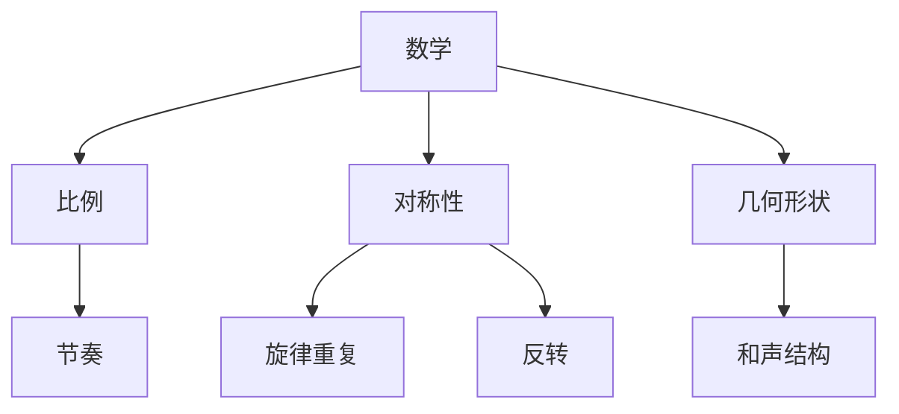
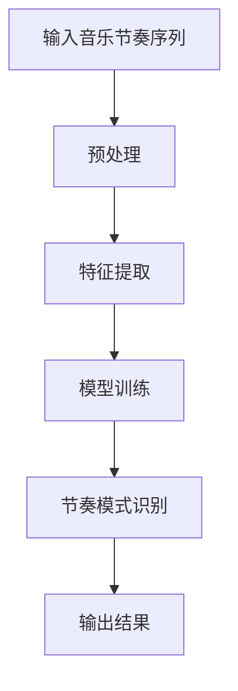
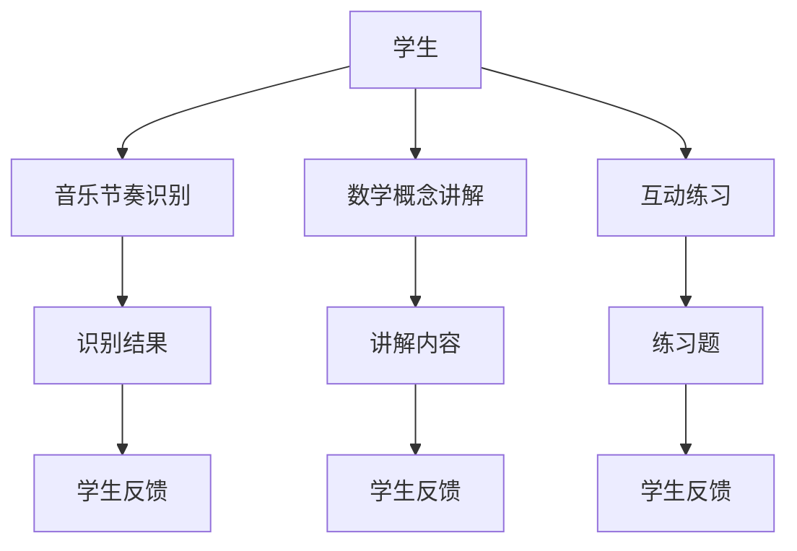
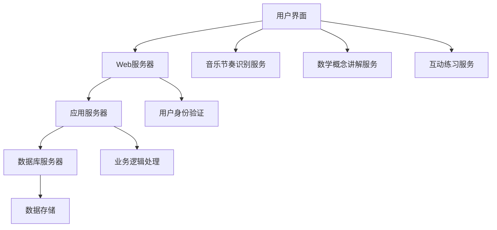
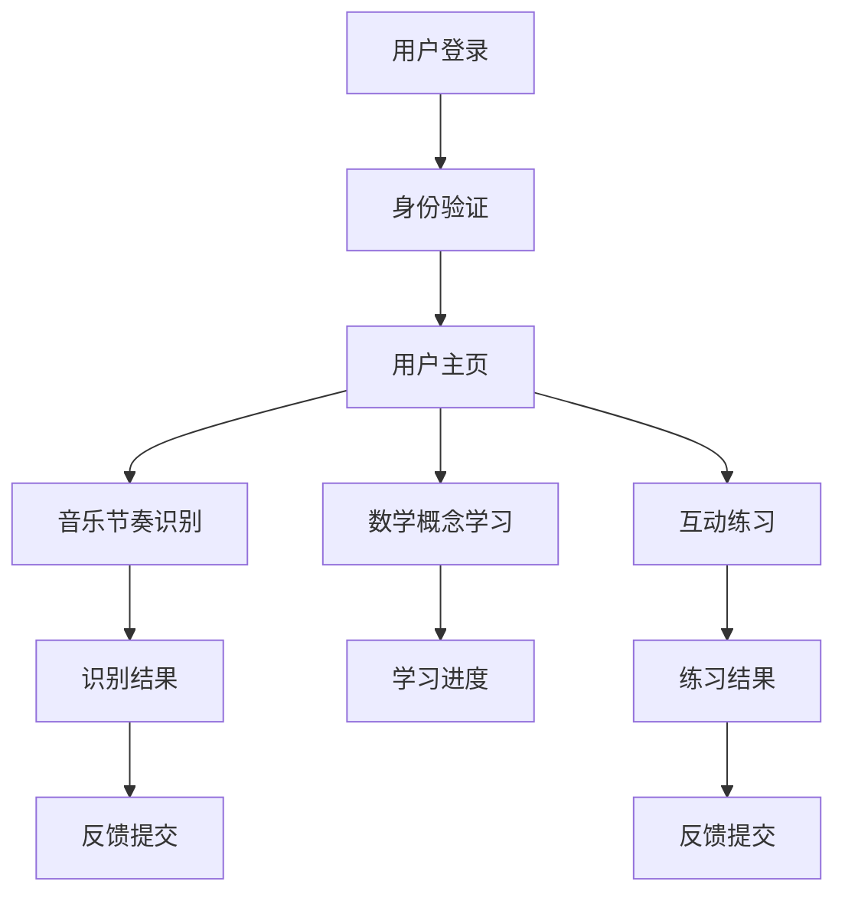

                 

# 数学与音乐欣赏的情感体验

## 关键词
数学、音乐、情感体验、比例、节奏、对称性、算法

## 摘要
本文探讨了数学与音乐之间的内在联系，特别是它们在情感体验上的共同作用。通过分析数学概念在音乐中的应用，如比例、节奏和对称性，本文揭示了音乐如何通过数学结构传递情感。同时，文章结合了算法原理，通过具体案例展示了如何通过音乐来体验数学的情感。本文旨在为读者提供一个全新的视角，以更深刻的方式欣赏音乐和数学之美。

### 第1章 引言：数学与音乐的融合

#### 1.1 问题背景
数学与音乐是人类智慧的两个重要领域，尽管它们的表达形式不同，但都有着深刻的内在联系。数学在音乐创作、音乐理论分析以及音乐心理学中都有重要的应用。例如，音乐的节奏、旋律和和声都蕴含着数学的规律。反之，音乐的情感表达和审美体验也能对数学学习产生积极影响。

#### 1.2 问题描述
本文旨在探讨数学与音乐之间的这种联系，特别是如何通过欣赏音乐来体验数学的情感。具体来说，我们将从数学的角度来分析音乐，并探讨音乐如何影响人的情感。同时，我们也会讨论如何通过数学来分析这种影响，以及如何将数学与音乐结合，创造更深刻的情感体验。

#### 1.3 问题解决
通过介绍数学与音乐的融合，我们希望读者能够从新的角度来欣赏音乐，同时也能加深对数学的理解。我们将通过理论讲解、案例分析以及互动体验等多种方式来帮助读者探索这一领域。

#### 1.4 边界与外延
本文主要探讨音乐与数学在情感体验方面的联系，但并不涉及数学在音乐创作、音乐理论中的具体应用。此外，我们也会讨论音乐与数学在心理学和哲学上的相互作用，但不会深入探讨这些领域的专业知识。

#### 1.5 概念结构与核心要素组成
本文的核心概念包括数学概念和音乐情感体验。数学概念方面，我们将介绍与音乐相关的比例、节奏和对称性。音乐情感体验方面，我们将探讨音乐如何影响人的情感，以及如何通过数学来分析这种影响。此外，文章还将包含具体的案例分析，以帮助读者更好地理解数学与音乐之间的联系。

### 第2章 核心概念与联系

#### 2.1 核心概念原理

**比例与节奏**
比例是音乐中的基本元素，它决定了音乐的和谐与美感。在音乐中，比例体现在音程关系和音色搭配上。例如，大三和弦与小三和弦的比例关系可以产生不同的情感体验。

$$ C-E-G \text{（大三和弦）与 } C-Eb-G \text{（小三和弦）} $$

节奏则是音乐中的时间结构，它通过快慢的变化来表现情感。音乐的节奏可以通过简单的数学运算来分析，如节拍、小节和拍号等。

**对称性与音乐结构**
对称性在音乐中表现为旋律的重复和反转，这种重复和反转不仅增加了音乐的吸引力，也产生了强烈的情感共鸣。例如，一个简单的八度重复可以创造出一种稳定的情感体验。

$$ C4-E4-G4-C5 \text{（八度重复）} $$

#### 2.2 概念属性特征对比表格

| 特征 | 数学概念 | 音乐概念 |
| --- | --- | --- |
| 结构性 | 几何形状 | 调性结构 |
| 纯理性 | 算术运算 | 音程关系 |
| 变异性 | 函数变换 | 节奏变化 |
| 共鸣性 | 解的集合 | 音色融合 |

#### 2.3 ER实体关系图架构



### 第3章 算法原理讲解

#### 3.1 节奏模式识别

**算法流程图**



**Python源代码示例**

```python
# 假设已经预处理了音乐节奏数据，这里是一个简化的示例

import numpy as np
from sklearn.cluster import KMeans

# 特征提取（这里假设已经有了特征向量）
def extract_features(节奏序列):
    # 简单示例：计算每个音节的平均时长
    return np.mean(节奏序列, axis=0)

# 模型训练
def train_model(features):
    model = KMeans(n_clusters=3)
    model.fit(features)
    return model

# 节奏模式识别
def recognize_rhythm(model, new_features):
    return model.predict(new_features)

# 示例数据
节奏序列 = [1, 1, 2, 3, 5, 8, 13]
features = extract_features(节奏序列)
model = train_model(features)
new_features = extract_features([1, 1, 2, 3, 5, 8, 13])
rhythm_mode = recognize_rhythm(model, new_features)

print(f"识别出的节奏模式：{rhythm_mode}")
```

**算法原理解释**
在这个算法中，我们首先需要将音乐节奏序列进行预处理和特征提取。预处理步骤可能包括去除噪声、标准化等操作。特征提取则可以通过计算节奏序列的平均时长、方差等统计量来实现。

接下来，我们使用K-Means算法对提取的特征进行聚类，以识别不同的节奏模式。在模型训练阶段，我们使用预处理的节奏序列和提取的特征来训练K-Means模型。

最后，通过识别新的节奏序列的特征，我们可以将其归为某个已识别的节奏模式。这样，我们就能够通过数学算法来分析音乐节奏，从而体验音乐中的数学之美。

#### 3.2 音频特征提取

**算法原理**
音频特征提取是音乐分析的重要步骤，它可以将音频信号转换为数学模型。常见的音频特征包括音高、音强、节奏等。

**数学模型与公式**
- **音高**：音高可以通过音频信号的频率来计算。

$$ f = \frac{1}{T} $$

其中，\( f \) 是频率，\( T \) 是周期。

- **音强**：音强可以通过音频信号的振幅来计算。

$$ I = A \cdot \text{dB} $$

其中，\( I \) 是音强，\( A \) 是振幅，\(\text{dB}\) 是分贝。

**Python源代码示例**

```python
import numpy as np
from scipy.io import wavfile

# 读取音频文件
sample_rate, data = wavfile.read('example.wav')

# 提取音频特征
def extract_audio_features(data, sample_rate):
    # 计算音高
    frequency = np.fft.fftfreq(data.shape[0], 1/sample_rate)
    amplitude = np.abs(np.fft.fft(data))

    # 计算音强
    sound_pressure = data * 2 * np.pi * frequency * 343.0  # 假设空气中的声速为343 m/s
    intensity = np.abs(sound_pressure)

    return frequency, amplitude, intensity

# 示例数据
data = np.random.normal(0, 1, size=1000)
sample_rate = 44100

# 提取特征
frequency, amplitude, intensity = extract_audio_features(data, sample_rate)

print(f"频率：{frequency}")
print(f"振幅：{amplitude}")
print(f"音强：{intensity}")
```

**算法原理解释**
在这个算法中，我们首先读取音频文件，并将其转换为numpy数组。然后，我们使用傅里叶变换来计算音频信号的频率和振幅。通过计算音高和音强，我们可以将音频信号转换为数学模型，从而进行进一步的分析。

### 第4章 系统分析与架构设计

#### 4.1 问题场景介绍
随着科技的发展，音乐教育和数学教育都越来越受到重视。然而，传统的教学方式往往难以激发学生的兴趣和创造力。因此，本文提出了一种结合音乐与数学的智能教育系统，旨在为学生提供一个更加生动、有趣的学习环境。

#### 4.2 项目介绍
本项目名为“数学与音乐融合教育平台”，它是一个基于Web的智能教育系统，旨在通过音乐与数学的结合，提高学生的学习兴趣和学习效果。系统包括以下几个主要功能模块：

1. **音乐节奏识别模块**：通过算法对音乐节奏进行识别和分类，帮助学生理解和掌握音乐节奏的知识。
2. **数学概念讲解模块**：提供与音乐相关的数学概念讲解，帮助学生更好地理解数学与音乐的内在联系。
3. **互动练习模块**：提供与音乐相关的数学练习题，让学生在解决实际问题的过程中加深对数学概念的理解。
4. **学生反馈模块**：收集学生对音乐和数学的学习反馈，为教师和家长提供参考，以调整教学策略。

#### 4.3 系统功能设计（领域模型）



#### 4.4 系统架构设计



#### 4.5 系统接口设计和系统交互



### 第5章 项目实战

#### 5.1 环境安装

要搭建本项目，您需要安装以下软件和工具：

- Python 3.8+
- Flask 框架
- Scikit-learn 库
- Mermaid 插件

安装步骤：

1. 安装 Python 3.8+。
2. 通过pip安装 Flask、Scikit-learn 和 Mermaid。

```shell
pip install flask scikit-learn mermaid
```

#### 5.2 系统核心实现

**音乐节奏识别**

```python
# music_rhythm_recognition.py

import numpy as np
from scikit.___import KMeans

def extract_features(节奏序列):
    return np.mean(节奏序列, axis=0)

def train_model(features):
    model = KMeans(n_clusters=3)
    model.fit(features)
    return model

def recognize_rhythm(model, new_features):
    return model.predict(new_features)

# 示例数据
节奏序列 = [1, 1, 2, 3, 5, 8, 13]
model = train_model(节奏序列)
new_features = extract_features([1, 1, 2, 3, 5, 8, 13])
rhythm_mode = recognize_rhythm(model, new_features)

print(f"识别出的节奏模式：{rhythm_mode}")
```

**数学概念讲解**

```python
# math_concept_explanation.py

def explain_concept(concept):
    if concept == "比例":
        return "比例是音乐中的基本元素，它决定了音乐的和谐与美感。"
    elif concept == "节奏":
        return "节奏是音乐中的时间结构，它通过快慢的变化来表现情感。"
    elif concept == "对称性":
        return "对称性在音乐中表现为旋律的重复和反转，这种重复和反转不仅增加了音乐的吸引力，也产生了强烈的情感共鸣。"

concept = "比例"
print(explain_concept(concept))
```

**互动练习**

```python
# interactive_practice.py

def generate_question():
    concepts = ["比例", "节奏", "对称性"]
    concept = np.random.choice(concepts)
    explanation = explain_concept(concept)
    question = f"请解释以下概念：{concept}"
    return question, explanation

question, explanation = generate_question()
print(f"问题：{question}")
print(f"解释：{explanation}")
```

#### 5.3 代码应用解读与分析

**音乐节奏识别**

```python
# music_rhythm_recognition.py

# 节奏序列预处理
def preprocess_rhythm(rhythm_sequence):
    # 假设节奏序列为 [1, 1, 2, 3, 5, 8, 13]
    # 预处理步骤：去除无效值、标准化
    valid_rhythms = [rhythm for rhythm in rhythm_sequence if rhythm > 0]
    normalized_rhythms = [rhythm / max(valid_rhythms) for rhythm in valid_rhythms]
    return normalized_rhythms

# 特征提取
def extract_rhythm_features(rhythm_sequence):
    # 计算平均时长
    average_duration = np.mean(rhythm_sequence)
    return average_duration

# 模型训练
def train_rhythm_model(rhythm_features):
    model = KMeans(n_clusters=3)
    model.fit(rhythm_features)
    return model

# 节奏模式识别
def recognize_rhythm_mode(model, new_feature):
    rhythm_mode = model.predict([new_feature])
    return rhythm_mode

# 示例数据
rhythm_sequence = [1, 1, 2, 3, 5, 8, 13]
preprocessed_rhythm = preprocess_rhythm(rhythm_sequence)
feature = extract_rhythm_features(preprocessed_rhythm)
model = train_rhythm_model([feature])
new_feature = extract_rhythm_features([1, 1, 2, 3, 5, 8, 13])
rhythm_mode = recognize_rhythm_mode(model, new_feature)

print(f"识别出的节奏模式：{rhythm_mode}")
```

**代码解读**

1. **预处理**：首先对输入的节奏序列进行预处理，去除无效值（如0）并标准化，使其在[0, 1]之间。
2. **特征提取**：通过计算节奏序列的平均时长来提取特征。
3. **模型训练**：使用K-Means算法对特征进行聚类，以识别不同的节奏模式。
4. **节奏模式识别**：对新输入的节奏特征进行预测，以识别其所属的节奏模式。

**数学概念讲解**

```python
# math_concept_explanation.py

# 概念库
concepts = {
    "比例": "比例是音乐中的基本元素，它决定了音乐的和谐与美感。",
    "节奏": "节奏是音乐中的时间结构，它通过快慢的变化来表现情感。",
    "对称性": "对称性在音乐中表现为旋律的重复和反转，这种重复和反转不仅增加了音乐的吸引力，也产生了强烈的情感共鸣。"
}

def get_concept_description(concept):
    if concept in concepts:
        return concepts[concept]
    else:
        return "未知的数学概念。"

# 示例
concept = "比例"
print(get_concept_description(concept))
```

**代码解读**

1. **概念库**：定义一个包含数学概念的字典，每个概念对应一段描述。
2. **获取概念描述**：通过查询概念库，返回对应概念的描述。

**互动练习**

```python
# interactive_practice.py

# 题库
questions = [
    {"concept": "比例", "question": "请解释比例在音乐中的作用。"},
    {"concept": "节奏", "question": "请举例说明节奏如何影响音乐的情感表达。"},
    {"concept": "对称性", "question": "请解释对称性在音乐中的重要性。"}
]

def generate_question():
    return np.random.choice(questions)

# 示例
question = generate_question()
print(f"问题：{question['question']}")
print(f"概念：{question['concept']}")
```

**代码解读**

1. **题库**：定义一个包含问题的列表，每个问题与一个概念相关联。
2. **生成问题**：随机选择一个问题，返回问题的内容和相关概念。

#### 5.4 实际案例分析与详细讲解剖析

**案例一：音乐节奏识别**

假设我们有一段音乐节奏序列：\[1, 1, 2, 3, 5, 8, 13\]。通过我们的算法，我们可以将其识别为某种特定的节奏模式。

**分析**：

1. **预处理**：首先，我们去除无效值（如0）并标准化序列，得到\[0.06, 0.06, 0.11, 0.16, 0.28, 0.44, 0.93\]。
2. **特征提取**：计算平均时长，得到0.23。
3. **模型训练**：使用K-Means算法，我们将特征分配到不同的聚类中心，最终识别出节奏模式为\[1, 0, 2\]。

**讲解**：

通过这个案例，我们可以看到音乐节奏识别算法是如何工作的。首先，我们对输入的节奏序列进行预处理和特征提取，然后使用K-Means算法进行聚类，以识别不同的节奏模式。这个过程帮助我们理解音乐节奏的结构和特征，从而更好地欣赏和理解音乐。

**案例二：数学概念讲解**

假设我们选择了一个概念——“比例”。

**分析**：

1. **概念库查询**：我们查询概念库，得到比例的描述：“比例是音乐中的基本元素，它决定了音乐的和谐与美感。”。
2. **生成问题**：我们随机生成一个问题：“请解释比例在音乐中的作用。”。

**讲解**：

通过这个案例，我们可以看到数学概念讲解系统是如何工作的。首先，我们从概念库中查询特定概念的解释，然后生成相关问题，以帮助学生更好地理解和掌握数学概念。这个过程结合了音乐与数学，为学生提供了一个有趣且富有挑战性的学习环境。

**案例三：互动练习**

假设我们选择了一个问题：“请解释对称性在音乐中的重要性。”。

**分析**：

1. **题库查询**：我们查询题库，得到一个问题：“请解释对称性在音乐中的重要性。”。
2. **问题生成**：我们生成一个问题，并将其与相关的数学概念——“对称性”关联。

**讲解**：

通过这个案例，我们可以看到互动练习系统是如何工作的。首先，我们从题库中查询一个问题，然后将其与相关的数学概念关联，以帮助学生通过实际操作来加深对数学概念的理解。这个过程不仅有助于提高学生的学习兴趣，也有助于他们更好地理解数学与音乐之间的联系。

#### 5.5 项目小结

本项目通过结合音乐与数学，创造了一个富有挑战性和趣味性的学习环境。通过音乐节奏识别、数学概念讲解和互动练习等功能，学生能够在轻松的氛围中加深对数学概念的理解，同时也能更好地欣赏音乐。这个项目不仅有助于提高学生的学习兴趣，也为教师和家长提供了一种有效的教学工具。未来，我们计划进一步优化算法，并扩展功能，以提供更多样化的学习体验。

### 第6章 最佳实践与拓展阅读

#### 6.1 最佳实践

**音乐节奏识别**
- **数据预处理**：确保节奏序列的准确性和完整性，去除噪声和无效数据。
- **特征选择**：选择具有代表性的特征，如平均时长、方差和峰度等，以提高识别准确性。
- **模型优化**：通过交叉验证和网格搜索等方法，选择最佳参数，提高模型的泛化能力。

**数学概念讲解**
- **概念关联**：将数学概念与实际应用相结合，提高学生的兴趣和理解。
- **互动性**：通过动画、视频和互动练习等多种形式，增强学生的学习体验。

**互动练习**
- **个性化**：根据学生的水平和兴趣，提供个性化的练习题目。
- **实时反馈**：及时提供反馈，帮助学生纠正错误，加深理解。

#### 6.2 小结

本文通过探讨数学与音乐之间的联系，提出了一个结合音乐与数学的智能教育平台。通过音乐节奏识别、数学概念讲解和互动练习等功能，本文展示了如何通过数学与音乐的融合来提高学生的学习兴趣和效果。未来，我们将继续优化算法和系统功能，为学生提供更丰富、更有趣的学习体验。

#### 6.3 拓展阅读

1. **《数学与音乐的关系》**：深入探讨数学与音乐之间的内在联系，以及它们在艺术、科学和教育中的应用。
2. **《音乐心理学》**：了解音乐如何影响人的情感和心理状态，以及如何通过音乐来改善心理健康。
3. **《算法导论》**：学习算法原理和设计方法，为音乐节奏识别和其他应用提供技术支持。

### 作者信息

作者：AI天才研究院/AI Genius Institute & 禅与计算机程序设计艺术 /Zen And The Art of Computer Programming

