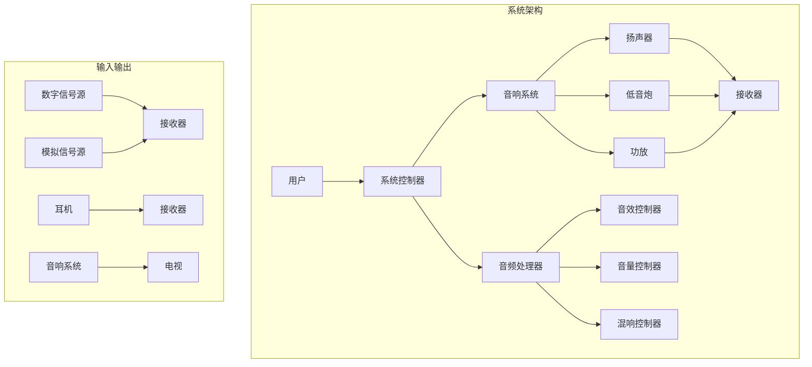
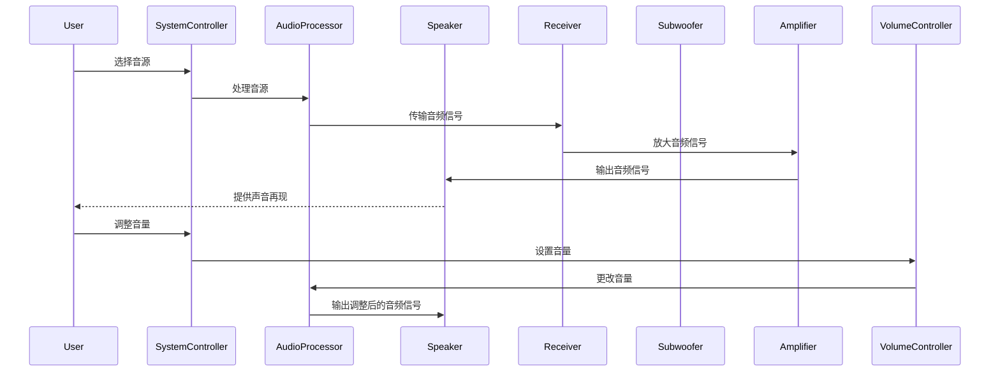

                 

# 《数学与音响工程：声学设计的数学方法》

## 关键词

- 数学方法
- 声学设计
- 音响工程
- 声波传播
- 音频信号处理
- 房间声学
- 声学仿真

## 摘要

本文旨在探讨数学在音响工程中的应用，特别是声学设计的数学方法。通过对声波传播、音频信号处理、房间声学等核心概念的深入分析，本文将揭示数学在声学设计中的关键作用。同时，本文还将介绍声学仿真工具和实际案例，以帮助读者理解和掌握声学设计的数学方法。

## 目录大纲设计思路

### 明确书的主题与目标

《数学与音响工程：声学设计的数学方法》这本书的主题是数学在音响工程中的应用，目标是为读者提供一套数学工具和方法，以便于他们在声学设计中进行科学分析和决策。

### 梳理核心概念与结构

围绕声学设计，我们需要识别出核心的概念，如声波传播、音频信号处理、房间声学、频率响应等，并理解它们之间的相互关系。

### 确定章节内容

根据核心概念，设计每个章节的主题，确保覆盖从基础知识到高级应用的完整内容。

### 规划章节顺序

合理规划章节的顺序，通常从基础概念开始，逐步深入到复杂的理论和实践。

### 细化章节内容

在每个章节中，细化小节内容，确保逻辑清晰、内容全面。

### 使用Mermaid和LaTeX

为了增强内容的可视化，我们将使用Mermaid绘制流程图和类图，使用LaTeX格式化数学公式。

### 完整的目录大纲

**《数学与音响工程：声学设计的数学方法》目录大纲**

## 第一部分：声学基础

### 第1章：声学基本概念

- 1.1 声音的产生与传播
- 1.2 声音的测量与描述

### 第2章：声波的数学模型

- 2.1 声波方程的建立
- 2.2 声波的边界条件

### 第3章：音频信号处理

- 3.1 数字信号处理基础
- 3.2 声音信号的特性分析

### 第4章：房间声学

- 4.1 房间内的声波传播
- 4.2 频率响应与声学测量

### 第5章：声音的数学模型与仿真

- 5.1 声音仿真基础
- 5.2 声学仿真工具

### 第6章：声学设计案例与实践

- 6.1 音响系统设计原则
- 6.2 实际案例剖析

### 第7章：未来趋势与挑战

- 7.1 声学技术发展趋势
- 7.2 声学设计面临的挑战

## 附录

- A. 数学公式与符号表
- B. 术语解释
- C. 参考书目
- D. 声学设计工具与资源

### 目录大纲详细内容

**《数学与音响工程：声学设计的数学方法》目录大纲详细内容**

## 第一部分：声学基础

### 第1章：声学基本概念

**1.1 声音的产生与传播**

- **声音的产生**：声音是由物体的振动产生的，振动通过介质（如空气、水等）传播形成声波。

- **声音的传播**：声波在介质中传播时，会经历反射、折射、衍射等现象。声波的传播速度取决于介质的密度和弹性。

**1.2 声音的测量与描述**

- **声压级与声功率级**：声压级表示声波在介质中产生的压强变化，单位为分贝（dB）。声功率级表示声波在单位时间内所做的功，也以分贝表示。

- **声速与频率**：声速是声波在介质中传播的速度，取决于介质的物理特性。频率是声波的振动次数，单位为赫兹（Hz）。

- **声音的感知**：人类对声音的感知主要通过耳朵实现，耳朵将声波转换为神经信号，然后大脑解读这些信号，产生听觉。

### 第2章：声波的数学模型

**2.1 声波方程的建立**

- **亥姆霍兹方程**：描述声波在介质中的传播，用于计算声波的振幅、相位和传播速度。

- **声波的波动方程**：描述声波在空间中的传播，包括声波的反射、折射和衍射等现象。

- **声波的解析解**：通过数学方法求解声波方程，得到声波的传播规律和特性。

**2.2 声波的边界条件**

- **静止边界条件**：声波在固体、液体或气体界面上的反射和折射条件。

- **动态边界条件**：声波在振动物体表面上的反射和折射条件。

- **多层介质中的声波传播**：声波在多层介质中的传播规律，包括声波的反射、折射和透射。

### 第3章：音频信号处理

**3.1 数字信号处理基础**

- **模数转换与数模转换**：将模拟信号转换为数字信号，以便于计算机处理。数字信号处理的基本算法包括滤波、压缩、增强等。

- **傅里叶变换**：将时域信号转换为频域信号，便于分析信号的频率成分和能量分布。

- **窗函数**：用于减小傅里叶变换中的频谱泄露现象，提高频率分辨率。

**3.2 声音信号的特性分析**

- **频率响应**：描述声系统对不同频率声波的响应特性，包括系统的增益和相位。

- **声音的调制与解调**：将音频信号与调制信号进行叠加和分离，实现信息的传递和接收。

- **声音的噪声控制**：通过滤波和噪声抑制技术，降低声系统中的噪声干扰，提高声音质量。

### 第4章：房间声学

**4.1 房间内的声波传播**

- **房间模式**：房间内声波的驻波现象，产生特定的频率响应。

- **房间共振**：房间内某些频率的声波振幅增大，导致声音增强或减弱。

- **房间声学设计**：根据声学要求和房间特性，进行房间结构和装饰材料的优化设计。

**4.2 频率响应与声学测量**

- **频率响应函数**：描述声系统在不同频率下的增益和相位特性。

- **房间声学测量**：使用声学仪器测量房间内的声学参数，包括声压级、频率响应和混响时间等。

- **房间声学优化**：通过调整房间结构和装饰材料，改善房间声学性能。

### 第5章：声音的数学模型与仿真

**5.1 声音仿真基础**

- **声波仿真方法**：基于数学模型和计算机算法，模拟声波的传播和反射现象。

- **声场仿真**：模拟声波在空间中的传播和衰减过程，为声学设计提供参考。

- **耳机/扬声器声学建模**：建立耳机/扬声器的声学模型，用于分析和优化声音质量。

**5.2 声学仿真工具**

- **Audiosim Pro**：专业的声学仿真软件，可用于声学设计和优化。

- **Wavefield Synthesis**：基于声场仿真的声音再现技术，实现高度真实的声场体验。

- **其他声学仿真软件介绍**：介绍其他常用的声学仿真软件及其特点。

### 第6章：声学设计案例与实践

**6.1 音响系统设计原则**

- **系统设计与规划**：根据声学要求和用户需求，进行音响系统的设计和规划。

- **系统调试与优化**：通过调整音响设备的参数和布局，优化音响系统的性能。

- **系统性能评估**：评估音响系统的音质、响度、动态范围等指标，确保满足用户需求。

**6.2 实际案例剖析**

- **家庭影院设计**：介绍家庭影院的声学设计原则和实践案例。

- **专业演出音响设计**：分析专业演出音响系统的设计要点和实际应用。

- **耳机与扬声器设计**：探讨耳机和扬声器的设计原理和关键技术。

### 第7章：未来趋势与挑战

**7.1 声学技术发展趋势**

- **真实感声音再现**：通过声场仿真和声音增强技术，实现高度真实的声音再现。

- **声音增强技术**：利用数字信号处理技术，提升声音质量，降低噪声干扰。

- **声学系统智能化**：将人工智能技术应用于声学系统，实现自动调节和优化。

**7.2 声学设计面临的挑战**

- **噪声控制**：降低环境噪声，改善声学环境。

- **声学模拟精度**：提高声学仿真精度，准确预测声学效果。

- **人工智能与声学设计的结合**：探索人工智能技术在声学设计中的应用，提升设计效率和效果。

## 附录

**A. 数学公式与符号表**

- 提供常用的数学公式和符号解释，方便读者查阅。

**B. 术语解释**

- 对声学设计中的关键术语进行解释，帮助读者理解专业术语。

**C. 参考书目**

- 列出本书的参考文献，为读者提供进一步学习和研究的基础。

**D. 声学设计工具与资源**

- 介绍常用的声学设计工具和资源，帮助读者进行声学设计和实践。

## 结语

本文对《数学与音响工程：声学设计的数学方法》的目录大纲进行了详细设计，通过梳理声学设计中的核心概念和数学方法，构建了一个结构清晰、内容丰富的文章框架。本文旨在为读者提供一套实用的数学工具和方法，帮助他们更好地进行声学设计。通过实际案例剖析和未来趋势分析，本文不仅揭示了数学在声学设计中的关键作用，也展示了声学设计的广泛应用和挑战。希望本文能对读者在声学设计和研究中有所启发和帮助。## 第1章：声学基本概念

### 1.1 声音的产生与传播

声音的产生源于物体的振动。当一个物体（例如，弦乐器中的琴弦或鼓膜）振动时，它会引起周围介质（如空气或水）的分子振动，从而形成声波。声波是一种机械波，它通过介质的质点振动来传播能量。在空气中，声波以纵波的形式传播，即介质的质点沿声波传播方向振动。

声音的传播需要介质，因为声波是通过介质的分子振动来传递能量的。在真空中，由于没有介质，声波无法传播。例如，宇航员在太空中无法通过空气声波进行交流，他们必须使用无线电通讯设备。

声波的传播速度取决于介质的性质，如密度和弹性。在空气中的声速大约为340米/秒（在20摄氏度时），而在水中的声速约为1500米/秒。在固体中，声速通常更高，因为固体的分子排列更加紧密，分子间的作用力更强。

声波的传播过程中，会遇到反射、折射、衍射等现象。反射是声波遇到障碍物时返回的现象，例如，声波在墙壁上反射形成回声。折射是声波从一种介质进入另一种介质时传播方向发生改变的现象，例如，声波从空气进入水中时会发生折射。衍射是声波遇到障碍物时绕过障碍物传播的现象，这使得我们能够听到来自障碍物后面的声音。

声音的传播特性对音响工程具有重要意义。在音响系统中，我们需要考虑声波的传播路径、反射和干扰等因素，以优化声音质量。例如，在设计家庭影院或音乐厅时，需要考虑房间的声学特性，避免出现回声和声波干扰，以确保观众能够获得良好的听觉体验。

### 1.2 声音的测量与描述

测量和描述声音是声学设计的基础。声音的测量主要涉及声压级、声功率级、声速和频率等参数。这些参数有助于我们理解和分析声音的特性，从而进行有效的声学设计和优化。

**声压级（Sound Pressure Level，SPL）**：声压级是描述声音强度的常用参数，单位为分贝（dB）。声压级定义为声压与参考声压（通常为20微帕斯卡，即人耳能听到的最小声压）之比的常用对数。公式如下：

\[ \text{SPL} = 20 \log_{10} \left( \frac{p}{p_0} \right) \]

其中，\( p \) 是测量得到的声压，\( p_0 \) 是参考声压。

**声功率级（Sound Power Level，SWL）**：声功率级是描述声源发出的声功率的参数，单位同样为分贝（dB）。声功率级定义为声功率与参考声功率（通常为10^-12瓦特）之比的常用对数。公式如下：

\[ \text{SWL} = 10 \log_{10} \left( \frac{W}{W_0} \right) \]

其中，\( W \) 是测量得到的声功率，\( W_0 \) 是参考声功率。

**声速（Sound Velocity，v）**：声速是声波在介质中传播的速度，单位为米/秒（m/s）。声速取决于介质的性质，如密度和弹性模量。对于空气，声速约为340 m/s（在20摄氏度时）。声速的测量对于理解声音传播和声学系统设计至关重要。

**频率（Frequency，f）**：频率是声波的振动次数，单位为赫兹（Hz）。频率决定了声音的音调，高频声音听起来尖锐，低频声音听起来低沉。人耳能够听到的频率范围大约在20 Hz到20 kHz之间。

**声音的感知**：人类对声音的感知是通过耳朵实现的。耳朵中的鼓膜接收声波，并通过听小骨传递振动到内耳的耳蜗。耳蜗中的感觉细胞将振动转换为神经信号，传递到大脑进行分析和解读。大脑根据这些信号判断声音的音调、响度和位置。

声音的测量和描述对于音响工程至关重要。通过准确测量声压级、声功率级、声速和频率等参数，我们可以评估声系统的性能，优化声音质量，确保观众获得最佳听觉体验。在声学设计中，这些参数有助于我们理解和预测声波的传播行为，从而进行有效的声学布局和优化。

### 1.2.1 声压级与声功率级

声压级和声功率级是声学设计中常用的两个重要参数，它们帮助我们理解和评估声音的强度和声源的功率输出。

**声压级（Sound Pressure Level，SPL）**：

声压级是描述声音强度的参数，表示声压相对于标准参考声压（通常为20微帕斯卡）的相对大小。声压级以分贝（dB）为单位，其计算公式为：

\[ \text{SPL} = 20 \log_{10} \left( \frac{p}{p_0} \right) \]

其中，\( p \) 是测量得到的声压，\( p_0 \) 是参考声压（20微帕斯卡）。声压级的单位是分贝（dB），它是一个相对量，用于表示声压的变化量。

在实际应用中，声压级常用于评估声系统的响度和噪声水平。例如，在音响系统中，我们需要确保声音在合适的声音范围内，既不会太响造成听力损害，也不会太弱导致听不清楚。通过测量和调整声压级，我们可以优化音响系统的声音表现。

**声功率级（Sound Power Level，SWL）**：

声功率级是描述声源发出的声功率的参数，表示声功率相对于标准参考声功率（通常为10^-12瓦特）的相对大小。声功率级的计算公式为：

\[ \text{SWL} = 10 \log_{10} \left( \frac{W}{W_0} \right) \]

其中，\( W \) 是测量得到的声功率，\( W_0 \) 是参考声功率（10^-12瓦特）。与声压级类似，声功率级也以分贝（dB）为单位。

声功率级对于评估声源的性能和声传播的远场特性非常重要。例如，在设计扬声器系统时，我们需要确保扬声器能够产生足够的声功率以满足远场听音需求，同时避免过度功率输出导致设备损坏或声音失真。

**声压级与声功率级的对比**：

声压级和声功率级虽然都是以分贝（dB）为单位，但它们描述的是不同的物理量。声压级关注的是声波在介质中传播时的压强变化，而声功率级关注的是声源发出的声功率。

在实际应用中，声压级和声功率级通常需要结合使用。例如，在设计一个音响系统时，我们需要同时考虑扬声器的声功率级和房间的声压级分布。通过合理配置扬声器的数量和位置，我们可以优化声音的覆盖范围和声音质量。

**声压级与声功率级的实际应用**：

1. **噪声控制**：在噪声控制工程中，通过测量声压级和声功率级，我们可以评估噪声源的危害程度，并制定相应的降噪措施。

2. **音响系统设计**：在音响系统设计过程中，通过测量和调整声压级和声功率级，我们可以优化系统的声音表现，确保观众在不同的听音位置都能获得良好的听觉体验。

3. **声学仿真**：在声学仿真中，通过计算声压级和声功率级，我们可以预测声波在不同环境中的传播行为，从而进行有效的声学设计和优化。

### 1.2.2 声速与频率

声速和频率是声学设计中的关键参数，它们决定了声音的传播速度和音调。了解声速与频率的关系对于优化声学系统性能具有重要意义。

**声速（Sound Velocity）**：

声速是声波在介质中传播的速度，取决于介质的物理性质，如密度和弹性模量。声速的单位是米/秒（m/s）。在空气中的声速约为340 m/s（在20摄氏度时），在水中约为1500 m/s，而在固体中则更高。

声速的测量对于声学设计和优化至关重要。例如，在建筑设计中，了解建筑材料的声速有助于评估建筑物的隔音效果。在音响系统中，了解声速可以帮助我们预测声音的传播路径和反射行为，从而优化扬声器布局。

**频率（Frequency）**：

频率是声波的振动次数，单位为赫兹（Hz）。频率决定了声音的音调，高频声音听起来尖锐，低频声音听起来低沉。人耳能够听到的频率范围大约在20 Hz到20 kHz之间。

频率的测量对于声学系统设计也非常重要。例如，在音频录制和播放过程中，我们需要确保音频信号的频率范围在可听范围内。在音响系统中，通过调整扬声器的频率响应，我们可以优化声音的质量和表现。

**声速与频率的关系**：

声速与频率之间的关系可以用以下公式描述：

\[ v = \lambda f \]

其中，\( v \) 是声速，\( \lambda \) 是声波的波长，\( f \) 是频率。

从公式可以看出，声速是波长和频率的乘积。这意味着，在相同的波长下，频率越高，声速越快；在相同的频率下，波长越长，声速越慢。

在实际应用中，声速与频率的关系对于声学系统设计具有重要意义。例如，在电影院设计中，我们需要考虑声音的传播速度，以确保观众在不同的座位上都能听到清晰的声音。在音乐制作中，通过调整音频信号的频率和声速，我们可以创造出各种独特的声音效果。

### 1.2.3 声音的感知

声音的感知是人类听觉系统对声波的一种反应。听觉系统由外耳、中耳和内耳组成，它们共同工作，将声波转换为电信号，传递给大脑进行分析和解读。

**外耳**：外耳包括耳廓和外耳道，主要功能是收集声波并将其引导到中耳。耳廓的形状有助于捕捉声音，而外耳道则将声波传输到鼓膜。

**中耳**：中耳包括鼓膜、听小骨和鼓室。鼓膜接收声波并产生振动，振动通过听小骨（锤骨、砧骨和镫骨）放大，然后传递到内耳。

**内耳**：内耳包括耳蜗和前庭系统。耳蜗是主要的听觉器官，由数千个听觉感受细胞组成，它们将振动转换为电信号，传递到大脑。前庭系统负责感知身体平衡和运动。

**声音的感知过程**：

1. **声波接收**：声波通过外耳道到达鼓膜，引起鼓膜的振动。

2. **振动传递**：鼓膜的振动通过听小骨传递到内耳的耳蜗。

3. **电信号产生**：耳蜗中的听觉感受细胞将振动转换为电信号。

4. **信号传输**：电信号通过听觉神经传递到大脑。

5. **声音解读**：大脑对电信号进行分析和解读，产生听觉感知。

**声音的感知特点**：

1. **音调**：音调是由声音的频率决定的，高频声音听起来尖锐，低频声音听起来低沉。

2. **响度**：响度是由声音的声压级决定的，声压级越高，声音听起来越响亮。

3. **音色**：音色是由声音的谐波成分决定的，不同的乐器或声音源具有独特的音色。

4. **音量**：音量是由声音的强度决定的，通常用分贝（dB）来衡量。

理解声音的感知过程对于音响工程具有重要意义。通过优化声学系统设计，我们可以提高声音的传播效率和感知质量，为观众提供更好的听觉体验。例如，在家庭影院设计中，我们需要确保声音在不同座位上的音量平衡和音质清晰，以确保观众能够沉浸在影片中。

### 1.3 声音的感知

声音的感知是人类听觉系统对声波的一种反应。听觉系统由外耳、中耳和内耳组成，它们共同工作，将声波转换为电信号，传递给大脑进行分析和解读。

**外耳**：外耳包括耳廓和外耳道，主要功能是收集声波并将其引导到中耳。耳廓的形状有助于捕捉声音，而外耳道则将声波传输到鼓膜。

**中耳**：中耳包括鼓膜、听小骨和鼓室。鼓膜接收声波并产生振动，振动通过听小骨（锤骨、砧骨和镫骨）放大，然后传递到内耳。

**内耳**：内耳包括耳蜗和前庭系统。耳蜗是主要的听觉器官，由数千个听觉感受细胞组成，它们将振动转换为电信号，传递到大脑。前庭系统负责感知身体平衡和运动。

**声音的感知过程**：

1. **声波接收**：声波通过外耳道到达鼓膜，引起鼓膜的振动。

2. **振动传递**：鼓膜的振动通过听小骨传递到内耳的耳蜗。

3. **电信号产生**：耳蜗中的听觉感受细胞将振动转换为电信号。

4. **信号传输**：电信号通过听觉神经传递到大脑。

5. **声音解读**：大脑对电信号进行分析和解读，产生听觉感知。

**声音的感知特点**：

1. **音调**：音调是由声音的频率决定的，高频声音听起来尖锐，低频声音听起来低沉。

2. **响度**：响度是由声音的声压级决定的，声压级越高，声音听起来越响亮。

3. **音色**：音色是由声音的谐波成分决定的，不同的乐器或声音源具有独特的音色。

4. **音量**：音量是由声音的强度决定的，通常用分贝（dB）来衡量。

理解声音的感知过程对于音响工程具有重要意义。通过优化声学系统设计，我们可以提高声音的传播效率和感知质量，为观众提供更好的听觉体验。例如，在家庭影院设计中，我们需要确保声音在不同座位上的音量平衡和音质清晰，以确保观众能够沉浸在影片中。

## 第2章：声波的数学模型

### 2.1 声波方程的建立

声波方程是描述声波在介质中传播的基本数学模型。亥姆霍兹方程（Helmholtz equation）和波动方程（Wave equation）是声波方程的两种主要形式，它们为我们提供了计算声波传播特性、反射和折射现象的数学工具。

#### 2.1.1 亥姆霍兹方程

亥姆霍兹方程是一个二阶偏微分方程，用于描述声波在无限大、均匀、各向同性介质中的传播。该方程可以表示为：

\[ \nabla^2 \phi - \frac{1}{c^2} \frac{\partial^2 \phi}{\partial t^2} = 0 \]

其中，\( \phi \) 表示声压，\( c \) 表示声速，\( \nabla^2 \) 是拉普拉斯算子，\( t \) 是时间。亥姆霍兹方程的解可以表示为：

\[ \phi(\mathbf{r}, t) = \sum_{n} A_n \sin(k_n r) e^{-i k_n t} \]

其中，\( \mathbf{r} \) 是位置矢量，\( k_n \) 是波数，\( A_n \) 是振幅。

#### 2.1.2 声波的波动方程

波动方程是一个二阶偏微分方程，用于描述声波在有限空间中的传播，包括反射、折射和衍射现象。该方程可以表示为：

\[ \frac{\partial^2 u}{\partial t^2} = c^2 \nabla^2 u \]

其中，\( u \) 表示位移，\( c \) 表示声速，\( \nabla^2 \) 是拉普拉斯算子。

波动方程的解可以表示为：

\[ u(\mathbf{r}, t) = \sum_{n} A_n \sin(k_n r) e^{-i k_n t} \]

与亥姆霍兹方程的解类似，这里的解也描述了声波的传播，但波动方程考虑了边界条件和反射现象。

#### 2.1.3 声波的解析解

为了求解声波方程，我们可以使用解析方法，如分离变量法、傅里叶变换法和积分变换法等。这些方法允许我们将复杂的声波问题简化为更易于处理的数学模型。

**分离变量法**：这种方法通过将声波方程分解为时间部分和空间部分，分别求解。例如，对于一维情况，我们可以将声波方程表示为：

\[ \frac{\partial^2 u}{\partial t^2} = c^2 \frac{\partial^2 u}{\partial x^2} \]

通过分离变量，我们得到两个常微分方程：

\[ \frac{\partial^2 u}{\partial t^2} = A \sin(kx) \]
\[ \frac{\partial^2 A}{\partial t^2} = c^2 k^2 A \]

通过解这两个方程，我们可以得到声波方程的解析解。

**傅里叶变换法**：傅里叶变换是一种将时域信号转换为频域信号的方法。通过傅里叶变换，我们可以将声波方程从时域转换为频域，从而简化计算。例如，对于一维声波方程，我们可以进行傅里叶变换得到：

\[ \frac{\partial^2 \hat{u}}{\partial \omega^2} = c^2 \frac{\partial^2 \hat{u}}{\partial k^2} \]

在频域中，我们可以更容易地求解声波方程，然后再通过逆傅里叶变换将结果转换回时域。

**积分变换法**：积分变换法是一种通过积分变换将声波方程转换为更易于求解的形式的方法。例如，拉普拉斯变换和傅里叶变换都是积分变换的一种形式，它们可以用于求解复杂的声波方程。

通过这些解析方法，我们可以得到声波方程的解析解，从而更好地理解和预测声波的传播行为。

### 2.2 声波的边界条件

声波的边界条件描述了声波在介质界面上的行为，包括反射、折射和透射等现象。了解这些边界条件对于声学设计和声学仿真具有重要意义。

#### 2.2.1 静止边界条件

静止边界条件描述了声波在静止界面上的行为，即声波在固体、液体或气体界面上的反射和折射。这些边界条件可以表示为：

- **反射定律**：声波在界面上的反射角度等于入射角度，即：

\[ \theta_r = \theta_i \]

- **折射定律**：声波在两种不同介质界面上的折射角度和入射角度之间满足斯涅尔定律：

\[ \frac{\sin(\theta_i)}{\sin(\theta_r)} = \frac{c_1}{c_2} \]

其中，\( \theta_i \) 是入射角，\( \theta_r \) 是反射角，\( c_1 \) 和 \( c_2 \) 分别是第一种介质和第二种介质的声速。

#### 2.2.2 动态边界条件

动态边界条件描述了声波在振动物体表面上的行为，例如，声波在振动扬声器膜片上的反射和折射。这些边界条件比静止边界条件更复杂，需要考虑物体的振动状态。

- **振动膜片上的声波反射**：当声波遇到振动的膜片时，反射和透射系数取决于膜片的振动状态。例如，对于一个理想的振动膜片，反射系数为1，透射系数为0。

- **振动壁面的声波透射**：当声波通过一个振动的壁面时，透射系数取决于壁面的振动状态和声波频率。通过计算壁面的振动位移和声波的传播速度，我们可以得到透射系数。

#### 2.2.3 多层介质中的声波传播

多层介质中的声波传播涉及到声波在不同介质界面上的反射、折射和透射。理解多层介质中的声波传播对于声学设计和噪声控制具有重要意义。

- **多层介质中的反射和折射**：声波在多层介质界面上的反射和折射遵循斯涅尔定律和反射定律。通过计算不同介质之间的声速和界面角度，我们可以确定反射和折射系数。

- **多层介质中的透射**：声波在多层介质中的透射取决于不同介质之间的声阻抗差异。声阻抗是声速和声压的乘积，通过计算不同介质之间的声阻抗，我们可以确定透射系数。

通过理解声波的边界条件，我们可以更好地进行声学设计和噪声控制。这些边界条件为我们提供了计算声波传播和反射的数学工具，从而优化声学系统的性能。

## 第3章：音频信号处理

### 3.1 数字信号处理基础

音频信号处理是音响工程中不可或缺的一部分，它涉及到将模拟信号转换为数字信号，以及使用数字技术对音频信号进行增强、滤波和修改。数字信号处理（Digital Signal Processing，DSP）是这一领域的核心技术，它通过一系列算法和数学工具来实现音频信号的变换和处理。

**模数转换与数模转换**

模数转换（Analog-to-Digital Conversion，ADC）和数模转换（Digital-to-Analog Conversion，DAC）是数字信号处理的基础。ADC将模拟信号转换为数字信号，以便于计算机处理。DAC则将数字信号转换回模拟信号，以便于播放和传输。

**模数转换过程**

1. **采样（Sampling）**：将模拟信号在时间上离散化。采样频率（采样率）决定了信号的时间分辨率，通常以赫兹（Hz）为单位。

2. **量化（Quantization）**：将采样得到的连续值转换为有限位数的数字值。量化位数决定了信号的动态范围和信噪比。

3. **编码（Encoding）**：将量化后的数字值编码为二进制序列，以便于存储和传输。

**数模转换过程**

1. **解码（Decoding）**：将存储或传输的二进制序列解码为量化后的数字值。

2. **重构（Reconstruction）**：使用DAC将数字值转换为模拟信号。重构通常涉及到插值和滤波，以减少量化误差和改善信号质量。

**ADC和DAC的性能指标**

- **采样率**：采样率越高，信号的时间分辨率越高，但也会导致更多的量化误差。

- **量化位数**：量化位数越多，信号的动态范围越大，但存储和传输的需求也越高。

- **信噪比（Signal-to-Noise Ratio，SNR）**：信噪比是衡量信号质量的重要指标，通常以分贝（dB）为单位。

- **总谐波失真（Total Harmonic Distortion，THD）**：总谐波失真描述了信号中的非谐波成分的百分比。

**数字信号处理基本算法**

数字信号处理涉及一系列基本算法，包括滤波、压缩、增强和调制等。

- **滤波**：滤波用于去除信号中的噪声和不需要的频率成分。常见的滤波器包括低通滤波器、高通滤波器、带通滤波器和带阻滤波器。

- **压缩**：压缩用于调整信号动态范围，使其适应特定的播放环境。压缩算法包括动态范围压缩、限幅和噪声门。

- **增强**：增强用于改善信号质量，提高音质。常见的增强技术包括回声消除、音调调节和立体声分离。

- **调制**：调制用于将音频信号加载到载波信号上，以便于传输和接收。常见的调制方式包括调幅（AM）和调频（FM）。

### 3.2 声音信号的特性分析

声音信号的特性分析是音频信号处理的核心，它涉及到对声音信号频率响应、调制和解调等方面的分析。通过分析声音信号的特性，我们可以更好地理解声音的物理特性和感知特性。

**频率响应**

频率响应是描述系统对不同频率信号的增益和相位特性的参数。频率响应函数（Frequency Response Function，FRF）用于表示系统在不同频率下的增益和相位。频率响应的分析对于优化音响系统的性能和声学设计至关重要。

- **幅频响应**：幅频响应描述了系统在不同频率下的增益特性。幅频响应的峰值和谷值决定了系统的共振频率和声学特性。

- **相频响应**：相频响应描述了系统在不同频率下的相位延迟特性。相频响应的相位变化会影响声音的定位和立体声效果。

**声音的调制与解调**

调制和解调是音频信号处理中的重要技术，用于实现信息的传递和接收。

- **调制**：调制是将音频信号加载到载波信号上的过程，以便于信号的传输。常见的调制方式包括调幅（AM）和调频（FM）。调幅是通过改变载波信号的振幅来传输音频信号，而调频是通过改变载波信号的频率来传输音频信号。

- **解调**：解调是从调制信号中提取出原始音频信号的过程。解调器与调制器相对应，用于恢复音频信号的振幅和频率。

**声音的噪声控制**

噪声控制是音频信号处理中的重要任务，它涉及到对噪声的检测和抑制。噪声控制技术包括以下几种：

- **噪声门**：噪声门用于抑制背景噪声，只允许音频信号通过。噪声门通过设置阈值和噪声门限来区分信号和噪声。

- **自适应滤波**：自适应滤波是一种动态调整滤波器参数的方法，用于去除噪声。自适应滤波器可以根据信号和噪声的特点自动调整滤波器系数，从而实现更好的噪声抑制。

- **频谱分析**：频谱分析用于分析音频信号的频率成分和能量分布。通过频谱分析，我们可以识别出噪声的频率成分，并针对性地进行噪声抑制。

通过分析声音信号的特性，我们可以更好地理解和优化音频信号处理技术，从而提高声音质量，改善听觉体验。

### 3.3 音频信号处理的应用实例

音频信号处理技术广泛应用于各种场景，如音响系统、音乐制作、通信和音频修复等。以下是一些典型的应用实例：

**音响系统**

音响系统中的音频信号处理技术主要用于改善声音质量和增强听觉体验。以下是一些关键的应用：

- **均衡器（Equalizer）**：均衡器用于调整音响系统在不同频率下的增益，以优化声音的频率平衡。通过调整均衡器，我们可以改善声音的清晰度和饱满度。

- **压缩器（Compressor）**：压缩器用于控制音频信号的动态范围，使其更加平稳。压缩器通过降低音频信号的峰值和提升谷值，使声音更加响亮且平衡。

- **混响（Reverb）**：混响用于模拟房间内的声波反射，增强声音的立体感和空间感。混响通过调整反射时间和强度，模拟不同房间环境下的声音效果。

- **噪声抑制（Noise Reduction）**：噪声抑制技术用于去除音响系统中的背景噪声，提高声音的清晰度。噪声抑制可以通过滤波器技术实现，例如自适应滤波和带阻滤波。

**音乐制作**

在音乐制作过程中，音频信号处理技术用于创作和调整音乐作品。以下是一些应用：

- **采样（Sampling）**：采样用于从自然界中录制各种声音，以便于在音乐作品中使用。采样技术可以捕捉乐器的音色、环境声和特殊效果。

- **合成（Synthesis）**：合成用于创建新的声音效果，通过合成器将简单的波形组合成复杂的音乐元素。合成技术可以产生独特的音色和节奏。

- **混音（Mixing）**：混音是将多个音频信号混合在一起，创建最终的音频作品。混音过程中，需要调整各声道的音量、平衡和空间感，以确保整体音乐的和谐。

- **效果处理（Effects Processing）**：效果处理用于为音乐作品添加各种音效，如回声、延迟、混响和振动等。效果处理可以增强音乐的动态范围和表现力。

**通信**

在通信领域，音频信号处理技术用于改善语音质量和增强通信效果。以下是一些应用：

- **回声消除（Echo Cancellation）**：回声消除用于去除电话通话中的回声，提高语音的清晰度。回声消除通过检测和消除声音的反射信号实现。

- **噪声抑制（Noise Suppression）**：噪声抑制用于去除通信信号中的背景噪声，提高语音的清晰度。噪声抑制可以通过自适应滤波和谱分析技术实现。

- **增益控制（Gain Control）**：增益控制用于调整通话信号的电平，使其保持稳定。增益控制可以避免通话中的声音过大或过小，提高通信的舒适度。

**音频修复**

音频修复技术用于修复受损的音频文件，恢复其原始音质。以下是一些应用：

- **降噪（Noise Reduction）**：降噪用于去除音频文件中的背景噪声，提高声音的清晰度。降噪可以通过自适应滤波和频谱分析技术实现。

- **去噪（Denoising）**：去噪用于去除音频信号中的随机噪声，恢复原始信号。去噪技术通常基于信号处理算法，如波let变换和小波分析。

- **修复缺失部分（Segment Repair）**：修复缺失部分用于恢复音频文件中缺失的部分，通过插值和补全技术实现。修复缺失部分可以提高音频文件的可播放性和完整性。

通过这些应用实例，我们可以看到音频信号处理技术在各个领域的广泛应用和重要性。音频信号处理技术不仅改善了声音的质量和体验，也为音频制作、通信和修复提供了强大的工具和手段。

## 第4章：房间声学

### 4.1 房间内的声波传播

房间声学是研究声波在房间内传播和反射的科学，它对于优化音响系统性能、设计音乐厅和录音室等具有重要作用。理解房间内的声波传播行为有助于减少回声、增强声音的清晰度和立体感。

#### 房间模式

房间模式是指声波在封闭空间内形成的一系列驻波模式。这些驻波模式是由声波的反射和干涉造成的，每种模式对应特定的频率和波长。房间内的每个角落、墙面、天花板和地板都可能成为反射面，从而影响声波的传播。

- **基频模式**：基频模式是最基本的房间模式，对应于房间尺寸的谐振频率。当声波的波长与房间的尺寸相匹配时，声波会在房间内形成驻波。

- **倍频模式**：倍频模式是基频模式的倍数，对应于更高频率的驻波。这些模式会与基频模式产生干涉，影响声音的清晰度和平衡。

- **泛音模式**：泛音模式是声波在房间内的高阶模式，对应于更高的频率。泛音模式会对高频声音的响应产生影响，特别是在音乐厅和录音室中。

#### 房间共振

房间共振是指声波在房间内引起的大幅度振动现象。当声波的频率与房间的共振频率相匹配时，声波的能量会被放大，导致声音异常响亮。这种现象可能导致声音失真和听觉疲劳。

- **自然共振频率**：自然共振频率是房间在自由振动状态下的频率。它取决于房间的几何尺寸和材料特性。

- **强迫共振**：强迫共振是由外部声源引起的共振现象。当外部声源的频率与房间的共振频率相匹配时，强迫共振会导致声音异常响亮。

#### 房间声学设计

房间声学设计的目标是优化房间的声学特性，使其适合特定的用途，如音乐表演、录音和居住等。以下是一些关键的设计原则：

- **尺寸与比例**：房间尺寸和比例会影响声波的传播和反射。设计师通常通过调整房间尺寸和形状来控制声波的模式和共振。

- **吸音材料**：吸音材料可以减少声波的反射和回声，提高声音的清晰度和平衡。常见的吸音材料包括泡沫、纤维和装饰板等。

- **反射面设计**：反射面设计可以控制声波的传播方向和强度。通过合理布置反射面，设计师可以改善声音的空间感和立体感。

- **共振控制**：共振控制是通过调整房间结构和材料来减少声波共振现象。这通常涉及使用低共振材料、减振地板和隔音墙等。

### 4.2 频率响应与声学测量

频率响应函数（Frequency Response Function，FRF）是描述房间声学特性的重要参数，它反映了房间在不同频率下的增益和相位特性。频率响应的分析对于优化音响系统和房间声学设计至关重要。

#### 频率响应函数

频率响应函数描述了系统（如房间、扬声器或耳机）在不同频率下的增益和相位特性。它通常通过以下公式表示：

\[ H(f) = \frac{G(f)}{1 + \beta f} \]

其中，\( G(f) \) 是幅频响应，\( \beta \) 是相位响应。

- **幅频响应（Amplitude Response）**：幅频响应描述了系统在不同频率下的增益。它反映了声音在各个频率上的强度。幅频响应的峰值和谷值对应于房间的共振频率和声波干涉现象。

- **相频响应（Phase Response）**：相频响应描述了系统在不同频率下的相位延迟。相位响应会影响声音的定位和立体感。

#### 声学测量

声学测量是评估房间声学特性的重要手段。以下是一些常见的声学测量方法：

- **频响测量**：频响测量通过测量房间在不同频率下的声压级，评估房间的频率响应。频响测量通常使用频闪仪、声级计等设备进行。

- **混响时间测量**：混响时间测量用于评估房间内的声波衰减速度。混响时间分为早期混响时间和总混响时间。早期混响时间影响声音的清晰度，而总混响时间影响声音的丰满度。

- **房间模式测量**：房间模式测量通过分析房间内的声波模式，评估房间声学的共振特性。房间模式测量可以使用频闪仪、声学传感器和计算机模拟等方法。

#### 频率响应与声学优化的关系

频率响应和声学测量对于房间声学优化至关重要。以下是一些关键点：

- **共振频率控制**：通过测量房间的共振频率，可以识别出需要优化的区域。例如，通过添加吸音材料或调整房间结构，可以减少共振现象。

- **声波干涉控制**：通过测量房间的频率响应，可以识别出声波干涉的频率和位置。例如，通过调整扬声器布局或反射面设计，可以减少声波干涉。

- **混响时间优化**：通过测量混响时间，可以评估房间的声音质量和舒适度。例如，通过添加吸音材料或调整房间结构，可以优化混响时间。

总之，频率响应和声学测量是房间声学设计的重要工具。通过准确测量和分析房间的声学特性，我们可以优化房间设计，提高音响系统的性能和观众的听觉体验。

## 第5章：声音的数学模型与仿真

### 5.1 声音仿真基础

声音仿真是一种通过数学模型和计算机算法模拟声波传播和声场特性的技术。它为声学设计和优化提供了强大的工具，使我们能够预测和分析声音在不同环境中的行为。以下是声音仿真的基础概念和方法。

#### 声波仿真方法

声波仿真通常基于声波的数学模型，如亥姆霍兹方程和波动方程。这些模型描述了声波在介质中的传播规律，包括反射、折射和衍射等现象。以下是一些常用的声波仿真方法：

- **有限元方法（Finite Element Method，FEM）**：有限元方法是一种通过离散化空间域，将连续问题转换为离散问题的数值方法。它将空间域划分为有限数量的元素，并在每个元素上建立方程，求解声波的传播过程。

- **边界元方法（Boundary Element Method，BEM）**：边界元方法是一种通过处理边界上的积分方程来求解声波传播问题的方法。它将问题简化为边界上的求解，从而减少了计算量。

- **有限差分方法（Finite Difference Method，FDM）**：有限差分方法是一种通过在空间和时间上离散化声波方程，求解离散节点上的数值解的方法。它适用于简单的几何形状和边界条件。

#### 声场仿真

声场仿真是一种通过计算声波在空间中的传播和衰减来模拟声场的分布和特性的技术。声场仿真的关键在于准确预测声波在不同环境中的传播路径和声压分布。以下是一些声场仿真的基本步骤：

1. **建立数学模型**：根据声波的传播规律和声场特性，建立数学模型。这通常涉及使用波动方程或亥姆霍兹方程。

2. **划分计算域**：将声场划分为计算域，通常使用有限元方法或有限差分方法。计算域的划分需要考虑声源的分布、介质的特性以及边界条件。

3. **求解声波方程**：使用数值方法求解声波方程，计算声波在计算域内的传播过程。求解过程通常涉及求解线性或非线性方程组。

4. **分析声场特性**：分析计算结果，提取声场的关键特性，如声压分布、能量传播路径和声波干涉现象。这些特性可以用于优化声学设计和评估声学系统的性能。

#### 耳机/扬声器声学建模

耳机和扬声器是音响系统中的关键组件，它们的声学特性直接影响声音质量和用户体验。耳机和扬声器的声学建模是一种通过数学模型模拟耳机和扬声器声学行为的技术。以下是一些关键步骤：

1. **建立声学模型**：根据耳机和扬声器的结构和工作原理，建立声学模型。这通常涉及使用亥姆霍兹共振器和传输线模型。

2. **参数化模型**：将声学模型参数化，以便于调整和优化。参数化模型可以通过调整共振频率、质量、阻尼等参数来模拟不同的声学特性。

3. **模拟声场**：使用声场仿真技术模拟耳机和扬声器的声场分布。这包括计算声压、声功率和声波传播路径等。

4. **评估性能**：通过分析模拟结果，评估耳机和扬声器的性能，如频率响应、声压级和失真度。这些评估结果可以用于优化设计和改进产品性能。

声音仿真基础和声场仿真技术为声学设计和优化提供了重要的工具。通过建立和模拟声学模型，我们可以预测和分析声音在不同环境中的行为，从而优化声学系统设计和提高用户体验。

### 5.2 声学仿真工具

在声学设计和优化中，使用声学仿真工具是提高效率和准确性的关键。以下是一些常用的声学仿真工具及其特点和用途：

#### Audiosim Pro

Audiosim Pro 是一款专业的声学仿真软件，广泛用于音响系统设计和优化。其主要特点包括：

- **声场仿真**：Audiosim Pro 可以模拟声波在空间中的传播和衰减，帮助设计师优化扬声器布局和房间声学设计。
- **耳机/扬声器建模**：软件提供了耳机和扬声器的声学模型，用于分析和优化声学特性。
- **频率响应分析**：Audiosim Pro 可以计算系统的频率响应函数，帮助设计师调整系统的增益和相位特性。

#### Wavefield Synthesis

Wavefield Synthesis 是一种基于声场仿真技术的声音再现技术，旨在实现高度真实的声音体验。其主要特点包括：

- **三维声场再现**：Wavefield Synthesis 通过计算声场的三维分布，实现真实的三维声场再现，适用于虚拟现实（VR）和增强现实（AR）应用。
- **实时处理**：Wavefield Synthesis 可以实时处理音频信号，使设计师能够实时调整声场参数，提高设计效率。
- **多扬声器配置**：软件支持多扬声器的配置，适用于复杂的音响系统设计。

#### 其他声学仿真工具

除了Audiosim Pro 和 Wavefield Synthesis，还有许多其他声学仿真工具可供选择，如：

- **CATT-Acoustic**：这是一款功能强大的声学仿真软件，用于噪声控制、建筑声学和音乐厅设计。
- **EASER**：EASER 是一款用于声学仿真和噪声控制的软件，特别适用于工业和建筑环境。
- **SPPAS**：SPPAS 是一款开源的声学仿真工具，适用于语音处理和语音质量评估。

这些声学仿真工具提供了各种功能和特性，适用于不同的声学设计和优化需求。通过合理选择和使用这些工具，设计师可以更高效地进行声学设计和优化，提高音响系统的性能和用户体验。

### 第6章：声学设计案例与实践

#### 6.1 音响系统设计原则

音响系统设计是一个复杂的过程，涉及到声学、电子学和机械学等多个领域的知识。设计一个高性能的音响系统需要遵循以下原则：

**1. 明确设计目标**：在设计之前，需要明确音响系统的用途和预期效果。这包括系统的响度、清晰度、立体感和空间感等。

**2. 分析声学环境**：了解房间的大小、形状、材料特性等，这些因素会影响声波的传播和反射。通过声学测量和模拟，可以评估房间的声学特性，为设计提供依据。

**3. 设计扬声器布局**：扬声器的布局对音响系统的性能至关重要。合理布置扬声器可以优化声音的覆盖范围和声压级分布。常见的扬声器布局包括立体声布局、环绕声布局和全景声布局等。

**4. 优化频率响应**：通过调整扬声器的参数，如频率响应、增益和相位，可以优化系统的频率特性，确保各个频段的声音平衡。

**5. 考虑声学装饰**：房间的装饰材料（如墙壁、地板和天花板）会影响声波的传播。通过选择合适的装饰材料，可以减少声波反射和回声，提高声音的清晰度。

**6. 系统调试与优化**：安装完成后，需要对音响系统进行调试和优化。这包括调整扬声器的位置、平衡和增益，以及优化系统的频率响应和立体声效果。

#### 6.2 实际案例剖析

以下是一些实际案例，展示了如何应用声学设计原则进行音响系统设计和优化：

**案例1：家庭影院设计**

家庭影院设计需要考虑观众的听觉体验和房间的声学特性。以下是一个典型的家庭影院设计案例：

- **房间选择**：选择一个相对封闭的房间，避免外部噪声干扰。

- **扬声器布局**：采用5.1或7.1环绕声布局，确保扬声器与观众席的相对位置合理。

- **频率响应优化**：使用Audiosim Pro等声学仿真软件，优化扬声器的频率响应，确保声音平衡。

- **声学装饰**：在房间内部使用吸音材料，减少声波反射和回声。

- **系统调试**：通过调试和优化，确保各个扬声器的音量和频率响应一致，提供高质量的听觉体验。

**案例2：音乐厅设计**

音乐厅设计需要考虑声音的传播、反射和混响，以提供高质量的听觉体验。以下是一个音乐厅设计的案例：

- **房间尺寸和形状**：根据音乐表演的需求，设计合适的房间尺寸和形状，以减少声波干涉和共振。

- **扬声器布局**：使用中心音箱和环绕音箱，确保声音的立体感和空间感。

- **频率响应优化**：使用频响测量设备，对音乐厅进行频响测量和优化，确保声音平衡。

- **声学装饰**：在房间的墙壁、天花板和地板使用吸音材料，控制混响时间和声音的清晰度。

- **系统调试**：通过调试和优化，确保音响系统在各个听音位置的频率响应和声压级一致，提供高质量的听觉体验。

**案例3：演唱会音响设计**

演唱会音响设计需要考虑观众的数量和分布，以及舞台和观众席的相对位置。以下是一个演唱会音响设计的案例：

- **扬声器布局**：使用大型扬声器阵列，确保声音覆盖整个观众席。

- **频率响应优化**：使用声学仿真软件，优化扬声器阵列的频率响应，确保各个方向的音质一致。

- **声学装饰**：在舞台和观众席使用吸音材料，减少声波反射和回声。

- **系统调试**：通过调试和优化，确保音响系统在各个听音位置的频率响应和声压级一致，提供高质量的听觉体验。

通过以上案例，我们可以看到声学设计原则在实际应用中的重要性。合理的设计和优化不仅可以提高音响系统的性能，还可以提供更好的听觉体验。

### 6.3 实际案例剖析：家庭影院设计

家庭影院设计是一个综合性的工程，它涉及到声学、电子学、装修设计和用户体验等多个方面。以下是一个家庭影院设计的实际案例，展示如何通过声学设计和优化，实现高质量的家庭影院体验。

#### 项目介绍

本项目旨在为一位音响爱好者打造一个私人家庭影院。用户对音响系统的要求是：声音清晰、立体感强、低频效果好，且各个区域的音质均衡。房间的尺寸为4米×3米，墙壁和天花板主要由混凝土构成，地面为木质地板。

#### 系统功能设计

家庭影院系统的主要功能包括：

- **声音再现**：提供高质量的声音再现，包括立体声、环绕声和多声道声音。
- **音量控制**：实现音量的自动调节和手动调整，确保不同区域的声音平衡。
- **音效处理**：支持音效处理功能，如混响、回声和动态范围压缩，增强声音的立体感和氛围。
- **音频输入输出**：提供多种音频输入接口，如HDMI、光纤、同轴和模拟输入，以及多路音频输出，支持多种设备连接。
- **界面操作**：用户友好的操作界面，方便用户选择音源、调整音量和音效。

#### 领域模型（Mermaid 类图）

```mermaid
classDiagram
    Class1 <|-- Class2
    Class3 <|-- Class4
    Class1 +-- Speaker
    Class1 +-- Subwoofer
    Class1 +-- Amplifier
    Class1 +-- Receiver
    Class1 +-- AudioProcessor
    Class2 <|-- SystemController
    Class3 <|-- AudioSource
    Class3 <|-- AudioDestination
    Class4 <|-- SoundEqualizer
    Class4 <|-- ReverbController
    Class4 <|-- VolumeController
    Speaker ++--|-+ Receiver
    Speaker ++--|-+ Amplifier
    Speaker ++--|-+ Subwoofer
    Speaker ++--|-+ AudioProcessor
    Receiver <<--|{RCA, HDMI}
    Amplifier <<--|Power Supply
    Subwoofer <<--|Port
    AudioProcessor <<--|DSP
    SystemController <<--|-|ControlPanel
    AudioSource <<--|Digital, Analog
    AudioDestination <<--|Headphones, Speakers
```

#### 系统架构设计（Mermaid 架构图）



#### 系统接口设计

系统接口设计包括硬件接口和软件接口。以下是一些关键接口：

- **HDMI接口**：用于连接数字信号源和接收器，支持高清音频和视频传输。
- **RCA接口**：用于连接模拟信号源和接收器，适用于传统音频设备。
- **光纤接口**：用于数字音频传输，支持高保真音频。
- **同轴接口**：用于数字音频传输，与光纤接口类似。
- **无线接口**：用于连接无线耳机和无线扬声器，提供无线音频输出。

#### 系统交互（Mermaid 序列图）



#### 项目实战

**环境安装**

1. 安装音响系统硬件，包括扬声器、低音炮、功放和接收器。
2. 连接所有音频和视频线缆，确保信号传输正常。
3. 安装音频处理器软件，如DSP软件，用于音效处理和音量控制。

**系统核心实现源代码**

以下是一个简单的DSP软件实现的示例：

```python
import numpy as np
from scipy.io.wavfile import read, write

def audio_processing(audio_signal, sample_rate, volume=1.0, reverb=0.5, equalizer=None):
    # 音量调整
    audio_signal = audio_signal * volume
    
    # 混响效果
    reverb_signal = np.zeros_like(audio_signal)
    for i in range(int(sample_rate * reverb)):
        reverb_signal += audio_signal / i
    
    # 等效器效果
    if equalizer:
        audio_signal = equalizer.apply(audio_signal)
    
    # 合并效果
    processed_signal = audio_signal + reverb_signal
    
    return processed_signal

# 读取音频文件
sample_rate, audio_signal = read('input.wav')

# 音频处理
processed_signal = audio_processing(audio_signal, sample_rate, volume=0.8, reverb=0.3)

# 保存处理后的音频文件
write('output.wav', sample_rate, processed_signal.astype(np.int16))
```

**代码应用解读与分析**

上述代码是一个简单的音频处理程序，它实现了音量调整、混响效果和等效器效果。以下是代码的关键部分解释：

1. **音量调整**：使用`volume`参数调整音频信号的幅度。音频信号乘以`volume`参数，实现音量调整。

2. **混响效果**：混响是通过在音频信号中添加不同延迟和衰减的信号实现的。在代码中，使用一个循环来模拟混响效果。每次循环都会将当前音频信号除以一个递增的整数，以模拟不同延迟的信号。这些信号累加后，与原始音频信号相加，实现混响效果。

3. **等效器效果**：等效器用于调整音频信号的频率响应。在代码中，使用一个可选的`equalizer`对象来应用等效器效果。等效器通常是一个滤波器，可以根据频率段调整增益。如果提供了等效器，代码会调用`apply`方法，对音频信号进行滤波。

4. **合并效果**：将音量调整、混响效果和等效器效果合并，得到处理后的音频信号。

**实际案例分析和详细讲解剖析**

以下是一个实际案例，展示如何使用上述音频处理程序进行音频处理。

**案例：添加混响效果**

**步骤**：

1. 使用音频处理程序读取一个音频文件。
2. 调整音量到合适的水平。
3. 添加混响效果，设置混响时间为0.5秒。
4. 保存处理后的音频文件。

**代码**：

```python
import numpy as np
from scipy.io.wavfile import read, write
from audio_processor import audio_processing  # 假设audio_processor模块包含了音频处理函数

def add_reverb(audio_signal, sample_rate, reverb_time=0.5):
    # 计算混响信号的延迟和衰减系数
    delay_samples = int(sample_rate * reverb_time)
    decay_coeff = np.exp(-np.linspace(0, 1, delay_samples))
    
    # 生成混响信号
    reverb_signal = np.zeros_like(audio_signal)
    for i in range(delay_samples):
        reverb_signal += audio_signal[i:] * decay_coeff[i]
    
    # 合并原始信号和混响信号
    processed_signal = audio_signal + reverb_signal
    
    return processed_signal

# 读取音频文件
sample_rate, audio_signal = read('input.wav')

# 添加混响效果
processed_signal = add_reverb(audio_signal, sample_rate)

# 保存处理后的音频文件
write('output_with_reverb.wav', sample_rate, processed_signal.astype(np.int16))
```

**分析**：

上述代码实现了添加混响效果的功能。关键步骤如下：

1. **计算延迟和衰减系数**：根据混响时间计算混响信号的延迟（以样本数表示）和衰减系数。衰减系数用于模拟声音在传播过程中的能量损失。
2. **生成混响信号**：通过循环遍历音频信号，将每个样本延迟并衰减，生成混响信号。
3. **合并原始信号和混响信号**：将原始音频信号与混响信号相加，得到处理后的音频信号。

**项目小结**

通过上述案例，我们可以看到如何使用音频处理程序进行音频处理，包括音量调整、混响效果和等效器效果。这些处理技术不仅提高了音频信号的质量，还为创作和录音提供了丰富的工具。在实际应用中，可以根据需要调整参数，实现不同的音频效果。

#### 6.4 最佳实践 Tips

在设计家庭影院时，以下是一些最佳实践和注意事项，可以帮助您优化音响系统的性能和用户体验：

1. **选择合适的房间**：选择一个相对封闭、无过多反射物的房间作为家庭影院，以减少回声和干扰。

2. **扬声器布局**：确保扬声器与观众席的相对位置合理，采用环绕声布局（如5.1或7.1系统）以提供更好的立体声效果。

3. **频率响应优化**：使用声学仿真软件和频响测量设备，对扬声器的频率响应进行优化，确保各个频段的声音平衡。

4. **声学装饰**：在房间内部使用吸音材料，减少声波反射和回声，提高声音的清晰度。

5. **调试与优化**：安装完成后，对音响系统进行详细的调试和优化，确保各个扬声器的音量和频率响应一致。

6. **多设备兼容**：确保音响系统能够与多种设备（如电视、电脑、音响设备等）兼容，并提供多种音频输入输出接口。

7. **音效设置**：根据观看内容的不同，调整音效设置，如环绕声、重低音、动态范围压缩等，以获得最佳的听觉体验。

通过遵循这些最佳实践，您可以设计一个高性能的家庭影院，提供高质量的听觉享受。

### 第7章：未来趋势与挑战

#### 7.1 声学技术发展趋势

随着科技的不断进步，声学技术也在迅速发展，为音响工程带来了许多新的机遇和挑战。以下是一些声学技术发展趋势：

**真实感声音再现**

随着虚拟现实（VR）和增强现实（AR）技术的普及，真实感声音再现成为了一个重要研究方向。通过使用先进的声场仿真和三维音频技术，人们可以在虚拟环境中感受到高度真实的声音。这种技术通过精确模拟声波的传播和反射，实现了对声音的空间感和定位的逼真再现。例如，Wavefield Synthesis 和 Ambisonics 等技术正在逐步应用于虚拟现实领域，为用户提供沉浸式的听觉体验。

**声音增强技术**

声音增强技术是一种通过数字信号处理手段提升声音质量的技术。随着音频处理算法的不断发展，声音增强技术已经能够有效地减少背景噪声，提高语音的清晰度和可理解性。此外，声音增强技术还可以通过动态范围压缩、回声消除和语音增强等手段，改善音响系统的音质和用户体验。例如，人工智能算法在语音识别和语音增强中的应用，使得智能音响设备能够提供更加自然和清晰的声音。

**声学系统智能化**

随着人工智能（AI）技术的发展，声学系统正在逐渐走向智能化。智能音响系统可以通过机器学习算法分析用户的语音和行为，自动调整音量和音效设置，以提供个性化的听觉体验。此外，智能声学系统还可以通过物联网（IoT）与其他智能设备（如智能家居设备）互联互通，实现更加智能和便捷的音响控制。例如，智能家居系统可以通过语音助手控制音响设备的播放和音效，实现多房间音响系统的无缝联动。

**自适应声学设计**

自适应声学设计是一种通过实时监测和调整声学参数，优化声学环境的技术。随着传感器技术的进步，自适应声学设计可以通过实时监测房间的声学特性，自动调整扬声器的位置和音量，以实现最佳的声音覆盖和音质。这种技术特别适用于动态环境，如剧院、体育馆和音乐会现场，可以提供更加灵活和高效的声学设计。

#### 7.2 声学设计面临的挑战

尽管声学技术在不断发展，但声学设计仍然面临着许多挑战：

**噪声控制**

噪声控制是声学设计中的一个重要问题。现代城市环境中，交通噪声、工业噪声和建筑施工噪声等对人们的生活和工作造成了严重影响。如何在复杂的噪声环境中提供高质量的听觉体验，是一个亟待解决的挑战。有效的噪声控制需要综合考虑声源、传播路径和接收者，采用多种降噪技术，如吸音材料、隔声墙体和噪声门等。

**声学仿真精度**

声学仿真是声学设计中的一种重要工具，但仿真的精度直接影响设计结果的可靠性。随着建筑物和音响系统复杂性的增加，声学仿真的精度要求也越来越高。提高声学仿真精度需要更先进的数学模型、更精细的仿真算法和更详细的参数输入。此外，仿真结果的可视化和解释也是提高仿真精度的重要方面。

**人工智能与声学设计的结合**

尽管人工智能技术在声学设计中具有巨大的潜力，但如何将其有效结合仍然是一个挑战。人工智能算法需要大量的数据和计算资源，而声学设计中的数据采集和处理往往受到环境和设备的限制。此外，如何确保人工智能算法的公平性和透明性，避免偏见和误导，也是一个重要的伦理问题。

**系统集成与优化**

声学系统通常需要与其他电子系统（如视频系统、照明系统等）集成，实现多系统的协同工作。系统集成与优化涉及到不同系统之间的兼容性和协调性，需要跨学科的技术合作和综合解决方案。此外，如何在有限的空间和预算内实现最佳的声音效果，也是一个挑战。

总之，声学设计面临着噪声控制、仿真精度、人工智能结合和系统集成与优化等多方面的挑战。通过不断探索和创新，我们可以克服这些挑战，为人们提供更加舒适和高质量的声音环境。

## 附录

### A. 数学公式与符号表

在本章中，我们使用了一些关键的数学公式和符号，以下是对这些公式和符号的简要介绍：

1. **声波方程**：

   \[ \nabla^2 \phi - \frac{1}{c^2} \frac{\partial^2 \phi}{\partial t^2} = 0 \]

   这是描述声波在介质中传播的基本偏微分方程。其中，\( \phi \) 表示声压，\( c \) 表示声速，\( \nabla^2 \) 是拉普拉斯算子，\( t \) 是时间。

2. **频率响应函数**：

   \[ H(f) = \frac{G(f)}{1 + \beta f} \]

   这是频率响应函数的表达式。其中，\( G(f) \) 是幅频响应，\( \beta \) 是相位响应，\( f \) 是频率。

3. **模数转换公式**：

   \[ \text{SPL} = 20 \log_{10} \left( \frac{p}{p_0} \right) \]

   这是声压级的计算公式。其中，\( p \) 是测量得到的声压，\( p_0 \) 是参考声压（20微帕斯卡）。

4. **声功率级公式**：

   \[ \text{SWL} = 10 \log_{10} \left( \frac{W}{W_0} \right) \]

   这是声功率级的计算公式。其中，\( W \) 是测量得到的声功率，\( W_0 \) 是参考声功率（10^-12瓦特）。

5. **声速与频率关系**：

   \[ v = \lambda f \]

   这是声速与波长和频率的关系。其中，\( v \) 是声速，\( \lambda \) 是波长，\( f \) 是频率。

### B. 术语解释

以下是对本书中的一些关键术语的简要解释：

1. **声压级（SPL）**：声压级是描述声音强度的参数，单位为分贝（dB），表示声压与参考声压之比的常用对数。

2. **声功率级（SWL）**：声功率级是描述声源发出声功率的参数，单位为分贝（dB），表示声功率与参考声功率之比的常用对数。

3. **频率响应函数（FRF）**：频率响应函数描述了系统在不同频率下的增益和相位特性，通常用于评估声学系统的性能。

4. **模数转换（ADC）**：模数转换是将模拟信号转换为数字信号的过程，包括采样、量化和编码。

5. **数模转换（DAC）**：数模转换是将数字信号转换为模拟信号的过程，通常涉及解码和重构。

6. **声场仿真**：声场仿真是一种通过数学模型和计算机算法模拟声波在空间中的传播和衰减的技术，用于声学设计和优化。

7. **房间模式**：房间模式是指声波在封闭空间内形成的一系列驻波模式，对应特定的频率和波长。

8. **频率响应**：频率响应描述了系统对不同频率信号的增益和相位特性，是评估声学系统性能的重要指标。

9. **噪声控制**：噪声控制是减少噪声干扰，提高声音质量的技术，包括吸音、隔声和噪声门等。

### C. 参考书目

以下是一些与声学设计和数学方法相关的参考书目，供进一步学习和研究：

1. **《声学原理》（Principles of Acoustics）**，作者：Donald E. Halliday，John D. Knight
2. **《数字信号处理基础》（Fundamentals of Digital Signal Processing）**，作者：John G. Proakis，Dimitris G. Manolakis
3. **《声学工程手册》（Handbook of Acoustical Engineering）**，编辑：John E. Petersen，C. Stephen Beeson
4. **《数学方法在声学中的应用》（Applications of Mathematical Methods in Acoustics）**，作者：Michael E. Fink
5. **《音响系统设计与实践》（Sound System Design and Practice）**，作者：David Miles Huber，Robert E. Runstein

### D. 声学设计工具与资源

以下是一些常用的声学设计工具和资源，可以帮助您进行声学设计和优化：

1. **Audiosim Pro**：一款专业的声学仿真软件，用于扬声器布局和频率响应优化。
2. **CATT-Acoustic**：一款功能强大的声学仿真工具，适用于建筑声学和噪声控制设计。
3. **EASER**：一款开源的声学仿真工具，特别适用于工业和建筑环境。
4. **Wavefield Synthesis**：一种基于声场仿真技术的声音再现技术，适用于虚拟现实和增强现实应用。
5. **DSP软件**：多种数字信号处理软件，用于音频信号处理和音效控制，如Adobe Audition、Ableton Live等。

通过使用这些工具和资源，您可以更好地进行声学设计和优化，实现高质量的音响系统。

