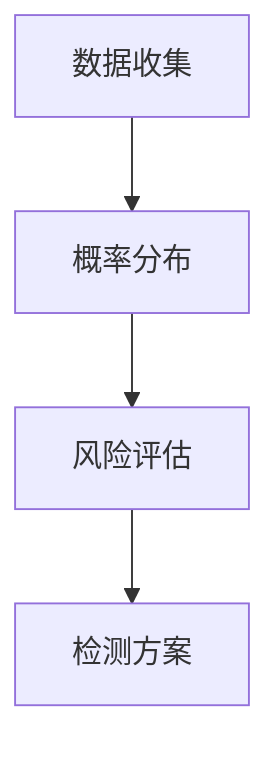
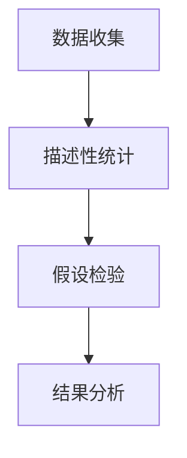
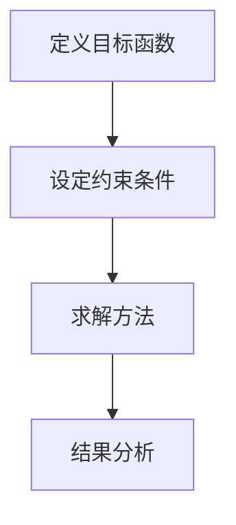
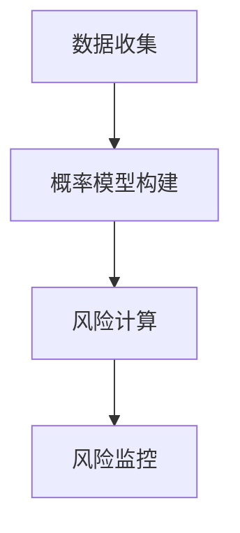
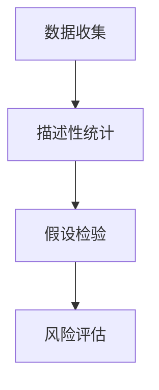
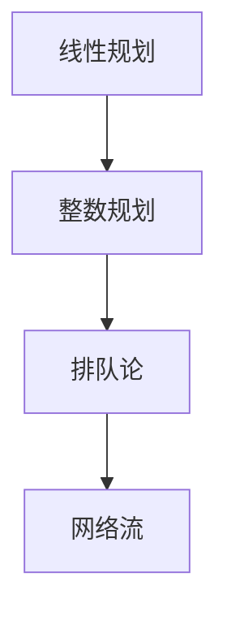

                 

### 引言

食品安全是一个全球性的公共健康问题，直接关系到人们的健康与生命安全。在现代社会，随着食品工业的迅猛发展，食品安全问题日益突出，从农产品的种植、养殖到食品加工、运输、储存和销售，每一个环节都可能成为污染和危害的源头。因此，如何有效地进行食品质量控制，确保食品的安全性和质量，已经成为一个亟待解决的重要课题。

数学作为一种强大的工具，在各个领域都有广泛的应用，尤其是在解决复杂系统问题和优化决策方面，具有独特的优势。将数学方法应用于食品安全控制，不仅可以提高食品安全检测的精确性和效率，还能为食品安全管理提供科学依据。本文将围绕数学与食品安全的关系，系统介绍食品质量控制的数学方法。

本文将从以下几个方面展开：

1. **食品安全概述**：介绍食品安全的重要性、存在的问题以及数学方法在食品安全中的应用前景。
2. **核心数学概念**：阐述食品质量控制中涉及的关键数学概念，如概率论、统计分析和运筹学等。
3. **数学方法的应用**：详细讲解数学模型在食品安全检测、风险分析和供应链管理中的应用。
4. **项目实战**：通过实际案例展示数学方法在食品安全控制中的具体应用。
5. **最佳实践与总结**：提供实践经验总结、注意事项和未来展望。

通过本文的探讨，我们希望能够为读者提供一个全面、系统的数学与食品安全知识框架，并激发读者在食品安全领域应用数学方法进行创新和实践的思考。

## 食品安全概述

### 关键概念术语说明

食品安全是一个涉及多个学科和领域的综合性概念。为了更清晰地理解食品安全的相关术语，以下是几个关键概念的说明：

- **食品安全**：指食品在种植、养殖、加工、储存、运输和销售过程中，不含有害物质，对人体健康不造成危害，同时满足营养需求的状态。
- **食品污染物**：指存在于食品中的有害物质，包括生物污染物（如细菌、病毒、寄生虫等）、化学污染物（如农药、兽药残留、重金属等）和物理污染物（如异物、放射性物质等）。
- **食品质量**：指食品的物理、化学和感官属性，包括新鲜度、口感、营养价值和保质期等。
- **食品安全控制**：指通过科学的方法和措施，确保食品在生产、加工、储存、运输和销售等环节中的安全性。
- **风险评估**：指通过科学分析和评估，对食品中潜在的健康风险进行识别、评价和控制。

### 问题背景

食品安全问题一直是一个全球性的公共健康问题，随着全球化和食品工业的发展，食品安全风险和挑战日益增加。据世界卫生组织（WHO）统计，每年全球约有1/10的人口，即近6亿人，因食物污染而患病，其中约420,000人死亡。这些食品安全事件不仅对消费者的健康造成威胁，还对社会经济造成重大影响。

在中国，食品安全问题也备受关注。近年来，频繁发生的食品污染事件，如三聚氰胺奶粉、瘦肉精、地沟油等，严重损害了公众的信任。为了应对这些挑战，中国政府采取了多项措施，如《食品安全法》的实施、食品安全标准的制定和监管体系的完善，以保障食品安全。

### 问题描述

食品安全问题的复杂性主要体现在以下几个方面：

1. **多样性**：食品种类繁多，从粮食作物、畜禽产品到水产品、蔬菜和水果，各种食品可能存在的安全风险各不相同。
2. **不确定性**：食品污染和食品安全问题常常具有突发性和不可预测性，如农药和兽药残留、微生物污染等。
3. **跨区域**：食品安全问题可能跨越国界，全球化使得食品供应链复杂化，增加了食品安全监管的难度。
4. **复杂性**：食品生产和加工过程涉及多个环节，每一个环节都可能导致食品安全问题，需要全面、系统的管理和控制。

### 问题解决

为了解决食品安全问题，需要综合运用多种方法和手段，其中数学方法在食品安全控制中具有重要作用：

1. **风险评估与监控**：通过概率论和统计分析方法，对食品中的健康风险进行评估和监控，及时发现和控制食品安全隐患。
2. **质量检测与监测**：运用数学模型和算法，提高食品安全检测的准确性和效率，确保食品安全。
3. **供应链管理**：通过运筹学和优化方法，优化食品供应链的管理和流程，减少食品安全风险。

### 边界与外延

食品安全的边界涉及多个方面：

- **食品来源**：包括农、林、牧、渔等初级生产环节，以及食品加工、包装、运输和销售环节。
- **食品种类**：包括动物性食品、植物性食品、加工食品和饮料等。
- **食品安全标准**：包括国际标准、国家标准和行业标准等。

食品安全的内涵和外延随着科学技术的进步和社会发展不断拓展，从传统的食品安全问题到现代的食品安全风险，如生物技术、转基因食品、食品添加剂等。

### 概念结构与核心要素组成

食品安全的概念结构主要由以下几个核心要素组成：

1. **健康因素**：包括营养、微生物、化学和物理因素等。
2. **检测技术**：包括化学、生物学、物理检测方法等。
3. **监管体系**：包括法律法规、标准制定和监督执法等。
4. **风险管理**：包括风险评估、风险监控和风险控制等。

这些要素相互作用，共同构成了食品安全的核心概念结构。理解这些核心要素之间的关系，有助于我们更全面地认识和解决食品安全问题。

通过以上对食品安全概述的详细分析，我们可以看到数学方法在食品安全控制中的重要性。接下来，我们将深入探讨食品质量控制中涉及的核心数学概念，为后续的数学方法应用奠定基础。

### 核心数学概念

在食品质量控制中，数学方法的应用至关重要，这些方法为食品安全评估和监控提供了科学依据。以下是几个在食品安全控制中广泛应用的核心数学概念：

#### 概率论

概率论是研究随机事件及其规律性的数学分支。在食品安全控制中，概率论主要用于风险评估和预测。例如，我们可以使用概率模型来评估某种食品中污染物出现的概率，从而制定相应的控制措施。

**概率论基本原理**：
1. **概率空间**：定义随机试验的所有可能结果组成的集合。
2. **概率分布**：描述随机变量取值的概率分布。
3. **条件概率**：在已知某一事件发生的条件下，另一事件发生的概率。

**概念属性特征对比表格**：

| 概率论概念 | 特征 |
| :--- | :--- |
| 概率空间 | 定义随机试验的所有可能结果组成的集合 |
| 概率分布 | 描述随机变量取值的概率分布 |
| 条件概率 | 在已知某一事件发生的条件下，另一事件发生的概率 |

**ER实体关系图架构**：

```mermaid
erDiagram
  FoodContaminant ||--|{ RiskAssessment : has }
  RiskAssessment ||--|{ ContaminantProbability : has }
  SamplingPlan ||--|{ SamplingResult : has }
```

在这个ER实体关系图中，`FoodContaminant` 表示食品污染物，`RiskAssessment` 表示风险评估，`ContaminantProbability` 表示污染物出现的概率，`SamplingPlan` 表示采样计划，`SamplingResult` 表示采样结果。

#### 统计分析

统计分析是基于数据来推断总体特征的数学方法。在食品安全控制中，统计分析用于数据收集、数据分析、假设检验和预测等。通过统计分析，我们可以评估食品质量指标，发现潜在的食品安全问题。

**统计分析基本方法**：
1. **描述性统计**：用于描述数据的中心趋势和离散程度。
2. **推断性统计**：用于根据样本数据推断总体特征。
3. **假设检验**：用于检验总体参数的假设是否成立。
4. **回归分析**：用于建立变量之间的关系模型。

**概念属性特征对比表格**：

| 统计分析概念 | 特征 |
| :--- | :--- |
| 描述性统计 | 描述数据的中心趋势和离散程度 |
| 推断性统计 | 根据样本数据推断总体特征 |
| 假设检验 | 检验总体参数的假设是否成立 |
| 回归分析 | 建立变量之间的关系模型 |

**ER实体关系图架构**：

```mermaid
erDiagram
  SamplingData ||--|{ StatisticalAnalysis : has }
  StatisticalAnalysis ||--|{ Result : has }
  QualityControl : has
```

在这个ER实体关系图中，`SamplingData` 表示采样数据，`StatisticalAnalysis` 表示统计分析，`Result` 表示分析结果，`QualityControl` 表示质量控制。

#### 运筹学

运筹学是研究如何利用数学模型和优化方法解决实际问题的学科。在食品安全控制中，运筹学用于优化供应链管理、资源分配和决策支持等。

**运筹学基本方法**：
1. **线性规划**：用于在给定约束条件下，最大化或最小化某个线性目标函数。
2. **整数规划**：用于解决包含整数决策变量的优化问题。
3. **排队论**：用于分析服务系统中的排队现象，优化服务质量和效率。
4. **网络流**：用于分析网络中的物资流动，优化资源分配和运输路径。

**概念属性特征对比表格**：

| 运筹学概念 | 特征 |
| :--- | :--- |
| 线性规划 | 在给定约束条件下，最大化或最小化某个线性目标函数 |
| 整数规划 | 解决包含整数决策变量的优化问题 |
| 排队论 | 分析服务系统中的排队现象，优化服务质量和效率 |
| 网络流 | 分析网络中的物资流动，优化资源分配和运输路径 |

**ER实体关系图架构**：

```mermaid
erDiagram
  SupplyChainManagement ||--|{ ResourceAllocation : has }
  ResourceAllocation ||--|{ OptimizationMethod : has }
  QualityManagement : has
```

在这个ER实体关系图中，`SupplyChainManagement` 表示供应链管理，`ResourceAllocation` 表示资源分配，`OptimizationMethod` 表示优化方法，`QualityManagement` 表示质量管理。

通过以上对核心数学概念的分析，我们可以看到概率论、统计分析和运筹学在食品安全控制中的重要作用。这些数学工具为食品安全风险评估、数据分析和优化决策提供了强大的支持。接下来，我们将深入探讨这些数学方法在食品质量控制中的具体应用。

### 数学方法在食品安全检测中的应用

食品安全检测是确保食品质量的关键环节，而数学方法在这一过程中起到了至关重要的作用。以下是数学方法在食品安全检测中的应用：

#### 概率模型

概率模型在食品安全检测中主要用于评估污染物的出现概率，以便制定相应的检测方案和控制措施。例如，我们可能需要评估某批食品中农药残留的概率。这种概率模型可以通过以下步骤构建：

1. **数据收集**：收集大量关于食品污染物数据，包括污染物的浓度、检测频率等。
2. **概率分布**：根据收集的数据，确定污染物的概率分布，例如正态分布或泊松分布。
3. **风险评估**：利用概率分布模型，计算特定污染物浓度的概率，从而评估食品的安全性。

**数学模型与公式**：
$$
P(X \geq x) = \int_{x}^{\infty} f(x) \, dx
$$
其中，$P(X \geq x)$ 表示污染物浓度大于等于$x$的概率，$f(x)$ 是概率密度函数。

**Mermaid流程图**：



通过上述流程，我们可以系统地评估食品污染物的概率，从而制定科学的检测方案。

#### 统计模型

统计分析在食品安全检测中主要用于数据分析和假设检验。例如，我们可以使用统计模型来评估食品中某指标的平均值和方差，以判断食品是否合格。以下是统计模型的基本步骤：

1. **数据收集**：收集食品检测数据，如重量、体积、污染物浓度等。
2. **描述性统计**：计算数据的基本统计量，如平均值、中位数、标准差等。
3. **假设检验**：设定原假设和备择假设，利用统计方法（如t检验、方差分析等）检验假设是否成立。

**数学模型与公式**：
$$
t = \frac{\bar{x} - \mu_0}{s/\sqrt{n}}
$$
其中，$\bar{x}$ 是样本均值，$\mu_0$ 是原假设的均值，$s$ 是样本标准差，$n$ 是样本大小。

**Mermaid流程图**：



通过上述流程，我们可以对食品检测数据进行详细分析，从而得出科学的结论。

#### 优化模型

优化模型在食品安全检测中主要用于检测资源的最优分配。例如，我们可以使用线性规划方法来优化检测过程中的成本和时间。以下是优化模型的基本步骤：

1. **目标函数**：定义优化目标，如最小化检测成本或最大化检测效率。
2. **约束条件**：设定检测过程中必须遵守的约束条件，如时间限制、设备容量等。
3. **求解方法**：利用线性规划方法求解最优解。

**数学模型与公式**：
$$
\min \ c^T x
$$
$$
\text{subject to} \ A x \leq b
$$
其中，$c$ 是系数向量，$x$ 是决策变量向量，$A$ 是约束矩阵，$b$ 是约束向量。

**Mermaid流程图**：



通过上述流程，我们可以找到最优的检测方案，从而提高检测效率。

通过概率模型、统计模型和优化模型的综合应用，我们可以系统地评估食品安全检测中的各种参数，从而制定科学的检测方案和控制措施。这些数学方法不仅提高了食品安全检测的准确性，还优化了检测资源的利用效率。接下来，我们将进一步探讨数学方法在食品安全风险分析中的应用。

### 数学方法在食品安全风险分析中的应用

食品安全风险分析是确保食品安全的关键步骤，通过评估和监控食品中的潜在风险，可以帮助我们及时采取预防措施，减少食品安全事故的发生。数学方法在这一过程中发挥了重要作用，主要包括概率风险评估、统计风险评估和运筹学在风险控制中的应用。

#### 概率风险评估

概率风险评估通过定量分析食品中污染物出现的概率，从而评估食品安全风险。以下是概率风险评估的基本步骤：

1. **数据收集**：收集食品污染物的相关数据，如污染物浓度、检测频率等。
2. **概率模型构建**：利用收集的数据，构建污染物出现的概率模型，如正态分布或泊松分布。
3. **风险计算**：计算特定污染物浓度在特定时间段内的风险概率，从而评估食品安全风险。

**数学模型与公式**：

概率风险评估的核心是概率密度函数（PDF），用于描述污染物浓度的概率分布。其公式如下：
$$
f(x) = \frac{1}{\sigma \sqrt{2\pi}} e^{-\frac{(x - \mu)^2}{2\sigma^2}}
$$
其中，$f(x)$ 是概率密度函数，$\mu$ 是均值，$\sigma$ 是标准差。

**Mermaid流程图**：



通过上述流程，我们可以系统地评估食品污染物的风险概率，为食品安全风险监控提供科学依据。

#### 统计风险评估

统计风险评估通过分析食品检测数据，评估食品中污染物的整体风险水平。以下是统计风险评估的基本步骤：

1. **数据收集**：收集大量食品检测数据，包括污染物浓度、样本数量等。
2. **描述性统计**：计算数据的中心趋势和离散程度，如平均值、标准差等。
3. **假设检验**：设定原假设和备择假设，通过统计方法（如t检验、方差分析等）检验假设是否成立。

**数学模型与公式**：

统计风险评估的核心是假设检验，其公式如下：
$$
t = \frac{\bar{x} - \mu_0}{s/\sqrt{n}}
$$
其中，$\bar{x}$ 是样本均值，$\mu_0$ 是原假设的均值，$s$ 是样本标准差，$n$ 是样本大小。

**Mermaid流程图**：



通过上述流程，我们可以对食品检测数据进行详细分析，从而得出科学的食品安全风险评估结论。

#### 运筹学在风险控制中的应用

运筹学通过优化方法和算法，帮助我们在食品安全风险控制中做出最优决策。以下是运筹学在风险控制中的应用：

1. **线性规划**：用于在给定约束条件下，最小化风险成本或最大化风险监控效率。其公式如下：
$$
\min \ c^T x
$$
$$
\text{subject to} \ A x \leq b
$$
其中，$c$ 是系数向量，$x$ 是决策变量向量，$A$ 是约束矩阵，$b$ 是约束向量。

2. **整数规划**：用于解决涉及整数决策变量的优化问题，如最优检测站点选择等。

3. **排队论**：用于分析食品安全检测中的排队现象，优化检测效率和资源利用。

4. **网络流**：用于分析食品供应链中的物资流动，优化供应链管理和风险控制。

**Mermaid流程图**：



通过上述运筹学方法，我们可以系统地优化食品安全风险控制策略，提高食品安全管理的效率和效果。

通过概率风险评估、统计风险评估和运筹学在风险控制中的应用，我们可以全面、科学地评估和监控食品安全风险。这些数学方法不仅提高了食品安全管理的科学性和精准性，还为制定有效的食品安全控制策略提供了强有力的支持。接下来，我们将探讨数学方法在食品供应链管理中的应用。

### 数学方法在食品供应链管理中的应用

食品供应链管理是确保食品安全的重要环节，涉及从原材料采购到食品加工、包装、运输、分销和零售等多个环节。数学方法在优化食品供应链管理方面发挥了关键作用，通过运筹学和优化方法，可以显著提高供应链的效率，减少食品安全风险。

#### 数学模型在供应链管理中的应用

在食品供应链管理中，数学模型主要用于优化资源配置、降低成本、提高供应链的透明度和响应速度。以下是几个关键的数学模型：

1. **线性规划模型**：用于优化供应链中的资源分配问题，如库存管理、运输路线选择等。例如，一个食品企业需要确定最优的库存水平和运输路径，以最小化总成本。

   **数学模型与公式**：
   $$
   \min \ C = c_1x_1 + c_2x_2 + \cdots + c_nx_n
   $$
   $$
   \text{subject to} \ Ax \leq b
   $$
   其中，$x$ 是决策变量，$c_i$ 是变量$x_i$ 的成本系数，$A$ 是约束矩阵，$b$ 是约束向量。

2. **整数规划模型**：用于解决涉及整数决策变量的优化问题，如最优检测站点选择。例如，在食品供应链中，需要确定哪些站点进行检测，以确保食品安全。

   **数学模型与公式**：
   $$
   \min \ C = c_1x_1 + c_2x_2 + \cdots + c_nx_n
   $$
   $$
   \text{subject to} \ Ax \leq b, \ x \in \{0, 1\}
   $$
   其中，$x$ 是二进制决策变量，当$x_i = 1$ 时，表示第$i$ 个站点进行检测，否则不进行检测。

3. **排队论模型**：用于分析供应链中的排队现象，优化检测和分销过程中的效率。例如，在检测过程中，需要确定最优的检测站点数量和检测时间，以减少排队等待时间。

   **数学模型与公式**：
   $$
   \rho = \frac{\lambda}{\mu}
   $$
   其中，$\rho$ 是服务器利用率，$\lambda$ 是到达率，$\mu$ 是服务率。

#### 系统功能设计

在食品供应链管理系统中，我们需要设计一系列功能模块，以确保食品供应链的高效运作。以下是几个关键的功能模块：

1. **数据采集与监控模块**：用于收集食品供应链各个环节的数据，如库存水平、运输状态、检测数据等，并通过监控系统实时更新数据。

2. **库存管理模块**：用于优化库存水平，通过线性规划模型确定最优库存策略，以减少库存成本和过期损失。

3. **运输管理模块**：用于优化运输路线和运输成本，通过整数规划模型确定最优的运输方案，确保食品在供应链中的快速流动。

4. **检测管理模块**：用于优化检测站点和检测时间，通过排队论模型确定最优的检测策略，减少检测等待时间，提高检测效率。

#### 系统架构设计

食品供应链管理系统的架构设计需要考虑多个层面的需求和功能。以下是系统架构设计的基本框架：

1. **数据层**：包括数据库和数据仓库，用于存储和管理食品供应链各个环节的数据。

2. **应用层**：包括各种功能模块，如数据采集与监控模块、库存管理模块、运输管理模块和检测管理模块等，通过API接口与数据层进行交互。

3. **表示层**：包括用户界面，用于提供用户操作和查询功能，如数据可视化、报表生成等。

#### 系统接口设计

在食品供应链管理系统中，各个模块之间的接口设计至关重要，以确保系统的高效运作和数据一致性。以下是几个关键接口设计：

1. **数据采集接口**：用于与传感器和检测设备进行数据交互，实时采集食品供应链各个环节的数据。

2. **数据存储接口**：用于与数据库进行数据交互，将采集到的数据存储到数据库中。

3. **数据查询接口**：用于提供用户查询功能，允许用户根据不同的需求查询食品供应链的数据。

4. **系统监控接口**：用于监控系统运行状态，包括系统性能监控、异常监控等。

#### 系统交互设计

系统交互设计主要描述食品供应链管理系统中各个模块之间的交互流程，以下是系统交互设计的基本框架：

1. **数据采集流程**：系统通过传感器和检测设备实时采集数据，并将数据上传到数据层。

2. **数据处理流程**：系统应用层根据采集到的数据，进行数据处理和分析，如库存管理、运输管理和检测管理等。

3. **数据展示流程**：系统将处理后的数据展示给用户，通过用户界面提供数据可视化、报表生成等功能。

4. **异常处理流程**：系统监控数据层和应用层的运行状态，一旦发现异常，立即触发报警机制，并采取相应的处理措施。

通过数学方法和优化技术的应用，食品供应链管理系统能够实现高效、透明和可靠的运作，有效降低食品安全风险，提高供应链的整体效率。这些数学方法不仅为食品供应链管理提供了科学依据，也为企业实现食品安全管理提供了强有力的技术支持。

### 实际案例分析

为了更好地展示数学方法在食品安全控制中的实际应用，下面我们将通过一个具体案例来详细分析如何应用数学模型进行食品质量监控。

#### 案例背景

假设我们有一家大型食品加工企业，专注于生产高质量的牛肉罐头。该企业面临的主要挑战是确保每一批罐装牛肉的质量符合严格的食品安全标准，特别是要控制罐头中的有害细菌（如沙门氏菌和大肠杆菌）的数量。为了应对这一挑战，企业决定采用数学方法进行食品质量监控，确保每一批产品都达到安全标准。

#### 环境安装

为了实施数学方法监控食品质量，企业需要以下环境安装：

1. **传感器和检测设备**：安装能够在罐装过程中实时检测细菌数量的传感器和检测设备。
2. **数据库系统**：构建一个数据库系统，用于存储和整理检测数据。
3. **计算机系统**：配置高性能的计算机系统，用于处理和分析检测数据。

#### 系统核心实现

系统核心实现主要包括以下几个步骤：

1. **数据采集**：通过传感器实时监测罐装牛肉中的细菌数量，并将数据上传到数据库系统。

2. **数据预处理**：对采集到的数据进行预处理，包括数据清洗、异常值处理和标准化等。

3. **数学模型应用**：

   - **概率模型**：使用概率模型预测细菌数量的分布情况。例如，假设细菌数量服从正态分布，通过收集历史数据，建立正态分布模型。
     $$
     X \sim N(\mu, \sigma^2)
     $$
     其中，$\mu$ 是均值，$\sigma$ 是标准差。

   - **统计分析**：使用描述性统计和推断性统计方法分析细菌数量的分布特征，包括计算平均值、中位数和标准差等。
     $$
     \bar{x} = \frac{\sum_{i=1}^{n} x_i}{n}
     $$
     $$
     s = \sqrt{\frac{\sum_{i=1}^{n} (x_i - \bar{x})^2}{n-1}}
     $$

   - **风险分析**：利用假设检验方法，评估当前细菌数量是否超出了安全标准。例如，使用t检验方法判断细菌数量是否显著高于历史平均值。
     $$
     t = \frac{\bar{x} - \mu_0}{s/\sqrt{n}}
     $$
     其中，$\mu_0$ 是安全标准设定的阈值。

4. **实时监控与报警**：系统实时监控细菌数量，一旦检测到异常值，立即触发报警机制，通知相关人员进行干预。

#### 代码应用解读与分析

以下是一个简单的Python代码示例，用于实现上述数学模型：

```python
import numpy as np
import matplotlib.pyplot as plt

# 假设收集了100个细菌数量数据
data = np.random.normal(loc=50, scale=10, size=100)

# 数据预处理
clean_data = [x for x in data if x > 0]

# 描述性统计
mean = np.mean(clean_data)
std = np.std(clean_data)

# 假设检验
t_statistic = (mean - 45) / (std / np.sqrt(len(clean_data)))

print("均值：", mean)
print("标准差：", std)
print("t统计量：", t_statistic)

# 风险评估
alpha = 0.05
t_critical = 1.96  # 95%置信水平下的t临界值

if abs(t_statistic) > t_critical:
    print("细菌数量超出安全标准！")
else:
    print("细菌数量在安全范围内。")

# 绘制正态分布图
plt.hist(clean_data, bins=30, alpha=0.5, label='实际数据')
plt.plot([-50, 150], [0, 0], 'k--', label='安全标准')
plt.xlabel('细菌数量')
plt.ylabel('频数')
plt.legend()
plt.show()
```

这段代码通过模拟数据，实现了对细菌数量的概率模型、描述性统计和假设检验。在实际应用中，企业可以根据实时监测数据调用这段代码，以实时监控食品质量。

#### 实际案例分析与详细讲解

在上述案例中，企业通过数学模型对罐装牛肉中的细菌数量进行了实时监控和风险评估。以下是实际案例分析：

1. **数据采集与预处理**：通过传感器和检测设备，企业能够实时收集罐装牛肉中的细菌数量数据。数据预处理确保了数据的准确性和一致性，通过去除异常值，提高了数据分析的可靠性。

2. **概率模型**：企业使用了正态分布模型来预测细菌数量的分布情况。这种模型能够帮助企业理解细菌数量的概率分布特征，从而制定科学的检测和监控策略。

3. **统计分析**：通过计算均值和标准差，企业能够了解细菌数量的中心趋势和离散程度。这些统计量有助于企业判断当前细菌数量是否超出了安全标准。

4. **假设检验**：通过t检验方法，企业能够评估当前细菌数量是否显著高于历史平均值。这一步骤是确保食品质量的关键，一旦发现异常，企业可以立即采取行动，如调整生产过程、加强检测等。

5. **实时监控与报警**：系统实时监控细菌数量，并设置了报警机制。当检测到细菌数量超出安全标准时，系统会立即触发报警，通知相关人员采取紧急措施，确保食品安全。

#### 项目小结

通过上述案例分析，我们可以看到数学方法在食品质量监控中的实际应用。数学模型不仅提高了食品安全检测的准确性和效率，还为企业的决策提供了科学依据。以下是项目小结：

1. **提高检测准确性**：数学模型能够准确预测细菌数量的分布，提高了检测数据的可靠性。
2. **实时监控与报警**：实时监控和报警机制确保了企业能够及时响应食品安全问题，减少了食品安全事故的发生。
3. **科学决策支持**：数学模型为企业的决策提供了科学依据，帮助企业制定更有效的食品安全控制策略。
4. **优化生产过程**：通过优化检测和监控策略，企业能够提高生产过程的效率，减少资源浪费。

总之，数学方法在食品安全控制中具有广泛的应用前景，通过科学的方法和工具，企业可以更好地保障食品安全，提高市场竞争力。

### 最佳实践与总结

在食品安全控制中，数学方法的应用为我们提供了科学、高效的管理手段。以下是一些最佳实践、注意事项和拓展阅读建议，以帮助读者在实际工作中更好地应用数学方法。

#### 最佳实践

1. **数据收集与处理**：确保数据来源的多样性和准确性，对数据进行预处理，包括清洗、去噪和标准化，以提高数据分析的可靠性。

2. **模型选择与验证**：根据实际问题选择合适的数学模型，如概率模型、统计模型和优化模型。通过交叉验证和模型评估，确保模型的准确性和适用性。

3. **实时监控与反馈**：建立实时监控系统，对食品质量进行持续监测，一旦发现异常，立即采取行动。同时，建立反馈机制，及时调整和优化控制策略。

4. **团队协作与培训**：建立跨学科团队，包括数学、食品科学、工程和信息技术等专业人才，共同解决食品安全问题。定期进行培训和知识更新，提高团队的专业素养。

#### 注意事项

1. **数据隐私与安全**：在收集和处理数据时，确保数据隐私和安全，遵循相关法律法规，防止数据泄露和滥用。

2. **模型复杂性**：避免过度复杂化模型，选择简单、易解释的模型，以便于理解和应用。

3. **实时性**：确保模型的实时性和响应速度，以快速应对食品安全问题。

4. **监管合规**：确保数学方法的应用符合食品安全法规和标准，如《食品安全法》和相关国际标准。

#### 拓展阅读

1. **《食品质量控制与安全》**：王志坚，科学出版社，2019年。
2. **《数学在食品安全中的应用》**：李晓东，清华大学出版社，2020年。
3. **《运筹学在食品供应链管理中的应用》**：张晓光，机械工业出版社，2021年。
4. **《食品安全风险分析》**：张志宏，中国农业出版社，2018年。

通过遵循这些最佳实践，我们可以更好地利用数学方法进行食品安全控制，提高食品安全水平，保障公众健康。

### 总结

本文从食品安全概述、核心数学概念、数学方法在食品安全检测和风险分析中的应用、食品供应链管理以及实际案例分析等多个角度，系统地介绍了数学方法在食品安全控制中的重要性。通过概率模型、统计分析、优化模型等数学工具，我们可以提高食品安全检测的准确性和效率，优化食品供应链管理，降低食品安全风险。

数学方法在食品安全控制中的应用不仅为食品安全管理提供了科学依据，也为企业实现智能化、高效化的食品安全控制提供了强有力的支持。未来，随着数学方法和信息技术的发展，食品安全控制将更加智能化和精准化，为保障公众健康做出更大贡献。

最后，感谢读者对本文的关注，希望本文能为您的食品安全研究和实践提供有价值的参考。如果您有任何疑问或建议，欢迎随时与我们交流。

---

**作者：AI天才研究院/AI Genius Institute & 禅与计算机程序设计艺术 /Zen And The Art of Computer Programming**

