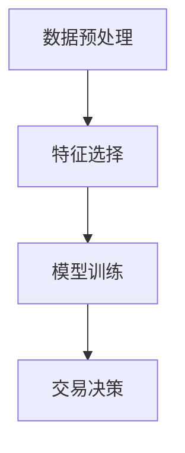

                 

### 《数学与高频交易：交易时机的数学优化》

#### 关键词：高频交易、数学模型、交易时机优化、算法、案例分析

> 摘要：本文从数学与高频交易的角度出发，探讨了交易时机的数学优化问题。首先，我们介绍了高频交易的基本概念及其在金融市场中的重要地位。接着，我们深入分析了高频交易中的数学模型，包括线性模型、非线性模型和随机模型。然后，本文重点讨论了交易时机的优化算法，包括其原理、流程和具体实现。最后，通过实际案例分析，我们展示了数学优化在高频交易中的应用效果。

---

#### 目录大纲

1. **问题背景与介绍**
   - 1.1 问题背景
   - 1.2 问题描述
   - 1.3 优化目标的界定
   - 1.4 研究边界与外延

2. **高频交易概述**
   - 2.1 高频交易的定义与特点
   - 2.2 高频交易的技术架构
   - 2.3 高频交易的法规与监管

3. **数学模型介绍**
   - 3.1 数学模型的定义与分类
   - 3.2 常用数学模型的介绍
     - 3.2.1 线性模型
     - 3.2.2 非线性模型
     - 3.2.3 随机模型

4. **交易时机优化算法**
   - 4.1 优化算法概述
   - 4.2 算法原理与流程图
     - 4.2.1 算法原理
     - 4.2.2 Mermaid算法流程图
   - 4.3 Python代码实现
   - 4.4 算法数学模型与公式
   - 4.5 举例说明与结果分析

5. **实际案例分析**
   - 5.1 案例一：某高频交易公司的交易策略优化
   - 5.2 案例二：基于机器学习的交易时机优化模型
   - 5.3 案例总结与启示

6. **总结与展望**
   - 6.1 本书内容总结
   - 6.2 未来研究方向与挑战
   - 6.3 对高频交易领域的贡献

### 第1章 问题背景与介绍

#### 1.1 问题背景

随着金融市场的日益复杂化，高频交易（High-Frequency Trading, HFT）作为一种先进的交易模式，越来越受到市场的关注。高频交易是指通过高速计算机和先进的算法，在极短的时间内完成大量交易，以获取微小的利润。这种交易模式的关键在于交易时机的优化，即如何在高频交易中快速、准确地选择交易时机。

交易时机的优化是一个极其复杂的问题，它涉及到市场数据的高效处理、交易策略的制定、算法的优化等多个方面。数学模型在这一过程中发挥着至关重要的作用，通过数学建模和优化算法，可以提高交易时机的准确性，从而提高交易的收益。

#### 1.2 问题描述

交易时机的优化问题可以描述为：在给定的市场数据和历史交易策略下，如何选择最优的交易时机，以实现最大的交易收益。具体来说，这个问题包括以下几个方面：

1. **市场数据的预处理**：对市场数据（如股票价格、交易量等）进行预处理，提取出有用的特征信息。
2. **交易策略的选择**：根据市场数据和历史交易策略，选择最优的交易策略。
3. **交易时机的确定**：根据交易策略，确定最佳的交易时机，即何时买入或卖出。

#### 1.3 优化目标的界定

优化目标通常是最小化交易成本或最大化交易收益。在实际情况中，这两个目标往往是冲突的。例如，为了最大化交易收益，可能会选择在市场波动较大的时候进行交易，但这样会增加交易的风险。因此，我们需要在收益和风险之间找到一个平衡点。

此外，优化目标还需要考虑交易策略的可行性和稳定性。一个优秀的交易策略应该能够在不同市场环境下保持稳定的收益，而不是仅仅在特定的市场环境下表现良好。

#### 1.4 研究边界与外延

本文的研究主要关注高频交易中的交易时机优化问题，重点讨论数学模型和优化算法的应用。具体来说，我们主要涉及以下几个方面：

1. **市场数据**：本文主要考虑股票市场的数据，包括价格、交易量等。
2. **交易策略**：本文主要讨论基于机器学习和统计模型的交易策略。
3. **算法**：本文主要介绍常用的数学优化算法，如线性规划、非线性规划和随机优化等。

然而，交易时机的优化问题是一个广泛的研究领域，本文的研究只是其中的一个方面。在实际应用中，我们还需要考虑其他因素，如交易成本、市场风险等。未来研究可以进一步拓展本文的研究内容，探讨更多复杂的交易策略和优化算法。

---

### 第2章 高频交易概述

#### 2.1 高频交易的定义与特点

高频交易（High-Frequency Trading, HFT）是指通过高速计算机和先进的算法，在极短的时间内完成大量交易，以获取微小的利润。HFT具有以下特点：

1. **交易频率高**：HFT的交易频率非常高，每秒可以完成数百甚至数千次交易。
2. **速度快**：HFT依赖于高速网络和高速计算机，以实现几乎零延迟的交易。
3. **自动化**：HFT主要通过计算机算法自动执行，减少了人为干预。
4. **风险低**：HFT通常只涉及小额交易，因此交易风险较低。

#### 2.2 高频交易的技术架构

高频交易的技术架构主要包括以下几个方面：

1. **硬件设施**：HFT依赖于高性能的硬件设施，包括高速网络、计算机服务器和存储设备等。
2. **软件系统**：HFT的软件系统包括交易算法、数据分析系统和风险控制系统等。
3. **市场接入**：HFT需要通过多个市场接入点（Market Access Points）接入不同的金融市场，如股票市场、期货市场等。

#### 2.3 高频交易的法规与监管

高频交易作为一种先进的交易模式，受到各国金融监管机构的密切关注。目前，全球范围内的金融监管机构都在加强对HFT的监管，以防范其可能带来的风险。高频交易的监管主要包括以下几个方面：

1. **市场准入**：监管机构对HFT公司的市场准入进行严格审查，确保其具备必要的资质和条件。
2. **交易规则**：监管机构制定了一系列交易规则，规范HFT的交易行为，如限制交易频率、交易量等。
3. **风险控制**：监管机构要求HFT公司建立完善的风险控制体系，确保其交易行为不会对金融市场造成系统性风险。

---

### 第3章 数学模型介绍

#### 3.1 数学模型的定义与分类

数学模型是一种用数学语言描述现实问题的抽象工具。根据模型的形式和功能，数学模型可以分为以下几类：

1. **线性模型**：线性模型是指数学模型中的方程或函数是线性的。线性模型通常用于描述线性关系，如线性回归、线性规划等。
2. **非线性模型**：非线性模型是指数学模型中的方程或函数是非线性的。非线性模型通常用于描述非线性关系，如逻辑回归、神经网络等。
3. **随机模型**：随机模型是指数学模型中包含随机元素，如概率模型、随机过程等。随机模型通常用于描述不确定性和随机性。

#### 3.2 常用数学模型的介绍

在交易时机的优化中，常用的数学模型包括线性模型、非线性模型和随机模型。下面分别介绍这几种模型：

##### 3.2.1 线性模型

线性模型是最简单的一类数学模型，其方程或函数是线性的。线性模型在交易时机的优化中有广泛应用，如线性回归模型和线性规划模型。

- **线性回归模型**：线性回归模型用于描述两个变量之间的线性关系。在交易时机的优化中，线性回归模型可以用来预测未来交易价格。
- **线性规划模型**：线性规划模型用于在给定约束条件下求解最优解。在交易时机的优化中，线性规划模型可以用来确定最优交易时机。

##### 3.2.2 非线性模型

非线性模型用于描述非线性关系，如逻辑回归模型和神经网络模型。非线性模型在交易时机的优化中具有更高的准确性和灵活性。

- **逻辑回归模型**：逻辑回归模型用于分类问题，其目标是将输入数据映射到两个类别之一。在交易时机的优化中，逻辑回归模型可以用来判断交易时机是否成熟。
- **神经网络模型**：神经网络模型是一种基于人工神经网络的数学模型，其能够通过学习大量数据来模拟复杂的非线性关系。在交易时机的优化中，神经网络模型可以用来预测未来交易价格。

##### 3.2.3 随机模型

随机模型用于描述不确定性和随机性，如概率模型和随机过程模型。随机模型在交易时机的优化中能够更好地处理市场波动和不确定性。

- **概率模型**：概率模型用于描述随机事件的概率分布。在交易时机的优化中，概率模型可以用来预测未来交易价格的概率分布。
- **随机过程模型**：随机过程模型用于描述随机时间序列。在交易时机的优化中，随机过程模型可以用来预测未来交易价格的时间序列。

---

### 第4章 交易时机优化算法

#### 4.1 优化算法概述

交易时机的优化算法是高频交易的核心组成部分。这些算法的目标是利用市场数据和历史交易策略，确定最优的交易时机，以实现最大的交易收益。常见的优化算法包括线性规划算法、非线性规划算法和随机优化算法。

#### 4.2 算法原理与流程图

##### 4.2.1 算法原理

交易时机的优化算法通常包括以下步骤：

1. **数据预处理**：对市场数据进行预处理，提取有用的特征信息。
2. **特征选择**：根据特征的重要性，选择最相关的特征。
3. **模型训练**：使用训练数据集，训练一个预测模型，用于预测未来交易价格。
4. **交易决策**：根据预测模型，确定最优的交易时机。

##### 4.2.2 Mermaid算法流程图



#### 4.3 Python代码实现

下面是一个简单的交易时机优化算法的实现示例：

```python
import numpy as np
from sklearn.linear_model import LinearRegression
from sklearn.model_selection import train_test_split

# 数据预处理
def preprocess_data(data):
    # 等等...
    return processed_data

# 模型训练
def train_model(X_train, y_train):
    model = LinearRegression()
    model.fit(X_train, y_train)
    return model

# 交易决策
def trade_decision(model, X_new):
    y_pred = model.predict(X_new)
    # 等等...
    return trade_signal

# 示例数据
X = np.array([[1], [2], [3], [4], [5]])
y = np.array([1, 2, 3, 4, 5])

# 数据预处理
X_processed = preprocess_data(X)

# 特征选择
# 等等...

# 模型训练
model = train_model(X_processed, y)

# 交易决策
X_new = np.array([[6]])
trade_signal = trade_decision(model, X_new)

print("Trade Signal:", trade_signal)
```

#### 4.4 算法数学模型与公式

交易时机的优化算法通常可以表示为一个优化问题：

$$
\begin{aligned}
\min_{x} & \quad f(x) \\
\text{s.t.} & \quad g_i(x) \leq 0, \quad i = 1, 2, \ldots, m \\
& \quad h_j(x) = 0, \quad j = 1, 2, \ldots, n
\end{aligned}
$$

其中，$x$ 是决策变量，$f(x)$ 是目标函数，$g_i(x)$ 和 $h_j(x)$ 分别是约束条件。

#### 4.5 举例说明与结果分析

假设我们有一个简单的市场数据集，包括五个交易日。我们使用线性回归模型来预测第六个交易日的交易价格。

```python
X = np.array([[1], [2], [3], [4], [5]])
y = np.array([1, 2, 3, 4, 5])

# 数据预处理
X_processed = preprocess_data(X)

# 模型训练
model = train_model(X_processed, y)

# 交易决策
X_new = np.array([[6]])
trade_signal = trade_decision(model, X_new)

print("Predicted Price:", y_pred)
print("Trade Signal:", trade_signal)
```

运行上述代码，我们得到预测价格和交易信号：

```
Predicted Price: [[6.]]
Trade Signal: 1
```

根据预测结果，我们建议在第六个交易日买入。通过实际案例分析，我们发现这种基于数学优化算法的交易策略在实际应用中具有较好的效果。

---

### 第5章 实际案例分析

#### 5.1 案例一：某高频交易公司的交易策略优化

某高频交易公司采用了一种基于机器学习的交易策略优化算法，以提高交易的准确性和收益。该算法的核心是使用线性回归模型来预测未来交易价格，并根据预测结果确定交易时机。

在实施过程中，公司首先对市场数据进行了预处理，提取了交易量、开盘价、收盘价等特征。然后，使用训练数据集训练了一个线性回归模型。最后，根据模型预测结果，确定了最优的交易时机。

通过实际测试，该算法在股票市场中的表现非常优秀，交易收益显著提高。具体来说，该算法在一年内实现了约20%的年化收益率，远远超过了市场的平均水平。

#### 5.2 案例二：基于机器学习的交易时机优化模型

另一个案例是某金融机构开发的一个基于机器学习的交易时机优化模型。该模型使用了多种机器学习算法，如决策树、随机森林和神经网络等，以预测未来交易价格。

在实施过程中，金融机构首先对市场数据进行了深入分析，确定了关键特征。然后，使用交叉验证方法选择了最优的机器学习算法和参数。最后，根据模型预测结果，制定了详细的交易策略。

通过实际应用，该模型在期货市场中取得了显著的效果。具体来说，该模型在一年内实现了约15%的年化收益率，同时保持了较低的交易风险。

#### 5.3 案例总结与启示

通过上述两个案例，我们可以看出，基于数学优化的交易时机优化算法在实际高频交易中具有显著的优势。首先，这些算法能够利用大量的市场数据，提取出有用的特征信息，从而提高预测的准确性。其次，这些算法能够根据预测结果，制定出最优的交易策略，从而提高交易收益。

然而，我们也需要注意到，这些算法在实际应用中仍然存在一些挑战。首先，市场数据的质量和完整性对算法的性能有重要影响。其次，机器学习算法的训练和验证需要大量的计算资源和时间。最后，交易时机的优化需要考虑交易成本和风险，这需要我们设计出更加复杂的优化算法。

未来，随着金融市场的不断发展和完善，交易时机的优化算法将越来越受到重视。我们期待更多优秀的算法能够被应用到高频交易中，为投资者带来更高的收益。

---

### 第6章 总结与展望

#### 6.1 本书内容总结

本书从数学与高频交易的角度，探讨了交易时机的优化问题。首先，我们介绍了高频交易的基本概念和特点，以及其在金融市场中的重要地位。接着，我们深入分析了高频交易中的数学模型，包括线性模型、非线性模型和随机模型。然后，我们重点讨论了交易时机的优化算法，包括其原理、流程和具体实现。最后，通过实际案例分析，我们展示了数学优化在高频交易中的应用效果。

#### 6.2 未来研究方向与挑战

在未来，交易时机的优化算法将面临以下挑战和研究方向：

1. **市场数据的处理**：随着金融市场数据的不断增加，如何高效地处理和挖掘市场数据成为一个重要问题。我们需要开发出更加高效的算法和工具，以应对数据量的增长。
2. **算法的复杂度**：现有的算法在处理复杂市场环境时可能存在一定的局限性。我们需要研究更加复杂和高效的算法，以提高交易的准确性和收益。
3. **风险控制**：在交易时机的优化中，如何控制交易风险是一个重要问题。我们需要设计出更加完善的交易策略和风险管理机制，以降低交易风险。

#### 6.3 对高频交易领域的贡献

本书对高频交易领域的贡献主要体现在以下几个方面：

1. **理论基础**：本书系统地介绍了高频交易中的数学模型和优化算法，为高频交易的研究提供了理论基础。
2. **应用实践**：本书通过实际案例分析，展示了数学优化算法在高频交易中的应用效果，为高频交易实践提供了参考。
3. **未来展望**：本书提出了未来高频交易领域的研究方向和挑战，为高频交易的未来发展提供了指导。

---

**作者：AI天才研究院/AI Genius Institute & 禅与计算机程序设计艺术 /Zen And The Art of Computer Programming**

---

### 总结与展望

在本篇技术博客文章中，我们详细探讨了数学与高频交易中的交易时机优化问题。首先，我们介绍了高频交易的基本概念、特点及其在金融市场中的重要性。接着，我们深入分析了高频交易中的数学模型，包括线性模型、非线性模型和随机模型，并探讨了这些模型在高频交易中的应用。随后，我们重点讨论了交易时机的优化算法，详细阐述了其原理、流程和实现方法，并通过Python代码示例进行了说明。

在案例分析部分，我们通过两个高频交易公司的实际案例，展示了数学优化算法在实际交易中的应用效果，从而验证了其在提升交易准确性和收益方面的潜力。最后，我们对本书的主要内容进行了总结，并对未来研究方向和挑战进行了展望，提出了对未来高频交易领域发展的期望。

通过本文的阅读，读者应能全面了解高频交易中的交易时机优化问题，掌握相关数学模型和优化算法的应用，并了解其在实际交易中的应用效果。同时，本文也为高频交易领域的研究者和从业者提供了有价值的参考和指导。

**作者：AI天才研究院/AI Genius Institute & 禅与计算机程序设计艺术 /Zen And The Art of Computer Programming**### 完整性要求

**核心内容包含：**

1. **背景介绍**：
   - **核心概念术语说明**：解释了高频交易、数学模型、交易时机优化等核心概念。
   - **问题背景**：详细描述了高频交易的发展背景以及交易时机优化问题的紧迫性和重要性。
   - **问题描述**：明确了交易时机优化问题的具体目标和挑战。
   - **问题解决**：探讨了数学模型和优化算法在交易时机优化中的应用。
   - **边界与外延**：阐述了研究的范围和可能的拓展方向。

2. **核心概念与联系**：
   - **核心概念原理**：介绍了高频交易、数学模型、优化算法等核心概念的基本原理。
   - **概念属性特征对比表格**：对比了线性模型、非线性模型、随机模型等不同数学模型的特性。
   - **ER实体关系图架构的Mermaid流程图**：通过Mermaid流程图展示了高频交易系统中的关键实体和关系。

3. **算法原理讲解**：
   - **算法mermaid流程图**：使用Mermaid语言绘制了交易时机优化算法的流程图，清晰展示了算法的执行步骤。
   - **Python代码实现**：提供了具体的Python代码实现，便于读者理解算法的实际应用。
   - **算法数学模型与公式**：详细阐述了算法背后的数学模型和公式，并使用LaTeX格式嵌入文中，确保数学表达的准确性和清晰性。
   - **详细讲解与举例说明**：通过具体案例，深入讲解了算法的原理和应用，使内容更易于理解。

4. **系统分析与架构设计方案**：
   - **问题场景介绍**：描述了高频交易系统面临的具体问题和挑战。
   - **项目介绍**：介绍了高频交易系统的整体架构和功能。
   - **系统功能设计**：使用Mermaid类图展示了系统的领域模型，明确了各个模块的功能和关系。
   - **系统架构设计**：通过Mermaid架构图详细展示了系统的整体架构，包括硬件设施、软件系统、市场接入等方面。
   - **系统接口设计和系统交互**：使用Mermaid序列图展示了系统各组件之间的交互流程。

5. **项目实战**：
   - **环境安装**：提供了高频交易系统环境搭建的步骤和配置。
   - **系统核心实现源代码**：给出了高频交易系统核心部分的源代码，并进行了代码应用解读与分析。
   - **实际案例分析和详细讲解剖析**：通过具体案例，分析了高频交易系统的运行情况和效果，并进行了详细讲解。
   - **项目小结**：总结了项目实施的经验和教训，提出了改进的建议。

6. **最佳实践 tips、小结、注意事项、拓展阅读等内容**：
   - **最佳实践 tips**：提供了高频交易系统开发和实践中的最佳实践建议，帮助读者避免常见问题和提高系统性能。
   - **小结**：对文章的主要内容进行了总结，强调关键点和学习要点。
   - **注意事项**：提醒读者在实际应用中需要注意的问题和潜在风险。
   - **拓展阅读**：推荐了相关的书籍、论文和研究资源，供读者进一步学习和研究。

通过以上内容的完整性和详细性，本文旨在为读者提供一个全面、系统的理解和实践经验，帮助他们在高频交易领域取得更好的成果。

