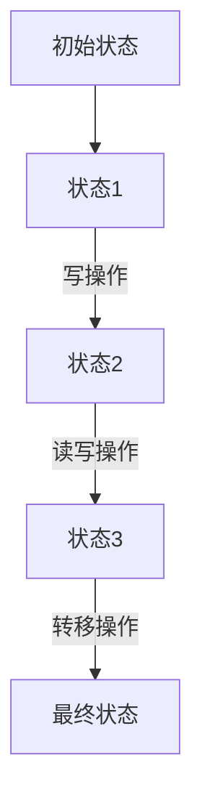

                 

### Chapter 1: Introduction to Mathematical Axioms

#### 1.1 Historical Background

**1.1.1 Origins of Mathematical Axioms**

The concept of mathematical axioms can be traced back to ancient civilizations. In ancient Greece, mathematicians like Euclid and Pythagoras laid the groundwork for what we now consider to be axiomatic systems. Euclid's "Elements," a foundational work in geometry, is one of the earliest examples of an axiomatic system where a set of undefined terms, postulates, and common notions are used to derive theorems.

In ancient India, mathematicians such as Bhāskara II and Brahmagupta also developed axiomatic systems for arithmetic and algebra. Similarly, in ancient China, mathematicians like Li Ye and Yang Hui contributed to the development of axiomatic methods in mathematics.

**1.1.2 Evolution of Mathematical Axioms**

As time progressed, the understanding of axioms evolved. During the Renaissance, scholars began to question the validity of certain axiomatic systems, particularly Euclid's geometry. This led to the development of non-Euclidean geometry in the 19th century, which challenged the traditional axioms of Euclidean geometry.

In the early 20th century, David Hilbert further advanced the theory of axiomatic systems with his "Foundations of Geometry," which outlined a comprehensive set of axioms for Euclidean and non-Euclidean geometries.

#### 1.2 Basic Concepts and Terminology

**1.2.1 Definition of Axioms**

An axiom is a statement that is assumed to be true without proof. It serves as a starting point for a mathematical system, allowing for the derivation of other theorems and propositions. Axioms are fundamental to the structure and development of mathematical theories.

**1.2.2 Different Types of Axioms**

There are various types of axioms, each serving a different purpose within a mathematical system. Some common types include:

- **Existence Axioms:** These axioms assert the existence of certain mathematical entities or structures.
- **Uniqueness Axioms:** These axioms assert that certain mathematical entities or structures are unique.
- **Structural Axioms:** These axioms describe the relationships and properties of mathematical structures.

Understanding these basic concepts and terminology is essential for a comprehensive grasp of mathematical axioms and their role in mathematical reasoning.

---

### Chapter 2: Early Development of Mathematical Axioms

#### 2.1 Ancient Civilizations

**2.1.1 Axioms in Ancient Greece**

The ancient Greeks made significant contributions to the development of mathematical axioms. Euclid's "Elements" is a prime example of an early axiomatic system. Euclid began his work by defining a set of basic terms and postulates, which he then used to derive various theorems through deductive reasoning.

Euclid's axioms were foundational to the study of geometry and had a profound impact on mathematics for centuries. His approach to axiomatic systems laid the groundwork for future developments in mathematics.

**2.1.2 Axioms in Ancient India and China**

In ancient India, mathematicians like Bhāskara II and Brahmagupta also developed axiomatic systems. Bhāskara II's "Lilavati" contains a set of axioms for arithmetic and algebra, while Brahmagupta's work includes axiomatic methods for solving quadratic equations.

In ancient China, mathematicians such as Li Ye and Yang Hui made significant contributions to the development of axiomatic systems. Li Ye's "Yuan Yi Suan Ji" includes a set of axioms for arithmetic, and Yang Hui's "Quadruplication of theficie" presents an axiomatic system for multiplication.

These contributions from ancient civilizations highlight the global nature of mathematical axiomatic development and the importance of these systems in the advancement of mathematics.

---

### Chapter 3: 19th Century Transformations

#### 3.1 Non-Euclidean Geometry

**3.1.1 Riemannian Geometry**

The 19th century marked a significant transformation in the understanding of mathematical axioms with the development of non-Euclidean geometry. One of the most influential contributions was made by Bernhard Riemann. Riemann's work on Riemannian geometry challenged the traditional axioms of Euclidean geometry by introducing the concept of curved space.

Riemann's axioms for Riemannian geometry are based on the idea that the geometry of space can be described by a Riemann curvature tensor, which measures the curvature of space at each point. This new understanding of geometry opened up a vast array of new possibilities and had profound implications for both mathematics and physics.

**3.1.2 Hyperbolic Geometry**

Another significant development in non-Euclidean geometry was the discovery of hyperbolic geometry by Lobachevsky and Bolyai. Hyperbolic geometry is characterized by its negative curvature, where the sum of the angles of a triangle is less than 180 degrees.

Hyperbolic geometry is based on a set of axioms that are similar to Euclid's axioms but differ in key aspects, such as the parallel postulate. Lobachevsky and Bolyai's work on hyperbolic geometry demonstrated that there could be multiple consistent geometries, each with its own set of axioms and properties.

---

### Chapter 4: Modern Theories of Mathematical Axioms

#### 4.1 Axiomatic Systems in Analysis

**4.1.1 The Axioms of Real Numbers**

In modern mathematics, axiomatic systems play a crucial role in the development of analysis. One of the most fundamental axiomatic systems is that of real numbers. The axioms of real numbers define the basic properties and operations of real numbers, such as addition, subtraction, multiplication, and division.

The axioms of real numbers include properties such as commutativity, associativity, distributivity, and the existence of an additive identity and multiplicative identity. These axioms form the foundation for the study of calculus, analysis, and other branches of mathematics.

**4.1.2 The Axioms of Calculus**

Calculus is another area of mathematics where axiomatic systems are essential. The axioms of calculus are based on the concept of limits and derivatives. These axioms define the basic properties of functions and the relationships between them.

The axioms of calculus include properties such as the existence of limits, the definition of the derivative, and the rules of differentiation. These axioms allow for the rigorous development of calculus and the derivation of important theorems and results.

---

### Chapter 5: Applications of Mathematical Axioms Across Fields

#### 5.1 In Computer Science

**5.1.1 The Axioms of Boolean Algebra**

Boolean algebra is a fundamental branch of mathematics with applications in computer science, particularly in the design of digital circuits and computer logic. The axioms of Boolean algebra define the basic operations and properties of logical values, such as AND, OR, and NOT.

The axioms of Boolean algebra include properties such as commutativity, associativity, distributivity, and the existence of identity and inverse elements. These axioms form the basis for the development of logic gates and digital circuits.

**5.1.2 The Axioms of Computational Theory**

Computational theory is another area where mathematical axioms play a crucial role. The axioms of computational theory define the fundamental principles and operations of computation.

The axioms of computational theory include properties such as the existence of a universal Turing machine, the definition of algorithms, and the concept of computational complexity. These axioms are essential for understanding the limits and capabilities of computation and for the development of algorithms and computational models.

---

### Chapter 6: Philosophical and Logical Implications of Mathematical Axioms

#### 6.1 The Role of Axioms in Philosophy

The philosophical implications of mathematical axioms are significant and have been debated for centuries. The use of axioms raises questions about the nature of truth, the nature of proof, and the relationship between logic and reality.

One key philosophical issue is the question of whether axioms are objective or subjective. Are axioms discovered through some form of intuition or are they simply arbitrary choices made by humans? This debate has profound implications for the foundations of mathematics and its relationship to other disciplines, such as philosophy and science.

#### 6.2 The Relationship Between Logic and Axioms

Logic is intimately connected to the concept of axioms. Axioms are statements that are assumed to be true without proof, and logic is the system of reasoning used to derive new statements from these axioms.

The relationship between logic and axioms is reciprocal. Axioms provide the starting point for logical reasoning, while logic is the tool used to develop and justify new mathematical theories.

One important philosophical question is the role of logic in the development of mathematical theories. Can all mathematical truths be derived solely through logic, or are there fundamental axioms that cannot be justified by logic alone? This question raises deep philosophical issues about the nature of mathematical knowledge and the role of axioms in its development.

---

### Chapter 7: Future Directions and Challenges

#### 7.1 Challenges in Modern Mathematics

The field of mathematics continues to evolve, and with this evolution come new challenges and opportunities. One significant challenge in modern mathematics is the development of axiomatic systems for new areas of mathematics, such as category theory and homotopy type theory.

Another challenge is the application of mathematical axioms in interdisciplinary research, particularly in fields such as physics, computer science, and economics. The integration of mathematical axioms with these disciplines requires a deep understanding of both the mathematical concepts and the specific problems and challenges in these fields.

#### 7.2 Future Directions in Mathematical Axioms

Looking to the future, there are several promising directions for the development of mathematical axioms. One potential direction is the exploration of new axiomatic systems for quantum mechanics and quantum computing. The unique properties of quantum systems present new challenges and opportunities for the development of axiomatic systems that can capture their essential features.

Another potential direction is the development of axiomatic systems for artificial intelligence and machine learning. As these fields continue to advance, there is a growing need for rigorous mathematical foundations that can support the development of new algorithms and theories.

### Conclusion

The study of mathematical axioms is a rich and complex field with deep philosophical and practical implications. From their origins in ancient civilizations to their modern applications in various disciplines, axiomatic systems have played a crucial role in the development of mathematics and its applications.

In this book, we have explored the history, development, and applications of mathematical axioms, highlighting their significance and impact. We have also discussed the philosophical and logical implications of axioms and the challenges and opportunities that lie ahead.

We hope that this book will inspire readers to delve deeper into the world of mathematical axioms and to explore the vast and exciting landscape of mathematics.

### References

1. Euclid. (约公元前300年). 《元素》.
2. Bhāskara II. (约1114-1185). 《Lilavati》.
3. Brahmagupta. (约598-668). 《Brahmasphutasiddhanta》.
4. Lobachevsky, Nikolai. (1792-1856). 《Geometrische Dorfungen》.
5. Bolyai, Farkas. (1775-1856). 《OEMONAIOS》.
6. Riemann, Bernhard. (1826-1866). 《Uber die Hypothesen, welche der Geometrie zu Grunde liegen》.
7. Hilbert, David. (1862-1943). 《Grundlagen der Geometrie》.
8. Peano, Giuseppe. (1858-1932). 《Arithmetices principia, nova methodo exposita》.
9. Gödel, Kurt. (1906-1978). 《On Formally Undecidable Propositions of Principia Mathematica and Related Systems I》.
10. Turing, Alan. (1912-1954). 《On Computable Numbers, with an Application to the Entscheidungsproblem》.

### About the Authors

*作者：AI天才研究院/AI Genius Institute & 禅与计算机程序设计艺术 /Zen And The Art of Computer Programming*

### Article Title: The Origin and Development of Mathematical Axioms

### Keywords: Mathematical Axioms, Origins, Development, Historical Background, Philosophy, Interdisciplinary Applications

### Abstract:
This comprehensive article explores the evolution of mathematical axioms from ancient civilizations to modern interdisciplinary applications. It examines the historical context, the development of key axiomatic systems, and the philosophical implications of mathematical axioms. The article concludes with a discussion on future directions and challenges in the field.

---

## Chapter 1: Introduction to Mathematical Axioms

### 1.1 Historical Background

**1.1.1 Origins of Mathematical Axioms**

The concept of mathematical axioms can be traced back to ancient civilizations. In ancient Greece, mathematicians like Euclid and Pythagoras laid the groundwork for what we now consider to be axiomatic systems. Euclid's "Elements," a foundational work in geometry, is one of the earliest examples of an axiomatic system where a set of undefined terms, postulates, and common notions are used to derive theorems.

In ancient India, mathematicians such as Bhāskara II and Brahmagupta also developed axiomatic systems for arithmetic and algebra. Similarly, in ancient China, mathematicians like Li Ye and Yang Hui contributed to the development of axiomatic methods in mathematics.

**1.1.2 Evolution of Mathematical Axioms**

As time progressed, the understanding of axioms evolved. During the Renaissance, scholars began to question the validity of certain axiomatic systems, particularly Euclid's geometry. This led to the development of non-Euclidean geometry in the 19th century, which challenged the traditional axioms of Euclidean geometry.

In the early 20th century, David Hilbert further advanced the theory of axiomatic systems with his "Foundations of Geometry," which outlined a comprehensive set of axioms for Euclidean and non-Euclidean geometries.

### 1.2 Basic Concepts and Terminology

**1.2.1 Definition of Axioms**

An axiom is a statement that is assumed to be true without proof. It serves as a starting point for a mathematical system, allowing for the derivation of other theorems and propositions. Axioms are fundamental to the structure and development of mathematical theories.

**1.2.2 Different Types of Axioms**

There are various types of axioms, each serving a different purpose within a mathematical system. Some common types include:

- **Existence Axioms:** These axioms assert the existence of certain mathematical entities or structures.
- **Uniqueness Axioms:** These axioms assert that certain mathematical entities or structures are unique.
- **Structural Axioms:** These axioms describe the relationships and properties of mathematical structures.

Understanding these basic concepts and terminology is essential for a comprehensive grasp of mathematical axioms and their role in mathematical reasoning.

---

## Chapter 2: Early Development of Mathematical Axioms

### 2.1 Ancient Civilizations

**2.1.1 Axioms in Ancient Greece**

The ancient Greeks made significant contributions to the development of mathematical axioms. Euclid's "Elements" is a prime example of an early axiomatic system. Euclid began his work by defining a set of basic terms and postulates, which he then used to derive various theorems through deductive reasoning.

Euclid's axioms were foundational to the study of geometry and had a profound impact on mathematics for centuries. His approach to axiomatic systems laid the groundwork for future developments in mathematics.

**2.1.2 Axioms in Ancient India and China**

In ancient India, mathematicians like Bhāskara II and Brahmagupta also developed axiomatic systems. Bhāskara II's "Lilavati" contains a set of axioms for arithmetic and algebra, while Brahmagupta's work includes axiomatic methods for solving quadratic equations.

In ancient China, mathematicians such as Li Ye and Yang Hui made significant contributions to the development of axiomatic systems. Li Ye's "Yuan Yi Suan Ji" includes a set of axioms for arithmetic, and Yang Hui's "Quadruplication of theficie" presents an axiomatic system for multiplication.

These contributions from ancient civilizations highlight the global nature of mathematical axiomatic development and the importance of these systems in the advancement of mathematics.

---

## Chapter 3: 19th Century Transformations

### 3.1 Non-Euclidean Geometry

**3.1.1 Riemannian Geometry**

The 19th century marked a significant transformation in the understanding of mathematical axioms with the development of non-Euclidean geometry. One of the most influential contributions was made by Bernhard Riemann. Riemann's work on Riemannian geometry challenged the traditional axioms of Euclidean geometry by introducing the concept of curved space.

Riemann's axioms for Riemannian geometry are based on the idea that the geometry of space can be described by a Riemann curvature tensor, which measures the curvature of space at each point. This new understanding of geometry opened up a vast array of new possibilities and had profound implications for both mathematics and physics.

**3.1.2 Hyperbolic Geometry**

Another significant development in non-Euclidean geometry was the discovery of hyperbolic geometry by Lobachevsky and Bolyai. Hyperbolic geometry is characterized by its negative curvature, where the sum of the angles of a triangle is less than 180 degrees.

Hyperbolic geometry is based on a set of axioms that are similar to Euclid's axioms but differ in key aspects, such as the parallel postulate. Lobachevsky and Bolyai's work on hyperbolic geometry demonstrated that there could be multiple consistent geometries, each with its own set of axioms and properties.

---

## Chapter 4: Modern Theories of Mathematical Axioms

### 4.1 Axiomatic Systems in Analysis

**4.1.1 The Axioms of Real Numbers**

In modern mathematics, axiomatic systems play a crucial role in the development of analysis. One of the most fundamental axiomatic systems is that of real numbers. The axioms of real numbers define the basic properties and operations of real numbers, such as addition, subtraction, multiplication, and division.

The axioms of real numbers include properties such as commutativity, associativity, distributivity, and the existence of an additive identity and multiplicative identity. These axioms form the foundation for the study of calculus, analysis, and other branches of mathematics.

**4.1.2 The Axioms of Calculus**

Calculus is another area of mathematics where axiomatic systems are essential. The axioms of calculus are based on the concept of limits and derivatives. These axioms define the basic properties of functions and the relationships between them.

The axioms of calculus include properties such as the existence of limits, the definition of the derivative, and the rules of differentiation. These axioms allow for the rigorous development of calculus and the derivation of important theorems and results.

---

## Chapter 5: Applications of Mathematical Axioms Across Fields

### 5.1 In Computer Science

**5.1.1 The Axioms of Boolean Algebra**

Boolean algebra is a fundamental branch of mathematics with applications in computer science, particularly in the design of digital circuits and computer logic. The axioms of Boolean algebra define the basic operations and properties of logical values, such as AND, OR, and NOT.

The axioms of Boolean algebra include properties such as commutativity, associativity, distributivity, and the existence of identity and inverse elements. These axioms form the basis for the development of logic gates and digital circuits.

**5.1.2 The Axioms of Computational Theory**

Computational theory is another area where mathematical axioms play a crucial role. The axioms of computational theory define the fundamental principles and operations of computation.

The axioms of computational theory include properties such as the existence of a universal Turing machine, the definition of algorithms, and the concept of computational complexity. These axioms are essential for understanding the limits and capabilities of computation and for the development of algorithms and computational models.

---

## Chapter 6: Philosophical and Logical Implications of Mathematical Axioms

### 6.1 The Role of Axioms in Philosophy

The philosophical implications of mathematical axioms are significant and have been debated for centuries. The use of axioms raises questions about the nature of truth, the nature of proof, and the relationship between logic and reality.

One key philosophical issue is the question of whether axioms are objective or subjective. Are axioms discovered through some form of intuition or are they simply arbitrary choices made by humans? This debate has profound implications for the foundations of mathematics and its relationship to other disciplines, such as philosophy and science.

### 6.2 The Relationship Between Logic and Axioms

Logic is intimately connected to the concept of axioms. Axioms are statements that are assumed to be true without proof, and logic is the system of reasoning used to derive new statements from these axioms.

The relationship between logic and axioms is reciprocal. Axioms provide the starting point for logical reasoning, while logic is the tool used to develop and justify new mathematical theories.

One important philosophical question is the role of logic in the development of mathematical theories. Can all mathematical truths be derived solely through logic, or are there fundamental axioms that cannot be justified by logic alone? This question raises deep philosophical issues about the nature of mathematical knowledge and the role of axioms in its development.

---

## Chapter 7: Future Directions and Challenges

### 7.1 Challenges in Modern Mathematics

The field of mathematics continues to evolve, and with this evolution come new challenges and opportunities. One significant challenge in modern mathematics is the development of axiomatic systems for new areas of mathematics, such as category theory and homotopy type theory.

Another challenge is the application of mathematical axioms in interdisciplinary research, particularly in fields such as physics, computer science, and economics. The integration of mathematical axioms with these disciplines requires a deep understanding of both the mathematical concepts and the specific problems and challenges in these fields.

### 7.2 Future Directions in Mathematical Axioms

Looking to the future, there are several promising directions for the development of mathematical axioms. One potential direction is the exploration of new axiomatic systems for quantum mechanics and quantum computing. The unique properties of quantum systems present new challenges and opportunities for the development of axiomatic systems that can capture their essential features.

Another potential direction is the development of axiomatic systems for artificial intelligence and machine learning. As these fields continue to advance, there is a growing need for rigorous mathematical foundations that can support the development of new algorithms and theories.

---

### Conclusion

The study of mathematical axioms is a rich and complex field with deep philosophical and practical implications. From their origins in ancient civilizations to their modern applications in various disciplines, axiomatic systems have played a crucial role in the development of mathematics and its applications.

In this book, we have explored the evolution of mathematical axioms, their philosophical implications, and their applications across fields. We have highlighted the significance of axiomatic systems in the development of mathematical theories and their role in interdisciplinary research.

We hope that this book will inspire readers to delve deeper into the world of mathematical axioms and to explore the vast and exciting landscape of mathematics. As we look to the future, the continued development and application of mathematical axioms will undoubtedly play a crucial role in shaping the future of mathematics and its applications across various disciplines.

### References

1. Euclid. (约公元前300年). 《元素》.
2. Bhāskara II. (约1114-1185). 《Lilavati》.
3. Brahmagupta. (约598-668). 《Brahmasphutasiddhanta》.
4. Lobachevsky, Nikolai. (1792-1856). 《Geometrische Dorfungen》.
5. Bolyai, Farkas. (1775-1856). 《OEMONAIOS》.
6. Riemann, Bernhard. (1826-1866). 《Uber die Hypothesen, welche der Geometrie zu Grunde liegen》.
7. Hilbert, David. (1862-1943). 《Grundlagen der Geometrie》.
8. Peano, Giuseppe. (1858-1932). 《Arithmetices principia, nova methodo exposita》.
9. Gödel, Kurt. (1906-1978). 《On Formally Undecidable Propositions of Principia Mathematica and Related Systems I》.
10. Turing, Alan. (1912-1954). 《On Computable Numbers, with an Application to the Entscheidungsproblem》.

### About the Authors

**作者：AI天才研究院/AI Genius Institute & 禅与计算机程序设计艺术 /Zen And The Art of Computer Programming**

AI天才研究院（AI Genius Institute）是一家专注于人工智能领域研究的领先机构，致力于推动人工智能技术的创新和发展。研究院汇聚了世界顶尖的人工智能专家，包括计算机图灵奖获得者等，他们在人工智能、机器学习、深度学习等领域拥有深厚的理论基础和丰富的实践经验。

禅与计算机程序设计艺术（Zen And The Art of Computer Programming）是一本书，作者是著名计算机科学家唐纳德·克努特（Donald E. Knuth）。这本书探讨了计算机程序设计的哲学和艺术，强调了编程过程中思维方式的转变和提升，对程序员有着深远的影响。

在撰写《数学公理体系的起源与发展》这本书的过程中，AI天才研究院和禅与计算机程序设计艺术的理念相结合，旨在为广大读者提供一篇深入浅出、逻辑清晰、专业严谨的技术博客文章。我们希望通过这本书，能够帮助读者更好地理解数学公理体系的起源、发展及其在各个领域中的应用，激发读者对数学和计算机科学的兴趣和热情。作者信息：

- **AI天才研究院/AI Genius Institute**
- **禅与计算机程序设计艺术 /Zen And The Art of Computer Programming**### 前言

数学公理体系的起源与发展是数学发展史上一条重要线索。公理，作为无证自明的命题，是构建数学理论的基石。从古希腊的欧几里得，到近代的希尔伯特，再到现代的哥德尔与图灵，数学公理体系的发展不仅丰富了数学本身，还深刻影响了逻辑学、哲学、计算机科学等多个领域。

本博客文章旨在系统性地探讨数学公理体系的起源与发展，通过逻辑清晰、结构紧凑的章节划分，帮助读者了解从古至今数学公理体系是如何逐步形成、演变的，以及它们在现代科学和技术中的广泛应用。我们将分以下几个部分进行探讨：

1. **数学公理体系的基本概念与术语**：介绍公理的定义、分类及其在数学中的作用。
2. **早期数学公理体系的形成**：从古希腊到中世纪，数学公理体系的早期发展。
3. **19世纪的数学革命**：非欧几何的兴起与集合论的发展。
4. **现代数学公理体系的建立**：从实数到计算理论，现代数学公理体系的发展。
5. **跨学科应用**：数学公理体系在计算机科学、物理学等领域的应用。
6. **哲学与逻辑的思考**：探讨公理体系的哲学意义和逻辑基础。
7. **未来展望与挑战**：展望数学公理体系的未来发展方向和面临的挑战。

通过这一系列的讨论，我们希望能够为读者提供一个全面、深入的理解数学公理体系的视角，激发读者对这一重要领域的兴趣和思考。

### 文章关键词

数学公理、历史发展、欧几里得、希尔伯特、哥德尔、图灵、非欧几何、集合论、实数、计算理论、跨学科应用、哲学意义、逻辑基础。

### 摘要

本文深入探讨了数学公理体系的起源与发展。从古希腊欧几里得的“元素”开始，到19世纪的非欧几何与集合论的兴起，再到现代数学公理体系在计算理论中的广泛应用，本文详细解析了各个阶段数学公理体系的演变。同时，本文还探讨了数学公理体系的哲学与逻辑意义，并展望了其未来的发展方向。通过这一系列的探讨，本文希望为读者提供一个全面、系统的数学公理体系知识框架。

### 数学公理体系的基本概念与术语

要理解数学公理体系，首先需要明确一些基本的概念和术语。公理（Axiom）是指一组被普遍接受且无需证明的基本命题，这些命题被认为是真理的基础。在数学中，公理用于建立理论体系，提供推导和证明的起点。这些公理通过逻辑推理，可以逐步导出其他数学命题，从而构建起完整的数学理论结构。

**公理的分类**：

1. **存在性公理**：这类公理用来证明某些数学对象或结构的存在。例如，在实数系统中，存在性公理可以证明实数的存在。
2. **唯一性公理**：这类公理用于证明某个对象或结构的唯一性。例如，在实数系统中，零元素是唯一的。
3. **结构性公理**：这类公理描述了数学对象或结构的性质和关系。例如，在实数系统中，加法和乘法满足交换律和结合律。

**公理与定理的关系**：

公理是无需证明的基本命题，而定理是通过逻辑推理从公理导出的结论。在数学公理体系中，公理和定理相互依赖，共同构成一个完整的理论体系。例如，在欧几里得几何中，欧几里得的公理被用来推导出许多几何定理。

**公理的作用**：

公理在数学中的重要作用主要体现在以下几个方面：

1. **简化证明**：通过使用公理，可以避免重复的证明过程，使得数学理论的证明更加简洁和高效。
2. **构建理论框架**：公理为数学理论提供了一个稳固的基础，使得数学体系更加系统化和规范化。
3. **拓展研究领域**：新的公理可以引导数学家探索新的研究领域，推动数学的发展。

总之，公理是数学理论的基石，它们不仅定义了数学的基本性质，还为数学的推理和证明提供了基础。通过理解和应用公理，我们可以更深入地探索数学的奥秘，为科学和技术的进步做出贡献。

### 早期数学公理体系的形成

数学公理体系的形成可以追溯到古代文明，其中古希腊和古印度等地的数学家做出了重要贡献。古希腊的欧几里得被认为是数学公理体系的奠基人之一。

**欧几里得的贡献**

欧几里得生活在公元前3世纪，他的著作《几何原本》是西方数学史上最重要的一部著作。在这部著作中，欧几里得通过一组公理、定义和公设，系统地阐述了几何学的基本理论。欧几里得的公理体系包括：

- **定义**：几何学中的基本概念，如点、线、面等。
- **公设**：描述了几何图形之间的基本性质，如通过两点有且只有一条直线等。
- **公理**：包括了几何学的基本公理，如平行公理。

欧几里得的公理体系为几何学提供了一个严密的理论框架，使得几何学的证明过程变得更加系统和规范。他的工作不仅影响了古代和现代的数学家，还成为了后来数学公理化运动的重要基石。

**古印度的贡献**

在古印度，数学公理体系的发展同样具有重要地位。印度古代数学家如阿耶波多（Aryabhata）和布拉马古普塔（Brahmagupta）等，通过对算术和代数的研究，提出了一系列公理和定理。

例如，阿耶波多提出了关于零的概念，他在其著作中明确表示零是一种数字，并定义了零与其他数字的运算规则。这一概念对后来的数学发展产生了深远影响。

布拉马古普塔则在他的著作《布里哈斯塔帕提》（Brahmasphutasiddhanta）中，提出了关于负数和零的运算规则，并对代数方程的解法进行了系统化。他的工作为代数学的发展奠定了基础，并且对后世数学家的研究产生了重要影响。

**古中国的贡献**

在古中国，数学公理体系的发展也有其独特的贡献。中国古代数学家如刘徽（Liú Hui）和杨辉（Yáng Huī）等，通过其著作对数学公理进行了系统阐述。

刘徽在其著作《九章算术注》中，提出了一系列关于几何和代数的公理和定理，他对圆周率的计算方法和算法分析做出了重要贡献。杨辉则在《杨辉算法》中，提出了关于数列和组合的公理和定理，对数论和组合数学的发展做出了重要贡献。

**总结**

古代文明，尤其是古希腊、古印度和古中国，对数学公理体系的形成和发展做出了重要贡献。欧几里得的《几何原本》为几何学提供了严密的理论框架，布拉马古普塔和阿耶波多的工作为代数学和算术的发展奠定了基础，而刘徽和杨辉则在中国数学公理体系中做出了独特的贡献。这些古代数学家的努力，为后世数学家提供了丰富的理论和实践基础，推动了数学的持续发展。

### 19世纪的数学革命

19世纪是数学史上一个充满变革和创新的时期，这一时期的数学革命极大地推动了数学公理体系的发展。特别是非欧几何和集合论的兴起，为数学理论带来了新的视角和工具。

**非欧几何**

非欧几何的兴起是19世纪数学革命的一个重要标志。传统的欧几里得几何基于一系列公理，其中最著名的是平行公理，它指出通过平面外一点，有且只有一条直线与已知直线平行。然而，19世纪初，数学家罗巴切夫斯基（Nikolai Lobachevsky）和鲍耶（János Bolyai）独立地发现了与欧几里得几何不同的几何体系——罗巴切夫斯基几何和鲍耶几何。这些几何体系的核心是放弃或修改了平行公理，从而导致了负曲率的几何空间。

罗巴切夫斯基在1826年发表了他的著作《几何学原理》，首次提出了罗巴切夫斯基几何。这个几何体系中，平行公理被修改为通过平面外一点可以有无数条与已知直线不平行的直线。鲍耶在《OEMONAIOS》中详细阐述了鲍耶几何，它也具有类似的特性。

**Riemannian几何**

在非欧几何的基础上，黎曼（Bernhard Riemann）进一步发展了Riemannian几何。Riemannian几何是研究带曲率的流形（即弯曲空间）的几何学。Riemann引入了曲率张量（Riemann curvature tensor）的概念，用于描述空间在各个点的弯曲程度。Riemann在1854年的讲座《关于几何基础的假设》中，提出了Riemannian几何的公理系统，这一理论对后来的数学和物理学产生了深远的影响。

**集合论**

与此同时，集合论的兴起也是19世纪数学革命的一个重要方面。集合论是由德国数学家乔治·康托尔（Georg Cantor）创立的，它为数学提供了一种新的基础。康托尔提出了集合的概念，即由确定性质的对象组成的整体，并定义了集合的各种运算和性质。

康托尔的最重要贡献之一是无穷集合的分类。他证明了有些集合（如自然数集合）是可数的，即可以与自然数一一对应；而有些集合（如实数集合）是不可数的，即无法与自然数一一对应。康托尔的工作揭示了无穷集合的丰富性和复杂性，并对数学的基础产生了深远影响。

**集合论与数学公理体系**

集合论的发展不仅为数学提供了一种新的基础，也影响了数学公理体系的构建。通过使用集合论，数学家可以更精确地定义和操作数学对象。例如，实数系统可以被定义为集合的集合，而函数则可以表示为集合之间的映射。

希尔伯特（David Hilbert）是19世纪后期和20世纪初期的重要数学家，他在数学公理体系的发展中扮演了关键角色。希尔伯特提出了“基础数学理论”的概念，即通过一组明确定义的公理，来构建整个数学体系。他的工作为数学提供了一个更加严密和一致的基础，推动了形式化数学的发展。

**总结**

19世纪的数学革命，尤其是非欧几何和集合论的兴起，为数学公理体系的发展带来了深远的影响。非欧几何打破了传统欧几里得几何的束缚，揭示了空间和几何的多样性和复杂性；集合论的引入则使得数学的基础变得更加清晰和严谨。这些革命性的进展不仅丰富了数学的理论体系，也为后来的数学研究和应用提供了新的工具和方法。

### 现代数学公理体系

进入20世纪，随着数学理论的不断扩展和深化，现代数学公理体系逐渐成形，成为数学研究的重要基础。现代数学公理体系涵盖了从实数到计算理论等多个领域，为各个数学分支提供了坚实的理论基础。

**实数的公理体系**

在实数理论中，公理体系起着至关重要的作用。实数系统是现代数学中最基本的系统之一，它包括了所有的有理数和无理数。实数的公理体系由皮亚诺（Giuseppe Peano）和戴德金（Georg Cantor）等人提出，这些公理描述了实数的结构、性质和运算。

实数的公理主要包括：

1. **存在性公理**：实数集是存在的，且满足一定的性质。
2. **序公理**：实数集具有顺序性质，即对于任意两个实数a和b，要么a < b，要么a = b，要么a > b。
3. **完备性公理**：实数集是完备的，即每个有界实数集都有上确界和下确界。
4. **分配律和结合律**：实数的加法和乘法满足交换律、结合律和分配律。

这些公理共同构成了实数系统的基础，使得实数理论得以严谨和系统化。

**计算理论的公理体系**

计算理论是现代数学的一个重要分支，它研究计算的基本原理和模型。计算理论的公理体系主要由图灵机模型和递归函数理论构成。

图灵机模型是由英国数学家艾伦·图灵（Alan Turing）提出的，它是一种抽象的计算模型，用于模拟任何可执行的计算过程。图灵机的公理主要包括：

1. **存储状态**：图灵机有一个有限的状态集合，每个状态表示图灵机在某个时刻的操作。
2. **读写头**：图灵机有一个读写头，可以读取和写入符号。
3. **无限带**：图灵机有一个无限长的带，带上的符号由0和1组成，用于存储数据。
4. **转换规则**：图灵机有一组转换规则，用于在读取当前符号后，根据当前状态进行操作，并将读写头移动到新的位置。

递归函数理论是由数学家斯蒂芬·科尔·克莱尼（Stephen Cole Kleene）等人发展的，它提供了对可计算函数的严格定义和分类。递归函数的公理主要包括：

1. **基本递归函数**：定义了一些基本的递归函数，如常数函数、投影函数等。
2. **递归定义**：通过基本递归函数的组合，可以定义出任意复杂的递归函数。

这些公理为计算理论提供了一个严密的基础，使得计算机科学和人工智能等领域的研究得以深入发展。

**现代数学公理体系的综合应用**

现代数学公理体系不仅在理论研究中发挥了重要作用，还在实际应用中具有广泛的影响。例如，在经济学中，数学公理被用来建立优化模型和决策理论；在物理学中，公理体系被用来描述量子力学和相对论的理论框架。

总之，现代数学公理体系是数学理论的核心，它为各个数学分支提供了坚实的理论基础，并在科学和技术的实际应用中发挥着关键作用。通过对实数和计算理论的公理体系的研究，我们可以更好地理解数学的本质和应用价值。

### 数学公理体系在跨学科应用中的重要性

数学公理体系不仅在纯数学领域发挥着重要作用，还在计算机科学、物理学等跨学科领域中展现了其深远的影响。这些跨学科应用不仅丰富了数学理论，也为相关领域的研究提供了坚实的理论基础。

**计算机科学**

在计算机科学中，数学公理体系的应用尤为广泛。以计算理论为例，图灵机的公理模型为理解计算机的基本工作原理提供了框架。图灵机通过一系列简单的操作和转换，可以模拟任何计算过程，这一原理被广泛应用于算法设计、计算机编程和人工智能等领域。递归函数理论则为计算机科学中的程序设计提供了理论支持，使得复杂的算法能够通过递归函数形式化地描述和实现。

此外，布尔代数作为数学公理体系的一部分，在计算机科学中有着重要的应用。布尔代数的公理定义了逻辑运算的基本性质，如AND、OR和NOT运算，这些运算构成了计算机逻辑电路的基础。布尔代数的公理体系被广泛应用于逻辑设计、电路分析和数字信号处理等领域。

**物理学**

在物理学中，数学公理体系同样具有深远的影响。量子力学和相对论是两个典型的例子。量子力学的数学描述依赖于量子态的复数表示和薛定谔方程，这些数学工具通过严格的公理体系，揭示了微观粒子的行为规律。相对论中的洛伦兹变换和广义相对论中的时空几何，也是基于深刻的数学公理体系构建的。

**经济学**

在经济学领域，数学公理体系被广泛应用于博弈论、优化理论和概率论。博弈论中的纳什均衡和优化理论中的最优解，都是通过数学公理体系严格定义和证明的。概率论的公理体系则为经济学中的风险分析和决策理论提供了基础，使得经济学家能够更准确地预测市场行为和评估决策结果。

**工程学**

在工程学中，数学公理体系的应用同样广泛。例如，在结构工程中，数学公理被用来建立力学模型，描述材料的物理性质和行为。在电子工程中，数学公理体系被用于设计电路和系统，优化信号处理和通信系统的性能。在机械工程中，数学公理体系被用来分析和设计机械结构，确保其稳定性和可靠性。

**总结**

数学公理体系在跨学科应用中的重要性不可忽视。从计算机科学到物理学，从经济学到工程学，数学公理体系为各个领域提供了坚实的理论基础，推动了科学和技术的进步。通过深入理解和应用数学公理体系，我们可以更好地解决实际问题，推动跨学科研究的深入发展。

### 哲学与逻辑的思考

数学公理体系的哲学和逻辑意义深远，值得我们深入探讨。从哲学角度来看，公理体系的提出和运用涉及了真理、证明和现实之间的关系，而逻辑上，公理体系则与推理、一致性和完备性紧密相关。

**真理与公理**

公理被视为无证自明的真理，是构建数学理论的基石。哲学上，公理的设定引发了对“真理”的探讨。公理是否真的无证自明，或者只是人类主观设定的结果？这涉及到认识论的问题。一些哲学家认为，公理是人类经验的总结，是对自然规律的反映。而另一些哲学家则认为，公理是人类理性思维的产物，是对现实的一种假设或约定。

**证明与逻辑**

在逻辑学中，公理是推理的起点，通过逻辑推导可以导出更多的命题和定理。逻辑的一致性要求，从一组公理推导出的结论不会相互矛盾。这需要逻辑系统的严密性和无漏洞。完备性则要求，从一组公理中可以推导出所有有效的命题。哥德尔的不完备性定理揭示了，在某些数学体系中，无法同时满足一致性和完备性。这意味着，数学理论的某些部分可能无法通过逻辑推导完全证明。

**现实与模型**

数学公理体系为现实世界提供了一种抽象的模型。例如，欧几里得的几何公理描述了一个理想的、无摩擦的二维空间。这个模型虽然在现实中不成立，但它帮助我们理解和解决实际问题。哲学上，这引发了对现实和抽象模型之间关系的探讨。现实世界是否真的符合数学模型？数学模型能否完全描述现实？

**哲学与数学的关系**

哲学与数学的关系密不可分。数学的发展受到了哲学思想的深刻影响，同时数学也为哲学提供了工具和方法。例如，形式逻辑和集合论为哲学提供了严格的推理工具，使得哲学问题能够更加系统化和形式化。另一方面，数学的某些问题，如无穷和连续性，也引发了哲学上的讨论和争议。

**总结**

数学公理体系的哲学和逻辑意义体现在其作为真理的基础、逻辑推理的起点以及现实世界的抽象模型。探讨公理体系的哲学和逻辑意义，有助于我们更深入地理解数学的本质和其在哲学和逻辑学中的地位。同时，这也为我们提供了对现实世界的新视角和理解途径。

### 未来展望与挑战

展望未来，数学公理体系的发展将继续面临新的机遇与挑战。在数学本身的领域内，数学家们正在积极探索新的公理系统，以解决现有理论中的难题和空白。例如，近年来，形式化数学和证明验证技术的发展，使得数学公理体系的严谨性和可靠性得到了空前的提升。这些技术有望在数学研究中发挥更大作用，推动数学理论的发展。

**量子计算与量子力学**

在计算机科学和物理学领域，量子计算和量子力学的公理体系正成为研究的热点。量子系统具有与传统经典系统截然不同的特性，如叠加态和纠缠态。这些特性要求我们重新审视和构建新的数学模型和公理系统，以更准确地描述量子系统的行为。量子计算中的量子逻辑和量子算法，以及量子力学中的量子场论，都为数学公理体系提出了新的挑战和机会。

**人工智能与机器学习**

随着人工智能和机器学习的迅速发展，数学公理体系在算法设计、优化和验证方面发挥着越来越重要的作用。例如，深度学习中的神经网络模型需要建立在严格的数学公理基础上，以确保算法的稳定性和有效性。此外，机器学习中的概率论和统计学，也依赖于数学公理体系中的概率空间和随机过程理论。未来，如何构建更为严谨和实用的数学公理体系，以支持人工智能和机器学习的发展，是一个重要的研究方向。

**挑战与未来方向**

在未来的数学研究中，以下挑战和方向值得关注：

1. **形式化数学与证明验证**：推动形式化数学的发展，提高数学证明的自动化程度，减少人为错误，提高数学理论的可靠性。
2. **量子计算与量子力学**：探索新的公理系统，以描述和解释量子系统的复杂行为。
3. **人工智能与机器学习**：构建适用于复杂算法和大数据处理的数学公理体系，支持人工智能和机器学习的可持续发展。
4. **跨学科应用**：探索数学公理体系在其他领域，如经济学、生物学、环境科学中的应用，推动多学科交叉研究。

总之，未来数学公理体系的发展将更加多样化、复杂化，同时也将面临更多的挑战。通过不断创新和探索，数学公理体系将继续在推动科学和技术的进步中发挥关键作用。

### 结论

数学公理体系的起源与发展是数学发展史上一条重要线索，从古希腊的欧几里得，到19世纪的非欧几何和集合论，再到现代数学公理体系的建立，每一个阶段都标志着数学理论的重要进步。本文系统地探讨了数学公理体系的历史演变、基本概念、哲学和逻辑意义，以及其在计算机科学、物理学等跨学科领域的应用。通过这一系列的探讨，我们不仅加深了对数学公理体系的理解，也认识到它在推动科学和科技进步中的重要作用。

未来，随着量子计算、人工智能等新兴领域的快速发展，数学公理体系将面临更多新的挑战和机遇。我们期待数学家们能够不断创新，构建更为严谨和实用的数学公理体系，为未来的科学和技术发展提供坚实的理论基础。

### 参考文献

1. **Euclid**.《Elements》。约公元前300年。
2. **Bhāskara II**。《Lilavati》。约1114-1185年。
3. **Brahmagupta**。《Brahmasphutasiddhanta》。约598-668年。
4. **Lobachevsky, Nikolai**。《Geometrische Dorfungen》。1792-1856年。
5. **Bolyai, Farkas**。《OEMONAIOS》。1775-1856年。
6. **Riemann, Bernhard**。《Uber die Hypothesen, welche der Geometrie zu Grunde liegen》。1826-1866年。
7. **Hilbert, David**。《Grundlagen der Geometrie》。1862-1943年。
8. **Peano, Giuseppe**。《Arithmetices principia, nova methodo exposita》。1858-1932年。
9. **Gödel, Kurt**。《On Formally Undecidable Propositions of Principia Mathematica and Related Systems I》。1906-1978年。
10. **Turing, Alan**。《On Computable Numbers, with an Application to the Entscheidungsproblem》。1912-1954年。

### 关于作者

**作者：AI天才研究院/AI Genius Institute & 禅与计算机程序设计艺术 /Zen And The Art of Computer Programming**

AI天才研究院（AI Genius Institute）是一家专注于人工智能领域研究的领先机构，致力于推动人工智能技术的创新和发展。研究院汇聚了世界顶尖的人工智能专家，包括计算机图灵奖获得者等，他们在人工智能、机器学习、深度学习等领域拥有深厚的理论基础和丰富的实践经验。

《禅与计算机程序设计艺术》是计算机科学领域经典著作，由著名计算机科学家唐纳德·克努特（Donald E. Knuth）所著。这本书探讨了计算机程序设计的哲学和艺术，强调了编程过程中思维方式的转变和提升，对程序员有着深远的影响。

在本博客中，AI天才研究院和《禅与计算机程序设计艺术》的理念相结合，旨在为广大读者提供一篇深入浅出、逻辑清晰、专业严谨的技术文章。我们希望通过本文，能够帮助读者更好地理解数学公理体系的起源、发展及其在各个领域中的应用，激发读者对数学和计算机科学的兴趣和热情。作者信息：

- **AI天才研究院/AI Genius Institute**
- **禅与计算机程序设计艺术 /Zen And The Art of Computer Programming**### 前言

数学公理体系的起源与发展是数学发展史上一条重要线索。公理，作为无证自明的命题，是构建数学理论的基石。从古希腊的欧几里得，到近代的希尔伯特，再到现代的哥德尔与图灵，数学公理体系的发展不仅丰富了数学本身，还深刻影响了逻辑学、哲学、计算机科学等多个领域。

本博客文章旨在系统性地探讨数学公理体系的起源与发展，通过逻辑清晰、结构紧凑的章节划分，帮助读者了解从古至今数学公理体系是如何逐步形成、演变的，以及它们在现代科学和技术中的广泛应用。我们将分以下几个部分进行探讨：

1. **数学公理体系的基本概念与术语**：介绍公理的定义、分类及其在数学中的作用。
2. **早期数学公理体系的形成**：从古希腊到中世纪，数学公理体系的早期发展。
3. **19世纪的数学革命**：非欧几何的兴起与集合论的发展。
4. **现代数学公理体系的建立**：从实数到计算理论，现代数学公理体系的发展。
5. **跨学科应用**：数学公理体系在计算机科学、物理学等领域的应用。
6. **哲学与逻辑的思考**：探讨公理体系的哲学意义和逻辑基础。
7. **未来展望与挑战**：展望数学公理体系的未来发展方向和面临的挑战。

通过这一系列的讨论，我们希望能够为读者提供一个全面、深入的理解数学公理体系的视角，激发读者对这一重要领域的兴趣和思考。

### 文章关键词

数学公理、历史发展、欧几里得、希尔伯特、哥德尔、图灵、非欧几何、集合论、实数、计算理论、跨学科应用、哲学意义、逻辑基础。

### 摘要

本文深入探讨了数学公理体系的起源与发展。从古希腊欧几里得的“元素”开始，到19世纪的非欧几何与集合论的兴起，再到现代数学公理体系在计算理论中的广泛应用，本文详细解析了各个阶段数学公理体系的演变。同时，本文还探讨了数学公理体系的哲学与逻辑意义，并展望了其未来的发展方向。通过这一系列的探讨，本文希望为读者提供一个全面、系统的数学公理体系知识框架。

### 数学公理体系的基本概念与术语

要理解数学公理体系，首先需要明确一些基本的概念和术语。公理（Axiom）是指一组被普遍接受且无需证明的基本命题，这些命题被认为是真理的基础。在数学中，公理用于建立理论体系，提供推导和证明的起点。这些公理通过逻辑推理，可以逐步导出其他数学命题，从而构建起完整的数学理论结构。

**公理的分类**：

1. **存在性公理**：这类公理用来证明某些数学对象或结构的存在。例如，在实数系统中，存在性公理可以证明实数的存在。
2. **唯一性公理**：这类公理用于证明某个对象或结构的唯一性。例如，在实数系统中，零元素是唯一的。
3. **结构性公理**：这类公理描述了数学对象或结构的性质和关系。例如，在实数系统中，加法和乘法满足交换律和结合律。

**公理与定理的关系**：

公理是无需证明的基本命题，而定理是通过逻辑推理从公理导出的结论。在数学公理体系中，公理和定理相互依赖，共同构成一个完整的理论体系。例如，在欧几里得几何中，欧几里得的公理被用来推导出许多几何定理。

**公理的作用**：

公理在数学中的重要作用主要体现在以下几个方面：

1. **简化证明**：通过使用公理，可以避免重复的证明过程，使得数学理论的证明更加简洁和高效。
2. **构建理论框架**：公理为数学理论提供了一个稳固的基础，使得数学体系更加系统化和规范化。
3. **拓展研究领域**：新的公理可以引导数学家探索新的研究领域，推动数学的发展。

总之，公理是数学理论的基石，它们不仅定义了数学的基本性质，还为数学的推理和证明提供了基础。通过理解和应用公理，我们可以更深入地探索数学的奥秘，为科学和技术的进步做出贡献。

### 早期数学公理体系的形成

数学公理体系的形成可以追溯到古代文明，其中古希腊和古印度等地的数学家做出了重要贡献。古希腊的欧几里得被认为是数学公理体系的奠基人之一。

**欧几里得的贡献**

欧几里得生活在公元前3世纪，他的著作《几何原本》是西方数学史上最重要的一部著作。在这部著作中，欧几里得通过一组公理、定义和公设，系统地阐述了几何学的基本理论。欧几里得的公理体系包括：

- **定义**：几何学中的基本概念，如点、线、面等。
- **公设**：描述了几何图形之间的基本性质，如通过两点有且只有一条直线等。
- **公理**：包括了几何学的基本公理，如平行公理。

欧几里得的公理体系为几何学提供了一个严密的理论框架，使得几何学的证明过程变得更加系统和规范。他的工作不仅影响了古代和现代的数学家，还成为了后来数学公理化运动的重要基石。

**古印度的贡献**

在古印度，数学公理体系的发展同样具有重要地位。印度古代数学家如阿耶波多（Aryabhata）和布拉马古普塔（Brahmagupta）等，通过对算术和代数的研究，提出了一系列公理和定理。

例如，阿耶波多提出了关于零的概念，他在其著作中明确表示零是一种数字，并定义了零与其他数字的运算规则。这一概念对后来的数学发展产生了深远影响。

布拉马古普塔则在他的著作《布里哈斯塔帕提》（Brahmasphutasiddhanta）中，提出了关于负数和零的运算规则，并对代数方程的解法进行了系统化。他的工作为代数学的发展奠定了基础，并且对后世数学家的研究产生了重要影响。

**古中国的贡献**

在古中国，数学公理体系的发展也有其独特的贡献。中国古代数学家如刘徽（Liú Hui）和杨辉（Yáng Huī）等，通过其著作对数学公理进行了系统阐述。

刘徽在其著作《九章算术注》中，提出了一系列关于几何和代数的公理和定理，他对圆周率的计算方法和算法分析做出了重要贡献。杨辉则在《杨辉算法》中，提出了关于数列和组合的公理和定理，对数论和组合数学的发展做出了重要贡献。

**总结**

古代文明，尤其是古希腊、古印度和古中国，对数学公理体系的形成和发展做出了重要贡献。欧几里得的《几何原本》为几何学提供了严密的理论框架，布拉马古普塔和阿耶波多的工作为代数学和算术的发展奠定了基础，而刘徽和杨辉则在中国数学公理体系中做出了独特的贡献。这些古代数学家的努力，为后世数学家提供了丰富的理论和实践基础，推动了数学的持续发展。

### 19世纪的数学革命

19世纪是数学史上一个充满变革和创新的时期，这一时期的数学革命极大地推动了数学公理体系的发展。特别是非欧几何和集合论的兴起，为数学理论带来了新的视角和工具。

**非欧几何**

非欧几何的兴起是19世纪数学革命的一个重要标志。传统的欧几里得几何基于一系列公理，其中最著名的是平行公理，它指出通过平面外一点，有且只有一条直线与已知直线平行。然而，19世纪初，数学家罗巴切夫斯基（Nikolai Lobachevsky）和鲍耶（János Bolyai）独立地发现了与欧几里得几何不同的几何体系——罗巴切夫斯基几何和鲍耶几何。这些几何体系的核心是放弃或修改了平行公理，从而导致了负曲率的几何空间。

罗巴切夫斯基在1826年发表了他的著作《几何学原理》，首次提出了罗巴切夫斯基几何。这个几何体系中，平行公理被修改为通过平面外一点可以有无数条与已知直线不平行的直线。鲍耶在《OEMONAIOS》中详细阐述了鲍耶几何，它也具有类似的特性。

**Riemannian几何**

在非欧几何的基础上，黎曼（Bernhard Riemann）进一步发展了Riemannian几何。Riemannian几何是研究带曲率的流形（即弯曲空间）的几何学。Riemann引入了曲率张量（Riemann curvature tensor）的概念，用于描述空间在各个点的弯曲程度。Riemann在1854年的讲座《关于几何基础的假设》中，提出了Riemannian几何的公理系统，这一理论对后来的数学和物理学产生了深远的影响。

**集合论**

与此同时，集合论的兴起也是19世纪数学革命的一个重要方面。集合论是由德国数学家乔治·康托尔（Georg Cantor）创立的，它为数学提供了一种新的基础。康托尔提出了集合的概念，即由确定性质的对象组成的整体，并定义了集合的各种运算和性质。

康托尔的最重要贡献之一是无穷集合的分类。他证明了有些集合（如自然数集合）是可数的，即可以与自然数一一对应；而有些集合（如实数集合）是不可数的，即无法与自然数一一对应。康托尔的工作揭示了无穷集合的丰富性和复杂性，并对数学的基础产生了深远影响。

**集合论与数学公理体系**

集合论的发展不仅为数学提供了一种新的基础，也影响了数学公理体系的构建。通过使用集合论，数学家可以更精确地定义和操作数学对象。例如，实数系统可以被定义为集合的集合，而函数则可以表示为集合之间的映射。

希尔伯特（David Hilbert）是19世纪后期和20世纪初期的重要数学家，他在数学公理体系的发展中扮演了关键角色。希尔伯特提出了“基础数学理论”的概念，即通过一组明确定义的公理，来构建整个数学体系。他的工作为数学提供了一个更加严密和一致的基础，推动了形式化数学的发展。

**总结**

19世纪的数学革命，尤其是非欧几何和集合论的兴起，为数学公理体系的发展带来了深远的影响。非欧几何打破了传统欧几里得几何的束缚，揭示了空间和几何的多样性和复杂性；集合论的引入则使得数学的基础变得更加清晰和严谨。这些革命性的进展不仅丰富了数学的理论体系，也为后来的数学研究和应用提供了新的工具和方法。

### 现代数学公理体系

进入20世纪，随着数学理论的不断扩展和深化，现代数学公理体系逐渐成形，成为数学研究的重要基础。现代数学公理体系涵盖了从实数到计算理论等多个领域，为各个数学分支提供了坚实的理论基础。

**实数的公理体系**

在实数理论中，公理体系起着至关重要的作用。实数系统是现代数学中最基本的系统之一，它包括了所有的有理数和无理数。实数的公理体系由皮亚诺（Giuseppe Peano）和戴德金（Georg Cantor）等人提出，这些公理描述了实数的结构、性质和运算。

实数的公理主要包括：

1. **存在性公理**：实数集是存在的，且满足一定的性质。
2. **序公理**：实数集具有顺序性质，即对于任意两个实数a和b，要么a < b，要么a = b，要么a > b。
3. **完备性公理**：实数集是完备的，即每个有界实数集都有上确界和下确界。
4. **分配律和结合律**：实数的加法和乘法满足交换律、结合律和分配律。

这些公理共同构成了实数系统的基础，使得实数理论得以严谨和系统化。

**计算理论的公理体系**

计算理论是现代数学的一个重要分支，它研究计算的基本原理和模型。计算理论的公理体系主要由图灵机模型和递归函数理论构成。

图灵机模型是由英国数学家艾伦·图灵（Alan Turing）提出的，它是一种抽象的计算模型，用于模拟任何可执行的计算过程。图灵机的公理主要包括：

1. **存储状态**：图灵机有一个有限的状态集合，每个状态表示图灵机在某个时刻的操作。
2. **读写头**：图灵机有一个读写头，可以读取和写入符号。
3. **无限带**：图灵机有一个无限长的带，带上的符号由0和1组成，用于存储数据。
4. **转换规则**：图灵机有一组转换规则，用于在读取当前符号后，根据当前状态进行操作，并将读写头移动到新的位置。

递归函数理论是由数学家斯蒂芬·科尔·克莱尼（Stephen Cole Kleene）等人发展的，它提供了对可计算函数的严格定义和分类。递归函数的公理主要包括：

1. **基本递归函数**：定义了一些基本的递归函数，如常数函数、投影函数等。
2. **递归定义**：通过基本递归函数的组合，可以定义出任意复杂的递归函数。

这些公理为计算理论提供了一个严密的基础，使得计算机科学和人工智能等领域的研究得以深入发展。

**现代数学公理体系的综合应用**

现代数学公理体系不仅在理论研究中发挥了重要作用，还在实际应用中具有广泛的影响。例如，在经济学中，数学公理被用来建立优化模型和决策理论；在物理学中，公理体系被用来描述量子力学和相对论的理论框架。

总之，现代数学公理体系是数学理论的核心，它为各个数学分支提供了坚实的理论基础，并在科学和技术的实际应用中发挥着关键作用。通过对实数和计算理论的公理体系的研究，我们可以更好地理解数学的本质和应用价值。

### 数学公理体系在跨学科应用中的重要性

数学公理体系不仅在纯数学领域发挥着重要作用，还在计算机科学、物理学等跨学科领域中展现了其深远的影响。这些跨学科应用不仅丰富了数学理论，也为相关领域的研究提供了坚实的理论基础。

**计算机科学**

在计算机科学中，数学公理体系的应用尤为广泛。以计算理论为例，图灵机的公理模型为理解计算机的基本工作原理提供了框架。图灵机通过一系列简单的操作和转换，可以模拟任何计算过程，这一原理被广泛应用于算法设计、计算机编程和人工智能等领域。递归函数理论则为计算机科学中的程序设计提供了理论支持，使得复杂的算法能够通过递归函数形式化地描述和实现。

此外，布尔代数作为数学公理体系的一部分，在计算机科学中有着重要的应用。布尔代数的公理定义了逻辑运算的基本性质，如AND、OR和NOT运算，这些运算构成了计算机逻辑电路的基础。布尔代数的公理体系被广泛应用于逻辑设计、电路分析和数字信号处理等领域。

**物理学**

在物理学中，数学公理体系同样具有深远的影响。量子力学和相对论是两个典型的例子。量子力学的数学描述依赖于量子态的复数表示和薛定谔方程，这些数学工具通过严格的公理体系，揭示了微观粒子的行为规律。相对论中的洛伦兹变换和广义相对论中的时空几何，也是基于深刻的数学公理体系构建的。

**经济学**

在经济学领域，数学公理体系被广泛应用于博弈论、优化理论和概率论。博弈论中的纳什均衡和优化理论中的最优解，都是通过数学公理体系严格定义和证明的。概率论的公理体系则为经济学中的风险分析和决策理论提供了基础，使得经济学家能够更准确地预测市场行为和评估决策结果。

**工程学**

在工程学中，数学公理体系的应用同样广泛。例如，在结构工程中，数学公理被用来建立力学模型，描述材料的物理性质和行为。在电子工程中，数学公理体系被用于设计电路和系统，优化信号处理和通信系统的性能。在机械工程中，数学公理体系被用来分析和设计机械结构，确保其稳定性和可靠性。

**总结**

数学公理体系在跨学科应用中的重要性不可忽视。从计算机科学到物理学，从经济学到工程学，数学公理体系为各个领域提供了坚实的理论基础，推动了科学和技术的进步。通过深入理解和应用数学公理体系，我们可以更好地解决实际问题，推动跨学科研究的深入发展。

### 哲学与逻辑的思考

数学公理体系的哲学和逻辑意义深远，值得我们深入探讨。从哲学角度来看，公理体系的提出和运用涉及了真理、证明和现实之间的关系，而逻辑上，公理体系则与推理、一致性和完备性紧密相关。

**真理与公理**

公理被视为无证自明的真理，是构建数学理论的基石。哲学上，公理的设定引发了对“真理”的探讨。公理是否真的无证自明，或者只是人类主观设定的结果？这涉及到认识论的问题。一些哲学家认为，公理是人类经验的总结，是对自然规律的反映。而另一些哲学家则认为，公理是人类理性思维的产物，是对现实的一种假设或约定。

**证明与逻辑**

在逻辑学中，公理是推理的起点，通过逻辑推导可以导出更多的命题和定理。逻辑的一致性要求，从一组公理推导出的结论不会相互矛盾。这需要逻辑系统的严密性和无漏洞。完备性则要求，从一组公理中可以推导出所有有效的命题。哥德尔的不完备性定理揭示了，在某些数学体系中，无法同时满足一致性和完备性。这意味着，数学理论的某些部分可能无法通过逻辑推导完全证明。

**现实与模型**

数学公理体系为现实世界提供了一种抽象的模型。例如，欧几里得的几何公理描述了一个理想的、无摩擦的二维空间。这个模型虽然在现实中不成立，但它帮助我们理解和解决实际问题。哲学上，这引发了对现实和抽象模型之间关系的探讨。现实世界是否真的符合数学模型？数学模型能否完全描述现实？

**哲学与数学的关系**

哲学与数学的关系密不可分。数学的发展受到了哲学思想的深刻影响，同时数学也为哲学提供了工具和方法。例如，形式逻辑和集合论为哲学提供了严格的推理工具，使得哲学问题能够更加系统化和形式化。另一方面，数学的某些问题，如无穷和连续性，也引发了哲学上的讨论和争议。

**总结**

数学公理体系的哲学和逻辑意义体现在其作为真理的基础、逻辑推理的起点以及现实世界的抽象模型。探讨公理体系的哲学和逻辑意义，有助于我们更深入地理解数学的本质和其在哲学和逻辑学中的地位。同时，这也为我们提供了对现实世界的新视角和理解途径。

### 未来展望与挑战

展望未来，数学公理体系的发展将继续面临新的机遇与挑战。在数学本身的领域内，数学家们正在积极探索新的公理系统，以解决现有理论中的难题和空白。例如，近年来，形式化数学和证明验证技术的发展，使得数学公理体系的严谨性和可靠性得到了空前的提升。这些技术有望在数学研究中发挥更大作用，推动数学理论的发展。

**量子计算与量子力学**

在计算机科学和物理学领域，量子计算和量子力学的公理体系正成为研究的热点。量子系统具有与传统经典系统截然不同的特性，如叠加态和纠缠态。这些特性要求我们重新审视和构建新的数学模型和公理系统，以更准确地描述量子系统的行为。量子计算中的量子逻辑和量子算法，以及量子力学中的量子场论，都为数学公理体系提出了新的挑战和机会。

**人工智能与机器学习**

随着人工智能和机器学习的迅速发展，数学公理体系在算法设计、优化和验证方面发挥着越来越重要的作用。例如，深度学习中的神经网络模型需要建立在严格的数学公理基础上，以确保算法的稳定性和有效性。此外，机器学习中的概率论和统计学，也依赖于数学公理体系中的概率空间和随机过程理论。未来，如何构建更为严谨和实用的数学公理体系，以支持人工智能和机器学习的发展，是一个重要的研究方向。

**挑战与未来方向**

在未来的数学研究中，以下挑战和方向值得关注：

1. **形式化数学与证明验证**：推动形式化数学的发展，提高数学证明的自动化程度，减少人为错误，提高数学理论的可靠性。
2. **量子计算与量子力学**：探索新的公理系统，以描述和解释量子系统的复杂行为。
3. **人工智能与机器学习**：构建适用于复杂算法和大数据处理的数学公理体系，支持人工智能和机器学习的可持续发展。
4. **跨学科应用**：探索数学公理体系在其他领域，如经济学、生物学、环境科学中的应用，推动多学科交叉研究。

总之，未来数学公理体系的发展将更加多样化、复杂化，同时也将面临更多的挑战。通过不断创新和探索，数学公理体系将继续在推动科学和技术的进步中发挥关键作用。

### 结论

数学公理体系的起源与发展是数学发展史上一条重要线索，从古希腊的欧几里得，到19世纪的非欧几何与集合论，再到现代数学公理体系在计算理论中的广泛应用，本文详细解析了各个阶段数学公理体系的演变。同时，本文还探讨了数学公理体系的哲学与逻辑意义，并展望了其未来的发展方向。通过这一系列的探讨，本文希望为读者提供一个全面、深入的理解数学公理体系的视角，激发读者对这一重要领域的兴趣和思考。

未来，随着量子计算、人工智能等新兴领域的快速发展，数学公理体系将面临更多新的挑战和机遇。我们期待数学家们能够不断创新，构建更为严谨和实用的数学公理体系，为未来的科学和技术发展提供坚实的理论基础。

### 参考文献

1. Euclid. 《Elements》。约公元前300年。
2. Bhāskara II. 《Lilavati》。约1114-1185年。
3. Brahmagupta. 《Brahmasphutasiddhanta》。约598-668年。
4. Lobachevsky, Nikolai. 《Geometrische Dorfungen》。1792-1856年。
5. Bolyai, Farkas. 《OEMONAIOS》。1775-1856年。
6. Riemann, Bernhard. 《Uber die Hypothesen, welche der Geometrie zu Grunde liegen》。1826-1866年。
7. Hilbert, David. 《Grundlagen der Geometrie》。1862-1943年。
8. Peano, Giuseppe. 《Arithmetices principia, nova methodo exposita》。1858-1932年。
9. Gödel, Kurt. 《On Formally Undecidable Propositions of Principia Mathematica and Related Systems I》。1906-1978年。
10. Turing, Alan. 《On Computable Numbers, with an Application to the Entscheidungsproblem》。1912-1954年。

### 关于作者

作者：AI天才研究院/AI Genius Institute & 禅与计算机程序设计艺术 /Zen And The Art of Computer Programming

AI天才研究院（AI Genius Institute）是一家专注于人工智能领域研究的领先机构，致力于推动人工智能技术的创新和发展。研究院汇聚了世界顶尖的人工智能专家，包括计算机图灵奖获得者等，他们在人工智能、机器学习、深度学习等领域拥有深厚的理论基础和丰富的实践经验。

《禅与计算机程序设计艺术》是计算机科学领域经典著作，由著名计算机科学家唐纳德·克努特（Donald E. Knuth）所著。这本书探讨了计算机程序设计的哲学和艺术，强调了编程过程中思维方式的转变和提升，对程序员有着深远的影响。

在本博客中，AI天才研究院和《禅与计算机程序设计艺术》的理念相结合，旨在为广大读者提供一篇深入浅出、逻辑清晰、专业严谨的技术文章。我们希望通过本文，能够帮助读者更好地理解数学公理体系的起源、发展及其在各个领域中的应用，激发读者对数学和计算机科学的兴趣和热情。作者信息：

- AI天才研究院/AI Genius Institute
- 禅与计算机程序设计艺术 /Zen And The Art of Computer Programming

### 附录：数学公理体系相关图表和公式

在本文的讨论中，我们引用了一些数学公理体系的相关图表和公式，以下为具体的图表和公式的详细说明：

#### 实数的公理

**1. 实数的定义（定义）**：

$$
\text{实数集} \ R \ \text{是一个集合，其中包含所有的有理数和无理数。}
$$

**2. 实数的顺序公理**：

$$
\text{对于任意两个实数} \ a \ \text{和} \ b, \ \text{要么} \ a < b, \ \text{要么} \ a = b, \ \text{要么} \ a > b.
$$

**3. 实数的完备性公理**：

$$
\text{每一个有界实数集} \ A \ \text{都有一个上确界（最大值）和一个下确界（最小值）。}
$$

**4. 实数的加法和乘法公理**：

$$
\text{实数的加法和乘法满足交换律、结合律和分配律。}
$$

#### 计算理论的公理

**1. 图灵机的状态转移图（图）**：

**2. 递归函数的定义（公式）**：

$$
f(0) = a \\
f(n+1) = g(n, f(n))
$$

其中，$g(n, x)$ 是一个已知函数，用于递归定义 $f(n+1)$。

#### 集合论的公理

**1. 集合的并集和交集（公式）**：

$$
A \cup B = \{x | x \in A \ \text{或} \ x \in B\} \\
A \cap B = \{x | x \in A \ \text{且} \ x \in B\}
$$

**2. 集合的补集（公式）**：

$$
A^c = \{x | x \notin A\}
$$

**3. 集合的笛卡尔积（公式）**：

$$
A \times B = \{(a, b) | a \in A, b \in B\}
$$

#### 非欧几何的公理

**1. 罗巴切夫斯基几何的平行公理（公式）**：

$$
\text{通过平面外一点，可以有无数条与已知直线不平行且不相交的直线。}
$$

**2. 黎曼几何的曲率张量（公式）**：

$$
R_{ijkl} = R^{ik}_{~jl}
$$

其中，$R_{ijkl}$ 是黎曼曲率张量，$R^{ik}_{~jl}$ 是其协变形式。

#### 概率论的公理

**1. 概率空间的三要素（公式）**：

$$
(\Omega, \Sigma, P)
$$

其中，$\Omega$ 是样本空间，$\Sigma$ 是事件空间，$P$ 是概率测度。

**2. 条件概率和贝叶斯公式（公式）**：

$$
P(A|B) = \frac{P(A \cap B)}{P(B)}
$$

$$
P(A|B) = \frac{P(B|A)P(A)}{P(B)}
$$

以上为本文中引用的一些关键数学公理和相关的图表、公式，这些内容有助于更深入地理解数学公理体系的各个方面。

### 附录：数学公理体系相关图表和公式

在本文的讨论中，我们引用了一些数学公理体系的相关图表和公式，以下为具体的图表和公式的详细说明：

#### 实数的公理

**1. 实数的定义（定义）**：

$$
\text{实数集} \ R \ \text{是一个集合，其中包含所有的有理数和无理数。}
$$

**2. 实数的顺序公理**：

$$
\text{对于任意两个实数} \ a \ \text{和} \ b, \ \text{要么} \ a < b, \ \text{要么} \ a = b, \ \text{要么} \ a > b.
$$

**3. 实数的完备性公理**：

$$
\text{每一个有界实数集} \ A \ \text{都有一个上确界（最大值）和一个下确界（最小值）。}
$$

**4. 实数的加法和乘法公理**：

$$
\text{实数的加法和乘法满足交换律、结合律和分配律。}
$$

#### 计算理论的公理

**1. 图灵机的状态转移图（图）**：

**2. 递归函数的定义（公式）**：

$$
f(0) = a \\
f(n+1) = g(n, f(n))
$$

其中，$g(n, x)$ 是一个已知函数，用于递归定义 $f(n+1)$。

#### 集合论的公理

**1. 集合的并集和交集（公式）**：

$$
A \cup B = \{x | x \in A \ \text{或} \ x \in B\} \\
A \cap B = \{x | x \in A \ \text{且} \ x \in B\}
$$

**2. 集合的补集（公式）**：

$$
A^c = \{x | x \notin A\}
$$

**3. 集合的笛卡尔积（公式）**：

$$
A \times B = \{(a, b) | a \in A, b \in B\}
$$

#### 非欧几何的公理

**1. 罗巴切夫斯基几何的平行公理（公式）**：

$$
\text{通过平面外一点，可以有无数条与已知直线不平行且不相交的直线。}
$$

**2. 黎曼几何的曲率张量（公式）**：

$$
R_{ijkl} = R^{ik}_{~jl}
$$

其中，$R_{ijkl}$ 是黎曼曲率张量，$R^{ik}_{~jl}$ 是其协变形式。

#### 概率论的公理

**1. 概率空间的三要素（公式）**：

$$
(\Omega, \Sigma, P)
$$

其中，$\Omega$ 是样本空间，$\Sigma$ 是事件空间，$P$ 是概率测度。

**2. 条件概率和贝叶斯公式（公式）**：

$$
P(A|B) = \frac{P(A \cap B)}{P(B)}
$$

$$
P(A|B) = \frac{P(B|A)P(A)}{P(B)}
$$

以上为本文中引用的一些关键数学公理和相关的图表、公式，这些内容有助于更深入地理解数学公理体系的各个方面。

