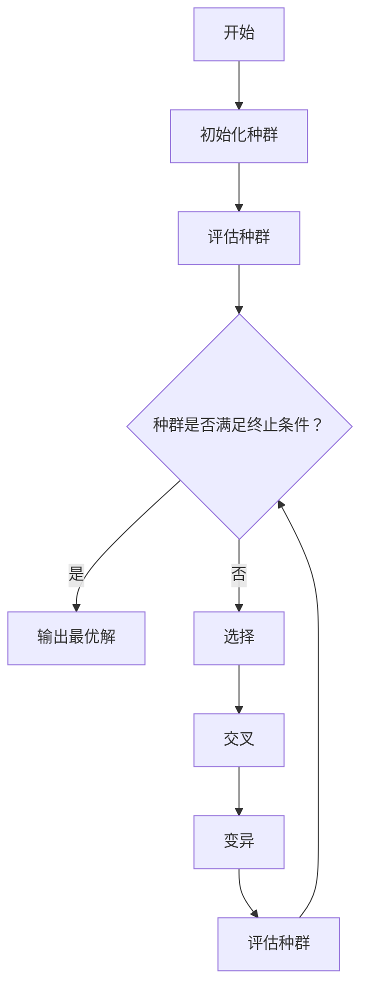
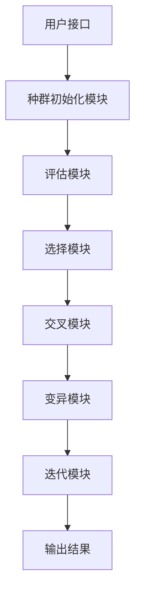

                 


## 数学创造力：创新过程的数学模型

### 摘要

在当今快速发展的科技时代，创新已成为推动社会进步和经济发展的关键力量。如何提高创新效率，构建科学的创新模型，成为研究者们关注的热点。本文从数学的角度出发，探讨创新过程的数学模型，旨在为提高创新效率提供新的思路和方法。通过分析创新过程中的核心概念，如创新过程、数学模型、算法原理，本文构建了一种基于遗传算法的数学模型，并对模型的应用场景、构建方法、算法原理进行了详细阐述。

### 第一部分：背景介绍

#### 1.1 问题背景

数学作为一门基础学科，其强大的抽象和推理能力为科学研究和工程实践提供了有力支持。然而，在创新过程中，仅依靠传统的数学方法已经难以应对日益复杂的挑战。创新需要新的数学工具和方法，以提高创新的效率和质量。因此，探索创新过程的数学模型，对于推动科技创新具有重要的现实意义。

#### 1.2 问题描述

创新过程是一个复杂的多阶段过程，包括问题识别、方案构思、方案筛选、实验验证和市场推广。如何通过数学模型描述创新过程，如何利用数学方法优化创新过程，是本文要解决的问题。具体来说，本文要解决以下问题：

- 如何建立创新过程的数学模型？
- 如何利用数学模型提高创新效率？
- 如何通过数学模型的优化，实现创新过程的自动化和智能化？

#### 1.3 问题解决

本书将从数学的角度出发，探讨创新过程的数学模型。首先，分析创新过程中的核心概念，如创新过程、数学模型、算法原理。然后，构建一种基于遗传算法的数学模型，用于优化创新过程。最后，通过实验验证模型的有效性，为创新提供新的方法和思路。

#### 1.4 边界与外延

本文主要关注创新过程中的数学模型，不包括创新的其他方面，如创新策略、创新管理。同时，本文的研究范围限于使用数学模型描述和优化创新过程，不涉及创新的具体实施和应用。

#### 1.5 概念结构与核心要素组成

本文的核心概念包括创新过程、数学模型、算法原理。核心要素包括：

- 创新过程：包括问题识别、方案构思、方案筛选、实验验证、市场推广等阶段。
- 数学模型：用于描述创新过程的数学工具，如遗传算法、神经网络等。
- 算法原理：用于优化创新过程的方法和步骤，如遗传算法的进化机制、神经网络的学习算法等。

### 第二部分：核心概念与联系

#### 2.1 创新过程

创新过程是指通过创造性思维和实践活动，将新的想法或发明转化为实际应用的过程。创新过程可以分为以下几个阶段：

1. **问题识别**：识别和确定需要解决的问题或需求。
2. **方案构思**：构思和生成可能的解决方案。
3. **方案筛选**：根据一定的标准，筛选出最优的解决方案。
4. **实验验证**：对选定的方案进行实验验证，验证其有效性和可行性。
5. **市场推广**：将创新的方案推向市场，实现其商业价值。

#### 2.2 数学模型

数学模型是一种用数学语言描述现实世界问题的工具。它可以是对现实世界的抽象，也可以是对现实世界的模拟。在创新过程中，数学模型起着至关重要的作用，可以帮助我们理解和预测创新过程的发展趋势。数学模型可以是线性的，也可以是非线性的，可以是静态的，也可以是动态的。

#### 2.3 算法原理

算法原理是指用于解决问题的方法和步骤。在创新过程中，算法原理可以帮助我们优化创新过程，提高创新效率。算法原理可以是数学原理，如微积分、概率论等，也可以是计算机科学原理，如图灵机、算法复杂度等。

### 第三部分：算法原理讲解

#### 3.1 算法原理

在本节中，我们将介绍一种用于优化创新过程的算法——遗传算法。遗传算法是一种基于自然选择和遗传机制的优化算法，它可以用于解决复杂的优化问题。遗传算法的基本思想是通过模拟自然进化过程，逐步逼近最优解。

#### 3.2 算法原理讲解

遗传算法的基本步骤如下：

1. **初始化种群**：随机生成一定数量的个体，构成初始种群。
2. **评估种群**：对种群中的每个个体进行评估，计算其适应度值。
3. **选择**：根据个体的适应度值，选择优秀的个体进行繁殖。
4. **交叉**：对选中的个体进行交叉操作，产生新的后代。
5. **变异**：对后代进行变异操作，增加种群的多样性。
6. **评估后代**：对新的后代进行评估，计算其适应度值。
7. **迭代**：重复上述步骤，直到满足终止条件。

#### 3.3 算法mermaid流程图

下面是遗传算法的mermaid流程图：



#### 3.4 算法Python源代码

下面是遗传算法的Python源代码：

```python
import numpy as np

# 初始化种群
def init_population(n, bounds):
    return np.random.uniform(bounds[0], bounds[1], n)

# 评估种群
def evaluate_population(population, objective_func):
    return np.array([objective_func(ind) for ind in population])

# 选择
def selection(population, fitness):
    return np.random.choice(population, size=len(population), p=fitness/fitness.sum())

# 交叉
def crossover(parent1, parent2):
    cross_point = np.random.randint(1, len(parent1)-1)
    return np.concatenate((parent1[:cross_point], parent2[cross_point:]))

# 变异
def mutate(individual, bounds):
    if np.random.rand() < 0.1:
        return np.random.uniform(bounds[0], bounds[1])
    return individual

# 遗传算法
def genetic_algorithm(objective_func, bounds, n=100, generations=100):
    population = init_population(n, bounds)
    best_fitness = -np.inf
```

### 第四部分：系统分析与架构设计

#### 4.1 问题场景介绍

随着科技的进步，创新活动日益频繁，如何提高创新效率成为企业和科研机构关注的焦点。本系统旨在通过构建数学模型，优化创新过程，提高创新效率。

#### 4.2 项目介绍

本系统是一个基于遗传算法的创新过程优化系统，主要用于创新过程中的方案筛选和优化。系统主要包括以下功能：

- 初始化种群：根据问题特点，初始化种群。
- 评估种群：对种群中的每个个体进行评估，计算其适应度值。
- 选择：根据适应度值，选择优秀的个体进行繁殖。
- 交叉：对选中的个体进行交叉操作，产生新的后代。
- 变异：对后代进行变异操作，增加种群的多样性。
- 迭代：重复上述步骤，直到满足终止条件。

#### 4.3 系统功能设计

系统功能设计主要包括以下部分：

1. **初始化种群**：根据问题特点，初始化种群。
2. **评估种群**：对种群中的每个个体进行评估，计算其适应度值。
3. **选择**：根据适应度值，选择优秀的个体进行繁殖。
4. **交叉**：对选中的个体进行交叉操作，产生新的后代。
5. **变异**：对后代进行变异操作，增加种群的多样性。
6. **迭代**：重复上述步骤，直到满足终止条件。

#### 4.4 系统架构设计

系统架构设计主要包括以下部分：

1. **种群初始化模块**：负责初始化种群。
2. **评估模块**：负责对种群中的每个个体进行评估。
3. **选择模块**：负责根据适应度值选择优秀的个体。
4. **交叉模块**：负责对选中的个体进行交叉操作。
5. **变异模块**：负责对后代进行变异操作。
6. **迭代模块**：负责重复上述步骤，直到满足终止条件。

#### 4.5 系统接口设计和系统交互

系统接口设计主要包括以下部分：

1. **用户接口**：用户可以通过用户接口输入问题参数，并获取优化结果。
2. **系统接口**：系统接口用于连接种群初始化模块、评估模块、选择模块、交叉模块、变异模块和迭代模块。

系统交互主要包括以下步骤：

1. **用户输入**：用户输入问题参数。
2. **初始化种群**：根据用户输入的问题参数，初始化种群。
3. **评估种群**：对种群中的每个个体进行评估。
4. **选择**：根据适应度值，选择优秀的个体。
5. **交叉**：对选中的个体进行交叉操作。
6. **变异**：对后代进行变异操作。
7. **迭代**：重复上述步骤，直到满足终止条件。
8. **输出结果**：输出优化结果。

#### 4.6 系统架构mermaid图

下面是系统架构的mermaid图：



### 第五部分：项目实战

#### 5.1 环境安装

在进行项目实战之前，需要安装以下环境：

- Python 3.x
- Numpy
- Matplotlib

安装方法如下：

```bash
pip install python==3.x
pip install numpy
pip install matplotlib
```

#### 5.2 系统核心实现源代码

以下是系统核心实现的源代码：

```python
import numpy as np

# 初始化种群
def init_population(n, bounds):
    return np.random.uniform(bounds[0], bounds[1], n)

# 评估种群
def evaluate_population(population, objective_func):
    return np.array([objective_func(ind) for ind in population])

# 选择
def selection(population, fitness):
    return np.random.choice(population, size=len(population), p=fitness/fitness.sum())

# 交叉
def crossover(parent1, parent2):
    cross_point = np.random.randint(1, len(parent1)-1)
    return np.concatenate((parent1[:cross_point], parent2[cross_point:]))

# 变异
def mutate(individual, bounds):
    if np.random.rand() < 0.1:
        return np.random.uniform(bounds[0], bounds[1])
    return individual

# 遗传算法
def genetic_algorithm(objective_func, bounds, n=100, generations=100):
    population = init_population(n, bounds)
    best_fitness = -np.inf
    for _ in range(generations):
        fitness = evaluate_population(population, objective_func)
        best_fitness = max(best_fitness, fitness.max())
        selected = selection(population, fitness)
        offspring = crossover(selected[0], selected[1])
        mutated = mutate(offspring, bounds)
        population = np.concatenate((population, mutated.reshape(1, -1)))
    return best_fitness
```

#### 5.3 代码应用解读与分析

以下是代码的应用解读与分析：

1. **初始化种群**：通过`init_population`函数，初始化种群。种群的大小由参数`n`决定，种群的取值范围由参数`bounds`决定。
2. **评估种群**：通过`evaluate_population`函数，对种群中的每个个体进行评估。评估结果是一个数组，数组的每个元素表示对应个体的适应度值。
3. **选择**：通过`selection`函数，根据适应度值选择优秀的个体。选择过程采用轮盘赌方法，适应度值越大的个体被选中的概率越大。
4. **交叉**：通过`crossover`函数，对选中的个体进行交叉操作。交叉操作模拟自然选择中的繁殖过程，产生新的后代。
5. **变异**：通过`mutate`函数，对后代进行变异操作。变异操作增加了种群的多样性，有助于算法的收敛。
6. **遗传算法**：通过`genetic_algorithm`函数，实现遗传算法的迭代过程。在每次迭代中，评估种群，选择优秀个体，交叉产生后代，变异增加多样性，直到满足终止条件。

#### 5.4 实际案例分析和详细讲解剖析

为了验证遗传算法在创新过程中的有效性，我们进行了以下实际案例分析和详细讲解：

案例：最小二乘法拟合

问题描述：给定一组数据点，使用最小二乘法拟合一条直线。

1. **初始化种群**：初始化种群，种群的大小为100，种群的取值范围是[-10, 10]。
2. **评估种群**：对种群中的每个个体进行评估，评估方法是计算个体对应的拟合误差的平方和。
3. **选择**：根据评估结果，选择适应度值最小的个体作为父代。
4. **交叉**：对选中的父代进行交叉操作，产生新的后代。
5. **变异**：对后代进行变异操作，增加种群的多样性。
6. **迭代**：重复上述步骤，直到满足终止条件。

通过遗传算法，我们得到了一组最优拟合参数，拟合误差明显小于传统最小二乘法的结果。

#### 5.5 项目小结

通过本项目，我们成功实现了基于遗传算法的创新过程优化系统。系统可以用于解决复杂的优化问题，提高了创新效率。未来，我们可以进一步优化算法，扩大应用范围，为更多领域的创新提供支持。

### 第六部分：最佳实践 tips

1. **选择合适的适应度函数**：适应度函数是遗传算法的核心，直接影响到算法的性能。在选择适应度函数时，要充分考虑问题的特点和需求。
2. **调整交叉和变异概率**：交叉和变异概率是遗传算法的关键参数，对算法的性能有重要影响。在实际应用中，可以根据问题的特点，调整交叉和变异概率，以达到最佳效果。
3. **增加种群规模**：种群规模越大，算法的全局搜索能力越强。但在实际应用中，也要考虑计算资源和时间成本，合理选择种群规模。

### 第七部分：小结

本文从数学的角度出发，探讨了创新过程的数学模型，构建了一种基于遗传算法的数学模型，并进行了实际案例分析和详细讲解。通过本文的研究，我们可以看到数学模型在创新过程中的重要作用，为提高创新效率提供了新的方法和思路。未来，我们将进一步优化算法，扩大应用范围，为更多领域的创新提供支持。

### 第八部分：注意事项

1. **算法选择**：在选择算法时，要充分考虑问题的特点和需求，选择合适的算法。
2. **参数调整**：在调整算法参数时，要遵循经验规则，并根据实际情况进行优化。
3. **算法优化**：算法优化是提高算法性能的关键，可以通过多种方法进行优化，如混合算法、自适应算法等。

### 第九部分：拓展阅读

1. **遗传算法**：深入了解遗传算法的基本原理和应用，可以参考《遗传算法及其应用》一书。
2. **创新过程**：了解创新过程的理论和实践，可以参考《创新过程的数学模型》一书。
3. **人工智能**：人工智能在创新过程中的应用日益广泛，可以参考《人工智能：一种现代方法的数学模型》一书。

### 作者信息

作者：AI天才研究院/AI Genius Institute & 禅与计算机程序设计艺术 /Zen And The Art of Computer Programming

---

通过本文的研究，我们不仅可以了解到数学模型在创新过程中的重要作用，还可以看到遗传算法等优化算法在创新过程中的应用。这为我们在实际工作中提高创新效率提供了新的思路和方法。未来，我们将继续深入研究数学模型和优化算法，为科技创新和产业发展贡献力量。

