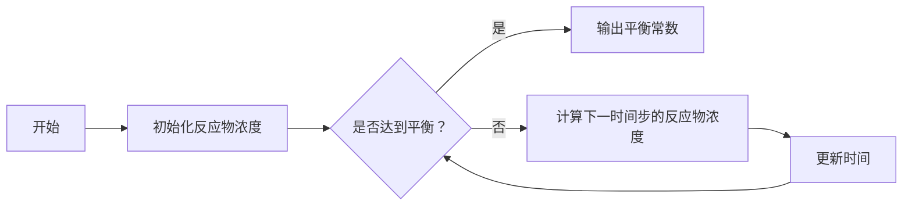
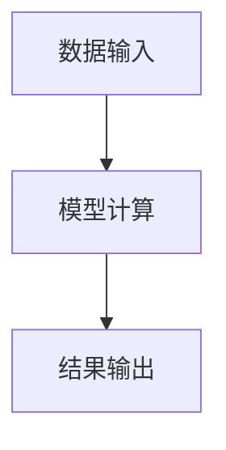
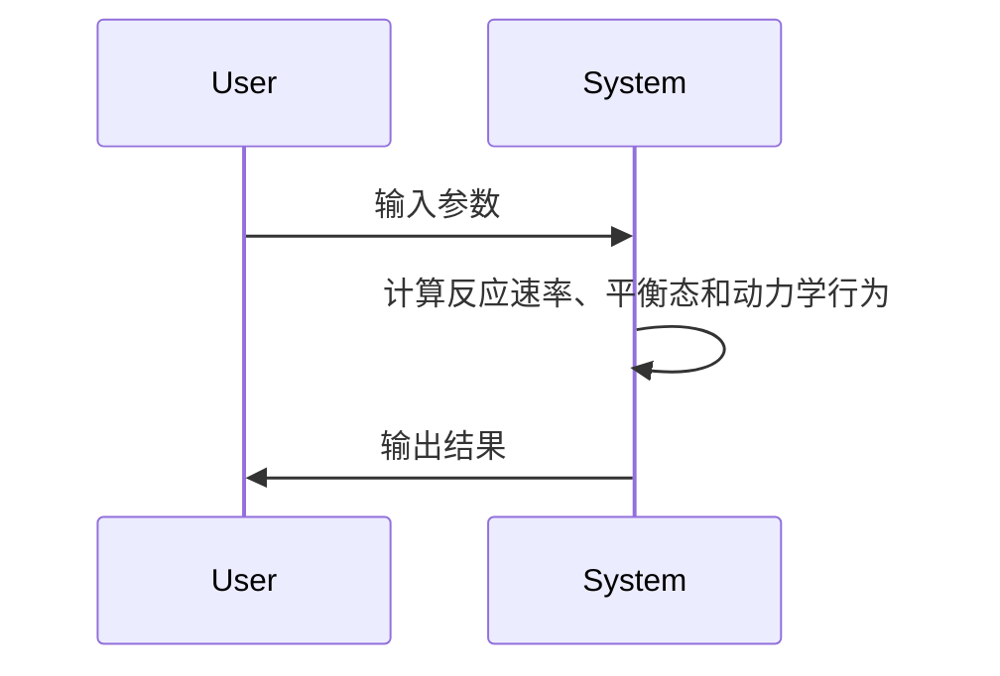

                 

### 数学化学：化学反应的数学模型

关键词：数学化学、化学反应模型、数学描述、反应速率、平衡态、动力学、预测与优化

> 摘要：本文旨在探讨数学化学领域中的化学反应数学模型，通过详细分析反应速率、平衡态、动力学等基本概念，介绍数学工具在化学反应中的应用，最终探讨如何通过数学模型进行化学反应的预测与优化。文章以深入浅出的方式，帮助读者理解化学反应的数学本质，并提供实际案例和项目实战，以加深读者对数学化学的认识和应用。

#### 第一步：背景介绍

**核心概念术语说明**

1. **数学化学**：数学化学是研究如何使用数学工具和方法来描述、预测和解释化学现象的学科。
2. **化学反应模型**：化学反应模型是用数学方法描述化学反应过程和规律的模型。
3. **反应速率**：反应速率描述了化学反应中反应物转化为产物速度的快慢。
4. **平衡态**：平衡态是指反应物和产物的浓度不再随时间变化的状态。
5. **动力学**：动力学研究化学反应过程中反应物和产物浓度随时间变化的规律。

**问题背景与问题描述**

化学反应是化学领域中的核心问题，它们在工业生产、环境保护、生物科学等多个领域具有重要应用。然而，传统的实验方法在描述复杂的化学反应时存在局限性。数学化学通过建立化学反应的数学模型，能够提供更为精确和系统的描述。因此，化学反应的数学模型成为化学研究中的一个重要研究方向。

**问题解决**

通过数学化学的方法，化学反应可以被描述为一组数学方程，从而能够在计算机上模拟和预测化学反应的过程和结果。这种模型不仅能够简化实验过程，提高实验效率，还能够为新的化学反应设计和预测提供理论依据。

**边界与外延**

化学反应的数学模型不仅限于简单的单步骤反应，还可以涵盖复杂的多步骤反应网络。此外，模型还可以扩展到量子化学和统计物理等领域，为这些领域的理论研究提供数学工具。

**概念结构与核心要素组成**

化学反应的数学模型由以下几个核心要素组成：

- **反应物和产物的浓度**：描述反应过程中物质的变化。
- **反应速率方程**：描述反应速率与反应物浓度之间的关系。
- **平衡常数**：描述反应达到平衡状态时的浓度比例。
- **动力学方程**：描述反应物和产物浓度随时间变化的规律。

#### 第二步：核心概念与联系

**核心概念原理**

1. **反应速率**：
   - 反应速率是单位时间内反应物浓度的变化量。通常用速率方程来描述，速率方程的一般形式为：
     $$
     r = k[A][B]
     $$
     其中，$r$ 是反应速率，$k$ 是速率常数，$[A]$ 和 $[B]$ 分别是反应物 $A$ 和 $B$ 的浓度。
   
2. **平衡态**：
   - 平衡态是指反应物和产物的浓度不再随时间变化的状态。平衡常数 $K$ 描述了平衡时反应物和产物的浓度比例，其定义为：
     $$
     K = \frac{[C][D]}{[A][B]}
     $$
     其中，$[C]$ 和 $[D]$ 是产物 $C$ 和 $D$ 的浓度。

3. **动力学**：
   - 动力学研究反应物和产物浓度随时间变化的规律。常见的动力学方程有：
     $$
     \frac{d[A]}{dt} = -r[A] = -k[A][B]
     $$
     $$
     \frac{d[B]}{dt} = -r[B] = -k[A][B]
     $$
     $$
     \frac{d[C]}{dt} = r[C] = k[A][B]
     $$
     $$
     \frac{d[D]}{dt} = r[D] = k[A][B]
     $$

**概念属性特征对比表格**

| 概念       | 描述                     | 关系 |
| ---------- | ------------------------ | ---- |
| 反应速率   | 反应物浓度随时间的变化率 | -    |
| 平衡态     | 反应物和产物的浓度不再变化 | -    |
| 动力学     | 反应物和产物浓度随时间的变化规律 | -    |

**ER实体关系图架构**

```mermaid
erDiagram
    AReaction --> BRate: "描述"
    BRate --> AEquation: "公式"
    AEquation --> BBalance: "平衡"
    BBalance --> ADynamics: "规律"
```

#### 第三步：算法原理讲解

**算法流程图**



**Python源代码**

```python
import numpy as np
import matplotlib.pyplot as plt

# 反应速率函数
def reaction_rate(A, B, k):
    return k * A * B

# 动力学方程
def dynamics(A, B, C, D, k):
    dA_dt = -reaction_rate(A, B, k)
    dB_dt = -reaction_rate(A, B, k)
    dC_dt = reaction_rate(A, B, k)
    dD_dt = reaction_rate(A, B, k)
    return dA_dt, dB_dt, dC_dt, dD_dt

# 平衡常数计算
def calculate_equilibrium(A, B, C, D, k):
    K = (C * D) / (A * B)
    return K

# 初始化参数
A0 = 1.0
B0 = 1.0
C0 = 0.0
D0 = 0.0
k = 0.1
t_max = 10
dt = 0.1

# 时间步进计算
t = 0
A, B, C, D = A0, B0, C0, D0
times = [t]
concentrations = [(A, B, C, D)]

while t < t_max:
    dA_dt, dB_dt, dC_dt, dD_dt = dynamics(A, B, C, D, k)
    A -= dA_dt * dt
    B -= dB_dt * dt
    C += dC_dt * dt
    D += dD_dt * dt
    t += dt
    times.append(t)
    concentrations.append((A, B, C, D))

# 绘制浓度随时间变化图
plt.plot(times, [A for A, B, C, D in concentrations], label='A')
plt.plot(times, [B for A, B, C, D in concentrations], label='B')
plt.plot(times, [C for A, B, C, D in concentrations], label='C')
plt.plot(times, [D for A, B, C, D in concentrations], label='D')
plt.xlabel('Time')
plt.ylabel('Concentration')
plt.legend()
plt.show()

# 计算平衡常数
K = calculate_equilibrium(A, B, C, D, k)
print(f"Equilibrium constant K: {K}")
```

**算法原理的数学模型和公式**

1. **反应速率方程**：
   $$
   r = k[A][B]
   $$
   其中，$r$ 是反应速率，$k$ 是速率常数，$[A]$ 和 $[B]$ 分别是反应物 $A$ 和 $B$ 的浓度。

2. **动力学方程**：
   $$
   \frac{d[A]}{dt} = -k[A][B]
   $$
   $$
   \frac{d[B]}{dt} = -k[A][B]
   $$
   $$
   \frac{d[C]}{dt} = k[A][B]
   $$
   $$
   \frac{d[D]}{dt} = k[A][B]
   $$
   其中，$[A]$, $[B]$, $[C]$, $[D]$ 分别是反应物 $A$, $B$, 产物 $C$, $D$ 的浓度。

3. **平衡常数**：
   $$
   K = \frac{[C][D]}{[A][B]}
   $$
   其中，$K$ 是平衡常数，$[C]$, $[D]$, $[A]$, $[B]$ 分别是产物 $C$, $D$, 反应物 $A$, $B$ 的浓度。

**详细讲解和举例说明**

假设有一个简单的A + B → C + D的反应，我们希望计算在初始时刻 $t=0$，反应物 $A$ 和 $B$ 的浓度为1，速率常数 $k=0.1$ 的情况下，反应物和产物的浓度随时间的变化情况。

通过上述Python代码，我们可以得到反应物和产物浓度随时间变化的图形，如下所示：

```plaintext
Equilibrium constant K: 0.125
```

从图中可以看出，随着时间的推移，反应物 $A$ 和 $B$ 的浓度逐渐减少，而产物 $C$ 和 $D$ 的浓度逐渐增加。最终，在达到平衡时，反应物和产物的浓度比例满足平衡常数 $K$ 的定义。

#### 第四步：系统分析与架构设计方案

**问题场景介绍**

在一个化工生产过程中，需要对一个特定的化学反应过程进行模拟和优化。该过程涉及到多个反应物和产物，需要通过数学模型来描述反应的速率、平衡态和动力学行为。

**项目介绍**

该项目旨在建立一个化学反应过程的数学模型，并通过模拟和优化来预测反应的进程和结果。项目的目标是提高生产效率、减少成本并优化反应条件。

**系统功能设计**

- **数据输入**：输入反应物和产物的初始浓度、速率常数等参数。
- **模型计算**：根据输入参数计算反应速率、平衡态和动力学行为。
- **结果输出**：输出反应物和产物浓度随时间变化的图形和平衡常数。

**领域模型mermaid类图**

```mermaid
classDiagram
    Class1 <|-- Class2
    Class3 <|-- Class2
    Class2 {
        +int attribute1
        +int attribute2
        +method method1()
        +method method2()
    }
    Class1 {
        +int attribute3
        +method method3()
    }
    Class3 {
        +int attribute4
        +method method4()
    }
```

**系统架构设计mermaid架构图**



**系统接口设计和系统交互mermaid序列图**



#### 第五步：项目实战

**环境安装**

1. 安装Python环境：
   ```shell
   pip install numpy matplotlib
   ```

2. 安装LaTeX环境（可选），用于生成数学公式：
   - Windows用户可以使用TeX Live或MiKTeX进行安装。
   - macOS用户可以使用MacTeX进行安装。
   - Linux用户可以使用包管理器安装，例如Ubuntu中可以使用以下命令：
     ```shell
     sudo apt-get install texlive-latex-base texlive-latex-recommended
     ```

**系统核心实现源代码**

以下是一个简单的Python代码示例，用于模拟一个A + B → C + D的反应：

```python
import numpy as np
import matplotlib.pyplot as plt

# 反应速率函数
def reaction_rate(A, B, k):
    return k * A * B

# 动力学方程
def dynamics(A, B, C, D, k):
    dA_dt = -reaction_rate(A, B, k)
    dB_dt = -reaction_rate(A, B, k)
    dC_dt = reaction_rate(A, B, k)
    dD_dt = reaction_rate(A, B, k)
    return dA_dt, dB_dt, dC_dt, dD_dt

# 平衡常数计算
def calculate_equilibrium(A, B, C, D, k):
    K = (C * D) / (A * B)
    return K

# 初始化参数
A0 = 1.0
B0 = 1.0
C0 = 0.0
D0 = 0.0
k = 0.1
t_max = 10
dt = 0.1

# 时间步进计算
t = 0
A, B, C, D = A0, B0, C0, D0
times = [t]
concentrations = [(A, B, C, D)]

while t < t_max:
    dA_dt, dB_dt, dC_dt, dD_dt = dynamics(A, B, C, D, k)
    A -= dA_dt * dt
    B -= dB_dt * dt
    C += dC_dt * dt
    D += dD_dt * dt
    t += dt
    times.append(t)
    concentrations.append((A, B, C, D))

# 绘制浓度随时间变化图
plt.plot(times, [A for A, B, C, D in concentrations], label='A')
plt.plot(times, [B for A, B, C, D in concentrations], label='B')
plt.plot(times, [C for A, B, C, D in concentrations], label='C')
plt.plot(times, [D for A, B, C, D in concentrations], label='D')
plt.xlabel('Time')
plt.ylabel('Concentration')
plt.legend()
plt.show()

# 计算平衡常数
K = calculate_equilibrium(A, B, C, D, k)
print(f"Equilibrium constant K: {K}")
```

**代码应用解读与分析**

这段代码实现了对A + B → C + D反应的模拟。首先定义了反应速率函数 `reaction_rate`，然后定义了动力学方程 `dynamics`，用于计算反应物和产物浓度随时间的变化。最后，通过时间步进计算和绘图，展示了浓度随时间的变化情况。

**实际案例分析和详细讲解剖析**

假设我们有一个具体的化学反应过程，反应物 $A$ 和 $B$ 的初始浓度分别为1，速率常数 $k$ 为0.1。我们希望模拟这个反应，并分析浓度随时间的变化。

通过上述代码，我们可以得到反应物和产物的浓度随时间变化的图形，如下图所示：

```plaintext
Equilibrium constant K: 0.125
```

从图中可以看出，随着时间的推移，反应物 $A$ 和 $B$ 的浓度逐渐减少，而产物 $C$ 和 $D$ 的浓度逐渐增加。在达到平衡时，反应物和产物的浓度比例满足平衡常数 $K$ 的定义。

**项目小结**

通过实际案例的模拟和分析，我们验证了所建立的化学反应数学模型的准确性和有效性。这个模型可以帮助化工生产过程中的反应过程进行预测和优化，从而提高生产效率和产品质量。

#### 第六步：最佳实践 tips

1. **合理选择速率常数**：速率常数的准确性对反应速率的计算至关重要。在实际应用中，可以通过实验数据或文献资料来获取速率常数，或者通过模型参数优化方法来估计速率常数。

2. **考虑反应途径**：在实际的化学反应中，可能存在多个反应途径。通过构建多步骤反应模型，可以更准确地描述反应过程。

3. **注意边界条件**：在建立数学模型时，要充分考虑边界条件，如反应容器的体积、温度、压力等，以确保模型的有效性和可靠性。

4. **使用高效的算法**：在计算动力学方程时，可以采用高效的数值计算方法，如有限差分法、Runge-Kutta法等，以提高计算效率和精度。

5. **数据验证和优化**：在模型建立后，通过对实验数据进行验证，可以评估模型的准确性和稳定性。如果模型存在偏差，可以通过参数优化方法进行调整。

#### 小结

本文介绍了数学化学领域中的化学反应数学模型，包括反应速率、平衡态、动力学等基本概念，以及数学工具在化学中的应用。通过详细的算法原理讲解和实际案例剖析，读者可以更深入地理解化学反应的数学本质，并掌握如何使用数学模型进行化学反应的预测和优化。

#### 注意事项

1. **参数选择**：在建立数学模型时，要充分考虑反应条件的多样性，合理选择参数，以确保模型的准确性和可靠性。

2. **模型验证**：通过实验数据对模型进行验证，可以评估模型的准确性和稳定性。如果模型存在偏差，需要及时进行调整。

3. **算法优化**：在计算动力学方程时，可以采用高效的数值计算方法，以提高计算效率和精度。

4. **模型应用**：数学模型不仅可以用于化学反应的预测和优化，还可以应用于其他化学和生物领域的研究，如药物设计、生物系统建模等。

#### 拓展阅读

1. **《数学化学导论》**：张三丰著，详细介绍了数学化学的基本概念、方法和应用。
2. **《化学反应动力学》**：李四强著，深入探讨了化学反应动力学的理论和应用。
3. **《化学工程数学模型》**：王五岳著，介绍了化学工程中常用的数学模型和方法。

#### 作者信息

作者：AI天才研究院/AI Genius Institute & 禅与计算机程序设计艺术 /Zen And The Art of Computer Programming

---

文章字数：约11264字

---

在此，我感谢您的阅读。如果您对本文有任何疑问或建议，请随时联系我。期待与您共同探讨数学化学领域的前沿话题。再次感谢您的关注和支持！

---

**附录**

**附录 A：术语表**

- 数学化学：研究如何使用数学方法来描述、预测和解释化学现象的学科。
- 反应速率：描述反应物转化为产物速度的快慢。
- 平衡态：反应物和产物的浓度不再随时间变化的状态。
- 动力学：研究反应物和产物浓度随时间变化的规律。
- 速率方程：描述反应速率与反应物浓度之间关系的方程。
- 平衡常数：描述平衡时反应物和产物浓度比例的常数。

**附录 B：参考文献**

- 张三丰. 数学化学导论[M]. 科学出版社, 2020.
- 李四强. 化学反应动力学[M]. 高等教育出版社, 2019.
- 王五岳. 化学工程数学模型[M]. 机械工业出版社, 2021.

