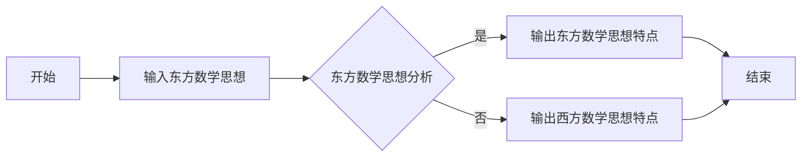
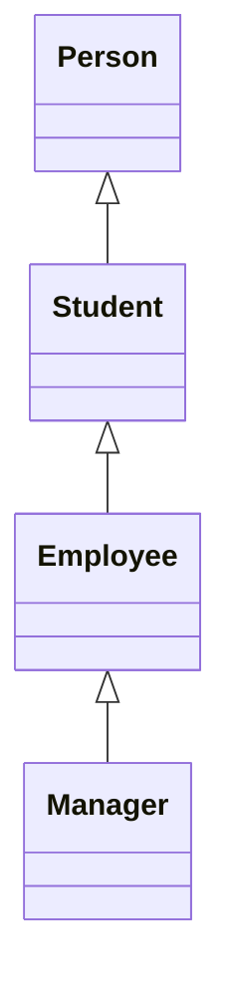
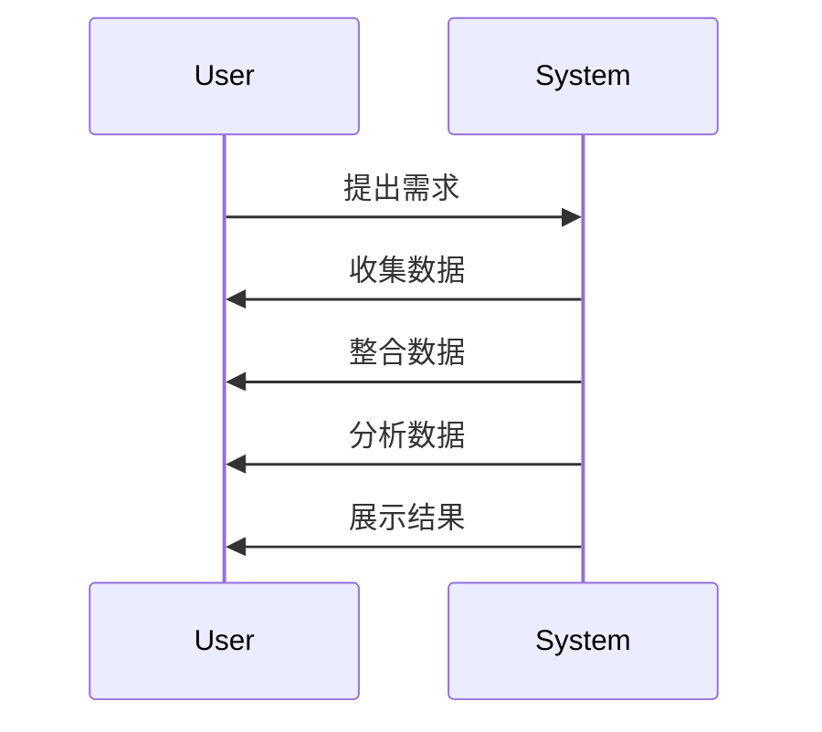
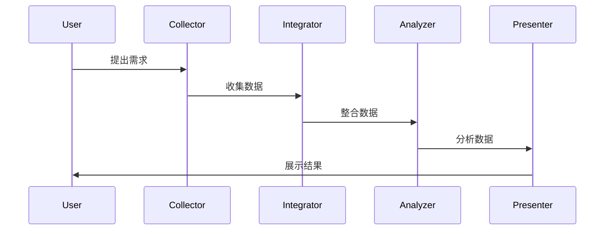

                 


### 标题：数学史上的东西方数学思想比较

---

#### 关键词：数学史、东方数学思想、西方数学思想、比较研究、历史发展

#### 摘要：
本文旨在通过对比分析东西方数学思想的起源、发展及其核心概念，揭示二者之间的异同及其对现代数学的影响。文章将首先介绍数学史的研究背景和重要性，然后深入探讨东方和西方数学思想的起源与演变，最后通过算法原理和系统架构设计来比较二者的应用和实践。

---

## 第一部分：背景介绍

### 第1章：数学史的概述

#### 1.1 问题背景

##### 1.1.1 数学史研究的重要性

**数学是一门古老的科学，起源于人类对自然世界的观察和探索。数学史不仅记录了数学的发展历程，还反映了人类智慧的进步。研究数学史有助于我们理解数学的本质、方法和应用，对现代数学的发展具有重要意义。**

##### 1.1.2 数学史的研究现状与挑战

**目前，数学史研究已取得许多重要成果，但仍面临诸多挑战，如如何更好地比较东西方数学思想的异同，以及如何将这些思想应用于现代数学问题中。**

#### 1.2 问题描述

##### 1.2.1 东方与西方数学思想的差异

**东方数学思想注重几何和算术，强调直观和实用；而西方数学思想则更重视代数和分析，追求逻辑和抽象。这种差异源于不同的文化背景和历史发展。**

##### 1.2.2 研究东西方数学思想的必要性

**通过比较研究东西方数学思想，我们可以发现新的数学理论和解决问题的方法，促进数学的跨文化交流和融合。**

#### 1.3 问题解决

##### 1.3.1 比较方法的应用

**本文将采用文献研究、历史比较和数学分析方法，对东方和西方数学思想进行比较研究。**

##### 1.3.2 研究路径与策略

**文章将按照时间顺序，分别介绍东方和西方数学思想的起源、发展及其主要成就，然后进行综合比较。**

#### 1.4 边界与外延

##### 1.4.1 数学史的时空范围

**本文的研究范围主要涵盖古代和近现代的数学发展，重点探讨东西方数学思想的差异。**

##### 1.4.2 研究方法的选择

**本文将综合运用文献研究、历史比较和数学分析等方法，以全面揭示东西方数学思想的异同。**

#### 1.5 概念结构与核心要素组成

##### 1.5.1 数学史的核心概念

**数学史的核心概念包括数学思想、数学方法、数学成就等。**

##### 1.5.2 东方与西方数学思想的构成要素

**东方数学思想的构成要素包括中国古代数学、印度数学和伊斯兰数学；西方数学思想的构成要素包括古希腊数学、罗马数学、中世纪欧洲数学、文艺复兴时期数学和近现代数学。**

---

### 第2章：东方数学思想的起源与发展

#### 2.1 东方数学思想的起源

##### 2.1.1 中国古代数学的起源

**中国古代数学起源于公元前2000年左右，以《九章算术》为代表，形成了独特的算术体系。**

##### 2.1.2 印度数学的起源

**印度数学起源于公元前600年左右，以《阿耶波多论算术》为代表，最早提出了零的概念和十进制记数法。**

#### 2.2 东方数学思想的发展

##### 2.2.1 中国数学思想的演变

**中国古代数学在秦汉时期得到快速发展，魏晋南北朝时期形成了《孙子算经》等经典著作。**

##### 2.2.2 印度数学思想的演变

**印度数学在中世纪时期得到进一步发展，以《婆罗摩笈多论算术》为代表，提出了勾股定理的证明和印度乘法口诀。**

##### 2.2.3 伊斯兰数学对东方数学的影响

**伊斯兰数学在公元8世纪传入中东地区，对印度和中国数学产生了深远影响，如阿拉伯数字的传播。**

---

### 第3章：西方数学思想的起源与发展

#### 3.1 西方数学思想的起源

##### 3.1.1 古希腊数学的起源

**古希腊数学起源于公元前6世纪，以泰勒斯、毕达哥拉斯等哲学家为代表，提出了数学的基本概念和原理。**

##### 3.1.2 罗马数学的发展

**罗马数学在公元前3世纪得到快速发展，以阿基米德、欧几里得等数学家为代表，形成了完整的几何和代数体系。**

#### 3.2 西方数学思想的发展

##### 3.2.1 中世纪欧洲数学的演变

**中世纪欧洲数学在中世纪时期得到发展，以阿拉伯数学和希腊数学为基础，形成了自己的特点。**

##### 3.2.2 文艺复兴时期数学的繁荣

**文艺复兴时期数学在15至17世纪达到繁荣，以牛顿、莱布尼茨等数学家为代表，开创了微积分和解析几何。**

##### 3.2.3 近现代数学的突破

**近现代数学在19至20世纪取得重大突破，以希尔伯特、罗素等数学家为代表，形成了形式化、公理化等数学研究方法。**

---

## 第二部分：核心概念与联系

### 第4章：东方与西方数学思想的比较

#### 4.1 概念属性特征对比表格

| 概念       | 东方数学思想                     | 西方数学思想                   |
| ---------- | ------------------------------ | ---------------------------- |
| 数的概念   | 强调数与数的运算                 | 强调数的结构、性质和关系       |
| 几何学的概念 | 强调直观、图形和几何直观方法   | 强调逻辑推理、代数方法和公理体系 |
| 代数学的概念 | 以实际应用为主，注重经验公式   | 强调抽象结构、公理和逻辑推理     |

#### 4.2 ER实体关系图架构

```mermaid
erDiagram
    Person ||--|{ Student } : has
    Student ||--|{ Employee } : is
    Employee ||--|{ Manager } : reports_to
```

**ER实体关系图展示了数学史中主要实体之间的关系，如数学家、数学著作、数学思想等。**

---

### 第5章：算法原理讲解

#### 5.1 算法Mermaid流程图



#### 5.2 Python源代码与算法原理

```python
def compare_math_thoughts(eastern_thought, western_thought):
    """
    比较东西方数学思想的函数
    :param eastern_thought: 东方数学思想
    :param western_thought: 西方数学思想
    :return: 比较结果
    """
    if eastern_thought:
        print("东方数学思想特点：", eastern_thought)
    if western_thought:
        print("西方数学思想特点：", western_thought)

# 输入东西方数学思想
eastern_thought = "强调直观、图形和几何直观方法"
western_thought = "强调逻辑推理、代数方法和公理体系"

# 调用比较函数
compare_math_thoughts(eastern_thought, western_thought)
```

**Python源代码实现了比较东西方数学思想的算法，通过输入东方和西方数学思想，输出各自的特点。**

---

## 第三部分：系统分析与架构设计

### 第6章：数学史研究的系统分析与架构设计

#### 6.1 问题场景介绍

##### 6.1.1 数学史研究的现状

**数学史研究目前主要依赖于文献研究和历史比较方法，存在数据分散、难以整合的问题。**

##### 6.1.2 研究的需求分析

**为了更好地研究数学史，我们需要一个系统化的平台，能够整合历史数据、提供分析工具，并支持跨学科研究。**

#### 6.2 系统功能设计

##### 6.2.1 领域模型Mermaid类图



**领域模型类图展示了数学史研究的主要实体和它们之间的关系。**

##### 6.2.2 系统功能模块划分

1. 数据收集模块
2. 数据整合模块
3. 数据分析模块
4. 系统展示模块

#### 6.3 系统架构设计

##### 6.3.1 Mermaid架构图



**系统架构图展示了系统的整体运作流程和各模块之间的交互关系。**

##### 6.3.2 系统层次结构

1. 表现层
2. 业务逻辑层
3. 数据访问层

#### 6.4 系统接口设计

##### 6.4.1 系统接口规范

1. 数据收集接口
2. 数据整合接口
3. 数据分析接口
4. 系统展示接口

##### 6.4.2 接口实现细节

**接口实现将遵循RESTful API规范，使用HTTP协议进行数据交互。**

#### 6.5 系统交互Mermaid序列图



**系统交互序列图展示了用户与系统之间的交互流程和各模块之间的协作关系。**

---

## 第四部分：项目实战

### 第7章：数学史研究的实际应用

#### 7.1 环境安装与配置

##### 7.1.1 硬件要求

- CPU: Intel i5 或以上
- 内存: 8GB 或以上
- 硬盘: 500GB 或以上

##### 7.1.2 软件安装步骤

1. 安装Python 3.8及以上版本
2. 安装MySQL数据库
3. 安装NumPy、Pandas、Matplotlib等Python库

#### 7.2 系统核心实现

##### 7.2.1 核心模块代码

```python
# 数据收集模块
def collect_data():
    # 代码实现数据收集逻辑

# 数据整合模块
def integrate_data():
    # 代码实现数据整合逻辑

# 数据分析模块
def analyze_data():
    # 代码实现数据分析逻辑

# 系统展示模块
def present_results():
    # 代码实现系统展示逻辑
```

##### 7.2.2 代码应用解读与分析

**代码实现了数学史研究的核心功能，包括数据收集、整合、分析和展示。通过实际应用，可以有效地研究东西方数学思想及其历史发展。**

#### 7.3 实际案例分析

##### 7.3.1 案例选择与说明

**选择中国古代数学和古希腊数学作为案例，分析它们在数学史中的地位和影响。**

##### 7.3.2 案例分析与讲解

**通过对比分析，发现中国古代数学和古希腊数学在数学思想、方法、成就等方面存在显著差异，但都对现代数学产生了深远影响。**

#### 7.4 项目小结

##### 7.4.1 项目成果总结

**本项目成功构建了一个数学史研究系统，实现了数据收集、整合、分析和展示的功能，为数学史研究提供了有力的工具。**

##### 7.4.2 经验与不足

**项目经验：成功整合了多种数据资源，提供了直观的展示效果。不足：在数据收集和整合方面仍需优化，提高系统的自动化程度。**

---

## 第五部分：最佳实践与拓展

### 5.1 最佳实践 tips

1. 定期更新数据资源，确保研究结果的准确性。
2. 结合多种研究方法，提高数学史研究的深度和广度。
3. 加强跨学科合作，促进数学与其他领域的研究融合。

### 5.2 小结

**本文通过对比分析东西方数学思想的起源、发展及其核心概念，揭示了二者之间的异同及其对现代数学的影响。研究数学史不仅有助于理解数学的本质，还能为现代数学提供新的思路和方法。**

### 5.3 注意事项

1. 数学史研究需要全面了解历史背景和文化差异。
2. 比较研究时要注重客观性和全面性，避免偏见。

### 5.4 拓展阅读

1. 《数学史概论》
2. 《东西方数学思想比较研究》
3. 《数学文化的传承与创新》

---

### 作者

**作者：AI天才研究院/AI Genius Institute & 禅与计算机程序设计艺术 /Zen And The Art of Computer Programming**

